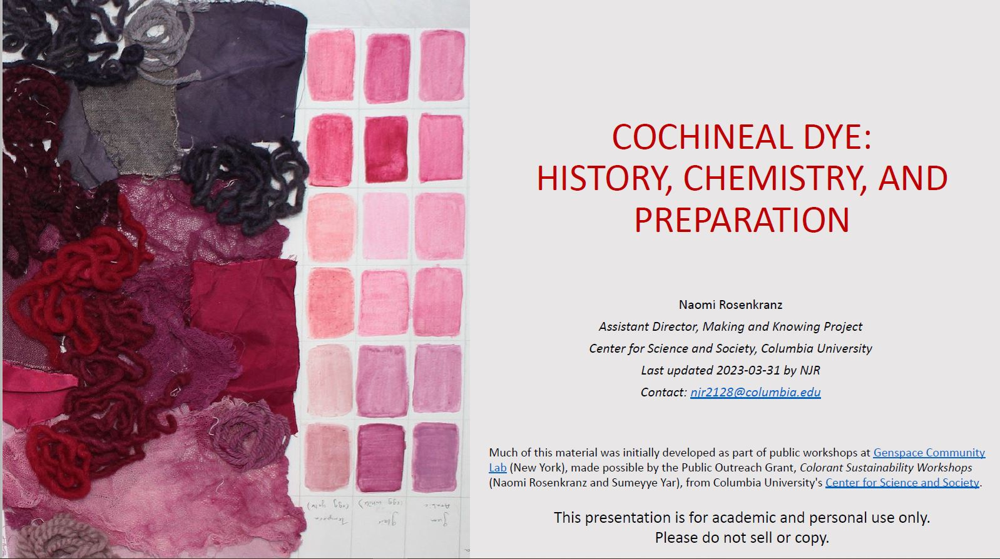

# Dyeing Textiles with Cochineal: A Historical Reconstruction

>_The Making and Knowing Project, Columbia University_ 
_Last updated 2023-03-30 by NJR_

A downloadable version of this assignment: [[PDF](dyes-cochineal_assignment_downloadable_2023.pdf?raw=true)]

## Dyes and natural colorants
If you are not already familiar with historical dyes and natural colorants, refer to [Presentation: Cochineal Dye: History, Chemistry, and Preparation](./2023_dyes_cochineal-history-chem-prep.pdf) for more complete information and further explanation of natural colorants and dyeing.

A dye is "a compound that absorbs into and colors another material" and "is generally a complex organic material" ([Conservation and Art Materials Encyclopedia Online (CAMEO)](http://cameo.mfa.org/wiki/Dye)). Until the onset of synthetic dyes in the mid-nineteenth century, most dyes were sourced from natural colorants such as plants, insects, lichens, and shellfish. 

In order to dye materials (typically textiles, but also wood, paper, and ivory, for example), the natural colorant must first be extracted from the dyestuffs (the plant, insect, etc.). This is most usually done by placing the dyestuffs in water and using either time (soaking) or heat (bringing to a simmer) to extract the soluble colorant into the water. The materials can then be placed into this dye bath to take on color.

Natural dyes can be categorized into one of three processes used to extracted the colorant and dye materials : 
1. Direct dyes
2. Mordant dyes
3. Vat dyes

## Mordant dyes
The largest class of natural dyes is mordant dyes. In this process, textiles must first be treated with a mordant (typically a metal salt or coordination metal) in order to bind the dye more permanently to the textile. The textile binds to the mordant which in turn binds to the colorant. The mordant thus acts as a bridge between the textile and colorant.

The most common mordant is aluminum, typically in the form of alum (aluminum potassium sulfate). Other mordants include iron sulfate, copper sulfate, and tannins.

> Jo Kirby et al, _Natural Colorants for Dyeing and Lake Pigments: Practical Recipes and their Historical Sources_ (Archetype, London, 2014).

## Cochineal

> Cochineal, covered in a white excretion that acts as a protective layer, on a nopal pad (Naomi Rosenkranz, Altadena, CA, 2023)

Cochineal is a scale insect found on prickly pear or Barbary fig cactus (Opuntia ficusindica (L.)).

Species name: Dactylopius coccus

Chemical class: carminic acid (anthraquinone)

Region: Cultivated in Mexico and Peruvian Andes, before Spain brought to Europe in 1523 where it spread rapidly.

> Dried cochineal, purchased from Kremer Pigments, NYC (Naomi Rosenkranz, New York, NY, 2015)

> Phipps, Elena. _Cochineal Red: the Art History of a Color._ New York (N.Y.: The Metropolitan Museum of Art, 2010. Print.)

## Examples of cochineal in art

Cochineal insects have been used for centuries in the Americas as both a red dye and pigment. In the sixteenth century, when they were first brought to Europe, their use proliferated and even continues to this day all around the world. 

## Historical recipe example for cochineal dye

_De' secreti del reverendo signore Alessio Piemontese_ (1558) as translated from the Dutch in Jo Kirby et al, _Natural Colorants for Dyeing and Lake Pigments: Practical Recipes and their Historical Sources_ (Archetype, London, 2014), 37–38.

> _To dye silk carmine._ First, you will rasp or scratch hard soap very finely, and let them [the soap shavings] dissolve in plain water; after that put your silk in a small bag made of linen or fine canvas, and put it in a kettle with the aforesaid soap and water. Let this boil for half an hour, moving it around regularly so it does not burn, then take it from the fire, wash it in salt water, and after that in sour water. Take also to every pound of silk a pound or more of rock alum dissolved in cold water, and be sure there is enough water; wherein you will put your silk without any bag, and let it lay therein without fire for eight hours. Then take it out, wash it in fresh water, then in salt water, and then again in fresh water, and do not let it dry but put it all wet into a kettle with the carmine well pestled and sieved, that is, three ounces for each pound of silk… And when it starts boiling then put in the silk prepared as above, and let it boil for a quarter of an hour. At last you will take it from the fire, and let it dry in the shade, and you will have a very excellent dyeing.

## Modernized recipes, adapted for the laboratory (or kitchen)
Cochineal is a mordant dye. The following recipe has been adapted from Chapter 5, "Recipes," of Jo Kirby et al, _Natural Colorants for Dyeing and Lake Pigments: Practical Recipes and their Historical Sources_ (Archetype, London, 2014). While it is not typically found in recipes for cochineal because it results in a paler color, the additive potash (potassium carbonate) is sometimes added to dye bath in order to affect the color. This is included as an option in the instructions below.

It is necessary to prepare both a mordant bath and a dye bath.

Refer also to: 
- Handout: [Dyeing Instructions: General Mordant and Dye Process](sp23_handout_dyeing-textiles_general-process.pdf)
- [Presentation: Dyeing: Step-by-Step Instructions](rosenkranz_2018_dyes_cochineal-step-by-step.pdf)

 

### Recipe Measurements
Recipes for dyeing textiles often list ratios rather than outright amounts. The weight of textile will determine how much of the other ingredients are needed. The ratios below are provided for 1g of textile. To know how much of the mordant, water, cochineal, and optional additive are needed, first weigh the textiles you plan to dye then multiply that amount by the ratios below. For example, if your textile weigh 10g, you will need 1.25g cochineal and 625ml water.

You can also use: 
- [Activity Sheet: Calculating ratios and amount of material needed](rosenkranz_2019_dyes_handout_reconstruction-exchange_dyeing-with-natural-colorants.pdf) 

**Mordant: Alum**
| Material | Amount /1g (g) |
|----------|----------------|
|  textile |      1.00      |
|   alum   |      0.20      |
|   water  |      50.00     |

**Cochineal**
|      Material     | Amount /1g (g) |
|-------------------|----------------|
|      textile      |      1.00      |
|     cochineal     |      0.125     |
| potash (optional) |     0.0625     |
|       water       |      62.50     |

### Materials and equipment (mordant bath)
- Mordant (such as alum, iron sulfate, etc.)
- Water
- Textiles
- Scale
- Hot plate
- Glass beaker 
- Thermometer
- Stirring stick
- Plate
- Strainer

### Procedure (mordant bath)

- Measure out water into glass beaker
- Add mordant and stir
- Place beaker onto hot plate and turn on (typically, at medium-low)
- Using the thermometer, note the temperature. Stir to dissolve mordant in the water
- Pre-wet textiles with water and wring them out carefully to remove as much water as possible
- When the mordant solution has reached 70 °C, add the textiles
- Heat the textiles for 30 minutes at 80-90 °C, stirring occasionally to ensure homogeneous absorption by the textiles
- NOTE: monitor the temperature of the bath, adjusting the hot plate settings as necessary
- After 30 minutes, remove the textiles from the bath by pouring them into the strainer, discarding the liquid
- Being careful not to damage or felt the textiles, wash them with clean water to remove any mordant that has not bound to the textiles
- Wring out excess water

### Materials and equipment (dye bath)
- Dyestuffs
- Optional: potash
- Mortar and pestle
- Drawstring bag OR filter
- Water
- Textiles 
- Scale
- Hot plate
- Glass beaker
- Thermometer
- Stirring stick
- Plate
- Strainer

### procedure (dye bath)
- Using mortar and pestle, crush dyestuffs to a fine powder or into small pieces
- Measure out water into glass beaker
- To add dyestuffs to water:
     - If using a filter, add dyestuffs directly to the water (you will strain later)
     - If using drawstring bag, add dyestuffs to the bag, close tightly, add bag to water
- If using the optional additive potash, measure out and add to solution
- Place beaker onto hot plate, at medium-low
- Heat the bath (without the textiles) at 80-90 °C for 30 minutes, stirring occasionally
- NOTE: monitor the temperature of the bath, adjusting the hot plate settings as necessary
- After 30 minutes, remove dyestuffs:    
     - If using a filter, carefully strain the solution through filter into a clean beaker. Keep the liquid, not dyestuffs
     - If using a drawstring bag, remove it (no need to strain). You can also leave it in
- Add textiles to the dye bath (it is usually best to pre-wet textiles with water before adding)
- Heat textiles at 80-90 °C for 30 min, stirring occasionally to ensure homogeneous dyeing
- After 30 minutes, remove the textiles from the bath using the strainer
- Being careful not to damage or felt the textile, wash textiles with clean water to remove any dye that has not bound to them
- When the water runs clear over the textiles and no color comes off the textiles, wring out excess water
- Lay out the textiles to dry

## An alternative method to using hotplates and beakers
If you do not have access to hotplates and heat-safe glass beakers, there are other options.

### Dedicated pots
One alternative method is to use dedicated stainless steel or ceramic pots. While most natural colorants are not actively harmful, it is still best practice to avoid consuming them. Some mordants can react with and degrade the surface of cookware, so it is especially important to use pots you will not also use to cook with. To avoid very serious reactions, use stainless steel or ceramic cookware.

### Bain-marie
Another method is to use a water bath or bain-marie (see this [cooking blog](https://www.thekitchn.com/technique-how-to-make-and-use-70190) for more information about bain-maries).

- On your stove at home, prepare your solutions in mason jars (or other glass jars that can withstand prolonged heating such as pickling or jam jars).
- Place the jars in a large cooking pot (the pot's material doesn't matter – can use steel, ceramic, etc.)
  - NOTE: be careful about using these pots to prepare foods after you have dyed with them if you are working with materials that are not food safe.
  - NOTE: the natural colorants can stain light-colored surfaces, so be careful if using ceramic or glass pots.
- Fill the pot with enough water to come up past the solutions in your mason jars, being careful not to contaminate the solutions inside your jars
- Heat the pot on your stove and follow the procedure for preparing lake pigments

**Advantages and notes**

- This is one way to prepare pigments at home without beakers or other shock-resistant containers
- Beakers, Pyrex, and other borosilicate glass is specially formulated to withstand direct high heat (like when placed directly on a hot plate) as well as shocks or sudden changes in temperature (like placing a hot glass vessel with your bath onto a cold surface like a counter)
- Regular glass, including mason jars, are not formulated in this way, and so it can be very dangerous (and messy) if used in the same way as beakers – direct high heat or sudden change can cause the glass to shatter
- This method also allows for easier preparation without a thermometer
- The temperature of your baths is determined by the temperature of the water in the pot
- You will know the baths have approximately reached the desired temperature range of 80-100 °C when the water in the pot is beginning to simmer
- Because water boils and begins to evaporate at 100 °C, your solutions will never exceed 100 °C, the temperature at which the colorants can begin to degrade. This is an easy way to prepare solutions without a thermometer and ensure you are not reaching high temperature levels
- If the water in the pot begins to boil or simmer violently, your jars will start to shake and move around the pot. If this happens, it is a sign to turn your heat down

## Sourcing materials

Mordants and Additives
- Alum (aluminum potassium sulfate)
     - Kremer Pigments, <http://shop.kremerpigments.com/en/>
     - TALAS Bookbinding, Archival & Conservation Supplies, <http://www.talasonline.com/>
     - Loudwolf, <https://www.loudwolf.com/> (available through amazon.com)
- Potash (potassium sulfate)
     - Kremer Pigments, <http://shop.kremerpigments.com/en/>
     - Loudwolf, <https://www.loudwolf.com/> (available through amazon.com)
- Iron sulfate
     - Kremer Pigments, <http://shop.kremerpigments.com/en/>
     - Alpha Chemicals, <https://alphachemicals.com/> (available through amazon.com)
- Copper sulfate
     - Alpha Chemicals, <https://alphachemicals.com/> (available through amazon.com)

Dyestuffs
- Kremer Pigments, <http://shop.kremerpigments.com/en/>. Order online or visit the New York storefront
- Natural Pigments, <https://www.naturalpigments.com/>. Order online
- Maiwa <https://maiwa.com/>. Order online or visit retail locations in Vancouver, Canada

## Additional resources

See the Making and Knowing Project’s [Hands-on Lesson Plans, Activities, Assignments, and Reconstruction Protocols](index-activity-assignments.html)

## Sources of historical evidence 
- Analysis of existing objects, such as surviving textiles and paintings in museum collections
      - However, it must be kept in mind that these represent only a small part of history. They are items that have been selectively collected by museums or upper class. Many were made for or bought by the elite, were luxury or just generally expensive items
- Recipe books and collections, instruction manuals
- Work orders, inventories, accounts, orders for materials, import records, and guild regulations

## References and links
- Kirby, Jo, Maartin van Bommel, André Verhecken, and Marika Spring. *Natural Colorants for Dyeing and Lake Pigments: Practical Recipes and Their Historical Sources*. London: Archetype Publications, 2014.
- Phipps, Elena. *Cochineal Red: the Art History of a Color*. New York (N.Y.: The Metropolitan Museum of Art, 2010. Print.) Full pdf available for free download here: <https://www.metmuseum.org/art/metpublications/cochineal_red_the_art_history_of_a_color>.
- Achim, Miruna. “Cochineal.” In *New World Objects of Knowledge: A Cabinet of Curiosities*, edited by Mark Thurner, Juan Pimentel, and University of London, 177–82. London: Institute of Latin American Studies, School of Advanced Study, University of London, 2021. <https://doi.org/10.14296/2104.9781908857835>. 
- Merrifield, Mary P. *Original Treatises, Dating from the XIIth to XVIIIth Centuries, on the Arts of Painting in Oil, Miniature, Mosaic, and on Glass of Gilding, Dyeing, and the Preparation of Colours and Artificial Gems; Preceded by a General Introd., with Translations, Prefaces, and Notes. J. Murray*, 1849.
- CAMEO: Conservation & Art Materials Encyclopedia Online: <http://cameo.mfa.org/wiki/Main_Page>.
     - CAMEO is a searchable information resource developed by the Museum of Fine Arts, Boston. The MATERIALS database contains chemical, physical, visual, and analytical information on historic and contemporary materials used in the production and conservation of artistic, architectural, archaeological, and anthropological materials.
- Greenfield, Amy Butler. *A Perfect Red Empire, Espionage, and the Quest for the Color of Desire*. Harper Perennial, 2006.
- Padilla, Carmella. *Red like No Other - How Cochineal Colored the World*. Rizzoli International Publicat, 2015.
- Cardon, Dominique. *Natural Dyes: Sources, Tradition, Technology and Science*. Archetype, 2007.
- Gettens, Rutherford J., and George L. Stout. *Painting Materials: a Short Encyclopedia*. Dover Publications, 1966.
- Vejar, Kristine. *The Modern Natural Dyer a Comprehensive Guide to Dyeing Silk, Wool, Linen, and Cotton at Home*. Abrams, 2015.
- Short History of Cochineal Red: <https://artechne.wp.hum.uu.nl/short-history-of-the-cochineal-red/>.
- Putting the Red in Redcoats: <http://www.history.org/foundation/journal/Summer12_newformat/dye.cfm>.
- A short introduction (about cochineal): <https://medium.com/@zip_lehnus/paint-it-red-cochineal-the-wonder-bug-51d280c41d56>
