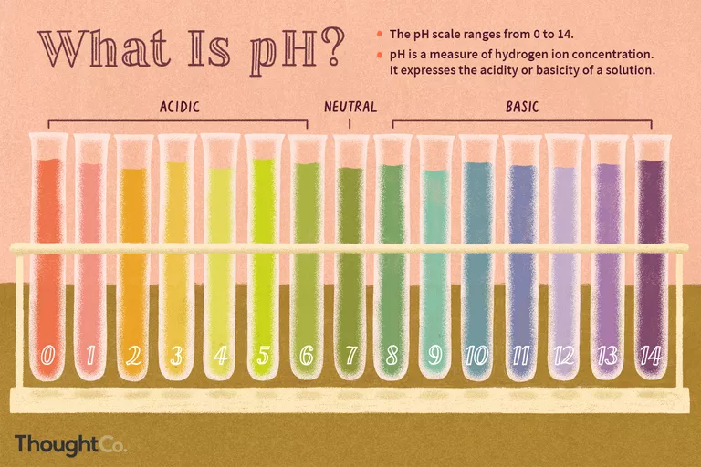
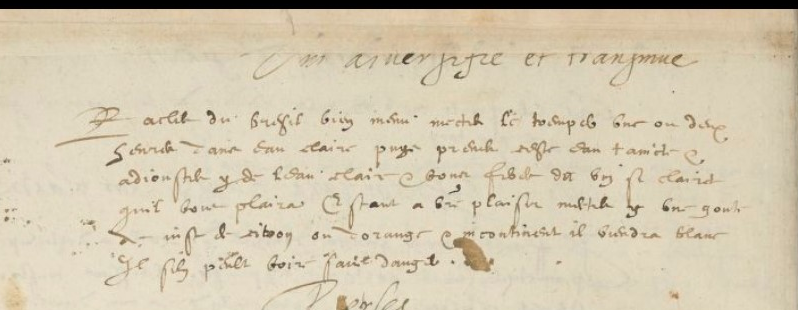

# Instructor Assignment Sheet: Ms. Fr. 640 fol. 43v, “Varied and Transmuted Wine”

by Naomi Alberts, Fall 2021

## Objective:

Introducing and explaining concepts related to pH to students. pH
testing refers to determining how acidic or basic a water-based solution
is. Additionally, getting students to think about the physical property
of color and what a change in color can tell an observer. Finally,
making historical connections between pre-Scientific Revolution and
current/modern scientific views, while also exploring the “boundaries
and relationship between seventeenth-century art and science.”
1

## Terms:

\[can either be provided for the students, or this could be a
discussion-based activity where the class works together to define the
terms\]

-   pH (power of Hydrogen)

-   Acid (acidic/acidity)

-   Base (basic/basicity)

-   Alkaline (alkalinity)

-   Litmus strip/sheet

-   “Transmuted”

Photo Credit: ThoughtCo / Grace Kim,
[<u>https://www.thoughtco.com/definition-of-ph-in-chemistry-604605</u>](https://www.thoughtco.com/definition-of-ph-in-chemistry-604605)

## pH Questions:

-   What is pH? What is the pH of some common liquids? (water, blood, vinegar, salt water)

-   What can pH tell us? Why might it be useful to measure the pH of a liquid?

-   Why might pH be helpful in a lab?

-   What are some physical observations you may make when the pH of a liquid changes?

-   How do you use a pH test strip/take a litmus test?

## Pre Lab Reading and Questions:

**Reading**: Anna Marie Roos, “The Saline Chymistry of Color in
Seventeenth-Century English Natural History” in Early Science and
Medicine 20 (2015): 562-588, doi:
[<u>https://doi.org/10.1163/15733823-02046p11</u>](https://doi.org/10.1163/15733823-02046p11).

1.  What are some of the different views expressed in the reading regarding color and its cause?

2.  What are some of the human activities in which color plays a role? \[Think medicine, art, etc.\]

3.  What did Robert Boyle believe about color and how did he go about proving his theories?

    1.  Additionally, \[perhaps after the lab has been completed\] what similarities do you see between Boyle’s experiments and the “Varied and Transmuted Wine” experiment? What about Hooke’s experiments?

4.  How did Robert Hooke build upon Boyle’s theories, and what was Hooke’s conclusion?

5.  How did Hooke’s artisanal background influence his scientific analysis of color? How did Boyle connect the artisanal and scientific worlds?

# The Manuscript, BnF Ms. Fr. 640:

# 

## [<u>Folio 43v</u>](https://edition640.makingandknowing.org/#/folios/43v/f/43v/tl)

> **Varied and transmuted wine**
>
> Grate brazilwood very finely, put it to soak one or two hours in clear
> water, then take this tinted water & add to it some clear water & you
> will make wine as claret colored as you like. If you please, put a
> drop of lemon or orange juice in it & it will immediately turn white.
> It can be drunk without danger.

In *[<u>Secrets of Craft and Nature in Renaissance France. A Digital
Critical Edition and English Translation of BnF Ms. Fr.
640</u>](https://edition640.makingandknowing.org/#/)*, edited by Making
and Knowing Project, Pamela H. Smith, Naomi Rosenkranz, Tianna Helena
Uchacz, Tillmann Taape, Clément Godbarge, Sophie Pitman, Jenny
Boulboullé, Joel Klein, Donna Bilak, Marc Smith, and Terry Catapano. New
York: Making and Knowing Project, 2020.

## Pre Lab Questions:

1.  Explore Ms. Fr. 640 in *Secrets of Craft and Nature*.

    1.  What are some recurring themes, recipes, materials, processes?

    2.  What about the manuscript is different from your expectations?

    3.  How does the range of recipes support or not support the connection between science and art discussed in the Pre Lab Reading?

2.  What do you notice about the instructions provided on Folio 43v? \[i.e., drawing students’ attention to the lack of measurements provided\]

3.  Based on the Pre Lab Reading, what could be the historical context and purpose of this recipe? \[i.e., what was the author-practitioner hoping to achieve with this recipe?\]

4.  What are the safety precautions you will need to take before starting this lab?

## Lab Activity:

There are two variations of the activity. The materials required are the
same, but the setup for each is different. Begin by choosing either
experiment 1 or 2, then continuing on to the “transformation” section.
For the “transformation” part of the lab, the two experiments will
follow the same instructions.

### Materials:

-   Brazilwood \*

    -   \* most likely substituted with Sappanwood or Logwood, as Brazilwood is now on the endangered species list, and hard to obtain \*

-   A scale that can measure to the hundredth place (i.e., 0.01) in grams \[depending on if you are following experiment 1 or 2, see below\]

-   pH test strips

-   3 empty containers

-   Water

-   1 pre cut lemon, 1 pre cut orange, or some other weak acid

    -   \[presqueezeed lemon juice or orange juice can be substituted\]

-   Pipette or dropper

-   Scoopulas/spoons

### Experiment 1:

1.  Begin by measuring out 50g of water into one of the empty containers. \[optional: Take a baseline pH as a control sample.\]

2.  Measure out 0.04g Sappanwood/Logwood \[Alternatively, try playing around with the ratio of wood:water to “*make wine as claret colored as you like.*”\]

3.  Add the wood to the water and stir. Allow to sit for between 30 minutes and 1 hour to become “wine.” \[Can sit for up to 48 hours in a sealed container.\]

4.  Take the “wine” and pour it into a new container, leaving as much of the ground wood in the original container. \[Try and keep the undissolved wood in the original, but it is okay if some transfers to the new container. Alternatively, students could be separated into groups that remove the wood and groups that don’t in order to compare and contrast the difference at the end.\]

5.  Then add 20g of water.

### Experiment 2:

1.  Begin by discussing as a class how to determine the amount of Sappanwood/Logwood to use in how much water.

2.  After coming up with a ratio of wood:water, add the wood to the water and stir to make “wine.”

3.  Then, \[depending on how long the class period is\] decide \[either as a class, or based on what the teacher determines\] how long to let the “wine” sit.

4.  Return to the “wine” and as a class, discuss whether the wood should stay at the bottom of the solution or not. Once this determination has been made, if removing the wood, pour the “wine” into a separate container. This will make the next step easier.

5.  Add water to the “wine” until the students have determined it looks like a realistic red “wine.”

### Transformation:

\*\*At this point, one may choose to ask students to take the pH of the
“wine.” Additionally, now would be a good time to make observations
about the physical properties of the “wine.” \*\*

1.  Gradually add lemon juice, orange juice, or another acidic liquid to the “wine” until you begin to see parts of the “wine” change to a slightly whitish or yellowish color.

2.  At that point, stop and stir the “wine.”

3.  Continue adding the acid and stirring until no further change in color happens.

4.  After the transformation has occurred, ask students what their thoughts are on the change. Now could be a time to discuss observations from before and after the transformation.

## Post Lab Questions:

1.  What physical properties changed after adding the acid?

2.  Try taking the pH of the “wine.” What does it tell you about the “wine”?

3.  What differences between experiments \[if you did more than one/had multiple student groups\] do you see? What do you think caused those discrepancies?

4.  Why would someone want to transform “wine”/ What was the purpose of this experiment?

5.  Go back to the **Pre Lab Reading and Questions** and the **Pre Lab Questions**. After reviewing your answers, discuss the following as a class:

    1.  How do Boyle’s and Hooke’s experiments and theories connect with the “Varied and Transmuted Wine” experiment?

    2.  What connections do you see between the experiments you read about in the Pre Lab Reading and the experiment you just did?

    3.  Does completing the experiment change how you would answer any of the Pre Lab questions?

## Post Lab Activity:

Watch the [<u>Syrup of Violets Video</u>](https://www.youtube.com/watch?v=pdEbMBe0aa8) by the Folger Library (2011).

1.  What similarities between the Syrup of Violets and the Transmuted Wine experiment do you see? How do you think they are related?

2.  Thinking back to the Pre Lab Reading, what connections do you see between Boyle’s and Hooke’s theories and the Syrup of Violets video?

3.  What do the Syrup of Violets video and the Transmuted Wine experiment tell you about pH before the Scientific Revolution? How is it related to modern scientific practice?

4.  How does a litmus test connect to the experiment you just did? \[Think about what happens to a litmus strip when you place it in a base vs. an acid.\] What about the Pre Lab Reading and Syrup of Violets video?

5.  How is pH connected to the experiment you just did?

    1.  Explain the experiment you just did in reference to pH.

6.  What do you hypothesize would happen to your “wine” if you now added a base?

## Optional Additional Lab:

1.  Taking your transformed “wine”, add 0.25g of potassium carbonate (if using a ratio of 0.04:50g wood to water. If using a different ratio of wood to water, or doing Experiment 2, try adding a small spoonful of the base first or discuss as a class how much to add.)

    1.  Another base may be used if you don’t have access to potassium carbonate. The more basic the substance is, the more drastic/quicker the change will occur.

2.  Stir the solution, and watch the “wine” return to a pinkish color!

3.  Ask students about their observations on this transformation. Was the change as drastic? Did any other physical characteristics of the “wine” change?

\*\* Could also ask students to retake the pH of the “wine” using a
litmus strip. \*\*

## Additional Teaching Resources:

-   [<u>pH Definition and Equation in Chemistry</u>](https://www.thoughtco.com/definition-of-ph-in-chemistry-604605) from ThoughtCo

    -   A general overview of pH, plus an explanation of why some liquids have a pH and others don’t.

-   [<u>pH and Water</u>](https://www.usgs.gov/special-topics/water-science-school/science/ph-and-water?qt-science_center_objects=0#qt-science_center_objects) from the US Geological Survey

    -   Explains the importance of pH to humans, and how a change in pH can show changes in environmental factors

-   [*<u>Secrets of Craft and Nature</u>*](https://edition640.makingandknowing.org/#/) by the Making and Knowing Project

    -   The manuscript that the recipe this experiment is based on comes from, as well as additional resources and essays.

    -   For related essays see: [<u>Sleight of Hand Tricks</u>](https://www.doi.org/10.7916/rfq6-0k88) by Ann-Sophie Barwich and [<u>Varied and Transmuted Wine</u>](https://doi.org/10.7916/6b6c-vt11) by Sayantani Mukherjee

-   [<u>The Making and Knowing Project Sandbox</u>](https://cu-mkp.github.io/sandbox/)

    -   For other fun activities and assignments related to science!

-   [<u>My Field Notes</u>](https://fieldnotes.makingandknowing.org/pre-2018-Fall/fa21_alberts_naomi_varied-trans-wine/fa21_alberts_naomi_variedtranswine.html) + [<u>Photos of my Process</u>](https://flic.kr/s/aHsmXghYKW)

    -   See the different ways that I did this experiment, and view the photo documentation.

    -   Personally, I think this experiment works better when done with lemon juice/a more acidic liquid than with orange juice.
