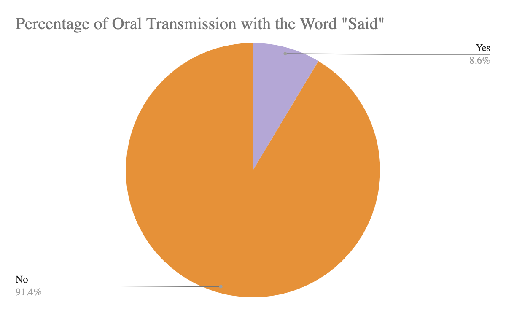
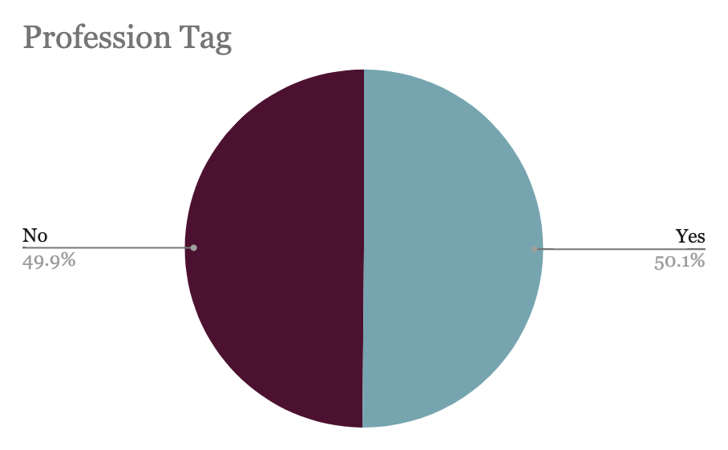
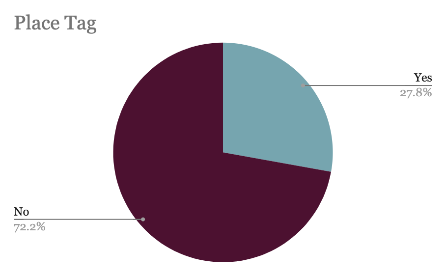
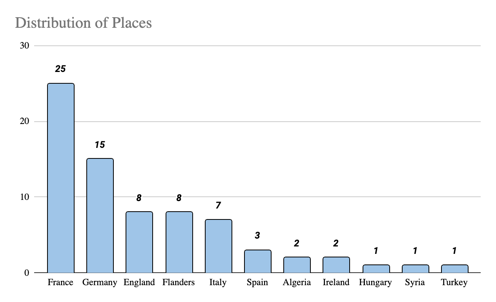
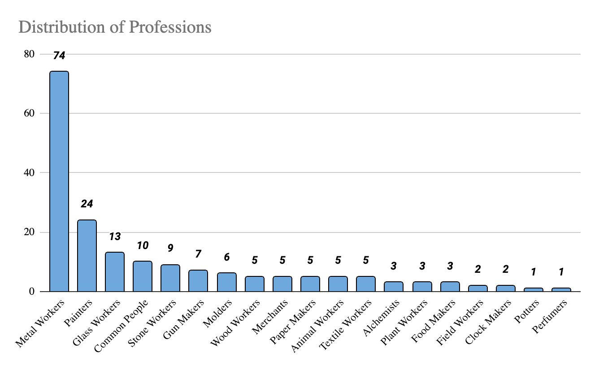

# Oral Culture in Ms. Fr. 640

Hana Ghoneima

Making and Knowing Project, Fall 2021

BnF Ms. Fr. 640 stands at the intersection of a pivotal moment in
history, in which craftspeople who were previously illiterate began
recording their procedures and trade in writing.[1] Within this context,
Ms. Fr. 640 is an illuminating document not only for its content on
craft techniques, but for the historical milestones and trends it
embodies. One of those is oral culture, and its intersection with the
written one. Oral culture is defined as a form of communication in which
knowledge is transmitted orally from one person to another. According to
the historian Jan Vansina, within oral culture "there must be
transmission by word of mouth over at least a generation."[2]
Importantly, oral culture can be interpreted as “Any situation in which
people speak generates messages, some of which may be repeated and hence
start a process of transmission,” and it includes both the process of
oral transmission itself as well as its products.[3] Similarly, oral
culture can also be thought of as “a reconstruction of the past from
oral sources…which will throw light on the particular aspect of social
life under study.”[4] As such, oral culture is understood as the shared
transmission of vernacular experience, and is an important tool for the
study of historical eras in which masses were largely illiterate and
access to written work limited.

Despite the seeming contrast between oral and written sources, there is
significant scholarly interest in the importance of handwritten and
printed knowledge within oral culture. In fact, oral culture cannot be
evaluated independently of written tradition, and the intersection of
the two sheds light on topics such as authenticity and representation.
According to Susan Stewart, “when oral forms are transformed into
‘evidence’ and ‘artefacts,’ they acquire all the characteristics of
fragmentation, symbolic meaning, and literariness that are most valued
by the literary culture.”[5] In this light, studying the written
material of BnF Ms. Fr. 640 is an important tool for understanding the
oral transmission of craft knowledge and production techniques passed
over generations.

As such, the purpose of this project is to locate traces of oral culture
that are dispersed throughout Ms. Fr. 640. For the purpose of this
project, oral culture was defined as any instance in which the
author-practitioner referenced or implied that the knowledge he is
writing of has been acquired from another person or place via hearing or
something that is said. An example of this is in fol.
[<u>36v</u>](https://edition640.makingandknowing.org/#/folios/36v/f/36v/tl):
“One says that in Lorraine & in Flanders well-made glass is made of fern
ashes & pebbles…” Distinct here is his specific reference to having
acquired this knowledge through other people’s talk. This is in contrast
to instances in which he cites books or references written knowledge,
such as in fol.
[<u>162r</u>](https://edition640.makingandknowing.org/#/folios/162r/f/162r/tl),
in which he explains information about the Phoenecians acquired from
Herodotus’ *Clio*. Below, I will lay out the methodology and results of
different approaches I took to evaluating this issue.

## References to “Say” and “Said”

Using the search functionality of Oxygen XML Editor, I compiled lists of
all the times the author-practitioner used the words “say,” “said,”
“hear,” or “heard” throughout the [<u>English translation of the Ms. Fr.
640</u>](https://github.com/cu-mkp/m-k-manuscript-data/tree/master/ms-xml/tl).
Then, I manually went through each entry on the list and
cross-referenced them with their locations in the manuscript to check
for instances where the author-practitioner is specifically referencing
knowledge that is said/heard by another person. For example, on fol.
[<u>21v</u>](https://edition640.makingandknowing.org/#/folios/21v/f/21v/tl),
he writes that “Some say that one should remove…” and in fol.
[<u>43v</u>](https://edition640.makingandknowing.org/#/folios/43v/f/43v/tl)
he writes that “It is said that pulverized talc…” These instances show
direct examples where the author-practitioner is writing down things
that he heard from elsewhere, including facts, techniques, and opinions
of others. With the word “say,” of the 103 total times the word was
used, 32% (n=33) specifically reference something that another person
said and that the author-practitioner is now recording (*Fig. 1*). The
word “said” was used 198 times, of which 8.6% (n=17) specifically
reference something which another person said (*Fig. 2*). However, there
were no instances of this with the words “hear” and “heard.”

*Fig 1*. Percentage of entries using the word “say” which reference oral
transmission (‘*yes’*) versus those which do not (‘*no’*).

*Fig 2*. Percentage of entries using the word “said” which reference
oral transmission (‘*yes’*) versus those which do not (‘*no’*).

-   For a look at all collected data involving the word “say,” please
    > refer to the following
    > [<u>spreadsheet</u>](../data/fa21_ghoneima_hana_final-project_tl_say.xlsx).
    > For a list of all instances of oral transmission of knowledge
    > using the word “say,” please refer to [<u>Appendix
    > 1</u>](#appendix-1-instances-of-oral-transmission-of-knowledge-using-the-word-say).

-   For a look at all collected data involving the word “said,” please
    > refer to the following
    > [<u>spreadsheet</u>](../data/fa21_ghoneima_hana_final-project_tl_said.xlsx).
    > For a list of all instances of oral transmission of knowledge
    > using the word “say,” please refer to
    > [<u>Appendix 2.</u>](#appendix-2-instances-of-oral-transmission-of-knowledge-using-the-word-said)

## Orally Transmitted Knowledge Across Professions and Places

To investigate the presence of oral culture through a different lens, I
went through the profession (“pro”) and place (“pl”) tags within Ms. Fr.
640. These editorial tags are encoded within the digital manuscript to
describe certain words, phrases, and features of the text.[6] The “pro”
tag denotes instances where the author-practitioner references another
recognized trade, such as a painter, while the “pl” tag highlights
specific places that are mentioned in the text, such as France. In my
initial search within the manuscript, I found that there were several
instances where the author-practitioner references things he has heard
or is aware that another profession or people from another place do. For
example, in fol.
[<u>29v</u>](https://edition640.makingandknowing.org/#/folios/29v/f/29v/tl),
he says: “Apothecaries say that anything which does not adhere to …”
denoting that he is writing down something which he heard from
apothecaries, while in fol.
[<u>136v</u>](https://edition640.makingandknowing.org/#/folios/136v/f/136v/tl)
he explains that “Some say that German tokens are …” As such, using
Oxygen, I compiled a list of all the “pro” and “pl” tags within the
manuscript. This resulted in a list of 366 “pro” tags and 266 “pl” tags.
I manually went through each tag and sorted the list of results
according to whether the author was actually referencing the way
something is done or just casually referring to a place/profession. For
example, a 'yes' would be the author-practitioner’s description of how
glass is made in France while a 'no' would be Venice turpentine, which
is not actually referencing the place but is the given name of the
material. Below are the initial graphs showing percentages of the number
of tags actually referencing another place or profession in the context
of how something is done versus tags that are not. Within the profession
tag, 50.1% (n=183) specifically reference transmittable knowledge
regarding the way another profession does something, while 49.9% (n=182)
do not (*Fig. 3*). Within the place tag, 27.8% (n=74) referenced the
author-practitioner's knowledge regarding the way something is done in
another location, while 72.2% (n=192) do not. Entries labeled ‘no’ are
usually general discussions of the profession/place or other
miscellaneous uses (*Fig. 4*).

*Fig 3*. Percentage of entries tagged with “pro” which show evidence of
oral transmission of knowledge (‘*yes’*) versus those which do not
(‘*no’*).

*Fig 4*. Percentage of entries tagged with “pl” which show evidence of
oral transmission of knowledge (‘*yes’*) versus those which do not
(‘*no’*).

These results give an initial look at the presence of oral culture
within the manuscript. Within these tags, the author-practitioner
mentions techniques and recipes done in other places or by other
professions. Often, he specifically includes that he heard this
information, making it clear that it’s orally transmitted, while other
times he is more ambiguous about where he acquired the information from.
As such, one limitation of this textual analysis is that contextual
examination of the surrounding text has to be done to best interpret the
author-practitioner's meaning and determine the source of the
information he is writing of. Nevertheless, in all of these instances,
he is describing a technique done by another profession or place and
physically recording this information into a literary form, and thus
contributing to the trend of transcribing the practices of his field
that have scarcely been recorded before. Further, none of the instances
where he is less explicit about hearing the information include a
citation or reference to another text or written work, making it likely
that he is transcribing knowledge that he acquired not from another text
but rather through the transmission of knowledge via oral methods or
experience.[7]

Within the tags that were categorized as ‘yes’ for indicating a specific
reference to how something is done in another place or profession, I
broke down the categories according to the specific place/profession
mentioned (*Fig. 5-6*).

*Fig 5*. Breakdown of all places mentioned which included reference of
oral transmission of knowledge.

*Fig 6*. Breakdown of all professions mentioned which included reference
of oral transmission of knowledge. For a description of all the
profession categories, please refer to [<u>Appendix
4.</u>](#appendix-4-descriptions-of-profession-categories)

-   For a look at all collected data involving the tag “pro” please
    > refer to the following
    > [<u>spreadsheet</u>](../data/fa21_ghoneima_hana_final-project_tl_pro.xlsx).
    > For a list of all instances of oral transmission of knowledge
    > using the tag “pro,” please refer to
    > [<u>Appendix 3.</u>](#appendix-3-instances-of-oral-transmission-of-knowledge-using-the-profession-tag)
    > For a description of all the profession categories, please refer
    > to
    > [<u>Appendix 4.</u>](#appendix-4-descriptions-of-profession-categories)

-   For a look at all collected data involving the tag “pl,” please
    > refer to the following
    > [<u>spreadsheet</u>](../data/fa21_ghoneima_hana_final-project_tl_pl.xlsx).
    > For a list of all instances of oral transmission of knowledge
    > using the tag “pl,” please refer to
    > [<u>Appendix 5.</u>](#appendix-5-instances-of-oral-transmission-of-knowledge-using-the-place-tag)

## *Women and Peasants Within the Oral Culture of Ms. Fr. 640*

Oral culture was heavily propagated by women and lower-class members of
society. In fact, at the time of the manuscript, books and other written
documents were still largely connected to the upper and elite classes.
As such, women and peasants, many of whom were illiterate, relied on
transmission of knowledge through vernacular modes.[8] At the same time,
these groups of people were also highly involved in the handiwork of the
time. For example, fields were predominantly worked by the lower
classes, and French peasants were hired by merchants to process
harvested grains for importation to urban artisans.[9] As such, it is
likely that peasants held wide-ranging knowledge about various skills
and practices, many of which would have been transferred through
experience and word of mouth. Yet, in Ms. Fr. 640, there are only two
explicit references to techniques employed by peasants. On fol.
[<u>67r</u>](https://edition640.makingandknowing.org/#/folios/67r/f/67r/tl),
the author-practitioner mentions that peasants used taffeta to make
banners, while on fol.
[<u>121v</u>](https://edition640.makingandknowing.org/#/folios/121v/f/121v/tl)
he mentions the type of bowls which peasants eat their soup from.

Similarly, women were highly involved in many of the practices described
in Ms. Fr. 640, including gardening and food storage and preparation,
meaning they were also very knowledgeable in the cultivation and uses of
a variety of plants.[10] Women were also commonly responsible for the
creation of medicine, and many of these recipes were collected by the
women and traded via networks of oral transmission.[11] Yet, despite
this, women have very little presence within Ms. Fr. 640, and none of
the medicinal recipes included are linked to women. In fact, of the
seven mentions of women in the manuscript, only brief references are
included to techniques or recipes employed by them. On fol.
[<u>58r</u>](https://edition640.makingandknowing.org/#/folios/58r/f/58r/tl),
the author-practitioner mentions that “ladies, wanting to color their
cheeks, grind Florence lake very finely, then fill a little cotton with
it, which they next wrap in a little fabric of Cambray which is clear.
And thus they pounce the lake on their cheeks & then, with another clean
cotton, they soften it.” On fol.
[<u>113v</u>](https://edition640.makingandknowing.org/#/folios/113v/f/113v/tl),
we get a reference that women make starch water, giving us subtle
insights into their working lives. Albeit brief, the references to
peasants and women serve the dual purpose of confirming the presence of
both groups in the production processes of the time, while also
highlighting the way in which they were frequently overlooked in the
written traditions that were emerging.

## Conclusion

Although the author-practitioner does not often describe where he
acquired his recipes from, he offers wide-ranging clues to the
importance of oral culture to the acquisition of the knowledge he
describes. For example, many of the medicinal recipes he recounts
include a place of origin. Given that it’s highly unlikely that the
author-practitioner visited those places, it is probable that he
acquired this information orally from others, such as artisans or
travelers.[12] Sometimes, he is more explicit about how he came about
his knowledge, and he often states that he learned of a technique or
recipe from a place or a specific profession.[13] For example, when
describing a salve for burns in fol.
[<u>103r</u>](https://edition640.makingandknowing.org/#/folios/102v/f/103r/tl),
he details that “A gunpowder maker who had almost completely burnt
himself & showed no sign of the burn, taught me this,” further
suggesting that the efficacy of this recipe is tied to the vernacular
mode and first-hand nature of its acquisition. This method of knowledge
gathering is a pattern frequently found throughout the manuscript, and
in this way, Ms. Fr. 640 elucidates the ways in which the advent of
written texts and recorded recipes made long term changes within the
field of artisanal craftsmanship, which had traditionally been passed
down through word of mouth and in apprenticeships. The significance of
this synergy of the oral with the written is that it is
self-perpetuating: the author-practitioner records his knowledge of
recipes and then builds upon them with his own experience and
experimentation. These documents can then spread to others, who can
relate their own experiences to the new written frameworks of
craftsmanship and contribute to the further sustenance of the knowledge.
Interestingly, while the manuscript provides insight into this oral
transmission of recipes, it also serves another function by highlighting
gaps in the records of its history, such as the role of women and
peasants in the transmission of said recipes.

All in all, the folios contained within Ms. Fr. 640 possess immense
value in being the manifestations of real-time circulation of artisanal
knowledge and technique. This spread of knowledge, as facilitated by
print culture, not only exchanged with older forms of oral traditions,
but brought these traditions to the forefront, ushering in a new era for
the exchange and recording of work.

## Bibliography

Anttonen, Pertti, Cecilia af Forselles, and Kirsti Salmi-Niklander, eds.
*Oral Tradition and Book Culture*. Studia Fennica, Folkloristica 24. Helsinki: FinnishLiterature Society (SKS), 2018.

Beik William. *A Social and Cultural History of Early Modern France*.
Cambridge: Cambridge University Press, 2009.

Camps, Celine and Margot Lyautey. “Ma\<r>king and Knowing: Encoding BnF
Ms. Fr. 640.” In *Secrets of Craft and Nature in Renaissance France. A Digital Critical Edition and English Translation of BnF Ms. Fr. 640*, edited by Making and Knowing Project, Pamela H. Smith, Naomi Rosenkranz, Tianna Helena Uchacz, Tillmann Taape, Clément Godbarge, Sophie Pitman, Jenny Boulboullé, Joel Klein, Donna Bilak, Marc Smith, and Terry Catapano. New York: Making and Knowing Project, 2020. [<u>https://edition640.makingandknowing.org/#/essays/ann_335_ie_19</u>](https://edition640.makingandknowing.org/#/essays/ann_335_ie_19).DOI: [<u>https://www.doi.org/10.7916/cjhd-wh90</u>](https://www.doi.org/10.7916/cjhd-wh90)

DeVinney, Joslyn. “Smoke as Medicine.” In *Secrets of Craft and Nature in Renaissance France. A Digital Critical Edition and English Translation of BnF Ms. Fr. 640*, edited by Making and Knowing Project, Pamela H. Smith, Naomi Rosenkranz, Tianna Helena Uchacz, Tillmann Taape, Clément Godbarge, Sophie Pitman, Jenny Boulboullé, Joel Klein, Donna Bilak, Marc Smith, and Terry Catapano. New York: Making and Knowing Project, 2020. [<u>https://edition640.makingandknowing.org/#/essays/ann_048_fa_16</u>](https://edition640.makingandknowing.org/#/essays/ann_048_fa_16). DOI: [<u>https://www.doi.org/10.7916/kfja-0v86</u>](https://www.doi.org/10.7916/kfja-0v86)

Folger Shakespeare Library. “The Food of Shakespeare’s World.” Last modified July 26, 2016. [<u>https://www.folger.edu/shakespeare-unlimited/food-wendy-wall</u>](https://www.folger.edu/shakespeare-unlimited/food-wendy-wall).

Gans, Sofia. “Circulation of Knowledge in Europe.” IIn *Secrets of Craft and Nature in Renaissance France. A Digital Critical Edition and English Translation of BnF Ms. Fr. 640*, edited by Making and Knowing Project, Pamela H. Smith, Naomi Rosenkranz, Tianna Helena Uchacz, Tillmann Taape, Clément Godbarge, Sophie Pitman, Jenny Boulboullé, Joel Klein, Donna Bilak, Marc Smith, and Terry Catapano. New York: Making and Knowing Project, 2020. [<u>https://edition640.makingandknowing.org/#/essays/ann_018_sp_15</u>](https://edition640.makingandknowing.org/#/essays/ann_018_sp_15). DOI: [<u>https://www.doi.org/10.7916/6zzw-s813</u>](https://www.doi.org/10.7916/6zzw-s813)

Gurevich, Aaron J and Ann Shukman. “Oral and Written Culture of the Middle Ages: Two ‘Peasant Visions’ of the Late Twelfth-Early Thirteenth Centuries.” *New Literary History* 16, no. 1 (1984): 51–66. [<u>https://doi.org/10.2307/468775.</u>](https://doi.org/10.2307/468775.)

Kalpagam, U. “Oral History: Reconstructing Women’s Role.” *Economic and Political Weekly* 21, no. 38/39 (1986): 1683–87.

Liu, Xiaomeng. “Collecting Cures in an Artisanal Manuscript: Practical Therapeutics and Disease in Ms. Fr. 640.” In *Secrets of Craft and Nature in Renaissance France. A Digital Critical Edition and English Translation of BnF Ms. Fr. 640*, edited by Making and Knowing Project, Pamela H. Smith, Naomi Rosenkranz, Tianna Helena Uchacz, Tillmann Taape, Clément Godbarge, Sophie Pitman, Jenny Boulboullé, Joel Klein, Donna Bilak, Marc Smith, and Terry Catapano. New York: Making and Knowing Project, 2020. [<u>https://edition640.makingandknowing.org/#/essays/ann_057_sp_17</u>](https://edition640.makingandknowing.org/#/essays/ann_057_sp_17). DOI: [<u>https://www.doi.org/10.7916/wq5p-p848</u>](https://www.doi.org/10.7916/wq5p-p848)

Making and Knowing Project. “BnF Ms. Fr. 640 – Making and Knowing Project.” Accessed December 20, 2021. [<u>https://www.makingandknowing.org/bnf-ms-fr-640/</u>](https://www.makingandknowing.org/bnf-ms-fr-640/).

Vansina, Jan. *Oral Tradition as History*. Madison: University of Wisconsin Press, 1985.

## Appendix 1: Instances of oral transmission of knowledge using the word “say”

| **Description**                                                                                                  | **folio** |
|------------------------------------------------------------------------------------------------------------------|-----------|
| Some say it is not good to distil in this \<tl>\<m>copper\</m>                                                   | 003v      |
| according to the common saying. \<pa>Beans\</pa>                                                                 | 009r      |
| is natural, others say that it is a secret of \<pro>ancient lapidaries\</pro>                                    | 012v      |
| that is lost, others say that it is \<m>refired enamel\</m>. And by means                                        | 012v      |
| \<ab>It is said that if one calls a \<al>snake\</al> in Greek, saying                                            | 013v      |
| all in one go but in two &amp; ramming each time, saying that each                                               | 018r      |
| \<head>Common saying\</head>                                                                                     | 020v      |
| \<ab>Some say that one should remove the ball if the \<wp>cannon\</wp> is loaded                                 | 021v      |
| wall, some say, \<del>for\</del> that is, as if at an                                                            | 025r      |
| \<ab>\<pro>Apothecaries\</pro> say that anything which does not adhere to                                        | 029v      |
| to a certain place and back, he cannot say boot without spur four times                                          | 034r      |
| \<ab>\<mark>X\</mark> If he tries to say\<del>\<fr>a\</fr>\</del>\<comment rid="c_034r_04"/> it,                 | 034r      |
| \<ab>One says that in \<pl>Lorraine\</pl> &amp; in \<pl>Flanders\</pl>                                           | 036v      |
| \<ab>One says that rarely a tree planted on \<tmp>\<pn>St. Paul\</pn>'s                                          | 038v      |
| \<m>aquafortis\</m>; however, one says that \<md>this corrupts them                                              | 046r      |
| afterward &amp; causes a blackness on them\</md>. One says that \<m>oil of                                       | 046r      |
| in a piece of \<m>\<al>beef\</al>\</m>, then boiled, rejoins them, as they say.                                  | 047r      |
| \<pro>Pewterers\</pro> cast in a \<tl>\<m>copper\</m> mold\</tl>.\<comment rid="c_032v_01"/> One says            | 049r      |
| opening the beak, one would say that they are.\<comment rid="c_049v_05"/>                                        | 049v      |
| that it does not want for such food (some say one \<m>egg yolk\</m> per                                          | 052r      |
| say the same for \<m>finely pulverized tripoli\</m> that does not want to                                        | 068v      |
| \<ab render="wide">\<emph>The \<m>blackest lead\</m>\</emph>, so some say, is the best &amp; the softest         | 072v      |
| those who plant the large feet against a slope say that it makes a                                               | 088r      |
| neatly, it will also behave well with \<m>copper\</m>. Some say that the                                         | 088v      |
| \<ab>\<pro>Leadsmiths\</pro> say that making a \<al>lizard\</al> die in the                                      | 098r      |
| one says, for \<ms>℥\</ms>, this is to be understood: on                                                         | 100v      |
| Some say that, mixing the \<m>gold\</m> with the \<m>pebbles\</m> and the                                        | 100v      |
| Others say that it is necessary that the \<m>gold\</m> be cemented several                                       | 100v      |
| \<pa>\<fr>mericoton\</fr> peaches\</pa>, are grafted in clefts. One says                                         | 105v      |
| the cast. Some say that \<m>\<pl>German\</pl> tokens\</m> \<del>are\</del>                                       | 136v      |
| the cast. \<pn>\<pro>Maistre\</pro> Alexandre\</pn>\<comment rid="c_151r_02"/> says that he has never gone wrong | 151r      |
| says that the \<pl>Phoenicians\</pl> would come from the \<pl>Red Sea\</pl>                                      | 162r      |
| royal prophet says, \<del>\<la>\<bp>Manus\</bp> meae\</la>\</del>                                                | 166v      |

## Appendix 2: Instances of oral transmission of knowledge using the word “said”

| **Description**                                                                                                            | **folio** |
|----------------------------------------------------------------------------------------------------------------------------|-----------|
| \<ab>It is said that if one calls a \<al>snake\</al> in Greek, saying                                                      | 013v      |
| was said, &amp; continues thus until the wall is complete,                                                                 | 014r      |
| end of the aforesaid \<tl>ruler\</tl>. Next, they measure with a                                                           | 021v      |
| need, they tighten the said wedges, wedging them with the                                                                  | 030v      |
| \<m>sanguine\</m>, as is said elsewhere, the black &amp; gray &amp;                                                        | 037v      |
| \<ab>One finds \<m>sapphires\</m> that one calls \<df>of the trellis\</df>, because they are pierced and it is said that a | 038r      |
| \<m>wool\</m>, and if it dyes fifteen times, it is said to be fifteen                                                      | 039r      |
| \<ab>It is said that \<m>pulverized talc\</m> blown into with a \<tl>lamp\</tl>                                            | 043v      |
| \<del>\<fr>on\</fr>\</del> is said. Some spin among the leaves &amp; make                                                  | 054r      |
| Try \<m>calcined \<al>oyster\</al> shells\</m>. They are said to be                                                        | 080v      |
| other pieces, saying that the said \<m>glair\</m> makes it come out                                                        | 085v      |
| \<ab>It is said, at the beginning of the book\<comment rid="c_097r_02"/>                                                   | 097r      |
| third time with the doubled \<m>foil\</m>, as has been said, then burnish them                                             | 097r      |
| \<tl>molds\</tl>, as said, then they cast it in \<m>wax\</m>. In that way                                                  | 116v      |
| they cast them in \<m>metal\</m>, as is said.\</ab>                                                                        | 116v      |
| the \<pro>peasants\</pro> eat their soup\</ms>\</tl>, of the aforesaid                                                     | 121v      |
| black &amp; no longer \<m>smoked\</m>. Then, he wetted the aforesaid \<m>tartar\</m>                                       | 128v      |

## Appendix 3: Instances of oral transmission of knowledge using the profession tag

| **Description**                                                                                                                                    | **Label**             | **Category**    | **folio** |
|----------------------------------------------------------------------------------------------------------------------------------------------------|-----------------------|-----------------|-----------|
| promptly dry. \<pro>Frame makers\</pro>, to avoid the trouble of polishing                                                                         | frame maker           | Wood Workers    | 4r        |
| their \<m>ebony\</m>, varnish it with this, as do \<pro>\<mu>guitar\</mu> makers\</pro>.                                                           | guitar maker          | Wood Workers    | 4r        |
| \<tl>file\</tl>. \<pro>Glass button makers\</pro> also avail themselves of                                                                         | glass maker           | Glass Workers   | 6v        |
| being \<m>salted\</m>. \<pro>Joiners\</pro> \<m>glue\</m> their masterpieces                                                                       | joiner                | Wood Workers    | 7r        |
| with it and \<pro>\<mu>guitar\</mu> maker\<ill/>\</pro> use it for delicate works.                                                                 | guitar maker          | Wood Workers    | 7r        |
| \<head>M\<del>\<ill/>\</del>ixture of \<pro>Pewterers\</pro>\</head>                                                                               | pewterer              | Metal Workers   | 8v        |
| \<head>\<pro>Plowman\</pro>\</head>                                                                                                                | plowman               | Field Workers   | 9r        |
| \<pro>harvesters\</pro> beat it most often \<tmp>at night \<env>in the cool                                                                        | harvester             | Field Workers   | 9r        |
| \<head>\<pro>Painter\</pro>\</head>                                                                                                                | painter               | Painters        | 9r        |
| \<head>\<pro>Merchant\</pro>\</head>                                                                                                               | merchant              | Merchants       | 9r        |
| \<head>\<pro>Painter\</pro>\</head>                                                                                                                | painter               | Painters        | 9v        |
| \<head>\<pro>Merchant\</pro>\</head>                                                                                                               | merchant              | Merchants       | 9v        |
| \<ab>\<comment rid="c_009v_03"/>The rule that \<pro>merchants\</pro> are accustomed to keep in their                                               | merchant              | Merchants       | 9v        |
| \<ab>\<pro>Painters\</pro> make it beautiful, making the first ground of                                                                           | painter               | Painters        | 10r       |
| \<pro>\<oc>furbishers\</oc>\</pro> to make a seat                                                                                                  | furbisher             | Metal Workers   | 11v       |
| is natural, others say that it is a secret of \<pro>ancient lapidaries\</pro>                                                                      | lapidaries            | Stone Workers   | 12v       |
| \<tl>\<pro>goldsmith\</pro>’s forge\</tl> with three or four small                                                                                 | goldsmith             | Metal Workers   | 12v       |
| \<pro>gunpowder makers\</pro> profit from them.\</ab>                                                                                              | gunpowder maker       | Gun Workers     | 14r       |
| \<ab render="wide">Most \<pro>people\</pro> consider that \<m>iron\</m>, once melted,                                                              | people                | Common People   | 16r       |
| forges\</tl>, in which it only becomes red-hot. \<pro>Alchemists\</pro>                                                                            | alchemist             | Alchemists      | 16r       |
| The \<pro>miners\</pro>, to make the \<m>iron\</m> run, put at the mouth of                                                                        | miner                 | Metal Workers   | 16r       |
| \<head>On the \<pro>gunner\</pro>\</head>                                                                                                          | gunner                | Gun Workers     | 17r       |
| \<head>\<pro>Glassworker\</pro>\</head>                                                                                                            | glass worker          | Glass Workers   | 20r       |
| \<head>\<pro>Gunner\</pro>\</head>                                                                                                                 | gunner                | Gun Workers     | 21r       |
| \<head>\<pro>Gunner\</pro>\</head>                                                                                                                 | gunner                | Gun Workers     | 25v       |
| one in the middle, one at the mouth. When \<pro>founders\</pro> want to work on their                                                              | founder               | Metal Workers   | 25v       |
| But because some \<pro>gunners\</pro> prefer a \<wp>piece\</wp> which is weighted at the front                                                     | gunner                | Gun Workers     | 25v       |
| \<head>\<pro>Pewterers\</pro>\</head>                                                                                                              | pewterer              | Metal Workers   | 28v       |
| \<env>mine\</env>, because the \<pro>masters\</pro> remelt it \<del>\<fr>a\</fr>\</del> in                                                         | metal worker          | Metal Workers   | 28v       |
| jumble to cheat on the weight. The \<m>tin from \<pl>England\</pl>\</m> is so hard that the \<pro>miners\</pro> put in                             | miner                 | Metal Workers   | 28v       |
| Commonly, the \<pro>sworn master pewterers\</pro> from                                                                                             | pewterer              | Metal Workers   | 28v       |
| tin\</m>. The \<pro>others, who work in the \<env>countryside\</env>\</pro>,                                                                       | worker                | Metal Workers   | 28v       |
| \<ab>\<pro>Apothecaries\</pro> say that anything which does not adhere to                                                                          | apothecary            | Alchemists      | 29v       |
| \<head>\<comment rid="c_030r_02"/>\<pro>Pewterer\</pro>\</head>                                                                                    | pewterer              | Metal Workers   | 30r       |
| \<head>\<pro>Painter\</pro>\</head>                                                                                                                | painter               | Painters        | 31v       |
| \<ab>\<pro>Scribes\</pro> achieve darkening of \<m>lake\</m> &amp; other                                                                           | scribe                | Paper Workers   | 31v       |
| \<head>\<pro>Painter\</pro>\</head>                                                                                                                | painter               | Painters        | 32r       |
| \<ab>Common \<pro>painters\</pro> &amp; \<pro>scribes\</pro> make                                                                                  | painter               | Painters        | 32r       |
| \<ab>Common \<pro>painters\</pro> &amp; \<pro>scribes\</pro> make                                                                                  | painter               | Paper Workers   | 32r       |
| \<head>\<pro>Mat maker\</pro>\</head>                                                                                                              | mat maker             | Textile Workers | 32v       |
| \<head>\<pro>Glassworker\</pro>\</head>                                                                                                            | glass worker          | Glass Workers   | 32v       |
| \<head>\<pro>Founder\</pro>\</head>                                                                                                                | founder               | Metal Workers   | 32v       |
| sold for xxx or 40 \<cn>lb\</cn>. Another, which \<pro>founders\</pro> use,                                                                        | founder               | Metal Workers   | 32v       |
| \<head>\<pro>Founder\</pro>\</head>                                                                                                                | founder               | Metal Workers   | 36v       |
| true that \<pro>foun\<del>\<fr>ables\</fr>\</del>\<add>ders\</add>\</pro> mix in                                                                   | founder               | Metal Workers   | 36v       |
| \<head>\<m>\<pro>Glassworkers\</pro>’ glass\</m>\</head>                                                                                           | glass worker          | Glass Workers   | 36v       |
| \<pro>worker\</pro>, with long shears, cleaves &amp; cuts lengthwise.                                                                              | worker                | Glass Workers   | 36v       |
| \<head>\<pro>Founder\</pro>\</head>                                                                                                                | founder               | Metal Workers   | 37r       |
| \<head>\<pro>Gardener\</pro>\</head>                                                                                                               | gardener              | plant worker    | 37v       |
| \<head>\<pro>Glassworker\</pro>\</head>                                                                                                            | glass worker          | Glass Workers   | 37v       |
| \<pro>glassworker\</pro> who is working has a \<sn>stench\</sn> from his                                                                           | glass worker          | Glass Workers   | 37v       |
| certain \<pro>king\</pro> had made from these a certain ornament in the                                                                            | king                  | Stone Workers   | 38r       |
| \<ab>\<pro>Stone cutters\</pro> sometimes choose old pieces of \<m>antique                                                                         | stone cutter          | Stone Workers   | 38r       |
| \<head>\<pro>Merchant\</pro>\<comment rid="c_038v_02"/>\</head>                                                                                    | merchant              | Merchants       | 38v       |
| \<head>\<pro>Goldsmith\</pro>\</head>                                                                                                              | goldsmith             | Metal Workers   | 39r       |
| This is why, to save money, \<pro>goldsmiths\</pro> use it to assemble, in                                                                         | goldsmith             | Metal Workers   | 39r       |
| \<ab>When \<pro>goldsmiths\</pro> have thus assembled their \<m>silver                                                                             | goldsmith             | Metal Workers   | 39r       |
| the soil with \<tl>shovels of \<m>iron\</m>\</tl>, as \<pro>gardeners\</pro> do.                                                                   | gardener              | plant worker    | 39r       |
| \<tl>\<pro>dyers\</pro>’ vat\</tl>, and to fill a \<tl>vat\</tl> with it, one                                                                      | dyer                  | Painters        | 39r       |
| fashion of \<pro>glassworkers\</pro>, who wash their \<m>glass pane\</m> with                                                                      | glass worker          | Glass Workers   | 39v       |
| \<pro>goldsmiths\</pro>, \<m>gild\</m> your entire \<m>glass pane\</m> with                                                                        | goldsmith             | Metal Workers   | 39v       |
| being pressed by \<pro>vintagers\</pro>, but it does not keep, &amp;                                                                               | vintager              | plant worker    | 40r       |
| which the \<pro>painters\</pro> use, but a thicker kind, which is                                                                                  | painter               | Painters        | 40v       |
| burnished by \<pro>those who make \<m>gemstone foils\</m>\</pro>                                                                                   | gemstone maker        | Stone Workers   | 40v       |
| \<del>\<fr>Av\</fr>\</del> or by \<pro>goldsmiths\</pro>, &amp; that gives it                                                                      | goldsmith             | Metal Workers   | 40v       |
| \<ab>\<pro>Founders\</pro> do not melt \<m>latten\</m> in a                                                                                        | founder               | Metal Workers   | 40v       |
| \<head>\<m>Earth for casting, for \<pro>founders\</pro>\</m>\</head>                                                                               | founder               | Metal Workers   | 41r       |
| \<ab>If the \<pro>shearer\</pro> sometimes wounds them, he puts                                                                                    | shearer               | animal workers  | 41v       |
| \<comment rid="c_041v_01"/>If the \<pro>shearer\</pro> wants to                                                                                    | shearer               | animal workers  | 41v       |
| \<head>\<pro>Arquebusier\</pro>\</head>                                                                                                            | arquebusier           | Gun Workers     | 43v       |
| \<head>\<pro>Pewterer\</pro>\</head>                                                                                                               | pewterer              | Metal Workers   | 44r       |
| masters\</pro>\</env>. But elsewhere, they add as much as they can. One                                                                            | master                | Metal Workers   | 44r       |
| that \<pro>coppersmiths\</pro> make\</m>. This makes the plate more                                                                                | coppersmith           | Metal Workers   | 44r       |
| \<ab>If the \<pro>scribe\</pro> wants to clean his \<tl>quill\</tl> promptly                                                                       | scribe                | Paper Workers   | 46v       |
| \<head>\<pro>Shoemaker\</pro>\</head>                                                                                                              | shoe maker            | Textile Workers | 46v       |
| \<tl>those for \<pro>glassmakers\</pro>\</tl>, as \<m>glass\</m> is not as                                                                         | glass maker           | Glass Workers   | 47v       |
| \<head>\<pro>Founder\</pro>\</head>                                                                                                                | founder               | Metal Workers   | 48r       |
| \<del>One\</del> \<pro>Pewterers\</pro> put in \<del>on the \<m>fine                                                                               | pewterer              | Metal Workers   | 48v       |
| by the \<pro>pewterers\</pro> to sell it better. \<del>\<fr>O\</fr>\</del>                                                                         | pewterer              | Metal Workers   | 48v       |
| \<pro>Pewterers\</pro> cast in a \<tl>\<m>copper\</m> mold\</tl>.\<comment rid="c_032v_01"/> One says                                              | pewterer              | Metal Workers   | 49r       |
| They cast with \<m>solder\</m> that \<del>\<pro>pewterers\</pro>\</del>                                                                            | pewterer              | Metal Workers   | 49r       |
| \<add>\<pro>glassworkers\</pro>\</add> use. \</ab>                                                                                                 | glass worker          | Glass Workers   | 49r       |
| \<head>\<pro>Pewterers\</pro>\</head>                                                                                                              | pewterer              | Metal Workers   | 49r       |
| \<ab>The \<m>steel\</m> that \<pro>farriers\</pro> &amp; \<pro>\<m>iron\</m>                                                                       | farrier               | animal workers  | 50v       |
| workers\</pro> commonly use is not refined like that from                                                                                          | workers               | Metal Workers   | 50v       |
| comes from the \<env>mine\</env>. And the \<pro>workers\</pro> choose it                                                                           | workers               | Metal Workers   | 50v       |
| \<head>\<pro>Cutters of \<tl>printing plates\</tl>\</pro>\</head>                                                                                  | printing plate cutter | Metal Workers   | 51r       |
| \<ab>which is different from that of the \<pro>printers\</pro>, one needs                                                                          | printer               | Paper Workers   | 51v       |
| of the \<pro>worker\</pro> is \<del>to it\</del> to use the heat of its                                                                            | worker                | animal workers  | 52r       |
| \<pro>merchants\</pro> bring there is considered the best because the                                                                              | merchant              | Merchants       | 53v       |
| \<head>\<comment rid="c_057v_01"/>\<pro>Sheath maker\</pro>\</head>                                                                                | sheath maker          | Textile Workers | 57v       |
| \<ab>\<pro>Sheath makers\</pro> use \<m>small, very delicate skins of                                                                              | sheath maker          | Textile Workers | 57v       |
| \<pro>tanners\</pro> do. And this \<m>dye\</m>, being astringent, makes the                                                                        | tanner                | Textile Workers | 57v       |
| \<head>\<underline>\<pro>Painter\</pro>\</underline>\<comment rid="c_057v_04"/>\</head>                                                            | painter               | Painters        | 57v       |
| easily. \<pl>Flemish\</pl> \<pro>painters\</pro> have such panels                                                                                  | painter               | Painters        | 60r       |
| this reason, \<pro>painters\</pro> use it to clean their \<tl>\<m>oil\</m>                                                                         | painter               | Painters        | 60v       |
| them. Also, \<pro>painters\</pro>, sometimes envious of the work                                                                                   | painter               | Painters        | 60v       |
| \<pro>illuminators\</pro>, and grind their colors very finely, protect                                                                             | illuminator           | Painters        | 60v       |
| \<head>\<m>Water\</m> to give light for the \<pro>painter\</pro>\</head>                                                                           | painter               | Painters        | 61v       |
| \<ab>\<pl>German\</pl> \<pro>painters\</pro> make their shadows on flesh                                                                           | painter               | Painters        | 63r       |
| The \<pro>painter\</pro> also teaches himself with the \<tl>mirror\</tl>,                                                                          | painter               | Painters        | 65r       |
| \<pro>Illuminators\</pro> painting on \<m>paper\</m> temper their colors                                                                           | illuminator           | Painters        | 65v       |
| \<pro>Painters\</pro> must all learn how to depict after nature, for to them                                                                       | painter               | Painters        | 65v       |
| supports \<m>oil\</m>. It is with this that \<pro>painters\</pro> trick the                                                                        | painter               | Painters        | 67r       |
| by \<pro>locksmiths\</pro> for their rough work are only made of                                                                                   | locksmith             | Metal Workers   | 67v       |
| \<m>steel\</m>. \<pro>Founders\</pro> whose work is to repair \<m>latten\</m>                                                                      | founder               | Metal Workers   | 67v       |
| that \<pro>painters\</pro> use\</m>. It releases very neatly, does not want                                                                        | painter               | Painters        | 68r       |
| the \<del>\<fr>p\</fr>\</del>\<comment rid="c_068v_01"/> colors that the \<pro>painters\</pro> grind for \<m>oil\</m>. This one, once dry, you can | painter               | Painters        | 68v       |
| burnished in little wheels that \<pro>pewterers\</pro> sell, comes out                                                                             | pewterer              | Metal Workers   | 68v       |
| \<head>\<pro>Joiner\</pro>\</head>                                                                                                                 | joiner                | Wood Workers    | 69r       |
| The \<pl>Toulouse\</pl> \<pro>molder\</pro> reheats it strongly then grinds                                                                        | molder                | Molders         | 69r       |
| \<ab>\<pro>Founders\</pro> do cast \<tl>frames\</tl> up to 30 or 40 \<ms>lb\</ms>,                                                                 | founder               | Metal Workers   | 69v       |
| \<pro>rich\</pro> people of \<pl>England\</pl> make their ceilings from this                                                                       | common people         | Common People   | 71v       |
| \<pro>cutlers\</pro>\</m>, because it is only \<m>sludge\</m>, but rather those                                                                    | cutler                | Stone Workers   | 71v       |
| Some, such as \<pro>printers\</pro>, mix \<m>iron or pin filings\</m>                                                                              | printer               | Paper Workers   | 72v       |
| \<ab>\<pro>Founders\</pro>, to make the handles of their bells, use it. And                                                                        | founder               | Metal Workers   | 77r       |
| \<pro>pewterers\</pro> use to make plate, which is composed of 9 or                                                                                | pewterer              | Metal Workers   | 79v       |
| \<pro>potters\</pro> make a whitening on pots\</m> to make \<m>lead\</m> run                                                                       | potter                | potter          | 81r       |
| \<head>\<pro>Clockmakers\</pro>\</head>                                                                                                            | clockmaker            | clock makers    | 82r       |
| \<head>\<pro>Clockmakers\</pro>\</head>                                                                                                            | clockmaker            | clock makers    | 82v       |
| \<m>\<tl>lute\</tl>\</m> it as you know \<pro>founders\</pro> do. And also, one ought                                                              | founder               | Metal Workers   | 82v       |
| \<head>\<pro>Founder\</pro>\</head>                                                                                                                | founder               | Metal Workers   | 85v       |
| \<ab>Some \<emph>\<pro>founders\</pro>\</emph> have this superstition,                                                                             | founder               | Metal Workers   | 87r       |
| \<ab>\<emph>\<pro>Founders\</pro>\</emph>, in order to prevent their large cast                                                                    | founder               | Metal Workers   | 87r       |
| \<ab>\<pro>Founders\</pro> take the \<m>roots of a young \<pa>elm\</pa>\</m>                                                                       | founder               | Metal Workers   | 87v       |
| \<head>\<pro>Baker\</pro>\</head>                                                                                                                  | baker                 | Food Workers    | 88r       |
| \<pro>Artisans who work in large works\</pro> &amp;, who for profit, do not                                                                        | artisan               | Stone Workers   | 88v       |
| \<ab>\<pro>Molders\</pro> from \<pl>Foix\</pl> who cast their \<del>\<fr>ur\</fr>\</del>\<comment rid="c_090r_01"/>                                | molder                | Molders         | 90r       |
| \<ab>\<pro>Artisans who work in large works\</pro> &amp; who need to further                                                                       | artisan               | Stone Workers   | 90r       |
| \<pro>artisans\</pro> willingly gather. And thus, if they do                                                                                       | artisan               | Stone Workers   | 90r       |
| \<pro>painters\</pro> bring their \<tl>palette\</tl> to the                                                                                        | painter               | Painters        | 93v       |
| \<pro>grocers\</pro>, &amp; temper &amp; alloy it with a little white                                                                              | grocer                | Painters        | 93v       |
| \<ab>\<pro>Those who create \<wp>sword guards\</wp>\</pro> are \<pro>artisans\</pro>                                                               | sword guard maker     | Metal Workers   | 94v       |
| \<ab>The \<pro>furbisher\</pro> buys his blades by the \<ms>dozen\</ms>, which                                                                     | furbisher             | Metal Workers   | 95r       |
| \<ab>The first thing the \<pro>furbisher\</pro> does when he gets his new                                                                          | furbisher             | Metal Workers   | 95r       |
| \<pro>locksmiths\</pro> or \<pro>farriers\</pro>, giving him some                                                                                  | locksmith             | Metal Workers   | 95r       |
| \<pro>locksmiths\</pro> or \<pro>farriers\</pro>, giving him some                                                                                  | farrier               | Metal Workers   | 95r       |
| \<ab>The \<pro>furbishers\</pro> buy them by \<ms>dozens\</ms>, the                                                                                | furbisher             | Metal Workers   | 95v       |
| \<ab>Then the \<pro>furbisher\</pro> puts them on a small bench, called a                                                                          | furbisher             | Metal Workers   | 95v       |
| scabbard to be well made. It is true that for \<pro>common people\</pro>,                                                                          | common people         | Common People   | 96r       |
| \<tl>\<pro>furbishers\</pro>’ furnace\</tl>, without them touching the                                                                             | furbisher             | Metal Workers   | 96v       |
| \<head>\<pro>Locksmith\</pro>\</head>                                                                                                              | locksmith             | Metal Workers   | 98r       |
| \<ab>\<pro>Leadsmiths\</pro> say that making a \<al>lizard\</al> die in the                                                                        | leadsmith             | Metal Workers   | 98r       |
| \<m>leaded\</m> or vitrified. I believe that \<pro>glassmakers\</pro> could                                                                        | glass maker           | Glass Workers   | 99r       |
| &amp; some &amp; the \<pro>common people\</pro> put in                                                                                             | common people         | Common People   | 100v      |
| \<pro>glassmakers\</pro>' or \<pro>apothecaries\</pro>'. But \<m>alkali                                                                            | glass maker           | Glass Workers   | 100v      |
| \<pro>glassmakers\</pro>' or \<pro>apothecaries\</pro>'. But \<m>alkali                                                                            | apothecary            | Alchemists      | 100v      |
| In this way, the \<pro>common people\</pro> make \<m>emeralds\</m> &amp; cast in                                                                   | common people         | Common People   | 100v      |
| \<pro>gunpowder maker\</pro> who had almost completely burnt himself                                                                               | gunpowder maker       | Gun Workers     | 103r      |
| \<head>\<pro>Goldsmith\</pro>\</head>                                                                                                              | goldsmith             | Metal Workers   | 104v      |
| \<head>\<pro>Painter\</pro>\</head>                                                                                                                | painter               | Painters        | 105r      |
| \<head>\<pro>Fountain maker\</pro>\</head>                                                                                                         | fountain maker        | Stone Workers   | 105v      |
| water\</env>, which \<pro>\<al>crayfish\</al> catchers\</pro>                                                                                      | crayfish catcher      | animal workers  | 107r      |
| them\</pro> did not take this into account, &amp; assured me that there                                                                            | molder                | Molders         | 110r      |
| stick which \<pro>pastry makers\</pro>\</tl> use, which should be a little                                                                         | pastry maker          | Food Workers    | 112v      |
| water\</m> that \<pro>women\</pro> use to make their \<m>starch\</m>. For                                                                          | women                 | Common People   | 113v      |
| \<m>Sublimate\</m> is commonly employed by \<pro>goldsmiths\</pro> for                                                                             | goldsmith             | Metal Workers   | 120r      |
| \<pro>goldsmiths\</pro> \<del>use\</del> \<add>use\</add> to work                                                                                  | goldsmith             | Metal Workers   | 120v      |
| The \<m>sand with which \<pro>goldsmiths\</pro> buff \<m>enamels\</m> or the                                                                       | goldsmith             | Metal Workers   | 121r      |
| white one that \<pro>glassmakers\</pro> use\</m>, &amp; \<m>any lean sand that does                                                                | glass maker           | Glass Workers   | 121r      |
| the \<pro>peasants\</pro> eat their soup\</ms>\</tl>, of the aforesaid                                                                             | peasant               | Common People   | 121v      |
| waste which \<pro>founders\</pro> use to cast their \<wp>cannons\</wp>\</m>, or any                                                                | founder               | Metal Workers   | 121v      |
| \<pro>Goldsmiths\</pro> who have knowledge of this substance sell a                                                                                | goldsmith             | Metal Workers   | 123r      |
| \<pro>goldsmiths\</pro>, &amp; especially to \<pro>those who work in plate                                                                         | goldsmith             | Metal Workers   | 123r      |
| furnace\</tl>. So that when \<pro>goldsmiths\</pro> want to cast some                                                                              | goldsmith             | Metal Workers   | 124v      |
| \<ab>The \<pro>workers\</pro> from \<pl>Damascus\</pl> or from                                                                                     | workers               | Metal Workers   | 125r      |
| \<pro>goldsmiths\</pro> do not put any in, nevertheless it is good, and I have                                                                     | goldsmith             | Metal Workers   | 128v      |
| \<pro>goldsmiths\</pro> \<del>from \<pl>France\</pl>\</del> are usually quick                                                                      | goldsmith             | Metal Workers   | 128v      |
| color you want. This is the \<m>wax\</m> \<pro>goldsmiths\</pro> use for                                                                           | goldsmith             | Metal Workers   | 133r      |
| \<ab>\<pro>Goldsmiths\</pro> scrape \<m>gold leaf\</m> with the \<tl>brim of a burin\</tl>,                                                        | goldsmith             | Metal Workers   | 136r      |
| you cast it. \<pro>Casters\</pro> do not usually take that \<m>very yellow                                                                         | caster                | Molders         | 136v      |
| work of the \<pro>founder\</pro>, for one only needs a \<env>\<po>spring\</po> of                                                                  | founder               | Metal Workers   | 137r      |
| \<ab>When \<pro>goldsmiths\</pro> have something to \<m>solder\</m> promptly                                                                       | goldsmith             | Metal Workers   | 138v      |
| \<head>\<pro>Molders\</pro> from \<pl>Foix\</pl>\</head>                                                                                           | molder                | Molders         | 143r      |
| \<pro>Goldsmiths\</pro> from \<pl>Germany\</pl> wanted to refine it,                                                                               | goldsmith             | Metal Workers   | 149r      |
| \<ab>\<pro>Goldsmiths who work in large wares and plate\</pro> get whatever                                                                        | goldsmith             | Metal Workers   | 149v      |
| the cast. \<pn>\<pro>Maistre\</pro> Alexandre\</pn>\<comment rid="c_151r_02"/> says that he has never gone wrong                                   | molder                | Molders         | 151r      |
| Some \<pro>goldsmiths\</pro> assay it on \<m>gold, thinly beaten                                                                                   | goldsmith             | Metal Workers   | 157r      |
| \<ab>As \<pro>small peddlers\</pro> lay open small wares in order to buy                                                                           | peddler               | Common People   | 162r      |
| secrets from my benevolent \<pro>readers\</pro>.\
\</ab>                                                                                       |                       | Common People   | 162r      |
| \<head>\<pro>Perfumer\</pro>\</head>                                                                                                               | perfumer              | Perfumer        | 163r      |
| If something is omitted: the \<pro>harvester\</pro> is not reproached for                                                                          | harvester             | Food Workers    | 166r      |
| \<ab>If any \<pro>artisans\</pro> complain                                                                                                         | artisan               | Common People   | 166r      |

## Appendix 4: Descriptions of profession categories

| **Profession Category** | **Description**                                                                                                  |
|-------------------------|------------------------------------------------------------------------------------------------------------------|
| Metal Workers           | Those whose work primarily involves metal, such as goldsmiths and founders                                       |
| Painters                | Painters                                                                                                         |
| Glass Workers           | Those whose work primarily involves glass, directly referenced to as glass workers in the manuscript             |
| Common People           | In reference to a daily life practice not specially tied to a profession, such as something peasants like to eat |
| Stone Workers           | Those whose work primarily involves stone, such as stone cutters                                                 |
| Gun Makers              | Those involved in any part of the gun making process                                                             |
| Molders                 | Molders                                                                                                          |
| Wood Workers            | Those whose work primarily involves wood, such as joiners                                                        |
| Merchants               | Merchants                                                                                                        |
| Paper Makers            | Those whose work primarily involves paper, such as scribes and printers                                          |
| Animal Workers          | Those whose work primarily involves animals, such as shearers                                                    |
| Textile Workers         | Those whose work primarily involves textiles, such as shoe makers                                                |
| Alchemists              | Those specially referenced to as alchemists as well as apothecary workers                                        |
| Plant Workers           | Those whose work primarily involves plants, such as gardeners                                                    |
| Food Makers             | Those involved in making food, such as bakers                                                                    |
| Field Workers           | Those whose work is primarily tied to fields, such as plowman and harvesters                                     |
| Clock Makers            | Those involved in any part of the clock making process, specifically referenced to as clock makers               |
| Potters                 | Potters                                                                                                          |
| Perfumers               | Perfumers                                                                                                        |

## Appendix 5: Instances of oral transmission of knowledge using the place tag

| **Description**                                                                                                                                                          | **folio** | **Label**              | **Category** |
|--------------------------------------------------------------------------------------------------------------------------------------------------------------------------|-----------|------------------------|--------------|
| the \<pl>Faubourg Saint-Germain\</pl>,\<comment rid="c_001r_76"/> knows of the                                                                                           | 001r      | Faubourg Saint-Germain | France       |
| \<pa>\<fr>\<oc>pomole\</oc>\</fr>\</pa>\<comment rid="c_009r_01"/> in \<pl>Gascony\</pl> or                                                                              | 009r      | Gascony                | France       |
| \<pa>\<fr>baillard\</fr>\</pa> in \<pl>France\</pl>,\<comment rid="c_009r_02"/> makes the earth shake seven \<tmp>years\</tmp> later,                                    | 009r      | France                 | France       |
| \<ab>It is made in \<pl>Lyon\</pl> from the \<m>juice of weld\</m> &amp;                                                                                                 | 010r      | lyon                   | France       |
| who make it in \<pl>Germany\</pl> compound it like \<m>enamel\</m>, in large                                                                                             | 011r      | Germany                | Germany      |
| one from the region of \<pl>Albi\</pl> is whiter. It must be cooked with a                                                                                               | 012r      | albi                   | France       |
| \<pl>Montauban\</pl> make, it is necessary to snuff it out often, for                                                                                                    | 016v      | montauban              | France       |
| \<ab>\<m>Glass from \<pl>Lorraine\</pl>\</m> is smoother &amp; more even than                                                                                            | 020r      | lorraine               | France       |
| \<m>drugs\</m> that the \<pro>glassworkers\</pro> put on. \<m>Glass from \<pl>Lorraine\</pl>\</m> is sold by the \<ms>bundle\</ms>\<comment rid="c_020r_04"/> &amp; each | 020r      | lorraine               | France       |
| \<pl>Toulouse\</pl> named Cardaillac\<comment rid="c_020v_02"/> as one of the most beautiful in                                                                          | 020v      | toulouse               | France       |
| \<pl>France\</pl>, all the more since it weighs two hundred and fifty                                                                                                    | 020v      | France                 | France       |
| Know the magazines of \<pl>France\</pl> for the                                                                                                                          | 024v      | France                 | France       |
| is 8 \<ms>\<pl>Montpellier\</pl> \<fr>pans\</fr>\</ms>\</head>                                                                                                           | 027v      | montpellier            | France       |
| jumble to cheat on the weight. The \<m>tin from \<pl>England\</pl>\</m> is so hard that the \<pro>miners\</pro> put in                                                   | 028v      | England                | England      |
| makes ceiling ornaments with it in \<pl>Rome\</pl>. One can make bed                                                                                                     | 029r      | rome                   | Italy        |
| \<ab>As soon as the colors of panels are well dried, the \<pl>Flemish\</pl>                                                                                              | 032r      | flemish                | Flanders     |
| \<ab>They make two kinds of them in \<pl>Toulouse\</pl>, one to hang on the                                                                                              | 032v      | toulouse               | France       |
| why \<m>solder\</m> is made with it. In \<pl>Germany\</pl> they make very                                                                                                | 032v      | Germany                | Germany      |
| \<ab>One says that in \<pl>Lorraine\</pl> &amp; in \<pl>Flanders\</pl>                                                                                                   | 036v      | lorraine               | France       |
| \<ab>One says that in \<pl>Lorraine\</pl> &amp; in \<pl>Flanders\</pl>                                                                                                   | 036v      | Flanders               | Flanders     |
| It is made in the same way in \<pl>England\</pl> more beautifully.                                                                                                       | 036v      | England                | England      |
| Near \<pl>Rouen\</pl> in \<pl>France\</pl>, \<m>plate glass\</m> is made with                                                                                            | 036v      | rouen                  | France       |
| Near \<pl>Rouen\</pl> in \<pl>France\</pl>, \<m>plate glass\</m> is made with                                                                                            | 036v      | rouen                  | France       |
| salt\</m>\</tl> over it, which an \<pl>Englishman\</pl> called                                                                                                           | 037v      | english                | England      |
| \<ab>They are made at \<pl>Coustance\</pl> in \<pl>Normandy\</pl> with                                                                                                   | 044v      | coustance              | France       |
| \<ab>They are made at \<pl>Coustance\</pl> in \<pl>Normandy\</pl> with                                                                                                   | 044v      | coustance              | France       |
| xxx \<ms>\<cn>sous\</cn>\</ms>. They bring them to \<pl>Toulouse\</pl> to                                                                                                | 044v      | toulouse               | France       |
| transport them afterward to \<pl>Spain\</pl>, and take \<m>silk tammy\</m>                                                                                               | 044v      | Spain                  | Spain        |
| \<ab>Those from \<pl>Bayonne\</pl>, which seem to be made of                                                                                                             | 047r      | bayonne                | France       |
| reduce to a mass. The \<pl>Germans\</pl> make their \<tl>files\</tl> from                                                                                                | 050v      | germans                | Germany      |
| \<head>The work done in \<pl>Algiers\</pl>\</head>                                                                                                                       | 052r      | algiers                | Algeria      |
| &amp; make more \<m>silk\</m>. In \<pl>Spain\</pl>, from one \<ms>ounce\</ms> of                                                                                         | 053v      | Spain                  | Spain        |
| The \<pl>Italians\</pl> soften by hatching with a large flattened                                                                                                        | 056v      | italians               | Italy        |
| \<ab>The \<pl>Flemish\</pl> do not use any whites for flesh colors in                                                                                                    | 057v      | flemish                | Flanders     |
| well. \<comment rid="c_059r_01"/>The \<pl>Italians\</pl> commonly make three shadows, the first one,                                                                     | 059r      | italians               | Italy        |
| easily. \<pl>Flemish\</pl> \<pro>painters\</pro> have such panels                                                                                                        | 060r      | flemish                | Flanders     |
| \<head>Work of the \<pl>Flemish\</pl>\</head>                                                                                                                            | 060v      | flemish                | Flanders     |
| \<head>\<tl>Frames\</tl>\<comment rid="c_061v_02"/> of the \<pl>Germans\</pl> \</head>                                                                                   | 061v      | germans                | Germany      |
| \<ab>\<pl>Germans\</pl> who work in miniature make \<tl>frames\</tl> not of                                                                                              | 061v      | germans                | Germany      |
| \<ab>The \<pl>Germans\</pl> use \<m>lead from \<pl>Flanders\</pl>\</m> because                                                                                           | 063r      | germans                | Germany      |
| \<ab>\<pl>German\</pl> \<pro>painters\</pro> make their shadows on flesh                                                                                                 | 063r      | germans                | Germany      |
| \<ab>The \<pl>Flemish\</pl> &amp; those who paint panels by the dozen only                                                                                               | 066r      | flemish                | Flanders     |
| a little thick, but in \<pl>France\</pl>\<lb/>                                                                                                                           | 066r      | France                 | France       |
| \<ab>The \<pl>Flemish\</pl> give a layer of \<m>distemper glue\</m>                                                                                                      | 066r      | flemish                | Flanders     |
| \<ab>The \<pl>Germans\</pl> make boxes \<del>\<fr>p\</fr>\</del> covered with painted                                                                                    | 067r      | germans                | Germany      |
| The \<pl>Toulouse\</pl> \<pro>molder\</pro> reheats it strongly then grinds                                                                                              | 069r      | toulouse               | France       |
| The \<pl>English\</pl>, when they feel a cold coming on, mull \<m>wine\</m> in this                                                                                      | 071r      | english                | England      |
| The common \<pl>English\</pl> put \<m>sugar\</m> in \<m>wine\</m> to affect                                                                                              | 071r      | english                | England      |
| \<ab>The \<pl>Irish\</pl> do not drink any \<m>wine\</m> because they convert                                                                                            | 071r      | irish                  | Ireland      |
| \<ab>In a certain region of \<pl>England\</pl>, the \<al>sheep\</al> that                                                                                                | 071v      | England                | England      |
| \<ab>In \<pl>Ireland\</pl>, there are none, &amp; if one touches them                                                                                                    | 071v      | Ireland                | Ireland      |
| \<pro>rich\</pro> people of \<pl>England\</pl> make their ceilings from this                                                                                             | 071v      | England                | England      |
| \<ab render="wide">The \<pl>Germans\</pl> cast their \<m>leads\</m> very thinly, because it seems                                                                        | 072v      | germans                | Germany      |
| \<pl>Fosseret\</pl>\<comment rid="c_081r_02"/> &amp; in another place                                                                                                    | 081r      | fosseret               | France       |
| called \<pl>Ox\</pl>.\<comment rid="c_081r_03"/>\</ab>                                                                                                                   | 081r      | ox                     | France       |
| \<ab>The \<pl>Flemish\</pl> reglue their \<tl>\<m>earthen\</m> pots\</tl> with                                                                                           | 085r      | flemish                | Flanders     |
| \<ab>\<pro>Molders\</pro> from \<pl>Foix\</pl> who cast their \<del>\<fr>ur\</fr>\</del>\<comment rid="c_090r_01"/>                                                      | 090r      | foix                   | France       |
| \<ab>In \<pl>Italy\</pl>, those who are in the colder regions, like                                                                                                      | 090v      | Italy                  | Italy        |
| \<pl>Lombardy\</pl>, make \<tl>square wooden cases\</tl>, a little larger at                                                                                             | 090v      | lombardy               | Italy        |
| The \<pl>Italians\</pl> scarcely varnish their paintings because they layer                                                                                              | 097v      | italians               | Italy        |
| \<ab>The \<pl>Germans\</pl> make \<m>minium\</m> boil well in                                                                                                            | 101v      | germans                | Germany      |
| flesh color. And as for the ground, they make it with \<m>\<fr>azur d’\<pl>Acre\</pl>\</fr>\</m>                                                                         | 102v      | colchis                | Algeria      |
| \<ab>The \<pl>English\</pl>, who caress their d\<al>ogs\</al> a lot for                                                                                                  | 103r      | english                | England      |
| that the \<pl>Italians\</pl> put in, because one often has to put the                                                                                                    | 109r      | italians               | Italy        |
| \<ab>The \<pro>workers\</pro> from \<pl>Damascus\</pl> or from                                                                                                           | 125r      | damascus               | syria        |
| \<pl>Hungary\</pl>, neighbors to the \<pl>Turks\</pl>, separate, in the                                                                                                  | 125r      | hungary                | hungary      |
| \<pl>Germans\</pl>, and that such an alloy readily makes a film                                                                                                          | 128v      | germans                | Germany      |
| \<pro>goldsmiths\</pro> \<del>from \<pl>France\</pl>\</del> are usually quick                                                                                            | 128v      | France                 | France       |
| have seen an excellent \<pl>German\</pl> working thus. Having in my                                                                                                      | 128v      | german                 | Germany      |
| the cast. Some say that \<m>\<pl>German\</pl> tokens\</m> \<del>are\</del>                                                                                               | 136v      | german                 | Germany      |
| \<pro>Goldsmiths\</pro> from \<pl>Germany\</pl> wanted to refine it,                                                                                                     | 149r      | Germany                | Germany      |
| \<m>white salt\</m>. \<pl>Germans\</pl> make statues for their \<env>fountains\</env>                                                                                    | 159v      | germans                | Germany      |
| \<ab>In \<pl>Spain\</pl>, one lays them bare at the roots \<ms>\<tmp>during                                                                                              | 162v      | Spain                  | Spain        |
| others from \<pl>Tyana\</pl> learned by their travels the disciplines of which they called themselves \<pro>inventors\</pro>                                             | 166r      | tyana                  | Turkey       |

[1] “BnF Ms. Fr. 640 – Making and Knowing Project,” Accessed December
20, 2021,
[<u>https://www.makingandknowing.org/bnf-ms-fr-640/</u>](https://www.makingandknowing.org/bnf-ms-fr-640/).

[2] Jan Vansina, *Oral Tradition as History* (Madison: University of
Wisconsin Press, 1985), 3.

[3] Vansina, *Oral Tradition as History*, 3.

[4] U Kalpagam, “Oral History: Reconstructing Women’s Role.” *Economic
and Political Weekly* 21, no. 38/39 (1986): 1683.

[5] Pertti Anttonen, Cecilia af Forselles, and Kirsti Salmi-Niklander,
eds. *Oral Tradition and Book Culture*. Studia Fennica, Folkloristica
24. (Helsinki: Finnish Literature Society), 2018), 7-8.

[6] Celine Camps and Margot Lyautey, “Ma\<r>king and Knowing: Encoding
BnF Ms. Fr. 640,” 2020,
[<u>https://doi.org/10.7916/CJHD-WH90</u>](https://doi.org/10.7916/CJHD-WH90).

[7] Xiaomeng Liu, “Collecting Cures in an Artisanal Manuscript:
Practical Therapeutics and Disease in Ms. Fr. 640,” 2020,
[<u>https://doi.org/10.7916/WQ5P-P848</u>](https://doi.org/10.7916/WQ5P-P848).

[8] Aaron J Gurevich and Ann Shukman. “Oral and Written Culture of the
Middle Ages: Two ‘Peasant Visions’ of the Late Twelfth-Early Thirteenth
Centuries.” *New Literary History* 16, no. 1 (1984): 51–66.
[<u>https://doi.org/10.2307/468775</u>](https://doi.org/10.2307/468775).

[9] William Beik, *A Social and Cultural History of Early Modern France*
(Cambridge: Cambridge University Press, 2009), 21.

[10] “The Food of Shakespeare’s World,” Folger Shakespeare Library, last
modified July 26, 2016.
[<u>https://www.folger.edu/shakespeare-unlimited/food-wendy-wall</u>](https://www.folger.edu/shakespeare-unlimited/food-wendy-wall).

[11] Xiaomeng Liu, “Collecting Cures in an Artisanal Manuscript:
Practical Therapeutics and Disease in Ms. Fr. 640,” 2020,
[<u>https://doi.org/10.7916/WQ5P-P848</u>](https://doi.org/10.7916/WQ5P-P848).

[12] Joslyn DeVinney, “Smoke as Medicine,” 2016,
[<u>https://www.doi.org/10.7916/kfja-0v86</u>](https://www.doi.org/10.7916/kfja-0v86).

[13] Sofia Gans, “Circulation of Knowledge in Europe,” 2015,
[<u>https://doi.org/10.7916/6ZZW-S813</u>](https://doi.org/10.7916/6ZZW-S813).
