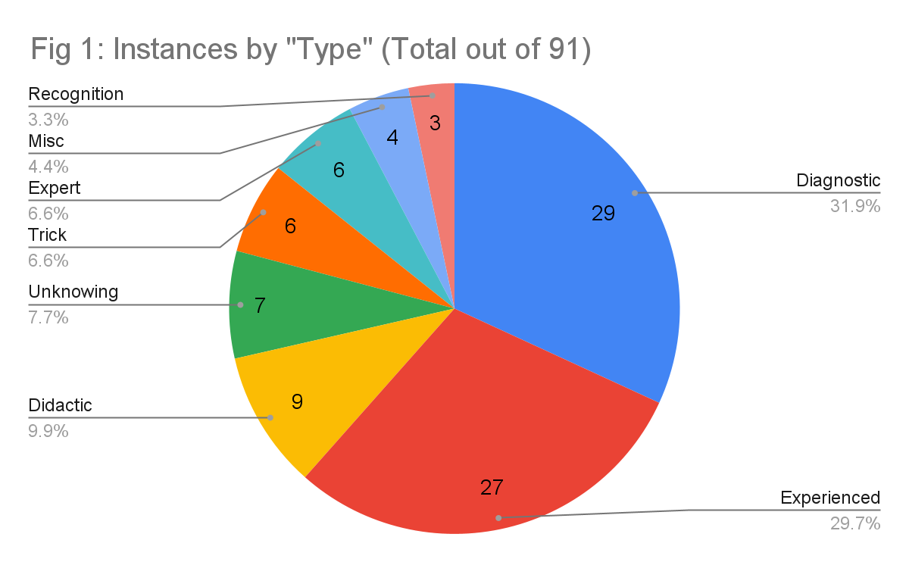
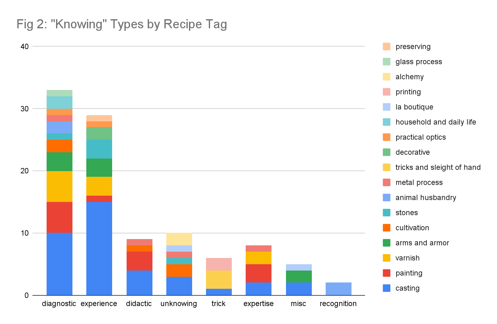
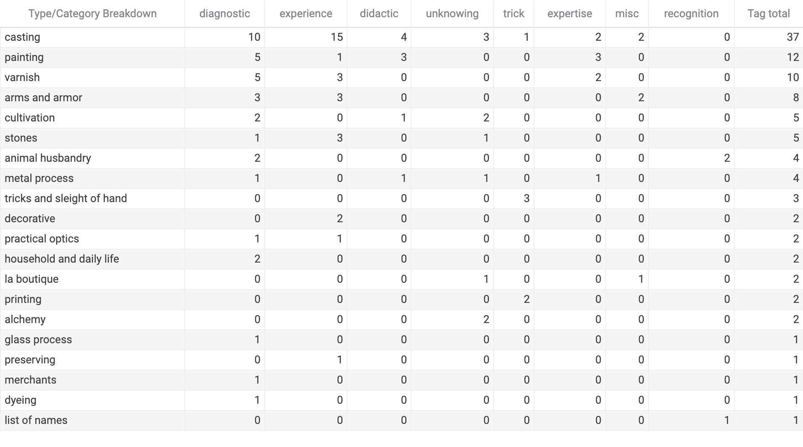
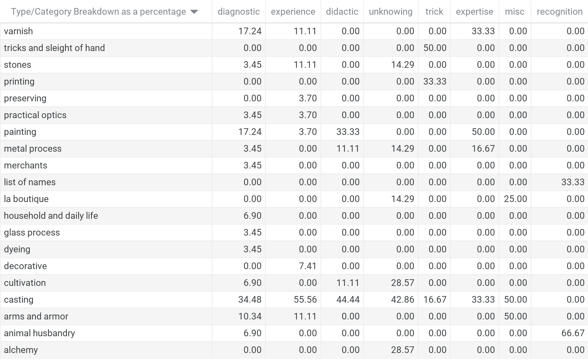

# Textual Analysis of Instances of “To Know” in Ms. Fr. 640

Beah Jacobson, Fall 2021

On folio [<u>125r of BnF Ms. Fr.
640</u>](https://edition640.makingandknowing.org/#/folios/125r/f/125r/tcn),
the phrase “a sçavoir” appears circled and set off from a stream of
surrounding marginal text on plaster; its placement suggests that it may
accompany the folio’s “Scimitars” entry. Combined with an auxiliary “a,”
this phrase is somewhat more enigmatic than the straightforward English
infinitive “to know,” as translated in the [<u>Digital Critical
Edition</u>](https://edition640.makingandknowing.org/#/) of the Making & Knowing
Project. Rather, we might take it as a gerund or part of a verbal phrase
– something closer to the procedural sense of “for knowing” than “to
know.” Did this note in fact refer to the scimitar recipe? If so, what
made that particular recipe so worth knowing for the manuscript’s
author-practitioner? Does the phrase indicate familiarity with or the
need to learn a particular knowledge-set? And what, for the
author-practitioner, is the relationship between scimitar-making and
knowledge-making?

The 170 folios of Ms. Fr. 640 provide an extraordinary record of late
sixteenth-century techniques, materials, experiments, and artisanal
processes.[^1] The manuscript’s “recipes” span a wide variety of
subjects: drawing, casting, painting, dyeing, molding, arms and armor,
cultivation, preservation, distillation, and much more. Such range makes
Ms. Fr. 640 a tantalizing repository of craft and artisanal knowledge at
a moment of substantial change in European knowledge production. Ms. Fr.
640 serves as a testament to increasing legitimacy of practice,
experience, and experiment as viable and trustworthy sources of
knowledge.[^2]

Though the Making & Knowing Project has paid substantial attention to
the author-practitioner’s attitudes toward knowledge and knowledge
production, less attention has been paid to the textual mechanics of
“knowing” itself.[^3] This essay therefore examines the
author-practitioner’s knowledge-making practices through quantitative
and qualitative assessment of the verb “to know” and its related forms:
“know,” “knowing,” “knew,” “knowledge,” “known,” and “unknown.” In doing
so, this project begins to answer the questions broached by that
tantalizingly ambiguous “a sçavoir.”

Ms. Fr. 640 has 86 instances of “know” and its variants, three instances
of the past tense form “knew,” and two instances of the noun form
“knowledge.” (In the original French, these instances are primarily
“scavoir” and occasionally “cognoistre.”) This paper will categorize,
assess, and analyze these instances across both the pre-existing
category tags from the Making & Knowing Project, and using my own
breakdown of the ways in which the author-practitioner employs the verb
“to know.”

## Methodology

First, using the web-based [*<u>Voyant</u>*](https://voyant-tools.org/)
and *[<u>Oxygen XML</u>](https://www.oxygenxml.com/)* tools, I gathered
a data set of these 91 examples and the surrounding text. Next, I cross
referenced these strings to the M&K recipe id and category tag(s) for
each instance. Analyzing each instance in context, I developed a set of
functional groups to describe the operation of similar types of
instances. The four instances that seemed not to bear resemblance to any
category I have grouped together under “Miscellaneous.” (See Appendix 1
for the complete data set and the
[<u>spreadsheet</u>](../data/fa21_jacobson_beah_final-project-know_tl_know.xlsx)
with my working data.)

Here is the breakdown by frequency of my “types.” Descriptions and
analysis of each category below.

The Making & Knowing Project has already created a set of “category”
tags that describe the content and interests of various recipes. I cross
referenced these tags with my own breakdown of knowing types to see what
categories of recipes make up each knowing type.

For a full data chart, see Appendix 2.

## The Diagnostic Know

The *diagnostic know* refers to instances in which the
author-practitioner describes tests for the purposes of gaining
information about some substance. Forms in this category include phrases
such as “to know if…”, “you will know by…” and “for knowing that…”, and
are typically accompanied by description of some action. The *diagnostic
know* is the manuscript’s most prevalent form of the verb “to know.”

Within this group, the recipe tags that appear most frequently are
casting, painting, and varnish. Though casting takes up the most real
estate here, it is not actually overrepresented when compared to its
frequency across the manuscript itself. 34% of recipes in Ms. Fr. 640
are tagged as casting, and 34.4% of recipes within the *diagnostic know*
are tagged as casting.[^4] Painting (14.3% of Ms. Fr. 640 recipes) and
varnish (4.8% of Ms. Fr. 640 recipes) are both overrepresented in this
category, each at 17.24 percent of the *diagnostic know* bucket.

For a full chart of recipe tags as percentages of total recipes within
each type, see Appendix 3.

*Example*

**For knowing** the good *cendrée* of azure for oil,
**[<u>13r</u>](https://edition640.makingandknowing.org/#/folios/13r/f/13r/tl):**

“The one that accumulates in small clods and is lumpy is the best
because it is the most subtle. Also the one that is very pale in color,
because oil darkens it. Certain sophisticators mix them, but **you will
know this if** you pour some onto a piece of paper & press it & spread
it with the finger since, if it is mixed, it will be found variegated &
as if striped with a pale one & a darker one, but if it is unmixed it
will be even & of one color.”

“For knowing” and “you will know this if” are excellent examples of the
*diagnostic know*. This formulation uses “know” to express some
qualitative demarcation of materials or recipe stage. This “know”
therefore directly connects knowledge acquisition to artisanal
experience. Here, knowledge is learned and gained through an explicit,
hands-on interaction with a material.

## The Experienced Know

The most prevalent usage in this category is the famous “as you know”
construction (always “comme tu sçais” in French), along with the
occasional “you know how” and “that you know” sprinkled in. I term this
the *experienced know* because such instances imply assumed familiarity
and experience. Where, when, and why might the author-practitioner
assume his reader (the “you” of the entry) to have some prior knowledge
of the processes described in the manuscript? Does this formulation
occur most frequently in certain types of recipes? Do certain instances
refer back to particular entries?

As Fig. 2 demonstrates, by far the most common recipe tag for this type
of “know” is casting. In fact, though casting only makes up 34% of the
recipes in the manuscript, it describes a whopping 55% of instances (15
tags out of 27 different recipes).[^5] Such overrepresentation suggests a
higher degree of familiarity or “experience” with casting from the
author-practitioner, and perhaps a higher expectation of familiarity
amongst his readers. Varnish, arms and armor, and stones are the next
most common tags for recipes that use “know” to assume some degree of
experience.

*Example*

Counterfeit Jasper recipe,
[<u>10r</u>](https://edition640.makingandknowing.org/#/folios/10r/f/10r/tl):
“You know how, with scrapings of the said horn, roses can be imitated.”

This instance appears to gesture toward another recipe. Also on 10r, the
author-practitioner instructs readers to use shaved horn scrapings to
imitate the translucency and delicacy of rose petals: “These are
counterfeited either with the scrapings of horn used for lanterns, or
with scrapings of parchment, very clear & delicate & dyed & employed as
you know.”

This later “as you know,” the second such instance of “the experienced
know” on the recto, then appears to be curiously self referential. Does
the reader already know how to shave horn into rose petals because of
the earlier suggestion on the page? Or is there an assumption of
familiarity that underlies both references?

## The Didactic Know

The *didactic know* occurs in instances in which the author-practitioner
deploys the verb in a teacherly (and authoritarian) manner. I.e., “you
must know X, and then you can do Y,” or “once you know X, you will be
able to…” These instances are often in the imperative mood, and refer to
knowledge that *should* be learned, gained, or taught.

*Example*

Orange Trees,
[<u>90r</u>](https://edition640.makingandknowing.org/#/folios/90r/f/90r/tl):
“​​And know that, for this effect, it would be better to join the sides
of the cases with screws & not with nails...”

I term instances like this the *didactic know* because they fulfill a
teacherly function. Here is a thing that should be known in order to
achieve some desired outcome. Typically, these instances present as
imperative and moralizing about the effect of these formulations.

## The Unknowing Know

This locution refers to what is not yet known or what cannot be known,
most prevalently with the author-practitioner as the subject. “I do not
know if” occurs four times in the manuscript. In each of these cases,
the topic is knowledge-in-production, describing experimental processes
and outcomes.

Interestingly, recipe tags for the *unknowing know* span casting,
cultivation, alchemy, stones, and metal process.

*Example*

Whitening Enilanroc,
[<u>13r</u>](https://edition640.makingandknowing.org/#/folios/13r/f/13r/tl):
“I do not know if it would be better to reheat it under hot ashes, & if
it would be good to encase it in alabaster, which is very cold, as I
encased it in the brick.”

These instances typically recognize the limitations of the
author-practitioner’s experimental knowledge. In this instance, the
author-practitioner recounts his own experimental process in the first
person. This moment occurs at the end of the recipe, when he explains
that he has not tried this process in other ways. Importantly, then,
this “I do not know” signifies an ongoing process of experimental trial,
rather than unknowability itself.

## The Expert Know

The *expert know* refers to a specific individual or group of
individuals with some mastery of some subject. I also include in this
category instances in which expertise is affirmed as secret, exceptional
knowledge of a particular craft.

*Examples*

Painter,
[<u>32r</u>](https://edition640.makingandknowing.org/#/folios/32r/f/32r/tl):
“The one who knows to work well in distemper will work well in oil.”

and:

Painting Esmail D’azur in Oil,
[<u>11r</u>](https://edition640.makingandknowing.org/#/folios/11r/f/11r/tl):
“This is a secret that is hardly known to common painters.”

Though this litotes (“hardly known”) might seem to belong in the
*unknowing* bucket, I group it in *expert* for two reasons. First, it
refers to knowledge that can be and is known. Second, the absence of
that knowledge in some individuals serves to elevate other individuals
(such as the author-practitioner) who do have it.

## The Trick Know

Unlike the *unknowing know*, this locution pattern describes intentional
modes of knowing, unknowing, or revelation of some fact for the purposes
of joking, tricking, or subterfuge. The *trick know* plays with
knowledge, deliberately misrepresenting, obfuscating, and occasionally
revealing what is or what can be known. These formulations bring the
reader into a privileged, ingroup understanding with the
author-practitioner.

*Example*:

For telling someone that you will teach him something he does not know,
and neither do you.,
[<u>35r</u>](https://edition640.makingandknowing.org/#/folios/35r/f/35r/tl):
“Take a string or a small stick and take the measurement from the tip of
his ear to the tip of his nose and show it to him. Thus you will teach
him something you did not know, and neither did he.”

Also occurring in da Vinci’s *Codex Atlanticus,* this particular joke
links humor and entertainment with broader epistemological questions
around knowability and unknowability.[^6]

## Know of Recognition

This pattern refers to the familiar relationship between individuals,
and how they recognize one another. Interestingly, two of these three
instances fall into the “animal husbandry” category, referring to birds
and horses.

*Example*

[<u>1r</u>](https://edition640.makingandknowing.org/#/folios/1r/f/1r/tl):
“Mestre Jehan Cousin, who resides in the Faubourg Saint-Germain, knows
of the master.”

For making a horse follow,
[<u>54v</u>](https://edition640.makingandknowing.org/#/folios/54v/f/54v/tl):
“One needs to give it sweet bread & it will know the one who will do him
such good.”

## Miscellaneous Uses

I could not resolve the following uses reasonably or meaningfully into
any of these other categories:

Chimolée,
[<u>12r</u>](https://edition640.makingandknowing.org/#/folios/12r): “The
*terre chimolée*, otherwise known as fuller’s earth…”

I set this individual usage apart because “known” here is an artifact of
the translation. The French version uses “aultrement des parayres…” and
no particular instantiation of either *scavoir* or *cognoistre*.

[<u>24v</u>](https://edition640.makingandknowing.org/#/folios/24v/f/24v/tl):
“Know the magazines of France for the artillery”

This phrase occurs as a marginal note, clearly aligned in some way with
the military recipes surrounding it. As an imperative (“scaches” in
French), this phrase seems to suggest that it is information that ought
to be known. Within the context of this compendium, however, it is not
precisely didactic because it does not contain any additional
explanation or development, nor does it signal teaching and learning. Is
this a note from the author-practitioner to himself? An interest in
developing this topic further? Advice to the reader not unlike a modern
note to reference or compare?

Scimitars,
[<u>125r</u>](https://edition640.makingandknowing.org/#/folios/125r/f/125r/tcn):
“A sçavoir” circled and set off by itself in the margin.

For the workshop,
[<u>166r</u>](https://edition640.makingandknowing.org/#/folios/166r/f/166r/tl):
“In order to publish them for **those who do not know them**; so that as
the preceding day is teacher for the subsequent, thus you needed to
learn from those who preceded you in order to teach to those who come
after. The Latins took from the Greeks, as Cicero from Plato & Vergil
from Homer… Will one not say the weaver has made a cloth or precious
stuff, even though he did not dye & twist, wind & prepare the bobbins
and balls of thread?”

This remarkable passage describes the manuscript itself, and the
author-practitioner’s intention to gather and disseminate knowledge that
has been accumulated not only through his own experience, but through
the lessons of centuries of knowledge-makers. Importantly, the
author-practitioner here sets on par the knowledge of the ancients and
the knowledge of modern artisans. He imagines one holistic thread of
transmission, inheritance, practice, and re-transmission, in which Ms.
Fr. 640 participates.

## Further Opportunities for Analysis

The textual analysis of “to know” suggests several possible avenues for
future study. Such projects might compare the differential deployment of
the French verbs “sçavoir” and “cognoistre” (alone and with respect to
contemporary texts); analyze the frequency of different recipe tags
across other verbal constructions; develop different systems to
categorize forms of knowing. These and other projects will help develop
a richer understanding of the author-practitioner’s own attitudes toward
and experiences with knowledge-production, as well contribute to
discussion of the period more broadly.

## Appendix 1: Instances of “know” in Ms. Fr. 640

| **Folio** | **Recipe**                                                                                      | **Type of Know** | **Recipe Tag**                   |
|-----------|-------------------------------------------------------------------------------------------------|------------------|----------------------------------|
| 001r      | N/A                                                                                             | Recognition      | List Of Names                    |
| 003v      | Thick varnish for planks                                                                        | Experience       | Varnish                          |
| 004r      | Varnish of spike lavender oil                                                                   | Diagnostic       | Varnish                          |
| 008r      | For making a breach in a wall by night                                                          | Experience       | Arms and Armor                   |
| 008v      | Perfect amalgam                                                                                 | Experience       | Casting                          |
| 009r      | Plowman                                                                                         | Diagnostic       | Cultivation                      |
| 009r      | Merchant                                                                                        | Diagnostic       | Merchants                        |
| 010r      | Counterfeit jasper                                                                              | Experience       | Stones; Decorative               |
| 010r      | Roses                                                                                           | Experience       | Decorative                       |
| 011r      | Painting esmail d’azur in oil                                                                   | Expertise        | Painting                         |
| 012r      | Chimolée                                                                                        | Misc             | Casting                          |
| 013r      | For whitening enilanroc                                                                         | Unknowing        | Stones                           |
| 013v      | For knowing the good cendrée of azure for oil                                                   | Diagnostic       | Painting                         |
| 013v      | For knowing the good cendrée of azure for oil                                                   | Diagnostic       | Painting                         |
| 019v      | Mathematical figures without ruler and compass                                                  | Experience       | Painting                         |
| 021r      | For firing a cannon at night                                                                    | Experience       | Arms and Armor; Practical Optics |
| 024r      | Grenades                                                                                        | Diagnostic       | Arms and Armor                   |
| 024v      | For bringing a cannon over land                                                                 | Misc             | Arms and Armor                   |
| 031v      | Painting on glass                                                                               | Diagnostic       | Painting; Glass Process          |
| 032r      | Painter                                                                                         | Expertise        | Painting; Varnish                |
| 032r      | Painter                                                                                         | Expertise        | Painting; Varnish                |
| 034r      | Writing cunningly                                                                               | Trick            | Tricks and Sleight Of Hand       |
| 035r      | For telling someone that you will show teach him something he does not know, and neither do you | Trick            | Tricks and Sleight Of Hand       |
| 035r      | For telling someone that you will show teach him something he does not know, and neither do you | Trick            | Tricks and Sleight Of Hand       |
| 038r      | Amber                                                                                           | Experience       | Stones                           |
| 039r      | Goldsmith                                                                                       | Unknowing        | Casting; Metal Process           |
| 039r      | Pastel woad                                                                                     | Diagnostic       | Dyeing                           |
| 049v      | Birds                                                                                           | Diagnostic       | Animal Husbandry                 |
| 051r      | Counterproofing                                                                                 | Trick            | Printing                         |
| 051r      | Counterproofing                                                                                 | Trick            | Printing                         |
| 052r      | The work done in Algiers                                                                        | Unknowing        | Cultivation; Alchemy             |
| 052r      | The work done in Algiers                                                                        | Unknowing        | Cultivation; Alchemy             |
| 054r      | Silkworms                                                                                       | Diagnostic       | Cultivation; Animal Husbandry    |
| 054v      | For making a horse follow                                                                       | Recognition      | Animal Husbandry                 |
| 055r      | For firing a schioppo senza rumore                                                              | Experience       | Arms and Armor                   |
| 055v      | For knowing the course one takes on the open sea                                                | Diagnostic       | Household and Daily Life         |
| 056r      | Varnish for distemper                                                                           | Experience       | Varnish                          |
| 059r      | Azure                                                                                           | Diagnostic       | Varnish; Painting                |
| 060v      | Varnish dry in an hour                                                                          | Diagnostic       | Varnish                          |
| 062r      | Perspectives                                                                                    | Didactic         | Painting                         |
| 062v      | Perspective                                                                                     | Diagnostic       | Painting                         |
| 064v      | Apprenticeship of the painter                                                                   | Didactic         | Painting                         |
| 065r      | Flesh color                                                                                     | Didactic         | Painting                         |
| 068v      | Casting                                                                                         | Diagnostic       | Casting                          |
| 070r      | Sand                                                                                            | Trick            | Casting                          |
| 071r      | Mulled and sugared wine                                                                         | Diagnostic       | Household and Daily Life         |
| 072v      | Casting                                                                                         | Diagnostic       | Casting                          |
| 082v      | Method of casting in bronze                                                                     | Experience       | Casting                          |
| 085r      | Sand for lead, the most excellent of all, for high and low reliefs                              | Experience       | Casting                          |
| 085r      | Sand for lead, the most excellent of all, for high and low reliefs                              | Diagnostic       | Casting                          |
| 086r      | Experimented sands                                                                              | Unknowing        | Casting                          |
| 087r      | Excellent sand for lead, tin, and copper                                                        | Diagnostic       | Casting                          |
| 088r      | Varnish                                                                                         | Diagnostic       | Varnish                          |
| 090v      | Orange trees                                                                                    | Didactic         | Cultivation                      |
| 091v      | Molding with cuttlefish bone                                                                    | Diagnostic       | Casting                          |
| 095r      | Furbisher                                                                                       | Diagnostic       | Arms and Armor                   |
| 097r      | Gilding                                                                                         | Diagnostic       | Arms and Armor; Metal Process    |
| 097v      | Mastic varnish dry in a half hour                                                               | Experience       | Varnish                          |
| 097v      | Mastic varnish dry in a half hour                                                               | Diagnostic       | Varnish                          |
| 098v      | Birds                                                                                           | Recognition      | Animal Husbandry                 |
| 099r      | Founding                                                                                        | Experience       | Casting                          |
| 100v      | Gemstones                                                                                       | Experience       | Stones                           |
| 104v      | Goldsmith                                                                                       | Didactic         | Metal Process                    |
| 107r      | Plaster                                                                                         | Diagnostic       | Casting                          |
| 107v      | Plaster                                                                                         | Didactic         | Casting                          |
| 111r      | Clay earth                                                                                      | Experience       | Casting                          |
| 112r      | Putting to death the animal for molding                                                         | Diagnostic       | Casting                          |
| 114r      | Second cast                                                                                     | Experience       | Casting                          |
| 120r      | Sand for casting in gold                                                                        | Expertise        | Casting                          |
| 121r      | Keeping dry flowers in the same state all year                                                  | Experience       | Preserving                       |
| 121v      | Silver for casting                                                                              | Expertise        | Casting                          |
| 123r      | A means di far correr lotnegra                                                                  | Expertise        | Metal Process                    |
| 125r      | Plaster                                                                                         | Didactic         | Casting                          |
| 125r      | Scimitars                                                                                       | Misc             | Arms and Armor;Casting           |
| 125v      | Plaster for casting of wax                                                                      | Didactic         | Casting                          |
| 126r      | Molding fruits and animals in sugar                                                             | Experience       | Casting                          |
| 129r      | Viper color                                                                                     | Experience       | Casting                          |
| 129v      | Spider molded on a leaf                                                                         | Experience       | Casting                          |
| 130v      | Molding a crab                                                                                  | Didactic         | Casting                          |
| 131v      | When the cast of tin or lead becomes porous                                                     | Diagnostic       | Casting                          |
| 135r      | Vine leaf and small frog                                                                        | Experience       | Casting                          |
| 140v      | For casting in sulfur                                                                           | Experience       | Casting                          |
| 145r      | Cuttlefish bone                                                                                 | Diagnostic       | Casting                          |
| 149v      | Bat                                                                                             | Experience       | Casting                          |
| 153r      | Molding hollow for seals or other things                                                        | Experience       | Casting                          |
| 156r      | Molding promptly and reducing a hollow form to a relief                                         | Experience       | Casting                          |
| 156v      | Molding a fly                                                                                   | Experience       | Casting                          |
| 157r      | Arranging plants or flowers for casting                                                         | Diagnostic       | Casting                          |
| 160r      | Press for large molds                                                                           | Unknowing        | Casting                          |
| 166r      | For the workshop                                                                                | Unknowing        | La Boutique                      |
| 166r      | For the workshop                                                                                | Misc             | La Boutique                      |

## Appendix 2: Number of recipe tags within each type of “knowing”

## Appendix 3. Recipe tags as a percentage of total recipes within each type of “knowing”

Note: This data is most meaningful for the *diagnostic* and
*experienced* types because those have the most instances (29 and 27,
respectively). Conversely, because individual instances within the
miscellaneous type are discrete, percentages of recipes within this
bucket are least meaningful.

## Bibliography

Barwich, Ann-Sophie. “Sleight of Hand Tricks.” In *Secrets of Craft and
Nature in Renaissance France. A Digital Critical Edition and English
Translation of BnF Ms. Fr. 640*, edited by Making and Knowing Project,
Pamela H. Smith, Naomi Rosenkranz, Tianna Helena Uchacz, Tillmann Taape,
Clément Godbarge, Sophie Pitman, Jenny Boulboullé, Joel Klein, Donna
Bilak, Marc Smith, and Terry Catapano. New York: Making and Knowing
Project, 2020.
<https://edition640.makingandknowing.org/#/essays/ann_043_sp_16>. DOI:
<https://www.doi.org/10.7916/rfq6-0k88>.

Rosenkranz, Naomi. “Understanding and Analyzing the Categories of the
Entries in BnF Ms. Fr. 640,” *Making and Knowing Sandbox*, 2021.
[<u>https://cu-mkp.github.io/sandbox/docs/categories.html</u>](https://cu-mkp.github.io/sandbox/docs/categories.html)

Keller, Vera. “'Everything Depends Upon the Trial (*Le tout gist à
l’essay*)': Four Manuscripts Between the Recipe and the Experimental
Essay.” In *Secrets of Craft and Nature in Renaissance France. A Digital
Critical Edition and English Translation of BnF Ms. Fr. 640*, edited by
Making and Knowing Project, Pamela H. Smith, Naomi Rosenkranz, Tianna
Helena Uchacz, Tillmann Taape, Clément Godbarge, Sophie Pitman, Jenny
Boulboullé, Joel Klein, Donna Bilak, Marc Smith, and Terry Catapano. New
York: Making and Knowing Project, 2020.
<https://edition640.makingandknowing.org/#/essays/ann_320_ie_19>. DOI:
<https://www.doi.org/10.7916/vj69-8h20>

Making and Knowing Project, Pamela H. Smith, Naomi Rosenkranz, Tianna
Helena Uchacz, Tillmann Taape, Clément Godbarge, Sophie Pitman, Jenny
Boulboullé, Joel Klein, Donna Bilak, Marc Smith, and Terry Catapano,
eds., *Secrets of Craft and Nature in Renaissance France. A Digital
Critical Edition and English Translation of BnF Ms. Fr. 640* (New York:
Making and Knowing Project, 2020),
[https://edition640.makingandknowing.org](https://edition640.makingandknowing.org/)

Smith, Pamela H. “An Introduction to Ms. Fr. 640 and its
Author-Practitioner.” In *Secrets of Craft and Nature in Renaissance
France. A Digital Critical Edition and English Translation of BnF Ms.
Fr. 640*, edited by Making and Knowing Project, Pamela H. Smith, Naomi
Rosenkranz, Tianna Helena Uchacz, Tillmann Taape, Clément Godbarge,
Sophie Pitman, Jenny Boulboullé, Joel Klein, Donna Bilak, Marc Smith,
and Terry Catapano. New York: Making and Knowing Project, 2020.
<https://edition640.makingandknowing.org/#/essays/ann_300_ie_19>. DOI:
<https://www.doi.org/10.7916/ny3t-qg71>

Taape, Tillmann. “'Experience Will Teach You': Recording, Testing,
Knowing, and the Language of Experience in Ms. Fr. 640.” In *Secrets of
Craft and Nature in Renaissance France. A Digital Critical Edition and
English Translation of BnF Ms. Fr. 640*, edited by Making and Knowing
Project, Pamela H. Smith, Naomi Rosenkranz, Tianna Helena Uchacz,
Tillmann Taape, Clément Godbarge, Sophie Pitman, Jenny Boulboullé, Joel
Klein, Donna Bilak, Marc Smith, and Terry Catapano. New York: Making and
Knowing Project, 2020.
<https://edition640.makingandknowing.org/#/essays/ann_303_ie_19>. DOI:
<https://www.doi.org/10.7916/njnq-6q58>.

[^1]: Making and Knowing Project, *Secrets of Craft and Nature in
Renaissance France. A Digital Critical Edition and English Translation
of BnF Ms. Fr. 640*,
[<u>https://edition640.makingandknowing.org</u>](https://edition640.makingandknowing.org/).

[^2]: Keller (2020).

[^3]: See, for instance, Taape (2020) for an excellent breakdown of the
manuscript’s terms *experience*, *experimenter*, *essayer*, *esprouver*,
and *cognoistre.*

[^4]: Data for recipe tag frequency across the manuscript as a whole are
found in the [<u>M&K
Sandbox</u>](https://cu-mkp.github.io/sandbox/docs/categories.html).

[^5]: For frequency and tag distribution throughout the manuscript, see
“Understanding and Analyzing the Categories of the Entries in BnF Ms.
Fr. 640” in the [<u>Making and Knowing
Sandbox</u>](https://cu-mkp.github.io/sandbox/docs/categories.html).

[^6]: For more on tricks and sleight of hand, see Barwich (2020).
