# Regimens, Recipes, and Remedies: Understanding the “Cosmetic” in Early Modern Europe

Danli Lin and Anusha Sundar

Fall 2021, Making and Knowing in Early Modern Europe: Hands-On History

## Introduction

A Google search of the word “cosmetic” yields many meanings, including
anything related to beautification, correcting defects, decorating, and
clearing one’s complexion. We are also immediately reminded of beauty
models, or the scores of beauty products that line the aisles of
supermarkets. There is also the endless barrage of advertisements
featuring glistening hair, glowing skin, and miraculously spot-free
skin! Yet, there is a longer history to the world of cosmetics that is
not limited to the idea of beauty, just as scholars have pointed to how
notions of beauty are historically contingent on regions, communities,
gender, and social strata. This essay discusses how ideas about
cosmetics were closely aligned to medicinal and therapeutic uses in
early modern Europe. This will help us understand the multiplicity of
meanings that these historical understandings and quotidian uses
produced.

Manuscript recipe books in early modern Europe⁠—ranging from books of
secrets to craft treatises and how-to manuals—were extremely diverse.
They often testified to the social networks that undergirded practices
of recipe exchanges, patronage, and community interactions. In fact,
Mary Fissell, a historian of medicine, has argued that this might be one
of the critical explanations for the “wide array of recipes” that can be
found in a single manuscript collection.[^1] With the advent of the
printing world, recipe books became a market of their own, based on the
success of certain well-known individuals or even compiled by printers
and published for a dedicated audience. Often, printed compilations of
cosmetic and household manuals carried a dizzying array of recipes with
instructions ranging from the medicinal and therapeutic to the healing
and culinary.

Beauty recipes were collected as part of these household manuals or
compiled together in dedicated beauty manuscripts, and were dedicated to
women running households. Yet, it is when they are found in hybrid texts
such as Ms. Fr. 640 that they allude to wider knowledge networks and to
vernacular frames of understanding the relationship between nature and
the human body. Montserrat Cabré argues that it is important to
investigate “the presence of beauty recipes and the earlier traditions
they belong to” in order to understand the social and epistemological
milieu that these recipes were a product of.[^2] Rather than approach
cosmetic recipes as given facts, or trace their emergence, we must pause
to reflect on their presence at different moments and in differing
forms.

This essay situates the “cosmetic” within the world of the Hippocratic
humoral theory, which informed notions about the body, wellness, and
diet (among various other aspects) in early modern Europe. This is
explored by examining recipes for two beautification regimens: ones that
sought to maintain/correct one’s complexion and recipes directed towards
whitening one’s teeth.

## Complexion

Let us first examine two recipes from the sixteenth-century French
manuscript Ms. Fr. 640. The manuscript contains a relatively small
selection of forty recipes that can be characterized as dealing with
cures for illnesses, diseases, and hazardous environs. It is noteworthy
that two of these forty recipes attempt to alter, correct, and preserve
the complexion of the human face. An entry on [<u>fol.
20v</u>](https://edition640.makingandknowing.org/#/folios/20v/f/20v/tl),
titled “For whitening the face,” reads as follows:

> Pestle puffball in cistern water, & no other, & wash with this
> whitened water. This is considered quite singular. And I believe that
> making it from wheat starch & to use it would be even better.

Another recipe on [<u>fol.
77r</u>](https://edition640.makingandknowing.org/#/folios/77r/f/77r/tl),
titled “Against redness of the face,” appears to be similarly concerned
with protecting the countenance of the human face:

> Make a small lead cap & wear it overnight. Excellent secret. Try a
> lead mask.

At first glance, both these recipes seem to speak to daily cosmetic
needs, but a closer look makes us wonder if they spoke to other
therapeutic or medicinal concerns as well. In early modern Europe,
cosmetic and therapeutic recipes often intersected with each other in
ways that make it difficult for readers today to definitively slot them
into distinct categories. While “For whitening the face” seems like a
general regimen, “Against redness of the face” reads as a prescriptive
cure for a person afflicted by a skin irritation.

A closer look at the ingredients might offer us a window into their
shared medical/therapeutic uses. Famously, puffballs have been
documented for their styptic function and were widely used in North
America by indigenous peoples.[^3] In Europe as well, puffballs have been
known for their ability to help cauterize wounds and internal
hemorrhages.[^4] Lead compounds, on the other hand, had some of the most
diverse uses, most of which would be shocking to today’s readers. From
being used as a sweetener in wine by the Romans to being employed as a
glaze in pottery, lead compounds—such as lead carbonate, lead oxide, and
lead acetate—served many culinary, artistic, and aesthetic functions.
Lead was also used by the aristocracy to rectify their complexion (think
of Queen Victoria’s use of Venetian Ceruse, a white, powdery makeup
composed of lead carbonate). The use of lead compounds as beauty
enhancers was always tied closely to notions of luxury, religion, and
health. Ancient Egyptians applied lead-based eye makeup with the
understanding that it offered protections to the eyes and the skin
around it.[^5] In medieval and early modern Europe, iatrochemistry
practitioners such as Paracelsus advocated for preparing medicines using
ingredients known to be toxic, such as mercury, lead, and arsenic.
Interestingly, new research confirms some of this historical reasoning:
limited use of and exposure to lead compounds does in fact promote an
immunological response and can help treat eye and skin related
illnesses.[^6]

What does the blurring between toxicity and health tell us about how
early modern Europeans perceived health and well-being? Historian
Xiaomeng Liu has argued that recipe books from this period reflect
“quotidian” ideas of the range of bodily suffering and human efforts to
overcome, prevent, and better them.[^7] These quotidian ideas were
dominantly governed by the humoral theory. Mary Lindemann tells us that
in the humoral theory, “health rested in the balance of four
humors—black bile, yellow (or red bile), blood and phlegm.”[^8]
Essentially, each of the humors corresponded to qualities and
temperaments of humans and cures that could potentially heal them. This
was combined with a belief that the environment could affect and cause a
disequilibrium in the humors. These notions extended to understandings
of “complexion” as well, which, in the early modern world, carried
connotations of the humoral balance or imbalance in a person.
Complexion, therefore, evoked an image of the individual’s internal
well-being as reflected in the external features such as the flesh and
skin. It was only relatively recently that complexion began to refer
restrictively to skin tones, much as it is used today.

The way the human face and body should be represented in art—as per
instructions in craft manuals and treatises—also offers an important
perspective into contemporary ideas about the body and human efforts to
achieve bodily well-being. Cennino Cennini’s fourteenth-century Italian
manuscript provides panel painters with information about the art of
makeup, speaking to the overlap between the representation of nature and
the human body, and elements of counterfeit and make-believe that went
into achieving this semblance.[^9] Similar materials (such as egg yolk,
resin, and lead white) were used to paint panels and to mix pigments to
stain the human face. In her study of Ms. Fr. 640, Cleo Nisse points to
the author-practitioner’s differential treatment for painting shadows of
men and women.[^10] Women were considered to be cooler and wetter than
men and thus phlegmatic and pale in complexion. Accordingly, artists
were directed to paint a women’s body and face with white lead,
vermillion, and Parisian red as opposed to using yellow ocher to depict
men’s faces. Makeup containing lead white (lead carbonate) was
especially used as part of face masks and powder upon which tints and
stains were applied. In medieval and early modern Europe, women aspired
for whitened faces, demonstrating how the prevailing aesthetic
preoccupation was informed by the humoral theory.[^11] Not only does this
underscore the medical conventions that undergirded representations of
human flesh and skin, but also explains how the exterior was to reflect
the internal balance of the humors. Seen in this light, recipes and
regimens to “correct” one’s complexion speak to the ways in which the
“cosmetic” was entangled with notions of medicinal/therapeutic
understandings. In the next section, these entanglements are further
considered by looking at recipes for tooth-whitening.

## Teeth-whitening

The author-practitioner of Ms. Fr. 640 has recorded several approaches
to teeth-whitening.

On [<u>fol.
47r</u>](https://edition640.makingandknowing.org/#/folios/47r/tl), “For
teeth” reads:

> Sal ammoniac 1 ℥, rock salt 1 ℥, alum half an ℥. Make water with the
> retort, and as soon as you touch the tooth, the tartar & blackness
> will go away. It is true that it has a bad odor, but you can mix it
> with rose honey & a little cinnamon or clove oil.

“For the teeth, oil of sulfur” on [<u>fol.
46r</u>](https://edition640.makingandknowing.org/#/folios/46r/tl)
advises:

> Some people whiten them with confections of aquafortis; however, one
> says that this corrupts them afterward & causes a blackness on them.
> One says that oil of sulfur is excellent, but one needs to mix it in
> this way: take as much clove oil as can be held in a walnut shell, and
> as much rose honey, & seven or eight drops of oil of sulfur, & mix it
> well all together. And after having cleaned the teeth with a small
> burin, touch them lightly with a little cotton dipped in the aforesaid
> oils and leave it there for a little while, then spit or rinse your
> mouth with tepid water, and reiterate two or three times. Oil of
> sulfur penetrates & is corrosive, but the clove oil & the rose honey
> correct it. Therefore use it with discretion.

At the outset, both these recipes seem to speak overwhelmingly to
cosmetic concerns. Although tooth decay was not as highly prevalent due
to lower sugar content in the diet of early modern Europe, the presence
of multiple recipes for teeth whitening speaks to anxieties about the
appearance and well-being of teeth.[^12] Liu argues that even in cases
where cosmetic use seems to dominate the purpose of the regimen, a
closer look at the ingredients will help us approach this in a holistic
sense.[^13] Clove oil, for example, was—and still continues to
be—commonly prescribed to lessen and soothe toothaches. In one of the
two recipes from Ms. Fr. 640, clove oil is mentioned alongside a range
of ingredients used to treat teeth more broadly. Moreover, the two
recipes to whiten teeth on folios 46r and 47r are placed together with
cures to treat vertigo, diarrhea, dysentery, and cold gouts.

Recipes for teeth-whitening were common in other contemporaneous
manuscripts and were central to beauty regimens, but they also testify
to something more. In the mid-sixteenth century manuscript *Cosmetic or,
The Beautifying Part of Physick* compiled by Mr. Nicholas Culpeper and
acknowledged to having been “extracted” from the works of Johannes Jacob
Wecker, a Swiss physician, we come across a range of recipes for “waters
that whiten the teeth:”[^14]

> Take of salt Arabick, salt Gem, each half a pound, sugar'd Allom three
> ounces, powder and distil them, and rub the teeth with a scarlet cloth
> dipt in the water.

In another recipe, he accounts a “precious” method (the use of the word
precious may possibly refer to an exhaustive list of ingredients, their
relative availability, and cost):

> Take of the first water of honey distilled, which is white, one pint,
> white Salt one ounce, Allom half a pound, salt Niter one ounce, water
> of the leaves of the Mastick tree one pint, Mastick,
> White-wine-vineger, each two ounces, distil them all in Bal: Mar: then
> rub the teeth with a Mastick stick dipt in it.

Wecker lists seven such recipes under “waters that whiten teeth” and
proceeds with a list of recipes to “strengthen,” “fasten,” and “cleanse”
the teeth and gum. For example, “A Water to strengthen the Teeth:”

> Take three Nutmegs, two roots of Ginger, a little Mastick, Pellitory
> of Spain, sweet Marjoram, Hyssop, Mint, Rosemary, Sage, Salt, each
> half an ounce, put them all into sweet wine, and let them boil till a
> third part be consumed, then strein it well, and use it hot.

Prudently choosing distinct ingredients that could come together to fix
the imbalance caused in the humors was the central preoccupation behind
the knowledge systems of early modern Europe. In his study of
tooth-drawers of seventeenth century Italy, David Gentilcore
demonstrates how the practitioners’ services included offering a wide
range of remedial substances alongside tooth extraction. The ingredients
they used had less to do with the teeth per se and more to do with a
practical knowledge informed by how “oils for cold humors” could protect
the teeth and gum (which by virtue of being close to another, could be
treated similarly).[^15] In Alessio Piemontese’s *Secreti*, a
sixteenth-century manuscript penned in early modern Italy, we encounter
several examples of recipes that combine efforts to “cleane the teeth,”
“make them fast and white,” and conserve the gums.[^16] In one telling
example of how the humoral theory was enacted, the author of *Secreti*
directs the reader to follow three important lessons to ensure the teeth
are white and uncorrupted: to wash one’s mouth after eating one’s meals,
to not sleep with one’s mouth closed and to “purge well the breaste and
throte, spitting out all that is gathered together that nighte.”[^17]
According to the author, following these lessons is also particularly
good for the well-being of the stomach and the head, an allusion to how
the seemingly separate body parts were seen to be interconnected by
humors. As in the Wecker manuscript and Ms. Fr. 640,
therapeutic/medicinal recipes were positioned in a seamless continuity
with more cosmetically-inclined recipes, speaking to how these methods
were probably read as complementary factors to ensure a holistic
well-being of the users.

This essay is an exercise in situating the rather unwieldy category of
the “cosmetic” within the then prevailing knowledge system that was
informed by the humoral theory. Notions about physical appearance and
outward countenance were intimately tied to the internal state of the
body. In such a scenario, the outward appearance was both a reflection
of and a window into the well-being of the body. It was both the sign
and the diagnosis of illness and health.

## How some of the material ingredients in contemporary recipes compare with those found in Ms. Fr. 640

Early modern European manuscripts and contemporary practice/recipes
represent the knowledge of these two time periods. When comparing and
contrasting the ingredients mentioned in recipes from these two periods,
we can get a better sense of how people perceive the material world and
human body differently in the past and present. For instance, how do
people whiten teeth in these two periods and what kind of ingredients do
they use? Do people in the past and present use similar or totally
different ingredients to make health/cosmetics products? The tables
below show ingredients that appear frequently in recipes of Ms. Fr. 640
for enhancing one’s health and appearance. By comparing them, we may be
able to get a sense of how people understand their bodies, materials,
and the notion of cosmetics. Thus, let’s compare ingredients that early
modern European people used with the ingredients that we often use in
our present daily life to see what has changed.

### Table 1: Whitening the teeth

<table>
<colgroup>
<col style="width: 33%" />
<col style="width: 33%" />
<col style="width: 33%" />
</colgroup>
<thead>
<tr class="header">
<th><strong>Recipe Source</strong></th>
<th><strong>Ingredients</strong></th>
<th><strong>Image</strong></th>
</tr>
<tr class="odd">
<th>Ms. Fr. 640 recipes</th>
<th><a href="https://edition640.makingandknowing.org/#/folios/46r/tl"><u>Fol. 46r</u></a>, “For the teeth, oil of sulfur:” oil of sulfur, clove oil, rose honey</th>
<th>
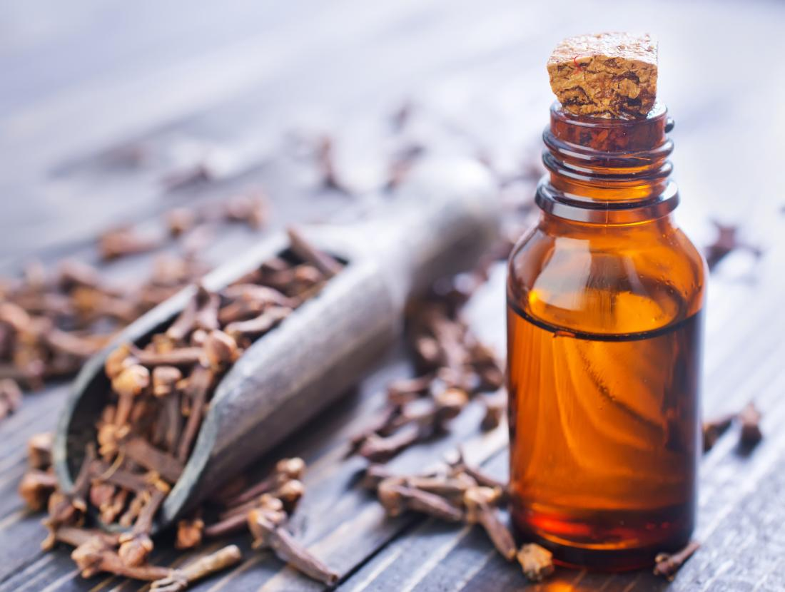

clove oil
</th>
</tr>
<tr class="header">
<th>Contemporary remedy</th>
<th>Toothpaste with hydrogen peroxide</th>
<th>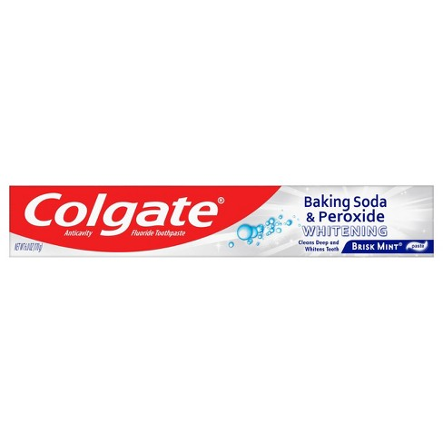</th>
</tr>
</thead>
<tbody>
</tbody>
</table>

### Table 2: Against redness of the face

<table>
<colgroup>
<col style="width: 33%" />
<col style="width: 33%" />
<col style="width: 33%" />
</colgroup>
<thead>
<tr class="header">
<th><strong>Recipe Source</strong></th>
<th><strong>Ingredients</strong></th>
<th><strong>Image</strong></th>
</tr>
<tr class="odd">
<th>Ms. Fr. 640 recipes</th>
<th><a href="https://edition640.makingandknowing.org/#/folios/77r/f/77r/tl"><u>Fol. 77r</u></a>, “Against redness of the face:” lead (likely a lead compound)</th>
<th>
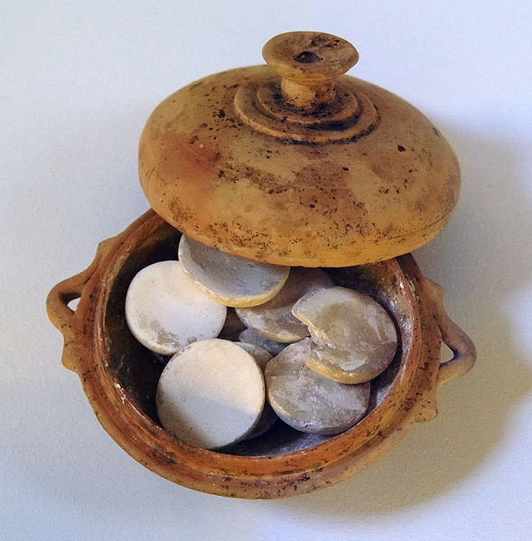

(Venetian ceruse - lead carbonate)

Makeup pot with molded tablets of white lead found in a tomb from the fifth c. BC; at the Kerameikos Archaeological Museum.<a href="#fn1" class="footnote-ref" id="fnref1" role="doc-noteref">1</a>
</th>
</tr>
<tr class="header">
<th>Contemporary remedy</th>
<th>Soothing products such as creams and lotions containing ingredients such as niacinamide, sulfur, allantoin, caffeine, licorice root, chamomile, aloe, and cucumber</th>
<th>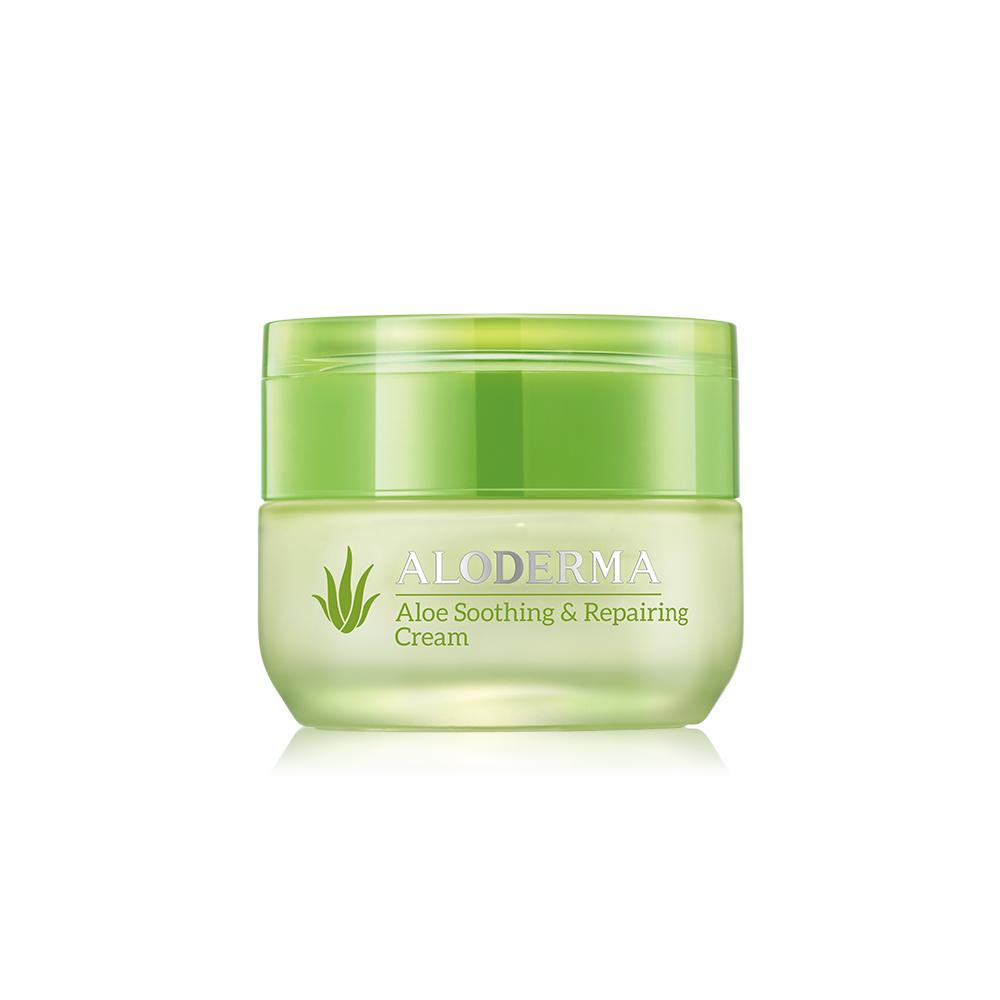Aloderma Soothing &amp; Repairing Cream, <a href="https://aloderma.com/"><u>https://aloderma.com/</u></a></th>
</tr>
</thead>
<tbody>
</tbody>
</table>
<section class="footnotes" role="doc-endnotes">

<ol>
<li id="fn1" role="doc-endnote">
Strangeremains, “Beauty to Die for: How Vanity Killed an 18th Century Celebutante,” Strange Remains, January 31, 2017, <a href="https://strangeremains.com/2017/01/31/beauty-to-die-for-how-vanity-killed-an-18th-century-celebutante/"><u>https://strangeremains.com/2017/01/31/beauty-to-die-for-how-vanity-killed-an-18th-century-celebutante/</u></a>.<a href="#fnref1" class="footnote-back" role="doc-backlink">↩︎</a>
</li>
</ol>
</section>

### Table 3: Whitening the face

<table>
<colgroup>
<col style="width: 33%" />
<col style="width: 33%" />
<col style="width: 33%" />
</colgroup>
<thead>
<tr class="header">
<th><strong>Recipe Source</strong></th>
<th><strong>Ingredients</strong></th>
<th><strong>Image</strong></th>
</tr>
<tr class="odd">
<th>Ms. Fr. 640 recipes</th>
<th><a href="https://edition640.makingandknowing.org/#/folios/20v/f/20v/tl"><u>Fol. 20v</u></a>, “For whitening the face:” Puffball and water, or wheat starch and water</th>
<th>
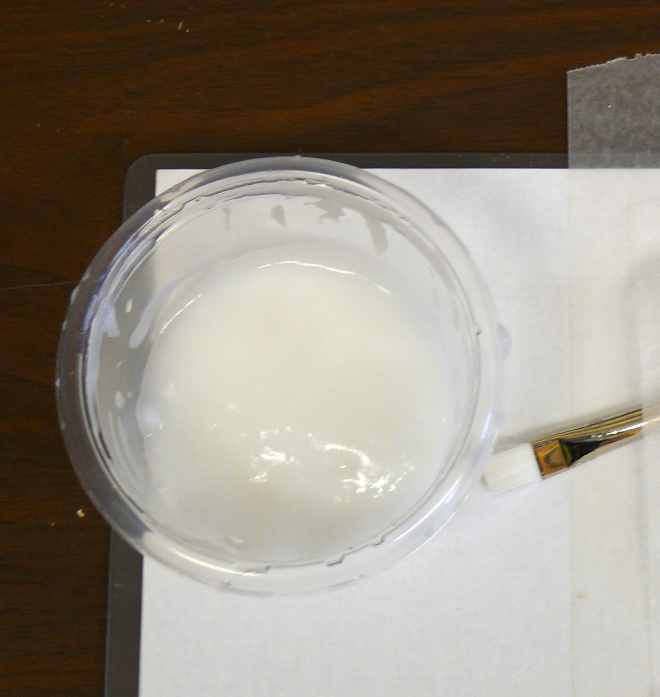

Wheat starch and water
</th>
</tr>
<tr class="header">
<th>Contemporary remedy</th>
<th>Niacinamide, Vitamin C (usually contained in skin care products to brighten skin tone)</th>
<th>
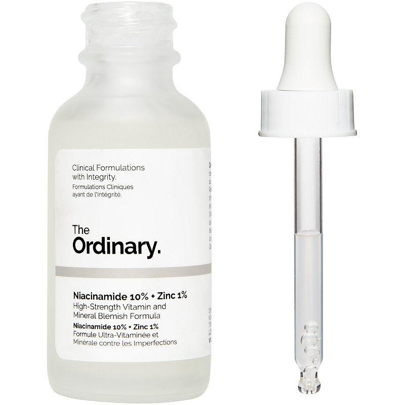

Niacinamide serum
</th>
</tr>
</thead>
<tbody>
</tbody>
</table>

### Table 4: Getting rid of the redness of eyes or bruising

| **Recipe Source**   | **Ingredients**                                                                                                                                                                            | **Image**                                                                 |
|---------------------|--------------------------------------------------------------------------------------------------------------------------------------------------------------------------------------------|---------------------------------------------------------------------------|
| Ms. Fr. 640 recipes | [<u>Fol. 11v</u>](https://edition640.makingandknowing.org/#/folios/11v/f/11v/tl), “For getting rid of the redness of eyes or bruising:” sliced raw mutton flesh (applied to the skin/eyes) | 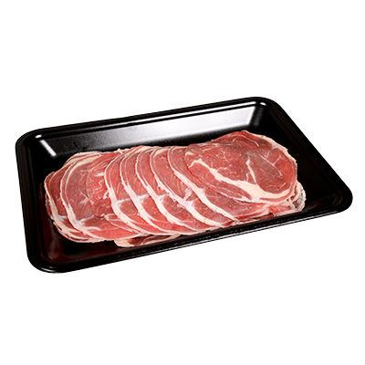 |
| Contemporary remedy | Ice (leave an ice pack in place for 10-20 min), or cool compresses over closed eyes                                                                                                        | 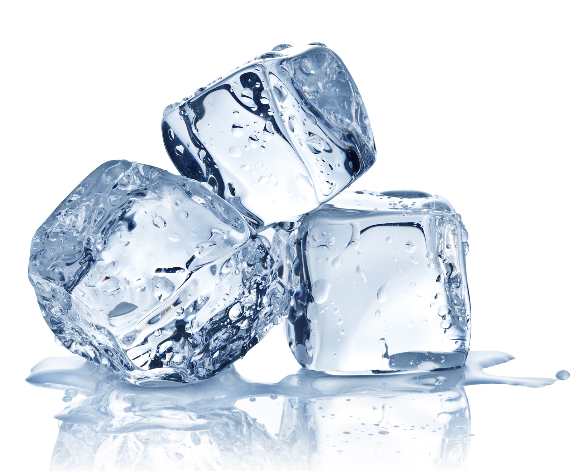  |

### Table 5: Against burns

<table>
<colgroup>
<col style="width: 33%" />
<col style="width: 33%" />
<col style="width: 33%" />
</colgroup>
<thead>
<tr class="header">
<th><strong>Recipe Source</strong></th>
<th><strong>Ingredients</strong></th>
<th><strong>Image</strong></th>
</tr>
<tr class="odd">
<th>Ms. Fr. 640 recipes</th>
<th><a href="https://edition640.makingandknowing.org/#/folios/20v/f/20v/tl"><u>Fol. 20v</u></a>, “Against burn:” onion and verjuice, or black soap</th>
<th>
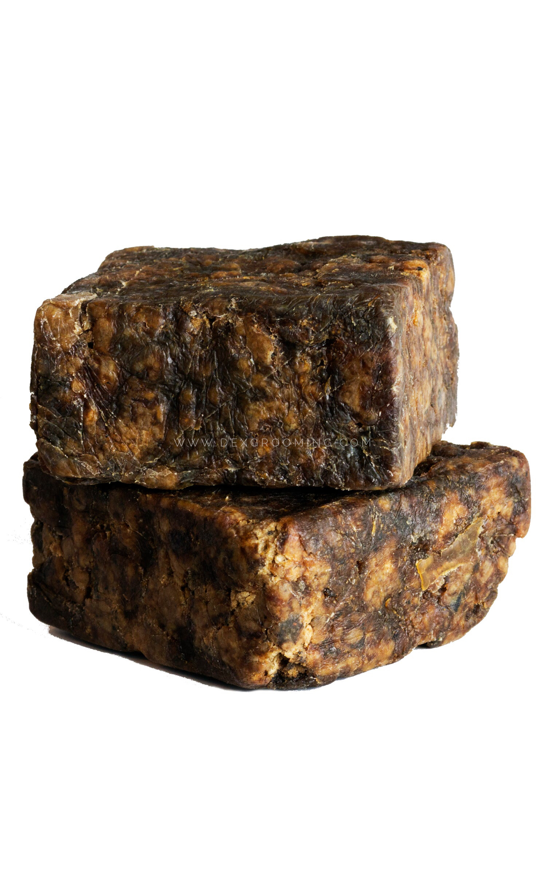

Raw natural black soap
</th>
</tr>
<tr class="header">
<th>Contemporary remedy</th>
<th>For minor burns: petroleum jelly or aloe vera</th>
<th>
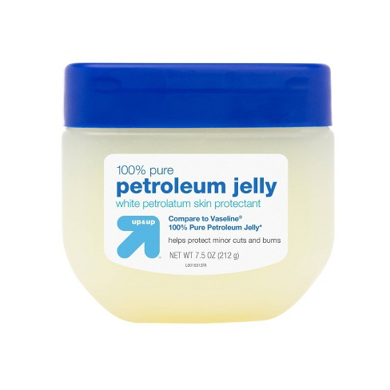

Petroleum jelly
</th>
</tr>
</thead>
<tbody>
</tbody>
</table>

### Table 6: Against wounds

<table>
<colgroup>
<col style="width: 33%" />
<col style="width: 33%" />
<col style="width: 33%" />
</colgroup>
<thead>
<tr class="header">
<th><strong>Recipe Source</strong></th>
<th><strong>Ingredients</strong></th>
<th><strong>Image</strong></th>
</tr>
<tr class="odd">
<th>Ms. Fr. 640 recipes</th>
<th><a href="https://edition640.makingandknowing.org/#/folios/55r/f/55r/tl"><u>Fol. 55r</u></a>, “Against wounds:” sap, pestled semperviva plant</th>
<th>
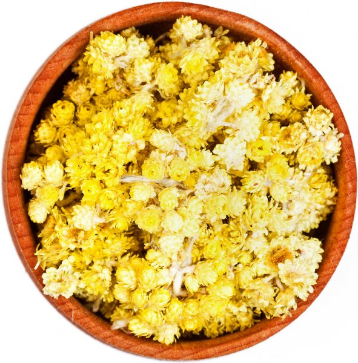

Semperviva herb
</th>
</tr>
<tr class="header">
<th>Contemporary remedy</th>
<th>Antibiotic ointment or petroleum jelly</th>
<th>
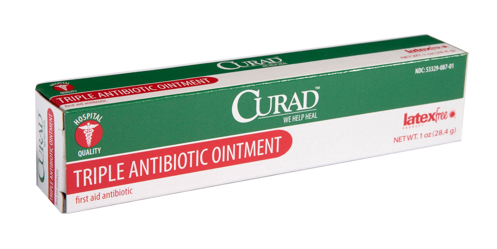

Antibiotic ointment
</th>
</tr>
</thead>
<tbody>
</tbody>
</table>

### Summary of the Recipes

Although recipes from each period (sixteenth and twenty-first centuries)
are limited to varying degrees by the technology of the times, we can
still compare them in general terms. From the six examples presented in
the above tables, we can find a pattern that people in early modern
Europe tended to use ingredients based on their experience, which
includes knowledge from observation and experiment. For instance, herbs
and the essential oil of herbs included on [<u>fol.
55r</u>](https://edition640.makingandknowing.org/#/folios/55r/f/55r/tl)
show the experimental basis. The author-practitioner mentions that
before using the sap and semperviva for wounds, one should test the
remedy by cutting a chicken or dog. The recipes for whitening and
reducing the redness of the face use ingredients that can make people
see the results directly based on people's observations. For example,
the use of lead powder can immediately cover the redness, although
people didn’t necessarily know that it harmed the human body at the same
time.

Today, lab-based experimentation and the extensive experience of trying
and testing various ingredients has been formalized, and the process of
making and knowing has been organized in this system. People tend to pay
more attention to the useful components in ingredients instead of the
ingredients themselves. For instance, we can see that products with aloe
vera and petroleum jelly keep appearing in remedies for several skin
issues since they all have a skin-soothing effect. For whitening teeth,
toothpastes with hydrogen peroxide are recommended because of its
bleaching properties. From the comparison of historical recipes to
modern remedies, we can see that the use of ingredients is shifting from
themselves to the active ingredients in them.

## Bibliography

Bol, Marjolijn. “Medieval Makeup 'Artists'. Painting Wood and Skin.” The Recipes Project, February 18, 2014. [<u>https://recipes.hypotheses.org/3344</u>](https://recipes.hypotheses.org/3344).

Cabré, Montserrat. “Keeping Beauty Secrets in Early Modern Iberia.” In *Secrets and Knowledge in Medicine and Science, 1500-1800*, edited by Elaine Leong and Alisha Rankin. Burlington: Ashgate, 2016, 179–202. [<u>https://doi.org/10.4324/9781315608006-16</u>](https://doi.org/10.4324/9781315608006-16).

Fissell, Mary E. “Introduction: Women, Health, and Healing in Early Modern Europe.” *Bulletin of the History of Medicine* 82, no. 1 (2008): 1–17. [<u>https://doi.org/10.1353/bhm.2008.0024</u>](https://doi.org/10.1353/bhm.2008.0024).

Gentilcore, David. Essay. In *Medical Charlatanism in Early Modern Italy*, 190–91. Oxford: Oxford Univ. Press, 2006.

Lindemann, Mary. *Medicine and Society in Early Modern Europe*. Cambridge: Cambridge University Press, 2013.

Liu, Xiaomeng, “Acid as Dental Cleanser and Tooth-Whitening Practices.” In *Secrets of Craft and Nature in Renaissance France. A Digital Critical Edition and English Translation of BnF Ms. Fr. 640*, edited by Making and Knowing Project, Pamela H. Smith, Naomi Rosenkranz, Tianna Helena Uchacz, Tillmann Taape, Clément Godbarge, Sophie Pitman, Jenny Boulboullé, Joel Klein, Donna Bilak, Marc Smith, and Terry Catapano. New York: Making and Knowing Project, 2020. [<u>https://edition640.makingandknowing.org/#/essays/ann_058_sp_17</u>](https://edition640.makingandknowing.org/#/essays/ann_058_sp_17). DOI: [<u>https://www.doi.org/10.7916/6ccz-7c74</u>](https://www.doi.org/10.7916/6ccz-7c74).

Liu, Xiaomeng. “Collecting Cures in an Artisanal Manuscript: Practical Therapeutics and Disease in Ms. Fr. 640.” In *Secrets of Craft and Nature in Renaissance France. A Digital Critical Edition and English Translation of BnF Ms. Fr. 640*, edited by Making and Knowing Project, Pamela H. Smith, Naomi Rosenkranz, Tianna Helena Uchacz, Tillmann Taape, Clément Godbarge, Sophie Pitman, Jenny Boulboullé, Joel Klein, Donna Bilak, Marc Smith, and Terry Catapano. New York: Making and Knowing Project, 2020. [<u>https://edition640.makingandknowing.org/#/essays/ann_057_sp_17</u>](https://edition640.makingandknowing.org/#/essays/ann_057_sp_17). DOI: [<u>https://www.doi.org/10.7916/wq5p-p848</u>](https://www.doi.org/10.7916/wq5p-p848).

Nisse, Cleo. “Shadows Beneath the Skin: How to Paint Faces in Distemper.” In *Secrets of Craft and Nature in Renaissance France. A Digital Critical Edition and English Translation of BnF Ms. Fr. 640*, edited by Making and Knowing Project, Pamela H. Smith, Naomi Rosenkranz, Tianna Helena Uchacz, Tillmann Taape, Clément Godbarge, Sophie Pitman, Jenny Boulboullé, Joel Klein, Donna Bilak, Marc Smith, and Terry Catapano. New York: Making and Knowing Project, 2020. [<u>https://edition640.makingandknowing.org/#/essays/ann_042_sp_16</u>](https://edition640.makingandknowing.org/#/essays/ann_042_sp_16). DOI: [<u>https://www.doi.org/10.7916/a6bs-0765</u>](https://www.doi.org/10.7916/a6bs-0765).

Piemontese, Alexis \[pseud.\]. *The secretes of the reverende Maister Alexis of Piemount: containing excellent remedies agaynste divers diseases, woundes, and other accidents, with the manner to make distillations, parfumes, confitures, dyings, colors, fusions, and meltings*. Trans. William Warde. London, 1568.

Poitevin, Kimberly. “Inventing Whiteness: Cosmetics, Race, and Women in Early Modern England.” *Journal for Early Modern Cultural Studies* 11, no. 1 (2011): 59–89. [<u>https://doi.org/10.1353/jem.2011.0009</u>](https://doi.org/10.1353/jem.2011.0009).

Stamets, Paul and Heather Zwickey. “Medicinal Mushrooms: Ancient Remedies Meet Modern Science.” *Integrative medicine* (Encinitas, Calif.) vol. 13, no. 1 (2014): 46–7. PMC4684114.

Strangeremains. “Beauty to Die for: How Vanity Killed an 18th Century Celebutante.” Strange Remains, January 31, 2017. [<u>https://strangeremains.com/2017/01/31/beauty-to-die-for-how-vanity-killed-an-18th-century-celebutante/</u>](https://strangeremains.com/2017/01/31/beauty-to-die-for-how-vanity-killed-an-18th-century-celebutante/).

Tapsoba, Issa, Stéphane Arbault, Philippe Walter, and Christian Amatore. “Finding out Egyptian Gods’ Secret Using Analytical Chemistry: Biomedical Properties of Egyptian Black Makeup Revealed by Amperometry at Single Cells.” *Analytical Chemistry* 82, no. 2 (2009): 457–60. [<u>https://doi.org/10.1021/ac902348g</u>](https://doi.org/10.1021/ac902348g).

Wecker, Johann Jacob, and Nicholas Culpeper. *Arts Master-Piece, or, the Beautifying Part of Physick.* London: Printed for Nath. Brook at the Angel in Cornhil, 1660. [<u>http://ezproxy.cul.columbia.edu/login?url=https://www.proquest.com/books/cosmeticks-beautifying-part-physick-which-all/docview/2240935566/se-2?accountid=10226</u>](http://ezproxy.cul.columbia.edu/login?url=https://www.proquest.com/books/cosmeticks-beautifying-part-physick-which-all/docview/2240935566/se-2?accountid=10226).

[^1]: Mary E. Fissell, “Introduction: Women, Health, and Healing in Early Modern Europe,” *Bulletin of the History of Medicine* 82, no. 1 (2008): [<u>https://doi.org/10.1353/bhm.2008.0024</u>](https://doi.org/10.1353/bhm.2008.0024), 9.

[^2]: Montserrat Cabré, “Keeping Beauty Secrets in Early Modern Iberia,” in *Secrets and Knowledge in Medicine and Science, 1500-1800*, ed. Elaine Leong and Alisha Rankin (Burlington: Ashgate, 2016): 179–202. [<u>https://doi.org/10.4324/9781315608006-16</u>](https://doi.org/10.4324/9781315608006-16).

[^3]: Paul Stamets and Heather Zwickey, “Medicinal Mushrooms: Ancient Remedies Meet Modern Science,” *Integrative medicine* (Encinitas, Calif.) vol. 13, no. 1 (2014): 46–7. PMC4684114.

[^4]: Ibid.

[^5]: Issa Tapsoba et al., “Finding out Egyptian Gods’ Secret Using Analytical Chemistry: Biomedical Properties of Egyptian Black Makeup Revealed by Amperometry at Single Cells,” *Analytical Chemistry* 82, no. 2 (2009): pp. 457–460, [<u>https://doi.org/10.1021/ac902348g</u>](https://doi.org/10.1021/ac902348g).

[^6]: Xiaomeng Liu, “Collecting Cures in an Artisanal Manuscript: Practical Therapeutics and Disease in Ms. Fr. 640,” in *Secrets of Craft and Nature in Renaissance France. A Digital Critical Edition and English Translation of BnF Ms. Fr. 640*, ed. Making and Knowing Project, et al. (New York: Making and Knowing Project, 2020), [<u>https://edition640.makingandknowing.org/#/essays/ann_057_sp_17</u>](https://edition640.makingandknowing.org/#/essays/ann_057_sp_17). DOI: [^<u>https://www.doi.org/10.7916/wq5p-p848</u>](https://www.doi.org/10.7916/wq5p-p848).

[^7]: Ibid.

[^8]: Mary Lindemann, *Medicine and Society in Early Modern Europe* (Cambridge: Cambridge University Press, 2013).

[^9]: Marjolijn Bol, “Medieval Makeup 'Artists'. Painting Wood and Skin,” The Recipes Project, February 18, 2014, [<u>https://recipes.hypotheses.org/3344</u>](https://recipes.hypotheses.org/3344).

[^10]: Cleo Nisse, “Shadows Beneath the Skin: How to Paint Faces in Distemper,” in *Secrets of Craft and Nature in Renaissance France. A Digital Critical Edition and English Translation of BnF Ms. Fr. 640*, ed. Making and Knowing Project, et al. (New York: Making and Knowing Project, 2020), [<u>https://edition640.makingandknowing.org/#/essays/ann_042_sp_16</u>](https://edition640.makingandknowing.org/#/essays/ann_042_sp_16). DOI: [<u>https://www.doi.org/10.7916/a6bs-0765</u>](https://www.doi.org/10.7916/a6bs-0765).

[^11]: Kimberly Poitevin, “Inventing Whiteness: Cosmetics, Race, and Women in Early Modern England,” *Journal for Early Modern Cultural Studies* 11, no. 1 (2011): pp. 59-89, [<u>https://doi.org/10.1353/jem.2011.0009</u>](https://doi.org/10.1353/jem.2011.0009).

[^12]: Mary Lindemann, *Medicine and Society in Early Modern Europe* (Cambridge: Cambridge University Press, 2013).

[^13]: Xiaomeng Liu, “Acid as Dental Cleanser and Tooth-Whitening Practices,” in *Secrets of Craft and Nature in Renaissance France. A Digital Critical Edition and English Translation of BnF Ms. Fr. 640*, ed. Making and Knowing Project, et al. (New York: Making and Knowing Project, 2020), [<u>https://edition640.makingandknowing.org/#/essays/ann_058_sp_17</u>](https://edition640.makingandknowing.org/#/essays/ann_058_sp_17). DOI: [<u>https://www.doi.org/10.7916/6ccz-7c74</u>](https://www.doi.org/10.7916/6ccz-7c74).

[^14]: Johann Jacob Wecker and Nicholas Culpeper, *Arts Master-Piece, or, the Beautifying Part of Physick* (London: Printed for Nath. Brook at the Angel in Cornhil, 1660). [<u>http://ezproxy.cul.columbia.edu/login?url=https://www.proquest.com/books/cosmeticks-beautifying-part-physick-which-all/docview/2240935566/se-2?accountid=10226</u>](http://ezproxy.cul.columbia.edu/login?url=https://www.proquest.com/books/cosmeticks-beautifying-part-physick-which-all/docview/2240935566/se-2?accountid=10226).

[^15]: David Gentilcore, in *Medical Charlatanism in Early Modern Italy* (Oxford: Oxford Univ. Press, 2006), pp. 190-191.

[^16]: Alexis Piemontese, *The secretes of the reverende Maister Alexis of Piemount: containing excellent remedies agaynste divers diseases, woundes, and other accidents, with the manner to make distillations, parfumes, confitures, dyings, colors, fusions, and meltings*, trans. William Warde (London, 1568).

[^17]: Ibid.
