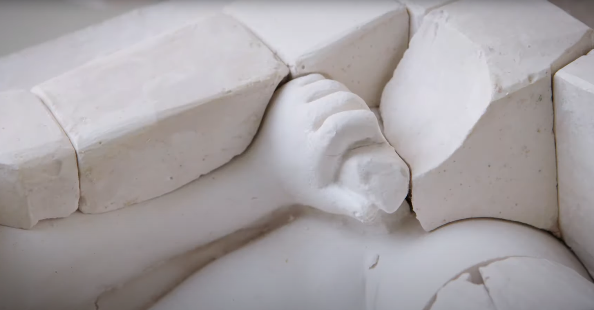

# The Making and Meaning of Intermediates: Workshop and Syllabus for Students of Architecture

Benjamin Weisgall

*Screen capture from [<u>“How was it made? Plaster
cast”</u>](https://www.youtube.com/watch?v=PHgEcPmCPUA&t=14s) by the V&A
Museum*

The following six-week unit is designed for students of art and
architecture and others who are already comfortable in the workshop
([*<u>la
boutique</u>*](https://edition640.makingandknowing.org/#/folios/166r))
but may be less familiar with the uses and pleasures of historical study
([*<u>quelque
histoire</u>*](https://edition640.makingandknowing.org/#/folios/39v)).
Using the digital critical edition of Ms. Fr. 640, student-participants
will follow the author-practitioner and his interlocutors into an
intensive study of early modern molding and casting. This unit adopts
the M&K Project’s dual pedagogical approach of conceptual articulation
alongside material fabrication, with the ultimate goal of developing
research skills in the history of techniques.[1] Student-participants
will not only learn how to work through actual historical “recipes” for
[<u>patternmaking</u>](https://edition640.makingandknowing.org/#/folios/139v/f/139v/tl)
and
[<u>moldmaking</u>](https://edition640.makingandknowing.org/#/folios/83v/f/83v/tl),
but they will also have the opportunity to think creatively about those
techniques in the range of possibilities that they afford. In order to
achieve this middle position between historical work and artistic work,
the unit takes as its theme the variety of intermediary objects that are
inherent to any process of casting.

In a workshop, the final product (for instance, a decorative object made
of metal) is the horizon or the goal for the fabricator. However, the
assignments for this unit focus on the working objects that circulate
before the product is completed. For casting, these include the
[<u>pattern</u>](https://www.doi.org/10.7916/hbnz-5z03) (i.e., the found
or sculpted object to be reproduced), the elements that are added to
that pattern (e.g.,
[<u>gates</u>](https://edition640.makingandknowing.org/#/folios/164r/f/164r/tl),
risers, cores), and the mold itself (even ones that are not quite
object-like, like those made of the author-practitioner’s favorite
material, “[<u>impalpable
sand</u>](https://edition640.makingandknowing.org/#/essays/ann_307_ie_19)”).
Casting recipes even refer to a category of models known as
“intermediates,” which represent milestones between the original
conception and the final product. Intermediary objects afford the
fabricator the opportunity to adjust,
[<u>repair</u>](https://doi.org/10.7916/8je7-1124), and critique the
design prior to beginning work on its final form.[2] Intermediates are
positive models that are made to imitate the final product, much like
the final product is often meant to
[<u>imitate</u>](https://edition640.makingandknowing.org/#/folios/141r/f/141r/tl)
a natural object, but with one exception: intermediates exist prior to
the thing they are imitating. That said, the contemporary discourse on
art making, including Ms. Fr. 640, suggested that imitation could be
anticipatory and not just reactive. For instance, the argument was made
that finely made art objects, aside from looking like the real thing,
could actually reveal the “nature” of that thing.[3] In the late
sixteenth and seventeenth centuries, this kind of hands-on
knowledge-making, which had hitherto been largely ignored by an
Aristotelian tradition that held artistic production in low regard,
blossomed.[4] The contention of this unit is that the imitation
performed by intermediary objects vis-à-vis final products entails an
analogous kind of knowledge-making. If art can capture the “essence” of
natural objects, then intermediates can be understood to convey the
“technical essence” of art objects.[5] Whereas something’s essence has
to do with “what it is,” its technical essence pertains instead to “how
it is.” In the case of art objects, technical definitions are concerned
primarily with the ways in which things are made. This focus on
technique reflects the M&K Project’s emphasis on “process over product.”
However, intermediates are themselves objects — durable, recognizable
and thing-like.[6] Therefore, they call into question any description of
technical essence that maintains a hard distinction between processes as
actions and products as things. In short, intermediates are objects
coming into being.

The primary difference between an intermediate and its corresponding
final product is material composition.[7] In the sixteenth-century
workshop, intermediate models were often made of clay or wax, which
allow for extended or infinite working time but are vulnerable to decay.
This type of model was almost always destroyed or lost in the course of
producing the final cast, meaning the final form could only be produced
once. However, if more than one copy or more than one version of a model
was desired, the premiere material was plaster.[8] Although it is
usually associated with the rise of archaeological science and public
museums, casting with plaster was an ancient technique for reproducing
artifacts and working iteratively.[9] During the sixteenth century,
molding with plaster became another crucial technique for reproducing
objects through a process known as indirect casting.[10] Initially
developed as a means of making multiples in bronze, this method of
making multipart plaster molds without destroying the original object
laid the foundation for the explosion during the eighteenth and
nineteenth centuries of plaster copies of master works. Thus, a
secondary focus of this unit is on plaster as a paradigmatic
intermediary material. Compared to wax or clay, plaster can more easily
be made to imitate other materials. Not only could plaster be painted to
look like stone or even bronze, but unfinished plaster was often
construed as a stand-in for white marble.[11]

The first half of the syllabus is a fast-paced introduction to early
modern casting through relevant entries in Ms. Fr. 640 and research
essays in the Edition as well as other secondary literature. Beginning
with the author-practitioner’s [<u>idiosyncratic
method</u>](https://edition640.makingandknowing.org/#/folios/140v/f/140v/tl)
of casting sulfur into the pith of baked bread, student-participants
will move through a short series of historical reconstructions designed
to acquaint them with a variety of materials and methods. The ultimate
goal of the first half is to develop two complementary skills relevant
to the historiography of techniques: one, close reading of recipes and
other technical literature, and two, creative work (in the studio or
lab) that follows the objects rather than the text. The second half of
the syllabus applies these skills to an indirect casting project, in
which a complex object is molded in plaster pieces and then cast in
plaster. A final short assignment introduces technical writing as its
own kind of craft by asking students to describe how a particular object
was made. The overall aim is for student-participants to move beyond an
understanding of history as that which ought to be emulated or as that
which has determined the present. In contrast to these static attitudes
towards the past, and in concert with the iterative methods in Ms. Fr.
640 and similar how-to manuals, the approach to history fostered by this
unit will be skeptical insofar as the past is understood, like the
present, to be a field of possibility.

## Syllabus

Week 1 / Intermediary objects and historical study

-   Mark Jarzombek, [<u>“Prolegomena to Critical
    > Historiography,”</u>](https://www.jstor.org/stable/1425409)
    > *Journal of Architectural Education* 52, no. 4 (1999):
    > 197-206.[12]

-   Michael Cole, [<u>“Cellini’s
    > Blood,”</u>](https://doi.org/10.2307/3050690) *The Art Bulletin*
    > 81, no. 2 (1999): 215-235.

-   Lawrence Principe, [<u>“Chymical Exotica in the Seventeenth Century,
    > or, How to Make the Bologna
    > Stone,”</u>](https://doi.org/10.1080/00026980.2016.1213011)
    > *Ambix* 63 (2016): 118-144.

Week 2 / Introduction to casting through Ms. Fr. 640

-   [<u>Entries</u>](https://edition640.makingandknowing.org/#/entries)
    > from the manuscript on casting

-   Rozemarijn Landsman and Jonah Rowen, [<u>“Uses of Sulfur for
    > Casting,”</u>](https://edition640.makingandknowing.org/#/essays/ann_007_fa_14)
    > in *Secrets of Craft and Nature in Renaissance France. A Digital
    > Critical Edition and English Translation of BnF Ms. Fr. 640*,
    > edited by Making and Knowing Project (2020)

-   Emma Le Pouésard, [<u>“Bread as a Mediating Material: Tactile Memory
    > and
    > Touch,”</u>](https://edition640.makingandknowing.org/#/essays/ann_050_fa_16)
    > in *Secrets of Craft and Nature in Renaissance France. A Digital
    > Critical Edition and English Translation of BnF Ms. Fr. 640*,
    > edited by Making and Knowing Project (2020)

<!-- -->

-   Assignment: [<u>molding with
    > bread</u>](https://cu-mkp.github.io/sandbox/docs/breadmolding-assignment.html),
    > [<u>casting with
    > stucco</u>](https://cu-mkp.github.io/sandbox/docs/stucco-assignment.html)

Week 3 / Modeling as a technique

-   Matthew Hunter, “Modeling: a secret history of following,” in
    > [*<u>Design Technics: archaeologies of architectural
    > practice</u>*](https://clio.columbia.edu/catalog/15121527?counter=2),
    > eds. Zeynep Çelik Alexander and John May (University of Minnesota
    > Press, 2020), 45-70.

-   Nancy Cartwright, “Models: Parables v. Fables,” in [*<u>Beyond
    > Mimesis and Convention: Representation in Art and
    > Science</u>*](https://clio.columbia.edu/catalog/15222116), eds.
    > Roman Frigg and Matthew Hunter (Springer, 2010), 19-31.

-   Eckart Marchand, “Material Distinctions: Plaster, Terracotta, and
    > Wax in the Renaissance Artist’s Workshop,” in [*<u>The Matter of
    > Art: Materials, Practices, Cultural Logics, c.
    > 1250-1750</u>*](https://clio.columbia.edu/catalog/10972585), ed.
    > Christy Anderson, Anne Dunlop and Pamela Smith (Manchester
    > University Press, 2015)

<!-- -->

-   Assignment: from found object to wax object to plaster object

Week 4 / Indirect casting, part 1

-   Selections on casting from Cennino Cennini, [*<u>Il libro dell’Arte
    > (The Craftsman’s
    > Handbook)</u>*](https://archive.org/details/craftsmanshandbo00cenn/mode/2up).
    > Translated by Daniel V. Thompson, Jr. (New York: Dover, 1960)

-   Richard Stone, [<u>“Antico and the Development of Bronze Casting in
    > Italy at the End of the
    > Quattrocento,”</u>](https://doi.org/10.2307/1512771) *Metropolitan
    > Museum Journal* 16 (1981): 87-116.

<!-- -->

-   Assignment: piece-molding a complex object

Week 5 / Indirect casting, part 2

-   \[no reading\]

<!-- -->

-   Assignment: casting a complex object with a multipart mold

Week 6 / Between reproduction and innovation

-   Hélène Vérin, "Rédiger et réduire en art: un projet de
    > rationalisation des pratiques,” in [*<u>Réduire en art: La
    > technologie de la Renaissance aux
    > Lumières</u>*](https://clio.columbia.edu/catalog/7031831?counter=1),
    > eds. Pascal Dubourg Glatigny et Hélène Vérin (Éditions de la
    > Maison des sciences de l’homme, 2008), 17-58

-   Vera Keller, [<u>“Everything depends on the trial (“Le tout gist à
    > l’essay”): Four manuscripts between the Recipe and the
    > Experimental
    > Essay,”</u>](http://edition640.makingandknowing.org/#/essays/ann_300_ie_19)
    > in *Secrets of Craft and Nature in Renaissance France. A Digital
    > Critical Edition and English Translation of BnF Ms. Fr. 640*,
    > edited by Making and Knowing Project (2020)

<!-- -->

-   Assignment: technical writing, or, the genre of how-to

[1] For a statement about the pedagogical possibilities that exist
alongside this type of historical research, see Pamela H. Smith, “Making
the Edition of Ms. Fr. 640.” In *Secrets of Craft and Nature in
Renaissance France. A Digital Critical Edition and English Translation
of BnF Ms. Fr. 640*, edited by Making and Knowing Project, Pamela H.
Smith, Naomi Rosenkranz, Tianna Helena Uchacz, Tillmann Taape, Clément
Godbarge, Sophie Pitman, Jenny Boulboullé, Joel Klein, Donna Bilak, Marc
Smith, and Terry Catapano. Making and Knowing Project, 2020.
[<u>https://edition640.makingandknowing.org/#/essays/ann_329_ie_19</u>](https://edition640.makingandknowing.org/#/essays/ann_329_ie_19).
As a subdiscipline, the history of techniques can be traced to the work
of French historians of technology, such as Bertrand Gille, whose
monumental *Histoire des techniques* (1977) placed technology squarely
within the Aristotelian category of nature (*physis*), or, that which
changes. The ambiguity of meaning of French word *la technique*, which
can connote both machine activity and manual skill, is exploited heavily
within this historiographical tradition. For an early expression, see
the collection of essays by Lucien Febvre, Marc Bloch, Maurice Halbwachs
and others, under the title “Techniques et machinisme,” *Annales
d’histoire économique et sociale* 6 (1934): 606-630. One must include
the work of paleo-anthropologist André Leroi-Gourhan in this
bibliography, for instance his *Milieu et Techniques* (1945).

[2] Without making too rigid of a distinction, it would be useful here
to distinguish between an intermediate object and an unfinished, or *non
finito*, artwork. Whereas the latter simply needs more work or at least
is made to look like it needs more work, an intermediary object, such as
a mold, is, in an important sense, complete. On the *non finito* work in
the Renaissance, see Andrea Bayer, “Renaissance Views of the
Unfinished.” In *Unfinished: Thoughts Left Visible*, edited by Kelly
Baum, Andrea Bayer, and Sheena Wagstaff. New York: The Metropolitan
Museum of Art, 2016.

[3] For an analysis of this perspective in the recipe for “counterfeit
jasper” in Ms. Fr. 640, see Isabella Lores-Chavez, “Imitating Raw
Nature.” In *Secrets of Craft and Nature in Renaissance France. A
Digital Critical Edition and English Translation of BnF Ms. Fr. 640*,
edited by Making and Knowing Project, Pamela H. Smith, Naomi Rosenkranz,
Tianna Helena Uchacz, Tillmann Taape, Clément Godbarge, Sophie Pitman,
Jenny Boulboullé, Joel Klein, Donna Bilak, Marc Smith, and Terry
Catapano. New York: Making and Knowing Project, 2020.
[<u>https://edition640.makingandknowing.org/#/essays/ann_045_fa_16</u>](https://edition640.makingandknowing.org/#/essays/ann_045_fa_16).
For a broader argument about how the histories of craft and science
comprise a single research agenda, see Pamela H. Smith, “Making as
Knowing: Craft as Natural Philosophy.” In *Ways of Making and Knowing:
The Material Culture of Empirical Knowledge*, edited by Pamela H. Smith,
Amy R. W. Meyers, and Harold J. Cook. Ann Arbor: University of Michigan
Press, 2014.

[4] See Pamela H. Smith, *The Body of the Artisan: Art and Experience in
the Scientific Revolution*. Chicago: University of Chicago Press, 2004;
and Pamela Long, *Artisan Practitioners and the Rise of the New
Sciences, 1400-1600*. Corvallis: Oregon State University Press, 2011.

[5] On technical essence, or “technicity,” see the work of another
French philosopher of techniques, Gilbert Simondon, especially chapter 2
of his *On the Mode of Existence of Technical Objects*. Translated by
Cecile Malaspina and John Rogove. University of Minnesota Press, 2017.

[6] Again, without drawing too stark of a contrast, intermediates can be
distinguished from work which might be called [<u>ephemeral
art</u>](https://www.doi.org/10.7916/vgj0-yh50). This category includes
objects for theater, banquets, and ceremonies. Unlike intermediary
objects, ephemeral works, despite their short life, were intended as
final products.

[7] Another important difference was size, but for the purposes of this
unit, size is an issue that correlates strongly with material via the
question of weight. For the most important contemporary discourse on the
relation between size and material, which in fact takes as its starting
point the question of a model’s relation to nature, see the First Day of
Galileo Galilei, *Dialogues Concerning Two New Sciences*. Translated by
Alfonso de Salvio and Henry Crew. New York: Dover Publications, 1914.

[8] There were at least two broad categories of plaster in the
Renaissance: *gesso*, or plaster made of gypsum and used primarily by
painters; and *calcina*, or plaster made of lime and used by sculptors
and builders. This latter category is sometimes referred to as *stucco*
but inconsistently so. Although material distinctions are certainly an
important issue for this unit, this short essay uses the English term
plaster rather indiscriminately.

[9] On early modern plaster casting as a practice that grew out of
medieval traditions and was adapted by the new humanistic concerns of
the Renaissance, see Eckart Marchand’s chapter on “Plaster and Plaster
Casts in Renaissance Italy,” in *Plaster casts: making, collecting, and
displaying from classical antiquity to the present*, edited by Rune
Frederiksen and Eckard Marchand. New York: De Gruyter, 2010. Marchand
notes how plaster casts of human bodies and body parts were used as
intermediate objects by painters and sculptors alike as substitutes for
live models. See Mari Lending, *Plaster Monuments* (Princeton, 2017) for
a wide-ranging look at nineteenth-century plaster casts as mass media
before photography. For an example of this, see the [<u>cast courts at
the V&A
Museum</u>](https://collections.vam.ac.uk/search/?id_gallery=THES49798).

[10] Unlike lost wax casting, an indirect casting method preserves the
original model by breaking the mold into pieces which can be removed
from the pattern without destroying it. For an example of a plaster mold
being made for a plaster cast, see the [<u>how-to video on plaster
casting</u>](https://youtu.be/PHgEcPmCPUA) from the V&A Museum.

[11] For a succinct discussion of intermediary materials, see Eckert
Marchand, “Material distinctions: Plaster, Terracotta, and Wax in the
Renaissance Artist’s Workshop,” in *The Matter of Art: Materials,
Practices, Cultural Logics, c. 1250-1750*, ed. Christy Anderson, Anne
Dunlop and Pamela Smith (Manchester University Press, 2015). Marchand
calls this ability to point to other materials the “indexicality” of
plaster. He also suggests that plaster, as opposed to clay or wax, was
understood “as the lowliest in the hierarchy of materials” (173).
Plaster with polychromy, which was usually reserved for final objects
and is therefore peripheral to this essay, represents an extreme example
of this indexicality, insofar as the plaster object is made to imitate a
real object in toto. At another extreme, this self-negating quality of
plaster can produce highly abstract models that seem to be immaterial,
such as the mathematical models developed in the nineteenth century to
describe complex geometry. For a collection of photographs of these
models, see Gerd Fischer, *Mathematical Models: from the collections of
Universities and Museums* (Wiesbaden: Springer, 2017).

[12] This essay discusses the history of historical studies within
schools of architecture and argues that a critical mode of
historiography is needed alongside the productions of art, architecture,
and history. He adds that “it is possible to envision an art or
architectural practice as historiography!” (201)
