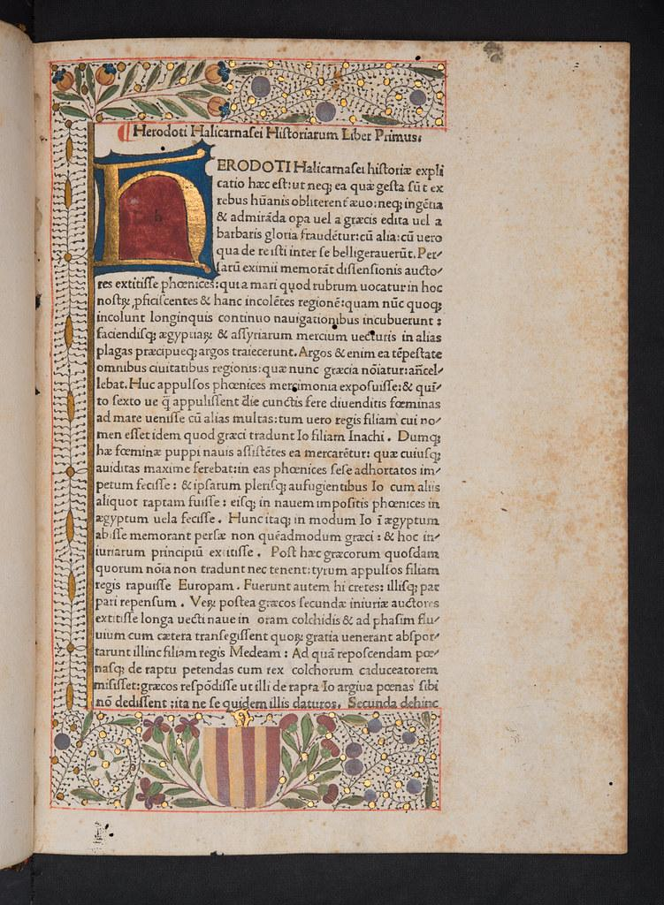
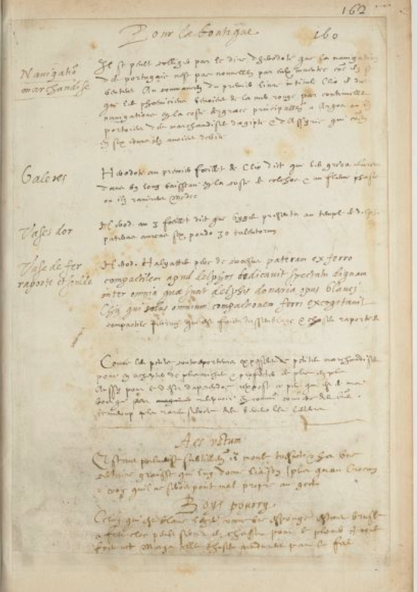
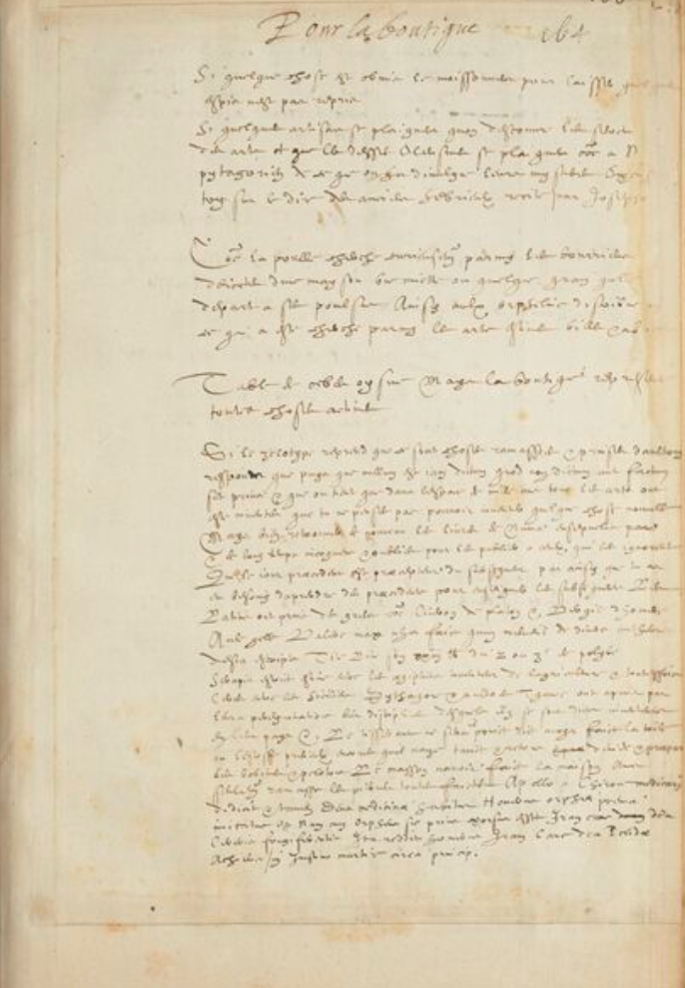

# Herodotus’ ‘Workshop’: A Core (Curriculum) Pathway into Ms. Fr. 640 and its Author-Practitioner

> Alejandra Quintana Arocho 
Professor Pamela Smith \| Naomi Rosenkranz \| Caroline Surman 
Making and Knowing in Early Modern Europe: Hands-on History 
10 May 2022

This project is directed toward Columbia College students who have taken the course "Literature Humanities" ([Lit Hum](https://www.college.columbia.edu/core/lithum)) as part of [Columbia's Core Curriculum](https://www.college.columbia.edu/core/core) and want to see how an author/artisan from Renaissance Toulouse participates in their ongoing literary/scholarly conversations.

> "Illuminated border in Herodotus: Historiae" by University of Glasgow Library is marked with CC BY-NC-SA 2.0.

## Introduction

In his account of the Greco-Persian wars,[^1] Herodotus doesn’t string
together a series of events into a narrative like we would expect a
historian to do nowadays (Dewald xxx). Rather, as you readers of the
*Histories*, might already know, Herodotus acts as a modern-day
investigator or reporter—he even calls his work an “enquiry” (Herodotus
3)—collecting both hearsay and eyewitness testimony whose veracity
he sometimes doubts but nevertheless believes is relevant or worth sharing.
You may recall the following excerpt from Book 2, in which Herodotus
comments on his struggles carrying out this investigation:

> I was unable to get any information from anyone else. However, *I
> myself* travelled as far as Elephantine and saw things *with my very
> own eyes*, and subsequently made *enquiries* of others; as a result of
> these two *methods*, the very most I could find out was as follows.
>
> Herodotus 2.29, emphasis added.

It seems that in this passage Herodotus is attempting to invest his 
“methods” of investigating with more authority and perhaps secure the
reader’s trust. Since it was “he himself” who “saw things with \[his\]
very own eyes”, his firsthand experience might seem more credible, and
his “enquiries” of others likely yielded what for him might have been
valid, even if not completely accurate, versions of events. And yet his
“methods” also function as a way to make his writing appear more factual
and less impartial, despite his book boasting stories that veer into the
fantastical or mythological (like the story of Arion and the dolphin,
1.23-4). For Herodotus, reaffirming the potential instability of his
sources actually makes his tales seem truer to life. Herodotus, though,
never really comments on his “theory” of history. There is no mention of
any approach or epistemology—in other words, how he views the making of
knowledge—that encapsulates his “methods”.

In her introduction to our
[<u>edition</u>](https://global.oup.com/ukhe/product/the-histories-9780199535668?cc=us&lang=en&)
of the *Histories*, Carolyn Dewald writes that “by paying attention to
Herodotus’ first-person comments we can read his text as an ongoing
*workshop* on how to think historically about logoi \[or stories\]”
(xxx, emphasis added). Herodotus’ approach then, though impossible to
completely piece together, can be described as a workshop of sorts—a
site of experimentation, a trove of trial and error, and a springboard
for innovation. Having reframed Herodotus’ *Histories* as a “workshop”,
it is perhaps not that surprising to find his work featured in the
recipe book of a late-sixteenth-century artisan from Toulouse, France.
Hard to categorize—much like the *Histories*—this manuscript, BnF Ms.
Fr. 640, contains elements of the “how-to” manual and the “book of
secrets” genres, but alludes to Herodotus’ writings and those of Virgil,
Homer, Pythagoras, among other thinkers from the Greco-Roman tradition
you probably are familiar with, in a way that places the manuscript in a
lineage of ancient texts. The author-practitioner—the anonymous person
who is credited with composing Ms. Fr. 640—is mainly concerned with
recipes that have to do with metal casting and painting. The manuscript folio
in which Herodotus is mentioned, 162r, under the fittingly titled entry 
“For the workshop”, is remarkable for being one of the only folios
in which the voice of the author-practitioner—in which his
role as an “author”, one endowed with his own opinions and theories on
writing and understanding the world as a maker not just of things
but of knowledge, too—shines through.

However, the context in which Herodotus appears in the manuscript and the
purpose that the author-practitioner’s reference to the *Histories*
might serve haven't really been considered thus far in studies
conducted on the manuscript’s genre-bending contents. My hope is
to offer a new lens through which to view Ms. Fr. 640 by reading the
*Histories* comparatively with two of the entries where the
author-practitioner intervenes or interjects to add an anecdote, an
opinion, or comment. I also aim to explore how tracing back the
“workshop” to Herodotus’ methodology might help us understand why Herodotus
is mentioned in the manuscript in the first place, and how his mention
contributes to the author-practitioner’s own presence in the text and
the authority he might aim to claim. Building on Vera Keller’s
analysis of the manuscript in her article “Everything depends upon the
trial ("Le tout gist à l’essay"): Four Manuscripts between the Recipe
and the Experimental Essay,” I consider the experimental essay as a
bridge between the genres the manuscript engages with and as a way for
the author-practitioner to build his “reliability” as someone who
perhaps was just as fit to contribute to academic/scholarly
conversations as students of Lit Hum are.

I therefore extend the definition of “experimental essay” beyond the
author-practitioner’s renowned contemporary, Montaigne, whom you’ve also
read and know spearheaded early modern conceptions of the “self” in
writing, to encapsulate Herodotus’ workshop, given how it prioritizes
the accumulation of firsthand experiences for any and all claims to
knowledge. I argue that reading the manuscript as a literary text that could 
have a place on the Lit Hum syllabus allows us to better understand
the role the author-practitioner assumes as an author who might have
imbued his text with a certain kind of authority; even if it might seem
obvious nowadays for authors to have a particular presence and voice in
a text, the idea of the “self’ was part of a gradual development, one
that involved precisely what the author-practitioner values most in his 
text: experimentation.

## Folio 162r, “For the workshop”

> 162r 
Making and Knowing Project, Pamela H. Smith, Naomi Rosenkranz, Tianna
Helena Uchacz, Tillmann Taape, Clément Godbarge, Sophie Pitman, Jenny
Boulboullé, Joel Klein, Donna Bilak, Marc Smith, and Terry Catapano,
eds., *Secrets of Craft and Nature in Renaissance France. A Digital
Critical Edition and English Translation of BnF Ms. Fr. 640* (New York:
Making and Knowing Project, 2020), [<u>https://edition640.makingandknowing.org/#/folios/162r</u>](https://edition640.makingandknowing.org/#/folios/162r).

“It can be gathered from the words of Herodotus,” so proclaims our
author-practitioner at the outset of this entry, “that the navigation of
the Portuguese was not newly invented by them, as they brag” (162r).
Under the subheading, “Navigation, trade,” the author-practitioner
presents his own takeaway from the opening passage of Book I of
Herodotus’ *Histories*, in which Herodotus writes about the Phoenicians’
travels across the Red Sea to the “coast of Greece” to deliver their
“merchandise from Egypt & from Assyria”, perhaps making a claim about
travels to the New World by the Portuguese having an ancient precedent
(162r). The author-practitioner’s framing of this reference to the
*Histories* already resembles Herodotus’ approach towards asserting his
authority as a historian; the phrase “\[i\]t can be gathered” is akin to
“\[a\]s far as I have been able to gather from my enquiries” (Herodotus
1.171) and “\[a\]s far as I can gather from our elders” (7.8). By
establishing a sort of hypothesis—“it *can* be gathered” doesn’t sound
too conclusive—about this passage from the *Histories*, the
author-practitioner cements what we might call in Lit Hum “close
reading” or “interpretation” as a way of experimenting with a text and
the knowledge contained therein, as a process of trial and error that he
might be at the center of, just as much as Herodotus is in his
“workshop”, or enquiries.

Throughout this entry, the author-practitioner frames his repeated
mentions of Herodotus using more subheadings, “Galleys”, “Gold vases”,
and “Iron vase joined and soldered”, that seem to offer insight into the
kinds of knowledge he was most interested in or identified as worthy of
reproducing or storing in his manuscript (162r). It is interesting that
the subheadings[^2] refer to specific objects but the main text
associated with each one of them simply provides the page and context in
which these objects appear in (what could have been his own copy of) the
*Histories* with no further commentary, as if he meant to go back to
Herodotus’ text to study the objects more carefully. Nevertheless, the
author-practitioner's framing of these objects also brings his voice into 
focus by establishing what to him is knowledge worth preserving, and this 
entry's ending all but confirms this desire to impart his wisdom and 
continue learning from others:

> As small peddlers lay open small wares in order to buy richer ones &
> to profit more and more, so I, from a desire to learn, am exposing
> what little is in my workshop to ~~have in~~ receive, through a common
> commerce of letters, much rarer secrets from my benevolent readers.
> 162r

Though the remainder of this folio might seem to abruptly jump to much
more detailed entries on molding, this immediacy, which allows “us to
feel as though we can follow along in the course of his trials,”
arguably demonstrates this wish for his voice and authority as an
author—as someone capable of producing and sorting knowledge as much as
a man of “letters” like Herodotus—to be recognized among a community of
readers and thinkers, who all have “secrets” of their own to give in
exchange (Keller).

## Folio 166r, “For the workshop” (cont’d?)

Our author-practitioner seems to continue reflecting on his “workshop”
under an entry with the same title on folio 166r. He begins by
acknowledging the possibility that he might have omitted something,
perhaps a recipe he anticipates his readership might have liked to be
included, and relies on an aphorism to excuse himself from any blame:
“the harvester is not reproached for leaving some ears of wheat” (166r).
The author-practitioner thus seems to embrace his role in curating 
useful recipes for a book that might be circulated widely, and
demonstrates confidence in his decisions. He is basically saying to his 
readers, “If I left something out, you should still trust me; after all, 
I cannot cover everything.” He then relies on another, more complex aphorism 
to carry home the message that eveyone can find something of value in his 
writing, even though he writes on the most underappreciated of the arts: craftwork.

> As the hen carefully searches the garbage thrown out of a house for a
> crumb or a grain that she divides among her chicks, thus one
> distributes to orphans that which has been sought among the arts
> considered vile & abject. 
> 166r

Even though Herodotus never explicitly refers to what he might have
omitted from his enquiries, he does recognize his role in curating
content for stories, or how he can keep certain things to himself if he
so chooses: “Although I am familiar with the details of this performance
and how each part of it goes, I will keep silence, except for what it is
acceptable to say” (2.171). The author-practitioner also seems to say
that he will speak to what is “acceptable” or what he is able to
transmit through writing; given just how embodied knowledge of the arts
is, it is not particularly easy to write in detail about processes that
engage so much muscle memory and sensory experience (Smith, “Collecting
Nature” 129). Perhaps that is why he mentions that the arts he practices
have been “considered vile & abject,” since they are erroneously only
correlated with bodily experience and not also with knowledge
production, despite the ties between employing the senses, especially
touch, and acquiring and disseminating knowledge about the world. Just
as there is something to be gained from Herodotus’ unconventional
approach towards writing history, there are perhaps lessons to be
shared, spread, and expanded upon in his work by readers or potential
apprentices.

> 166r 
> Making and Knowing Project, Pamela H. Smith, Naomi Rosenkranz, Tianna
Helena Uchacz, Tillmann Taape, Clément Godbarge, Sophie Pitman, Jenny
Boulboullé, Joel Klein, Donna Bilak, Marc Smith, and Terry Catapano,
eds., *Secrets of Craft and Nature in Renaissance France. A Digital
Critical Edition and English Translation of BnF Ms. Fr. 640* (New York:
Making and Knowing Project, 2020),
[<u>https://edition640.makingandknowing.org/#/folios/166r/f/166r/tc</u>](https://edition640.makingandknowing.org/#/folios/166r/f/166r/tc).

It is no wonder that the author-practitioner goes on to say that “the
workshop represents all things active”, as his text functions not just
as a space for him to actively explore knowledge worth sharing but also
as a repository of actions past and present. It is through repeated
actions, multiple attempts, that his recipes arise, and particularly by
actively “rediscover\[ing\]” experiments “picked up & taken from others”
(166r). He writes in Latin that “\[n\]othing is said now that has not
been said or done before,[^3]” implying that what we might think of as
copying texts “from those who preceded you” coukd actually 
imbue the texts with new meanings for “those who come after”, just as
his references to Herodotus in the manuscript might be doing (166r). And
amassing that which was “done before”—presumably, recipes from other
collections or processes from other craftspeople—is part and parcel of
his study through trial and error and his formation of interpretations,
including observations he makes on entries being “non bona” (“not
good”) or “doubtful” (13r, 120v). By also then mentioning how Virgil
borrowed from Homer—something you clearly noticed when you read the
*Aeneid* and couldn’t help comparing it to the *Iliad*—Cicero from
Plato, and Livy from Polybius, he places himself within this
long-standing tradition of borrowing across fields like literature,
philosophy, and history to imply his craft also involves conserving and
commenting on knowledge that has been consecrated through actions, and
not just words (166r).

## Conclusions

A consideration of these and more interventions by the author-practitioner in
his text, or specific moments where he seems to interject his thoughts
on his craft and “workshop,” offers us an intriguing glimpse of his
persona. Though he remains unnamed, when we look closely at his words,
our author-practitioner from Toulouse seems to speak to us more, and to
his contemporaries, as he recalls, explains and sometimes only hints at
all that he has “done before” (166r). I think further studies of the
manuscript in this vein of literary analysis can examine folios like 1r,
which contains an extensive list of names and textual sources in Latin,
and 169r, which appears to be an index of sorts but doesn’t seem to
match the book’s contents, in order to better understand his intellectual
pursuits, his interests, and his voice as an author.

There is also work to be done in analyzing how he (very likely
along with the help of other scribes) went about composing and
organizing the manuscript: viewing the format and structure of
the manuscript as intentional, as having just as much meaning as the
text, can lend more authority to the author-practitioner as well. Since
it is still uncertain whether the manuscript was meant to be published,
and what we have is probably a preliminary version, it is useful to
think about the ways in which the manuscript’s contents underscore the
experimental quality of and methodology behind his work (Smith, “An
Introduction”). Viewing the manuscript as an experimental essay, then,
might also be useful in piecing together what might seem like an
unfinished book. Making interpretations of our own—what Lit Hum is known
for—is an approach that can breathe new life into an already “active”
manuscript. I thus invite you to also comment on and perhaps even
perform your own comparative analyses of Ms. Fr. 640. Because nothing is
definitive in the manuscript, and everything has been said and done
before, keep experimenting, as the author-practitioner himself wished
others would do with his work.

Although at first the author-practitioner’s voice doesn’t seem as
authoritative as that of Cennino Cennini, an Italian predecessor of his
who opened his *Libro dell’Arte* (or *Craftsman’s Handbook*) with a
genealogy that tied his creative work to God, Adam, and Eve, he also
arguably upholds that “theory is the most worthy” and that it is
correlated with what he has “tried out with \[his\] own hand” (Cennini
1-2). By including among his recipes so many references to Greco-Roman
thinkers beyond Herodotus (for a comprehensive list, see
[<u>sp22_editorial-comments</u>](https://docs.google.com/spreadsheets/d/11EZtLlVSwX3auZ0Na5MkB26sl9pCNkwA-yrqtDmYUMk/edit#gid=0)),
he strengthens the ties between knowledge of the mind and knowledge of
the hand: each reference might be more deliberate than we think, for he
might have read and interpreted the texts according to his vision for
the workshop and applied their insights to expand on the experiments he
or others had previously conducted.

Given that new approaches towards craftsmanship were emerging throughout
the sixteenth century, and that what we now call “natural history” was
born out of precisely this study of firsthand experiences, along with a
reexamining of ancient texts, analyzing the interpretive work that the
author-practitioner does helps elucidate this gradual shift towards a
more personalized and experimental discipline (Smith, “Collecting
Nature” 130). Giving back authority to the author-practitioner also
enables us to picture what his role within this shift might have looked
like and posit whether he would have had just as much of a say in the
production of knowledge about the world as a scientist or someone with a
higher level education. Through this first comparative analysis with
Herodotus, I have aimed to narrow the gap between the
author-practitioner and the so-called father of history, someone whose
work isn’t that vastly different from an artisan from Toulouse’s when we
consider their approaches towards collecting experiences together. Just
as Herodotus frames his observations and chronicles with his “certain
knowledge”, the author-practitioner writes within the realm of what he
knows to be tried and true, and we still have much to rediscover about
his trials, failures, and successes (Herodotus 1.5).

## Works Cited

- 13r. Making and Knowing Project, Pamela H. Smith, Naomi Rosenkranz,
Tianna Helena Uchacz, Tillmann Taape, Clément Godbarge, Sophie Pitman, Jenny Boulboullé, Joel
Klein, Donna Bilak, Marc Smith, and Terry Catapano, eds., *Secrets of Craft and Nature in
Renaissance France. A Digital Critical Edition and English Translation of BnF Ms. Fr. 640* (New York: Making and Knowing Project, 2020),
[<u>https://edition640.makingandknowing.org/#/folios/13r/f/13r/tc</u>](https://edition640.makingandknowing.org/#/folios/13r/f/13r/tc).

- 120v. Making and Knowing Project, Pamela H. Smith, Naomi Rosenkranz,
Tianna Helena Uchacz, Tillmann Taape, Clément Godbarge, Sophie Pitman, Jenny Boulboullé, Joel
Klein, Donna Bilak, Marc Smith, and Terry Catapano, eds., *Secrets of Craft and Nature in
Renaissance France. A Digital Critical Edition and English Translation of BnF Ms. Fr. 640* (New York: Making and Knowing Project, 2020),
[<u>https://edition640.makingandknowing.org/#/folios/120v/f/120v/tc</u>](https://edition640.makingandknowing.org/#/folios/120v/f/120v/tc).

- 162r. Making and Knowing Project, Pamela H. Smith, Naomi Rosenkranz,
Tianna Helena Uchacz, Tillmann Taape, Clément Godbarge, Sophie Pitman, Jenny Boulboullé, Joel
Klein, Donna Bilak, Marc Smith, and Terry Catapano, eds., *Secrets of Craft and Nature in
Renaissance France. A Digital Critical Edition and English Translation of BnF Ms. Fr. 640* (New York: Making and Knowing Project, 2020),
[<u>https://edition640.makingandknowing.org/#/folios/162r</u>](https://edition640.makingandknowing.org/#/folios/162r).

- 166r. Making and Knowing Project, Pamela H. Smith, Naomi Rosenkranz,
Tianna Helena Uchacz, Tillmann Taape, Clément Godbarge, Sophie Pitman, Jenny Boulboullé, Joel
Klein, Donna Bilak, Marc Smith, and Terry Catapano, eds., *Secrets of Craft and Nature in
Renaissance France. A Digital Critical Edition and English Translation of BnF Ms. Fr. 640* (New York: Making and Knowing Project, 2020),
[<u>https://edition640.makingandknowing.org/#/folios/166r/f/166r/tc</u>](https://edition640.makingandknowing.org/#/folios/166r/f/166r/tc).

- Cennini, Cennino d’Andrea. *The Craftsman’s Handbook, ‘Il Libro dell’Arte’*, trans. by Daniel Thompson (New York: Dover, 1960).

- Dewald, Carolyn. “Introduction.” In *The Histories*. Oxford World’s Classics. (Oxford: OUP Oxford, 2008).[https://global.oup.com/ukhe/product/the-histories-9780199535668?cc=us&lang=en&](https://global.oup.com/ukhe/product/the-histories-9780199535668?cc=us&lang=en&).

- Herodotus. *The Histories*. Oxford World’s Classics. (Oxford: OUP Oxford, 2008). [https://global.oup.com/ukhe/product/the-histories-9780199535668?cc=us&lang=en&](https://global.oup.com/ukhe/product/the-histories-9780199535668?cc=us&lang=en&).

- Keller, Vera. “Everything depends upon the trial ("Le tout gist à l’essay"): Four Manuscripts between the Recipe and the Experimental Essay.” In *Secrets of Craft and Nature in Renaissance France. A Digital Critical Edition and English Translation of BnF Ms. Fr. 640*, edited by Making and Knowing Project, Pamela H. Smith, Naomi Rosenkranz, Tianna Helena Uchacz, Tillmann Taape, Clément Godbarge, Sophie Pitman, Jenny Boulboullé, Joel Klein, Donna Bilak, Marc Smith, and Terry Catapano. New York: Making and Knowing Project, 2020. [<u>https://edition640.makingandknowing.org/#/essays/ann_320_ie_19</u>](https://edition640.makingandknowing.org/#/essays/ann_320_ie_19).

- Smith, Pamela. “An Introduction to Ms. Fr. 640 and Its Author-Practitioner.” In *Secrets of Craft and Nature in Renaissance France. A Digital Critical Edition and English Translation of BnF Ms. Fr. 640*, edited by Making and Knowing Project, Pamela H. Smith, Naomi Rosenkranz, Tianna Helena Uchacz, Tillmann Taape, Clément Godbarge, Sophie Pitman, Jenny Boulboullé, Joel Klein, Donna Bilak, Marc Smith, and Terry Catapano. New York: Making and Knowing Project, 2020. [<u>https://edition640.makingandknowing.org/#/essays/ann_300_ie_19</u>](https://edition640.makingandknowing.org/#/essays/ann_300_ie_19).

- Smith, Pamela. “Collecting Nature and Art: Artisans and Knowledge in the Kunstkammer,” in *Engaging With Nature: Essays on the Natural World in Medieval and Early Modern Europe*, ed. Barbara Hannawalt and Lisa Kiser (University of Notre Dame Press, 2008), 115-136.

[^1]: A series of wars fought between various Greek states and the Persian empire, during which Persia invaded Greece twice, and the latter ended up victorious.

[^2]: This entry seems to be the only one that contains subheadings of this type in the entire manuscript.

[^3]: Per a note in the critical edition of Ms. Fr. 640, the author-practitioner here seems to be borrowing from Carthaginian playwright Terence, who, in his comedy *Eunuchus*, writes the following: "Nothing is said now that has not been said before” (166r). The author-practitioner adds the part about nothing being “done before,” another potential intervention of his own in the text and in ongoing scholarly conversations on the production of knowledge.
