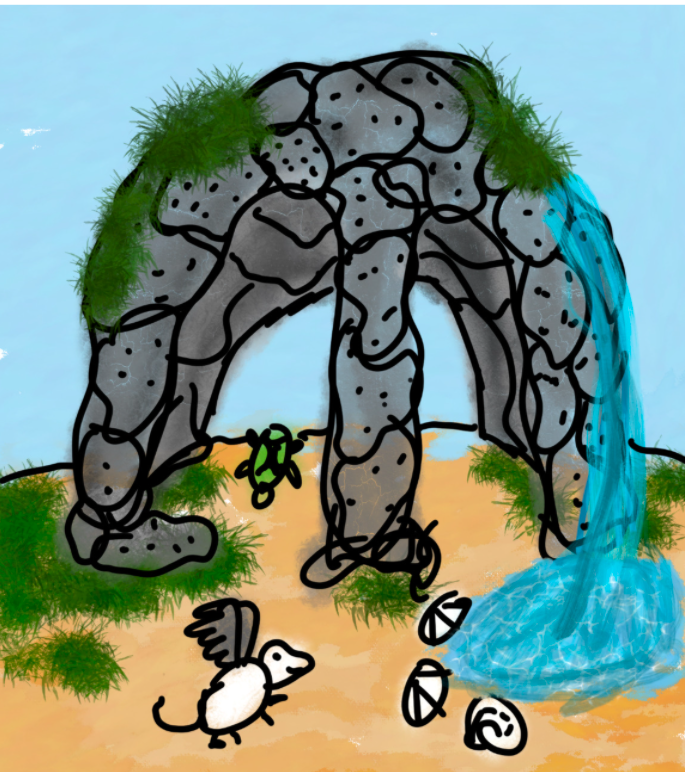

Jamie Bergen and Sofia Sabet

Spring 2022, GU4962: Hands-on History

# Creating a “Modern” Reconstruction of a Miniature Grotto 

Grottos imitate a spring, often located in a cave-like structure, and
usually contain fountains, sculpture, and imitation flora and fauna.

> Engraving of a grotto in the gardens of Hortus Palatinus, Heidelberg, from Salomon de Caus’ Hortus Palatinus. Engraving done by Matthieu Marian’s (1620), [<u>https://digi.ub.uni-heidelberg.de/diglit/caus1620/0034/image,info,thumbs</u>](https://digi.ub.uni-heidelberg.de/diglit/caus1620/0034/image,info,thumbs)

In *L'Idea della Architettura Universale* (*The Idea of a Universal
Architecture*), published in 1615, Italian architect Vincenzo Scamozzi
described “grotto porticos” that were decorated with “pebbles \[and\]
tuff and other materials petrified in various shapes of nature…and then
decorated here and there with niches, with statues of stone and sometime
of metal.”[^1] He continues that the grotto porticos’ “ornaments shall be
fountains, niches, and tableaus with statues, inscriptions, and such
things.” He notes that “the Ancients would \[decorate them with\]
extravagant and ridiculous paintings… And because such paintings were
found in some places \[resembling\] caves, for this they call them
*grottesche*.”

As Reut Ullmann in “Artificial Grottos” notes, Sebastiano Serlio’s
*L’architettura* was published first in Italian and translated into
French in 1545. Serlio’s text urges readers to style grottos according
to their own tastes using leaves, flowers, animals, birds, and other
sculpted and painted objects.[^2] Other common ornaments included shells,
as described in numerous sources, including in an entry about snails on
fol.
[<u>118r</u>](https://edition640.makingandknowing.org/#/folios/118r/tl)
in the sixteenth-century anonymous BnF Ms. Fr. 640.[^3] This is one of
multiple references to grottos and their construction in Ms. Fr. 640.
One of the first documented grottos built in France was in the palace of
Fontainebleau in the 1540s.[^4] Yet only forty years later they were
commonplace enough to earn several references in Ms. Fr. 640.

In the sixteenth century, grottos were part of a focus on understanding
the relationship between natural and human artifice, and, for our
project, we decided a modern reconstruction of a grotto should
investigate the modern equivalent: investigating the relationship
between the artifice of technology and the human hand. We therefore
employed historical recreations from Ms. Fr. 640 such as artificial
rock, oil paint, and stucco components as well as modern techniques such
as laser engraving and 3D printing.

## Steps to the Creation of a Miniature Grotto[^5]

### Scale Model

The first step in creating the miniature grotto was prototyping and
planning.

> Drawing/schematic of grotto design.

For a more modern component of the grotto, we decided to make the
base/frame for it out of laser cut acrylic. We also decided to ornament
the side walls with the lizard sketch found on fol.
[<u>124v</u>](https://edition640.makingandknowing.org/#/folios/124v/f/124v/tl)
of Ms Fr. 640 (which also serves as the Making and Knowing Project’s
logo) as a playful touch. Before cutting the acrylic, we tested out our
measurements by cutting a chipboard model first.

> Designs for the cardboard model of the frame.

> Adding the lizard sketch to our design.

On the first attempt fabricating it from the digital files, we realized
that the right side wall was backwards so that the lizard faced the
wrong direction. Once the design was fixed, we made another model out of
chipboard, but miniaturized further to save material.The mini came out
perfectly, so we cut another cardboard one to scale. We then taped the
cardboard pieces together for the mini and full-sized model. We then
used this model to draw on and plan the other components.

> Preparation of the cardboard model in advance of the laser-cut acrylic
version of the frame.

> Planning the rest of the grotto elements on the assembled, full-size
cardboard model.

### Shell Mosaic

One of the most common ornaments in grottos was beautiful shells. This
is also mentioned in Ms. Fr. 640: shells “which are found in the sea &
similarly those in which certain small crabs dwell are very beautiful
for grottos” (fol.
[<u>118r</u>](https://edition640.makingandknowing.org/#/folios/118r/f/118r/tl)).
This was therefore a must for our recreation and so we decided to make a
mosaic of the shells on the back wall of the grotto. The first step in
making the mosaic was crushing up shells. We opted for mussel and brown
shells. To crush the shells, we placed three mussel shells or one brown
shell at a time in a mortar because the brown shells were significantly
harder to crush. Shells were crushed with a pestle until they were
broken into approximately four millimeter pieces. When crushing the
shell, shards could easily fly out in every direction. To prevent any
injuries, we wore protective glasses and distanced ourselves from
others. Once crushed they were ready to be arranged. However it turned
out that getting the shells to behave similarly to ceramic or tile in a
mosaic would be a challenge.

> Collecting shells and rocks from the New Jersey shore.

> Shells and rocks collected from the New Jersey shore.

> Mussel shell in a mortar, ready to be pestled.

> Crushing the shells in a mortar and pestle, attempting to prevent the
pieces from flying out of the mortar.

> Crushed mussel shells.

#### **Trial** **One**

To determine which method would be best for the mosaic, we ran multiple
trials. For the first trial, we pressed white air dry clay in the lid of
a jar. The clay was spread into a thin, even layer. The shell fragments
were then pressed into the clay, with the shiny side facing up.

While the shells did manage to remain attached to the clay, the final
product didn’t achieve the look we were going for.

> Trial 1: Shells pressed into white air-dry clay.

#### Trial Two

For the second trial, we used a commercially popular mosaic cement to
contain the shells. The directions for the cement stated we should aim
for a runny consistency. To achieve the correct consistency, we
experimented with the cement to water ratio. Once the cement was ready,
it was poured onto the inside of a shallow wooden box lid. The lid was
eleven inches long and four inches high. The cement was then spread
evenly with a spatula.

> Mosaic cement spread across shallow wooden box lid.

To put the shell fragments into the cement, we used a pair of tweezers.
The shells were placed one by one with the shiny side facing up. After
each placement, the shell fragment was pushed into the cement to ensure
it would stay. When all of the shells were placed, we noticed the shells
that were placed earliest had come loose. The shards of shell, being
lighter than the cement, had floated to the top completely detaching
themselves. It was as if they had never been placed into the cement.

> Trial 2: Shells with commercially popular mosaic cement.

> Closeup of the shell pieces lifting up out of the mosaic cement and
falling off.

Instead of starting over, we decided to try and salvage what we had. To
do so, we decided on using rabbit skin glue to get the shells to stick
to the cement. The rabbit skin glue in the lab had been prepared by
mixing together one part rabbit skin and ten parts water over heat. Like
most hide and gelatin glues, the glue solidifies at room temperature and
must be warmed to become liquid, so we had to place the glue vial within
a beaker of water. The beaker was then placed on a burner. While on the
burner, we used a chopstick to stir the mixture. When the glue was fully
melted and well mixed, we removed it from the heat. We then used a
pipette to extract the liquid and carefully spread it over the shells.
While there wasn’t enough glue to cover the entire piece, we were able
to cover about 80% of it.

The rabbit skin glue mixture.

Rabbit skin glue heated inside a beaker of water on a hotplate.

Rabbit skin glue, still hot and in liquid form, spread across the top of
the shells detaching from the mosaic cement.

#### Trial Three

We decided to scale down the trial and used a small spare piece of
acrylic to test other options. We were worried about whether the mosaic
cement would stick to the acrylic without assistance, so sections of the
acrylic were sanded either lightly, heavily, or not at all to test
whether a textured surface would aid in adhesion. Within each section,
four combinations of rabbit skin glue and cement were tested: rabbit
skin glue only, a layer of cement with the shells pressed in and then
glue on top, glue applied both on top and underneath the cement, and
finally mixing rabbit skin glue with cement instead of water. It turned
out that mixing the rabbit skin glue with the cement gave the best
results as the resulting texture of the mixture before it dried was a
bit tacky, and therefore held on to the shell bits as it dried.

Testing the tackiness of the mosaic cement on a piece of acrylic. The
test piece of acrylic was split into sections to test whether sanding it
would help the cement mixture adhere and to test different applications
of the cement with additions of rabbit skin glue.

The test piece of acrylic with different combinations of cement and
rabbit skin glue and varying degrees of sanding.

#### Final Mosaic

Once the method had been figured out, the final construction of the
mosaic could commence. We made rabbit skin glue in a 1:10 ratio of glue
to water. This was then mixed into the cement until it formed a loose
paste, which was spread on the acrylic sheet for the back wall. Quickly
before it dried, shell pieces were individually placed onto the cement
in the shape of an archway and pressed into the cement to prevent them
from floating upwards. Once the cement dried, a thin coat of rabbit skin
glue was brushed on top of the shells to further secure them in place
for durability. Then the walls and base of the grotto were glued
together using acrylic cement in preparation for the addition of more
components.

The final design of the shells mosaic, adhered to the back of the grotto
with mosaic cement and rabbit skin glue.

### Shell Feet/Sculptures

In order to hold up the grotto frame and contain electronics for a water
feature underneath, supporting feet were needed. The feet were created
by gluing together whole mussel shells layered in alternating
directions. At first rabbit skin glue was used to glue together the
shells, however it turned out to not be sturdy enough. The only sturdier
glue we had on hand was acrylic cement so that was used, however if we
had had more time we would have liked to investigate stronger historical
glues. The same arrangement of gluing shells was also done to create two
miniature shell statues which were placed on either side of the center
archway.

Gluing together whole mussel shells to create feet for the frame as well
as additional sculptures.

## Features in Our Miniature Grotto

### Bridge

Using the 3D printer, we were able to make a miniature bridge for our
grotto. The design for the bridge was obtained through the website
Thingiverse—an open source STL file site. To test the viability of the
design, we scaled the design down to 1.75 inches. The SD card containing
the file was printed on a Makerbot 3D printer in the Barnard College
makerspace using PLA filament. Though the bridge was very small, it took
over four hours for it to print. When it was done printing, we
thoroughly inspected the final product. We liked how there was a
cobblestone like texture on the bridge and appreciated the detailing on
the base.

3D printer in the Barnard College Makerspace, printing the bridge in
white plastic.

Top view of 3D printer in the Barnard College Makerspace, printing the
bridge in white plastic.

The first, miniaturized version of the 3D-printed bridge.

Since the mini bridge was a success, we increased the size to five
inches. The estimated print time for the bridge was eight hours, so we
let it print overnight. The next morning when we came to pick up the
bridge, we were met with a jumble of plastic strands.

The jumble of plastic strands from the failed 3D printing of the larger
bridge.

Hoping it was a fluke, we tried reprinting the bridge. Within minutes,
the print showed signs of failure. To figure out why the print was
failing we reached out to a staff member of the design center. He agreed
it couldn’t be a design issue because the miniature bridge printed
perfectly. The staff member instructed us to try printing it again, but
it continued to fail two more times. After the fourth failure, the staff
member decided to thoroughly inspect the file on the computer. The staff
member discovered that someone had turned off a key printer setting,
which was why our bridge kept failing. We turned the setting back on and
eight and a half hours later, we picked up a perfectly printed bridge.

The 3D printer printing the bridge.

### Rat with Wings

The rat with wings was designed as another fun interaction between
modern technology and Ms. Fr. 640. In the lab there is a reconstruction
of a historical taxidermy of a rat with wings, that was made following
fol.
[<u>130r</u>](https://edition640.makingandknowing.org/#/folios/130r/f/130r/tl):
“One gives it a painted tongue, horns, wings & similar fancies. Thus for
rats & all animals.”[^6] The essay by Divya Anantharaman and Pamela
Smith, “Animals Dried in an Oven,” that describes the recreation
recounts how the wings are selected and removed from a bird and then
affixed to the rat.[^7] To recreate this technologically, we found 3D
models of a rat and a bird on Thingiverse, then removed the wings from
the bird model and placed them on the rat model to create a new, hybrid
digital model. This was then 3D printed in the same fashion as the
bridge.

The hybrid digital model of a rat with wings.

3D printing the rat with wings in green plastic.

### Cuttlefish Bone Turtle 

In Ms. Fr. 640, cuttlefish bones are used to create molds for casting
objects such as medals and small pieces of jewelry. Another casting
technique described in great detail in the manuscript is lifecasting, in
which a plaster mold is created of actual animals or plants and then
used to cast a near-perfect metal version of the original animal or
plant. While lifecasting and cuttlebone casting were not within the
scope of this project, we wanted to utilize cuttlefish bone in the
grotto model given how often it is used in Ms. Fr. 640. We decided it
might be fun to carve it into an object rather than casting one into it.
We made several attempts with cuttlefish bones and a kitchen knife
before successfully carving a turtle. The cuttlefish bone turned out to
be more brittle than expected and so whole chunks sometimes cracked off
when attempting to remove a small piece. The best strategy seemed to be
to use the base of the knife to scrape off layers of cuttlebone using
motions similar to peeling an apple or potato. The turtle was then
painted with oil paint we made by mulling linseed oil and hematite for
the face/limbs, yellow ochre for the underside of the shell, and
Bavarian green earth for the top of the shell. Once dry the turtle was
positioned on the bridge.

Setup for mulling and painting objects for the grotto in linseed oil.

The turtle carved from cuttlefish bone and painted.

### Stucco Shells

To make stucco, we used a process described on [<u>fol.
29r</u>](https://edition640.makingandknowing.org/#/folios/29r/f/29r/tl).[^8]
combined tragacanth gum to water at a ratio of 1:14. Once combined, we
stirred the liquid to ensure the gum gets fully incorporated. Then the
mixture was put aside and we waited ten minutes for it to gel.

Tragacanth gum in water, waiting for it to gel fully.

When the mixture gelled, chalk powder was added at approximately a 2:5
ratio of gum/water to chalk. To mix the chalk into the mixture, we used
a muller, but we eventually had to use our hands to knead it. After the
stucco was kneaded, we coated plastic molds of shells with oil to
prevent sticking. The stucco was then pressed into the two seashell
molds. When it was dry, the shells were painted with oil paint made by
mulling linseed oil with lapis lazuli pigment.

The stucco shells drying in the plastic mold.

### Sand

We wanted to coat the bottom of the grotto with sand without having it
do what sand does: get everywhere. So having learned from the lesson of
combining mosaic cement powder with rabbit skin glue we did the same
with the sand to make a thick paste. We then poured this paste on to the
base panel of the grotto and spread it with a palette knife. This did
the job for keeping the sand mostly in place while maintaining the
beach/garden effect we were going for.

Sand applied to the bottom of the grotto frame.

### Water Feature/Fake Rock

One of the key features of a large scale grotto is a water feature.
Thanks to modern technology a small one can be bought for 5 dollars at
Five Below for our miniature grotto.

Electric water fountain purchased at Five Below.

However, this fountain didn’t meet the aesthetic standards for our
grotto, which opened the door to a creative solution using a historical
recreation. The entry entitled “Grottos” in Ms. Fr. 640, fol.
[<u>40r</u>](https://edition640.makingandknowing.org/#/folios/40r/f/40r/tl)
reads:

> To fill some empty place that cannot be laden with some sort of
> hanging rocks, one puts a piece of thick parchment close to the fire,
> which shrinks & crumples. Then one paints it with distemper, then in
> oil. Next one affixes it.

We decided to follow this process of creating artificial rock undertaken
by another student in a previous semester,[^9] and use it to cover the
front of the archway fountain to create a proper cave look for the
grotto. We experimented with cutting different sizes of calf parchment
and found that pieces an inch long tended to bubble and warp in a
desirable way to create a rock-like texture. Once the heat caused the
parchment to crumple, distemper paint was made by mixing rabbit skin
glue with vine charcoal as a dark pigment. This was brushed onto the
rocks and finally, as recommended by the manuscript entry, oil paint
made with linseed oil and charcoal was used to paint a final layer to
provide depth. The fake rock was then glued onto the archway using
rabbit skin glue.

## Final Arrangements and Thoughts

Now with all of the components created, it was time to arrange them on
the grotto. Most grottos seem to be symmetrical so we placed the bridge
in the center, and the shell statues/stucco shells on either side of the
arch. We placed the winged rat to the left side of the bridge and the
turtle directly on it. Finally, small stones, sourced from Sunny Isles
beach, were placed to create a path from the bridge to the fountain and
back.

Arranging the elements of the grotto.

Further arranging of the grotto elements.

The project turned out to be much more labor intensive than either of us
anticipated but we also saw much more success with the historical
recreations than expected as well. In fact, the historical recreations
(with exception of the mosaic) were actually much more reliable to
execute than the technology-based ones. 3D printers are super finicky
and complicated but parchment and heat turns out not to be. However,
technology allowed for the execution of much more complex elements of
the grotto with higher success. Compare the cuttlefish turtle and the 3D
printed winged rat. Both took several attempts to create a model of an
animal, however messing up the turtle and starting over lost a maximum
of around 30 minutes. Printing and editing the model of the winged rat
took a couple hours when there were issues. However, the winged rat was
ultimately much more accurate than the turtle, given lack of previous
carving experience.

All in all this recreation was rewarding to create and we learned a lot
along the way.

The final grotto.

The final grotto with a few added elements.

[^1]: Vincenzo Scamozzi, *L' Idea Dell'architettura Universale*, 1615.

[^2]: Sebastiano Serlio, *Reigles generales de l’architecture, sur le cinq manieres d’edifices* (Paris: 1545), 66–67; and Miller, *Heavenly Caves*, 52, quoted in Reut Ullman, “Artificial Grottos,” in *Secrets of Craft and Nature in Renaissance France. A Digital Critical Edition and English Translation of BnF Ms. Fr. 640*, edited by Making and Knowing Project, Pamela H. Smith, Naomi Rosenkranz, Tianna Helena Uchacz, Tillmann Taape, Clément Godbarge, Sophie Pitman, Jenny Boulboullé, Joel Klein, Donna Bilak, Marc Smith, and Terry Catapano \*New York: Making and Knowing Project, 2020), <https://edition640.makingandknowing.org/#/essays/ann_063_fa_17>. DOI:
<https://www.doi.org/10.7916/26md-x363>.

[^3]: Making and Knowing Project, Pamela H. Smith, Naomi Rosenkranz, Tianna Helena Uchacz, Tillmann Taape, Clément Godbarge, Sophie Pitman, Jenny Boulboullé, Joel Klein, Donna Bilak, Marc Smith, and Terry Catapano, eds., *Secrets of Craft and Nature in Renaissance France. A Digital Critical Edition and English Translation of BnF Ms. Fr. 640* (New York: Making and Knowing Project, 2020), [<u>https://edition640.makingandknowing.org/#/folios/118r/tl</u>](https://edition640.makingandknowing.org/#/folios/118r/tl).

[^4]: Flaminia Bardati, “La Grotte des Pins a Fontainebleau”, in *Artifici d’acque e giardini: la cultura delle grotte e dei ninfei in Italia e in Europa*, ed. Isabella Lapi Ballerini and Litta Medri (Florence: Centro Di, 1999).

[^5]: For all images of our process, see the Flickr Album [<u>https://www.flickr.com/photos/128418753@N06/albums/72177720299168770</u>](https://www.flickr.com/photos/128418753@N06/albums/72177720299168770).

[^6]: Ms. Fr. 640, fol. 130r, <https://edition640.makingandknowing.org/#/folios/130r/f/130r/tl>.

[^7]: Divya Anantharaman and Pamela H. Smith, “Animals Dried in an Oven.” In *Secrets of Craft and Nature in Renaissance France. A Digital Critical Edition and English Translation of BnF Ms. Fr. 640*, edited by Making and Knowing Project, Pamela H. Smith, Naomi Rosenkranz, Tianna Helena Uchacz, Tillmann Taape, Clément Godbarge, Sophie Pitman, Jenny Boulboullé, Joel Klein, Donna Bilak, Marc Smith, and Terry Catapano. New York: Making and Knowing Project, 2020. <https://edition640.makingandknowing.org/#/essays/ann_502_ad_20>.

[^8]: For this process, we referred to Ms. Fr. 640, fol. 29r ([<u>https://edition640.makingandknowing.org/#/folios/29r/f/29r/tl</u>](https://edition640.makingandknowing.org/#/folios/29r/f/29r/tl)), and the assignment sheet based on it: <https://cu-mkp.github.io/sandbox/docs/stucco-assignment.html>.

[^9]: Ullman, “Artificial Grottos,” [<u>https://edition640.makingandknowing.org/#/essays/ann_063_fa_17</u>](https://edition640.makingandknowing.org/#/essays/ann_063_fa_17).
