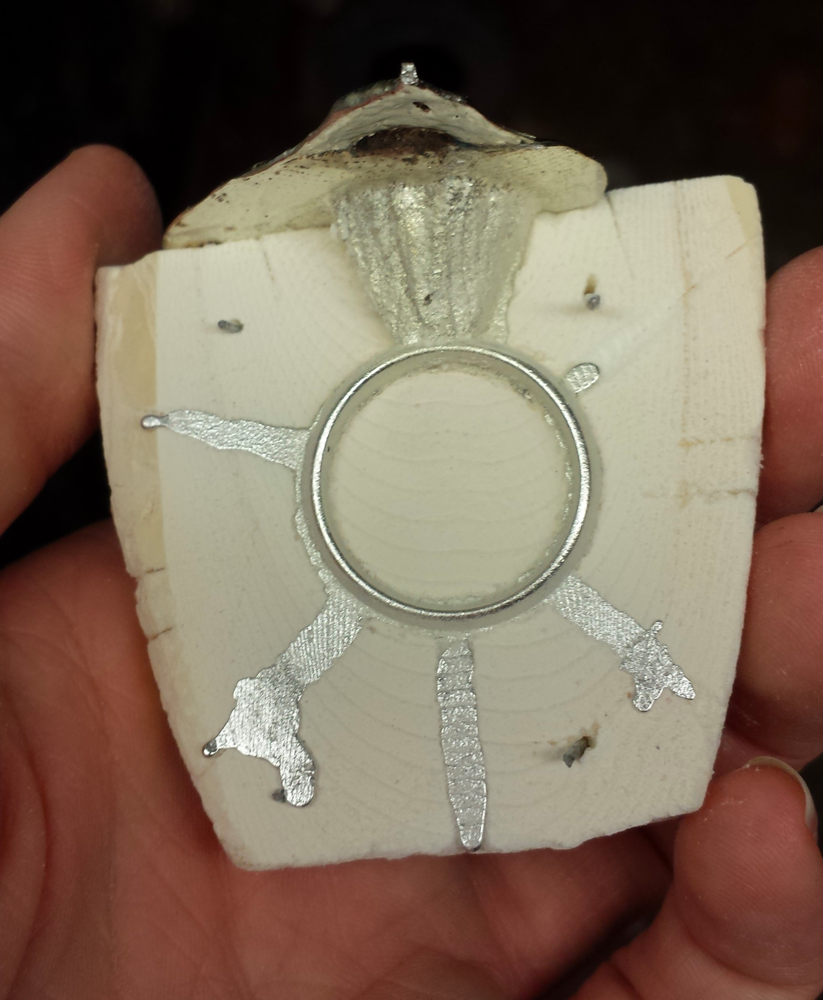
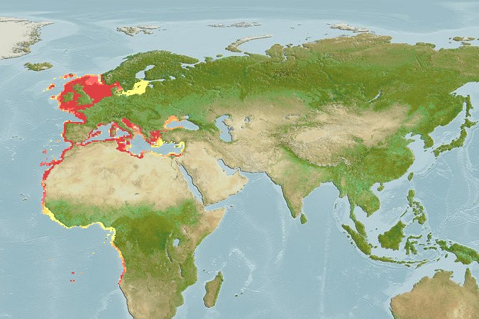
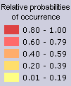
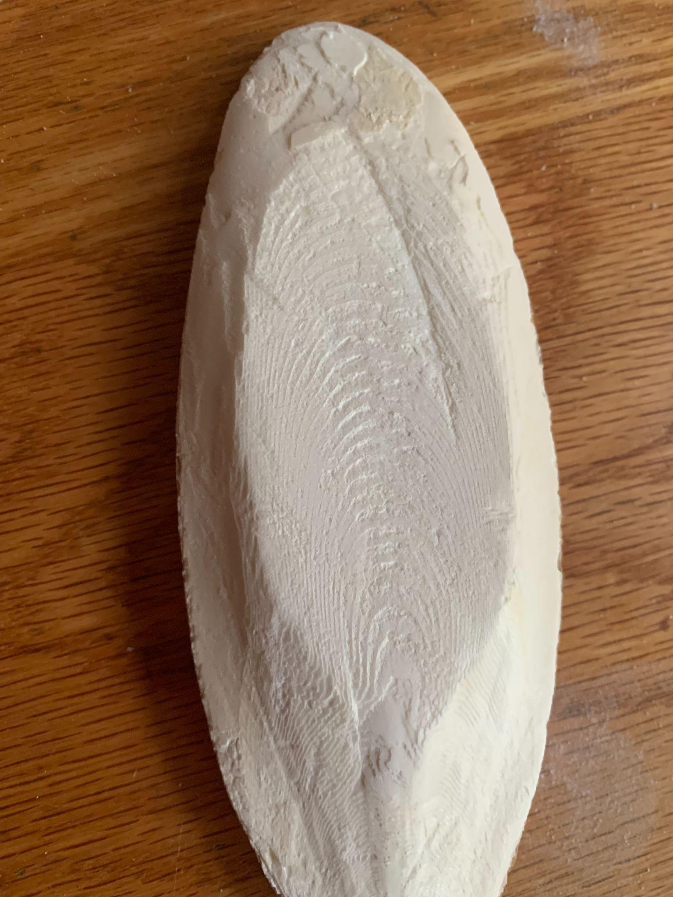

# Cuttlefish in and around Ms. Fr. 640

*Maia Donald*

*Spring 2022*

Cuttlebone, the hard interior shell of the cuttlefish, has a long
history of human use. While today it is primarily consumed as a calcium
supplement by pet birds and reptiles, cuttlebone was long ago used as a
polishing powder, casting material, and carving medium. Both Aristotle
and Pliny offer detailed examinations of cuttlefish in their more general overview of cephalopods.[^1] Its near continuous use in the arts,
especially in casting, indicates that cuttlebone has historically been
an abundant material. Paradoxically, for such a widely used material,
there is little reference to its procurement and trade either in
historical sources or secondary literature.

Casting in cuttlebone features prominently in Ms. Fr. 640. The
author-practitioner instructs his readers to cut the bone in half,
smooth it down with charcoal to coat it, and then press an object into
the bone. Next, we are to pour a metal alloy of equal parts lead and tin
into the bone to cast the object (fols.
[<u>91r</u>](https://edition640.makingandknowing.org/#/folios/91r/f/91r/tl)-v).
Later in the manuscript, the author-practitioner warns against casting
with metals that are too hot, which one can tell by dipping a piece of
paper into the heated alloy. The best metals for casting in cuttlebone
are lead and tin, although gold and silver are also suitable but “it
never comes out very neat” (fol.
[<u>145r</u>](https://edition640.makingandknowing.org/#/folios/145r/f/145r/tl)).
For more detail and a replication of these recipes, see Boyd, Palframan,
and Smith, [<u>Molding with Cuttlefish
Bone</u>](https://doi.org/10.7916/1dc2-rn58).[^2]

|                                                                                                                                                                                                                                                                                             |
|----------------------------------------------------------------------------------------------------------------------------------------------------------------------------------------------------------------------------------------------------------------------------------------------------------------------------------------------------------------------|
| **Figure 1.** Casting of tin in the cuttlefish bone mold of a ring. Emily Boyd and Jef Palframan, 2014. Note the gate at the top through which the metal was poured and the vents. Also visible are the pegs that hold the two halves of the mold together. © Making and Knowing Project ([<u>CC BY-NC-SA</u>](https://creativecommons.org/licenses/by-nc-sa/4.0/)). |

The species of cuttlefish referenced in Ms. Fr. 640 is most likely the
common or European cuttlefish, *Sepia officinalis*. Native to the
Mediterranean, North, and Baltic Seas (see **Fig. 2**), this is a
relatively abundant sea creature related to the octopus and squid. The
cuttlefish is unique because of its cuttlebone, a lightweight, porous,
bony material that cuttlefish use to regulate buoyancy, akin to an
internal shell.

|  |
|---------------------------------------------------------------------------------------------------------------------------------------------------|
| **Figure 2**. Map of the distribution of the common cuttlefish, *Sepia officinalis*.[^3]                                                           |

How was cuttlebone acquired and transported for casting and goldsmithing
around the time of the author-practitioner of Ms. Fr. 640 in the
sixteenth century? Sources on this are unfortunately scant, which is
telling in itself. Today, cuttlefish are largely caught as fishing
by-products in drag nets. For this reason, I think it is worth taking
some time to explore early modern fishing practices in Europe. Fishing
practices varied significantly by nationality and by the type of fish
targeted. Types of fishing ranged from subsistence, to local procurement
for local markets, to market-oriented merchant fishing that varied
seasonally.[^4] Dieppe in northern France was a major fishing port on the
North Sea, one of the regions to which cuttlefish are native. It is more
likely, however, that cuttlebone was sourced from cuttlefish washing up
on beaches after a storm, as is commonly seen today.[^5] This sort of
informal economy might explain the lack of sources around cuttlebone
acquisition. If cuttlebone was abundant and easily collected, there
likely was no record-keeping of its collection.

The paradox of cuttlebone’s absence in the written record is heightened
by the fact that cuttlebone is still valuable today as a material
uniquely suited to metal casting due to its physical properties.
Unaltered, cuttlebone is a long oval shape about two inches high, seven
to eight inches long, and three inches across at its widest point. It is
quite light. The exterior is hard and bumpy, but cutting it open along
its length reveals a softer, chalky interior with ridged lines in
concentric circles (see **Figs. 3 and 4**). It is in this yielding
interior that impressions for casting can be made. After impressing an
object into the interior, the object is removed and the two halves are
pressed back together and filled with molten metal. Cuttlebone is able
to withstand high temperatures, although the author-practitioner of Ms.
Fr. 640 warns against overheating the metal alloy.

|                                                                                                                                                                         |
|--------------------------------------------------------------------------------------------------------------------------------------------------------------------------------------------------------------------------------------------------|
| **Figure 3**. The author-practitioner’s sketch of cuttlefish bone patterning, Ms. Fr. 640, fol. [<u>145r</u>](https://edition640.makingandknowing.org/#/folios/145r/f/145r/tl). Bibliothèque nationale de France, Paris. Source: gallica.bnf.fr. |

|                                                                                                      |
|-------------------------------------------------------------------------------------------------------------------------------------------------------------------------------|
| **Figure 4**. Cuttlefish bone pattern (interior). Maia Donald, 2022. © Making and Knowing Project ([<u>CC BY-NC-SA</u>](https://creativecommons.org/licenses/by-nc-sa/4.0/)). |

The absence of cuttlefish in the historical record also comes as a
surprise because cuttlefish were also a source of ink, called sepia. Ink
secreted by live cuttlefish is highly effective even at low
concentrations, turning up to a thousand gallons of water dark and
opaque within seconds of release.[^6] The pigment is extracted by drying,
pulverizing, and boiling the cuttlefish’s ink sac in lye, then the
pigment is precipitated out with hydrochloric acid, washed and dried,
ground with gum arabic, and mixed with water to write or paint. It is a
warm black hue that becomes a reddish brown over time. While there is
some evidence for its use as an ink in antiquity, sepia was not used for
painting or washes until the eighteenth century.[^7] While perhaps not in
as high demand as other inks like carbon black (charcoal and soot) or
iron gall, sepia was still an important artistic and practical medium.
In fact, iron gall inks (made from plant tannins and iron salts), carbon
blacks (especially bistre, a combination of tarry soot and water), and
sepia were the three predominant inks used between the fifteenth and
nineteenth centuries, although over time sepia replaced bistre.[^8] It is
surprising to find little record of the animal from which it is sourced
in written records.

Sepia has fallen out of use today as an ink, the modern term referring
instead to a color more than a material. But there is still a thriving
market for cuttlebone as a dietary supplement for avian and reptilian
pets. PetSmart sells a [<u>two-pack of
cuttlebone</u>](https://www.petsmart.com/bird/grooming/nail-and-beak-trimmers/featherland-paradise-cuttlebones---2-pack-54258.html)
for $4.99, and [<u>mango/banana flavored
cuttlebone</u>](https://www.petsmart.com/bird/grooming/nail-and-beak-trimmers/featherland-paradise-cuttlebones-mango-and-banana---2-pack-54800.html)
at $3.94 for two at the time of writing. If you’re interested in buying
in bulk, that’s also an option: a seller on Ebay offers a
[<u>70-pack</u>](https://www.ebay.com/itm/284763454250?chn=ps&var=586430398240&_trkparms=ispr%3D1&amdata=enc%3A1YWZWW00UQR6MHFPcTeVZww27&norover=1&mkevt=1&mkrid=711-117182-37290-0&mkcid=2&itemid=586430398240_284763454250&targetid=1599090335937&device=c&mktype=&googleloc=1018516&poi=&campaignid=15275224983&mkgroupid=131097072938&rlsatarget=pla-1599090335937&abcId=9300697&merchantid=262573143&gclid=Cj0KCQjwg_iTBhDrARIsAD3Ib5hKuBrNkJd2MZmjAy87lApL4ey6p1xT0G0PKMtz5hq00b-F-xbnOacaAurqEALw_wcB)
for the low, low price of $10.25. As in the case of cuttlebone in early
modern Europe, there are not many details about its sourcing. Most are
caught by commercial fisheries, using a method called trawling that
involves dragging a large net through the water. Most cuttlefish are
caught for their ink and meat, both of which are used in many
Mediterranean culinary dishes; cuttlebone is sold secondarily.
Furthermore, cuttlefish seem to be at risk of overfishing largely due to
trawling, which is poorly regulated and disrupts the ecosystem.[^9]

Cuttlebone remains an elusive material to track and study, but one that
raises many questions about artistic economies, the historical
relationship between the crafts and natural materials, as well as
sustainability practices today.[^10] That cuttlebone and sepia are so
commonly referenced in craft handbooks and are still used today for
craft practices, but have clearly not formed a focus of study suggest
that its very abundance and its wide utility in a variety of practices
made it an overlooked and neglected material. This has important
implications for its continued existence and availability into the
future.

## Works Cited

AquaMaps (2019, October). Computer generated distribution maps for
*Sepia officinalis* (common cuttlefish), with modelled year 2050 native
range map based on IPCC RCP8.5 emissions scenario. Retrieved from
[<u>https://www.aquamaps.org</u>](https://www.aquamaps.org).

British Sea Fishing. “Commercial Fishing for Squid and Cuttlefish,” July
14, 2014.
[<u>https://britishseafishing.co.uk/commercial-fishing-for-squid-and-cuttlefish/</u>](https://britishseafishing.co.uk/commercial-fishing-for-squid-and-cuttlefish/).

Boyd, Emily, Jef Palframan, and Pamela H. Smith. “Molding with
Cuttlefish Bone.” In *Secrets of Craft and Nature in Renaissance France.
A Digital Critical Edition and English Translation of BnF Ms. Fr. 640*.
Edited by Making and Knowing Project, Pamela H. Smith, Naomi Rosenkranz,
Tianna Helena Uchacz, Tillmann Taape, Clément Godbarge, Sophie Pitman,
Jenny Boulboullé, Joel Klein, Donna Bilak, Marc Smith, and Terry
Catapan. New York: Making and Knowing Project, 2020.
<https://edition640.makingandknowing.org/#/essays/ann_506_ad_20>.

Cornwall Good Seafood Guide. “Cuttlefish.” Accessed May 13, 2022.
https://www.cornwallgoodseafoodguide.org.uk/fish-guide/cuttlefish.php.

BBC News. “Cuttlefish Bones Wash up on Cornwall Beaches,” May 19, 2011,
sec. Cornwall.
[<u>https://www.bbc.com/news/uk-england-cornwall-13451208</u>](https://www.bbc.com/news/uk-england-cornwall-13451208).

Gerhardt, Mia I. “Knowledge in Decline: Ancient and Medieval Information
on ‘Ink-Fishes’ and Their Habits.” *Vivarium* 4 (1966): 144-175.
[<u>http://www.jstor.org/stable/41963484</u>](http://www.jstor.org/stable/41963484).

Gettens, Rutherford John and George Leslie Stout, *Painting Materials: A
Short Encyclopaedia*. New York: Dover Publications, 1942; reis. 1966.

Michell, A. R. “The European Fisheries in Early Modern History.” In *The
Cambridge Economic History of Europe*, edited by E. E. Rich, C. H.
Wilson, D. C. Coleman, P. Mathias, and M. M. Postan, 1st ed., 133–84.
Cambridge University Press, 1977.
[<u>https://doi.org/10.1017/CHOL9780521087100.004</u>](https://doi.org/10.1017/CHOL9780521087100.004).

Reháková, Milena, Michal Čeppan, Katarína Vizárová, András Peller,
Danica Stojkovičová, and Monika Hricková. “Study of Stability of
Brown-Gray Inks on Paper Support.” *Heritage Science* 3, no. 1 (December
2015): 8.
[<u>https://doi.org/10.1186/s40494-015-0039-0</u>](https://doi.org/10.1186/s40494-015-0039-0).

[^1]: Mia I. Gerhardt, “Knowledge in Decline: Ancient and Medieval Information on ‘Ink-Fishes’ and Their Habits,” *Vivarium* 4 (1966): 146-158.
[<u>http://www.jstor.org/stable/41963484</u>](http://www.jstor.org/stable/41963484).

[^2]: Emily Boyd, Jef Palframan, and Pamela H. Smith, “Molding with Cuttlefish Bone,” in *Secrets of Craft and Nature in Renaissance France. A Digital Critical Edition and English Translation of BnF Ms. Fr. 640*, edited by Making and Knowing Project, Pamela H. Smith, Naomi Rosenkranz, Tianna Helena Uchacz, Tillmann Taape, Clément Godbarge, Sophie Pitman, Jenny Boulboullé, Joel Klein, Donna Bilak, Marc Smith, and Terry Catapano (New York: Making and Knowing Project, 2020), <https://edition640.makingandknowing.org/#/essays/ann_506_ad_20>.

[^3]: AquaMaps (October 2019). Computer generated distribution maps for *Sepia officinalis* (common cuttlefish), with modeled year 2050 native range map based on IPCC RCP8.5 emissions scenario, however the one pictured here is modeled for 2019, according to AquaMaps. Retrieved from [<u>https://www.aquamaps.org</u>](https://www.aquamaps.org).

[^4]: A. R Michell,“The European Fisheries in Early Modern History,” in *The Cambridge Economic History of Europe*, ed. E. E. Rich, C. H. Wilson, D. C. Coleman, P. Mathias, and M. M. Postan (Cambridge: Cambridge University Press, 1977), 140-2. [<u>https://doi.org/10.1017/CHOL9780521087100.004</u>](https://doi.org/10.1017/CHOL9780521087100.004).

[^5]: BBC News, “Cuttlefish Bones Wash up on Cornwall Beaches,” May 19, 2011, sec. Cornwall, [<u>https://www.bbc.com/news/uk-england-cornwall-13451208</u>](https://www.bbc.com/news/uk-england-cornwall-13451208).

[^6]: Rutherford John Gettens and George Leslie Stout, *Painting Materials: A Short Encyclopaedia* (New York: Dover Publications, 1942; reis. 1966), 155-6.

[^7]: Ibid.

[^8]: Milena Rehákova, Michal Čeppan, Katarína Vizárová, András Peller, Danica Stojkovičová, and Monika Hricková, “Study of Stability of Brown-Gray Inks on Paper Support.” *Heritage Science* 3, no. 1 (December 2015): 3-4, [<u>https://doi.org/10.1186/s40494-015-0039-0</u>](https://doi.org/10.1186/s40494-015-0039-0).

[^9]: British Sea Fishing, “Commercial Fishing for Squid and Cuttlefish,” July 14, 2014, [<u>https://britishseafishing.co.uk/commercial-fishing-for-squid-and-cuttlefish/</u>](https://britishseafishing.co.uk/commercial-fishing-for-squid-and-cuttlefish/); Cornwall Good Seafood Guide, “Cuttlefish,” accessed May 13, 2022, [<u>https://www.cornwallgoodseafoodguide.org.uk/fish-guide/cuttlefish.php</u>](https://www.cornwallgoodseafoodguide.org.uk/fish-guide/cuttlefish.php).

[^10]: Further research into this question might examine the records of eighteenth- and nineteenth-century casting workshops in order to understand sourcing and trade of cuttlebones.
