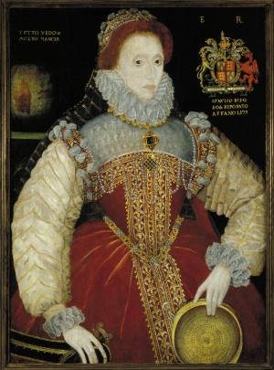
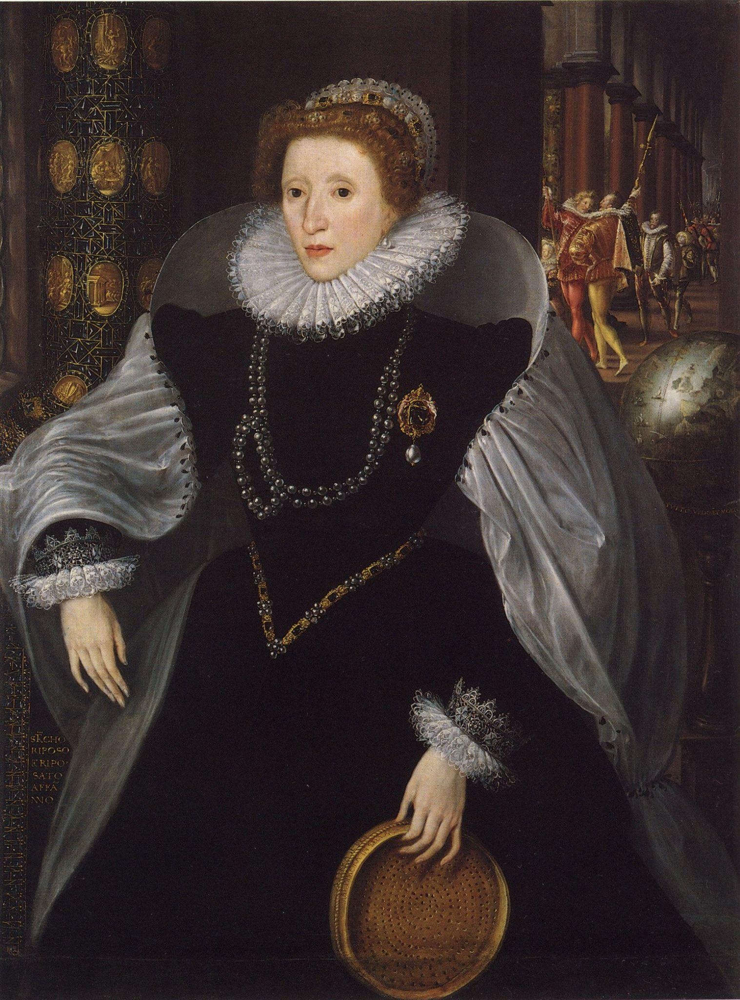
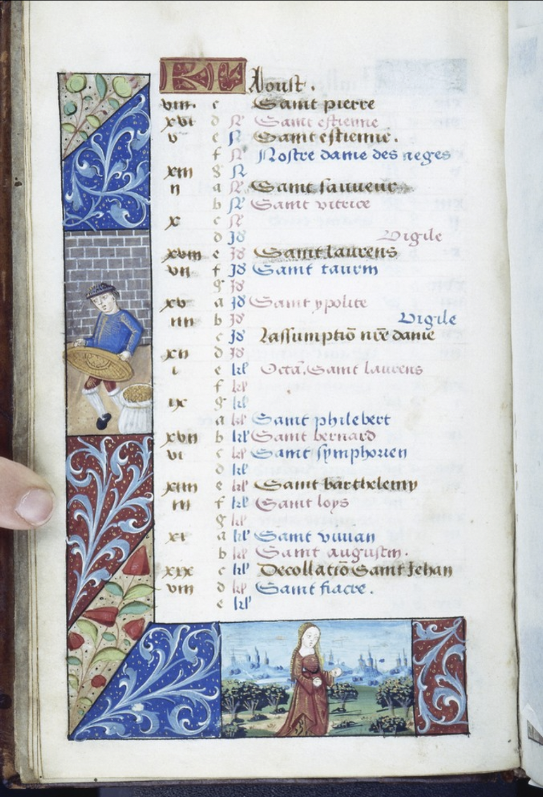

# Sieves in Ms. Fr. 640

Schuyler Gardner

Spring 2022, GU4962: Hands-on History

In early modern Europe, the line between tools used in workshops and in
kitchens was blurred. Tools that crossed these spaces can reveal how
people, particularly women, could negotiate their identities within
different early modern spaces. In Ms. Fr. 640, there is a distinct
interest in tools that rest at this intersection. Whether through the
illustrations of furnaces ([<u>fol.
6v</u>](https://edition640.makingandknowing.org/#/folios/6v),
[<u>fol.16r</u>](https://edition640.makingandknowing.org/#/folios/16r),
[<u>fol.48r</u>](https://edition640.makingandknowing.org/#/folios/48r),
[<u>fol.
100v</u>](https://edition640.makingandknowing.org/#/folios/100v),
[<u>fol.
101r</u>](https://edition640.makingandknowing.org/#/folios/101r)) or the
emphasis on which specific pots are to be employed in particular
processes (such as a “leaded pot” on [<u>fol.
3r</u>](https://edition640.makingandknowing.org/#/folios/3r/tl) or “a
varnished earthenware pot” on [<u>fol.
48v</u>](https://edition640.makingandknowing.org/#/folios/48v/tl)), the
author-practitioner displays both a knowledge of and interest in how
tools traditionally marked as belonging within the kitchen were used
more broadly. One tool, the sieve, seems to receive particular attention
from the author-practitioner. For example, “Horsehair sieves” ([<u>fol.
44v</u>](https://edition640.makingandknowing.org/#/search/folio/44v/tl?q=sieve))
provides a very detailed description of the process of creating and
trading sieves:

> They are made at Coustance in Normandy with horse tail hair which they
> clean with lye because they sort them with the mouth & separate out
> short & broken ones. They do not make the reed longer than the sieve,
> & the reed is round. They attach to both edges of the reed the hair,
> either black or white, according to the work they want to make. And
> the weft is \[~~is~~\] done over & under as for making any other
> fabric. And passing a small flat stick of ii or three fingers wide
> between, next they pass two hairs at each step of the pedal and weave
> with three pedals. There are xviic hairs in the entire sieve. They
> sell them by the dozen & each dozen xxx sous. They bring them to
> Toulouse to transport them afterward to Spain, and take silk tammy in
> exchange for it.

Out of a multitude of tools, from ovens to spoons to pots and pans, the
sieve is the one of the few actively used within the
author-practitioner’s experiments that has an entry dedicated to its
creation process. This attention alerts us to how such intersectional
cooking and experimental tools helped shape female identity in early
modern Europe. Indeed, an analysis of the sieve reveals its dual nature
for female identity, as it allows space for female agency through its
production while reinforcing control over female bodies through its
imagery.

## The Use of Sieves in Ms. Fr. 640

Through its focus on sieves, this essay aims to examine the extent to
which women were able to insert themselves into male spaces of
experiential labor such as workshops, thus its prominence in Ms. Fr. 640
can shed light on its use in such spaces. Within the manuscript, the use
of a sieve is mentioned over forty times, and is used in a wide array of
processes. From making bread (“For making millas,” [<u>fol.
20r</u>](https://edition640.makingandknowing.org/#/folios/20r/tl)) to
working with metal (“Grain of lead,” [<u>fol.
49v</u>](https://edition640.makingandknowing.org/#/folios/49v/tl)) to
preparing hourglass powder (“Powder for hourglasses,” [<u>fol.
10r</u>](https://edition640.makingandknowing.org/#/folios/10r/tl)),
sieves are a ubiquitous and versatile tool throughout the manuscript.
However, the sieve’s most common use is in experimentation with molding
materials (“sands”) for casting metals. The entry, “That any sand can be
rendered good” ([<u>fol. 90r -
90v</u>](https://edition640.makingandknowing.org/#/folios/90r/tl))*,*
for instance, displays how, through sieving, most sand can be turned
into sand for molding:

> However, you can be certain that in all places you can render the sand
> from a mine good & proper for molding. For if it is coarse, pass it
> through a sieve.

Additionally, the entry “Sand” ([<u>fol.
69r</u>](https://edition640.makingandknowing.org/#/folios/69r/f/69r/tl))
mentions a sieve for the process of creating molding material to cast
objects into:

> …It is dried slightly on the \[illegible\] fire, then it is pestled &
> passed finely through a double sieve or a linen sleeve…

The author-practitioner also takes sand from Toulouse and refines it for
casting in “Experimented sands” ([<u>fol
.85v</u>](https://edition640.makingandknowing.org/#/folios/85v/f/85v/tl)):

> …I have experimented with sand from Th{oulous}e, & after reheating it
> well twice, in a skillet, I passed it through a fine sieve, like the
> apothecaries’ double, without finely grinding it further on the
> porphyry, as I have done previously…

This preparation of sand for different activities may be behind some of
the over one hundred and eighty mentions of the word “sand” within the
manuscript. Thus, we can infer that even when the sieve is not
explicitly mentioned, entries surrounding the testing processes of
“casting” and “molding” in which certain sands are integral may have
used a sieve in the preparation, revealing the sieve as an integral part
of the experimentation process of Ms. Fr. 640.

## **Women’s Role in Providing Sieves in the Home** 

Sieves played an integral role in the male-dominated spaces of
workshops, but sieves were also an important implement in domestic
space.[^1] Through their study of marriage and death inventories from
southwest Germany starting in the sixteenth century, Sheilagh Ogilvie,
Markus Küpker, and Janine Maegraith found that this culinary instrument
held immense social importance to women. For example, their study of
sieves used to make traditional German mussel-cakes (*Mutscheln*) shows
that sieves appeared in 16% of marriage inventories, where they were
mainly brought into the marriage by women.[^2] In addition, 17% of
first-time brides brought such sieves into their marriage across a wide
range of social categories, showing no notable difference in ownership
depending on social status.[^3]

There is also evidence that women played a role in producing sieves
through apprenticeships. While French women had worked in guilds and
recognized professions before the sixteenth century, the period from
1550 to 1700 brought a dramatic decrease in documented jobs as,
according to historian Natalie Davis, “changes in marriage laws
restricted the freedom of wives even further, as female guilds dwindled,
as the female role in middle-level commerce and farm direction
contracted, and as the differential between male and female wages
increased.”[^4] However, many historians have theorized that such changes
may not have had such a detrimental effect as documented. For instance,
in reaction to laws that tightened the grip on women’s responsibilities
under male-run guilds, women, particularly in the textile industry such
as linen drapers and hemp merchants, created female run guilds.[^5] Thus,
according to historian Clare Crowston, “at the precise moment in history
taken as the culmination of their linear decline, therefore, French
women obtained new, independent guilds.”[^6] One place in which women did
not seem to lose agency, and even perhaps gained authority, was Rouen,
Normandy. Upon examining Rouen documents, historian James B. Collins
noted that twenty out of thirty-six linen merchants from
sixteenth-century Rouen were women.[^7] Additionally, Collins discovered
that three of the forty-six richest merchants in Rouen were women. While
not in the town of manufacturing described in “Horsehair sieves” on
[<u>fol.
44v</u>](https://edition640.makingandknowing.org/#/search/folio/44v/tl?q=sieve)
of Ms. Fr. 640 (“Coustance in Normandy”), Rouen being within Normandy
shows that such female-run businesses still existed in surrounding
areas.

Since resources are scarce regarding French women’s participation in
apprenticeship, it may be beneficial to examine details of women’s
well-documented work in England to determine the female role in sieve
production. Female apprenticeships hit their peak in the sixteenth and
seventeenth century, being particularly popular amongst lower status
women as gender divisions were less pronounced.[^8] This can be seen in
the early modern poor laws such as The Act of Elizabeth (1601), which
laid the terms for parish apprenticeships, as it makes clear the ages
required to maintain in an apprenticeship for both sexes, stating “Till
such Man-child shall come to the Age of four and twenty Years and such a
Woman-child to the age of one and twenty Year, or the Time of her
Marriage.”[^9] Records of donations distributed amongst commoners are
also informative, such as *Transcription of the “Poor Book” of the
tithings of Westbury-on-Trym, Stoke Bishop and Shirehampton from A.D.
1656-1698*, which documents money being given to a pipe-maker for his
training of a female apprentice, stating money was “payd Thomas Grant of
Westbury pipe maker wh Due to him in taking Martha Andrewes
apprentice.”[^10] With female apprentices being relatively frequent in
early modern England, some historians, such as Sara Mendelson and
Patricia Crawford, have identified a wide range of occupations these
women took, including sieve maker. Having studied the London Company
Records in their work, *Women in early modern England, 1550-1720,*
Mendelson and Crawford found that sixteenth- and seventeenth-century
middle class women were apprenticed in occupations such as “carpenter,
draper, mercer, caper, weaver, plumber, whittawer, cordwainer,
silversmith, baker, fringe-maker, sieve-maker, housepainter, and
pipe-maker.”[^11] Additionally, a study of the Consistory Courts of Early
Modern London done by historian Peter Earl found that of the women who
were documented as occupied from 1695 to 1725, eighteen were classified
as “miscellaneous manufacture,” which Earl clarifies as “two
chair-caners, two fanmakers, one engraver on stone, and one each who
made bellows, bricks, flasks, pipes, pottery, sacks, and sieves.”[^12]
This fact of women in the production of sieves meant that they not only
used sieves in the kitchen, but also provided the tools for the labor of
workshops.

## The Social Meaning of Sieves

While sieves were thus part of women’s agency within the experiential
spaces of kitchen and workshop, they also held great symbolism in
relation to women’s bodies, which may have been in force during the time
of the author-practitioner. The sieve’s symbolic meaning reaches back to
the story of the Roman Vestal Virgin Tuccia. On being accused of
infidelity, Tuccia was forced to prove her innocence by collecting water
from the Tiber river in a sieve and carrying it to the Temple of Vesta
without spilling.[^13] According to the story, she accomplished this task
and proved her purity. The sieve thus came to be employed in Europe as a
symbol of female chastity. In her work, *Around the Sieve. Motif,
Symbol, Hermeneutic,* historian Barbara Baert explains that this story
“articulates the woman as water that is retained, as an impermeable and
therefore untouched hymen. The sieve now becomes a receptacle, a water
pitcher.”[^14] This story’s popularity is visible in multiple artistic
renderings, one of the most popular being the “Sieve Portraits” of Queen
Elizabeth I, who holds a sieve to signal her chastity. During the failed
marriage negotiations between Queen Elizabeth I and Francis, Duke of
Anjou, the sieve portraits were created to display her chastity and
argue that such purity proved her political righteousness, presenting
her as a “New Tuccia.”[^15] The first portrait, known as the *Plimpton
Sieve Portrait* (fig. 1), painted in 1579 by George Gower, ties the
sieve to Elizabeth’s body, literally and metaphorically entwining this
tool and her chastity with her body. Created in 1583 by Quentin Mestys,
the *Siena Sieve Portrait* (fig. 2) similarly asserts her purity with a
sieve, and goes further by including a depiction of the story of Aenead
and Dido in the background, a story that also highlights righteousness
through chastity.[^16] These portraits use the female body to argue that
virginity can be identified with political power: if Queen Elizabeth I
remains an ideal image of a woman as a virgin, she may maintain her
political power, thus arguing for Queen Elizabeth I’s rightful place on
the throne. In the *Plimpton Sieve Portrait* (fig. 1), for instance,
there is a globe in the left corner, which resembles the sieve’s shape
and position, reinforcing her involvement in worldly conquests.
Inscriptions on both the globe and sieve also allude to Elizabeth’s
ability to rule, because, like a sieve, she is able to sift right from
wrong to make the best decisions for her realm: the sieve contains a
quote from Pertrach’s *Trionfo d’amore*, “wearied rest and rested
weariness,” while the globe reads, “I see everything but much is
lacking.”[^17]

> Fig. 1: George Gower, *Plimpton Sieve Portrait of Queen Elizabeth I*, 1579. Oil on wood, 104.4 cm × 76.2 cm. The Folger Shakespeare Library, Washington DC, [<u>https://catalog.folger.edu/record/128729</u>](https://catalog.folger.edu/record/128729).

> Fig. 2: Quentin Mestys, *The Siena Sieve Portrait*, ca. 1583. © Portrait of Queen Elizabeth I (1533-1603) in Ceremonial Costume (oil on canvas), Zuccari, or Zuccaro, Federico (1540-1609) / Pinacoteca Nazionale, Siena, Italy / Bridgeman Images.

While the Sieve Portraits are perhaps the most famous examples, the
French manuscript *Livres des quatre vertus* (Book of Virtues), shows
that the sieve as a tool for deciphering chastity, through which women
could claim power and agency, was alive in France before the Sieve
Portraits’ creations. *Livres des quatre vertus* is a manuscript from
1450 collected by Sir John Fastolf. Fol. 4v is particularly intriguing
as it contains an illustration centered on the virtue of Prudence (fig.
3), one of the Four Virtues in Christian thought, along with Justice,
Fortitude, and Temperance. In this illustration, Prudence has three
maidens on either side of her, and she stands on a sack of gold coins,
holds a handscroll and a mirror, and has a coffin on her head. Still,
the sieve she carries is the most interesting object because, according
to Kevin Timpe and Craig Boyd, Prudence is “a ‘bridge virtue,’
connecting reason and judgment with moral activity.”[^18] Thus, the use
of a sieve to symbolize Prudence’s quality of separating the moral from
the unrighteous displays French awareness of such association with the
sieve. While the Cardinal Virtues are almost always portrayed as women,
the particular association here of the female Prudence with a sieve
solidifies both female associations with the tool and women's connection
to these qualities.

> Fig 3: *Livres des quatre vertus* (Book of the Four Virtues) illuminated by Sir John Fastolf, 1450, University of Oxford, [<u>http://www.bodley.ox.ac.uk</u>](http://www.bodley.ox.ac.uk) and [<u>https://library.artstor.org/asset/BODLEIAN_10310373019</u>](https://library.artstor.org/asset/BODLEIAN_10310373019).

In addition, a calendar page from a Rouen Book of Hours (1490-1500),
provides concrete evidence of France’s association of sieves with
virginity as well as with fertility. Books of Hours contain a set of
prayers for the Virgin Mary to be recited at particular times of day,
known as the “Hours of the Virgin.”[^19] Calendars often appeared at the
beginning of such works so that the owner could keep track of holy days
and feasts, and the calendars were usually ornamented with zodiac signs
and/or an activity associated with that month.[^20] For August of this
work, the calendar is decorated with one illustration on the left of a
man shaking grain in a sieve and, on the bottom, a woman presumed to be
a personification of the zodiac sign Virgo (fig. 4). These two images
reinforce the association between sieves and female virginity. In
numerous cultural stories, the virgo is characterized as pure innocence
which often becomes associated with virginity.[^21] Due to this
association, it was popular to associate the sign Virgo with the Virgin
Mary during the early modern period.[^22] Therefore, the use of a sieve
does not just denote an activity done during this time of
year—harvesting and threshing—but alludes to the connection of the Virgo
with virginity, especially considering this was a book of prayers
specifically directed to the Virgin Mary.

> Fig. 4: The Month of August, “Book of Hours” (1490–1500), Princeton University Library, Garrett Ms. 56, fol. 4v, by unidentified woman, [<u>https://library.artstor.org/asset/PRINCETON_MANUSCRIPTS_1031319958</u>](https://library.artstor.org/asset/PRINCETON_MANUSCRIPTS_1031319958).

This Rouen Book of Hours also denotes another common association with
sieves and womanhood during the early modern period: the use of sieves
to symbolize the time of harvesting and fertility. Women were connected
to sieves through their shared ability to provide sustenance and life.
The typically female-dominated environment of food, procreation, and
protection, Beret argues, “resides in the essence of the sieve itself as
a permeable membrane that brings cleanness and separates the desired
foodstuff from contaminants.”[^23] This imagery of providing food began
to be connected to the idea of the harvest, as both provide the
necessities for sustaining life. While Virgo is associated with multiple
myths, almost all similarly connect her to agriculture and fertility.
Within Greek and Roman mythology, Virgo is connected to the goddess of
Harvest, Demeter.[^24] In Egyptian mythology, the wheat harvest began
when the sun moved into the Virgo constellation.[^25] Thus, it is
possible to infer that the male figure sieving grain in the Rouen Book
of Hours refers to the qualities of both the zodiac and the harvest. It
is interesting to note that the entry “Baker” ([<u>fol.
88r</u>](https://edition640.makingandknowing.org/#/folios/88r/f/88r/tl))
in Ms. Fr. 640*,* details a similar process of purifying food in order
to keep it edible, detailing that to keep “wheat from becoming infested
with weevils,” you must “pass ashes through the sieve & mix them with
the wheat.” Therefore, it is apparent that this notion of the sieve’s
use in ensuring nutrition and sustenance was on the mind of the
author-practitioner.

## Conclusion

By examining the use, production process, and social meanings behind
this tool that sat at the intersection of cooking and workshop spaces
during the early modern period, it makes clear that women were involved
in more than just the kitchen use of the sieve. In particular, the
sieve’s frequent use in a wide variety of workshop experiments, its
production and significance within the household and workspace for
women, as well as its use as a symbol and signifier of female virginity,
morality, and fertility, all display how this tool both allowed women’s
roles in the experimental spaces of kitchen and workshop, while also
signifying control of their bodies in popular imagery. This dual meaning
inhabited early modern experimental and culinary spaces and thus may
help explain the author-practitioner’s particular interest in the tool
as displayed in the entry “Horsehair sieves” on [<u>fol.
44v</u>](https://edition640.makingandknowing.org/#/search/folio/44v/tl?q=sieve).

## Bibliography

Allen, Richard Hinckley. *Star Names: Their Lore and Meaning*. New York: Dover Publ., 2000.

Baert, Barbara. “Around the Sieve. Motif, Symbol, Hermeneutic.” *TEXTILE* 17, no. 1 (2018): 4–27. [<u>https://doi.org/10.1080/14759756.2017.1413159</u>](https://doi.org/10.1080/14759756.2017.1413159).

Collins, James B. “The Economic Role of Women in Seventeenth-Century France.” *French Historical Studies* 16, no. 2 (1989): 436–70. [<u>https://doi.org/10.2307/286618</u>](https://doi.org/10.2307/286618).

Crowston, Clare. “Women, Gender, and Guilds in Early Modern Europe: An Overview of Recent Research*.*” *International Review of Social History* 53 (2008): 19–44. [<u>http://www.jstor.org/stable/26405466</u>](http://www.jstor.org/stable/26405466).

Davis, Natalie. ‘‘City Women and Religious Change.’ *Society and Culture in Early Modern France: Eight Essays.* Stanford: Stanford University Press, 1975.

Earle, Peter. “The Female Labour Market in London in the Late Seventeenth and Early Eighteenth Centuries,” The Economic History Review Vol. 42, No. 3 (1989). Accessed May 14, 2022. [<u>https://www.jstor.org/stable/2596437</u>](https://www.jstor.org/stable/2596437).

Higginbotham, Peter. *The 1601 poor relief act* (43 Eliz 1 c 2). Accessed May 13, 2022. [<u>https://www.workhouses.org.uk/poorlaws/1601act.shtml</u>](https://www.workhouses.org.uk/poorlaws/1601act.shtml).

Making and Knowing Project, Pamela H. Smith, Naomi Rosenkranz, Tianna Helena Uchacz, Tillmann Taape, Clément Godbarge, Sophie Pitman, Jenny Boulboullé, Joel Klein, Donna Bilak, Marc Smith, and Terry Catapano, eds., *Secrets of Craft and Nature in Renaissance France. A Digital Critical Edition and English Translation of BnF Ms. Fr. 640* (New York: Making and Knowing Project, 2020), [<u>https://edition640.makingandknowing.org</u>](https://edition640.makingandknowing.org).

Mendelson, Sara Heller, and Patricia Crawford. *Women in Early Modern England 1550-1720*. Oxford: Clarendon Press, 2003.

Ogilvie, Sheilagh, Markus Küpker, and Janine Maegraith. “Women and the Material Culture of Food in Early Modern Germany.*”* *Early Modern Women* 4 (2009): 149–59. [<u>http://www.jstor.org/stable/23541576</u>](http://www.jstor.org/stable/23541576).

Stein, Wendy A. “The Book of Hours: A Medieval Bestseller.” *Heilbrunn Timeline of Art History*. New York: The Metropolitan Museum of Art, June 2017. [<u>https://www.metmuseum.org/toah/hd/hour/hd_hour.htm</u>](https://www.metmuseum.org/toah/hd/hour/hd_hour.htm).

Timpe, Kevin, and Craig A. Boyd. *Virtues and Their Vices*. Oxford: Oxford University Press, 2015.

*“The Plimpton ‘Sieve’ Portrait of Queen Elizabeth I.”* Folgerpedia. The Folger Shakespeare Library. Accessed May 13, 2022. [<u>https://folgerpedia.folger.edu/The_Plimpton\_%22Sieve%22_portrait_of_Queen_Elizabeth_I</u>](https://folgerpedia.folger.edu/The_Plimpton_%22Sieve%22_portrait_of_Queen_Elizabeth_I).

Wilkins, H. J. *Transcription of the "Poor Book" Of The Tithings of Westbury-on-Trym, Stoke Bishop and Shirehampton from A.D. 1656-1698; with Introduction and Notes.* Bristol: J.W. Arrowsmith, 1910.

[^1]: Sheilagh Ogilvie, Markus Küpker, and Janine Maegraith, “Women and the Material Culture of Food in Early Modern Germany,” Early Modern Women 4 (2009): 151, http://www.jstor.org/stable/23541576.

[^2]: Ibid., 151.

[^3]: Ibid., 151.

[^4]: Natalie Davis, ‘‘City Women and Religious Change,’’ in *Society and Culture in Early Modern France: Eight Essays* (Stanford: Stanford University Press, 1975), 94, as quoted in James B. Collins, “The Economic Role of Women in Seventeenth-Century France,” *French Historical Studies* 16, no. 2 (1989), 437 [<u>https://doi.org/10.2307/286618</u>](https://doi.org/10.2307/286618).

[^5]: Clare Crowston, “Women, Gender, and Guilds in Early Modern Europe: An Overview of Recent Research,” *International Review of Social History* 53 (2008), 26, [<u>http://www.jstor.org/stable/26405466</u>](http://www.jstor.org/stable/26405466).

[^6]: Ibid, 26.

[^7]: Collins, “The Economic Role of Women in Seventeenth-Century France,” 455.

[^8]: Sara Heller Mendelson and Patricia Crawford, *Women in Early Modern England 1550-1720* (Oxford: Clarendon Press, 2003), 328-329.

[^9]: Peter Higginbotham, *The 1601 poor relief act* (43 Eliz 1 c 2), [<u>https://www.workhouses.org.uk/poorlaws/1601act.shtml</u>](https://www.workhouses.org.uk/poorlaws/1601act.shtml).

[^10]: H. J. Wilkins, *Transcription of the "Poor Book" Of The Tithings of Westbury-on-Trym, Stoke Bishop and Shirehampton from A.D. 1656-1698; with Introduction and Notes*. (Bristol: J.W. Arrowsmith, 1910), 194.

[^11]: Mendelson and Crawford, *Women in Early Modern England*, 328-329.

[^12]: Peter Earle, “The Female Labour Market in London in the Late Seventeenth and Early Eighteenth Centuries,” *The Economic History Review* Vol. 42, No. 3 (1989), 342.

[^13]: *The Plimpton ‘Sieve’ Portrait of Queen Elizabeth I,* Folgerpedia (The Folger Shakespeare Library), accessed May 13, 2022, [<u>https://folgerpedia.folger.edu/The_Plimpton\_%22Sieve%22_portrait_of_Queen_Elizabeth_I</u>](https://folgerpedia.folger.edu/The_Plimpton_%22Sieve%22_portrait_of_Queen_Elizabeth_I).

[^14]: Barbara Baert, “Around the Sieve. Motif, Symbol, Hermeneutic,” *TEXTILE* 17, no. 1 (2018), 6, [<u>https://doi.org/10.1080/14759756.2017.1413159</u>](https://doi.org/10.1080/14759756.2017.1413159).

[^15]: Baert, “Around the Sieve,” 8.

[^16]: Baert, “Around the Sieve,” 4.

[^17]: “*The Plimpton ‘Sieve’ Portrait of Queen Elizabeth I,*” Folgerpedia.

[^18]: Kevin Timpe and Craig A. Boyd, *Virtues and Their Vices* (Oxford: Oxford University Press, 2014), 1.

[^19]: Wendy A. Stein, “The Book of Hours: A Medieval Bestseller,” *Heilbrunn Timeline of Art History* (New York: The Metropolitan Museum of Art, 2017), [<u>http://www.metmuseum.org/toah/hd/hour/hd_hour.htm</u>](http://www.metmuseum.org/toah/hd/hour/hd_hour.htm).

[^20]: Ibid, 2.

[^21]: Richard Hinckley Allen, *Star Names: Their Lore and Meaning* (New York: Dover, 2000), 462.

[^22]: Ibid, 463.

[^23]: Baert, “Around the Sieve,” 13.

[^24]: Allen, *Star Names*, 462.

[^25]: Ibid, 462.