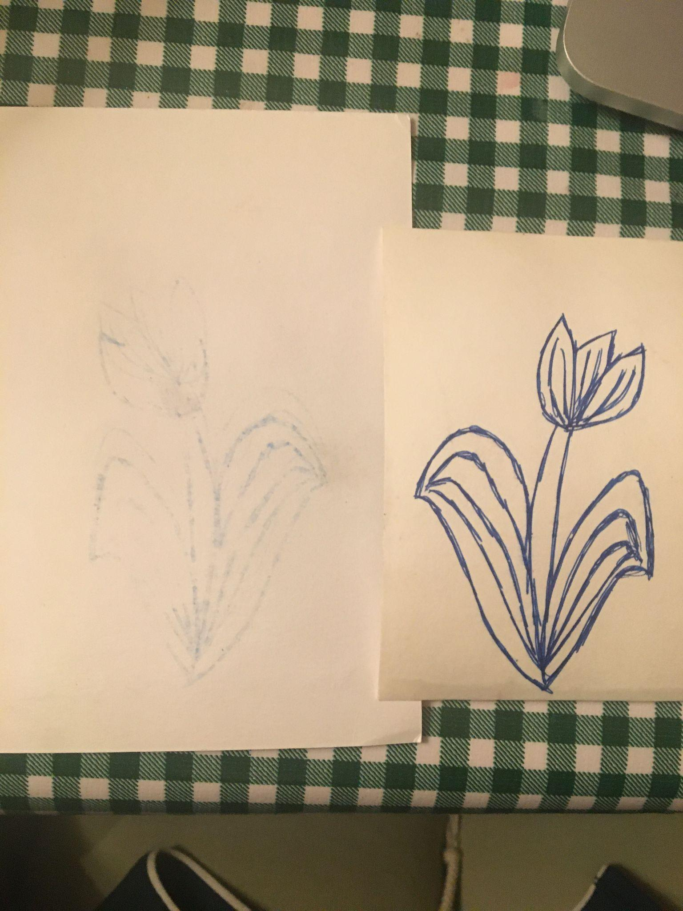

# Counterproofing: Reproduction and Theft in Early Modern Print Culture

> Theodora Bocanegra Lang 
Spring 2022 
Making and Knowing in Early Modern Europe: Hands-On History 

In an entry of BnF Ms. Fr. 640 entitled “Counterproofing” ([<u>folio
51r</u>](https://edition640.makingandknowing.org/#/folios/51r/f/51r/tl), the
author-practitioner provides the reader with instructions on how to copy
a print using a method of the same name that entails wetting the print
and pressing it onto a fresh piece of paper in an attempt to dampen the
ink and ultimately transfer the image. Part of the process that the
author-practitioner recommends involves burnishing the back of the page
with a tooth or glass, which can leave indentations or marks on the
paper. In this entry, among fixes for yellowing and changing
orientations, there is a particularly curious sentence: “And if you want
this not to be known, if by chance, you borrowed the piece, moisten the
paper, and the polishing that the burnisher has made on the back, which
shows what has been done, will not be known.” Not only is the
author-practitioner sharing how to counterproof, he is teaching
something potentially nefarious: how to steal and not get caught. This
essay asks the question of why might a craftsman in the sixteenth
century, like the author-practitioner or his projected reader, want to
steal a print, copy it, and surreptitiously return it.

To answer that question, first we must find why someone might want to
copy a print to begin with. As Renaissance print scholar Ad Stijnman
writes, counterproofing was an “ideal way of replicating a plate in
order to extend the print run.”[^1] If the plate or matrix became damaged
or was used to the point of destruction, a printer could take a finished
print and reverse engineer another iteration of the plate, so as to
continue printing. As is demonstrated by Nicole Bertozzi’s essay
“Transferring Images”
(<https://edition640.makingandknowing.org/#/essays/ann_067_fa_18>),
counterproofing is particularly useful for this task because it
preserves the original image, instead of other replicating techniques
that destroy the original.[^2] This might allow the printer to make any
tweaks or minor changes to the new print, and ultimately new plate,
while still being able to reference the original. This technique also
saves time: one might otherwise have to copy the original image by
redrawing it from scratch. Counterproofing, even if incomplete, provides
at least a sketch to start with.

The objective of extending a print run assumes that the printer owns the
original print, that it is of his own making and he seeks to replicate
it to continue his own ends of selling it. In the sixteenth century,
however, forging or copying the works of others was a fairly common
practice, sparking debates on authorship and ownership. Historian Brenda
Hosington points out that “the identity of the author, often absent from
medieval works, was given increasing prominence in the early modern
book.”[^3]

During this time, ideas about image originality, copies, and forgeries
were similarly changing. Famed painter and printmaker Albrecht Dürer
(1471–1528) was particularly bothered and subsequently vigilant about
copies of his work, for good reason. A prolific artist, Dürer’s work was
copied and forged as early as 1494.[^4] He famously included a notice at
the beginning of one work, addressing would-be forgers. The colophon of
*The Life of the Virgin* (1511) warns:

> Beware, you envious thieves of the work and invention of others, keep
> your thoughtless hands from these works of ours. We have received a
> privilege from the famous emperor of Rome, Maximilian, that no one
> shall dare to print these works in spurious forms, nor sell such
> prints within the boundaries of the empire.... Printed in Nuremberg,
> by Albrecht Durer, painter.[^5]

The impetus for this directive occurred several years prior. An earlier
version of *The Life of the Virgin* was published in 1502, and, in 1506,
a concerned friend of Dürer’s sent him a print that appeared to belong
to the series. After examining it and determining it was a copy, Dürer
brought a lawsuit against the creator, accomplished artist Marcantonio
Raimondi (1480–1534). Art historian Noah Charney claims that this is the
“first-known case of art-specific intellectual property law brought to
trial.”[^6] Perhaps surprising to a modern audience, Raimondi was not
found at fault. The Venetian court pronounced that although they were
nearly identical and the exact same size, since he had made several
small changes to the image, including adding his own signature and the
mark of the publishing house (though keeping Dürer’s easily recognizable
monogram, in the lower left corners of the figures below), it was not a
forgery.

Left: Albrecht Dürer, *Christ Taking Leave of His Mother, from The Life
of the Virgin,* ca. 1504. Woodcut, sheet: 11 3/4 x 8 1/4 in. (29.8 x 21
cm). The Metropolitan Museum of Art, New York, Rogers Fund, 1918.
18.65.12,
[<u>https://www.metmuseum.org/art/collection/search/387875</u>](https://www.metmuseum.org/art/collection/search/387875)

Right: Marcantonio Raimondi, *Christ Taking Leave of His Mother, from The Life of the Virgin, after Albrecht Dürer,* c. 1506. Engraving. 292 x 211mm. Christchurch Art Gallery Te Puna o Waiwhetū, Christchurch, New Zealand. Sir Joseph Kinsey bequest. 69/279, [<u>https://christchurchartgallery.org.nz/collection/69279/item/christ-taking-leave-of-his-mother-from-the-life-of</u>](https://christchurchartgallery.org.nz/collection/69279/item/christ-taking-leave-of-his-mother-from-the-life-of).

Though there is no evidence that Raimondi used counterproofing here (in
fact, many sources applaud him for his painstaking detail in copying
Dürer’s prints by hand), it is easy to imagine that the technique might
be useful in a situation such as this. Simply providing a rough outline
to guide Raimondi’s reproduction would have saved him both time and
labor, which would ultimately allow him to increase his print yield and
sell more prints faster. When selling copies, production time could be
crucial in selling as many prints as possible before the copying is
discovered.

Raimondi was known for his penchant for replication. As Charney
describes, “Raimondi was among the most famous and skillful printmakers
of the sixteenth century. He was a major artist in his own right, but he
was best known for having been Raphael’s official printmaker.”[^7]
Raffaello Sanzio da Urbino (1483–1520), known by the mononym Raphael,
was an internationally known painter. Though the exact terms of
Raimondi’s employment are unknown, Raphael supplied him with drawings
that Raimondi would engrave and subsequently print.[^8] Printing at this
time was a relatively inexpensive and new technology, and had the
potential to reach much wider audiences than painting. As art historian
Catherine Wilkinson writes, “Marcantonio’s prints came to be perceived
as substitutes for Raphael’s paintings and were widely collected and
used by such artists as Rembrandt or Delacroix, whose experience of
original paintings by Raphael was limited.”[^9] Wilkinson also describes
prints as similar to a modern day reference book, writing that “prints
were ‘reproductions’ (a sort of sixteenth-century equivalent of
photographs),” and that Raimondi’s prints provided artists “with a stock
of available images, ready to use in their own works.”[^10]

Art historian Hannah Friedman examines another motivation for copying:
teaching. In her lecture “Modern Michelangelos? Copies, Fakes, and New
Economies of Taste in the Early Seicento,” she describes a print of a
study of legs by printer Luca Ciamberlano (1580–1641), done after a
drawing by artist Agostino Carracci (1557–1602).[^11] This, and similar
prints, were made as educational tools, often compiled in books.[^12] The
purpose of these books, often referred to as “drawing books,” was to
teach life drawing skills outside of the typical artist workshop
environment.[^13] As Friedman indicates, images from certain artists, such
as Michelangelo (1475–1564), were particularly valued as means of
learning from great masters by copying them. Some such drawings could be
successfully sold as forgeries.

Luca Ciamberlano, *Five Legs and Three Feet,* 17th century. Engraving,
sheet: 6 1/16 x 4 11/16 in. (15.4 x 11.9 cm). The Metropolitan Museum of
Art, New York, The Elisha Whittelsey Collection, The Elisha Whittelsey
Fund, 1951. 51.501.270,
[<u>https://www.metmuseum.org/art/collection/search/386108</u>](https://www.metmuseum.org/art/collection/search/386108).

This seemingly generous offering of technical knowledge may seem like an
unexpected development in the lucrative art market. In art historian
Christina Neilson’s essay “Demonstrating Ingenuity: The Display and
Concealment of Knowledge in Renaissance Artists’ Workshops,” she
investigates attitudes regarding knowledge sharing during this time. She
writes,

> In his treatise, Biringuccio explains why he is revealing the secret
> of using mercury to extract gold and silver from metal sweepings…: ‘in
> order that you \[the reader\] should esteem and value \[this
> knowledge\] so much more.’[^14] Biringuccio’s comment may be taken to
> stand for a general attitude toward the motivation of artisans in
> revealing knowledge during the Renaissance, manifested in the
> explosion of manuscripts and printed books on information about the so
> called mechanical arts: the value of revealing previously held secrets
> lay in the appreciation of that knowledge (and the appreciation of
> those who disseminated it) by patrons.[^15]

Ms. Fr. 640 is one such text on technical knowledge; perhaps the theft
technique is included merely to entice a reader, or assert expertise.
Neilson continues, “But to keep their patron–and other
visitors–interested, artists often withheld information to add to the
mystique of their work.”[^16] This oscillation between openness and
secrecy, remaining irreplaceable to patrons while advertising to new
audiences (or new patrons), coupled with emerging questions of
authorship provide insights into why the author-practitioner may have
seen value in secretly copying imagery. Perhaps he wanted to reproduce
another’s work and sell it as his own, or innocently wanted to learn
from another artist whose prints were in demand, possibly at the request
of a patron. Inclusion of the method could have served as a means of
flaunting his skill in order to promote himself to possible students,
apprentices, other artisans, or customers. He may have wanted a copy of
an image to use as a reference, such as Raimondi’s prints after Raphael.
It could have even been a cost-saving solution, to acquire new prints
without paying for them.

Though I did not have the exact materials that the author-practitioner
most likely used, I tested the basic efficacy of this technique for
removing evidence of counterproofing. I did not have a print suitable
for this test, so I used an ink drawing that I did in pen. As can be
seen in my field notes, the method worked surprisingly well.[^17] I
successfully transferred the image to fresh paper, though I was not able
to print it exactly or in perfect detail. For removing evidence of the
process, I found that by following the author-practitioner’s
instructions and dampening the original, nearly all burnishing marks
were erased. Those remaining were hardly noticeable, even when closely
searching for them. Whatever the author-practitioner may have done with
his covert copies, it certainly seems he was capable of getting away
with it.

  

Results of counterproofing test. On the left, the new print, and on the
right, the original drawing used here.

  

A corner of the back of the original drawing after burnishing, with the
round indentations of the muller I used visible.

The same corner after wetting it and letting it dry. As is clear, the
indentations are no longer visible.

## Bibliography

Bertozzi, Nicole. “Transferring Images.” In *Secrets of Craft and Nature
in Renaissance France. A Digital Critical Edition and English
Translation of BnF Ms. Fr. 640*, edited by Making and Knowing Project,
Pamela H. Smith, Naomi Rosenkranz, Tianna Helena Uchacz, Tillmann Taape,
Clément Godbarge, Sophie Pitman, Jenny Boulboullé, Joel Klein, Donna
Bilak, Marc Smith, and Terry Catapano. New York: Making and Knowing
Project, 2020.
<https://edition640.makingandknowing.org/#/essays/ann_067_fa_18>. DOI:
<https://www.doi.org/10.7916/qmcq-ce66>.

Charney, Noah. *The Art of Forgery: The Minds, Motives and Methods of
the Master Forgers*. London: Phaidon Press Limited, 2015.

Charney, Noah. *The Devil in the Gallery: How Scandal, Shock, and
Rivalry Shaped the Art World*. Blue Ridge Summit: Rowman & Littlefield
Publishers, 2021. Accessed May 13, 2022. ProQuest Ebook Central.

Ford, Lauren Moya. “How Europe Learned to Draw.” *Hyperallergic*.
January 1, 2020. Accessed May 13, 2022.
<https://hyperallergic.com/526880/how-europe-learned-to-draw/>.

Friedman, Hannah. “Modern Michelangelos? Copies, Fakes, and New
Economies of Taste in the Early Seicento.” Paper presented at “When
Michelangelo Was Modern: The Art Market and Collecting in Italy,
1450–1650,” organized by the Center for the History of Collecting, Frick
Art Reference Library, New York. April 13, 2019.
<https://www.youtube.com/watch?v=VuB9EtQ8DeY>.

Hosington, Brenda M. “Introduction: Translation and Print Culture in
Early Modern Europe.” *Renaissance Studies* 29, no. 1 (2015): 5–18.
[<u>http://www.jstor.org/stable/26631746</u>](http://www.jstor.org/stable/26631746).

Long, Pamela O.. *Openness, Secrecy, Authorship: Technical Arts and the
Culture of Knowledge From Antiquity to the Renaissance*. Baltimore:
Johns Hopkins University Press. 2001.

Neilson, Christina. “Demonstrating Ingenuity: The Display and
Concealment of Knowledge in Renaissance Artists’ Workshops.” *I Tatti
Studies in the Italian Renaissance* 19, no. 1 (2016): 63–91.
[<u>https://www.jstor.org/stable/26558270</u>](https://www.jstor.org/stable/26558270).

Pon, Lisa. “Prints and Privileges: Regulating the Image in 16th-Century
Italy.” *Harvard University Art Museums Bulletin* 6, no. 2 (1998):
40–64. <http://www.jstor.org/stable/4301572>.

Pyne, Lydia. “The Proliferation and Politics of Copies During the
Renaissance.” *Hyperallergic*. April 29, 2019. Accessed May 13, 2022.
[<u>https://hyperallergic.com/497448/copies-fakes-and-reproductions-printmaking-in-the-renaissance-blanton-museum-of-art/</u>](https://hyperallergic.com/497448/copies-fakes-and-reproductions-printmaking-in-the-renaissance-blanton-museum-of-art/).

Solly, Meilan. “What Differentiates Renaissance Copies, Fakes and
Reproductions?” *Smithsonian Magazine*, May 7, 2019. Accessed May 13,
2022.
[<u>https://www.smithsonianmag.com/smart-news/austin-exhibition-asks-what-differentiates-renaissance-copies-fakes-and-reproductions-180972094/</u>](https://www.smithsonianmag.com/smart-news/austin-exhibition-asks-what-differentiates-renaissance-copies-fakes-and-reproductions-180972094/).

Stijnman, Ad. “It’s All about Matter: Thoughts on Art History from the
Perspective of the Maker.” *Art in Print* 6, no. 3 (2016): 16–17.
[<u>https://www.jstor.org/stable/26408682</u>](https://www.jstor.org/stable/26408682).

Stijnman, Ad. *Engraving and Etching, 1400–2000: A History of the
Development of Manual Intaglio Printmaking*. London: Archetype
Publications, 2012.

Wilkinson, Catherine. “The Engravings of Marcantonio Raimondi.” *Art
Journal* 42, no. 3 (1982): 236–39.
[<u>https://doi.org/10.2307/776586</u>](https://doi.org/10.2307/776586).

[^1]: Ad Stijnman, *Engraving and Etching, 1400–2000: A History of the
Development of Manual Intaglio Printmaking* (London: Archetype
Publications, 2012), p. 159.

[^2]: Nicole Bertozzi, “Transferring Images,” in *Secrets of Craft and
Nature in Renaissance France. A Digital Critical Edition and English
Translation of BnF Ms. Fr. 640*, edited by Making and Knowing Project,
Pamela H. Smith, Naomi Rosenkranz, Tianna Helena Uchacz, Tillmann Taape,
Clément Godbarge, Sophie Pitman, Jenny Boulboullé, Joel Klein, Donna
Bilak, Marc Smith, and Terry Catapano (New York: Making and Knowing
Project, 2020).
<https://edition640.makingandknowing.org/#/essays/ann_067_fa_18>. DOI:
[https://www.doi.org/10.7916/qmcq-ce66.](https://www.doi.org/10.7916/qmcq-ce66)

[^3]: Brenda M. Hosington, “Introduction: Translation and Print Culture in
Early Modern Europe,” *Renaissance Studies* 29, no. 1 (2015): 5–18. p.
7.
[<u>http://www.jstor.org/stable/26631746</u>](http://www.jstor.org/stable/26631746).

[^4]: Lisa Pon, “Prints and Privileges: Regulating the Image in
16th-Century Italy,” *Harvard University Art Museums Bulletin* 6, no. 2
(1998): 40–64. p. 41.
[<u>http://www.jstor.org/stable/4301572</u>](http://www.jstor.org/stable/4301572).

[^5]: Quoted by Pon, quoting Joseph Koerner's translation from *The Moment
of Self-Portraiture in German Renaissance Art* (Chicago, 1993), p. 213.

[^6]: Noah Charney, *The Art of Forgery: The Minds, Motives and Methods of
the Master Forgers* (London: Phaidon Press Limited, 2015), p. 12.

[^7]: Noah Charney, *The Devil in the Gallery: How Scandal, Shock, and
Rivalry Shaped the Art World* (Blue Ridge Summit: Rowman & Littlefield
Publishers, 2021), p. 84. Accessed May 13, 2022. ProQuest Ebook Central.

[^8]: Catherine Wilkinson, “The Engravings of Marcantonio Raimondi,” *Art
Journal* 42, no. 3 (1982): 236–39. p. 237.
[<u>https://doi.org/10.2307/776586</u>](https://doi.org/10.2307/776586).

[^9]: Ibid. p. 239.

[^10]: Ibid. p. 238.

[^11]: Hannah Friedman, “Modern Michelangelos? Copies, Fakes, and New
Economies of Taste in the Early Seicento.” Paper presented at “When
Michelangelo Was Modern: The Art Market and Collecting in Italy,
1450–1650” organized by the Center for the History of Collecting, Frick
Art Reference Library, New York. April 13, 2019.
[<u>https://www.youtube.com/watch?v=VuB9EtQ8DeY</u>](https://www.youtube.com/watch?v=VuB9EtQ8DeY).

[^12]: For an excellent digital reproduction of one such book, see this
link to one in the collection of the Biblioteca Nacional de España:
[<u>http://bdh-rd.bne.es/viewer.vm?id=bdh0000251828</u>](http://bdh-rd.bne.es/viewer.vm?id=bdh0000251828).

[^13]: Lauren Moya Ford, “How Europe Learned to Draw,” *Hyperallergic*,
January 1, 2020. Accessed May 13, 2022.
[<u>https://hyperallergic.com/526880/how-europe-learned-to-draw/</u>](https://hyperallergic.com/526880/how-europe-learned-to-draw/).

[^14]: Pamela O. Long, *Openness, Secrecy, Authorship: Technical Arts and
the Culture of Knowledge From Antiquity to the Renaissance*. (Baltimore:
Johns Hopkins University Press, 2001).
[<u>https://search-ebscohost-com.ezproxy.cul.columbia.edu/login.aspx?direct=true&AuthType=ip&db=e025xna&AN=75587&site=ehost-live&scope=site</u>](https://search-ebscohost-com.ezproxy.cul.columbia.edu/login.aspx?direct=true&AuthType=ip&db=e025xna&AN=75587&site=ehost-live&scope=site).

[^15]: Christina Neilson, “Demonstrating Ingenuity: The Display and
Concealment of Knowledge in Renaissance Artists’ Workshops,” *I Tatti
Studies in the Italian Renaissance* 19, no. 1 (2016): 63–91. p. 78.
[<u>https://www.jstor.org/stable/26558270</u>](https://www.jstor.org/stable/26558270).

[^16]: Ibid. p. 78.

[^17]: Linked here:
[<u>sp22_lang_theodora_final_counterproofing</u>](https://docs.google.com/document/d/1Wnknuqxi-4hgHHgK5B9RudKuXmyyHDoKcVeYRZgjNtk/edit?usp=sharing)
