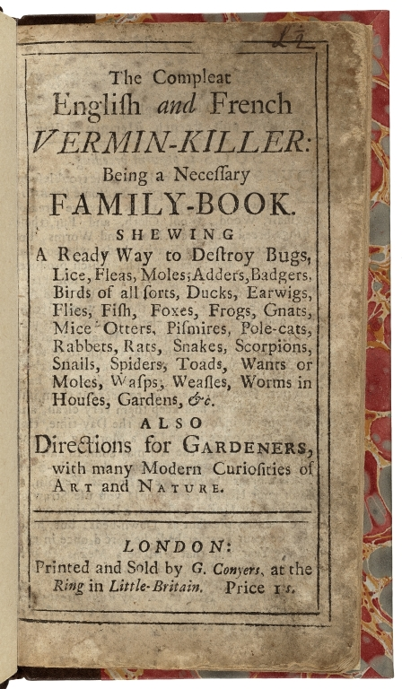

# Animal Rationality in Ms. Fr. 640

Victoria Nebolsin

Making and Knowing: Hands-On History

May 2022

[Ms. Fr. 640](https://edition640.makingandknowing.org/#/) reveals
a surprisingly symbolic treatment of some of the animals with which the
author-practitioner engages. While overall the manuscript possesses a
mostly practical, straightforward approach, several passages on animals
display language that sings with metaphor. Snakes are explicitly
compared to Satan (fol.
[109v](https://edition640.makingandknowing.org/#/folios/109v/tl)),
rats are compared to the tyrant of Syracuse
(152r](https://edition640.makingandknowing.org/#/folios/152r/f/152r/tl)),
and pigs can understand Greek
([13v](https://edition640.makingandknowing.org/#/folios/13v/f/13v/tl)).
The attention that the author-practitioner allots to animals only
amplifies the perplexing nature of these remarks. As Pamela Smith
underscores:

> Ms. Fr. 640 provides observations on the habits of animals used for
> casting, including instructions for catching, feeding, and killing
> them, along with extremely detailed firsthand experimentation in
> molding and casting them. The author-practitioner treats lifecasting
> in dense passages from fol. 106v right through to the end of the
> manuscript…[^1]

Smith follows this description with the statement that “it is clear that
lifecasting was a major preoccupation (perhaps *the* major
preoccupation) of the author-practitioner.” In confronting the immense
effort dedicated to living creatures, the symbolic details swell with
larger implications. Understanding the symbolism necessitates
identifying the underlying values that drive the author-practitioner’s
craft.

Ms. Fr. 640 is not unusual in its emphasis on animals. Many artifacts of
art and architecture from early modern Europe reveal efforts to imitate
nature,[^2] and such efforts often focus on animals. One example appears
in amulets used for pregnancies. In *The Body of the Artisan*, Smith
uncovers the meticulous drawings of amphibians found in a goldsmith’s
workshop. She writes that these images were most likely “used as models
for amulets cast in metal” that “were ‘to be placed on the head of a
29-week pregnant woman.’”[^3] Frogs and amphibious creatures—animals
equipped to shift between land and water—were frequently used for
childbirth talismans. Smith elaborates:

> These drawings of amulets give us insight into a web of connections:
> the verisimilitude of the apprentice’s drawings mattered because
> knowledge and efficacy resided in nature. Nature had to be imitated to
> bring into operation natural processes; processes that were bound up
> with the workings of the human body. In the artisan’s attempt to
> imitate nature, he strove to create effects by employing the powers
> that inhered in nature.[^4]

The amulets suggest that the author-practitioner might also have had
such a view of animals: that they are not simply brute beasts to be
tamed, domesticated, and/or consumed; they have something that can
protect, heal, or teach humans.

Ms. Fr. 640’s entries on lifecasting demonstrate a concerted effort to
master and comprehend the “knowledge and efficacy” to be found in
animals. In this essay, I will argue that the metaphorical interludes,
rather than being oddities in Ms. Fr. 640, provide insight into the
author-practitioner’s understanding of what this “knowledge and
efficacy” might mean. Specifically, I will look at entries that suggest
that animal knowledge contains a degree of rationality. By comparing the
rat to a tyrant and claiming pigs can understand Greek, the handbook
grants a degree of reason to these creatures. Furthermore, these
comparisons reveal echoes of Plutarch, an ancient writer who argued
against the Stoic denial of rationality to animals.[^5] I hope to explore
Plutarch’s influence on Ms. Fr. 640. In doing so, I aim to show how the
author-practitioner unchains reason from its link solely to the human
realm. I will treat the manuscript’s metaphors not as idiosyncrasies,
but as evidence of the author-practitioner’s belief in the reasoning
powers of beasts. Specifically, I will look at the entries on the rat
(152r), pig (13v), and snake (109v).

## The Tyrant Rat and Vermin-Killing Manuals

In the entry on “Molding a rat”
([152r](https://edition640.makingandknowing.org/#/folios/152r/f/152r/tl)),
the entry states: “the hairs of its whiskers would be awkward to come
out in the cast; you can therefore shave them with fire, like the tyrant
of Syracuse, & afterward you can replace them with natural silvered
ones”—the said tyrant being Dionysius I of Syracuse, who burned off his
beard rather than trusting a barber who could potentially slit his
throat. The tyrant metaphor composes only a small feature of this
extensive, sharply technical entry, but the disparity makes it stand out
all the more. Anthropomorphizing this vermin does not denote an
eccentricity on the author-practitioner’s part; in fact, this is
extremely common in early modern texts. “In the \[early modern\] vermin
pamphlets and literature…greed is a defining quality of such animals,
sometimes leading to comic tales in which they are caught because they
can’t give up a choice morsel,” Karen Raber writes,[^6] and evidently,
the comparison to a Greek tyrant, hungry for power, corresponds to such
an attitude. But where do these ubiquitous views of avarice stem from?

During the early modern era, vermin competed with humans for resources.
These animals inhabit a unique position in that they were not eaten, nor
cultivated for any practical or aesthetic purposes, yet still played a
significant role in everyday life. Rather than hunting for their own
food, vermin scurry into the household to poach human food. In fact, as
Mary Fissell indicates, vermin were “defined legally in Elizabethan and
Henrician statutes which authorized parishes to provide payment for the
killing of vermin injurious to grain,”[^7] a sign of their ability to
leave humans hungry. In response, vermin-killing manuals began to gain
popularity in the rapidly expanding industry of early modern cheap-print
books. These often noted that the pests died because “they ate
greedily:” in *A Necessary Family-Book, Both for the City & Country, in
Two Parts* (1688),[^8] the author describes how “they will greedily eat
it, and it quickly will killeth them.” Fissell connects their continuous
vilification to the need to allay anxieties about killing them. She
cites James Serpell to highlight the dark undercurrent of this
anthropomorphism, exposing how these highly negative terms served to
justify the vermin’s extermination.[^9]

*The Compleat English and French Vermin-Killer*, 1710, Folger 230–673q,
[<u>https://shakespeareandbeyond.folger.edu/2020/01/21/rats-early-modern-life-shakespeare-plays-wild-things/</u>](https://shakespeareandbeyond.folger.edu/2020/01/21/rats-early-modern-life-shakespeare-plays-wild-things/).

In early modern texts, vermin were portrayed as “trickster figures,
endowed with more than animal intelligence, engaged in eternal battle
with humans over \[…\] materials essential to human existence—meat,
grain, fabrics, wood.”[^10] Capturing mice and rats, as a result, became
a true struggle; rat catching meant that the individual would not only
need to have knowledge of rats and their behavior, but also become
skilled in using snares and poisons against these sly creatures. Humans
would have to enact the knowledge of specific technologies as a way to
stay one step ahead. Fissell notes that the inclusion of vermin-killing
in a “book of secrets” was logical because outsmarting these pests
implied knowing a few tricks. She writes:

> The key that linked vermin-killing, magical tricks, and recipes for
> preserving pears was not domestic management. Rather each represents a
> manipulation of the natural world through cunning…legerdemain involved
> fooling the audience, vermin-killing required fooling the animals, and
> preserving fruit involved fooling the natural process of
> decay…“science” and “secrets” were wholly intermingled.[^11]

This relates directly back to Ms. Fr. 640 as several of its entries span
not only the molding of rats, but the preservation of perishables, as
well as several tricks, including disguising a horse
([54v](https://edition640.makingandknowing.org/#/folios/54v/f/54v/tl)).
In some ways, the reference to the tyrant of Syracuse alludes to an
evenly matched battle of wits occurring outside of the manuscript.
Though there are no explicit vermin-killing entries, there are several
references to catching animals (lizards and snakes
\[[107r](https://edition640.makingandknowing.org/#/folios/107r/f/107r/tl)\];
crayfish
\[[160v](https://edition640.makingandknowing.org/#/folios/160v/f/160v/tl)\])
for the purposes of lifecasting. We can speculate that the
author-practitioner hunted his rat as well, and in portraying him as
Dionysius, an animal rationality emerges: the rat is a worthy opponent,
mobilizing her greed and cunning to conquer the cupboard’s treasures.

While the author-practitioner explicitly compares the rat to a dictator,
the vermin-killing manuals are not as harsh. *The Compleat English and
French Vermin-Killer* (1710), for example, names tyrannical traits, but
does not go so far as to depict tyranny itself. The manual simply sticks
to words such as “selfish” and “very destructive.” Similarly, *The
Vermin-Killer* (1680), an earlier manual, fixates on avarice without any
mention of bloodthirsty exploit. So, where does the
author-practitioner’s impulse to reference Dionysus come from?

Vermin-killing manuals were not widely available until after Ms. Fr.
640’s publication, but the race to eradicate rats was well underway by
the 1580s (its likely period of composition). Whether officially
compiled into manuals or not, methods to outwit vermin were commonly
exchanged orally. In France, the battle between trickster vermin and
frustrated humans eventually grew to include the legal system. Bathélemy
de Chasseneuz, one of the leading French jurists of the century, “owed
his reputation to his work as counsel for a group of rats who had been
put on trial before the court of Autun on the charge of having eaten up
and destroyed the barley crop of that province.”[^12] The 1522 rat trial
of Autun was well-known throughout France; it created enough fame for
Chasseneuz to sit on the highest courts in Paris, Burgundy, and
Provencal. “From that day onward, he enjoyed a meteoric career as a
consulting lawyer,” writes Jan Bondeson.[^13] Defending the rats
presented a particularly arduous task due to the overwhelming efforts
employed against them. Chasseneuz realized this when he saw the “pompous
clerics, dressed in their best habits, elaborate at length about the bad
character and notorious guilt of the accused rodents before a vast crowd
of peasants dressed in their Sunday finery, listening to their tirades
with rapt attention.”[^14] His winning of the case, and commitment to
finding obscure legal loopholes, earned him nationwide renown. Even so,
the rats continued to be reviled as gluttonous felons.

The trial of Autun paints a telling picture of how rats were perceived
in early modern France. Autun’s citizens were so exasperated by the
vermin’s tyranny over their crop that they took the pests to court;
there, ill repute was weaponized against them. It is this exasperation
that would lead to the vermin-killing manuals. It is also these “crimes”
that the author-practitioner would be aware of in compiling Ms. Fr. 640.
The Dionysus metaphor then seems more appropriate, for in molding the
rat, the author-practitioner is molding the outlaw that ravages the
country’s harvests. But why Dionysus, specifically?

### “Burning His Whiskers Like the Tyrant of Dionysus”: Plutarch’s Influence

The reference to Dionysus in “Molding a rat” evokes not only the
aforementioned trial of Autun, but a potential influence by Plutarch as
well. His text *Parallel Lives* records the reigns of both Dionysius I
(the better known tyrant) and Dionysius II as a comprehensive study of
both their political tenures and the subsequent consequences. In fact,
Plutarch mentions Dionysus’s distrust of the barber twice—first, in a
work from *Moralia* titled “On Talkativeness,” then in *Parallel Lives*.
In “On Talkativeness,” Dionysus slays the barber that mocks his
“unbreakable despotism” and who sneers, “fancy your saying \[that
Dionysus is unbreakable\], when I have my razor at his throat every few
days or so!”[^15] In *Parallel Lives*, the reference to Dionysus’s barber
makes the parallel between Plutarch and Ms. Fr. 640 more evident. He
writes: “for the elder Dionysus was so distrustful and suspicious
towards every body \[sic\], and his fear led him to be so much on his
guard, that he would not even have his hair cut with barbers’ scissors,
but a hairdresser would come and singe his locks with a live coal.”[^16]
Here the singeing of the locks mirrors the singeing of the rat’s
whiskers.

If the manuscript did, in fact, adopt the rat image from Plutarch, it
reveals a telling detail about how the author-practitioner might have
approached animal life. Plutarch did not only write about tyrants. As
stated earlier, he is also the ancient world’s most avid advocate for
animal rationality. Stephen T. Newmayer highlights that Plutarch:

> devoted three treatises of his *Moralia* to questions relating to the
> nature and moral status of animals. Plutarch touched upon the question
> of justice toward animals in *De esu cranium (On the Eating of
> Flesh)*, a defense of vegetarianism … and in *Bruta animalia ratione
> uti (Whether Beasts Are Rational*), an amusing parody of *Odyssey X*
> cast in the form of a dialogue between Odysseus and the philosophic
> pig Gryllus (“Grunter”), one of Circe’s victims who declines the
> hero’s offer to convince the witch to reconvert him into human form
> and who advances the position that animals are morally superior to
> humans.[^17]

The author-practitioner would certainly have been exposed to Plutarch,
and, more likely, would have been reading him. In France, the first
edition of Plutarch was published by Gilles de Gourmont on April 30, 1509. This was the inaugural event in a series of Plutarch publications
that created a sweeping interest across France. In the introduction to
Plutarch’s *Lives*, Alain Billault indicates:

> From 1530 to 1540, 27 books by Plutarch were published in France,
> including 15 French translations, six Latin translations, three
> editions of the original text and three volumes which contained Greek
> text and facing Latin translation. Those figures confirm that Plutarch
> had indeed become a popular writer in sixteenth-century France.[^18]

It was Jacques Amyot—a bishop, scholar, writer, and translator—who
brought Plutarch to a French audience; he was Plutarch’s main translator
during the Renaissance. In the *Classical Weekly*, James Hutton writes
that: “Amyot’s Plutarch is the most important monument of French prose
between Calvin’s *Institutes* (French version, 1541) and Montaigne’s
*Essais* (1580).”[^19] He goes on to state that Amyot had already written
the bulk of Montaigne’s *Essais*, as so much of *Essais* appears as
“either a simple transcription or a paraphrase of Amyot’s Plutarch.” In
Hutton’s view, the translator was not merely working on a “popular”
text, but on a monumental contribution to French history. “If one is
sometimes inclined to think that it has played a part in French history
comparable to that of the Authorized Version of the Bible in English
history…let it be noted that Amyot approached his task in something of
the spirit of one translating a sacred text,” Hutton declares.[^20]

Taken together, Billault and Hutton demonstrate just how important
Plutarch was during the author-practitioner’s time. The ancient writer’s
texts were immensely popular during Ms. Fr. 640’s writing and the Amyot
translations became a defining point in French literary history. This
makes the rat entry’s reference to Dionysus appear less anomalous.
Steeped in a society attuned to Plutarch’s work, the author-practitioner
likely pulled from *Parallel Lives*. Subsequently, it would not be a
surprise if Ms. Fr. 640 pulled from *Whether Beasts Are Rational* as
well.

## Summoning the Swine

According to the Ms. Fr. 640, when swine and snakes hear their names
called in Greek, the latter is sure to flee while the former will come
to the caller
([13v](https://edition640.makingandknowing.org/#/folios/13v/f/13v/tl)).
The author-practitioner declares, “it is said that if one calls a snake
in Greek, saying *ΟΦΗ ΟΦΗ* \[meaning snake\], it will flee. Likewise, if
one calls a swine in Greek, *ïon*, it will come.” At first glance, this
entry perplexes with its nonsensical commentary. What is this isolated,
fantastical entry doing in a book on artisanal knowledge? However, the
fact of Plutarch’s popularity in early modern France is a first clue. In
*Whether Beasts Are Rational*, Plutarch features a Greek-speaking pig;
and in the popular Renaissance text by Giovanni Battista Gelli, titled
*Circe*, a Greek-speaking serpent slithers forward.

*Whether Beasts Are Rational* unfolds as a parody of *Odyssey X*,
illustrating a dialogue between Odysseus and a philosophical pig who was
once a human. Plutarch names the pig Gryllus (“Grunter”); he is a
verbose victim of the spell Circe cast to condemn Odysseus’s men to
swinehood. Gryllus staunchly believes in the superiority of pigs to men,
and though Odysseus attempts to convince him otherwise, the grunter does
not budge. He gestures to all the natural abilities found in animals,
while underscoring the strained effort that composes human life. The pig
proclaims:

> Animal intelligence…allows no room for useless and pointless arts; and
> in the case of essential ones, we do not make one man with constant
> study cling to one department of knowledge and rivet him jealously to
> that; nor do we receive our arts as alien products or pay to be taught
> them. Our intelligence produces them on the spot unaided; as its own
> congenital and legitimate skills. I have heard that in Egypt, everyone
> is a physician; and in the case of beasts each one is not only his own
> specialist in medicine, but also in the providing of food, in warfare
> and hunting as well as in self-defence and music, in so far as any
> kind of animal has a natural gift for it.[^21]

The passage above condenses Gryllus’s overall point: why transform into
a clumsy, striving human when skill and knowledge come so naturally to
animals? Food, hunting, medicine—Gryllus lists what he considers to be
innate gifts. Humans, on the other hand, must pursue these practices
with intention. Ms. Fr. 640 is itself an example of such misfortune.

Recall the amphibian amulets used for childbirth. Smith traces this
imitative practice to the desire “to create effects by employing the
powers that inhered in nature.” Plutarch adopts a similar point—that
animals contain natural gifts man can only achieve through focused
imitation. In Ms. Fr. 640, the author-practitioner’s painstaking efforts
contain the same argument. Entries on lifecasting, natural antidotes,
and raising silkworms to exploit them for alchemy demonstrate the
manuscript’s overarching goal of coopting nature’s powers. The silkworm
entry
([53v](https://edition640.makingandknowing.org/#/folios/53v/f/53v/tl)),
for example, specifies a way to trap the creatures, feed them, and
harvest their transformative properties. As Sasha Grafit writes,
“the…recipe involves hatching silkworm eggs in an enclosed flask where
they are to feed on egg yolks and each other. When the sole surviving
silkworm grows to resemble a serpent, it is burned and produces a toxic
vapor—its ash is to be used to transmute metals into gold.”[^22]
Silkworms contain the natural gift of transmutation; they transform from
egg to worm to cocoon to moth. The author-practitioner, on the other
hand, must artificially manipulate the worms to harness their
transmutative potential.

If Gryllus and the author-practitioner are in agreement, then Ms. Fr.
640’s Greek-speaking pig appears less outlandish. Gryllus would have
been a known figure in early modern France, especially for those
pondering animal life. Additionally, the ability to summon swine would
be a sought-after skill at the time. Unruly pigs were a common danger in
early modern cities. Keith Thomas emphasizes, “in the towns of the early
modern period, animals were everywhere…for centuries, wandering pigs
were a notorious hazard of urban life.”[^23] Tamed swine had a habit of
running off as well. Ralph Josselin recorded in his diary on July 5th, 1650:

> I was troubled with my hogs breaking away on the lords day morning,
> and having looked for him and not finding him. I observed still a
> vexacon and trouble in all thes things and thinking gods providence
> might bring him backe to mee, I was just then told that he was driven
> home from of the greene.[^24]

Even farmers did not have full dominion over their pigs. Together, the
hazard of wandering pigs and the popularity of Plutarch unveil the
potential logic behind Ms. Fr. 640’s puzzling entry.

## Scaring the Snakes

In “Whether Beasts Are Rational,” Gryllus the Pig states, “I have heard
in Egypt that everyone is a physician; and in the case of beasts each
one is…his own specialist in medicine.”[^25] In *Circe*, Giovanni
Battista Gelli portrays one such physician, except he is Greek, not
Egyptian. He is also not human, but a snake.

Gelli’s *Circe* adopts *Whether Beasts Are Rational*, expanding it into
a series of dialogues with eleven different animals who were formerly
humans. Published in 1549, the text had “great vogue” in France and was
even put into dramatic form.[^26] According to George Boas, La Fontaine
imitated Gelli’s story in his famous fable *Les Compagnons d’Ulyse*.[^27]
By the end of the century*, Circe* also benefited from numerous
reprints.[^28] All of these factors point to a strong likelihood that the
author-practitioner would have been familiar with the work.

Gelli’s animals are arranged according to an “interesting renaissance
conception of the scale of animal being, since it starts with the
oyster, and the mole and runs through the snake, the hare, the roebuck,
the doe, the lion, the horse, the dog, the calf, and finally, the
elephant.”[^29] In their dialogues, all prefer to remain a beast, save
for the elephant. The animals largely base their arguments for superior
virtues, knowledge, and perfections on “particular *physical*
relationships to the world and its challenges. The snake, for instance,
who was once a physician, details the miseries of human suffering, while
celebrating the fact that animals never fall prey to excessive appetites
or other vices.”[^30] That is to say that each animal formulates his or
her position based on its knowledge of the material world.

The snake is a particularly fascinating figure, particularly for
comparing Gelli and Ms. Fr. 640. Firstly, the Greek viper in *Circe*
mirrors the Greek-speaking serpent from the manuscript. Odysseus asks
the viper, “art thou the celebrated Doctor of Lesbos?” to which the
snake replies affirmatively.[^31] The famed physician provides a trope
that may have been circulated during *Circe*’s popularity, influencing
the hearsay underlying Ms. Fr. 640’s entry. Secondly, and more
interestingly, questions posed by the snake echo a human vulnerability
which drives some of the manuscript’s practices. Boas writes:

> As a physician, \[the snake\] was acquainted intimately with the human
> organism and complains of its general weakness…His main criticism is
> that although as a science \[medicine\] is true, dealing as it does
> with only the eternal and the universal, as an art it is purely
> empirical and we know next to nothing of the human body. That we are
> dependent upon it for health shows how unfortunate we are; the beasts
> have no need of it, for nature has given them controlled appetites and
> lusts, has taught them the remedies which they may need from time to
> time...[^32]

Indeed, in *Circe*, the snake specifies that medical practice is based
on experience, and that, in this respect, it is “very deceitful and
uncertain.” He labels several physicians he knew as “cheats.”[^33] The
viper then goes on to list every part of the human body, emphasizing a
plethora of ailments corresponding to each one.[^34] “Nature is more
indulgent to us than to you,” he hisses, “since he has taught every
Species of us, and every individual belonging to that species, without
any experience of Time or Mony, without any Study or Labour, without any
Teaching or Instruction from others, to find out proper remedies for
those ills.”[^35]

Gelli’s snake creates a sense of irony when thinking about Ms. Fr. 640
as the manuscript is itself a product of study and labor with the goal
of producing natural remedies. Specifically, the viper’s comments summon
the image from the entry on molding the very same animal. In “Flower in
the mouth of the snake”
([122r](https://edition640.makingandknowing.org/#/folios/122r/f/122r/tl)),
Ms. Fr. 640 specifies that “if you want to put in the mouth of the snake
some flower or some branch of a plant which contains the antidote
against its bite, take a little branch, as best arranged as you can
find, & pose its stem into its mouth.” Arranging the snake with an
antidote underscores the human vulnerability Gelli’s snake critiques.
Positioning the two together may indicate the author-practitioner’s
mastery over nature—man can capture snakes and concoct antidotes for
their venom, too. However, the detail equally highlights a
defenselessness. Humans do not possess natural protection against
snakes. They do not have long fangs, sharp claws, or piercing beaks.
Instead, they must pore over manuscripts to study methods of defense.

Serpents have a menacing role in Ms. Fr. 640. In the entry on “Molding a
snake”
([109v](https://edition640.makingandknowing.org/#/folios/109v/f/109v/tl)),
the author-practitioner describes the animal’s behavior, writing that
“they do not bite with a direct attack but with sinuous turns & from the
side, as do Satan & his disciples.” Comparing snakes to Satan and his
disciples illustrates a conniving cleverness in these animals. Like the
tyrannical rats, vipers do not commit violence in a straightforward
manner. They lie in wait and silently whip their supple bodies towards
their target. On fol. 13v, calling the snake to make it flee may be
quotidian hearsay, yet it emphasizes the fear of these predators; they
are a true peril for humans. The specification of calling its name in
Greek, though strange, conjures Gelli’s infamous physician. The snake
sneers:

> we \[beasts\] lie under no necessity of buying one another’s labour,
> of stealing degrees, of corrupting Nurses, of wheedling Apothecaries,
> or trying any dangerous Experiments upon ourselves and our friends;
> and what is infinitely worse, of paying an ignorant Rascal that bleeds
> us dry in the Pocket-vein, and sends us to our graves before our time,
> as you Poor Wretches are forced to do.[^36]

Relying on Ms. Fr. 640’s trick—yelling Greek at a snake to make it
flee—may be a dangerous experiment indeed.

## Conclusion

These entries: “Molding a rat” (152r); “Snakes” (13v and 109v); and
“Flower in the mouth of the snake” (41v) all contain elements that evoke
images from Plutarch and Gelli, two authors who strongly advocated for
animal rationality. Dionysus, Gryllus, and the snake-physician all seem
to have influenced the manuscript, whether directly or through the
surrounding culture. Knowing the popularity of these two authors during
the sixteenth century, we can speculate that the author-practitioner
could have been familiar with their work. It is also telling that Ms.
Fr. 640 shares a central question with the texts: namely, can humans
truly be masters of nature? In other words, does imitation by the human
hand suggest supremacy or does it suggest the need to compensate for our
vulnerabilities? Or both?

Through the manuscript’s treatment of animals, we can see that the
author-practitioner did perhaps afford a degree of reason to animals,
such as in the case of the snakes. If taken seriously, this signals that
the hierarchy of humans and animals may not be so clear cut. Ms. Fr.
640’s puzzling details—Greek-speaking pigs, dictator vermin—puzzle the
reader at first glance, but upon closer inspection, provide insight into
sixteenth-century views of the relationships between human and beast.

## Works Cited

Billault, Alain. “Plutarch’s *Lives*.” In *The Classical Heritage in
France*. Leiden: Brill Publishers, 2002.

Boas, George. *The Happy Beast in French Thought of the Seventeenth
Century*. Baltimore: The John Hopkins Press, 1933.

Bondeson, Jan. “Animals on Trial.” In *The Feejee Mermaid and Other
Essays in Natural and Unnatural History*. Ithaca: Cornell University
Press, 2014.

Fissell, Mary. “Imagining Vermin in Early Modern England.” *History
Workshop Journal*, no. 47 (1999): 1–29.
[https://www.jstor.org/stable/4289600](https://www.jstor.org/stable/4289600).

Gelli, Giovanni Battista. *The Circe of Giovanni Battista Gelli of the
Academy of Florence.* Translated by Thomas Brown Gelli. London: J.N.
Publishers, 1710.

Grafit, Sasha. “Silkworms and the Work of Algiers.” In *Secrets of Craft
and Nature in Renaissance France. A Digital Critical Edition and English
Translation of BnF Ms. Fr. 640*, edited by Making and Knowing Project,
Pamela H. Smith, Naomi Rosenkranz, Tianna Helena Uchacz, Tillmann Taape,
Clément Godbarge, Sophie Pitman, Jenny Boulboullé, Joel Klein, Donna
Bilak, Marc Smith, and Terry Catapano. New York: Making and Knowing
Project, 2020.
[https://edition640.makingandknowing.org/#/essays/ann_059_sp_17](https://edition640.makingandknowing.org/#/essays/ann_059_sp_17).

Hutton, James. “The Classics in Sixteenth Century France.” *The
Classical Weekly* 43, no. 9 (1950): 131–139.
[https://www.jstor.org/stable/4342690](https://www.jstor.org/stable/4342690).

Josselin, Ralph. *The Diary of Ralph Josselin, 1616–1683*. London: The
British Academy, 1976.

Making and Knowing Project, Pamela H. Smith, Naomi Rosenkranz, Tianna
Helena Uchacz, Tillmann Taape, Clément Godbarge, Sophie Pitman, Jenny
Boulboullé, Joel Klein, Donna Bilak, Marc Smith, and Terry Catapano,
editors. *Secrets of Craft and Nature in Renaissance France. A Digital
Critical Edition and English Translation of BnF Ms. Fr. 640*. New York:
Making and Knowing Project, 2020.
[https://edition640.makingandknowing.org](https://edition640.makingandknowing.org/).

Meijer, Eva. *When Animals Speak: Toward an Interspecies Democracy.* New
York: New York University Press, 2019.

Newmyer, Stephen T. “Just Beasts? Plutarch and Modern Science On the
Sense of Fair Play in Animals.” *The Classical Outlook* 74, no. 3
(1997): 85–88.
[http://www.jstor.org/stable/43937959](http://www.jstor.org/stable/43937959).

Plutarch. “On Talkativeness.” In *Moralia*. Translated by Frank Cole
Babbitt. London: Loeb Classical Library, 1939.
[https://penelope.uchicago.edu/Thayer/e/roman/texts/plutarch/moralia/de_garrulitate\*.html](https://penelope.uchicago.edu/Thayer/e/roman/texts/plutarch/moralia/de_garrulitate*.html).

Plutarch. *The Parallel Lives*. Translated by Frank Cole Babbitt.
London: Loeb Classical Library, 1918.
[https://penelope.uchicago.edu/Thayer/E/Roman/Texts/Plutarch/Lives/Dion\*.html](https://penelope.uchicago.edu/Thayer/E/Roman/Texts/Plutarch/Lives/Dion*.html).

Plutarch. “Whether Beasts are Rational.” In *Moralia.* Translated by
Frank Cole Babbitt. London: Loeb Classical Library: 1957.
[https://penelope.uchicago.edu/Thayer/E/Roman/Texts/Plutarch/Moralia/Gryllus\*.html](https://penelope.uchicago.edu/Thayer/E/Roman/Texts/Plutarch/Moralia/Gryllus*.html).

Raber, Karen. *Animal Bodies, Renaissance Culture.* Philadelphia:
University of Pennsylvania Press, 2013.

Smith, Pamela. *The Body of the Artisan.* Chicago: University of Chicago
Press, 2004.

Smith, Pamela H.. “Lifecasting in Ms. Fr. 640.” In *Secrets of Craft and
Nature in Renaissance France. A Digital Critical Edition and English
Translation of BnF Ms. Fr. 640*, edited by Making and Knowing Project,
Pamela H. Smith, Naomi Rosenkranz, Tianna Helena Uchacz, Tillmann Taape,
Clément Godbarge, Sophie Pitman, Jenny Boulboullé, Joel Klein, Donna
Bilak, Marc Smith, and Terry Catapano. New York: Making and Knowing
Project, 2020.
[https://edition640.makingandknowing.org/#/essays/ann_511_ad_20](https://edition640.makingandknowing.org/#/essays/ann_511_ad_20).

Thomas, Keith. *Man and the Natural World: Changing Attitudes in England
1500–*1800 (Oxford: Oxford University Press, 1996), 95.

[^1]: Pamela H. Smith, “Lifecasting in Ms. Fr. 640,” in *Secrets of Craft
and Nature in Renaissance France. A Digital Critical Edition and English
Translation of BnF Ms. Fr. 640*, edited by Making and Knowing Project,
Pamela H. Smith, Naomi Rosenkranz, Tianna Helena Uchacz, Tillmann Taape,
Clément Godbarge, Sophie Pitman, Jenny Boulboullé, Joel Klein, Donna
Bilak, Marc Smith, and Terry Catapano (New York: Making and Knowing
Project, 2020),
[https://edition640.makingandknowing.org/#/essays/ann_511_ad_20](https://edition640.makingandknowing.org/#/essays/ann_511_ad_20).

[^2]: Smith, “Lifecasting in Ms. Fr. 640,”
[https://edition640.makingandknowing.org/#/essays/ann_511_ad_20](https://edition640.makingandknowing.org/#/essays/ann_511_ad_20).

[^3]: Pamela Smith, *The Body of the Artisan* (Chicago: University of
Chicago Press, 2004), 121.

[^4]: Ibid.

[^5]: Stephen T. Newmyer, “Just Beasts? Plutarch and Modern Science On the
Sense of Fair Play in Animals,” *The Classical Outlook* 74, no. 3
(1997): 85–88,
[http://www.jstor.org/stable/43937959](http://www.jstor.org/stable/43937959).

[^6]: Karen Raber, *Animal Bodies, Renaissance Culture* (Philadelphia:
University of Pennsylvania Press, 2013), 121.

[^7]: Mary Fissell, “Imagining Vermin in Early Modern England,” *History
Workshop Journal*, 47 (1999): 3.

[^8]: As cited in ibid., 5.

[^9]: Ibid.

[^10]: Raber, *Animal Bodies, Renaissance Culture*, 119.

[^11]: Fissell, “Imagining Vermin in Early Modern England,” 14–15.

[^12]: Eva Meijer, *When Animals Speak: Towards an Interspecies View of
Democracy* (New York: New York University Press, 2019),
[https://doi-org.ezproxy.cul.columbia.edu/10.18574/nyu/9781479859351.001.0001](https://doi-org.ezproxy.cul.columbia.edu/10.18574/nyu/9781479859351.001.0001).

[^13]: Jan Bondeson, “Animals on Trial,” In *The Feejee Mermaid and Other
Essays in Natural and Unnatural History* (Ithaca: Cornell University
Press, 2014), 132.

[^14]: Ibid.

[^15]: Plutarch, “On Talkativeness,” In *Moralia* (London: Loeb Classical
Library, 1939), translated by Frank Cole Babbitt,
[https://penelope.uchicago.edu/Thayer/e/roman/texts/plutarch/moralia/de_garrulitate\*.html](https://penelope.uchicago.edu/Thayer/e/roman/texts/plutarch/moralia/de_garrulitate*.html).

[^16]: Plutarch, *The Parallel Lives*, translated by Frank Cole Babbitt
(London: Loeb Classical Library, 1918),
[https://penelope.uchicago.edu/Thayer/E/Roman/Texts/Plutarch/Lives/Dion\*.html](https://penelope.uchicago.edu/Thayer/E/Roman/Texts/Plutarch/Lives/Dion*.html).

[^17]: Newmyer, “Just Beasts?” 85,
[http://www.jstor.org/stable/43937959](http://www.jstor.org/stable/43937959).

[^18]: Alain Billault, “Plutarch’s *Lives*,” in *The Classical Heritage in
France* (Leiden: Brill Publishers, 2002), 220.

[^19]: James Hutton,“The Classics in Sixteenth Century France,” *The
Classical Weekly* 43, no. 9 (1950): 137.
[https://www.jstor.org/stable/4342690](https://www.jstor.org/stable/4342690).

[^20]: Ibid.

[^21]: Plutarch, “Whether Beasts are Rational,” in *Moralia*, translated
by Frank Cole Babbitt (London: Loeb Classical Library: 1957),
[<u>https://penelope.uchicago.edu/Thayer/E/Roman/Texts/Plutarch/Moralia/Gryllus\*.html</u>](https://penelope.uchicago.edu/Thayer/E/Roman/Texts/Plutarch/Moralia/Gryllus*.html).

[^22]: Sasha Grafit, “Silkworms and the Work of Algiers,”
[https://edition640.makingandknowing.org/#/essays/ann_059_sp_17](https://edition640.makingandknowing.org/#/essays/ann_059_sp_17).

[^23]: Keith Thomas, *Man and the Natural World: Changing Attitudes in
England 1500–*1800 (Oxford: Oxford University Press, 1996), 95.

[^24]: Ralph Josselin, *The Diary of Ralph Josselin, 1616–1683* (London:
The British Academy, 1976), 209.

[^25]: Plutarch, “Whether Beasts are Rational,”
[https://penelope.uchicago.edu/Thayer/E/Roman/Texts/Plutarch/Moralia/Gryllus\*.html](https://penelope.uchicago.edu/Thayer/E/Roman/Texts/Plutarch/Moralia/Gryllus*.html).

[^26]: George Boas gathers this from fragments cited by Saint-Marc
Girardin in *La Fontaine et les Fabulistes* of Fuselier’s *Les Animaux
Raisonables*. George Boas, *The Happy Beast in French Thought of the
Seventeenth Century* (Baltimore: The John Hopkins Press, 1933), 35.

[^27]: Ibid.

[^28]: Raber, *Animal Bodies, Renaissance Culture*, 10.

[^29]: Boas, *The Happy Beast*, 28.

[^30]: Raber, *Animal Bodies, Renaissance Culture*, 3.

[^31]: Giovanni Battista Gelli, *The Circe of Giovanni Battista Gelli of
the Academy of Florence* (London: J.N. Publishers, 1710), 42.
[https://hdl.handle.net/2027/mdp.39015023171559](https://hdl.handle.net/2027/mdp.39015023171559).

[^32]: Boas, *The Happy Beast*, 30.

[^33]: Gelli, *The Circe,*
[https://hdl.handle.net/2027/mdp.39015023171559](https://hdl.handle.net/2027/mdp.39015023171559),
79.

[^34]: Ibid., 52–56.

[^35]: Ibid., 79.

[^36]: Ibid., 57.
