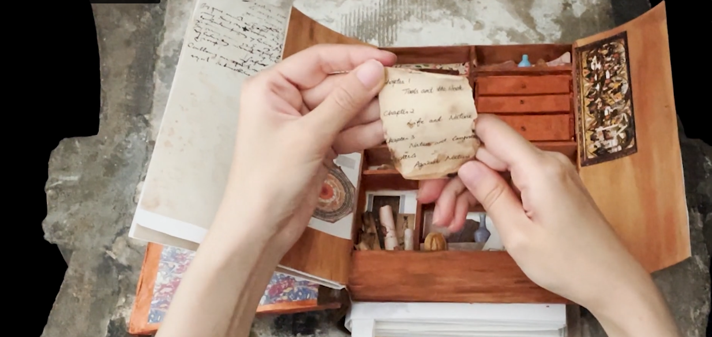

# Making and Knowing Pop-up Book

>Luxi Yang and Jianing Wei 
Spring 2022 
HIST GU4962: Making and Knowing in Early Modern Europe: Hands-On History 

\<iframe src="https://player.vimeo.com/video/710444936?h=b9508dad89"
width="640" height="564" frameborder="0" allow="autoplay; fullscreen"
allowfullscreen>\</iframe>

[A Visual Presentation of the Pop-up Book \[PDF\]](sp22_wei+yang_jianing+luxi_popup-presentation.pdf)

## Behind the scenes

This final project for the course "Making and Knowing in Early Modern
Europe: Hands-On History" at Columbia University was created by Luxi
Yang and Jianing Wei.

This pop-up book contains both a selection of entries from Ms. Fr. 640
and a miniaturized *Kunstkammer*. Its four chapters: "Tools and the
Book," "Life and Nature," "Nature and Imagination," and "Against
Nature," emphasize the first-person and experimental nature of Ms. Fr.
640. The book as a whole reveals how Naturalia (natural things),
Artificialia (artifacts - human-made things), and Scientifica
(measuring/mathematical objects) were brought together in Renaissance
France to form intriguing collections.

### Kunstkammer

*Kunstkammer* is German for “Chamber of Art.” Since the medieval period,
wealthy Europeans collected objects that combined natural materials and
artistic virtuosity, as well as monstrous, unique, and exotic objects.
The building of a *Kunstkammer* is more than a collecting activity: it
functions as a symbol of social rank and is a manifestation of the
thirst for practical knowledge.

### Making and Knowing Project

[The Making and Knowing Project](https://www.makingandknowing.org/)
is a research and pedagogical initiative in the [Center for Science and
Society](http://scienceandsociety.columbia.edu/) at Columbia University
that explores the intersections between artistic making and scientific
knowing.

From 2014 through 2020, the Project’s focus was the creation of a
digital critical edition of an intriguing anonymous sixteenth-century
French artisanal and technical manuscript, [BnF Ms. Fr. 640](http://gallica.bnf.fr/ark:/12148/btv1b10500001g.r=fr.%20640?rk=150215;2).

### BnF Ms. Fr. 640

Ms. Fr. 640 is a unique manuscript composed in 1580s Toulouse, France.
It offers first-hand insight into making and materials from a time when
artists were scientists.

Differing from other recipe books or how-to manuals from the same time,
BnF Ms. Fr. 640 reveals the writer’s own experiences, and contains
extensive observations of animal behavior and sketched illustrations of
technical points.

## Pop-up Book and Collection of Miniatures: Table of Contents

Below is the table of contents for the pop-up book, with links to the
folios represented from the Edition of BnF Ms .Fr. 640. Because of the
form of our final project, the way these contents are displayed will be
different from the “step-by-step” instructions found in Fr. 640. Also,
since our book is 3D and the [Visual Presentation of the Pop-up Book \[PDF\]](sp22_wei+yang_jianing+luxi_popup-presentation.pdf) is “flat,” we spend more than one page in the Presentation
showing the pages “before and after” they have “popped up” or interacted
with.

### Chapter 1. Tools and the Book

-   Before the book

-   Kunstkammer

-   [How to make Ms. Fr. 640](https://edition640.makingandknowing.org/#/essays/ann_328_ie_19)

-   [How to make a paintbrush](https://edition640.makingandknowing.org/#/folios/58v/f/58v/tl)

### Chapter 2. Life and Nature

-   [Fountain](https://edition640.makingandknowing.org/#/folios/80r/f/80r/tl)

-   [Hourglass](https://edition640.makingandknowing.org/#/folios/10r/f/10r/tl)

-   [Clock](https://edition640.makingandknowing.org/#/folios/82r/f/82r/tl)

### Chapter 3. Nature and Imagination

-   [Animal Dried in an Oven](https://edition640.makingandknowing.org/#/essays/ann_502_ad_20)

-   [Flower](https://edition640.makingandknowing.org/#/folios/120v/f/120v/tl)

-   [<u>Casting in Sulfur](https://edition640.makingandknowing.org/#/essays/ann_007_fa_14)

-   [Jasper](https://edition640.makingandknowing.org/#/essays/ann_045_fa_16)

### Chapter 4. Against Nature

-   [Alchemy](https://edition640.makingandknowing.org/#/folios/80r/f/80r/tl)
