# Dyeing Textiles with Cochineal

## Lab Guide for Instructors

> Reece Brown 
> Spring 2023 
> HIST GU4962: Making and Knowing in Early Modern Europe: Hands-On History 

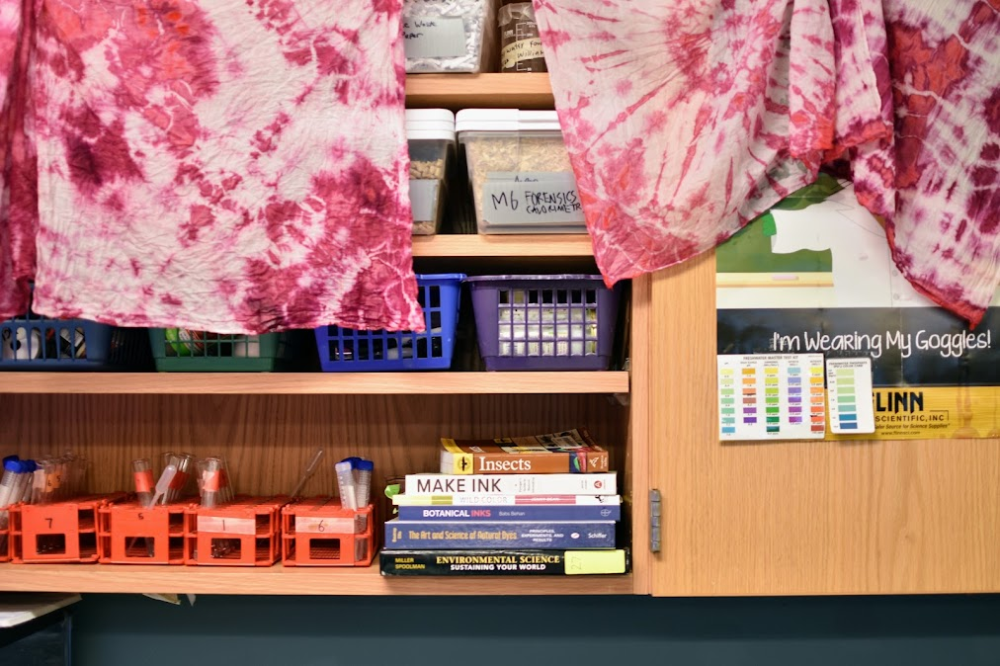

## Plant Based Dyes: The Chemistry of Cochineal

This workshop was created to teach the process of dyeing to a group of
high school students in an environmental science class. This workshop
promotes hands-on artisanal production and helps students see the
various effects and uses of natural materials, showing how the different
stages in the process bring about different forms of the material.

Students explore the substance cochineal from three different
perspectives: biology, chemistry, and history. This outline begins by
discussing the life cycle and habitat of the cochineal insect, then
pivots to focus on the chemical compound for which it is known, i.e.,
carminic acid. The lesson follows the transformation of materials during
the process of dyeing, turning cochineal from a natural substance to a
material useful to humans, and finally to a product. Every step in the
recipe will be contextualized briefly prior to the hands-on endeavor,
then conversed about as we wait for the materials to heat to the proper
temperature. This outline lets the experience of the process and
material come first, then provides more abstract information once
students have oriented themselves in the process. The lesson also
provides productive instruction time during periods of waiting that
occur throughout the process of dyeing.

Images appear throughout this lesson plan. These can be printed out or
projected as visual teaching aids. Similarly, some longer quotes appear,
especially during the history section. These are not necessary to be
read in full to the classroom, but rather summarized in such a way that
they are made accessible to high school aged audiences to introduce them
to scholarly analysis of global commodities and their exchanges.

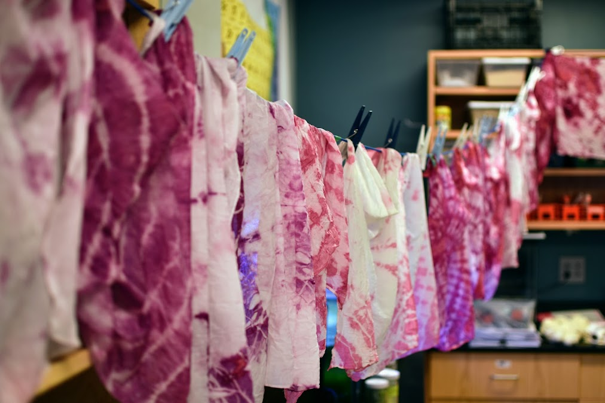

## Lesson Outline:

-   Overview of Natural Dyes

    -   Mordant process

-   Cochineal Biology

    -   Crush cochineal, watch it metamorphose from an insect into a
        > dyestuff

    -   Discussion of life cycle/metamorphosis

    -   Emphasis on environment

-   Chemistry

    -   pH activity with wool yarn

-   History and trade of cochineal

    -   Discussion about sustainability

    -   Keeping historic processes alive

## Dyeing Textiles with Cochineal

Adapted from The Making and Knowing Project, based on Chapter 5,
“Recipes,” of Jo Kirby et al., *Natural Colorants for Dyeing and Lake
Pigments: Practical Recipes and their Historical Sources* (Archetype,
London, 2014). Students should receive a printed recipe to follow along
with the process.

### MATERIALS 

-   Dyestuffs (cochineal)

-   Mortar and pestle

-   Drawstring bag (or coffee filter secured with rubber bands)

-   Water

-   Textiles (cotton bandanas)

-   Rubber bands, for tie-dye patterns

-   Thermometer

-   Stirring stick

-   Plate

-   Strainer

#### Ratios of Materials

Textile : mordant (alum) : water

1.00g : 0.20g : 50.00 g

Textile : cochineal : water

1.00g : 1.25g : 62.50g

### PROCEDURE 

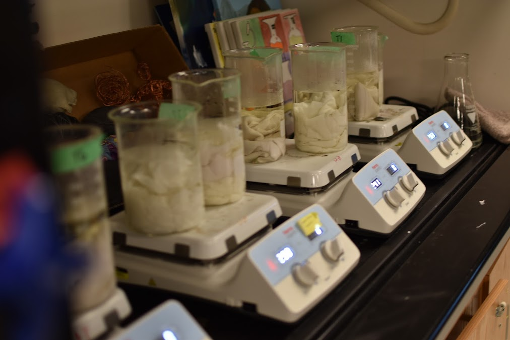

#### Mordant bath

-   Measure out water into pot

-   Add alum and stir

-   Place beaker onto hot plate and turn on to medium-low

-   Stir to dissolve alum in the water

-   Pre-wet textiles with water and wring them out to remove water

-   Add textiles when alum solution reaches 70º C

-   Heat the textiles for 30 minutes at 80-90º C, stirring occasionally
    > to ensure homogenous absorption

-   Remove textiles, rinsing them thoroughly in cold water

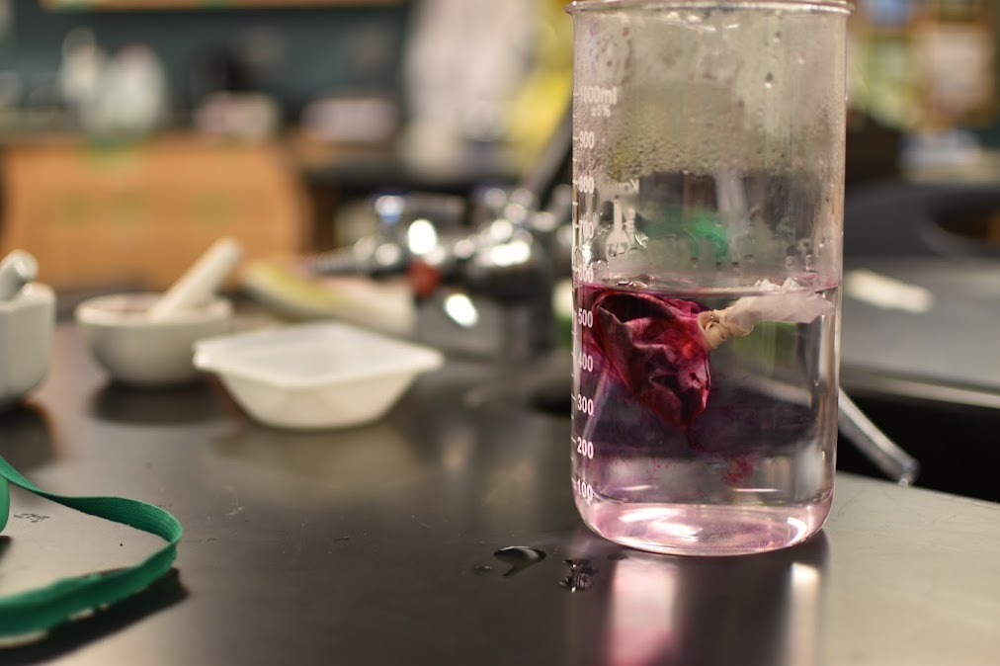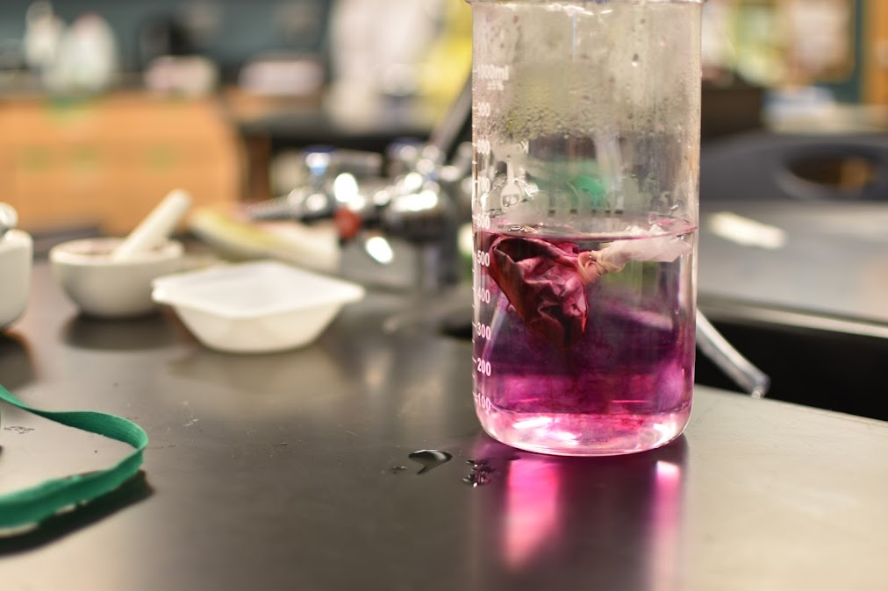

#### Extract Dye From Cochineal

-   Using mortar and pestle, crush dyestuffs to a fine powder or into small pieces

-   Measure out water and pour into pot

-   Add dyestuffs to drawstring bag, close tightly, add bag to water

-   If using the optional additive potash, measure out and add to solution

-   Place pot on stove, at medium-low

-   Heat the bath (without the textiles) at 80-90 °C for 30 minutes, stirring occasionally

-   After 30 minutes, remove dyestuffs in drawstring bag

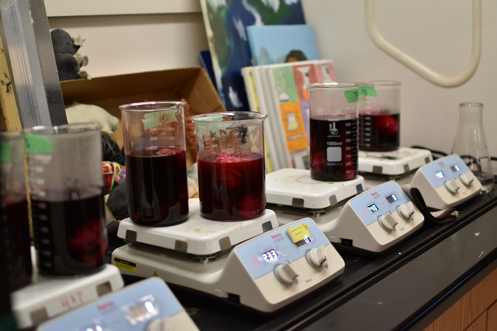

#### Dye Textiles

-   Add textiles to the dye bath (it is usually best to pre-wet textiles with water before adding)

-   Heat textiles at 80-90 °C for 30 min, stirring occasionally to ensure homogeneous dyeing

-   After 30 minutes, remove the textiles from the bath using the strainer

-   Being careful not to damage or felt the textile, wash textiles with clean water to remove any dye that has not bound to them

-   When the water runs clear over the textiles and no color comes off the textiles, wring out excess water

-   Lay out the textiles to dry

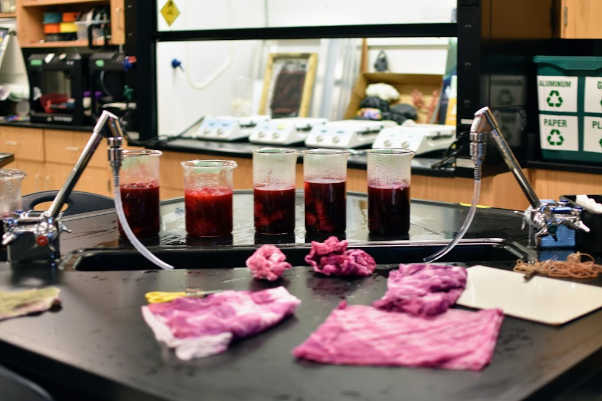

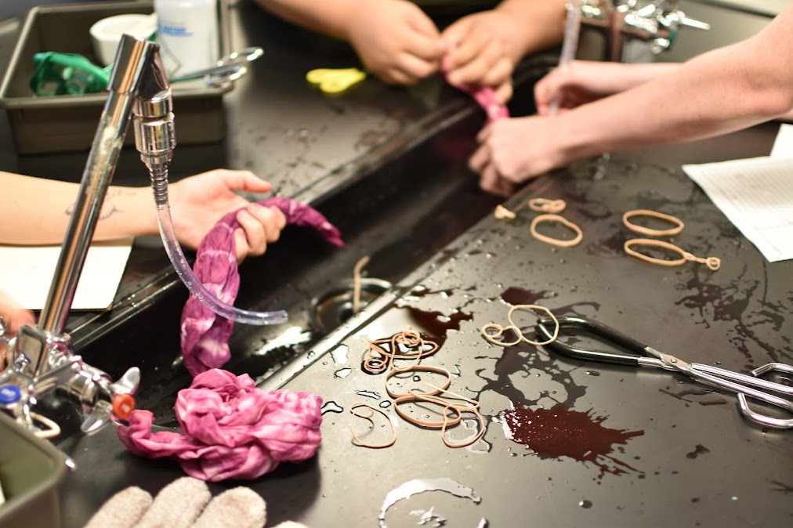

## NATURAL DYES 

Natural dyes are sourced from the environment. They can be made from organic materials like plants, or from inorganic materials such as minerals and clays. Today, we will use cochineal, which is a mordant dye: these require an additional substance to bind the pigment to the textile.

### Discussion questions

> *Look around and observe a piece of clothing. Do you know how it got its color?*

*What does it mean for something to be “natural”? Artificial? Are these antonyms or opposites?*

*Do the two exist within a strict dichotomy or on a spectrum?*

Beginning in the nineteenth century, most textiles have been dyed with
synthetic dyes. These create adverse environmental and human health
conditions, especially in the countries that host manufacturing
facilities.

> “Cochineal is being used as a natural substitute “for 'red 2' or
'amaranth' (E123), the 'carmiosina' or 'azorubina' (E122) and 'cochineal
red' or 'ponceau 4R' (E124). Amongst other things, the use of these
\[synthetic\] colorants raised issues of safety, so much so that their
use was forbidden by the Food and Drug Administration (FDA) in
1976.”[^1]

Natural dyes, like cochineal, require organic fabrics: laboratory-made
fabrics will not absorb the pigments properly because they are polymers,
or plastic. In contrast, natural materials absorb into these fabrics
better. We will use three types of fabric in this workshop, silk, wool,
and cotton.

There are four major types of macromolecules. We are working with two
today: proteins and carbohydrates.

Proteins are made up of amino acids, small building blocks of life.
These are central to the way life is built. Two of our fabrics are
proteins from animals. The first is silk, which is made from cocoons
made by worm larvae. The second is wool spun into yarn, which we will
use to compare the color of different solutions.

The carbohydrate we will be using comes from a cotton plant. We are
using cotton and canvas, the latter which is sewn to be a stronger
material. Both have cellulose. Cellulose is a polysaccharide, or a long
string of glucose, a monosaccharide sugar molecule that builds longer
chains.[^2] It comprises the fiber in fruits and vegetables, and makes
up much plant matter.

### What is a mordant?

Mordants are metals that connect the textile fiber and the dye; they
strengthen and prolong the colors, keeping them from fading in response
to harsh physical conditions. Many natural dyes require mordants. Today,
we will use alum, which has been used since ancient ages. Aluminum
potassium sulfate

## PROCEDURE: Make Mordant Bath[^3]

-   Measure out water into pot

-   Add alum and stir

-   Place beaker onto hot plate and turn on to medium-low

-   Stif to dissolve alum in the water

-   Pre-wet textiles with water and wring them out to remove water

-   Add textiles when alum solution reaches 70º C

-   Heat the textiles for 30 minutes at 80-90º C, stirring occasionally to ensure homogenous absorption

-   Remove textiles, rinsing them thoroughly

## AS A BUG: BIOLOGY

*Start by presenting students with a quantity of cochineal and
magnifying glasses. Have them look at the physical form, describe what
they see, and ask if they have any questions.*

Cochineal (*Dactylopius coccus*) is a species of bug native to parts of
Mexico and South America. It is a parasite that lives on the prickly
pear cactus, getting its nutrition from sugars inside the plant. It
relies on this species for its existence, demonstrating how
interconnected different organisms in the natural world can be. Once it
latches onto the cactus, it can no longer move.

Its life cycle is divided into three main stages: egg, nymph, and adult. “After hatching from an egg the female crawlers commonly walk upward on
plants where they become dispersed by the wind. Male crawlers tend to
remain on the plant where they hatched. Males commonly disperse when
they mature into winged adults.”[^4]

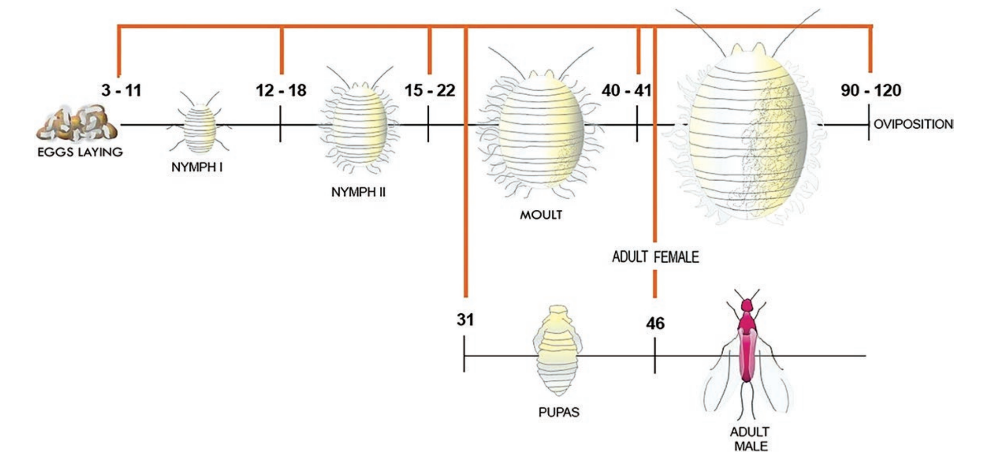

Life cycle stages of Cochineal. Image created by Francisco Javier
Roque-Rodríguez.[^5]

“Adult females live about 2 months during which each produces several
hundred eggs. Egg to reproductive adult development time is about 3
weeks when temperatures are warm.”[^6]

“The duration of the biological cycle of D. coccus depends on various
factors, such as latitude, altitude, climatic conditions (particularly
temperature, humidity and light), and on the vegetative state of the
host plant, especially for the quality and quantity of food.”[^7] Sex
Ratio depends on temperature outside.

### From resource to material: Discussion

*How does this life cycle compare to other insects you know about?*

*What is the importance of understanding where materials come from?*

*How are materials sourced? When does a resource become a material?*

### PROCEDURE: Crush and Boil Cochineal

Students crush pre-measured cochineal in mortar and pestles with a lab
partner, watching it become a bright powder!

-   Using mortar and pestle, crush dyestuffs to a fine powder or into small pieces

-   Measure out water and pour into pot

-   Add dyestuffs to drawstring bag, close tightly, add bag to water

-   If using the optional additive potash, measure out and add to solution

-   Place pot on stove, at medium-low

-   Heat the bath (without the textiles) at 80-90 °C for 30 minutes, stirring occasionally

-   After 30 minutes, remove dyestuffs in drawstring bag

## CARMINIC ACID: CHEMISTRY

Carminic acid (C22H20O13) is a compound
found inside these organisms. It is used to protect the cochineal from
other insects. Its chemical structure was not known until 1894 when
British dye chemist Henry Edward Schunk isolated it from the bug. [^8]

It is also used to color substances for biological research and
observation, including “cells, glycogen, muco-polysaccaride acid
(Mucicarmine), cell nuclei (Carmalum) and vegetable chromosomes
(Acetocarmin).”[^9]

### pH Exploration

Carminic acid is an indicator of pH in oxidation-reduction. pH is the
scale upon which substances are evaluated as either acids or bases. A pH
indicator is a substance, often a natural dye, that changes color as a
result of chemical dissociation. We will do experiments with carminic
acid from cochineal to see how other substances of a known pH change its
emergent properties.[^10]

### PROCEDURE: pH Manipulation[^11]

Materials

-   Lemon juice (acid)

-   Baking soda (base)

-   3 g Dyestuffs (Cochineal)

-   Water

-   Three 500 mL beakers

-   Pot

-   Wool yarn

-   Small clear cups

-   Pipettes

#### Process

-   Bring 1500 mL of water to 80-90º C on the stove.

-   Meanwhile, grind up 3g of cochineal.

-   When the water boils, mix in the powdered cochineal.

-   Remove from heat, then pour 500 mL into each beaker.

-   Add 3 tbsp of lemon juice to the first

-   Add 3 tbsp of baking soda to the second beaker

#### Dip Wool

-   Dip three pieces of yarn into one of the three solutions, comparing their colors.

#### Neutralize solutions

-   Have students take the alkaline and acidic solutions in small clear cups, carefully mixing the two together with pipettes to try and return it to its original color.

#### How did the colors change with an additive? 

-   Talk about electron transfer and color changing

*Were you able to restore the original color of the solution? What is a
neutralization?*

## HISTORY

The earliest use of cochineal can be seen in indigenous communities by
the second century BCE: the Mexicas and Aztecs made pigments and dyes
for important cultural practices, like clothing worn at religious
rituals.[^12]

When colonization began, the bug was shipped across the ocean to
European cities involved in the textile industry. Cultivation of the bug
still remained primarily in the Americas due to the environmental niche
that the species fulfilled there, and due to the economic concerns of
the Spanish monarchy, which maintained a monopoly over the global trade
of the insect.[^13] It became a prominent commodity in Europe due to its
vivid color, remaining very important until it was eclipsed by synthetic
dyes in the nineteenth century.[^14]

Indigenous farmers are deeply attuned to the climatic cycles and
environmental conditions that affect both the plant’s growth and the
bug’s survival.[^15] They collect the bugs from prickly pear cactus
using soft brushes, a labor intensive process that is still carried out
today.

José Antonio de Alzate y Ramírez, a Spanish priest during the colonial
period, published *Memoria sobre la naturaleza, cultivo y beneficio de
la grana (Treatise on the Nature, Cultivation and the Processing of
Cochineal)* in 1777. In this text, he cataloged how cochineal was
farmed, providing scientific drawings of the male and female bugs along
with pictures illustrating the process: some of these can be seen below,
sourced from Archivo General de la Nación de México.[^16]

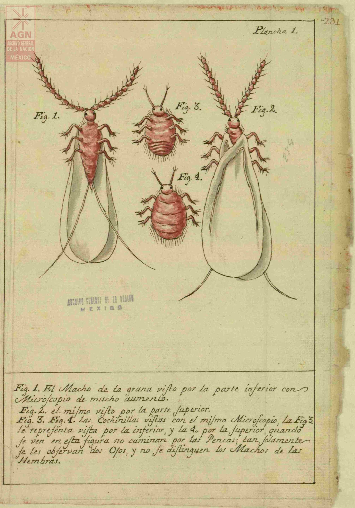

### Discussion about images

*What can you gleam from these pictures knowing what you do about the
bug’s life cycle?*

*This treatise was an extensive account of this process. What sort of
value do you think this text had for different people involved in the
trade of cochineal?*

*Are there ways aside from the written word through which knowledge can
be conveyed?*

-   Discuss traditional knowledge and oral transmission.

Miruna Achim, a historian, writes about the first full treatise on these
books: 
> “Against an abstract, Latinate system of universalisation, Alzate
upheld a Neoplatonic vision of natural history as the contingent coming
together, in dense and complex ways, of words and things**. In our
21st-century world, colour lacks history; we are mostly unaware of where
the colours we inhabit come from. Alzate’s *Memoria* invites us to
rethink perfect red as an assemblage of plants, insects, meteorological
conditions, qualities of soil and climates, and temperaments, of places
and of people.**”[^17]

*How can past ways of understanding the world enrich our current
perspective?*

Historian Edward Melillo writes: 
> “Following the metamorphoses of shellac, silk and cochineal from locally produced goods into commodities
circulating throughout the capitalist world system, this article offers
two conclusions. First, Europeans existed on the knowledge periphery of
insect commodity production, incredulous that indigenous know-how beyond
the boundaries of the Occident could be so central to global commerce.
Historians have cogently demonstrated the symbolic and economic
strengths that European empires acquired by dominating colonial
environments, but we are only just beginning to hear about the failures
of such projects.

> “Second, the long-term histories of shellac, silk and cochineal offer a
counter-narrative to conventional accounts of modernity. During the
nineteenth and twentieth centuries, industrial engineers chemically
synthetized and aggressively promoted surrogates for all three arthropod
secretions –– vinyl for shellac, nylon for silk and aniline dyes for
cochineal. Yet the recent re-emergence of shellac, silk and cochineal as
extensively traded global commodities demonstrates an enduring reliance
upon the secretions of domesticated insects. An awareness of the
persistence of seemingly pre-modern means of production exposes cracks
in the smooth edifice of technological modernity. The durability of such
processes destabilizes the high modernist assumption that human beings
are inexorably marching towards a 'synthetic planet' on which the
artificial will ultimately replace the natural.

> “The resurgence of these natural sources can be attributed to the “rise
of environmental toxicology. From the 1960s onwards, practitioners of
this newly constituted scientific discipline began to expose the
poisonous and carcinogenic effects of numerous synthetic chemicals
released into the environment by design — such as pesticides and food
additives — or by accident as industrial by-products. As a result,
consumer demand for alternatives has stimulated a resurgence of
organically produced ingredients through much of the world. In numerous
cases, manufacturers have abandoned synthetic substitutes in favour of
natural substances, such as shellac and cochineal.”[^18]

### The Life System Discussion about Interconnectedness

*How do you understand the ‘natural’ world?*

*What are the advantages of global trade? Disadvantages?*

*How might the environment shape these factors?*

*Where do human behaviors and creations exist within the realm of nature
and artifice?*

-   Discuss the conception of humans as “biocultural beings” [^19]

## REFLECTION

### Debrief and group discussion 

*What went differently than expected? How did you react to these
situations?*

*How does the setting of practice shape your process and attitude?*

*What is the value in persevering historical procedures?*

## MATERIALS

COTTON BANDANA ([<u>Balec Solid 100% Cotton Unisex Bandana, white, 12
pack</u>](https://www.amazon.com/Solid-100-Cotton-Unisex-Bandana/dp/B071VZV6CB/ref=asc_df_B071VZV6CB/?tag=hyprod-20&linkCode=df0&hvadid=312742504784&hvpos=&hvnetw=g&hvrand=4911526137365467502&hvpone=&hvptwo=&hvqmt=&hvdev=c&hvdvcmdl=&hvlocint=&hvlocphy=1019126&hvtargid=pla-569792806929&mcid=6504987c6c5e35fca84056f2626ca03d&gclid=CjwKCAiAsIGrBhAAEiwAEzMlC26o30d2pC7TIO0O8WOY5zfDxh9ciokzXev7eqrrDth_y9wi1SokqxoCGuEQAvD_BwE&th=1))

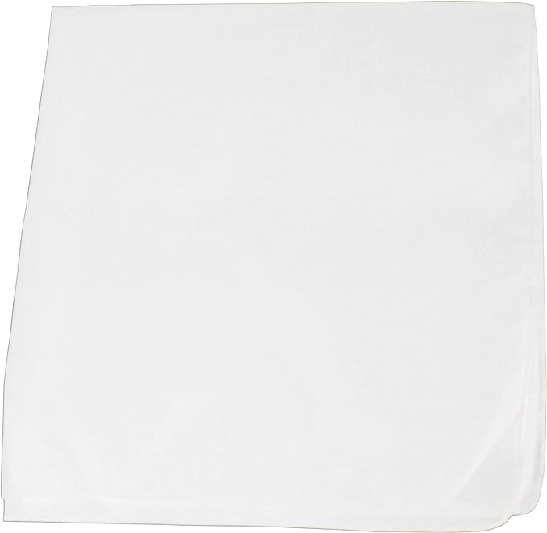

ALUM POWDER ([<u>Hoosier Hill Farm Alum Granulated Pickle
Powder</u>](https://www.amazon.com/Hoosier-Hill-Farm-Granulated-Pickle/dp/B00UVAG21A/ref=sr_1_4_sspa?keywords=alum&qid=1700821267&rdc=1&sr=8-4-spons&sp_csd=d2lkZ2V0TmFtZT1zcF9hdGY&psc=1))

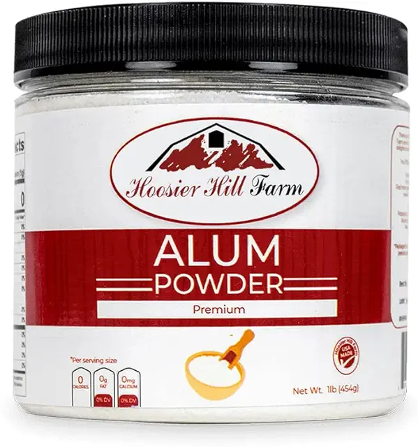

COCHINEAL([<u>Jacquard
Cochineal</u>](https://www.amazon.com/Jacquard-Products-Cochineal-Natural-1-Ounce/dp/B00GJRSDMK/ref=sr_1_1?ie=UTF8&qid=1526217175&sr=8-1&keywords=cochineal))

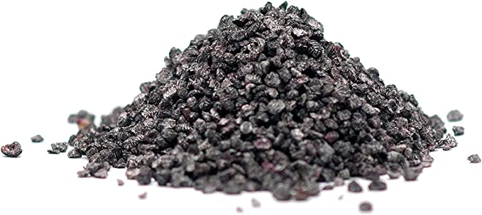

# Bibliography 

-   Achim, Miruna, “COCHINEAL.” In *New World Objects of Knowledge: A Cabinet of Curiosities*, edited by Mark Thurner and Juan Pimentel, 177–82. University of London Press, 2021. [http://www.jstor.org/stable/j.ctv1vbd275.29](http://www.jstor.org/stable/j.ctv1vbd275.29).

-   American Chemical Society, “Carminic Acid,” *Molecule of the Week Archive*, accessed 03 May 2023, [https://www.acs.org/molecule-of-the-week/archive/c/carminic-acid.html](https://www.acs.org/molecule-of-the-week/archive/c/carminic-acid.html).

-   Galappaththi, M., and Patabendige, N.. “Cochineal Chemistry, related Applications and Problems: A Mini Review.” (2021). [https://doi.org/10.20935/AL1792](https://doi.org/10.20935/AL1792).

-   Hsieh, Y. H. “Chemical Structure and Properties of Cotton.” In *Elsevier EBooks*, 3–34, (2007). [https://doi.org/10.1533/9781845692483.1.3](https://doi.org/10.1533/9781845692483.1.3).

-   Jaramillo, Veronica and Cheung, Kit. “Activity: Bugs to Dye For.” American Chemical Society. Accessed 05 May 2023, [https://www.acs.org/education/outreach/celebrating-chemistry-editions/2022-ccew/bugs-to-dye-for.html#:\~:text=Cochineal%20dye%20is%20great%20because,an%20example%20of%20an%20indicator](https://www.acs.org/education/outreach/celebrating-chemistry-editions/2022-ccew/bugs-to-dye-for.html#:~:text=Cochineal%20dye%20is%20great%20because,an%20example%20of%20an%20indicator).

-   Jesús Méndez-Gallegos, S. de, T. Panzavolta, and R. Tiberi. “Carmine Cochineal Dactylopius Coccus Costa (Rhynchota: Dactylopiidae): Significance, Production and Use.” *Advances in Horticultural
    > Science* 17, no. 3 (2003): 165–71. [<u>http://www.jstor.org/stable/42882246</u>](http://www.jstor.org/stable/42882246).

-   Knoxville Botanical Garden, “Herbal Bath Teas.” Accessed 10 May 2023, [<u>https://www.knoxgarden.org/events-all/herbal-bath-teas</u>](https://www.knoxgarden.org/events-all/herbal-bath-teas).

-   Knoxville Botanical Garden, “History of Black Soapmaking.” Accessed 10 May 2023, [<u>https://www.knoxgarden.org/events-all/history-of-black-soapmaking</u>](https://www.knoxgarden.org/events-all/history-of-black-soapmaking).

-   “Memoria Sobre La Naturaleza, Cultivo y Beneficio de La Grana; Un Documento Del Fondo Correspondencia de Virreyes.” *Archivo General de la Nación*. Accessed May 5, 2023. [<u>https://www.gob.mx/agn/articulos/memoria-sobre-la-naturaleza-cultivo-y-beneficio-de-la-grana-un-documento-del-fondo-correspondencia-de-virreyes?idiom=es</u>](https://www.gob.mx/agn/articulos/memoria-sobre-la-naturaleza-cultivo-y-beneficio-de-la-grana-un-documento-del-fondo-correspondencia-de-virreyes?idiom=es).

-   Phipps, Elena. “Cochineal Red: The Art History of a Color.” *The Metropolitan Museum of Art Bulletin* 67, no. 3 (2010): 4–48. [<u>http://www.jstor.org/stable/25701595</u>](http://www.jstor.org/stable/25701595).

-   Roque-Rodríguez FJ. “Controlled Mass Rearing of Cochineal Insect (Hemiptera: Dactylopiidae) Using Two Laboratory-Scale Production Systems in Peru.” *Journal of Insect Science*. (2022) [<u>https://doi.org/10.1093/jisesa/ieab098</u>](https://doi.org/10.1093/jisesa/ieab098).

-   UC IPM Natural Enemies Gallery. “Cochineal Scales of Prickly Pear Cacti.” Accessed 10 May 2023, [<u>https://ipm.ucanr.edu/natural-enemies/cochineal-scales-of-prickly-pear-cacti/#:\~:text=long%20tail%20filaments.-,Life%20Cycle,the%20plant%20where%20they%20hatched</u>](https://ipm.ucanr.edu/natural-enemies/cochineal-scales-of-prickly-pear-cacti/#:~:text=long%20tail%20filaments.-,Life%20Cycle,the%20plant%20where%20they%20hatched).

-   Yang, D., Jang, W.D., and Lee S.W. “Production of Carminic Acid by Metabolically Engineered Escherichia coli.” *Journal of the American Chemical Society* 143, no. 14 (2021): 5364-5377. [<u>https://doi.org/10.1021/jacs.0c12406</u>](https://doi.org/10.1021/jacs.0c12406).

### References for Discussion

-   ABBOTT, ANDREW P. “From Test Tube to Turner - the Role of the Chemist in Art.” *Science Progress (1933-)* 96, no. 4 (2013): 398–416. [<u>http://www.jstor.org/stable/43758976</u>](http://www.jstor.org/stable/43758976).

-   Baker, Tawrin, Sven Dupré, Sachiko Kusukawa, and Karin Leonhard. “Introduction: Early Modern Color Worlds.” *Early Science and Medicine* 20, no. 4/6 (2015): 289–307. [<u>http://www.jstor.org/stable/24760384</u>](http://www.jstor.org/stable/24760384).

-   Eiland, Murray Lee. “PROBLEMS ASSOCIATED WITH THE DISSEMINATION OF SYNTHETIC DYES IN THE ORIENTAL CARPET INDUSTRY.” *Icon* 5 (1999): 138–59. [<u>http://www.jstor.org/stable/23786082</u>](http://www.jstor.org/stable/23786082).

-   Golding, E. (2016). A History of Technology and Environment: From stone tools to ecological crisis (1st ed.). Routledge. [<u>https://doi.org/10.4324/9781315542959</u>](https://doi.org/10.4324/9781315542959).

-   Homburg, Ernst. “The Emergence of Research Laboratories in the Dyestuffs Industry, 1870-1900.” *The British Journal for the History of Science* 25, no. 1 (1992): 91–111. [<u>http://www.jstor.org/stable/4027006</u>](http://www.jstor.org/stable/4027006).

-   Mellor, C.M., and Cardwell, D. S. L.. “Dyes and Dyeing 1775-1860.” *The British Journal for the History of Science* 1, no. 3 (193): 265–79. [<u>http://www.jstor.org/stable/4024924</u>](http://www.jstor.org/stable/4024924).

-   Milanaccio, Alfredo. “Teaching Nature, to Learn from Nature.” *Politics and the Life Sciences* 5, no. 1 (1986): 83–91. [<u>http://www.jstor.org/stable/4235486</u>](http://www.jstor.org/stable/4235486).

-   Murmann, J., Homburg, E. Comparing evolutionary dynamics across different national settings: the case of the synthetic dye industry, 1857–1914. *J Evol Econ* 11, 177–205 (2001). [<u>https://doi.org/10.1007/PL00003863</u>](https://doi.org/10.1007/PL00003863).

-   Pfaff, Gerhard. 2017. *Inorganic Pigments.* De Gruyter Textbook. Berlin: De Gruyter. [<u>https://search.ebscohost.com/login.aspx?direct=true&AuthType=ip&db=nlebk&AN=1595366&site=ehost-live&scope=site</u>](https://search.ebscohost.com/login.aspx?direct=true&AuthType=ip&db=nlebk&AN=1595366&site=ehost-live&scope=site).

-   Yusuf, M., Shabbir, M. & Mohammad, F. Natural Colorants: Historical, Processing and Sustainable Prospects. *Nat. Prod. Bioprospect.* 7, 123–145 (2017). [<u>https://doi.org/10.1007/s13659-017-0119-9</u>](https://doi.org/10.1007/s13659-017-0119-9).

[^1]: Jesús Méndez-Gallegos, S. de, T. Panzavolta, and R. Tiberi. “Carmine Cochineal Dactylopius Coccus Costa (Rhynchota: Dactylopiidae): Significance, Production and Use,” *Advances in Horticultural Science* 17, no. 3 (2003): 165–71, [<u>http://www.jstor.org/stable/42882246</u>](http://www.jstor.org/stable/42882246), 167.

[^2]: Y.H. Hsieh, “Chemical Structure and Properties of Cotton,” in *Elsevier EBooks*, 3–34, (2007): [https://doi.org/10.1533/9781845692483.1.3](https://doi.org/10.1533/9781845692483.1.3).

[^3]: Adapted from “Dyeing Textiles with Cochineal: A Historical Reconstruction” in *The Sandbox*, [<u>https://cu-mkp.github.io/sandbox/docs/dyes-cochineal_assignment.html</u>](https://cu-mkp.github.io/sandbox/docs/dyes-cochineal_assignment.html).

[^4]: UC IPM Natural Enemies Gallery, “Cochineal Scales of Prickly Pear Cacti,” accessed 13 May 2023, [<u>https://ipm.ucanr.edu/natural-enemies/cochineal-scales-of-prickly-pear-cacti/#:\~:text=long%20tail%20filaments.-,Life%20Cycle,the%20plant%20where%20they%20hatched</u>](https://ipm.ucanr.edu/natural-enemies/cochineal-scales-of-prickly-pear-cacti/#:~:text=long%20tail%20filaments.-,Life%20Cycle,the%20plant%20where%20they%20hatched).

[^5]: Roque-Rodríguez FJ “Controlled Mass Rearing of Cochineal Insect (Hemiptera: Dactylopiidae) Using Two Laboratory-Scale Production Systems in Peru,” *Journal of Insect Science,* (2022). [<u>https://doi.org/10.1093/jisesa/ieab098</u>](https://doi.org/10.1093/jisesa/ieab098).

[^6]: Jesús Méndez-Gallegos, S. de, T. Panzavolta, and R. Tiberi. “Carmine Cochineal Dactylopius Coccus Costa (Rhynchota: Dactylopiidae): Significance, Production and Use,” *Advances in Horticultural Science* 17, no. 3 (2003): 165–71. [<u>http://www.jstor.org/stable/42882246</u>](http://www.jstor.org/stable/42882246), 168.

[^7]: Ibid.

[^8]: American Chemical Society, “Carminic Acid,” *Molecule of the Week Archive*, accessed 03 May 2023, [<u>https://www.acs.org/molecule-of-the-week/archive/c/carminic-acid.html</u>](https://www.acs.org/molecule-of-the-week/archive/c/carminic-acid.html).

[^9]: Jesús Méndez-Gallegos, S. de, T. Panzavolta, and R. Tiberi. “Carmine Cochineal Dactylopius Coccus Costa (Rhynchota: Dactylopiidae): Significance, Production and Use,” *Advances in Horticultural Science* 17, no. 3 (2003): 165–71. [<u>http://www.jstor.org/stable/42882246</u>](http://www.jstor.org/stable/42882246), 170.

[^10]: Galappaththi, Mahesh & Patabendige, Nimesha, “Cochineal Chemistry, related Applications and Problems: A Mini Review,” (2021), [<u>https://doi.org/10.20935/AL1792</u>](https://doi.org/10.20935/AL1792).

[^11]: Inspired by Jaramillo, Veronica and Cheung, Kit, “Activity: Bugs to Dye For,” *American Chemical Society*, accessed 01 May 2023, [<u>https://www.acs.org/education/outreach/celebrating-chemistry-editions/2022-ccew/bugs-to-dye-for.html#:\~:text=Cochineal%20dye%20is%20great%20because,an%20example%20of%20an%20indicator</u>](https://www.acs.org/education/outreach/celebrating-chemistry-editions/2022-ccew/bugs-to-dye-for.html#:~:text=Cochineal%20dye%20is%20great%20because,an%20example%20of%20an%20indicator).

[^12]: Phipps, Elena. “Cochineal Red: The Art History of a Color.” *The Metropolitan Museum of Art Bulletin* 67, no. 3 (2010): 4–48. [<u>http://www.jstor.org/stable/25701595</u>](http://www.jstor.org/stable/25701595), 24.

[^13]: Jesús Méndez-Gallegos, S. de, T. Panzavolta, and R. Tiberi. “Carmine Cochineal Dactylopius Coccus Costa (Rhynchota: Dactylopiidae): Significance, Production and Use,” *Advances in Horticultural Science* 17, no. 3 (2003): 165–71. [<u>http://www.jstor.org/stable/42882246</u>](http://www.jstor.org/stable/42882246), 166.

[^14]: C. M. Mellor, and D. S. L. Cardwell. “Dyes and Dyeing 1775-1860.” *The British Journal for the History of Science* 1, no. 3 (193): 265–79. [<u>http://www.jstor.org/stable/4024924</u>](http://www.jstor.org/stable/4024924).

[^15]: Miruna Achim, “COCHINEAL.” In *New World Objects of Knowledge: A Cabinet of Curiosities*, edited by Mark Thurner and Juan Pimentel, 177–82 (University of London Press: 2021), [<u>http://www.jstor.org/stable/j.ctv1vbd275.29</u>](http://www.jstor.org/stable/j.ctv1vbd275.29).

[^16]: “Memoria Sobre La Naturaleza, Cultivo y Beneficio de La Grana; Un Documento Del Fondo Correspondencia de Virreyes,” *Archivo General de la Nación*, accessed May 5, 2023. [<u>https://www.gob.mx/agn/articulos/memoria-sobre-la-naturaleza-cultivo-y-beneficio-de-la-grana-un-documento-del-fondo-correspondencia-de-virreyes?idiom=es</u>](https://www.gob.mx/agn/articulos/memoria-sobre-la-naturaleza-cultivo-y-beneficio-de-la-grana-un-documento-del-fondo-correspondencia-de-virreyes?idiom=es).

[^17]: Miruna Achim, “COCHINEAL.” In *New World Objects of Knowledge: A Cabinet of Curiosities*, edited by Mark Thurner and Juan Pimentel, 177–82 (University of London Press: 2021), [<u>http://www.jstor.org/stable/j.ctv1vbd275.29</u>](http://www.jstor.org/stable/j.ctv1vbd275.29).

[^18]: Edward Melillo, “GLOBAL ENTOMOLOGIES: INSECTS, EMPIRES, AND THE ‘SYNTHETIC AGE’ IN WORLD HISTORY,” Past & Present, no. 223 (2014): 233–70, [<u>http://www.jstor.org/stable/24545157</u>](http://www.jstor.org/stable/24545157).

[^19]: Milanaccio, Alfredo. “Teaching Nature, to Learn from Nature.” *Politics and the Life Sciences* 5, no. 1 (1986): 83–91. [<u>http://www.jstor.org/stable/4235486</u>](http://www.jstor.org/stable/4235486).