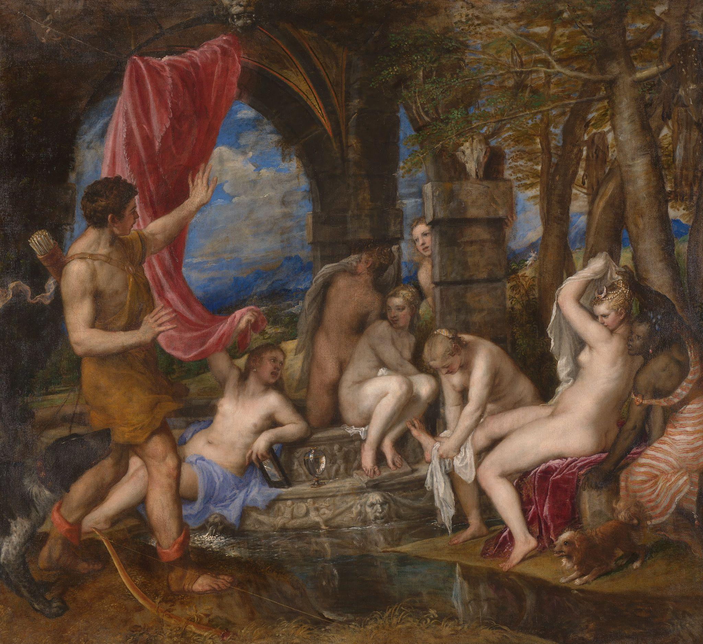

# “Flesh Color” and Race Making in Early Modern Painters’ Manuals

> Ruilin Fan 
> Spring 2023 
> HIST GU4962: Making and Knowing in Early Modern Europe: Hands-On History 

BnF Ms. Fr. 640 contains a number of recipes for making pigments and
paints. Among them, the author-practitioner is especially interested in
“flesh color (*carnation*),” providing 18 entries that mention this
category of colors. It is evident from the diverse instructions
contained in these recipes that flesh color is not a singular skin tone
but refers to a range of colors that may represent various human
complexions. This essay is concerned with the ways in which the concept
of “flesh color” engaged with the understandings of race and ethnicity
in the author-practitioner’s early modern Toulouse, at a time when
European colonial enterprises continued to expand in the Atlantic world.

Dark skinned Afro-diasporic people, both enslaved and free, lived in
early modern France. Theater scholar Noémie Ndiaye, who studies the
portrayal of people of African ancestry in early modern European drama,
notes that historians tend to begin their narrative in the late
seventeenth century when studying the history of race in France, because
“hard” archival evidence became available only in 1685, when the French
state began to systematically implement social control over people of
African descent. The lack of official data, however, does not imply that
an African diaspora did not exist before this date.[^1] Scholars such as
Imitiaz Habib have done tremendous work to comb through the English
archives and unearth traces of Black life on the British isles.[^2]
Though no comparable work has been done on materials in French, France,
like England, also maintained connections with Spain and Portugal, two
early slave-trading nations that cemented the practice of race-based
slavery in the Atlantic world.[^3] The city of the author-practitioner’s
residence, Toulouse, had a particularly strong tie with the Iberian
peninsula, given its access to river systems that allowed entry into the
Atlantic.[^4] Spanish merchants living in Toulouse traded in fibers,
dyes, and spices.[^5] Insofar as Iberian expatriates brought enslaved
servants to England and to the low countries–other European nations that
had no legal sanction for slavery on paper[^6]--it is conceivable that
Spanish merchants in Toulouse did the same. Early modern Toulouse was
almost certainly home to Afro-diasporic communities.

## Making race

Critical race theorists have demonstrated that cultural productions,
including the fine arts, shape racial ideologies. The concept of race is
malleable and can be molded into new shapes by contemporary political
and economic contexts in service of power. As Ndiaye has written,
“racial paradigms are … perpetually ready for reactivity as needed,
simultaneously past, present, and future.”[^7] While the concept of race
denoted rank, blood, and religion in earlier periods, the sixteenth and
seventeenth century saw the solidification of phenotypic traits, such as
dark skin, as the primary marker of difference. We find evidence of this
evolution in art. Art historian Joaneath Spicer provides a general
timeline for the depiction of Africans in European art in early
modernity. European artists in the 1500s produced a number of realistic,
sympathetic, and humanistic depictions of African subjects, but in the
1600s dark skinned figures were increasingly portrayed as savage,
servile, and objectified, in tandem with the growth of the slave
trade.[^8] Literary scholar Kim F. Hall observes that the “‘black skin’
of both male and female attendants” in the fine arts became “a key
signifier… associated with wealth and luxury” in the seventeenth
century.[^9] Earlier images of African kings, diplomats, and religious
figures thus gave way to objectifying representations of Black African
servants, likened to other exotic commodities obtained through overseas
ventures. The fine arts actively contributed to the development of
color-based racial prejudice in early modernity.

Artists’ manuals contemporary to BnF Ms. Fr. 640 provide additional
context for understanding the ways in which early modern Europeans
attached significance to human skin color. According to these texts,
various factors can affect how a painter chooses to depict skin: the
subject’s gender, age, and class; whether the person is healthy, ill, or
dead; the light conditions in which the painter worked, etc.[^10] As
Cleo Nisse notes, the author-practitioner took special care to record
different instructions for depicting the shadow on the skin of male and
female subjects.[^11] This is in line with other treatises of the
period. Italian painter Cennino Cennini (c.1370-before 1427) wrote in
*The Craftsman’s Handbook* that “the handsome man must be swarthy, and
the woman fair.”[^12] Furthermore, Cennini recommends using the egg of
“country or farm hens … for tempering flesh colors of aged and swarthy
persons,” because their yolks are redder than “town hen’s
egg\[s\].”[^13] A later Italian painter, Gian Paolo Lomazzo (1538-1592),
similarly wrote in his *Trattato dell'arte della pittura, scoltura et
architettura* (1584) that “colors which tend toward darkness and without
bright vivacity” are suitable for “the old, philosophers, the poor,
melancholics, and those who are serious.”[^14] Finally, Ann-Sophie
Lehmann’s extensive research demonstrates that German and Dutch sources
also display similar concerns about differentiating skin colors on the
basis of the subject’s gender, age, and social station.[^15] Evidently,
art writing throughout Western Europe largely agreed on the criteria an
artist should consider when preparing the hue for a human figure’s flesh
color.

In what ways do these flesh color recipes provide a snapshot of the
race-making work accomplished by painters in early modern Europe? Why
did the author-practitioner, Cennino Cennini and others neglect to cite
geographic origin and ancestry as categories of consideration for
preparing appropriate flesh colors? Two distinct possibilities emerge.
First, the authors may have seen people of African descent as on the
margins of or even outside of the realm of humanity, and the methods for
portraying their skin tones, therefore, cannot be generalized under the
umbrella term “flesh color.” On several occasions, Cennino Cennini
excludes certain classes of people from his instructions on depicting
human figures because one can “never discover any system of proportion”
among the marginalized classes.[^16] He refuses to give instructions on
the proportion of women, since he believes that they, unlike men, have
no “set proportion.”[^17] In another section Cennini limits his
instructions on the hues of “flesh colors” to the portrayal of
“Christian\[s\], or of rational creatures.”[^18] Women, non-Christians,
and animals are alike marginalized in Cennini’s aesthetic paradigm,
though perhaps to different extents. That these categories of difference
are inconsistent at best attests to the elastic nature of racial
ideologies.

An additional possibility is that the connection between skin color,
ancestry, and the condition of enslavement was not yet firmly
established, though one can detect traces of this association in both
BnF Ms. Fr. 640 and Cennini’s *Handbook.* Darker skin color seems to be
correlated with physical labor and even enslavement. Cennini’s
instruction for using the yolk of a “country hen” to darken flesh colors
correlates “swarthy persons” with rusticity. Further, if
“non-Christians” cannot be depicted with “flesh colors,” differences in
religion were already being associated with differences in skin color in
Cennini’s milieu. This is congruent with the popular belief that
dark-skinned people were pagans or muslims, whom Christians can enslave
with no compunction. Perhaps contradictorily, dark skin can also denote
a lack of vitality and liveliness: the old, the melancholic, and the
overly cerebral are to be portrayed with more somber hues. Altogether,
darker flesh color evokes the lack of health, vitality, and social
privilege.

## Carnation, Liveliness, and Fairness

Fig. 1. Titian’s *Diana and Actaeon* (1556-1559). Oil on canvas, 184.5 x
202.2 cm. The National Gallery, London. [<u>https://jstor.org/stable/community.15656006</u>](https://jstor.org/stable/community.15656006).

Red pigments are essential when making the flesh color for beautiful and
youthful bodies. In both BnF Ms. Fr. 640 and Cennino Cennini’s
*Handbook,* red pigments are associated with liveliness. Cennini advises
against using “pink” for corpses, “because a dead person has no
color.”[^19] The author-practitioner of the manuscript writes in similar
terms: “To make a beautiful flesh color, the reddest & liveliest lake is
the best.”[^20] Using the conjunctive “and,” he juxtaposes and equates
“red\[ness\]” with “liveli\[ness\].” The author-practitioner further
reports that the red tint of “Florence lake” is so vital to making a
desirable flesh color that women would apply the same pigment as
cosmetics.[^21] One would perhaps put on the red hue after using another
recipe the author-practitioner records for “whitening the face,” which
calls for powdered puffball mushrooms.[^22] Both red and white played a
role in creating the desirable skin tone for white women. Investigating
cosmetic practices of early modern English theater, Sujata Iyengar has
argued that the creation of “blushface” through red paint was as
productive of racial ideologies as blackface, insofar as the former
accentuates the paleness of the wearer.[^23]

Because I have not found substantial conservation literature on the
composition of different shades of flesh colors, I can only provide
anecdotal evidence on the racial connotation of red pigments in early
modern painting. Titian’s *Diana and Actaeon* (1556-1559) is a
fascinating example for my purpose (Fig.1). Infrared imaging and
analysis of a paint cross section taken from the servant's shoulder
reveals that she was meant to be a white woman in the original
composition. Titan painted over the original figure, whose skin color is
nearly identical to that of Diana’s, with a darker shade. Conservators
surmise that the change may have been the result of “the sudden
availability of a model, allowing Titian to achieve a striking
chiaroscuro of flesh.[^24] The goddess’ flesh is achieved with “four
layers of varying shades of pink based on lead white, vermilion, red
lake, yellow earth, some black and in one later a little
ultramarine.”[^25] Contrasted against her pink skin tone, the servant is
painted with “lead white, yellow earth, black, umber, lead-tin yellow
and even a little blue pigment.”[^26] Unlike Diana, the skin color of
the servant contains no red tint made of vermillion or cochineal. I
postulate that the lack of red pigments not only make darker skin seem
less desirable according to contemporary beauty standards, but also
makes dark skinned figures appear inanimate and therefore further
objectified. But this theory cannot be confirmed until further evidence
can be found to support that the omission of red pigments is a
consistent practice for representing darker skin colors.

## Conclusion

Instructions for mixing flesh colors from early modern artists’ manuals
and paint recipe collections reveal that the fine arts contributed to
the shaping of racial ideology. While categories such as gender, class,
and religion dominated the earlier European understanding of difference,
inheritable phenotypic difference, especially skin color, became a
dominant marker in the sixteenth and seventeenth centuries. Although the
painters’ manuals studied for the current paper do not mention ancestry
and geographical origin as determinants of a subject’s appropriate flesh
color, they already display a tendency to exclude and marginalize
certain segments of the human population. Darker skin tones may be
associated with negative connotations, such as poverty and ill health.
Anecdotal evidence suggests that the absence of red pigment in dark
flesh colors may have served to portray African figures as inanimate and
object-like, but further research is needed to establish this theory.

## Bibliography

Bindman, David, Henry Louis Gates, and Karen C. C. Dalton, eds. *The > Image of the Black in Western Art*. Vol. 2. 5 vols. Cambridge, MA: Belknap Press of the Harvard University Press, 2010.

Blakely, Allison. *Blacks in the Dutch World: The Evolution of Racial Imagery in a Modern Society*. Bloomington: Indiana University Press, 1993.

Cennini, Cennino. *The Craftsman’s Handbook: The Italian “Il Libro Dell’arte.”* Translated by Daniel V. Thompson. New York: Dover Publications, 1960.

Debuiche, Colin, and Sarah Muñoz. “Ms. Fr. 640: The Toulouse Context.” Edited by Pamela H. Smith, Naomi Rosenkranz, Tianna Helena Uchacz, Tillmann Taape, Clément Godbarge, Sophie Pitman, Jenny Boulboullé, et al. Translated by Philippe Barré and Christine Julliot de la Morandière. *Secrets of Craft and Nature in Renaissance France. A Digital Critical Edition and English Translation of BnF Ms. Fr. 640*, 2020. [<u>https://edition640.makingandknowing.org/#/</u>](https://edition640.makingandknowing.org/#/).

Dunkerton, Jill, Marika Spring, Rachel Billinge, Helen Howard, Gabriella Macaro, Rachel Morrison, David Peggie, Ashok Roy, Lesley Stevenson, and Nelly Von Aderkas. “Titian’s Painting Technique from 1540.” *National Gallery Technical Bulletin* 36 (2015): 15–136.

Habib, Imtiaz. *Black Lives in the English Archives, 1500–1677: Imprints of the Invisible*. 1st ed. Burlington, VT: Routledge, 2008.

Hall, Kim F. *Things of Darkness: Economies of Race and Gender in Early Modern England*. Ithaca: Cornell University Press, 1995.

Iyengar, Sujata. “Blackface and Blushface.” In *Shades of Difference: Mythologies of Skin Color in Early Modern England*, 123–39. University of Pennsylvania Press, 2005. [<u>https://doi.org/10.9783/9780812202335</u>](https://doi.org/10.9783/9780812202335).

Kirby, Jo, Susie Nash, Joanna Cannon, and Barbara Hepburn Berrie, eds. *Trade in Artists’ Materials: Markets and Commerce in Europe to 1700*. London: Archetype Publications, 2010.

Kirby, Jo, and Marika Spring. “Ms. Fr. 640 in the World of Pigments in Sixteenth-Century Europe,” 2020. [<u>https://doi.org/10.7916/VSRT-8R31</u>](https://doi.org/10.7916/VSRT-8R31).

Langmuir, Erica. “Titian (Active About 1506; Died 1576) Diana and Actaeon, 1556-9 and Diana and Callisto.” In *The National Gallery Companion Guide*. The National Gallery, 2016. [<u>https://search.credoreference.com/content/entry/ngcg/titian_active_about_1506_died_1576_diana_and_actaeon_1556_9\_and_diana_and_callisto/0</u>](https://search.credoreference.com/content/entry/ngcg/titian_active_about_1506_died_1576_diana_and_actaeon_1556_9_and_diana_and_callisto/0).

Lehmann, Ann-Sophie. “Fleshing Out the Body: The ‘Colours of the Naked’ in Workshop Practice and Art Theory, 1400-1600.” *Nederlands Kunsthistorisch Jaarboek (NKJ) / Netherlands Yearbook for History of Art* 58 (2007): 86–109.

Lomazzo, Giovanni Paolo. *Trattato dell’arte della pittura, scoltura et architettura*. Milan: Paolo Gottardo Pontio, 1585. [<u>https://www.google.com/books/edition/Trattato_dell_arte_della_pittura_scoltur/woLXoLDqh1sC?hl=en&gbpv=0</u>](https://www.google.com/books/edition/Trattato_dell_arte_della_pittura_scoltur/woLXoLDqh1sC?hl=en&gbpv=0).

Ndiaye, Noémie. “Rewriting the Grand Siècle: Blackface in Early Modern France and the Historiography of Race.” *Literature Compass* 18, no. 10 (2020): e12603. [<u>https://doi.org/10.1111/lic3.12603</u>](https://doi.org/10.1111/lic3.12603).

 ———. *Scripts of Blackness: Early Modern Performance Culture and the Making of Race*. University of Pennsylvania Press, 2022. [<u>https://doi.org/10.9783/9781512822649</u>](https://doi.org/10.9783/9781512822649).

Nisse, Cleo. “Shadows Beneath the Skin: How to Paint Faces in Distemper.” Edited by Pamela H. Smith, Naomi Rosenkranz, Tillmann Taape, Clément Godbarge, Sophie Pitman, Jenny Boulboullé, Joel Klein, Donna Bilak, Marc Smith, and Terry Catapano. *Secrets of Craft and Nature in Renaissance France. A Digital Critical Edition and English Translation of BnF Ms. Fr. 640*, 2020. [<u>https://doi.org/10.7916/A6BS-0765</u>](https://doi.org/10.7916/A6BS-0765).

Poitevin, Kimberly. “Inventing Whiteness: Cosmetics, Race, and Women in Early Modern England.” *Journal for Early Modern Cultural Studies* 11, no. 1 (2011): 59–89.

Ridge, Jacqueline, and Marika Spring. “The Conservation History of Titian’s Diana and Actaeon and Diana and Callisto.” *The National Gallery Technical Bulletin* 36 (2016): 116–23.

Sammern, Romana. “Red, White and Black: Colors of Beauty, Tints of Health and Cosmetic Materials in Early Modern English Art Writing.” *Early Science and Medicine* 20, no. 4/6 (2015): 397–427.

Spicer, Joaneath A. “Introduction.” In *Revealing the African Presence in Renaissance Europe*, edited by Joaneath A. Spicer, Natalie Zemon Davis, K. J. P. Lowe, and Ben Vinson. Baltimore: Walters Art Museum, 2012. [<u>https://thewalters.org/wp-content/uploads/revealing-the-african-presence-in-renaissance-europe.pdf</u>](https://thewalters.org/wp-content/uploads/revealing-the-african-presence-in-renaissance-europe.pdf).

Spicer, Joaneath A., Natalie Zemon Davis, K. J. P. Lowe, Ben Vinson, Walters Art Museum (Baltimore, Md.), and Princeton University, eds. *Revealing the African Presence in Renaissance Europe*. Baltimore: Walters Art Museum, 2012.

Stoichita, Victor Ieronim. *Darker Shades: The Racial Other in Early Modern Art*. Translated by Samuel Trainor. London: Reaktion books, 2019.

Weststeijn, Thijs. “The Gender of Colors in Dutch Art Theory.” *Nederlands Kunsthistorisch Jaarboek (NKJ) / Netherlands Yearbook for History of Art* 62 (2012): 176–201.

[^1]: Noémie Ndiaye, “Rewriting the Grand Siècle: Blackface in Early Modern France and the Historiography of Race,” *Literature Compass* 18, no. 10 (2020): e12603, [<u>https://doi.org/10.1111/lic3.12603</u>](https://doi.org/10.1111/lic3.12603), 4.

[^2]: See Imtiaz Habib, *Black Lives in the English Archives, 1500–1677: Imprints of the Invisible,* 1st ed. (Burlington, VT: Routledge, 2008).

[^3]: Noémie Ndiaye, *Scripts of Blackness: Early Modern Performance Culture and the Making of Race* (University of Pennsylvania Press, 2022), [<u>https://doi.org/10.9783/9781512822649</u>](https://doi.org/10.9783/9781512822649), 13.

[^4]: Colin Debuiche and Sarah Muñoz, “Ms. Fr. 640: The Toulouse Context,” ed. Pamela H. Smith et al., trans. Philippe Barré and Christine Julliot de la Morandière, *Secrets of Craft and Nature in Renaissance France. A Digital Critical Edition and English Translation of BnF Ms. Fr. 640*, 2020, [<u>https://edition640.makingandknowing.org/#/</u>](https://edition640.makingandknowing.org/#/).

[^5]: Colin Debuiche and Sarah Muñoz, “Ms. Fr. 640: The Toulouse Context.”

[^6]: Noémie Ndiaye, “Rewriting the Grand Siècle: Blackface in Early Modern France and the Historiography of Race,” 12.

[^7]: Noémie Ndiaye, *Scripts of Blackness,* 7.

[^8]: Joaneath A. Spicer, “Introduction,” in *Revealing the African Presence in Renaissance Europe*, ed. Joaneath A. Spicer et al. (Baltimore: Walters Art Museum, 2012), [<u>https://thewalters.org/wp-content/uploads/revealing-the-african-presence-in-renaissance-europe.pdf</u>](https://thewalters.org/wp-content/uploads/revealing-the-african-presence-in-renaissance-europe.pdf).

[^9]: Kim F. Hall, *Things of Darkness: Economies of Race and Gender in Early Modern England* (Ithaca: Cornell University Press, 1995), 211.

[^10]: For the last of these considerations, see the entry “Painting from Nature” on 31v. The author-practitioner advises that “one ought not to undertake to work on it in overcast weather because you would make your flesh colors browner than one ought to.”

[^11]: Cleo Nisse, “Shadows Beneath the Skin: How to Paint Faces in Distemper,” ed. Pamela H. Smith et al., *Secrets of Craft and Nature in Renaissance France. A Digital Critical Edition and English Translation of BnF Ms. Fr. 640, 2020* [<u>https://doi.org/10.7916/A6BS-0765</u>](https://doi.org/10.7916/A6BS-0765).

[^12]: Cennino Cennini, *The Craftsman’s Handbook: The Italian “Il Libro Dell’arte,”* trans. Daniel V. Thompson (New York: Dover Publications, 1960), 49.

[^13]: Cennini, *The Craftsman’s Handbook,* 94. The author-practitioner of BnF Ms. Fr. 640, however, disputes this method for darkening flesh colors, calling it “trumpery” that “does not last.” See “Painter” on fol. 31v.

[^14]: Giovanni Paolo Lomazzo, *Trattato dell’arte della pittura, scoltura et architettura* (Milan: Paolo Gottardo Pontio, 1585), [<u>https://www.google.com/books/edition/Trattato_dell_arte_della_pittura_scoltur/woLXoLDqh1sC?hl=en&gbpv=0</u>](https://www.google.com/books/edition/Trattato_dell_arte_della_pittura_scoltur/woLXoLDqh1sC?hl=en&gbpv=0), 309. Original Italian: “colori che tendono allo scuro, & sono priui di quella viuacità chiara, si apparrengono à vecchi, filosofi, poueri, melancolici, & genti graui." I thank Matteo Alleman for the translation.

[^15]: Ann-Sophie Lehmann, “Fleshing Out the Body: The ‘Colours of the Naked’ in Workshop Practice and Art Theory, 1400-1600,” N*ederlands Kunsthistorisch Jaarboek (NKJ) / Netherlands Yearbook for History of Art 58* (2007), 90-92.

[^16]: Cennini, *The Craftsman's Handbook,* 49.

[^17]: Cennini, The Craftsman's Handbook, 48.

[^18]: Cennini, *The Craftsman's Handbook,* 95.

[^19]: Cennini, *The Craftsman's Handbook,* 95.

[^20]: “Painter,” fol. 58r.

[^21]: “Painter” on fol. 58r.

[^22]: “For whitening the face” on fol. 20v.

[^23]: See Sujata Iyengar, “Blackface and Blushface,” in *Shades of Difference: Mythologies of Skin Color in Early Modern England* (University of Pennsylvania Press, 2005), 123–39, [<u>https://doi.org/10.9783/9780812202335</u>](https://doi.org/10.9783/9780812202335).

[^24]: Jill Dunkerton and Marika Spring, “Titian’s Painting Technique from 1540,” *National Gallery Technical Bulletin* 36 (2015), 72.

[^25]: Dunkerton and Spring, “Titian’s Painting Technique from 1540,” 72.

[^26]: Dunkerton and Spring, “Titian’s Painting Technique from 1540,” 72.
