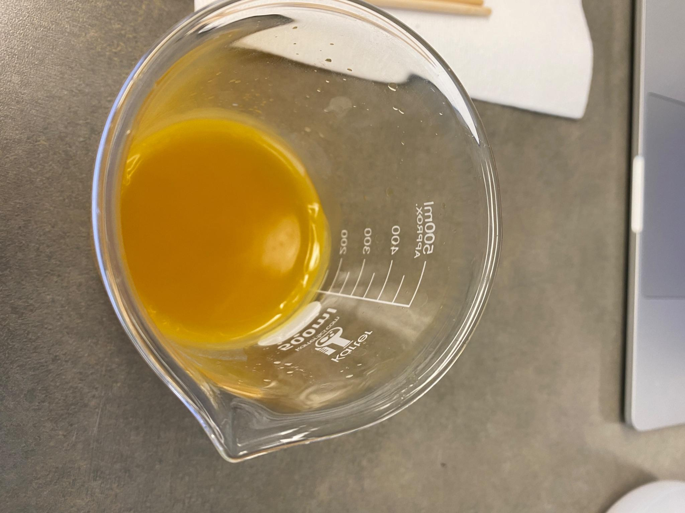
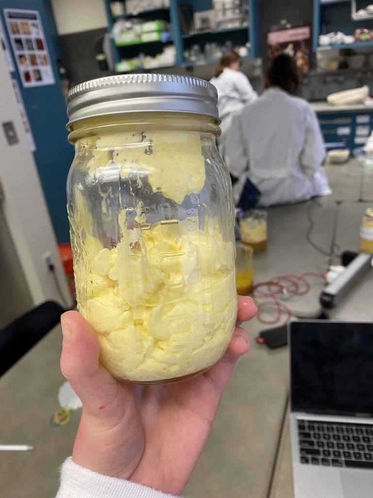

# Medieval Spirituality and Materiality in Ms. Fr. 640

> Avery Lambert 
> Spring 2023 
> HIST GU4962: Making and Knowing in Early Modern Europe: Hands-On History 

The author-practitioner of Ms. Fr. 640 compiled his recipe-book in a
period of great religious, political, and social turmoil. Southern
France in the late sixteenth-century was a hotbed of conflict amidst the
Wars of Religion, during which competing religious ideas challenged
older beliefs and traditions. But where in this early modern world, and
in Ms. Fr. 640, can we find traces of earlier religious ritual
practices? An exploration of medieval spirituality and materiality
offers a framework by which to understand the manuscript’s distinctive
recipe for a burn salve and provides a glimpse of the medieval past in
the early modern workshop.

## Ms. Fr. 640, folio 103r

On [<u>fol.
103r</u>](https://edition640.makingandknowing.org/#/folios/103r/tc/103r/tl)
is a recipe titled “Against burns, excellent” which calls for a melted
and curdled mixture of linseed oil and wax to be washed and stirred to
create a salve. Notably, it instructs the reader to recite paternosters
as they wash the wax, and, moreover, to do so with holy water: first,
the practitioner washes the wax for a set of nine paternosters, then
replaces the water and stirs for a set of eight paternosters, and so on,
until just a single paternoster is recited. The recipe is unlike any
others in Ms. Fr. 640 in that it brings religious practice into the
workshop in an explicit manner, and it has received much attention for
this fact.

Xiaomeng Liu’s essay on this manuscript entry and his own reconstruction
process of the entry begins to explore these spiritual elements. The
mixture of oil and wax became lighter and fluffier as he continued
mixing and washing it, in a process that demonstrated a “materialization
of spiritual devotion.”[^1] The process of making the salve would lead
the maker to further contemplation of spiritual ideas, and the finished
salve acted as a visual reminder of salvation and grace.

I made the choice to reconstruct the recipe for a burn salve for several
reasons. First, Liu’s reconstruction did not use holy water because, he
writes, “‘holiness’ comes from the blessing of a priest, with no
additional components.”[^2] While the chemical composition of holy and
unholy water remains the same after the blessing, the new spiritual
significance of holy water would likely change the way in which a
practitioner perceived the water and how he interacted with it.
Disregarding the spiritual significance of the holy water minimizes the
importance of the manuscript’s religious and political context, which
will be discussed further below, and dismisses the religious beliefs and
practices of this recipe’s author. Furthermore, the process of obtaining
holy water adds to the overall procedure of salve-making and should be
considered part of the recipe.

In addition, the recipe’s instructions to recite the paternoster a total
of 45 times while washing and stirring the salve make it a fairly long,
repetitive process. This repetition could become somewhat meditative,
and I wanted to explore for myself the experience of all this prayer and
washing. With this idea in mind, I believed it would be necessary to
attempt a reconstruction myself to better understand the potential
mindset of a practitioner through the making of this salve.

## Reconstructing a Salve for Burns

I based my reconstruction protocol on that prepared by the Making and
Knowing Project and used in Liu’s reconstruction.[^3] I made two changes
to this protocol. First, as explained above, I chose to use holy water,
rather than distilled water. Second, I chose to use a 1:4 ratio of
unmelted wax to linseed oil, rather than a 1:4 ratio of melted wax to
linseed oil, as the author-practitioner specifies the 1:4 ratio before
the wax has been heated.

The first step in my reconstruction process was to get holy water. To do
this, I reached out to Fr. Ryan Kuratko, a Religious Life Advisor at
Columbia University and Episcopal Campus Chaplain for Harlem, Uptown,
and the Bronx. Fr. Kuratko was happy to oblige and advised me on best
practices with the holy water, including proper disposal, which will be
discussed below. The blessing in the Episcopal liturgy reads as such:

> We thank you, Almighty God, for the gift of water. Over it the Holy
> Spirit moved in the beginning of creation. Through it you led the
> children of Israel out of their bondage
>
> in Egypt into the land of promise. In it your Son Jesus received the
> baptism of John and was anointed by the Holy Spirit as the Messiah,
> the Christ, to lead us, through his death
>
> and resurrection, from the bondage of sin into everlasting life. We
> thank you, Father, for the water of Baptism. In it we are buried with
> Christ in his death. By it we share in his resurrection. Through it we
> are reborn by the Holy Spirit. Therefore in joyful obedience to your
> Son, we bring into his fellowship those who come to him in faith,
> baptizing them in the Name of the Father, and of the Son, and of the
> Holy Spirit. \[Here the celebrant touches the water.\] Now sanctify
> this water, we pray you, by the power of your Holy Spirit, that those
> who here are cleansed from sin and born again may continue for ever in
> the risen life of Jesus Christ our Savior. To him, to you, and to the
> Holy Spirit, be all honor and glory, now and for ever.[^4]

The Episcopalian rite differs slightly from the Catholic, but both
blessings follow the same structure, recalling water’s baptismal
association with rebirth and salvation.

Fig. 1. The holy water, which I stored at my desk before use, brought a
spiritual presence to my dorm room.

As a practicing Christian, I felt observing the blessing of the water to
be a personal spiritual experience. The language of the prayer
emphasizes the water’s ability to bring “us” to divine grace and makes
the listeners fellow-travelers with Christ “from the bondage of sin into
everlasting life.” Indeed, the blessing identifies the priest and
congregants with one another and with Christ in the constant use of “we”
and “us.” Fr. Kuratko sanctified the water during a weekly lunch for
Episcopalian students on campus, and other students remarked to me
afterwards that they found the experience edifying and enjoyable.
Holding onto my gallon of holy water in the week between its blessing
and my reconstruction served as a very physically present reminder of
both the spiritual process of its blessing and of my own baptism and
religious identification. My reconstruction process was in many ways
very similar to Liu’s. Working alongside fellow student Sophie Gorup, I
began by heating the linseed oil to a hot, but not-yet simmering,
temperature (approximately 85ºC, by Sophie’s measurements). I then added
my 25 ml of beeswax.[^5] Once my mixture began to congeal, I added holy
water and began my first “washing” of 9 paternosters. After this, I
drained the excess water, added fresh holy water, and “washed” the
mixture for 8 paternosters, then 7, and so on.[^6] Like Liu noted, my
mixture began very quickly to expand and become whiter as I washed it. I
ended with a near-white, fluffy salve much like the final product Liu
described. Below are two images comparing my congealing wax-oil mixture
and my final salve.

Fig. 2 and 3. The wax and oil transformed as I washed and mixed them, from a semi-solid, deep orange mixture to a voluminous, near-white salve.

Reciting the paternosters was, for me, a deeply meditative experience,
as I predicted. I can read and translate Latin, but not incredibly well,
so while I understood the text of the paternoster, I was not focusing on
the meaning of the words as I was saying them. Instead, the words of the
paternoster became a tool through which I invoked a sacred power on my
task and concentrated my attention on the transformation before me. I
was fortunate to be in the lab when several other students were working,
making it a loud and busy space, likely similar to the
author-practitioner’s workshop, in which this concentration via
recitation was useful. My spoken process did interact with other
processes in the lab, too, in surprising and useful ways: other students
used my paternosters to roughly time their work.

My own religious identity undoubtedly shaped my reconstruction
experience. The process of making the salve felt to me, actively
believing in the special blessing power of holy water, like a
sacramental rite. Handling the material was akin to receiving communion;
I interacted physically with some sort of divine presence and became
some sort of vessel for it. Whether or not the author-practitioner would
have had the same religious experience making this recipe is impossible
to determine with any certainty, but my reconstruction offers a glimpse
into what a sixteenth-century Catholic may have experienced while
producing this salve.

## Medieval Craft and Spirituality

Before exploring the sixteenth-century context of Fr. 640, I begin with
a look at the medieval relationship between craft and spirituality. For
medieval people, spoken words held the power to transform material.
Keith Thomas attributes this power to the rituals of Catholic Mass. As
he writes, during the Middle Ages, the general theological
interpretation of the eucharistic ceremony had shifted away from the
transformative effects of the “communion of the faithful” and towards
the “formal consecration of the elements by the priest.”[^7] In other
words, the transubstantiation of the bread and wine occurred through the
formulaic prayers of consecration: it was the recited words of the
specially-ordained priest which brought about the material
transformation. Certainly medieval theologians articulated more nuanced
doctrines of transubstantiation than this, but that level of theological
discourse rarely was felt in the day-to-day practice of religious
ritual.[^8] Hence, for the ordinary medieval person, attributing powers
of material transformation to special words and phrases was a familiar
practice.

While performance of the Mass was reserved to priests, lay people, too,
adopted oral invocations into their daily rituals. Reciting prayers
while gathering herbs, for example, was encouraged by medieval
theologians, and it soon came to be believed that these plants were only
useful if gathered in this ritual manner.[^9] Similarly, medieval
healers encouraged the recitation of Ave Marias and paternosters as part
of a patient’s recovery process. These beliefs were not always
canonical–the Church taught that prayers, unlike spells, were not
guaranteed to work and required divine concession.[^10] But still, the
distinction between spells and prayers was generally ambiguous and
uncertain, and prayers continued to hold a special intrinsic power in
their mere recitation.[^11] These conjurations were means by which to
invoke the sacred within the profane world, creating order within daily
life.[^12]

The transformative power of formulaic prayers fits well into a framework
of medieval spirituality. In a period where few people were literate,
short sayings that were known by heart made up a collective cultural
vocabulary. They took on a song-like quality in the rhythm of their
repetition, and, conveniently, could be sung in the familiar melodies of
chants. Even in a foreign Latin tongue, prayers like the paternoster or
the Ave Maria were still known to be invocations to the divine higher
power. The belief that these prayers could affect transformation in
material objects was an acknowledgement of the spiritual presence in the
everyday world.

Indeed, materiality itself was integral to objects’ sacred status in the
Middle Ages. The Eucharist is emblematic of this relationship between
materiality and spirituality. The Host’s status as literal bread was
neither irrelevant nor oppositional to the consecrated host’s status as
the *corpus Christi*.[^13] Rather, engagement with the literal bread and
with the process of creating that bread lent itself to deep attention to
and contemplation of the paradox of the Mass—the seeming persistence of
the wine and bread amidst the real presence of Christ—and it was this
precise paradox that people “flocked to see.”[^14]

Host production was a highly ritualized process imbued with spiritual
significance. Much concern was given to the proper grain for the
Eucharist and the propriety of using white wine or vinegar rather than
red wine.[^15] The wheat was to be chosen grain by grain, the millstones
purged of all impurities, the brethren dressed in albs and directed to
keep silent.[^16] The wafer would often then be imprinted with a figure
of Christ, Christ’s name, a sacred monogram, or some other liturgical
phrase.[^17] Even the shape of the host held spiritual import.
Thirteenth-century exegesis linked the roundness of the wafer to the
lack of beginning and end of he who is the alpha and the omega
(Revelations 1:8, 21:6, and 22:13); to the fullness of the Earth which
is the Lord’s (Psalm 23:1); and to the truth which was “round about”
Christ (Psalm 88:9).[^18] Before a priest ever spoke Eucharistic prayers
over the bread, it was already sacred, from its sacred materials,
production, and appearance.

Medieval religion was often characterized by “salvific displays” of this
kind: “mysteries of religion made visible, presented to the bodily eye,
rather than just apprehended through an inner vision.”[^19] This desire
for visible sacredness is particularly manifest in the devotion to
relics in the period. While not necessarily participatory, as the
Eucharist is, these objects nevertheless offered an emotional link
between object and viewer, and a chance for reverent viewing in physical
proximity to provide both physical healing and spiritual graces.[^20]
The object of the relic becomes a vessel by which the sacred power of a
saint transfers to the person of the faithful. Pre-Reformation art
demonstrates this effect, too: the “very materiality of the image”
permits the viewer to observe the object as material, both a guiding
tool to devotion and “a locus of divine agency.”[^21] Art and images
could be vessels of the sacred in a belief system where the sacred and
profane were able to interact with one another. Because the sacred and
the profane existed on the same level and in the same space, the
spiritual significance of material objects was recognized and could
become a part of devotional practice. In other words, materiality was
not in opposition to spirituality.[^22]

On a similar note, the body and bodily actions could also be sacred.
Along with the spoken words of the Mass, the priest performed a sacred
action as he raised, blessed, and broke the sacramental Host during its
process of transformation—but before even this, the Host was produced in
a highly ritualistic, codified manner, by monks following special
regulations.[^23] The holy objects of relics were often experienced
through some sort of physical action on the part of the pilgrim:
kneeling, prostration, circumambulation, and, of course, the act of
pilgrimage itself. Physical action could be performed in a way that was
sacred and that brought some sort of sacredness to the performer;
alternatively, “strange movements” could be signs of a “diseased”
soul.[^24] The actions of the body reflected a spiritual state of being.
And, critically, images, relics, and sacraments were able to demand
these multivalent responses from their viewers-cum-participants.[^25]

The twelfth-century *De diversibus artibus*, compiled by an anonymous
author under the pseudonym Theophilus, offers insight into this
philosophy of physical labor. In his preface, the author describes how
the “seven-fold Spirit” bestows its graces upon the craftsman; the
first, the “spirit of wisdom,” teaches that “created things proceed from
God and that without Him nothing is.”[^26] To produce these “created
things,” then, makes the craftsman a vessel through which God’s creative
powers can be channeled, and makes the processes of craft intrinsically
sacred as replications of God’s creative acts. Similarly, the craftsman
has the power to share the holy processes with other men: he does “not
hide away the talent given \[him\] by God, but, working and teaching
openly and with humility, . . . faithfully reveal\[s\] it to those who
desire to learn.”[^27] His craft knowledge derives from the sacred
source, and his sharing that knowledge is an act of divine revelation
and indeed a divine imperative. The craftsman, like a prophet, reveals
the secrets of God to other men. Like the prophet, all the craftsman’s
knowledge derives from a higher source of inspiration, not from
himself.[^28] Theophilus urges his reader to remember that of himself he
is “nothing able” and that he “possess\[es\] and desire\[s\] nothing
that is not given to \[him\] by God,” through the “spirit of the fear of
the Lord.”[^29] The workshop is thus a space in which the divine gifts
are made manifest through the action of the craftsman.

In the medieval world, then, spoken words, physical objects, and
physical processes and knowledge could all be manifestations of the
sacred in the physical world. But perhaps what this shows instead is
that, in the medieval world, distinctions between spiritual and physical
were largely irrelevant, and, in the world of the medieval workshop,
religion and craft were often indistinguishable. In the next section we
will discuss what this means for folio 103r and Ms. Fr. 640.

## Folio 103r and Medieval Systems of Knowledge

Any statements about folio 103r as an example of religion and craft
co-operating, as in the medieval understanding, need to be highly
qualified. This recipe is not medieval. The manuscript having been
written in the late sixteenth century, the religious, political, and
social realities of the author-practitioner’s workshop were necessarily
different from those of an earlier, medieval craftsperson. Toulouse,
from the 1560s to the end of the century, was a center of religious
conflict in the Wars of Religion. After a narrowly-failed Protestant
attempt to take the city in 1562, the Catholic nobles of the city became
known for their “intransigence and zeal” in their defense of the
Catholic League.[^30]

While the author-practitioner was likely Catholic, judging by his
references to Catholic devotional and liturgical items, he nevertheless
lived through a time of great change in religious practice, even among
devout Catholics, and of widespread bitterness and disillusionment
between religious groups.[^31] During the Reformation in particular, the
distinction between religion and craft became much more defined, and
elements of Catholicism like holy water or spell-like prayers cane to be
labeled as “superstitious” or “occult” and in some social circles lost
popularity and perceived power. Ms. Fr. 640 as a whole reflects this
shift; folio 103r stands out *because* it is the only recipe to include
religious practices.

This being said, we can see that the recipe for burn salve integrates
material and spiritual processes. The fact that holy water was
specifically called for demonstrates that the sacred material was in
some way integral to the final outcome of the recipe. The constant
repetition of the paternosters, even if serving a functional purpose of
timing the washing, nevertheless makes the washing process an active
meditation for the maker, as I experienced. And as the maker washes the
salve, the salve’s becoming fluffy and white in conjunction with the
spoken prayer is both a manifestation of divine power onto the wax and
oil itself and also a reminder of the transformative power of the divine
for one’s self.

Reading the salve for burns as an example of this medieval integration
of religion and craft changes the way in which we understand this
recipe. In the context of the manuscript, the entry on folio 103r
represents a new type of knowing, a spiritual knowing, which co-exists
with the author-practitioner’s experiential knowledge. The two types of
knowing simultaneously play a role in this recipe—the
author-practitioner mentions, to prove its efficacy, that the gunpowder
maker who taught him the recipe showed “no sign” of his burns,
suggesting that the spiritual knowing and experiential knowing were not
in opposition to one another.

On the other hand, the spiritual elements of this recipe could be seen
as a type of “unknowing” in opposition to experiential knowledge. Where
the author-practitioner’s experiential knowledge derives from his own or
others’ experiments, the directions to include holy water and recite
paternosters derive instead from a shared set of cultural beliefs and
practices. The group, not the individual, holds and shares that
knowledge. Furthermore, when the transformation of the wax and oil into
a fluffy white salve is ascribed to the holy water and paternosters, the
person responsible for making the salve changes. Rather than the person
physically creating the mixture, the divine power becomes the maker:
like the priest consecrating the Eucharist, the person in the workshop
is a vessel through which the spiritual graces flow onto the materials.
The agency, in this recipe, changes hands entirely, and the original
maker (the person physically present) is transformed as he becomes this
vessel for the spiritual power to come into the workshop space.

Even as the only recipe of its kind in this manuscript, the recipe for a
burn salve nevertheless supports the idea that medieval systems of
knowledge did, in fact, influence the development of early modern
systems of knowledge. Its presence suggests that, even into the late
sixteenth and early seventeenth centuries (or even today, as I
experienced), religious ritual practices did not entirely lose their
place in the workshop. Historians of science need not place craft
knowledge in opposition to religious knowledge. As the spiritual
materializes and material practice becomes devotional, the two can, and
indeed do, become one.

## Bibliography

Bynum, Caroline Walker. “Notes from the Field: Materiality.” *Art Bulletin* 95, no. 1 (2013): 12-13.

Bynum, Caroline Walker. “Epilogue.” In *Religious Materiality in the Early Modern World*, edited by Suzanna Ivanič, Mary Laven, and Andrew Morrall. Amsterdam: Amsterdam University Press, 2019.

Debuiche, Colin and Sarah Muñoz. “Ms. Fr. 640: The Toulouse Context,” translated by Philippe Barré and Christine Julliot de la Morandière. In *Secrets of Craft and Nature in Renaissance France. A Digital Critical Edition and English Translation of BnF Ms. Fr. 640*, edited by Making and Knowing Project, Pamela H. Smith, Naomi Rosenkranz, Tianna Helena Uchacz, Tillmann Taape, Clément Godbarge, Sophie Pitman, Jenny Boulboullé, Joel Klein, Donna Bilak, Marc Smith, and Terry Catapano. New York: Making and Knowing Project, 2020. [<u>https://edition640.makingandknowing.org/#/essays/ann_336_ie_19</u>](https://edition640.makingandknowing.org/#/essays/ann_336_ie_19).

Episcopal Church. *The Book of Common Prayer and Administration of the Sacraments and Other Rites and Ceremonies of the Church: Together with the Psalter or Psalms of David According to the Use of the Episcopal Church*. New York: Seabury Press, 1979.

Kumler, Aden. “The ‘Genealogy of Jean le Blanc’: accounting for the materiality of the medieval Eucharist.” In *The Matter of Art: Materials, Practices, Cultural Logics, c. 1250-1750*, edited by Christy Anderson, Anne Dunlop, and Pamela H. Smith. Manchester: Manchester University Press, 2015.

Kumler, Aden. “The Multiplication of the Species: Eucharistic Morphology in the Middle Ages.” *RES: Anthropology and Aesthetics*, no. 59/60 (2011): 179–91.

Liu, Xiaomeng. “An Excellent Salve for Burns.” In *Secrets of Craft and Nature in Renaissance France. A Digital Critical Edition and English Translation of BnF Ms. Fr. 640*, edited by Making and Knowing Project, Pamela H. Smith, Naomi Rosenkranz, Tianna Helena Uchacz, Tillmann Taape, Clément Godbarge, Sophie Pitman, Jenny Boulboullé, Joel Klein, Donna Bilak, Marc Smith, and Terry Catapano. New York: Making and Knowing Project, 2020. [<u>https://edition640.makingandknowing.org/#/essays/ann_080_sp_17</u>](https://edition640.makingandknowing.org/#/essays/ann_080_sp_17).

Making and Knowing Project, Pamela H. Smith, Naomi Rosenkranz, Tianna Helena Uchacz, Tillmann Taape, Clément Godbarge, Sophie Pitman, Jenny Boulboullé, Joel Klein, Donna Bilak, Marc Smith, and Terry Catapano, eds.. *Secrets of Craft and Nature in Renaissance France. A Digital Critical Edition and English Translation of BnF Ms. Fr. 640*. New York: Making and Knowing Project, 2020. [**https://edition640.makingandknowing.org**](https://edition640.makingandknowing.org/). DOI: [<u>https://doi.org/10.7916/78yt-2v41</u>](https://doi.org/10.7916/78yt-2v41).

Muir, Edward, *Ritual in Early Modern Europe*. New York: Cambridge University Press, 2005.

Pitman, Sophie. “Daily Life and Material Culture in Early Modern Europe.” In *Secrets of Craft and Nature in Renaissance France. A Digital Critical Edition and English Translation of BnF Ms. Fr. 640*, edited by Making and Knowing Project, Pamela H. Smith, Naomi Rosenkranz, Tianna Helena Uchacz, Tillmann Taape, Clément Godbarge, Sophie Pitman, Jenny Boulboullé, Joel Klein, Donna Bilak, Marc Smith, and Terry Catapano. New York: Making and Knowing Project, 2020. [<u>https://edition640.makingandknowing.org/#/essays/ann_325_ie_19</u>](https://edition640.makingandknowing.org/#/essays/ann_325_ie_19).

Scribner, Bob. “Cosmic Order and Daily Life: Sacred and Secular in Pre-Industrial German Society.” In *Religion and Society in Early Modern Europe 1500-1800*. London: George Allen & Unwin, 1984.

Theophilus. *On Divers Arts*. Translated by John G. Hawthorne and Cyril Stanley Smith. New York: Dover Publications, 1979.

Thomas, Keith. *Religion and the Decline of Magic*. New York: Charles Scribner’s Sons, 1971.

[^1]: Xiaomeng Liu, “An Excellent Salve for Burns,” in *Secrets of Craft and Nature in Renaissance France. A Digital Critical Edition and English Translation of BnF Ms. Fr. 640*, edited by Making and Knowing Project, Pamela H. Smith, Naomi Rosenkranz, Tianna Helena Uchacz, Tillmann Taape, Clément Godbarge, Sophie Pitman, Jenny Boulboullé, Joel Klein, Donna Bilak, Marc Smith, and Terry Catapano. New York: Making and Knowing Project, 2020. <https://edition640.makingandknowing.org/#/essays/ann_080_sp_17>. DOI: <https://www.doi.org/10.7916/58dr-ns42>.

[^2]: Liu, “An Excellent Salve for Burns.”

[^3]: See the Making and Knowing protocol, “Activity: Reconstruction of a 16th-Century Burn Salve Recipe,” [<u>https://cu-mkp.github.io/sandbox/docs/burnsalve.html</u>](https://cu-mkp.github.io/sandbox/docs/burnsalve.html), and [<u>here</u> <u>for my protocol</u>](sp23_lambert-avery_final-project_burnsalve-protocol.pdf).

[^4]: Episcopal Church, *The Book of Common Prayer and Administration of the Sacraments and Other Rites and Ceremonies of the Church: Together with the Psalter or Psalms of David According to the Use of the Episcopal Church* (New York: Seabury Press, 1979), 306-7.

[^5]: Sophie, like earlier M&K reconstructors, chose to add more beeswax so that it would equal approximately 25 ml when melted. While her mixture congealed more quickly than mine, the final results appeared approximately the same.

[^6]: Following the advice of Fr. Kuratko, I aimed to dispose of the excess holy water reverently by returning it to the earth. To do so, I drained the water after each washing into a separate container, saw there was no remaining oil (if there had been, I would have skimmed off as much as possible), and poured it into a flower bed. This special care kept the holy status of the water front of mind for me, and it felt as though I was returning the water to a much larger divine creation.

[^7]: Keith Thomas, *Religion and the Decline of Magic* (New York: Charles Scribner’s Sons, 1971), 33.

[^8]: C.W. Dugmore, in *Journal of Theological Studies*, quoted in Thomas, *Religion and the Decline of Magic*, 33.

[^9]: Thomas, *Religion and the Decline of Magic*, 42.

[^10]: Thomas, *Religion and the Decline of Magic*, 41-2.

[^11]: Important to note, too, is that much of what is known of ordinary lay people’s religious practices comes from Protestant reformers quick to critique the medieval Church and its teachings as backwards and superstitious. These sources often degrade ritual prayer of the unschooled and their particular anti-Catholic and anti-medieval bias should be acknowledged when considering what they convey.

[^12]: Bob Scribner, “Cosmic Order and Daily Life: Sacred and Secular in Pre-Industrial German Society,” *Religion and Society in Early Modern Europe 1500-1800* (London: George Allen & Unwin, 1984), 21.

[^13]: Aden Kumler, “The ‘Genealogy of Jean le Blanc’: accounting for the materiality of the medieval Eucharist,” *The Matter of Art: Materials, Practices, Cultural Logics, c. 1250-1750*, ed. Christy Anderson, Anne Dunlop, Pamela H. Smith (Manchester: Manchester University Press, 2015), 131.

[^14]: Aden Kumler, “The Multiplication of the Species: Eucharistic Morphology in the Middle Ages,” *RES: Anthropology and Aesthetics*, no. 59/60 (2011): 181.

[^15]: Thomas Aquinas, *Summa theologiae,* and David Wilkins, *Concilia Magnae Britanniae et Hiberniae*, quoted in Kumler, “The ‘Genealogy of Jean le Blanc,’” 131.

[^16]: Kumler, “The ‘Genealogy of Jean le Blanc,’” 127-8.

[^17]: Kumler, “The Multiplication of the Species,” 185-6.

[^18]: Guillaume Durand, *Cuillelmi Duranti Rationale Divinorum Officiorum*, quoted in and translated by Kumler, “The Multiplication of the Species,” 186.

[^19]: Scribner, “Cosmic Order and Daily Life,” 25.

[^20]: Scribner, “Cosmic Order and Daily Life,” 26.

[^21]: Scribner, “Cosmic Order and Daily Life,” 26-7; Caroline Walker Bynum, “Notes from the Field: Materiality,” *Art Bulletin* 95, no. 1 (2013): 12.

[^22]: In some ways, materiality was inherently spiritual. Bynum cites a vision of thirteenth-century saint and nun Mechtild of Hackeborn, who saw that “all earth’s flora and fauna down to the smallest fleck of dust are caught up in the humanity of Christ” (Bynum, “Notes from the Field,” 13). Understanding all things to come from a divine creator, medieval thinkers tended to see “God’s footprints” in all things. Into the early modern period, even, neo-Platonic philosophy saw heavenly power imbued in all things, perhaps allowing any material object to be spiritually significant (Caroline Walker Bynum, “Epilogue,” in *Religious Materiality in the Early Modern World*, edited by Suzanna Ivanič, Mary Laven, and Andrew Morrall. Amsterdam: Amsterdam University Press, 2019, 250).

[^23]: Kumler, “The ‘Genealogy of Jean le Blanc,’” 131.

[^24]: Edward Muir, *Ritual in Early Modern Europe* (New York: Cambridge University Press, 2005), 127.

[^25]: Bynum, “Notes from the Field,” 12.

[^26]: Theophilus, *On Divers Arts*, translated by John G. Hawthorne and Cyril Stanley Smith (New York: Dover Publications, 1979), 78.

[^27]: Theophilus, *On Divers Arts*, 78.

[^28]: Perhaps it is fitting, then, that the incarnation of God on Earth was thought to be a carpenter: God Himself became a craftsman.

[^29]: Theophilus, 78-9.

[^30]: Colin Debuiche and Sarah Muñoz, “Ms. Fr. 640: The Toulouse Context,” translated by Philippe Barré and Christine Julliot de la Morandière, in *Secrets of Craft and Nature in Renaissance France. A Digital Critical Edition and English Translation of BnF Ms. Fr. 640*, ed. Making and Knowing Project et al. (New York: Making and Knowing Project, 2020), <https://edition640.makingandknowing.org/#/essays/ann_336_ie_19>.

[^31]: Sophie Pitman, “Daily Life and Material Culture in Early Modern Europe,” in *Secrets of Craft and Nature in Renaissance France. A Digital Critical Edition and English Translation of BnF Ms. Fr. 640*, ed. Making and Knowing Project et al. (New York: Making and Knowing Project, 2020), <https://edition640.makingandknowing.org/#/essays/ann_325_ie_19>. DOI: <https://www.doi.org/10.7916/ebsm-h148>.
