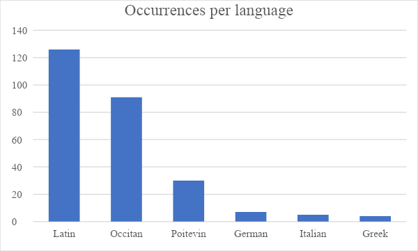

# Languages and Linguistic Agency in Ms. Fr. 640

> Gilles Narcy 
> Spring 2023 
> HIST GU4962: Making and Knowing in Early Modern Europe: Hands-On History 

## Introduction: Languages as practical knowledge

This essay focuses on the role played by languages in Ms. Fr. 640.
Although written in French, as its call number in the Bibliothèque
nationale de France’s catalogue indicates, it contains several
occurrences of other languages. Extensive scholarship has been dedicated
to artisan authors and the rise of books of recipes in the early modern
era, focusing on the difficulties and paradoxes of putting embodied,
practical knowledge into writing.[^1] The perspective adopted in this
essay is to approach writing, and more specifically the use of different
languages in various contexts, as a skill and a practical process
itself. My main contention, drawn from sociolinguistics, is that
languages, rather than neutral and substitutable vehicles for
communication, carry different meanings and implications in and of
themselves. They coexist and define themselves in relation to each other
inside a social space that can be described alternatively as an
ecology[^2] or as a market[^3]. The use of each language produces
precise textual effects in the manuscript, whether they are purposely
intended by the author-practitioner or not.

In practical metaphors, languages can be understood as materials with
different properties that influence the information they carry. They can
also be conceived as tools, used by the author-practitioner to achieve
textual goals. In this perspective, languages should be considered
separately as well as in relation to each other. The historian Paul
Cohen reminds us that plurilingualism was the rule for all in
Renaissance France, at the same time, drawing attention to the fact that
a sociolinguistic hierarchy separated and classified the existing
languages. But while historians have extensively studied the relation of
language to culture, politics,[^4] and even the sciences,[^5] its
relationship in the crafts and sciences remains largely overlooked. Ms.
Fr. 640 is a good case study to examine the use of language by early
modern craftsmen.

The non-French languages in the manuscript belong to three different
categories: ancient languages (Latin and Greek), foreign languages
(Italian and German), and local languages (Occitan and Poitevin).[^6]
This group of languages, as I will try to demonstrate, is not merely
conventional or coincidental: ancient, foreign, and local are not only
linguistic categories, but, rather, to some extent epistemological.
Ancient languages are linked with learned knowledge, foreign languages
with the circulation of artisanal practices, and local languages with
experimental accounts. The boundaries between each of these groups,
however, are far from sharp, and their realms often blur.

In what follows, I will first present a dataset for non-French
occurrences in Ms. Fr. 640, built with Excel with the valuable help of
Naomi Rosenkranz and Terry Catapano, to whom I am sincerely grateful. I
will show how we can use this dataset in combination with other
quantitative tools to offer a computational approach to linguistic tags
in the manuscript, an approach that paves the way for qualitative
analysis.

Each language can be approached individually or thematically. Thus, the
question was whether to follow language groups or thematic sections
which show intersections between various languages: the
author-practitioner’s literacy, or the various names of materials,
plants, and tools, for example. As the dataset is built upon occurrences
per language, I chose to delve successively on each of my three groups
of ancient, foreign, and local. Nonetheless, these themes will be
tackled repeatedly throughout the essay in a comparative perspective
between individual languages.

## Building and exploiting a dataset on languages in Ms. Fr. 640

I started building the dataset of languages in Ms. Fr. 640 manually.
Using the digital edition, I entered every recipe containing an
occurrence of non-French language. For each, I entered the language, the
folio number, the English title of the recipe, the semantic tag(s) of
the recipe, and the number of linguistic tags (i.e., the number of
occurrences of each language per recipe). Terry Catapano and Naomi
Rosenkranz then very generously helped me to improve my dataset using
the xml code of the edition: instead of having one line per recipe, I
now have one line per occurrence. The dataset in its current version
also provides the three closest parent tags for every occurrence, as
well as the text itself on the same line. This first version was based
on the English translation version of the manuscript. I exported the
code of the French diplomatic version to Excel to produce a second one.
There was no major difficulty, except for some special characters and
recipe titles which were lost in the process and that I had to add again
manually. The same can obviously be done for the French normalized
version of the text.

Assembling the data by hand already gave me a good sense of the
linguistic patterns for every language. The most instinctive use of the
dataset was to plot a chart of the occurrences of every non-French
language in the manuscript, which gives a clear visualization of the gap
between three most frequent languages on one hand (Latin, Occitan, and
Poitevin), and three rarest ones on the other (German, Italian, and
Greek) (Fig. 1).

*Fig. 1. Number of occurrences per language*

However, a second chart (Fig. 2) reveals that Occitan and Poitevin occur
only as single words, whereas Italian accounts for full sentences. It
demonstrates that a close reading of the recipes remains necessary to
interpret the data created.

*Fig. 2. Total number of words per language*

I further relied on the extensive computational research that has been
done on the manuscript by Clément Godbarge, Roni Kaufman, and Dana
Chaillard.[^7] I use their charts extensively throughout this essay. I
tried to implement the correlations between languages and semantic tags
with a focus on linguistic diversity: using Professor Alex Reuneker’s
[<u>free calculator online</u>](https://www.reuneker.nl/files/ld/), I
generated lexical diversity scores for each language. The score
corresponds to a Type-Token ratio (TTR): the number of single-occurring
words divided by the total number of words (Fig. 3). 1 represents a text
in which every word occurs only once. TTR is one of the most basic
indicators of linguistic diversity. Despite its lack of precision, it
gives a sense of the lexical variety of the author-practitioner for each
language. In the case of German, I uniformized the spelling of “Spat”
into “Spalt” to produce a coherent result. I then proceeded to plot the
scores into a single bar-chart.

*Fig. 3. Lexical diversity per language (TTR)*

The results show that there is no association between frequency of
occurrences and diversity: Occitan is the second most frequent language
but has the second lowest lexical diversity score, while Italian has the
highest score of all languages. As expected, there is, on the contrary,
a strong association between the number of words and lexical diversity,
especially when leaving aside the very small samples of German and
Greek.

Such quantitative analysis is not a terminal point, however, but rather
helps reveal unexpected patterns and possible reading paths for Ms. Fr.
640.

## Latin and Greek: performing high knowledge

Ancient languages constitute the first group of non-French languages in
the manuscript. In the sixteenth century, Latin and Greek were perceived
as sharing several common features. First, they were the languages of
classical knowledge from pagan as well as Christian Antiquity. Second,
they were regarded, alongside Hebrew (a novelty of the sixteenth century
for Christian scholars), as the most perfect languages, by far superior
to any of the vernaculars. However, the relation between Latin and Greek
was very much asymmetrical: while Latin was the language of religion,
power, and science, widely spread among learned elites and taught in
grammar schools, Greek was a scholarly knowledge that had been
rediscovered in Western Europe during the fifteenth century only. Ms.
Fr. 640 testifies to this asymmetry (Fig. 1).

Comparing Naomi Rosenkranz’s general chart on the frequency of each
semantic tag in Ms. Fr. 640 (Fig. 4) with Roni Kaufman’s bar charts
(Fig. 5) on the correlation between language tags and semantic tags, we
can observe that casting, which already amounts to 34% of the total
entries, is overrepresented in Latin, with more than half of the
occurrences. Medicine also has a strong association with Latin (10.69%
against an overall 4.55%). On the contrary, painting (0.76% against
14.3%), cultivation (0.76% against 3.03%), and household and daily life
(0% against 3.22%) are underrepresented. At first sight, Latin seems to
be associated with high realms of knowledge: medicine was taught in the
universities, and casting could have military applications[^8] or serve
to create precious objects for a *Kunstkammer*. Common life, on the
contrary, is poorly transcribed into the language of elites.

*Fig. 4. How many entries are tagged with each category*[^9]

*Fig. 5. Tag count: Latin in the manuscript*[^10]

Latin occurs in three different ways. First, in references or quotes,
most of which have been identified by the digital editors of the
manuscript. Even leaving aside the first folio, which contains a list of
books to recover written by a different hand than the
author-practitioner’s,[^11] Ms. Fr. 640 contains several titles of books
and borrowed sentences in Latin, such as Henri Estienne’s translation of
Herodotus, Flavius Josephus, Terence, and other classical authors. Some
Latin quotes are also borrowed from modern authors, such as the Italian
professor of medicine Girolamo Mercuriale in the “For preservation”
entry (fol. 170r). Interestingly, these Latin references are to be found
mainly in the programmatic entries “For the workshop” (fols. 162r and
166r). In fol. 166r, the author-practitioner reflects on how he should
respond to a “jealous person” (“*zélotype*”) who would blame him for
having only compiled recipes and not provided for new knowledge. His
answer is taken from Terence: “*nullum est jam dictum quod non dictum
aut factum sit prius*,” (nothing is said now that has not been said or
done before). This is followed by a list of Latin authors who borrowed
from Greek predecessors and by comparisons with weavers and masons as
well, who use the materials of others to create new objects. It reveals
that the author-practitioner’s practical epistemology is rooted in the
same conservative and imitative culture of the humanists.

The author-practitioner uses Latin not only to defend his theory of
knowledge, but also to describe practical processes. In fact, most Latin
occurrences are names of materials. Quantitatively speaking, casting
dominates, as Figs. 4 and 5 show, with two main materials: *aes ustum*
(burnt copper) and above all *crocum ferri* (an iron additive). However,
there is more variety in the use of Latin names for plants and organic
materials in general, with a total of 10: *pix Graeca*, *capillum
Veneris*, *lapathum acutum*, *symphitum*, *consolida*, *semperviva*,
*vermicularis*, *palma Christi*, *ranunculus*, *palta lupina*. We can
add to those, *caput mortuum*,[^12] a haematite pigment. Many of these
materials, such as *capillum Veneris* (maidenhair fern), were common in
Languedoc and could have easily been designated using vernacular names
in French or Occitan. In this context, the use of Latin on the
author-practitioner’s part could be linked with the rise of herbals,
such as that of Ulisse Aldrovandi or Conrad Gessner’s *Historia
Plantarum* (although it remained unpublished until the eighteenth
century), and of natural history in general. Latin, here, conveys the
learned character of several of the author-practitioner’s recipes,
illustrating its role as a vehicle for knowledge in early modern Europe.

Latin proves useful to the author-practitioner not only to designate
various materials, but also to give instructions and annotations about
the processes he describes. Several technical terms or abbreviations in
Latin, in fact, are recurrent throughout the manuscript: *nota* (“note”)
occurs 6 times; ℞, abbreviation for “recipe” (“take”), 5 times; *ana*
(“equally”), 2 times. The recipe “To make silver run” (fol. 120v) also
contains the marginal annotation “*Siscitatio* \[*sic*.\] *dubia*,”
meaning “dubious question,” although spelled wrong (“*siscitatio*” for
“*sciscitatio*”).

Overall, the use of Latin in the manuscript is pervasive, whether to
imitate learned culture and prove the learning of the
author-practitioner or to describe precise materials and plants. In the
era of print, names and processes tended to be standardized at a
transnational level, an opposite trend to the rise of political nation
states. The variety of ways in which the author-practitioner uses Latin
shows its relevance in practical knowledge as much as in high culture.
It enlarges Françoise Waquet’s traditional interpretation of Latin in
early modern Europe, according to whom Latin survived thanks to three
conservative elite institutions: schools, the Church, and
scholarship.[^13] Ms. Fr. 640, on the contrary, provides an example of a
transnational circulation of knowledge in Latin among practitioners
rather than scholars, and of social imitation of cultural elites by a
lower member of the social hierarchy.

Greek occurrences, on the other hand, are limited to two recipes only:
“Snakes” (fol. 13v) and “For the workshop” (162r). In the latter, the
author-practitioner uses the name Clio, the Greek muse of history, to
refer to Herodotus’ *Historia*. The former entry, which has been
extensively researched by Victoria Nebolsin, is short and seemingly
odd.[^14] It indicates that snakes, if called with their Greek name,
όφι, will flee. On the contrary, pigs called with their Greek name *ïon*
will come. As far as literacy is concerned, it is evident that the
author-practitioner had barely any notion of Greek: his orthography of
single words is not correct, and the first term only is spelled in Greek
alphabet. Nonetheless, the recipe can still be regarded as a form of
reenactment of ancient Greek knowledge. It is probably inspired by an
episode of Plutarch’s *Moralia*, also mentioned in Giovanni Battista
Gelli’s *La Circe* (1549). Gelli was himself an author-practitioner:
trained as a shoemaker in Florence, he published books dealing with
crafts as well as philosophical dialogues in the humanistic tradition.
It is likely that Plutarch’s anecdote was borrowed from him, but it
should also be noted that the Greek philosopher was a very popular
author in Renaissance France. The passage from the *Moralia* is a parody
of *Odyssey*, X: Odysseus engages in dialogue with a swine philosopher,
Gryllus, who advocates for the superiority of animals over humans since
they possess crafts by nature and do not need to acquire them through
training. Nebolsin interprets this unacknowledged reference as an
endorsement of Gryllus’ praise of natural skill on the
author-practitioner’s part. However, it is also worthy to note that the
“Snakes” entry on fol. 13v does not deal with crafts or skills as much
as with language and literacy. Why should animals respond to Greek
rather than to French, Latin, or any other language? My hypothesis is
that the author-practitioner regards Greek as a language with a magical
aura, associated with ancient, philosophical, and also occult knowledge.
The ability to command animals through language is in fact a recurring
magical skill in different cultures and societies.

The “Snakes” entry demonstrates that ancient languages carry
supernatural implications. In Saussurian terms, they do not serve only
as signifiers for a signified such as tools or materials; they are a
*material* element of the recipe. This is also the case in the entry
“Against burns, excellent” (103r), which contains a recipe for a healing
salve that must be used while reciting the paternoster prayer in a
precise order.[^15] The words “pater noster” have been encoded as French
and not Latin in the manuscript, on the ground that it was indeed a
common phrase. Nonetheless, the prayer still had to be said in Latin,
especially in a Catholic context. The prayer must be said in a precise
rhythm, making the recipe akin to a religious ritual such as the
Catholic Eucharist, where the transubstantiation occurs through the
combination of the priest’s gestures and the uttering of the “words of
institution.” Both entries pertain to what linguist James L. Austin
famously called “performativity”: the use of language to act rather than
to state.[^16] But in the context of practical knowledge, as
demonstrated by these uses in Ms. Fr 640, languages are not only
performative, rather, they are put on the same level as other materials.
It can thus be contended that under certain circumstances, such as the
supernatural use of Latin and Greek, languages possess their own form of
materiality, where Latin is used in the form of a prayer inspired by
Church rituals that helps effect a material transformation, Greek is the
language of performativity that compels the action of a physical being.

On an anthropological level, the Latin-Greek couple thus replicates to
some extent the duality of religion and magic.[^17] This divide,
however, should not be overemphasized. In fact, the recipe “For melting
or transmuting a jewel put inside a box” (fol. 34v) uses Latin in a
magical context[^18]: to perform the transmutation, one is supposed to
say “*inhonorificabilitidinitatudinibus*” before performing the trick.
Still, magic in this sense differs from the “Snakes” recipe: macaronic
Latin is used in a sleight of hand to deceive the spectator into
thinking that real magic is taking place. The fake and absurd Latin
creates an effect of burlesque far from the sacredness of the
paternoster prayer. Calling animals with their Greek names, on the
contrary, implies supernatural powers, or rather ascribes to the
animals’ nature what is usually regarded as the definition of humanity:
language.

## Italian and German: the geography of artisanal practices in early modern Europe

Italian and German are the only foreign languages in the manuscript.
Their presence tells as much as the absence of others since it gives us
a clue, in Carlo Ginzburg’s sense,[^19] of transnational circulation of
artisanal knowledge at the time. Foreign languages were not taught at
school in the sixteenth century and the author-practitioner, even if he
had attended one, could only have been in contact with them through
other craftspeople. While the absence of English should not be
surprising, that of Flemish and Spanish must be questioned. Flanders was
a major artistic and artisanal center in sixteenth-century Europe and
several techniques described in the manuscript were also known in
Flanders and the Netherlands. Spain, on the other hand, was at the
height of its power under Philip II and had a growing influence on
French domestic affairs during the final years of the Wars of Religion
during the period the manuscript was written.[^20] It is even more
curious since Toulouse is so close to Spain. While no general conclusion
can be drawn from one single case, the fact that only Italian and German
occur testifies to their primacy in crafts at the time.

The two languages differ widely in their variety and their uses in the
manuscript. German occurs slightly more often than Italian: 7 vs. 5.
However, German is only present in casting. In fact, out of 7
occurrences, the word “Spalt” (sometimes spelled “Spat”) is responsible
for 6. *Spalt* was a powdered earth used in casting. The other German
occurrence is “*Stuf*” (fol. 118r), a limestone which the
author-practitioner uses in a grotto recipe. Sofia Gans concludes from
the frequency of the word “*Spalt*,” an earth sourced in Augsburg, that
German was the center of European casting for the author-practitioner,
rather than Italy, as is usually assumed for sixteenth-century Europe.

While there are fewer Italian occurrences in the manuscript and none
related to casting, they are considerably longer in length and broader
in scope, with the second largest number of words after Latin. The only
recipe which has been directly retraced to another text also comes from
an Italian background: “For making very beautiful color of gold & of
little expense” (fol. 76v).[^21] It is borrowed from the French
translation of Alessio Piemontese’s *Segreti*.

The first occurrence of Italian is simply a book title on the first
folio. But one recipe, “Purpurine” (43r), is written entirely in
Italian:

> *℞ stagno dolce meza onca farlo fondere in un cochiaro depoi fonduto gectarly dentro una ℥ de ☿ mesedar insieme essendo freddo macinar supra il porfidio dapoi piglia una ℥ de sal armoniaco una ℥ de solfo del piu giallo que se possa troval macinar tutti duoi Et poi mesedar molto bene tutti gli matteriali sopradetti dapoi metter tutto insieme dentro un a pignatta sublimatorio di vetro tenerlo sopra picciol fuoco una hora & una hora un poco piu forte & una hora bonissimo fuoco Et sara fatto dapoi per adoper{ar}la datte il negro di resina con colla di pintori da pintar & per doi o tre volte fin a tanto che sia ben negro dapoi datte un poco di vernice Essendo secco datte a secco con ditto la purpurina dove vorrette tanto piu ne darette sara piu bello dapoi si volete datte vernice sopra*.

The Italian is correct overall, although shaky at times and fraught with
Hispanicisms: “meza” for “mezza,” “mesedar” for “mescolar” or
“mischiar,” “que” for “che.”. The recipe was most probably copied or
dictated to the author-practitioner, attesting to his acquaintance with
Italian craftspeople whom he could have met in Toulouse or elsewhere.

The three remaining Italian occurrences can be grouped together as they
share a common particularity: they are the only titles in the entire
manuscript in a language other than French. As such, the Italian has
been left intact in the English translation. These are “To fire a
schioppo senza rumore” (fol. 55r), what we would call today a rifle
silencer; and “Onenev elbirro hcihw sllik fi eno spets no a draob ro a
<del>ueirse</del> purrits” (fol. 55r); and “A means di far correr lotnegra”
(fol. 123r). The second and third of these only seem incomprehensible
because their title must be read backwards, as follows: “Veneno orrible
\[another Hispanicism\] which kills if one steps on a board or a
stirrup” and “A means di far correr largento.” The use of backwards
writing, although very easily readable as a code, nonetheless connotes
the idea of secrecy: in the first case, because dealing with poison
(“veneno,” or venom); in the second, because the technique is known by
only a few goldsmiths and should remain such, or this is at least what
the author-practitioner paradoxically writes while proceeding to reveal
it (“This material should not be divulged, lest it be abused”). The
author-practitioner here was probably interested in giving the
impression of secrecy in order to appeal to his audience. It should not
be taken too literally, since real secrets would not have been so easily
divulged in print and would certainly have been encoded entirely,
whereas here the title or parts of it only are written backwards. Why,
then, choose to write in Italian to convey this idea? In late
sixteenth-century France, Italy was associated with secret and artifice
for many reasons. Italian influence on the arts and the royal court had
been important for several generations, from the School of Fontainebleau
during Francis I’s reign to the Italian courtesans surrounding the Queen
Mother Catherine de’ Medici. Italophilia and Italophobia ran parallel
and Italian influence became a political theme[^22]: Italians, and
especially Florentines, were seen simultaneously as refined and
mischievous (even evil), mostly due to Machiavelli’s notoriety, whose
work, *The Prince*, was becoming a bestseller all around Europe at the
end of the sixteenth century.[^23] While admired by some, most regarded
him as the theorist of evil in politics, giving his name the aura it has
retained today. Catholics put him on the Index of prohibited books, but
Protestants nonetheless accused them of Machiavellism, which had become
an insult, especially after the Saint Bartholomew Day Massacre in 1572.
Italy was regarded as the country of artifice, secrecy, and conspiracy,
and the author-practitioner played with this reputation in his
manuscript.

## Occitan and Poitevin: linguistic tools of experience

After Latin, Occitan and Poitevin are the most frequent non-French
languages in Ms. Fr. 640. The literacy of the author-practitioner in
these languages is harder to establish. On the one hand, they occur only
in few words or expressions and present a low lexical diversity score
(Fig. 3). However, all French people were at least bilingual in early
modern France, even after the Villers-Cotterêts edict of 1539 which made
French mandatory for every official, lay act. French became the dominant
written language, but every region retained its own local idioms which
were far more common in everyday life speech. As the identity and
background of the author-practitioner remains obscure, we cannot know if
he was a native speaker of Occitan, but the extent of Toulouse
background he possesses allows us to make the hypothesis that he had at
least solid notions of it. The choice of writing in French should thus
be interpreted as an editorial choice as much as the consequence of his
own literacy.

As far as the presence of Poitevin is concerned, we can assume that it
came from the massive presence of Poitevin speakers in Toulouse.
Poitevin was spoken roughly in a triangle area between Nantes in the
North, Poitiers in the East, and Bordeaux in the South, not too far away
from the Languedoc area of Toulouse. In French linguistics, it is
considered a *langue d’oïl*, a Northern language, but takes some words
from Occitan, which is a Southern *langue d’oc*.

*Fig. 6. Tag count: Occitan in the manuscript*[^24]

*Fig. 7. Tag count: Poitevin in the manuscript*[^25]

Fig. 6 shows that Occitan is strongly associated with casting (38.7%)
and metal processes (18.37%), with high percentages as well of entries
dealing with arms and armor (9.18%), household and daily life (7.14%),
and cultivation (5.10%). Fig. 7 shows that Poitevin’s profile is
similar, with strong connections to casting (41.1%), household and daily
life (8.82%), and cultivation (5.88%). As regional idioms, they can be
linked to a form of local, native knowledge. There are no book titles in
these languages, rather, they serve mainly to indicate some common
tools, animals, or materials with the names that probably sounded more
natural to the author-practitioner and/or to his informants. Compared to
Latin, these occurrences attest to the permanence of vernacular
knowledge in vernacular languages against the process of Latinization
that we observed earlier in this essay. In Occitan, the overwhelming
term is “crusol,” (crucible), a tool involved in dozens of recipes in
the manuscript and occurring 54 times. The same is true for Poitevin
with the word “tourtelle” (“cake,” in a very broad sense), which occurs
13 times. Here, the absence of complete sentences and the lack of
linguistic diversity indicates that these terms come naturally to the
author-practitioner. It allows him to give detailed, accurate accounts
where the learned terms in Latin or French are missing or might be too
vague and general.[^26]

## Conclusion: Making with languages

Although far from complete, this overview nonetheless reveals that the
author-practitioner makes consistent and thoughtful use of the vast
array of linguistic resources available to him in Renaissance France.
Despite being a craftsman, he demonstrates a capacity to use various
languages to achieve different goals. He exploits the possibilities of
Latin as the language of knowledge and religion in his search for
respectability, but also recurs to Greek as its occult and somehow
mysterious pendant. The occurrences of German and Italian reveal his own
involvement in transnational networks of crafts. To some extent, we can
hypothesize that they are the traces left by wider circulations, which
have been erased for the most part by translation and non-textual
transmission. Occitan and Poitevin, finally, are very much associated
with a handful of tools and materials: whether the author-practitioner
himself originated from Toulouse or not, he needs the words of his
professional environment to restitute his recipes and processes in the
most accurate way.

This case study, as limited as it is, highlights two main aspects in the
history of languages in sixteenth-century France. First, it confirms
Paul Cohen’s thesis that France was a plurilingual country in which
everybody made daily use of a surprising number of different languages.
This does not mean that they were all equivalent; on the contrary, the
hierarchy of languages and the struggle for linguistic respectability is
essential in understanding linguistic practices, as Ms. Fr. 640 shows.
Second, it widens the area of plurilingualism from cultural elites to
other categories of society such as crafts practitioners, showing that
Latin or foreign languages were not the exclusive domain of clerks and
humanists. Even if they did not have the same linguistic training and
capacities, practitioners such as the author of Ms. Fr. 640 were able to
appropriate and use different languages according to their own strategic
agendas.

## Bibliography

Austin, J. L. *How to Do Things with Words*. 2d ed. The William James Lectures 1955. Oxford: Clarendon Press, 1975.

Burke, Peter, and Roy Porter, eds. *The Social History of Language*. Cambridge Studies in Oral and Literate Culture 12. Cambridge; New York: Cambridge University Press, 1987.

Balsamo, Jean. *L’amorevolezza verso le cose Italiche: le livre italien à Paris au XVIe siècle*. De lingua et linguis, vol. 2. Genève: Librairie Droz, 2015.

Balsamo, Jean. *Les Rencontres Des Muses: Italianisme et Anti-Italianisme Dans Les Lettres Françaises de La Fin Du XVIe Siècle*. Bibliothèque Franco Simone 19. Genève: Editions Slatkine, 1992.

Balsamo, Jean, Vito Castiglione Minischetti, and Giovanni Dotoli. *Les traductions de l’italien en français au XVIe siècle*. Biblioteca della ricerca 2. Fasano (Italie) Paris: Schena Hermann, 2009.

Barwich, Ann-Sophie. “Sleight of Hand Tricks.” In *Secrets of Craft and Nature in Renaissance France. A Digital Critical Edition and English Translation of BnF Ms. Fr. 640*, edited by Making and Knowing Project, Pamela H. Smith, Naomi Rosenkranz, Tianna Helena Uchacz, Tillmann Taape, Clément Godbarge, Sophie Pitman, Jenny Boulboullé, Joel Klein, Donna Bilak, Marc Smith, and Terry Catapano. New York: Making and Knowing Project, 2020. <https://edition640.makingandknowing.org/#/essays/ann_043_sp_16>. DOI: <https://www.doi.org/10.7916/rfq6-0k88>

Bourdieu, Pierre. *Language and Symbolic Power*. Translated by John B. Thompson. Cambridge, Mass: Harvard University Press, 1991.

Brunet, Serge. “Philippe II et la Ligue parisienne (1588).” *Revue historique* 656, no. 4 (2010): 795–844.[<u>https://doi.org/10.3917/rhis.104.0795</u>](https://doi.org/10.3917/rhis.104.0795).

Chaillard, Dana. “My Work at the Making and Knowing Project,” 2020. [<u>https://cu-mkp.github.io/sandbox/docs/Chaillard_final-report.html</u>](https://cu-mkp.github.io/sandbox/docs/Chaillard_final-report.html).

Chartier, Roger, Pietro Corsi, and Centre Alexandre Koyré, eds.*Sciences et Langues En Europe*. Paris: Ecole des hautes études en sciences sociales, 1996.

Cohen, Paul. “Courtly French, Learned Latin, and Peasant Patois: The Making of a National Language in Early Modern France.” Ph.D., Princeton University, 2001. ProQuest Dissertations & Theses Global (230830091).

Ginzburg, Carlo. *Myths, Emblems, Clues*. London: Hutchinson Radius, 1990.

Godbarge, Clément. “The Manuscript Seen from Afar: A Computational Approach to Ms. Fr. 640.” In *Secrets of Craft and Nature in Renaissance France. A Digital Critical Edition and English Translation of BnF Ms. Fr. 640*, edited by Making and Knowing Project, Pamela H. Smith, Naomi Rosenkranz, Tianna Helena Uchacz, Tillmann Taape, Clément Godbarge, Sophie Pitman, Jenny Boulboullé, Joel Klein, Donna Bilak, Marc Smith, and Terry Catapano. New York: Making and Knowing Project, 2020. <https://edition640.makingandknowing.org/#/essays/ann_301_ie_19>. DOI: <https://www.doi.org/10.7916/nnyc-gd81>.

Godbarge, Clément. “Visualizing Semantic Markup in BnF Ms. Fr. 640.” *Clément Godbarge* (blog), November 29, 2022. [<u>https://www.clementgodbarge.com/post/visualization/</u>](https://www.clementgodbarge.com/post/visualization/).

Kaufman, Roni. “My Work at the Making and Knowing Project,” 2020. [<u>https://cu-mkp.github.io/sandbox/docs/Kaufman_final-report.html</u>](https://cu-mkp.github.io/sandbox/docs/Kaufman_final-report.html).

Liu, Xiaomeng. “An Excellent Salve for Burns.” In *Secrets of Craft and Nature in Renaissance France. A Digital Critical Edition and English Translation of BnF Ms. Fr. 640*, edited by Making and Knowing Project, Pamela H. Smith, Naomi Rosenkranz, Tianna Helena Uchacz, Tillmann Taape, Clément Godbarge, Sophie Pitman, Jenny Boulboullé, Joel Klein, Donna Bilak, Marc Smith, and Terry Catapano. New York: Making and Knowing Project, 2020. <https://edition640.makingandknowing.org/#/essays/ann_080_sp_17>. DOI: <https://www.doi.org/10.7916/58dr-ns42>.

Mauss, Marcel. *A General Theory of Magic*. London, Boston: Routledge and K. Paul, 1972.

Nebolsin, Victoria. “Animal Rationality in Ms. Fr. 640.” [<u>https://cu-mkp.github.io/sandbox/docs/sp22_nebolsin_victoria_final-project_animal-rationality.html</u>](https://cu-mkp.github.io/sandbox/docs/sp22_nebolsin_victoria_final-project_animal-rationality.html).

Palframan, Jef and Emily Boyd. “For Making Very Beautiful Color of Gold.” In *Secrets of Craft and Nature in Renaissance France. A Digital Critical Edition and English Translation of BnF Ms. Fr. 640*, edited by Making and Knowing Project, Pamela H. Smith, Naomi Rosenkranz, Tianna Helena Uchacz, Tillmann Taape, Clément Godbarge, Sophie Pitman, Jenny Boulboullé, Joel Klein, Donna Bilak, Marc Smith, and Terry Catapano. New York: Making and Knowing Project, 2020. <https://edition640.makingandknowing.org/#/essays/ann_507_ad_20>.

Picot, Emile. *Les Italiens En France Au XVIe Siècle*. Memoria Bibliografica 25. Manziana (Roma): Vecchiarelli editore, 1995.

Rosenkranz, Naomi. “Understanding and Analyzing the Categories of the Entries in BnF Ms. Fr. 640,” 2021. [<u>https://cu-mkp.github.io/sandbox/docs/categories.html</u>](https://cu-mkp.github.io/sandbox/docs/categories.html).

Smith, Marc. “Making Ms. Fr. 640.” In *Secrets of Craft and Nature in Renaissance France. A Digital Critical Edition and English Translation of BnF Ms. Fr. 640*, edited by Making and Knowing Project, Pamela H. Smith, Naomi Rosenkranz, Tianna Helena Uchacz, Tillmann Taape, Clément Godbarge, Sophie Pitman, Jenny Boulboullé, Joel Klein, Donna Bilak, Marc Smith, and Terry Catapano. New York: Making and Knowing Project, 2020. [<u>https://edition640.makingandknowing.org/#/essays/ann_326_ie_19_msmith_making-ms</u>](https://edition640.makingandknowing.org/#/essays/ann_326_ie_19_msmith_making-ms).

Smith, Pamela H. *From Lived Experience to the Written Word: Reconstructing Practical Knowledge in the Early Modern World*. Chicago: University of Chicago Press, 2022.

Soll, Jacob. “The Reception of The Prince 1513–1700, or Why We Understand Machiavelli the Way We Do.” *Social Research* 81, no. 1 (2014): 31–60.

Taape, Tillmann. “‘Experience Will Teach You’: Recording, Testing, Knowing, and the Language of Experience in Ms. Fr. 640,” In *Secrets of Craft and Nature in Renaissance France. A Digital Critical Edition and English Translation of BnF Ms. Fr. 640*, edited by Making and Knowing Project, Pamela H. Smith, Naomi Rosenkranz, Tianna Helena Uchacz, Tillmann Taape, Clément Godbarge, Sophie Pitman, Jenny Boulboullé, Joel Klein, Donna Bilak, Marc Smith, and Terry Catapano. New York: Making and Knowing Project, 2020. <https://edition640.makingandknowing.org/#/essays/ann_303_ie_19>. DOI: <https://www.doi.org/10.7916/njnq-6q58>.

Tavares, Jonathan. “Arms and Armor in Ms. Fr. 640.” In *Secrets of Craft and Nature in Renaissance France. A Digital Critical Edition and English Translation of BnF Ms. Fr. 640*, edited by Making and Knowing Project, Pamela H. Smith, Naomi Rosenkranz, Tianna Helena Uchacz, Tillmann Taape, Clément Godbarge, Sophie Pitman, Jenny Boulboullé, Joel Klein, Donna Bilak, Marc Smith, and Terry Catapano. New York: Making and Knowing Project, 2020. <https://edition640.makingandknowing.org/#/essays/ann_308_ie_19>. DOI: <https://www.doi.org/10.7916/9rye-d152>.

Waquet, Françoise. *Latin, or, The Empire of the Sign: From the Sixteenth to the Twentieth Century*. London; New York: Verso, 2001.

[^1]: Pamela H. Smith, *From Lived Experience to the Written Word: Reconstructing Practical Knowledge in the Early Modern World* (Chicago: University of Chicago Press, 2022).

[^2]: Paul Cohen, “Courtly French, Learned Latin, and Peasant Patois: The Making of a National Language in Early Modern France” (Ph.D., Princeton University, 2001), ProQuest Dissertations & Theses Global (230830091).

[^3]: Pierre Bourdieu, *Language and Symbolic Power*, trans. John B. Thompson (Cambridge, Mass: Harvard University Press, 1991).

[^4]: [Peter Burke and Roy Porter, eds., *The Social History of Language*, Cambridge Studies in Oral and Literate Culture 12 (Cambridge \[Cambridgeshire\]; New York: Cambridge University Press, 1987).](https://www.zotero.org/google-docs/?HxHLnm)

[^5]: Roger Chartier, Pietro Corsi, and Centre Alexandre Koyré, eds., *Sciences et Langues En Europe* (Paris: Ecole des hautes études en sciences sociales, 1996).

[^6]: Marc Smith, “Making Ms. Fr. 640,” in *Secrets of Craft and Nature in Renaissance France. A Digital Critical Edition and English Translation of BnF Ms. Fr. 640*, edited by Making and Knowing Project, Pamela H. Smith, Naomi Rosenkranz, Tianna Helena Uchacz, Tillmann Taape, Clément Godbarge, Sophie Pitman, Jenny Boulboullé, Joel Klein, Donna Bilak, Marc Smith, and Terry Catapano (New York: Making and Knowing Project, 2020), [<u>https://edition640.makingandknowing.org/#/essays/ann_326_ie_19_msmith_making-ms</u>](https://edition640.makingandknowing.org/#/essays/ann_326_ie_19_msmith_making-ms).

[^7]: Dana Chaillard, “My Work at the Making and Knowing Project,” 2020, [<u>https://cu-mkp.github.io/sandbox/docs/Chaillard_final-report.html</u>](https://cu-mkp.github.io/sandbox/docs/Chaillard_final-report.html); Clément Godbarge, “The Manuscript Seen from Afar: A Computational Approach to Ms. Fr. 640,” in *Secrets of Craft and Nature in Renaissance France. A Digital Critical Edition and English Translation of BnF Ms. Fr. 640*, edited by Making and Knowing Project et al., <https://edition640.makingandknowing.org/#/essays/ann_301_ie_19>. DOI: <https://www.doi.org/10.7916/nnyc-gd81>; Clément Godbarge, “Visualizing Semantic Markup in BnF Ms. Fr. 640,” *Clément Godbarge* (blog), November 29, 2022, [<u>https://www.clementgodbarge.com/post/visualization/</u>](https://www.clementgodbarge.com/post/visualization/); Roni Kaufman, “My Work at the Making and Knowing Project,” 2020, [<u>https://cu-mkp.github.io/sandbox/docs/Kaufman_final-report.html</u>](https://cu-mkp.github.io/sandbox/docs/Kaufman_final-report.html).

[^8]: Jonathan Tavares, “Arms and Armor in Ms. Fr. 640, in *Secrets of Craft and Nature in Renaissance France. A Digital Critical Edition and English Translation of BnF Ms. Fr. 640*, edited by Making and Knowing Project et al., <https://edition640.makingandknowing.org/#/essays/ann_308_ie_19>. DOI: <https://www.doi.org/10.7916/9rye-d152>.

[^9]: Naomi Rosenkranz, “Understanding and Analyzing the Categories of the Entries in BnF Ms. Fr. 640,” 2021, [<u>https://cu-mkp.github.io/sandbox/docs/categories.html</u>](https://cu-mkp.github.io/sandbox/docs/categories.html).

[^10]: Kaufman, “My Work at the Making and Knowing Project, [<u>https://cu-mkp.github.io/sandbox/docs/Kaufman_final-report.html</u>](https://cu-mkp.github.io/sandbox/docs/Kaufman_final-report.html).

[^11]: Smith, “Making Ms. Fr. 640,” [<u>https://edition640.makingandknowing.org/#/essays/ann_326_ie_19_msmith_making-ms</u>](https://edition640.makingandknowing.org/#/essays/ann_326_ie_19_msmith_making-ms).

[^12]: The translation for most of these terms can be found in the Glossary of *Secrets of Craft and Nature*: [<u>https://edition640.makingandknowing.org/#/folios/1r/f/1r/glossary</u>](https://edition640.makingandknowing.org/#/folios/1r/f/1r/glossary).

[^13]: Françoise Waquet, *Latin, or, The Empire of the Sign: From the Sixteenth to the Twentieth Century* (London;  New York: Verso, 2001).

[^14]: Victoria Nebolsin, “Animal Rationality in Ms. Fr. 640,” [<u>https://cu-mkp.github.io/sandbox/docs/sp22_nebolsin_victoria_final-project_animal-rationality.html</u>](https://cu-mkp.github.io/sandbox/docs/sp22_nebolsin_victoria_final-project_animal-rationality.html).

[^15]: Xiaomeng Liu, “An Excellent Salve for Burns,” in *Secrets of Craft and Nature in Renaissance France. A Digital Critical Edition and English Translation of BnF Ms. Fr. 640*, edited by Making and Knowing Project et al., <https://edition640.makingandknowing.org/#/essays/ann_080_sp_17>. DOI: <https://www.doi.org/10.7916/58dr-ns42>.

[^16]: J. L. Austin, *How to Do Things with Words*, 2d ed., The William James Lectures 1955 (Oxford: Clarendon Press, 1975).

[^17]: Marcel Mauss, *A General Theory of Magic* (London; Boston: Routledge and K. Paul, 1972).

[^18]: On tricks in Ms. Fr. 640, see Ann-Sophie Barwich, “Sleight of Hand Tricks,” in *Secrets of Craft and Nature in Renaissance France. A Digital Critical Edition and English Translation of BnF Ms. Fr. 640*, edited by Making and Knowing Project et al., <https://edition640.makingandknowing.org/#/essays/ann_043_sp_16>. DOI: <https://www.doi.org/10.7916/rfq6-0k88>.

[^19]: Carlo Ginzburg, *Myths, Emblems, Clues* (London: Hutchinson Radius, 1990).

[^20]: Serge Brunet, “Philippe II et la Ligue parisienne (1588),” *Revue historique* 656, no. 4 (2010): 795–844, [<u>https://doi.org/10.3917/rhis.104.0795</u>](https://doi.org/10.3917/rhis.104.0795).

[^21]: Jef Palframan and Emily Boyd, “For Making Very Beautiful Color of Gold,” in *Secrets of Craft and Nature in Renaissance France. A Digital Critical Edition and English Translation of BnF Ms. Fr. 640*, edited by Making and Knowing Project et al., <https://edition640.makingandknowing.org/#/essays/ann_507_ad_20>.

[^22]: On this topic, see Jean Balsamo, *Les Rencontres Des Muses: Italianisme et Anti-Italianisme Dans Les Lettres Françaises de La Fin Du XVIe Siècle*, Bibliothèque Franco Simone 19 (Genève: Editions Slatkine, 1992); Jean Balsamo, *L’amorevolezza verso le cose Italiche: le livre italien à Paris au XVIe siècle*, De lingua et linguis, vol. 2 (Genève: Librairie Droz, 2015); Jean Balsamo, Vito Castiglione Minischetti, and Giovanni Dotoli, *Les traductions de l’italien en français au XVIe siècle*, Biblioteca della ricerca 2 (Fasano (Italie) Paris: Schena Hermann, 2009); Emile Picot, *Les Italiens En France Au XVIe Siècle*, Memoria Bibliografica 25 (Manziana \[Roma\]: Vecchiarelli editore, 1995).

[^23]: Jacob Soll, “The Reception of The Prince 1513–1700, or Why We Understand Machiavelli the Way We Do,” *Social Research* 81, no. 1 (2014): 31–60. Shakespeare’s plays such as *Henry VI* or *The Merry Wives of Windsor* testify to a similar twist in Machiavelli’s reception in English culture at the end of the sixteenth century.

[^24]: Kaufman, “My Work at the Making and Knowing Project,” [<u>https://cu-mkp.github.io/sandbox/docs/Kaufman_final-report.html</u>](https://cu-mkp.github.io/sandbox/docs/Kaufman_final-report.html).

[^25]: Kaufman, “My Work at the Making and Knowing Project,” [<u>https://cu-mkp.github.io/sandbox/docs/Kaufman_final-report.html</u>](https://cu-mkp.github.io/sandbox/docs/Kaufman_final-report.html).

[^26]: On writing down experience in Ms. Fr. 640, see Tillmann Taape,“'Experience Will Teach You': Recording, Testing, Knowing, and the Language of Experience in Ms. Fr. 640.” In *Secrets of Craft and Nature in Renaissance France. A Digital Critical Edition and English Translation of BnF Ms. Fr. 640*, edited by Making and Knowing Project et al., <https://edition640.makingandknowing.org/#/essays/ann_303_ie_19>. DOI: <https://www.doi.org/10.7916/njnq-6q58>.