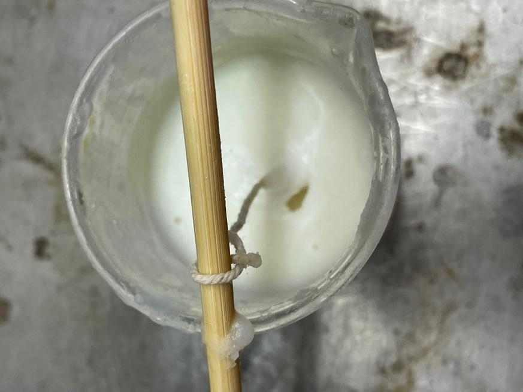

#  Candles: Making and Breaking Boundaries in Early Modern Jewish and Christian Ritual

>Nesya Nelkin 
>Spring 2023 
>HIST GU4962: Making and Knowing in Early Modern Europe: Hands-On History

Candles and their materials are ubiquitous in BnF Ms. Fr. 640. The author-practitioner suggests their use in activities as far-ranging as melting and cutting glass, smoking molds, to burning off small hairs from animals to be life-cast, to catching birds.[^1] Beeswax and tallow (made by rendering suet, the organ fat of beef, lamb, or mutton), both very versatile substances and common candle materials, appear even more frequently, for purposes including molding, healing, food preservation, and portraiture.[^2] The author-practitioner hints only obliquely at sacramental uses of wax,[^3] and makes no mention of the ritual functions of tallow or candles themselves. However, his concern for the material properties and artisanal uses of wax, tallow, and candles cannot be read outside of a broader context in which these materials and objects were associated with a complex range of theological and symbolic meanings. This paper discusses the ritual uses of wax and tallow candles among Jews and Christians in early modern Europe, focusing specifically on the ways that candles served to establish, mediate, and break down boundaries between spaces, times, and religious communities, and on the particular significance of candles in the ritual lives of women.

## Temporal Boundaries

For Jews, candles and lamps were important to defining the boundaries of sacred time. Immediately prior to the start of Shabbat and holidays, an adult member of each Jewish household, usually a woman, lit two or more candles or lamps near the table where the evening meal was to be eaten, reciting a blessing as she did so. On Shabbat, the weekly sacred day of rest, and holidays, Jewish religious law prohibits Jews from kindling new flames.[^4] Thus candles lit immediately prior to the start of these sacred days served important practical and symbolic functions—they provided a light source for the household.[^5] They were the final mundane act performed before the start of the incoming holiday.

In early modern Jewish thought, candles, particularly Shabbat candles, were closely connected with women’s bodies and their marital responsibilities. Lighting the Shabbat candles was one of three Jewish ritual obligations which was associated  particularly with women since antiquity.[^6] Mishnah Shabbat 2:6, a text read regularly in the synagogue, claims that it is for carelessness in fulfilling this and the other two “women’s commandments” that women die in childbirth. Books written for women in Yiddish and Italian explaining laws relating to these obligations were extremely popular in the sixteenth through eighteenth centuries.[^7] Despite the close association between women and Shabbat candles, either men or women could light them, but the act had different implications for temporal boundaries depending on who lit them. For women, the blessing said over the candles also formally effected the start of the sacred day. Though by the late fourteenth century, rabbinic authorities agreed that even men who lit Shabbat candles did not start Shabbat by doing so,[^8] late medieval and early modern rabbinic authorities were more concerned than their predecessors that men should have some involvement in the ritual. One way in which men engaged with this practice was through study of a section of the Friday night liturgy that discussed appropriate and inappropriate materials for the wick and fat of Shabbat candles. Men marked the start of Shabbat by reading about these materials, even if they did not physically engage with them.[^9] Jews marked the end of Shabbat and holidays with a ceremony called *havdalah* (meaning “distinction” or “separation”), in which they lit a dedicated candle and blessed God as the one “who distinguishes between sacred and profane, between light and dark, between Israel and the nations, between the seventh day and the six days of creation.” Again, lighting candles was prohibited on Shabbat and holidays, so the kindling of the *havdalah* flame showed that the period of prohibition had ended.

At the same time that candles defined the boundaries of Jewish sacred time, they also allowed those who lit, carried, and  viewed them not only to recall but also to reenact and identify with biblical figures and events, blurring the boundaries  between deep past and present in both Jewish and Christian ritual. Margrete Andås argues that by acting out biblical events, participants in Candlemas and churching rituals identified themselves both with their female ancestors and with Mary herself. Candlemas is a feast observed on February 2nd of each year, which celebrates the post-partum purification of Mary and the presentation of Jesus in the Temple of Jerusalem forty days after his birth, a narrative found in the Gospel of Luke. Upon meeting and holding Jesus, Simeon (an elderly prophet who had been waiting in the Temple to meet the Messiah) described him as “a light for revelation to the Gentiles, and the Glory of your people Israel;” another prophet, Anna, also saw him and spoke of him as the Messiah.[^10] The liturgy and rituals for this feast reflected Mary’s own actions in this episode, with the candles carried by lay and clerical participants symbolizing both the child she bore and the sacrifice she brought.[^11]

Churching, a ritual which marked women’s return to church forty days after they gave birth, reflected the Purification and Candlemas both in the texts recited and in the objects used. The new mother would bring lit candles to the entrance of the church, where she would stand or kneel until she was blessed and led across the church threshold. Prayers would be recited, many of which referenced the Purification, and the woman would make an offering to the church, often of candles. Through the use of the church to represent the Temple and candles to represent both Temple sacrifices and the Christ child, Andås argues, Candlemas and churching “eliminate” the time between the present and the biblical past.[^12]

A similar phenomenon occurs frequently in early modern writing about women’s lighting of Shabbat candles. The idea that women are responsible for this ritual as atonement for killing Adam, “the light of the world” appears as early as the Palestinian Talmud,[^13] but was further developed in early modern didactic and moralistic texts written for female audiences. As Chava Weissler notes, such an interpretation of women’s candle lighting “collapses all women into Eve.” On the other hand, early modern *tkhines* (Yiddish-language paraliturgical texts, often recited by women) for the lighting of Shabbat candles “distance the woman reciting them from Eve and her sin.”[^14] Remarkably, some eighteenth-century *tkhines* instead elide women’s candle lighting with the High Priest’s kindling of lamps in the Temple, with one even going so far as to ascribe theurgic power to the women’s actions.[^15]

## Spatial Boundaries

Candles also worked to distinguish between different types of space, and to mark moments of transition between these spaces. In churches, the sheer number of candles burning may have distinguished these brightly-lit spaces from homes and other public spaces, which tended to be more dimly lit.[^16] For most of the year, this visual distinction may not have been as strong in synagogues, which were sometimes also dimly lit.[^17] However at certain points of year, such as Yom Kippur, when worshippers brought their own candles to the synagogue, the drastic increase in the brightness of the space may have served to highlight the sanctity both of the synagogue and of the holiday.

In both churches and synagogues, wax candles were preferred over tallow ones.[^18] Wax was far more expensive than tallow,[^19] which was more readily available, and therefore highlighted the wealth and importance of the institutions and households which could afford to burn it. For Christians, wax was also an ideal material for sacred space because of its theological significance. Because of its purity, and because of beliefs that bees reproduced asexually and died in the production of wax, the material was associated with Christ’s humanity.[^20] For Jews, tallow had negative symbolic associations, because it is not kosher.[^21] Wax candles were also preferred because they burned more cleanly, with a more consistent flame, a brighter light, and without the unpleasant smell that tallow emits when burned.[^22]

To the extent that this ideal differentiation between the candle materials used in sacred and domestic spaces actually occurred, it would have provided further visual and olfactory cues to set these spaces apart. However, at various points in the Jewish and Christian liturgical years and in many lifecycle rituals, candles were brought from homes to churches and synagogues, and vice versa, blurring the boundaries or bridging the gaps between these spaces. At Candlemas, large numbers of candles were purified and blessed with holy water, then lit and distributed to both clergy and lay participants.[^23] They would then process with the candles around the church, and often also around the churchyard, through the cemetery, or throughout the town.[^24] After the mass, the candles would be distributed to the laypeople to take home.[^25] These blessed candles were used for a wide range of liturgical and magical purposes outside of the church throughout the year. Though they acquired their efficacy through their blessing in the church, they retained their power outside of that setting, allowing for the diffusion of para-liturgical practices throughout the community.[^26] Early modern Jews had no holiday involving a formal procession with synagogue candles, but a ritual handbook for women published by Rabbi Benjamin Slonik in Krakow in 1577 records a custom for “each person \[to take\] a lit candle from the synagogue” on Saturday nights, after the end of Shabbat, “and \[go\] with it to his house so that the street should be illuminated.”[^27] Synagogue candles carried to the home would presumably continue to be used there.

While in some cases rabbinic and ecclesiastical authorities encouraged practices that used candles to blur the lines between homes and synagogues and churches, not all such practices received official approval. The blessing of candles at Candlemas was an important part of the liturgical year, but the candles distributed to laypeople at that time were also widely believed to be effective objects to use in protective magical practices, which lay individuals could wield themselves.[^28] Attempts to control lay uses of these candles and other sacramentals were largely unsuccessful, exactly because their use was not confined to the space of the church.[^29]

There is some evidence that early modern rabbis faced the reverse problem: women lighting Shabbat candles in the synagogue, when they viewed this ritual as essentially and necessarily domestic. In a letter to his brother, Rabbi Yaakov ben Moshe Levi Moelin (c. 1360-1427, Mainz), Gumprecht of Bad Kreuznach expressed shock at having seen women light candles in the women’s synagogue, rather than in their homes. His astonishment stemmed from the fact that the primary rabbinic explanation for the need for Shabbat candle lighting was that it ensured *shalom bayit*, “domestic peace,” a concept with no obvious application to a synagogue space. Because the women’s synagogue in Bad Kreuznach was in the basement of a synagogue official’s house, Moelin was willing to consider the possibility that these women’s candles might contribute to peace in his home, a justification that further obscured the boundaries between the basement’s domestic and synagogue functions.[^30] In the late seventeenth or early eighteenth century, Rabbi Eliyahu Spira (1660-1712, Tykocin and Prague) could not accept such a change in the setting of Shabbat candle lighting, deeming the practice Moelin discussed “too far” from the “essence” of the ritual.[^31]

## Religious Boundaries

For both Jews and Christians, candles served as visual markers of piety or impiety, and were particularly significant in distinguishing between pious and impious women. As discussed above, Shabbat candle lighting was a practice particularly associated with women, and such a serious responsibility that women were threatened with death in childbirth if they did not take sufficient care in fulfilling this obligation. In addition to this divine punishment, numerous rabbinic writings aimed at both men and women proposed earthly forms of penance for women who failed to light the Sabbath candles or lamp, typically suggesting that they kindle an additional light every week after the one in which they forgot to do so. This costly reminder of their failure was supposed to prevent its repetition.[^32] In periods in which only two lights were typically lit during this ritual, the additional light would have served not only as a private reminder but also informed other members of a woman’s household, as well as any visitors to the home, of the woman’s forgetfulness.[^33] This would have been less obvious as a marker of sin and penance in periods when the number of candles lit both multiplied and varied. Textual and material evidence demonstrates that a wide range of customs existed regarding the ideal number of Shabbat candles in the sixteenth through eighteenth centuries. Common numbers were three, four, six, seven, eight, and ten.[^34]

The number of candles was not the only way in which Shabbat candle lighting could be performed either properly or improperly. The Mishnah prohibits the use of tallow for Shabbat candles; the text that includes this prohibition is part of the liturgy recited every Friday evening.[^35] Despite this clarity of this proscription, medieval and early modern Jews in northern Europe regularly used tallow for this purpose, because it was inexpensive and easily accessible. Some medieval rabbis sought to bring common practice in alignment with the law by permitting the use of mixtures of tallow and oil, or the use of one wax candle and one tallow candle, but given the high cost of both oil and wax, this compromise was not always followed.[^36] Visitors to a home would be able to tell if a woman had used tallow to light her Shabbat candles, which were generally close to the table, by their appearance and especially by their scent, but given how common disobedience of this law seems to have been, this may have been unremarkable. A story from *Sefer Chasidim*, a collection of texts associated with the circle of the thirteenth-century pietist R. Judah the Pious, which was frequently printed and widely read in the early modern period, seems to have been aimed at curbing this widespread disobedience by describing a punishment that would permanently and publicly mark women who used tallow for their Shabbat candles: in heaven, they would be shamed by having to wear gloves smeared with tallow.[^37]

Candles were not as frequent an element of Christian women’s public expressions of piety as they were of Jewish women’s. Still, candles could serve to mark their religious status at crucial moments in their ritual lives, during which the focus of their religious communities was on them. Thirteenth and fourteenth-century Norwegian sources indicate that women who conceived children extramaritally were either not to carry candles at their churching, or were not to be churched at all. While women who died in childbirth generally had candles carried at their funerals, candles were omitted from the funeral processions of women who died bearing illegitimate children.[^38] The symbolic significance of the presence or absence of candles in churching was complicated by prohibitions during the Reformation first of the use of candles in churching (1540) and then of churching  ltogether (1542). There is ample evidence, however, that churching with candles remained in practice in Norway and elsewhere, and that exclusion from the practice remained an indication of a woman’s adultery.[^39]

The absence of candles from certain postpartum rituals not only marked boundaries within Christian communities, but also served as a point of distinction between otherwise very similar elements Jewish and Christian practice. By the fifteenth century, German Jews had developed a postpartum ritual that bore a close resemblance to churching, which marked a new mother’s return to the synagogue after birth. The first detailed description of this ritual appears in the seventeenth-century custom book written by Juspa the Shammes (synagogue sexton) of Worms. According to his account, the ritual occurred on the Shabbat that fell about four weeks after a woman gave birth. On this day she would wear a veil and her best clothes, and process to the synagogue with her female friends; when she arrived at the synagogue, special melodies were used for some of the day’s prayers to mark the occasion. After prayer, she would unveil herself and return home, where she would make a celebratory meal.[^40] A Jewish woman’s procession to the synagogue for this ritual and a Christian woman’s procession to the church for her churching would have shared many visual elements. In England, numerous Protestant authors opposed churching in part on the basis of its resemblance to Jewish postpartum purification rituals.[^41] The major visual distinction between these ceremonies, at least prior to the entry into the church or synagogue, was the lack of candles in the Jewish ritual.[^42]

For the candles Jews lit at the start and end of Shabbat, the form of the candles and candle-holders used gradually became markers of Jewish difference. However, in both cases, objects which were originally elements of material culture and which spanned religious boundaries came to be seen as distinctly Jewish. In central Europe from the at least the thirteenth century on, Jews typically had designated lamps for the purpose of Shabbat candle lighting.[^43] These lamps, which were usually made of brass or, rarely, silver, were hung above the table on which meals were eaten and had room for several wicks.[^44] They were sometimes called “*Judensterne*” (Jewish stars) for the star-like shape many of them had. This name, given to the lamp by Christian silversmiths, would seem to suggest that such lamps were used exclusively or primarily by Jews. By the fifteenth or sixteenth century this was true, and so some scholars have assumed that any medieval or early modern star-shaped hanging lamp must have been a Shabbat lamp. However, such lamps were used in wealthy Christian homes and in churches in England and France in the eleventh through thirteenth centuries.[^45] It seems that initially, this style of lamp could be found in any household or place or worship wealthy enough to afford such elaborate lamps. It was only in the late fifteenth or sixteenth century, as lamps in this style ceased to be used in Christian homes and churches, that they came to be associated particularly with Jews and with Shabbat.[^46]  

A similar development occurred in the form of the *havdalah* candle. In the fourteenth century, rabbis across Europe disagreed on the ideal material for this candle, but expressed a consistent preference for double-wicked candles.[^47] Depictions of *havdalah* in manuscript illuminations and prescriptions regarding the ideal form of the ritual in late-fourteenth and early-fifteenth century Jewish legal sources introduce the notion that the multiple wicks of the candle could be twisted or braided. Such an elaborate candle would have been prohibitively expensive for most households; a less costly but similarly striking option in the same period was a simple wax or tallow candle mounted on a pole. In the sixteenth century, the intertwined wax  *havdalah* candle became a widespread ideal among Ashkenazi Jews, but this ideal remained unattainable for most Jews until the mid-nineteenth century, and so the use of multi-wicked candle made from tallow or from a mixture of beeswax and tallow was typical. Both twisted and braided torch candles and pole-mounted candles were used in church processions and in order to illuminate the Eucharist at the times in which these forms became popular for use in *havdalah.* In the sixteenth century, such candles fell out of fashion for church use, but remained the ideal forms for *havdalah*.[^48] Like *Judensterne*, such braided candles came to be seen as particularly Jewish, even though they had once also been used in quintessentially Christian rituals and spaces.

## Reconstruction

The preference for wax over tallow for ritual use among early modern Christians and Jews were due in part to the symbolic associations of those materials, but they are also practical. Wax burns longer, more consistently, with less smoke, and without the unpleasant scent that tallow has; some priests and rabbis noted these material advantages of wax in their explanations of its superiority.[^49] As part of my project, I made and burned wax and tallow candles, in order to better understand how candles made of these materials differ from one another. While BnF Ms. Fr. 640 gives advice on how to treat candles after they are made so that they will turn white and will not drip, how best to store candles, methods for storing candles, and what types of candles are best for which purposes, it lacks instructions on the basic steps of candle making. Looking somewhat haphazardly through a variety of recipe books and cookbooks, I encountered a similar problem—these texts discussed many different uses of tallow, wax, and candles, and occasionally included information about improving candles, but generally lacked more the basic instructions I needed. Using the Folger Manuscript Transcriptions Collection, I was able to more quickly search for manuscripts containing terms related to candles, wax, and tallow, until I came across Folger Ms. Add 196, a cookbook that was copied c. 1706 and acquired by George Baillie in 1726. Fols. 268r-269v of this manuscript contain instructions for rendering tallow and making mold candles from it. However, most of the instructions focus on the process of rendering; as far as making the candle itself, it simply says “while it is cooling have your weeks thred in Candle moles then run your Tallow & fill your Moulds theyl draw when they are quite cold.”

I found more thorough directions for tallow and wax candle making in a book titled *The London Tradesman: Being a Compendious View of All the Trades, Professions, Arts, both Liberal and Mechanic, now practiced in the Cities of London and Westminster,* which was written by R. Campbell, Esq. and first published in London in 1747.[^50] According to the title page of the book, Campbell wrote it “For the Information of Parents and instruction of Youth in their choice of Business.” Campbell did not explain how he came to have knowledge of so many different trades, but for each trade summarized the basic activities involved, the talents necessary for that trade, the age at which a boy could begin an apprenticeship in that trade, and the rate at which journeymen in that trade were paid. Pages 270-271 of Campbell’s book discuss the trades “Of the Tallow and Wax-Chandler,” and include detailed descriptions of the ways professional chandlers made candles of tallow and wax. In my reconstruction, I used Campbell’s instructions as a starting point, but ended up veering away from this guideline in addressing the actual problems I encountered.

Some logistical issues were evident even before I began actually making the candles. I knew that I could not render tallow or prepare candles from tallow in my own kitchen, because, as discussed above, it is not kosher; following the laws of *kashrut* as I understand them, cooking tallow on my stove would have contaminated both my stove and my cooking utensils. Working out ways to work around this issue raised the question of how early modern Jewish women could have prepared tallow lamps and candles in their homes without running into similar concerns. In some cases, it is possible that they purchased tallow candles that were made elsewhere, however, rabbinic writings from the thirteenth through sixteenth centuries suggest that they were preparing mixtures of tallow and other substances in their own homes, if not necessarily rendering the fat or making candles there.[^51]Another possible explanation is that they had dedicated utensils for candle production. 

*Figure 1. Woodcut depicting Shabbat candle lighting. This version comes from the Amsterdam Haggadah of 1695, but it is based on a woodcut printed by Giovanni di Gara in Venice in 1593, copies of which appeared in numerous printed books in a variety of Jewish languages in the seventeenth and eighteenth centuries.*

Even storing the tallow in my home without heating it there made me worry about contaminating my kitchen. The tallow jar I  purchased was not properly sealed and was leaking. Though I was storing the jar on my desk, far from anywhere I prepare or eat food, I became worried–-what if the tallow leaking onto my hands and notes somehow made its way into my kitchen? Initially, I had assumed this sort of concern would have been shared by early modern Jews, who not only used tallow in their homes but hung it directly above the tables where they ate. Closer examination of rabbinic writing about Shabbat candles and other domestic uses of tallow from this period suggest otherwise. Jewish legal authorities from the fourteenth through sixteenth centuries seem to concur that tallow dripping from a solid candle onto a pot or other cooking utensil would not cause any issues; hotter liquid tallow, as from a lamp, would contaminate the utensils.[^52] 

This prompted me to think more carefully about the specific arguments made in rabbinic writings opposing the use of tallow for Shabbat lamps. While the non-kosher status of tallow clearly lowered its esteem, fear of contamination of food by tallow was not common as a reason given for prohibiting its use in Shabbat lights. Much more typical were references to the Mishnaic prohibition on the substance, or to tallow’s unpleasant smell, reasons which allowed some rabbis to permit the use of tallow mixtures for Shabbat lamps and candles, and for the use of pure tallow for mundane domestic purposes, even though such mixtures and uses would have posed equal *kashrut* concerns.[^53]

## Materials

Because I could only work with tallow in the Making and Knowing lab and not at home, I purchased tallow, rather than rendering it from suet myself, which takes many hours. I purchased beef tallow from EPIC Provisions, because their tallow is not bleached or deodorized, and because they claimed that their tallow is suitable for candle making.[^54] While EPIC Provisions provides no information about how their tallow is rendered, the fact that it is marketed primarily for culinary and cosmetic use (and that customers seem satisfied with using the product for these purposes) suggest that it must be very thoroughly purified to minimize the unpleasant scent that is usually associated with tallow. For the wax candles, I used the Stakich-brand beeswax pellets from the Making and Knowing lab.

*Figure 2. Appearance of the tallow before melting.*

Campbell’s instructions explain that twisted cotton wicks were used for tallow candles (he did not describe the wicks used for wax candles), and I followed his instructions, using unbleached cotton twine from the Making and Knowing lab. However,  author-practitioner of BnF Ms. Fr. 640 did not approve of the pure cotton wicks he had seen in some candles, writing that “it is better if there is a hemp thread throughout the wick, which gives it more light and makes the wick hold up straighter. Otherwise, if it is all of cotton, as those of Montauban make, it is necessary to snuff it out often, for after it has burnt *~~il~~* a little, the cotton droops & makes the candle drip.”[^55] I did not notice issues with drooping in the candles, but comparing the performance of pure cotton wicks against cotton and hemp wicks would be an interesting direction for future research.[^56]

### Making the Candles

Campbell provided instructions for making tallow candles in two ways: by dipping wicks into melted tallow and by pouring melted tallow into a mold. Both processes start by melting the tallow and ensuring that it will stay melted; Campbell explained that in order to keep the tallow “in constant Flow,” it was “put into a Fat of Boiling Water.” I began by placing a can of water on a hot plate and setting it to boil. As I waited for water to boil, I began to prepare wicks for dipping. Campbell wrote that “the Wicks are ranged five or six long upon a long small Stick, and placed upon Stands near the Fat.” Because I intended to produce many fewer candles than Campbell’s tradesmen, I tied only one or two wicks to each stick (for the sticks, I used chopsticks and bamboo from the Making and Knowing Lab). When the water was close to boiling, I placed the tallow on the hot plate; it melted almost immediately, and remained entirely liquid for the next few hours. Campbell’s instructions are ambiguous as to whether the melted tallow was placed directly into the boiling water (boiling suet with water was one way that it was rendered into tallow),[^57] or whether it was placed in a bain-marie. Because of the resemblance between the former option and tallow-rendering methods, I placed the tallow directly in the water; I thought it was possible that this was supposed to further purify the already-rendered tallow in order to allow it to harden better.[^58]

*Figure 3. Tallow in boiling water.*
 
Campbell’s next instruction was that “the Candle-Makers takes one of these Sticks by both Ends, plunges it into the Fat and takes it out again.” My initial attempts to do so were unsuccessful. First of all, the wicks curved significantly when plunged into the tallow; second of all, almost none of the hot liquid tallow was adhering to the wicks, which were getting wet from the water remaining at the bottom of the vat. I separated the tallow from the water and set it aside. Later, by consulting additional sources on eighteenth-century candle making, I learned that I was correct to read Campbell’s instructions to place the
tallow in boiling water in part as a purification method (though I had not boiled the tallow in the water nearly long enough to effect any purification), and that it was, in fact, necessary to separate the tallow from the water before dipping the wicks into the it.[^59] As I waited for the tallow to cool slightly, I tied small knots at the end of each wick in order to weight them, in an attempt to keep them from curving when dipped; Naomi Rosenkranz suggested this as a way that she had dealt this issue when making dipped candles herself.

*Figure 4. Adding knots to the bottom of the wicks.*

Even once the tallow was separated from the water, its softness continued to pose problems. Though a thin layer of tallow would adhere to the wicks. When I set the wicks aside to cool and harden, per Campbell’s instructions, much of the tallow dripped off of them. Even in its most solid state, the tallow on the wicks did not harden fully. It was closer to room-temperature butter than to room-temperature beeswax. When dipped back into the hot tallow, the cooled layer of tallow would melt again, so the candles were not growing any thicker with each dip.

At Naomi Rosenkranz’s suggestion, I consulted several craft journals and hobby blogs with recipes for tallow candles to see how they handled the issue of overly soft tallow. Though none of them mention this problem explicitly, some suggested plunging the wicks into cold water after dipping them into the tallow in order to cool them more rapidly.[^60] With Rosenkranz’s help, I alternated between dipping the candles into the tallow and into the cold water, which hardened the tallow enough for it to slowly accumulate on the wicks and form candles. Even the cooled tallow melted slightly as it was dipped into the hot tallow, making the dipped tallow candles lumpy and uneven. The knots at the bottom of the wicks caused them to curve less, but did not prevent the issue entirely.

*Figure 5. Dipping tallow candle in cold water.*

*Figure 6. Dipped Tallow candles (after refrigeration).*

Campbell’s instructions for molded tallow candles were very brief: “they have moulds made of lead, tin, or glass, of different sizes, according as they intend to make of candles; the wick is prepared of cotton, the same as for store-candles, and fixed in the middle of the mould.” I poured the remaining melted tallow into a glass beaker, and placed a wick in its center. Because I was worried that the tallow candles would not cool and harden sufficiently at room temperature, I placed them in the fridge, an option which was obviously unavailable to early modern candle makers, but which is frequently suggested in modern hobby instructions.

Campbell wrote that wax candles were made differently than tallow candles: “Wax candles are made after a different Manner, they are neither cast in Moulds nor dipped, but rolled and drawn.” Rolling meant applying wax to a wick by hand or with a ladle and then rolling it smooth; drawing meant using two wheels, turned by cranks, to pull long stretches of wick through a vat of melted wax (see Fig. 7).[^61] While only wax and not tallow could be used to make rolled candles (tallow would not harden if handled in this way), there does not seem to have been a complete divide between the ways that tallow and wax candles were produced. Molded wax candles were also used; BnF Ms. Fr. 640 includes a reference to them.[^62] I have not found any early modern references to dipped wax candles, although they may exist; perhaps this method was not popular with wax because dipped candles were generally of a low quality, and wax was an expensive material.

*Figure 7.* [<u>The Art and Mystery of Wax and Tallow Candles</u>](https://www.britishmuseum.org/collection/object/P_Y-4-420) © The Trustees of the British Museum, [<u>CC BY-NC-SA 4.0</u>](https://creativecommons.org/licenses/by-nc-sa/4.0/)

In any case, I decided to prepare the wax candles in the same ways that I had prepared the tallow candles, because I wanted to be able to directly compare the ways that these materials behaved when made into candles and when burned. I melted wax on the hot plate, then dipped wicks into it in the same manner as I had with the tallow, alternating between the wax and cold water. I then poured the remaining wax into a glass jar, and placed a wick in its center. Making dipped wax candles was far easier than making dipped tallow candles; the wax cooled quickly and hardened completely, and accumulated easily on the wicks without dripping. The lack of references to dipped wax candles in early modern sources therefore does not seem to result from the unsuitability of this material for dipped candle making. Since wax is solid at room temperature, I did not refrigerate the wax candles.

*Figure 8. Poured wax candle.*

*Figure 9. Dipped wax candle (in progress).*

### Burning the Candles

When the candles had cooled entirely, I burned several of them in order to compare how they behaved when in use. I began by placing a dipped tallow candle and a dipped wax candle in the fume hood in the Making and Knowing lab. Even before being lit, the finished tallow and wax candles were different in appearance, consistency, and scent. The cold tallow candles were greasy to the touch, and began to soften immediately upon contact with my hands, whereas the room temperature wax candles were hard and smooth, and did not melt when handled. Part of the tallow had turned white, while the rest remained yellow; the wax candles were consistent in their color. The color of the tallow seems to be a function of its temperature. When stored in my much colder refrigerator, the tallow candles turned entirely white, and remained that way even after sitting at room temperature overnight. The tallow candles had a greasy and somewhat nauseating scent to them, although this was faint; the wax candles had almost no scent.

Prior to burning the candles, I trimmed their wicks to ¼ to ½ an inch each. Both the wax and the tallow dipped candles took several tries to catch flame and stay lit, which was due at least in part to the air current in the fume hood. Once lit, the wax candle burned consistently, maintaining a strong flame despite the air flow, whereas the tallow candle flickered wildly, constantly dimming and brightening, and blew out every few minutes. Both the tallow candle and the wax candle burned more brightly and more consistently the second time they were lit than the first time. This reminded me of a custom associated with women, in medieval and early modern rabbinic writings, to light the Shabbat candles or lamp a little early; then, immediately before the start of Shabbat, to put them out and light them again. Whether approving or disapproving, most rabbinic writings describe this as a symbolic practice; more unusually, Rabbi Benjamin Slonik, in his handbook for women, also acknowledged the practical function of this custom in ensuring that the candles would burn brightly on Shabbat.[^63]

*Figure 10. Tallow candle (left) flickers and goes out while wax candle remains comparatively steady ([<u>video</u>](https://vimeo.com/903376219)).*

At home, I burned the tallow and wax mold candles for three hours. Both of these candles were cracked, and fissures were visible in the candles below the cracks; this issue, which seems to have resulted from the wax and tallow adhering to the sides of their molds as they cooled and shrunk, was far worse in the wax tallow than the tallow candle. Campbell’s instructions explain that once a molded candle “is perfectly congealed and cold… the candle is drawn out;” such candles were not burned in their molds. However, the cracks in my candles and the fact that they were firmly stuck to their molds made me worry that attempting to remove the candles would badly damage them, so I left them in the molds. Doing so may have allowed them to burn longer than they would have outside of their molds, as the tallow and wax remained on top of the candles as they melted, rather than dripping down their sides. 

*Figure 11. Crack in poured wax candle.*

*Figure 12. Crack in poured tallow candle.*

Both poured candles burned far more brightly and consistently than the dipped candles had, though this was doubtlessly due at least in part to the fact that they were not being subjected to a strong air current, as in the fume hood. Initially the wax burned slightly brighter, allowing me to read by its light from a slightly greater distance than the tallow candle did. This slight advantage of the wax candle was quickly negated by the tunneling which occurred in the wax. The cracks in the tallow were quickly filled in, as the entire surface of the tallow rapidly melted, whereas the irregularities in the wax worsened over the first half hour or so of burning, as only the wax closest to the flame melted. The edges of the wax remained solid and blocked the light of the candle. As the wax candle continued to burn, the cracks were eventually filled in by the melted wax, but significant tunneling had already occurred, and recurred during subsequent burns of the candle. This issue could have been avoided if I had used a larger number of wicks, or a larger wick. Still, the fact that the tallow candle did not have this issue despite having a greater diameter than the wax candle suggests that tallow is less prone to tunneling than wax is.

*Figure 13. Brightness of wax candle.*

*Figure 14. Brightness of tallow candle.*

*Figure 15. Warping in poured wax candle.*

*Figure 16. Tallow candle sputters ([<u>video</u>](https://vimeo.com/903367588)).*

The greasy smell of the tallow as it burned was strong enough to smell from a distance of around five feet, over the various smells coming from the street through the window next to my desk. Throughout the first forty-five minutes or so that the tallow candle burned, it bubbled, and sputtered; when it sputtered particularly loudly, it sparked and let off tiny puffs of smoke. After that, the bubbling and sputtering became far less frequent. Overall, my experience burning tallow candles was far less unpleasant than early modern complaints of strong unpleasant odors, clouds of smoke, and candles that constantly had to be relit led me to believe it might be; all of these issues occurred, but only to a very mild degree. The severity of these problems was likely reduced by the fact that the tallow I was using was very pure; the scent and smokiness of tallow candles both result from the impurities that are still present after rendering. These issues would also have been multiplied and therefore much more bothersome if I had been trying to light my entire home by tallow, or to eat and pray by its light, rather than lighting a single candle at a time in an experimental setting.

## Bibliography

### Primary

Campbell, R. *The London Tradesman: Being a Compendious View of All the Trades, Professions, Arts, Both Liberal and Mechanic, Now Practised in the Cities of London and Westminster. Calculated for the Information of Parents, and Instruction of Youth in Their Choice of Business. ... By R. Campbell, Esq*. T. Gardner, 1747.

Fram, Edward, and Agnes Romer Segal. *My Dear Daughter: Rabbi Benjamin Slonik and the Education of Jewish Women in  Sixteenth-Century Poland*. Hebrew Union College Press, 2007. [<u>http://www.jstor.org/stable/j.ctt166sb3q</u>](http://www.jstor.org/stable/j.ctt166sb3q).

Isaac Tyrnau. *Sefer Haminhagim Lerabenu Isaac Tyrnau*. Edited by Shlomo J Spitzer. Jerusalem: Mifal Torat Chachme Ashkenaz: Machon Yerushalayim, 1979.

Isserlein, Yisrael ben Petachiah. *Terumat Hadeshen Hashalem*. Edited by Shmuel Avitan. Shmuel Avitan, 1991.

Making and Knowing Project, Pamela H. Smith, Naomi Rosenkranz, Tianna Helena Uchacz, Tillmann Taape, Clément Godbarge, Sophie Pitman, Jenny Boulboullé, Joel Klein, Donna Bilak, Marc Smith, and Terry Catapano, eds., *Secrets of Craft and Nature in Renaissance France. A Digital Critical Edition and English Translation of BnF Ms. Fr. 640* (New York: Making and Knowing Project, 2020), [<u>https://edition640.makingandknowing.org</u>](https://edition640.makingandknowing.org/).

Ms. Add. 196. Folger Shakespeare Library, Washington, DC. Viewed in LUNA: [<u>http://luna.folger.edu/luna/servlet/s/xtpjz5</u>](http://luna.folger.edu/luna/servlet/s/xtpjz5).

Mirk, John. *Instructions for Parish Priests*. Edited by Edward Peacock. Paul, Trench, Trubner, 1902.

Spira, Eliyahu. *Eliyahu Rabbah*. Jerusalem: Zichron Aharon, 2004.

*Universal magazine of knowledge and pleasure*. “A Dissertation on the Instruments That Communicate Light.” London: Published ... according to Act of Parliament, for John Hinton, 1749.

Wahrmann, Avraham David. *Eshel Avraham*. Jerusalem: Hotsaot Even Yisrael, 1965.

Yaakov ben Moshe Levi Moelin. *Sheelot Utshuvot Maharil*. Edited by Yitzchok Satz. Jerusalem: Mifal Torat Chachme Ashkenaz: Machon Yerushalayim, 1979.

Yaakov ben Moshe Levi Moelin. *Shut Maharil Hachadashot*. Edited by Yitzchak Satz. Jerusalem: Mifal Torat Chachme Ashkenaz: Machon Yerushalayim, 1977.

Yaakov ben Moshe Levi Moelin and Zalman of St. Goar. *Sefer Maharil: Minhagim*. Edited by Shlomo J Spitzer. Jerusalem: Mifal Torat Chachme Ashkenaz: Machon Yerushalayim, 1989.

Yaakov ben Yehudah Landau. *Sefer Haagur Hashalem*. Edited by Moshe Hershler. Jerusalem: Moznaim, 1960.

### Secondary

Andås, Margrete. “Entering the Temple of Jerusalem: Candlemas and Churching in the Lives of the Women of the North. A Study of Textual and Visual Sources.” In *Tracing the Jerusalem Code Volume 1: The Holy City Christian Cultures in Medieval Scandinavia (ca. 1100–1536)*, edited by Kristin B. Aavitsland and Line M. Bonde, 1:340–74. Tracing the Jerusalem Code. De Gruyter, 2021. [<u>https://doi.org/10.1515/9783110639438-018</u>](https://doi.org/10.1515/9783110639438-018).

Baumgarten, Elisheva. “A Tale of a Christian Matron and Sabbath Candles: Religious Difference, Material Culture and Gender in Thirteenth-Century Germany.” *Jewish Studies Quarterly* 20, no. 1 (2013): 83–99. [<u>https://doi.org/10.1628/094457013X663714</u>](https://doi.org/10.1628/094457013X663714).

Baumgarten, Elisheva. *Mothers and Children: Jewish Family Life in Medieval Europe*. Jews, Christians, and Muslims from the Ancient to the Modern World. Princeton, N.J: Princeton University Press, 2004.

Cressy, David. “Purification, Thanksgiving and the Churching of Women in Post-Reformation England.” *Past & Present*, no. 141 (1993): 106–46.

EPIC Provisions. “Beef Tallow.” Accessed May 10, 2023. [<u>https://epicprovisions.com/products/beef-tallow-animal-oil-single-jar</u>](https://epicprovisions.com/products/beef-tallow-animal-oil-single-jar).

French, Katherine L. *The Good Women of the Parish: Gender and Religion After the Black Death*. The Middle Ages Series. Philadelphia: University of Pennsylvania Press, Inc, 2011.

Guerzoni, Guido. “Use and Abuse of Beeswax in the Early Modern Age: Two Apologues and a Taste.” In *Waxing Eloquent: Italian Portraits in Wax*, edited by Andrea Daninos, 45–60. Milano: Officina Libraria, 2012.

Henkelmann, Vera. “Künstliches Licht im Kontext mittelalterlicher Gebetspraxis.” *Das Mittelalter* 24, no. 2 (November 13, 2019): 431–57. [<u>https://doi.org/10.1515/mial-2019-0045</u>](https://doi.org/10.1515/mial-2019-0045).

Kang, Charles. “Black Sulfured Wax.” In *Secrets of Craft and Nature in Renaissance France. A Digital Critical Edition and English Translation of BnF Ms. Fr. 640*, edited by Making and Knowing Project, Pamela H. Smith, Naomi Rosenkranz, Tianna Helena Uchacz, Tillmann Taape, Clément Godbarge, Sophie Pitman, Jenny Boulboullé, Joel Klein, Donna Bilak, Marc Smith, and Terry Catapano. New York: Making and Knowing Project, 2020. [<u>https://edition640.makingandknowing.org/#/essays/ann_051_fa_16</u>](https://edition640.makingandknowing.org/#/essays/ann_051_fa_16). DOI: [<u>https://www.doi.org/10.7916/n0dk-t202</u>](https://www.doi.org/10.7916/n0dk-t202)

Klein, Michele. “The Candle of Distinction: A Cultural Biography of the Havdalah Light.” *Images* 8, no. 1 (December 4, 2014): 3–24. [<u>https://doi.org/10.1163/18718000-12340036</u>](https://doi.org/10.1163/18718000-12340036).

Lehmann, Ariella. “Between Domestic and Urban Spaces: Preparing for Shabbat in Ashkenazic Communities, 13th–15th Centuries.” *Jewish Studies Quarterly* 28, no. 3 (2021): 259–77.

Liu, Xiaomeng. “An Excellent Salve for Burns.” In *Secrets of Craft and Nature in Renaissance France. A Digital Critical Edition and English Translation of BnF Ms. Fr. 640*, edited by Making and Knowing Project, Pamela H. Smith, Naomi Rosenkranz, Tianna Helena Uchacz, Tillmann Taape, Clément Godbarge, Sophie Pitman, Jenny Boulboullé, Joel Klein, Donna Bilak, Marc Smith, and Terry Catapano. New York: Making and Knowing Project, 2020. [<u>https://edition640.makingandknowing.org/#/essays/ann_080_sp_17</u>](https://edition640.makingandknowing.org/#/essays/ann_080_sp_17). DOI: [<u>https://www.doi.org/10.7916/58dr-ns42</u>](https://www.doi.org/10.7916/58dr-ns42)

Nashman Fraiman, Susan. “נר שבת - התפתחות הכלי והמנהגלהדלק נרות אצל יהודי אשכנז = The Sabbath Light: Development of Vessels and Customs of Kindling Sabbath Lamps among the Jews of Ashkenaz.” PhD Dissertation, Hebrew University, 2013.

Salsbury, D. L. “Make Genuine Old-Fashioned Tallow Candles.” *Countryside & Small Stock Journal* 77, no. 1 (February 1993): 26+.

Scribner, R. W. “Ritual and Popular Religion in Catholic Germany at the Time of the Reformation.” *The Journal of Ecclesiastical History* 35, no. 1 (January 1984): 47–77. [<u>https://doi.org/10.1017/S002204690002594X</u>](https://doi.org/10.1017/S002204690002594X).

Ta-Shma, Israel. “Two Sabbath Lights = נר שלכבוד.” *Tarbiz* 45, no. 1/2 (1975): 128–37.

Truman, Karrie. “How to Make Tallow Candles at Home for Emergencies.” Accessed May 10, 2023. [<u>https://happymoneysaver.com/making-tallow-candles/</u>](https://happymoneysaver.com/making-tallow-candles/).

Weissler, Chava. *Voices of the Matriarchs: Listening to the Prayers of Early Modern Jewish Women*. Boston, Massachusetts: Beacon Press, 1998.

[^1]: See BnF Ms. Fr. 640 fols. 36v; 49v, 68v, 82v, 119r, 131v, 153r, and 158v; 129v and 152r; 160v.

[^2]: For a discussion of uses of wax and tallow in Bnf Ms. Fr. 640, see Emogene Cataldo and Julianna van Visco, “Wax and Tallow: Material Explorations,” in *Secrets of Craft and Nature in Renaissance France. A Digital Critical Edition and English Translation of BnF Ms. Fr. 640*, ed. Making and Knowing Project, et al. (New York: Making and Knowing Project, 2020), [<u>https://edition640.makingandknowing.org/#/essays/ann_001_fa_14</u>](https://edition640.makingandknowing.org/#/essays/ann_001_fa_14). On wax compounds in the manuscript, see Charles Kang, “Black Sulfured Wax,” in *Secrets of Craft and Nature in Renaissance France. A Digital Critical Edition and English Translation of BnF Ms. Fr. 640*, ed. Making and Knowing Project, et al. (New York: Making and Knowing Project, 2020), [<u>https://edition640.makingandknowing.org/#/essays/ann_051_fa_16</u>](https://edition640.makingandknowing.org/#/essays/ann_051_fa_16).

[^3]: See Xiaomeng Liu, “An Excellent Salve for Burns,” in *Secrets of Craft and Nature in Renaissance France. A Digital Critical Edition and English Translation of BnF Ms. Fr. 640*, ed. Making and Knowing Project, et al. (New York: Making and Knowing Project, 2020), [<u>https://edition640.makingandknowing.org/#/essays/ann_080_sp_17</u>](https://edition640.makingandknowing.org/#/essays/ann_080_sp_17), for analysis and reconstruction of a recipe from the manuscript that uses wax alongside other potentially sacramental substances.

[^4]: On Shabbat, kindling flames is completely prohibited; on holidays, many of which last two consecutive days, using an existing flame to start another fire is permitted, so these sanctified candles were less of a practical necessity.

[^5]: The candles lit as part of this ritual were not typically the only light source in the home, but the ritual candles had to serve a practical purpose in lighting some part of the household, ideally the table at which meals were eaten. For an explanation of this from a didactic text aimed at women written in sixteenth-century Poland, see Edward Fram, *My Dear Daughter: Rabbi Benjamin Slonik and the Education of Jewish Women in Sixteenth-Century Poland* (Hebrew Union College Press, 2007), 292-295. This is a discussion, edition, and translation of Benjamin Slonik’s *Seder Mitzvos Ha-noshim*, a Yiddish language book on women’s religious obligations.

[^6]: The other two obligations are *niddah*, practices relating to menstrual and postpartum ritual impurity, and *hafrashat challah*, ritually burning or discarding of a portion of bread dough when it is prepared in large quantities.

[^7]: One of the most widely printed of these works was Benjamin Slonik’s *Seder Mitzvos Ha-noshim.* Fram, *My Dear Daughter,* xviii.

[^8]: For men, it started when they reached a certain point in the evening prayers. See, for example, Yaakov ben Moshe Levi Moelin and Zalman of St. Goar, *Sefer Maharil: Minhagim*, ed. Shlomo J Spitzer (Jerusalem: Mifal Torat Chachme Ashkenaz: Machon Yerushalayim, 1989), 201; and Isaac Tyrnau, *Sefer Haminhagim Lerabenu Isaac Tyrnau*, ed. Shlomo J Spitzer (Jerusalem: Mifal Torat Chachme Ashkenaz: Machon Yerushalayim, 1979), 16-18.

[^9]: Ariella Lehmann, “Between Domestic and Urban Spaces: Preparing for Shabbat in Ashkenazic Communities, 13th–15th Centuries,” *Jewish Studies Quarterly* 28, no. 3 (2021): 269-270.

[^10]: Luke 2:22-38

[^11]: Margrete Andås, “Entering the Temple of Jerusalem: Candlemas and Churching in the Lives of the Women of the North. A Study of Textual and Visual Sources,” in *Tracing the Jerusalem Code Volume 1: The Holy City Christian Cultures in Medieval Scandinavia (ca. 1100–1536)*, ed. Kristin B. Aavitsland and Line M. Bonde, vol. 1, 3 vols., Tracing the Jerusalem Code (De Gruyter, 2021), 346-359, [<u>https://doi.org/10.1515/9783110639438-018</u>](https://doi.org/10.1515/9783110639438-018).

[^12]: Andås, “Entering the Temple of Jerusalem,” 374.

[^13]: Y. Shabbat 2:6

[^14]: Chava Weissler, *Voices of the Matriarchs: Listening to the Prayers of Early Modern Jewish Women* (Boston, Massachusetts: Beacon Press, 1998), 68-72.

[^15]: Weissler, *Voices of the Matriarchs,* 60-65.

[^16]: Vera Henkelmann, “Künstliches Licht im Kontext mittelalterlicher Gebetspraxis,” *Das Mittelalter* 24, no. 2 (November 13, 2019): 433.

[^17]: Ariella Lehmann, “Between Domestic and Urban Spaces: Preparing for Shabbat in Ashkenazic Communities, 13th–15th Centuries,” *Jewish Studies Quarterly* 28, no. 3 (2021): 269.

[^18]: Susan Nashman Fraiman, “נר שבת - התפתחות הכלי והמנהג להדלק נרות אצל יהודי אשכנז = The Sabbath Light: Development of Vessels and Customs of Kindling Sabbath Lamps among the Jews of Ashkenaz” (PhD Dissertation, Jerusalem, Hebrew University, 2013), 64-65, Vera Henkelmann, “Künstliches Licht im Kontext mittelalterlicher Gebetspraxis,” *Das Mittelalter* 24, no. 2 (November 13, 2019): 433, [<u>https://doi.org/10.1515/mial-2019-0045</u>](https://doi.org/10.1515/mial-2019-0045).

[^19]: Guido Guerzoni, “Use and Abuse of Beeswax in the Early Modern Age: Two Apologues and a Taste,” in *Waxing Eloquent: Italian Portraits in Wax*, ed. Andrea Daninos (Milano: Officina Libraria, 2012), 47.

[^20]: Guerzoni, “Beeswax,” 51; Nashman Fraiman, “Sabbath Light,” 64-65.

[^21]: Tallow is generally rendered from suet, fat from around the kidneys. Organ fat from cattle, sheep, and goats, were prohibited according to Lev. 7:23-25. On the preference for wax candles in the synagogue, see Lehmann, “Preparing for Shabbat,” 268.

[^22]: Elisheva Baumgarten, “A Tale of a Christian Matron and Sabbath Candles: Religious Difference, Material Culture and Gender in Thirteenth-Century Germany,” *Jewish Studies Quarterly* 20, no. 1 (2013): 88, [<u>https://doi.org/10.1628/094457013X663714</u>](https://doi.org/10.1628/094457013X663714); Katherine L. French, *The Good Women of the Parish: Gender and
    Religion After the Black Death*, The Middle Ages Series (Philadelphia: University of Pennsylvania Press, Inc, 2011), 34.

[^23]: Andås, “Entering the Temple of Jerusalem,” 348-349; R. W. Scribner, “Ritual and Popular Religion in Catholic Germany at the Time of the Reformation,” *The Journal of Ecclesiastical History* 35, no. 1 (January 1984): 62, [<u>https://doi.org/10.1017/S002204690002594X</u>](https://doi.org/10.1017/S002204690002594X).

[^24]: Andås, “Entering the Temple of Jerusalem,” 350-351.

[^25]: Scribner, “Ritual and Popular Religion,” 62.

[^26]: Scribner, “Ritual and Popular Religion,” 70-71.

[^27]: Fram, *My Dear Daughter,* 296.

[^28]: Scribner, “Ritual and Popular Religion,” 62

[^29]: Scribner, “Ritual and Popular Religion,” 72
 
[^30]:  Yaakov ben Moshe Levi Moelin, *Sheelot Utshuvot Maharil*, ed. Yitzchok Satz (Jerusalem: Mifal Torat Chachme Ashkenaz: Machon Yerushalayim, 1979), \#53.

[^31]: Eliyahu Spira, *Eliyahu Rabbah* (Jerusalem: Zichron Aharon, 2004), \#263. Avraham David Wahrmann, *Eshel Avraham*, (Jerusalem: Hotsaot Even Yisrael, 1965), \#263.

[^32]: For two examples, see Yaakov ben Moshe Levi Moelin and Zalman of St. Goar, *Sefer Maharil*, 201; and Fram, *My Dear Daughter*, 288-289. See also Nashman Fraiman, “Sabbath Lamp, 34-35.

[^33]: On the medieval development of the idea that a minimum of two candles were needed for this ritual, see Israel Ta-Shma, “Two Sabbath Lights = נר של כבוד,” *Tarbiz* 45, no. 1/2 (1975): 128–37.

[^34]: Nashman Fraiman, “Sabbath Lamp,” 29-34.

[^35]: M. Shabbat 2:1.

[^36]: Baumgarten, “Christian Matron,” 87-89.

[^37]: Baumgarten, Christian Matron, “84-85”

[^38]: Andås, “Entering the Temple of Jerusalem,” 363-364.

[^39]: Andås, “Entering the Temple of Jerusalem,” 362 and 364.

[^40]: Elisheva Baumgarten, *Mothers and Children: Jewish Family Life in Medieval Europe*, Jews, Christians, and Muslims from the Ancient to the Modern World (Princeton, N.J: Princeton University Press, 2004), 100-103.

[^41]: David Cressy, “Purification, Thanksgiving and the Churching of Women in Post-Reformation England,” *Past & Present*, no. 141 (1993): 106–46.

[^42]: Baumgarten, *Mothers and Children,* 109 and 115.

[^43]: Susan Nashman Fraiman, the expert on these kinds of lamps, is very cautious in dating their introduction for Jewish home use, stating that this occurred somewhere between the twelfth and the sixteenth centuries (Nashman Fraiman, “Sabbath Light,” 115). However, such lamps appear in illustrations of Shabbat rituals in Hebrew manuscripts from the thirteenth century on, so it seems reasonable to me to conclude that by that point, they were widespread enough for Jewish viewers to recognize them as a symbol of Shabbat.

[^44]: The use of silver was unusual and occurred only from the seventeenth century on in wealthy households. Nashman Fraiman, “Sabbath Light,” 106 and 115.

[^45]: Nashman Fraiman, “Sabbath Light,” 100-111.

[^46]: Nashman Fraiman, “Sabbath Light,” 106-111.

[^47]: Michele Klein, “The Candle of Distinction: A Cultural Biography of the Havdalah Light,” *Images* 8, no. 1 (December 4, 2014): 9-13, [<u>https://doi.org/10.1163/18718000-12340036</u>](https://doi.org/10.1163/18718000-12340036).

[^48]: Klein, “Candle of Distinction,” 14-19.

[^49]: See, for example, Fram, *My Dear Daughter,* 294-295; John Mirk, *Instructions for Parish Priests*, ed. Edward Peacock (Paul, Trench, Trubner, 1902), 55; see French, *Good Women of the Parish,* 34. The author-practitioner of BnF Ms. Fr. 640 also noted that wax produced less smoke than resin or tallow candles, but found each type of candle useful for different purposes; see fols. 61v and 119r.

[^50]: R. Campbell, *The London Tradesman: Being a Compendious View of All the Trades, Professions, Arts, Both Liberal and Mechanic, Now Practised in the Cities of London and Westminster. Calculated for the Information of Parents, and Instruction of Youth in Their Choice of Business. ... By R. Campbell, Esq* (T. Gardner, 1747).

[^51]: Lehmann, “Preparing for Shabbat,” 266-267. Women certainly did produce some candles in their homes, but I have not found clear evidence of Jewish women producing tallow candles at home; most sources discussing home candle production do not specify the material of the candles.

[^52]: For a few such authorities, see Yaakov ben Moshe Levi Moelin, *Shut Maharil Hachadashot*, ed. Yitzchak Satz (Jerusalem: Mifal Torat Chachme Ashkenaz: Machon Yerushalayim, 1977), \#80; Yisrael ben Petachiah Isserlein, *Terumat Hadeshen Hashalem*, ed. Shmuel Avitan (Shmuel Avitan, 1991), \#186; *Shulchan Aruch,* Yoreh Deah, 92:9. The reason for the distinction is that contact with cold, non-kosher food does not cause a utensil to become non-kosher.

[^53]: Baumgarten, “Christian Matron,” 88-90. Baumgarten cites Eleazar b. Judah of Worms, *Perushei siddur hatefilah larokeach* , ed. Y. A. Hershler (Jerusalem, 1992), \#593, as a source that prohibits the use of tallow for reasons of *kashrut*, but I have been unable to find such an argument in that text.

[^54]: “Beef Tallow,” EPIC Provisions, accessed May 10, 2023, [<u>https://epicprovisions.com/products/beef-tallow-animal-oil-single-jar</u>](https://epicprovisions.com/products/beef-tallow-animal-oil-single-jar).

[^55]: BnF Ms. Fr. 640 fol. 17v.

[^56]: I had initially planned to try this as part of my reconstruction, but given the difficulties I experienced in producing dipped tallow candles (see below), I was running out of tallow, and decided to focus more narrowly on comparison between wax and tallow.

[^57]: For early eighteenth-century instructions for wet-rendering tallow, see Folger Ms. Add 196 fols. 268r-269v.

[^58]: The purer tallow is, the harder it can get; impurities, such as pieces of meat or cartilage, keep it soft.

[^59]: “A Dissertation on the Instruments That Communicate Light,” *Universal Magazine of Knowledge and Pleasure* (London: Published ... according to Act of Parliament, for John Hinton, 1749), [<u>https://catalog.hathitrust.org/Record/006791518</u>](https://catalog.hathitrust.org/Record/006791518).

[^60]: Karrie Truman, “How to Make Tallow Candles at Home for Emergencies,” accessed May 10, 2023, [<u>https://happymoneysaver.com/making-tallow-candles/</u>](https://happymoneysaver.com/making-tallow-candles/); D. L. Salsbury, “Make Genuine Old-Fashioned Tallow Candles,” *Countryside & Small Stock Journal* 77, no. 1 (February 1993): 26+.

[^61]: “A Dissertation on the Instruments That Communicate Light,” 231-232.

[^62]: BnF Ms. Fr. 640 fol. 37r.

[^63]: Fram, *My Dear Daughter,* 288-291; for an example of a symbolic reading of this practice, see Yaakov ben Yehudah Landau, *Sefer Haagur Hashalem*, ed. Moshe Hershler (Jerusalem: Moznaim, 1960), \#357.
