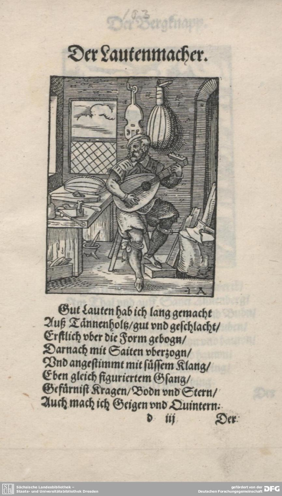

# Varnishing, a Craft of Closure

> Lukas Oberem 
> Spring 2023 
> HIST GU4962: Making and Knowing in Early Modern Europe: Hands-On History

> *Le vernis racoustre tout cela & lunist & rend semblable aulta(n)t en un endroit quen laultre.*
>
> *The varnish mends all this and unites and renders it similar in one place as in another.*[^1]

As a very last step, an artisan adds varnish to a work of craft. With this small addition, we may say, the work receives its last touch. This seemingly simple fact of coating an object with varnish opens up many questions about the structural importance of finalizing an artisanal and artistic work. Varnish perfects the appearance of a work and preserves it with a thin film of oil and resin. By a finger meticulously rubbed over a painting or with a brush applied to a plank, varnish coats glass and metal, wood, and canvas. Especially in the sixteenth and seventeenth centuries, everything can and is potentially covered in varnish. Among a wide variety of recipes in medieval and Renaissance manuscripts, we find a great number for varnish. For instance, up to twenty percent of entries in Ms. Fr. 640 deal with the production and use of varnish.[^2] Ms. Fr. 640 is one of many examples that account for the variety and importance of varnish in the late sixteenth century. Why is varnish so important in the processes of art and craft making? What are the structural implications of varnish being a very last step of a work?

I will show that varnish is supposed to allow closure and provides coherence to the product of craftmanship. To understand this, we have to account for a confusing and striking fact: the meaning and usage of “varnish” is twofold. Varnish embellishes and protects. It is an intermediary step but is used for completion proper. Paradoxically, it is applied on top of an already completed piece of labor. It is precisely the twofoldness of preserving and embellishing that dares to complete the product. Nothing appears to us completed without attempting a final stroke. The final step, however, cannot be a step like all the other changes and improvements of a thing. Closure confusingly lacks the character of a proper work step. A concluding addition is qualitatively radically different from all other additions. We might say, it does not add but it still provides something additional. If closure were just another work step, the process would remain ongoing. In the tension between preserving and decorating, varnish, as we will see, is a means to prompt the practical step of giving coherence to a piece of labor. Varnish realizes the possibility of closure by balancing the otherwise separate steps of addition and preservation.

What is expected and implied when varnish is used?[^3] By focusing mainly on the use of the term “varnish” (*vernis*, *verny*, *Firnis*, *vernix*…) in manuscripts and dictionaries, I found out more about its meaning. In the first step of my study, I turned to recipes and instructions in manuscripts. In addition to Ms. Fr. 640, I took a closer look at the term in De Mayerne's manuscript as well as in Jehan LeBègue's handbook for craftsmen. All three are French manuscripts: LeBègue from the late fifteenth century, Ms. Fr. 640 from the last third of the sixteenth century and De Mayerne from the middle of the seventeenth century. The selected recipes are not limited to painting but gather together instructions for different crafts. I recorded my findings of entries in a table. They are structured, on the one hand, by media and materials and, on the other hand, by their functions (Figs. 1 and 2). Those two categories create the dimensions for the usage of varnish. On the vertical axis we find *Painting*, *Wood, Metal, Stone, Glass*, and *Other* and on the horizontal axis the categories *Preservation, Imitation, Preparation*, *Creation, Undecided*, and *Other*. This first step is, in other words, an empirical investigation of a selection of manuscripts that mention varnish in a number of recipes. In a second step, I looked at dictionaries and their definitions of the term “varnish.” Here as well, we encounter the desire to finalize and close a work, and to protect it. Which is, in most cases, contradicted by the desire to embellish.

As part of the Making and Knowing Project, my essay picks up on a problem that has been mentioned by a series of research essays focusing on Ms. Fr. 640. Let me name a few examples. In her essay, *Black Varnish for Armor,* Celine Camps has drawn attention to the double function of varnish on swords: an anti-rust coating which at the same time imparts luster or brilliance.[^4] We encounter here the difference of protection and embellishment that in my point of view precisely facilitates closure of the artisanal product. Teresa Soley as well points to that problem in her essay *Imitation Marble*.[^5] And, Caroline Marris recognizes the importance of this difference, when she writes in her essay *Varnish for Lutes*: “Varnishes seem to function both as protection, when they completely cover and finish an object, and as a conscious aesthetic choice on the part of the artisan.”[^6]

## Historical Changes in the Understanding of Varnish

To do justice to the concept of varnish, we have to take a step back and move away from today’s understanding of the word. Much of our present knowledge of varnish is influenced by the recent history of painting and musealization. In particular, the later eighteenth and the nineteenth centuries show a more specific interest in varnish. Towards the later eighteenth century, it runs parallel to the professionalization of the conservator.[^7] Conservatorship and their debates about the right treatment of artworks with varnish became more prominent in the wake of the history of musealization and as a result of a market for artworks of past centuries. In our modern understanding, particularly aged varnish is usually understood as an unwanted veil that, due to its oxidation, obscures the  actual painting. It is seen as causing an unwanted patina. The dispute about whether it is historically and aesthetically appropriate to renew a varnish, and in what way, was fought out in fiery discussions, e.g., in the National Gallery in London.[^8] The discussions reached far into the twentieth century with several attempts of cleaning and removing varnish from paintings in the collection as well as revarnishing campaigns. These events affected our understanding of varnish. Varnish is thereby widely understood in the context of the conservation of paintings, which, if treated in a certain way and through certain aging, can have a detrimental effect on the appearance of the painting. For the sixteenth and seventeenth century, we must assume a different understanding of varnish. It is involved in many different processes of production: different purposes, materials, and media. Theodore de Mayerne says strikingly about one of the varnishes he lists: “sur bois, sur toile, sur tout” (on wood, on canvas, on anything).[^9] Marjolijn Bol has pointed out the problem of ambivalence in the term varnish in her just published book, *The Varnish and the Glaze*. She writes:

> Varnishes are perhaps best known for their use on paintings, but in
> the past they were applied to a multitude of objects, including
> metalwork, other types of woodwork, and glass. The purpose of a
> varnish is twofold; it may be used to protect an object from the
> atmosphere and mechanical damage, and it may also have an important
> optical function.[^10]

Many recipes do not show a clear context of use, so it sometimes remains questionable with what kind of goal the substance was used. This openness is relevant and, at first glance, seems to challenge the thesis of this essay. Since varnish is ubiquitous and used in many ways, one can speak of a "universal remedy” that is used in fundamentally different forms. It can be used to prepare a later step of work, as in engravings: “ne luy donne qu’une couche de vernis … Grave aprés avecq la poincte d’acier ce que tu vouldras” (give it only one layer of varnish …. Next engrave with a steel point whatever you want) (fol. [<u>4v</u>](https://edition640.makingandknowing.org/#/folios/4v/f/4v/tl)). It can also be part of a creative process and help determine the final color of an object or serve as a material imitation. As an imitation of gold on silver, naturally yellow colored varnish is used to tint the silver golden, sometimes by adding yellow pigments like saffron or tumeric.[^11] The possible application of varnish includes such diverse topics as the preparation of the material, making of the product, imitation of other materials, sometimes even as an ingredient for cleaning an object, and for medical and cosmetic use.[^12] On the other hand, varnish is, in fact, often used in the context of preservation. As two main functions of varnish, we encounter the difference between embellishment and preservation.

Marjolin Bol has argued that the difference between embellishment and preservation in varnishes is rather a diachronic than a synchronic problem. She has given evidence that manuscripts before 1450 instruct to use varnish more often to imitate a precious material, while manuscripts after 1450 tend to emphasize the function of preserving an object.[^13] She claims that the use of varnish runs parallel to the change in the status of painting in the early Renaissance. The late medieval painter imitates a precious object and his work gains value mostly through the actual value of the materials.[^14] This is part of a narrative in which the work of painting becomes valuable for its own means of representation only with the beginning of art as a “humanistic discipline.” Bol suggests that the use of varnish changes with this paradigm shift in the history of art. Parallel to the loss of significance for material imitation on the art market, varnish becomes a means of preservation. Despite the well-argued thesis of Bol, many medieval and Renaissance manuscripts account for the synchronic use of both types of varnishes: a varnish that preserves and a varnish that embellishes. It seems likely that the shift is relative rather than absolute. Painters might have relied more often on thinner varnishes after 1450, without a total disappearance of varnishes that are meant to imitate. Varnish cannot simply be distinguished as of two different kinds. They are inflected, but this inflection offers the possibility to add without adding and thus to guarantee closure of the craft’s product.

## Universal Remedy

As mentioned above, I have taken a closer look at three manuscripts, Ms. Fr. 640, Jehan LeBègue’s and De Mayerne’s, to reflect on the concept “varnish.”[^15] First, a few notes on the authors' backgrounds: Jehan LeBègue was a notary and compiled his manuscript in 1431. We know that he traveled from Paris through Italy. On his journey, he collected manuscripts on painting and returned in 1411 to Paris, where he composed the manuscript we will examine. Théodore De Mayerne, on the other hand, was educated in different fields and worked as a doctor with a significant interest in alchemy. As a Protestant he left France after the death of Henri IV and the resulting political conflicts. De Mayerne gathered and wrote down recipes for many crafts. About the author-practitioner of Ms Fr. 640, we do not know as much as about the other two. As far as we know, the manuscript may have originated in Paris, but the author-practitioner also lived and worked in Toulouse or the Languedoc region, where he benefited from an environment of rich practical skills and broad intellectual ambitions.[^16] The number of recipes for varnish in all three manuscripts shows the demand for the product and the constant search for the best formula. The outstanding importance of varnish for the early modern period has not been given enough attention in scholarship. Besides the above-mentioned authors and manuscripts, Vasari’s *Vite* and Theophilus’ *De diversis artibus* also offer large *corpora* of recipes.[^17] For these, however, I rendered only a first overview, which needs further verification.

The categories I used to create the tables are based on a closer reading of the different recipes. What I understand in detail under the different categories will be represented exemplarily on the basis of some more specific quotes in the following. Some of the entries, however, cannot be covered by the schema I have sketched out. One difficulty, for example, is that the recipes for varnish often mention neither a material of application nor a function, but merely specify the ingredients. These cases have not been considered for the table. In many cases, it seems that the use of the respective varnish is taken for granted. Unsurprisingly, many recipes have the goal of preserving the painting. In Ms. Fr. 640, I found in total eight recipes that are occupied with *preserving* a product. Two of these are supposed to preserve paintings, another two are made to preserve woodworks, and a total of three is used to preserve works in metal. One additional case talks about the preservation of plaster. The author-practitioner mentions the plaster’s durability in rain and adds that this is especially the case when they \[plaster casts\] are varnished “(mesmem{en}t si elles sont vernies” (especially if they are varnished) (fol. [<u>125r</u>](https://edition640.makingandknowing.org/#/folios/125r/f/125r/tl)). Here, the property of the varnish to preserve something seems natural and does not need further explanation. With regards to paintings, the author-practitioner recommends varnishing paintings after they are dry so that they remain in their original state: “Aussi tost que les couleurs des tableaulx sont bien seiches, les Flamans les vernissent pource que elles ne se meurent point plus qu’elles sont & demeurent en cet estat” (As soon as the colors of panels are well dried, the Flemish varnish them so they do not die any more than they already have & remain in that state) (fol. [<u>32r</u>](https://edition640.makingandknowing.org/#/folios/32r/f/32r/tl)). On the other hand, we find a reference in Theophilus in the twelfth century, where varnish is considered to make both the work more beautiful and durable forever. The author-practitioner, as well as Jehan LeBègue, De Mayerne, and Theophilus mention varnishes with which to treat metal. Evidently these varnishes are made to protect the product but often have a significant aesthetic effect on the material as well. In one example, the author of Ms. Fr. 640 speaks about a yellow varnish to coat sword guards (fol. [<u>96v</u>](https://edition640.makingandknowing.org/#/folios/96v/f/96v/tl)). Here, as in many other recipes, he does not explicitly state what the varnish is used for, but he seems to imply that it is used for protection. The fact that the preservation is often implied but not explicitly stated gives reason to believe that this was the most important function of a varnish in most cases.

In metalworking varnish is also significantly used to *prepare* the material for a subsequent step.[^18] In Ms. Fr. 640, we find a total of five cases for this use. The varnish is, for instance, used to prepare plates for engraving (fol. [<u>4v</u>](https://edition640.makingandknowing.org/#/folios/4v/f/4v/tl)). And in LeBègue, we find another example, where medals in copper are prepared with varnish to be colored and heated over fire.[^19] Furthermore, we encounter examples where varnish is used to *imitate* another material, e.g., gold; as a yellowish layer on silver it can imitate gold.

Moreover, varnish seems to partake in creative processes. In painting as well as in woodwork, colored varnishes were in use. Ms. Fr. 640 mentions a red and yellow varnish for lutes and even a blue varnish (fol. [<u>73r</u>](https://edition640.makingandknowing.org/#/folios/73r/f/73r/tl)). The aesthetic effect varnish is supposed to have on painting is more complicated. Varnish on paintings is often described as making the artwork more beautiful or highlighting the colors. In other words, it has a *creative* function. On fol. [<u>3r</u>](https://edition640.makingandknowing.org/#/folios/3r/f/3r/tl) in Ms Fr. 640, varnish is mentioned as making colors more vivid, but in other cases the author-practitioner warns not to use thick varnish and emphasizes that it does *not* make the painting shine, but, as mentioned above, rather “takes the light out of them” (fols. [<u>93v</u>](https://edition640.makingandknowing.org/#/folios/93v/f/93v/tl) and [<u>3r</u>](https://edition640.makingandknowing.org/#/folios/3r/f/3r/tl). When illumination or other metaphors of light are mentioned, the question arises as to whether it is an aesthetic intervention, or whether there is an underlying preservative intent. De Mayerne, for example, speaks of illumination. And, in older texts such in the collection of recipes known as the *compositiones variae* we find this interest of brightening too: “brighten every painting or carving” (et qualibet opera picta aut scappilata inluciddare super debas).[^20] Despite this ambiguity, the cases where illumination is expressed as an aim I have added to the category of *Creation*. I will later expand on this problem. I added a category of *Undecided* functions for one recipe in Ms. Fr. 640 for woodwork. Here, the author-practitioner mentions the material the varnish is used for but does not specify its function (fol. [<u>73v</u>](https://edition640.makingandknowing.org/#/folios/73v/f/73v/tl)). De Mayerne mentions a couple of varnishes used for furniture and musical instruments without specifying the function.[^21] Two varnishes for metalwork are also unclear as to function.[^22] Under the category *Other*, which refers to materials, I grouped recipes for paper, plaster and wax. One case in De Mayerne’s manuscript describes the making of colors by adding varnish, which I added with one case from Ms. Fr. 640 to the category of *Other* referring to function in addition to material (fol. [<u>85r</u>](https://edition640.makingandknowing.org/#/folios/85r/f/85r/tl)).[^23] The case of color making appears to me as a special case that has less in common with instructions where and how to apply a varnish.

The recipes and recommendations mentioned here are only a few, considering the variety and plenitude of manuscripts that discuss varnish. But even based on this limited information, we may conclude two main aspects: on the one hand, varnish seems to be in use for many different functions. It can prepare certain steps in a process, it is used to imitate other materials, and it can influence the process of creation aesthetically. On the other hand, a recurring focus lies on preservation that can even accompany the other functions. But all recipes seem to uphold a certain tension between addition and preservation with the aim to close either a part or the entire work.

Fig. 1. Varnishes and their function mentioned in Ms Fr. 640

Fig. 2. Varnishes and their function found in Ms Fr. 640, Jehan LeBègue and De Mayerne

## *Vernis, Vernisseur*, *Vernissure* 

Some entries in dictionaries show us what I already concluded above. A dictionary from 1771 (somewhat later than my cases) describes that varnish is used for various functions and various materials, among them iron, paintings, and carriages. The function can be *decoration* or *preservation*: “du fer, du bois, des tableaux, des carrosses, etc. foit pour les orner & les embellir, foit pour les conserver & faire qu'ils ne se gatent pas a l'air” (iron, wood, paintings, carriages, etc. to decorate and embellish them, to preserve them and prevent them from deteriorating in the air.)[^24] So again, reference is made to the wide use of varnish. The entry, moreover, clarifies the functions of varnish: “orner, embellir, conserver” (ornament, embellish, conserve). We find here the ambiguity of meaning in the word for such a broad variety of things and functions. The entry "vernisseur" in an earlier dictionary for Italian and French of 1677 raises questions about the profession that is connected to the procedure of varnishing. Apparently, the “vernisseur” is a person who makes and applies the varnish. “Artisan qui fait des vernis, ou qui les emploie. Quegli che fa o dà la vernice” (Craftsman who makes or uses varnish).[^25] This raises the question of what the role of the "vernisseur" was, and even whether he represented a distinct profession. However, in my research, I found no evidence to assume an independent profession based on guild regulation or other sources. In Hans Sachs and Jost Amman's series of engravings, for example, we do not encounter a vernisseur, despite the otherwise very detailed description of various crafts.[^26] In the case of the lute maker, explicit reference is made to the use of varnish (fig. 3).

Fig. 3. Hans Sachs and Jost Amman, Der Lautenmacher, 1568

We read here “Gefürnist Kragen / Bodn und Stern” (Then I varnish everything: The body, neck, and bridge shine well),[^27] which indicates that the different parts of the instrument had been varnished by the lute maker. Eventually, the step of varnishing is a necessary and important step in the craft of the lute maker. However, the formation of a noun, "vernisseur," to denote the activity shows the importance of the process. Usually, a *nomen agentis* is formed and used only for prominent activities, such as “baker” or “painter.” “Vernisseur” provides not only the denotation of a person's work but can offer from the person's perspective their identification with a particular operation. This gives credit to the fact that varnishing an object was an important and well-thought out step in most work processes. From Dürer’s correspondence, we know that he paid great attention to varnishing his paintings himself, not wanting anyone else to varnish them for his patrons.[^28] Given the fact that in primary sources the individual, even the personal varnish of an artist or school is often put forward, one may assume that varnishing was often done by the master themself. In *the Lexique de l'ancien francaise* we find another designation of the word "vernisseur" here it denotes "Vernisseur, s. m., objet servir a vernir” (object for varnishing).[^29] Hence, it refers to an object that is used for the work, and not to the person who carries out the operation. Strikingly, different objects can and actually are used for the process of varnishing. Even the finger is used to distribute varnish over a work. It accounts for the sensory nature of the artisan’s giving their last touch to the piece.[^30]

A completely different use of the term “vernis,” allegedly common from the ninth to the fifteenth century, raises other, though not completely unrelated, questions. The different meaning is evident from the synonyms: “Vernis, s. m., syn. de castiche, chaussée, digue, barrage, écluse” (mound, causeway, dike, dam, lock).[^31] One source given in the dictionary refers to a text on the making of a barrage from 1497. Thus, in this use, the interest in protection from an external danger is evident. Varnish seems so striking and important for the artisanal trade that a metaphor is eventually formed. Varnish must serve as a barrier against the impact of something to be kept outside, which gives sense to the *tertium comparationis* of preservation and protection.

So far, I was able to find only very little about “varnish’s” usage in poetic language, which would broaden our understanding. In Shakespeare’s Othello we find the following famous line:

> **Othello:**
>
> Yet (by your gracious patience)>
> I will a round unvarnish'd tale deliver>
> Of my whole course of love—what drugs, what charms,>
> What conjuration, and what mighty magic>
> (For such proceeding I am charg'd withal)>
> I won his daughter, [^32]

In addition to those less common usages, in which we find the recurring opposition of embellishment and preservation, it is also instructive to examine the verbs in syntactical conjunction with “varnish.” “Varnish,” as has been shown in the literature, was often used with verbs that signify an illumination. In other words, a rendering of something in brighter light quality. In Dutch we encounter the word “verlichten,”[^33] in latin “illumino.”[^34] Another derivation of the term “vernis” goes along the same lines: "Vernissure, s. f., éclat de ce qui est verni” (shine of what is varnished) – the term indicates the qualities of an object that has been varnished. The entry in the dictionary shows that varnish can often be related to the interest of lightening an object and making it shine more intensively.[^35] Theodore de Mayerne extensively refers to light and metaphors related to light when he talks about varnish. Even a quality like "clarity" indicates visual change. However, the intention may be the opposite.[^36] It is remarkable that varnish is semantically connected to light. Light has ambiguous material properties that resonate with the ambivalent quality varnish can have. Light becomes visible on a surface as reflection. It is not part of the surface proper, but it is important for the surface’s appearance. Especially in painting, where visual appearance is most important, light is the membrane that manages the connection between the inner and outer world of the painting. Light is also a factor that is part of the painting’s environment and thus not necessarily of the object itself, though even the lighting of a room will change the qualities of an image drastically. Light and varnish can both be considered as external to the actual object and at the same time impact the internal form.[^37] In the Strasbourg manuscript, we find descriptions of varnish managing qualities of light as well: “guten virnis machen der luter und glantz ist als ein cristalle” (good varnish that is clear and bright like a crystal).[^38] The intent is to say that a good varnish does not show itself prominently. But contradictory, this absence is positively expressed by the quality of light. This problem goes along the same lines as the structural conflict between embellishment and preservation. In Ms. Fr. 640, the author-practitioner seems averse to the effects of light. His aversion shows, however, the importance of the discourse of light and varnish: “On ne vernist pas pour faire luire les tableaux car cela ne faict quoster leur jour” (One does not varnish to make paintings shine, for it just takes the light out of them). But he says that varnish “rehaulser les couleurs qui sont imbeues” (heightens some colors which have soaked in) (fol. [<u>3r</u>](https://edition640.makingandknowing.org/#/folios/3r/f/3r/tl)). This discourse about light shows the intent of closure under managing the tension between embellishment and preservation.

Most verbs indicate a topographical understanding of varnish, namely that it is applied to and on top of something. This seems unsurprising at first. The German, for example, speaks of “anstreichen.”[^39] The prefix “an” makes the topical quality of varnish evident. In Latin, "superliniare" (Theophilus) assumes a similar topography. This is contradicted, however, by "illinere," and as a participle "illinitus." The etymology of the word is “in - linere,” where the prefix “in” is self-explanatory to the English speaker and “linere” means to seal or cover. In French "enduire" is mentioned in dictionaries. Accordingly, the French is closer to the second Latin word, where something penetrates the picture surface to some degree. In older manuscripts we find the notion of topical application as well. The *compositiones variae* give the prompt to apply varnish over colors (“super colores”).[^40] If we are talking about paintings, the question is whether the varnish is part of the painting, part of the material that creates the painting, part of the support medium such as canvas or panel, or not even considered part of the painting. Is the varnish, in a sense, an invisible but necessary part of the work? And in other objects, is the varnish a necessary part of the functionality of an object or only a contingent addition? The number of entries makes such contingency seem unlikely. The topography and contingency of varnish is part of the embellishment and preservation of the already complete object. To get a better grip on this, it will help to consider a short essay by Otto Kurz.

Kurz was one of the few art historians of the past that took this structural problem seriously. In a shorter 1962 essay, *Varnishes, Tinted Varnishes, and Patina,* Kurz tackled the problem of defining what a varnish is. Kurz mentions Theodore de Mayerne’s manuscript, cites Dürer’s handling of varnishes, and refers to a number of Italian sources. Kurz focused on the question of whether a varnish is part of the painting or not. Kurz distinguished between two types of varnish:

> Unfortunately, we have to keep in mind that the word varnish is used
> in two senses, varnish being (1) the protective layer on top of a
> picture, and (2) a resinous solution which can be used as a vehicle in
> painting as well as for coating. In other words, one can paint with
> varnish, and varnish with oil. The Old Masters did both. It is
> therefore imperative to state from the beginning in which sense one
> uses the word.[^41]

While the varnish of the first sense mentioned by Kurz is “on top” and so to say “not part of the painting,”[^42] the second type of varnish is definitely part of the painting. Because of the ambiguity of the term, Kurz suggests finding a clear definition. But answering an imperative in what sense the term varnish should be used does not solve the problem at hand. Rather than solving the problem by making a definition and terminological decision, I am trying to analyze the complexity and ambivalence of the word in its historical context. I am convinced that something can be gained from the ambiguity of the term. So, rather than resolving the complexity by definition, I would like to draw attention to the paradoxical overlaps. Using the various manuscripts, I have shown that we encounter different functions of varnish, for example, imitation, creation or preparation for a subsequent work step. Often, however, the focus is to preserve objects. By definition, preservation of an object should consist precisely in the fact that nothing changes, but everything remains as it is. Interestingly, however, this is rarely addressed in this manner. Preservation is usually accompanied by an alteration. The concept of varnish invites preservation and change to be paradoxically superimposed. In the final part of this paper, therefore, I want to ask what this superimposition might serve. In doing so, I offer an interpretive possibility that starts from the material studied and delves into the process of varnishing as a practice.

## Desire for Closure without Addition

The difference between embellishing and preserving an object does not simply present as two different aspects of the same thing. From a topographical perspective, varnish is usually considered to be on top of *all*. This implies that varnish is not a substantial part of the object, it is only the *surplus*. At the same time, varnish seems to be an important and much demanded step to finalize or complete a product. Varnish is neither a proper part nor simply contingent. We are not solely talking about two entirely different aspects of the same thing that are materially formed by the same elements. But we have to account for the fact that both of these functions come together in one word. Being torn between a last embellishment and the eternal reservation of a thing, we may cautiously ask about something I would like to call the structural function of varnish. Precisely because of the ambivalence, varnish offers a means to conclude the piece of work. The physical application and the semantics of varnish provide this means. It gathers the whole, because it adds without necessarily adding something that predominantly affects the object. If the meaning of varnish were limited to adding a certain quality, it would be in danger of not completing the whole and bringing it to a conclusion, but merely adding another step, leaving the story open ended. “Varnish’s” semiotics circle around adding something by at the same time suspending any addition. In this sense, a varnish is supplementary – it adds to the completed, it is contingent but apparently necessary to fully conclude the work.[^43]

If we are empathetic with the “vernisseur,” we may account for the psychological disposition of varnishing. After working on an object for weeks or months, a craftsman will make the decision to finally complete their work. This is one point where they apply varnish. We could even say that the very action of applying varnish is a manifestation of the conclusion of craft both in physical terms as well as in the semantics embodied in the craft making process, held and enacted through a relationship between artisan and object and provided by the manifold extension of the word varnish. Until the step of varnishing, the work remains open, the varnishing guarantees closure and coherence in form. As long as the varnish has not been applied, the structure and the “story” of an object might be rearranged by adding or changing something. This is true for steps of preparation too, which are intermediate steps of the process. In these cases, varnish *ends* temporally a first part of the process.[^44] One may  assume that those intermediate varnishes semiotically stand for a conclusion of one layer of the painting, ending one work step. A varnish provides the desired stability of the material and a stability of the whole. *Ending* considers in particular the temporal structure of production; bringing the process or a work step to an end. However, varnish also contributes to a *closure* of the work, which refers to the internal coherence, and structure and thus is not primarily temporal.[^45] Varnish is a developed means to provide this structural step and the ability to perceive the work as ended and completed. The  author-practitioner points to the function of closing when he says: “Le vernis racoustre tout cela & lunist & rend semblable aulta(n)t en un endroit quen laultre” (The varnish mends all this and unites and renders it similar in one place as in another) (fol. [<u>66r</u>](https://edition640.makingandknowing.org/#/folios/66r/f/66r/tl)). The notion of cohesion is important, even in cases where the applied varnish is expected to have as little aesthetic effect as possible.

In the field of painting, it is worth looking at the time between the actual completion of the object and the varnishing of the same. Dürer as well as Cennini report a period of years between the delivery of the artwork and its varnishing. The artist or craftsman has the opportunity to return to the object another time and finally finish it after it has dried, presumably grappling with feelings of mourning and gratification for a final closure.[^46] We know from his correspondence with Heller, that years after the completion of the painting, Dürer returns to finally end and close his painting. However, it is necessary that the master himself determines the varnish, “denn alle andere furneiß sind gelb, und man wurde euch die Taffel verderben” (because all the other varnishes are yellow and you would ruin your painting).[^47] In Cennini we find remarks that the painting remains in the process of changing long after its completion, because materially it is constantly altering. Only after several years the painter returns to his work, which has long reached its destination, to finally varnish it and bring it to completion.

> Know that the most lovely and the best varnishing that exists comes
> about because the longer you put it off after the painting of your
> panel, the better it is; I say definitely waiting several years, and
> at least one… varnishing at the point when the pigments with their
> binders have run their course, they then become really fresh and
> lovely, also staying in the same state forever (nono poi freschissimi
> ebegli e stando in edenti forma sempre).[^48]

In this quote by Cennini, the want to conclude can be connected to the want to preserve for *eternity,* forever. This is a trope that we encounter very often in manuscripts that discuss varnish. Leonardo, for instance, writes “per fare una pittura d’eterna vernice” (to make a painting of eternal varnish).[^49] The desire to create a varnish that lasts forever is also found in Dürer. He says about his paintings “it will stay fresh and clean for five hundred years” (das sie 500 jahr sauber und frisch sein worst). And the varnish increases the durability of the painting by another 100 years. “100 years longer than it would before” (so wirdt sie aber 100 jahre lenger stehen den vor).[^50] The varnish does not only help to conclude and finish, but it projects the completed work into a numerically sublime future.

Semiotically, the term “varnish,” as shown, always comes back to the tension between decoration and preservation. This tension between adding and preserving, between embellishing by preserving and conserving by embellishing makes varnish both a practical and semantically inflected tool that seeks to enable the crucial act of completing a work process and concluding an experience of craft.

# Bibliography

Bol, Marjolijn. *The Varnish and The Glaze, Painting Splendor with Oil, 1100-1500*. Chicago: University of Chicago Press, 2023.

Brachert, Thomas. *Patina.* *Vom Nutzen und Nachteil der Restaurierung*. Munich: Callwey, 1985.

Camps, Celine. “Black Varnish for Armor.” In *Secrets of Craft and Nature in Renaissance France. A Digital Critical Edition and English Translation of BnF Ms. Fr. 640*, edited by Making and Knowing Project, Pamela H. Smith, Naomi Rosenkranz, Tianna Helena Uchacz, Tillmann Taape, Clément Godbarge, Sophie Pitman, Jenny Boulboullé, Joel Klein, Donna Bilak, Marc Smith, and Terry Catapano. New York: Making and Knowing Project, 2020. <https://edition640.makingandknowing.org/#/essays/ann_071_fa_18>. DOI: <https://www.doi.org/10.7916/5qhq-ky36>.

Cennini, Cennino. *Il Libro dell’Arte*. Edited by Lara Broecke. London: Archetype Publications, 2015.

De Bègue, Jehan in *Original Treatises dating from the XIIth to XVIIIth Centuries on the Arts of Painting*, 2 vols. Edited by Mary Philadelphia Merrifield. London: John Murray, 1849.

Delaney, John K. et al.. “The Role of Varnishes in Modifying Light Reflection from Rough Surfaces. A study of changes in light scattering caused by variations in varnish topography and development of a drying model. *Studies in Conservation* 53, (2008): 170-186.

De Mayerne, Theodore. Manuscript, in *Quellen fur Maltechnik waehrend der Renaissance und deren Folgezeit (XVI.-XVIII. Jahrhundert) in Italien, Spanien, den Niederlanden, Deutschland, Frankreich und England nebst dem De Mayerne Manuskript*. Edited by Ernst Berger. München: Callwey, 1901.

Derrida, Jacques. *Of Grammatology*. Baltimore: John Hopkins University Press, 1974.

Derrida, Jacques. *The Truth in Painting*. Chicago: University Press of Chicago, 1987.

Di Villanova, Francesco de Alberti, ed. *Nouveau dictionnaire francois-italien (italiano-francese), compose sur les dictionnaires de l’Académie de France et de la Crusca*, vol. 1. Mossy 1771. 

Dürer, Albrecht. *Schriftlicher Nachlass*, 3 vols. Edited by Hans Rupprich. Berlin: Deutscher Verlag für Kunstwissenschaft, 1956-69.

Estrades, Ana. “Jasper Imitation on Horn.” In *Secrets of Craft and Nature in Renaissance France. A Digital Critical Edition and English Translation of BnF Ms. Fr. 640*, edited by Making and Knowing Project, Pamela H. Smith, Naomi Rosenkranz, Tianna Helena Uchacz, Tillmann Taape, Clément Godbarge, Sophie Pitman, Jenny Boulboullé, Joel Klein, Donna Bilak, Marc Smith, and Terry Catapano. New York: Making and Knowing Project, 2020. <https://edition640.makingandknowing.org/#/essays/ann_028_fa_15>. DOI:
<https://www.doi.org/10.7916/jv1e-zr84>.

Etienne, Noemie. *The Restoration of Paintings in Paris, 1750-1815*. Los Angeles: Getty Publications, 2017.

Foyer, Emilie. “Color of Gold without Gold on Silver.” In *Secrets of Craft and Nature in Renaissance France. A Digital Critical Edition and English Translation of BnF Ms. Fr. 640*, edited by Making and Knowing Project, Pamela H. Smith, Naomi Rosenkranz, Tianna Helena Uchacz, Tillmann Taape, Clément Godbarge, Sophie Pitman, Jenny Boulboullé, Joel Klein, Donna Bilak, Marc Smith, and Terry Catapano. New York: Making and Knowing Project, 2020. <https://edition640.makingandknowing.org/#/essays/ann_032_fa_15>. DOI: <https://www.doi.org/10.7916/jz70-zv73>.

Godefroy, Frédéric, ed. *Lexique de l’ancien francaise*, vol. 8. Paris: Librairie Honoré Champion, 1982 (1902).

Herrnstein Smith, Barbara. *Poetic Closure: A Study of How PoeMs End*. Chicago & London: Chicago University Press, 1968.

Kurz, Otto. “Varnishes, Tinted Varnishes, and Patina.” *The Burlington Magazine* 104, no. 707, (1962): 56-59.

Liebaut, Jean. *Trois livres de l’embellisement et ornement du corps humain*. Paris: Jacques du Puys 1582.

Marris, Caroline and Stephanie Pope. “Varnish for Lutes.” In *Secrets of Craft and Nature in Renaissance France. A Digital Critical Edition and English Translation of BnF Ms. Fr. 640*, edited by Making and Knowing Project, Pamela H. Smith, Naomi Rosenkranz, Tianna Helena Uchacz, Tillmann Taape, Clément Godbarge, Sophie Pitman, Jenny Boulboullé, Joel Klein, Donna Bilak, Marc Smith, and Terry Catapano. New York: Making and Knowing Project, 2020. <https://edition640.makingandknowing.org/#/essays/ann_019_sp_15>. DOI: <https://www.doi.org/10.7916/zd0f-yv91>.

Merrifield, Mary Philadelphia, ed. *Original Treatises dating from the XIIth to XVIIIth Centuries on the Arts of Painting*. 2 vols. London: John Murray, 1849.

Neven, Sylvie, ed. *The Strasbourg Manuscript: A Medieval Tradition of Artists’ Recipe Collections*. London: Archetype, 2016.

Price, Michael. “Two Author-Practitioners in Dialogue across Time.” In *Secrets of Craft and Nature in Renaissance France. A Digital Critical Edition and English Translation of BnF Ms. Fr. 640*, edited by Making and Knowing Project, Pamela H. Smith, Naomi Rosenkranz, Tianna Helena Uchacz, Tillmann Taape, Clément Godbarge, Sophie Pitman, Jenny Boulboullé, Joel Klein, Donna Bilak, Marc Smith, and Terry Catapano. New York: Making and Knowing Project, 2020.
<https://edition640.makingandknowing.org/#/essays/ann_514_ad_20>.

Sachs, Hans. *Eygentliche Beschreibung Aller Stände auff Erden …*. Frankfurt am Main, 1568.

Sachs, Hans. *A sixteenth-century book of trades. Das Ständebuch*. Translated by Theodore K. Rabb. Palo Alto: The Society of Promotion of Promotion of Science and Scholarship, 2009.

Shakespeare, Othello Act 1, scene 3, 89–94.

Smith, Pamela H. “An Introduction to Ms. Fr. 640 and its Author-Practitioner.” In *Secrets of Craft and Nature in Renaissance France. A Digital Critical Edition and English Translation of BnF Ms. Fr. 640*, edited by Making and Knowing Project, Pamela H. Smith, Naomi Rosenkranz, Tianna Helena Uchacz, Tillmann Taape, Clément Godbarge, Sophie Pitman, Jenny Boulboullé, Joel Klein, Donna Bilak, Marc Smith, and Terry Catapano. New York: Making and Knowing Project, 2020. https://edition640.makingandknowing.org/#/essays/ann_300_ie_19. DOI: https://www.doi.org/10.7916/ny3t-qg71.

Soley, Teresa. “Imitation Marble.” In *Secrets of Craft and Nature in Renaissance France. A Digital Critical Edition and English Translation of BnF Ms. Fr. 640*, edited by Making and Knowing Project, Pamela H. Smith, Naomi Rosenkranz, Tianna Helena Uchacz, Tillmann Taape, Clément Godbarge, Sophie Pitman, Jenny Boulboullé, Joel Klein, Donna Bilak, Marc Smith, and Terry Catapano. New York: Making and Knowing Project, 2020. <https://edition640.makingandknowing.org/#/essays/ann_040_sp_16>. DOI: <https://www.doi.org/10.7916/tpgj-d438>.

Starn, Rudolph. “Three Ages of ‘Patina’ in Painting.“ *Representations* 78, no. 1, (2002): 86-115.

Theophilus. *De Diversis Artibus*. Translated by Robert Hendrie. London: John Murray, 1847.

Vasari, Giorgio. *Vasari on Technique*. Edited by Baldwin Brown. London: Dent & Company, 1907.

Widerhold, Johann Hermann, ed. *Nouveau dictionaire francois-italien et italien-francois. Suivi d’un autre dictionaire latin-francois-italien …*. Geneva, 1677.

[^1]: Making and Knowing Project, Pamela H. Smith, Naomi Rosenkranz, Tianna Helena Uchacz, Tillmann Taape, Clément Godbarge, Sophie Pitman, Jenny Boulboullé, Joel Klein, Donna Bilak, Marc Smith, and Terry Catapano, eds., *Secrets of Craft and Nature in Renaissance France. A Digital Critical Edition and English Translation of BnF Ms. Fr. 640* (New York: Making and Knowing Project, 2020), [<u>https://edition640.makingandknowing.org/#/folios/66r/f/66r/tc</u>](https://edition640.makingandknowing.org/#/folios/66r/f/66r/tc).

[^2]: See also Michael Price, “Two Author-Practitioners in Dialogue across Time.” In *Secrets of Craft and Nature in Renaissance France. A Digital Critical Edition and English Translation of BnF Ms. Fr. 640*, edited by Making and Knowing Project, Pamela H. Smith, Naomi Rosenkranz, Tianna Helena Uchacz, Tillmann Taape, Clément Godbarge, Sophie Pitman, Jenny Boulboullé, Joel Klein, Donna Bilak, Marc Smith, and Terry Catapano (New York: Making and Knowing Project, 2020), [<u>https://edition640.makingandknowing.org/#/essays/ann_514_ad_20</u>](https://edition640.makingandknowing.org/#/essays/ann_514_ad_20).

[^3]: My investigation will thus focus less on the actual material properties and differences of various varnishes than on their description within the sources under study. As a matter of fact, this study lacks an accurate analysis of nuances in the meaning of “varnish” for each individual manuscript. Instead, this study rather tries to grasp the gathered nuances by following what language does, that is, gathering the broad extension under one word and trying to understand its intention.

[^4]: Celine Camps, “Black Varnish for Armor.” In *Secrets of Craft and Nature in Renaissance France. A Digital Critical Edition and English Translation of BnF Ms. Fr. 640*, edited by Making and Knowing Project, Pamela H. Smith, Naomi Rosenkranz, Tianna Helena Uchacz, Tillmann Taape, Clément Godbarge, Sophie Pitman, Jenny Boulboullé, Joel Klein, Donna Bilak, Marc Smith, and Terry Catapano (New York: Making and Knowing Project, 2020). [<u>https://edition640.makingandknowing.org/#/essays/ann_071_fa_18</u>](https://edition640.makingandknowing.org/#/essays/ann_071_fa_18). DOI: [<u>https://www.doi.org/10.7916/5qhq-ky36</u>](https://www.doi.org/10.7916/5qhq-ky36).

[^5]: Teresa Soley, “Imitation Marble.” In *Secrets of Craft and Nature in Renaissance France. A Digital Critical Edition and English Translation of BnF Ms. Fr. 640*, edited by Making and Knowing Project, Pamela H. Smith, Naomi Rosenkranz, Tianna Helena Uchacz, Tillmann Taape, Clément Godbarge, Sophie Pitman, Jenny Boulboullé, Joel Klein, Donna Bilak, Marc Smith, and Terry Catapano (New York: Making and Knowing Project, 2020). [<u>https://edition640.makingandknowing.org/#/essays/ann_040_sp_16</u>](https://edition640.makingandknowing.org/#/essays/ann_040_sp_16).DOI: [<u>https://www.doi.org/10.7916/tpgj-d438</u>](https://www.doi.org/10.7916/tpgj-d438).

[^6]: Caroline Marris and Stephanie Pope, “Varnish for Lutes.” In *Secrets of Craft and Nature in Renaissance France. A Digital Critical Edition and English Translation of BnF Ms. Fr. 640*, edited by Making and Knowing Project, Pamela H. Smith, Naomi Rosenkranz, Tianna Helena Uchacz, Tillmann Taape, Clément Godbarge, Sophie Pitman, Jenny Boulboullé, Joel Klein, Donna Bilak, Marc Smith, and Terry Catapano (New York: Making and Knowing Project, 2020), [<u>https://edition640.makingandknowing.org/#/essays/ann_019_sp_15</u>](https://edition640.makingandknowing.org/#/essays/ann_019_sp_15). DOI: [<u>https://www.doi.org/10.7916/zd0f-yv91</u>](https://www.doi.org/10.7916/zd0f-yv91).

[^7]: See Noemie Etienne, *The Restoration of Paintings in Paris, 1750-1815* (Los Angeles: Getty Publications, 2017).

[^8]: See other contributions in the same edition: Ernst H. Gmombrich, “Dark Varnishes. Veriations on a Theme from Pliny.” In *The Burlington Magazine*, 1962, Vol. 104, Nr. 707, 51-55. see also Thomas Brachert, *Patina. Vom Nutzen und Nachteil der Restaurierung* (Munich: Callwey, 1985). Or: Rudolph Starn, “Three Ages of ‚Patina’ in Painting,” *Representations* 78, no. 1, (2002): 86-115.

[^9]: De Mayerne in *Quellen fuer Maltechnik während der Renaissance und deren Folgezeit (XVI.-XVIII. Jahrhundert) in Italien, Spanien, den Niederlanden, Deutschland, Frankreich und England nebst dem De Mayerne Manuskript*, ed. Ernst Berger (Munich: Callwey, 1901), 184.

[^10]: Marjolin Bol, *The Varnish and The Glaze: Painting Splendor with Oil, 1100-1500* (Chicago: University of Chicago Press, 2023), 53. 

[^11]: See an extensive analysis of this topic in Emilie Foyer, “Color of Gold without Gold on Silver.” In *Secrets of Craft and Nature in Renaissance France. A Digital Critical Edition and English Translation of BnF Ms. Fr. 640*, edited by Making and Knowing Project, Pamela H. Smith, Naomi Rosenkranz, Tianna Helena Uchacz, Tillmann Taape, Clément Godbarge, Sophie Pitman, Jenny Boulboullé, Joel Klein, Donna Bilak, Marc Smith, and Terry Catapano (New York: Making and Knowing Project, 2020), [<u>https://edition640.makingandknowing.org/#/essays/ann_032_fa_15</u>](https://edition640.makingandknowing.org/#/essays/ann_032_fa_15). DOI: [<u>https://www.doi.org/10.7916/jz70-zv73</u>](https://www.doi.org/10.7916/jz70-zv73);

[^12]: Bol, *Varnish and Glaze*, 58-59: She references e.g., Pliny; see as well Jean Liebaut, *Trois livres de l’embellisement et ornement du corps humain* (Paris: Jacques du Puys, 1582), 35.

[^13]: Bol, *Varnish and Glaze*, 104: she writes, for example, “The recipes contained in the Strasbourg family of manuscripts are the earliest indication that the medieval practice of varnishing with dark and viscous substances might be slowly changing.”

[^14]: For example, Michael Baxandall, in his 1972 study *Painting and Experience in fifteenth-century Italy*, showed that for the application of specific materials like gold or lapis higher prices are paid.

[^15]: Jehan DeBègue in *Original Treatises dating from the XIIth to XVIIIth Centuries on the Arts of Painting*, 2 vols, Mary Philadelphia Merrifield, ed. (London: John Murray, 1849); Berger, *De Mayerne*.

[^16]: Pamela H. Smith, “An Introduction to Ms. Fr. 640 and its Author-Practitioner,” in *Secrets of Craft and Nature in Renaissance France. A Digital Critical Edition and English Translation of BnF Ms. Fr. 640*, edited by Making and Knowing Project, Pamela H. Smith, Naomi Rosenkranz, Tianna Helena Uchacz, Tillmann Taape, Clément Godbarge, Sophie Pitman, Jenny Boulboullé, Joel Klein, Donna Bilak, Marc Smith, and Terry Catapano (New York: Making and Knowing Project, 2020). [<u>https://edition640.makingandknowing.org/#/essays/ann_300_ie_19</u>](https://edition640.makingandknowing.org/#/essays/ann_300_ie_19). DOI: [<u>https://www.doi.org/10.7916/ny3t-qg71</u>](https://www.doi.org/10.7916/ny3t-qg71).

[^17]: Vasari, *Vasari on Technique*, ed. Baldwin Brown (London: Dent & Company, 1907); Theophilus, *De Diversis Artibus* (London: Johannes Murray, 1847).

[^18]: See Camps for more insights on this; she grapples as well with the contradictory meaning of varnish; Celine Camps, “Black Varnish for Armor,” [<u>https://edition640.makingandknowing.org/#/essays/ann_071_fa_18</u>](https://edition640.makingandknowing.org/#/essays/ann_071_fa_18). DOI: [<u>https://www.doi.org/10.7916/5qhq-ky36</u>](https://www.doi.org/10.7916/5qhq-ky36).

[^19]: Merryfield, Jehan LeBègue, 106.

[^20]: Bol, *Varnish and Glaze*, 60.

[^21]: Berger, *De Mayerne*, 179, 183, and 189.

[^22]: Berger, *De Mayerne*, 187.

[^23]: Berger, *De Mayerne*, 363.

[^24]: *Nouveau dictionnaire francois-italien (italiano-francese), compose sur les dictionnaires de l’Académie de France et de la Crusca*, vol. 1, ed. Francesco de Alberti di Villanova ed. (Mossy 1771), 914.

[^25]: *Nouveau dictionaire francois-italien et italien-francois. Suivi d’un autre dictionaire latin-francois-italien…*, ed. Johann Hermann Widerhold (Geneva, 1677).

[^26]: Hans Sachs, *Eygentliche Beschreibung Aller Stände auff Erden..*. (Frankfurt am Main, 1568).

[^27]: Sachs, *Eygentliche Beschreibung*, following the translation of Hans Sachs, *A sixteenth-century book of trades. Das Ständebuch*, trans. Theodore K. Rabb (Palo Alto: The Society of Promotion of Science and Scholarship, 2009), 207.

[^28]: Albrecht Dürer, *Schriftlicher Nachlass*, 3 vols., ed. Hans Rupprich (Berlin: Deutscher Verlag für Kunstwissenschaft, 1956-69), 1:72-73 (no. 19).

[^29]: *Lexique de l’ancien francaise*, vol. 8, ed. Frédéric Godefroy (Paris: Librairie Honoré Champion, 1982/1902), 199.

[^30]: Soley, “Imitation Marble,” who references fols. [<u>3r</u>](https://edition640.makingandknowing.org/#/folios/3r/f/3r/tl)  and [<u>97v</u>](https://edition640.makingandknowing.org/#/folios/97v/f/97v/tl), where, in both entries, the finger is used as the tool for varnishing.

[^31]: *Lexique de l’ancien francaise*, vol. 8, 199.

[^32]: Shakespeare, Othello Act 1, scene 3, 89–94.

[^33]: Bol, *Varnish and Glaze*, 86.

[^34]: Bol, *Varnish and Glaze*, 86.

[^35]: Godefroy, *Lexique*, 199.

[^36]: Berger, *De Mayerne*, e.g. 331.

[^37]: In fact, the modeling of light by varnishes has been the main aspect of conservatory investigations. See John K. Delaney et al., “The Role of Varnishes in Modifying Light Reflection from Rough Surfaces. A study of changes in light scattering caused by variations in varnish topography and development of a drying model, *Studies in Conservation*, no. 53, (2008): 170-186.

[^38]: Quoted after Bol, *Varnish and Glaze*, 95; *The Strasbourg Manuscript: A Medieval Tradition of Artists’ Recipe Collections*, ed. Sylvie Neven (London: Archetype, 2016), 134-35 no. 92.

[^39]: *Dictionarium Teutsch-Frantzösisch-Italiänisch-Lateinisch: Frantzösisch-Teutsch-Italiänisch-Lateinisch: Italiänisch-Frantzösisch-Teutsch-Lateinisch: Lateinisch-Teutsch-Frantzösisch-Italiänisch*, ed. Levinus Hulsius, 1627, 421.

[^40]: Bol, *Varnish and Glaze*, 60.

[^41]: Otto Kurz, “Varnishes, Tinted Varnishes, and Patina,” in: *The Burlington Magazine*, 104, 707, 1962, 56-59, 56.

[^42]: Ibid.; Kurz quotes Charles Johnson, *The language of painting* (Cambridge: Cambridge University Press, 1949), 143: "A varnish is an addition to the painting, not part of it."

[^43]: The structure of supplement has been developed in depth by Jacques Derrida, e.g., in Jacques Derrida, *Of Grammatology* (Baltimore: John Hopkins University Press, 1974), 145, where he notes that the supplement is “compensation for (*sous l’espèce de la suppléance*) what ought to lack nothing at all in itself.” See as well Jacques Derrida, *The Truth in Painting* (Chicago: University Press of Chicago, 1987), esp. Chap. 2.

[^44]: Berger, *De Mayerne*, 335.

[^45]: I am referencing here Barbara Herrnstein Smith, *Poetic Closure. A Study of How Poems End* (Chicago: University of Chicago Press, 1968).

[^46]: Renewals of the varnish were often done, with which a following opening and closing of the work would be implied.

[^47]: Albrecht Dürer, *Schriftlicher Nachlass*, 3 vols, ed. Hans Rupprich (Berlin: Deutscher Verlag für Kunstwissenschaft), 1956-69, 1:72-73 (no. 19).

[^48]: Cennino Cennini, *Il Libro dell’Arte*, Lara Broecke ed. (London: Archetype Publications, 2015), 199-200, no. 168.

[^49]: Berger, *De Mayerne*, 201.

[^50]: Albrecht Dürer, *Schriftlicher Nachlass*, 1:72-73 (no. 19).
