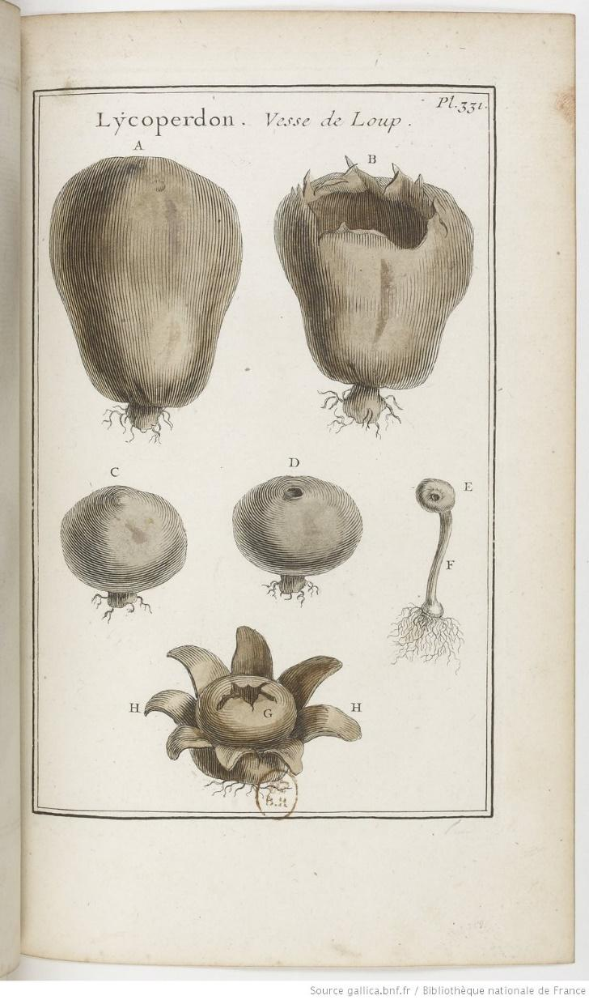
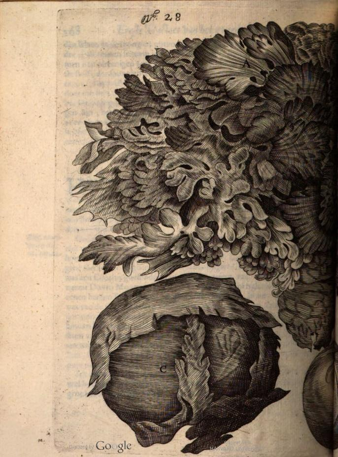
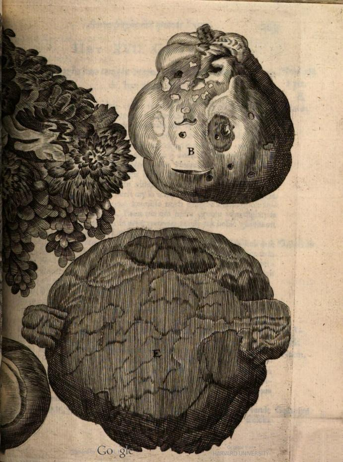
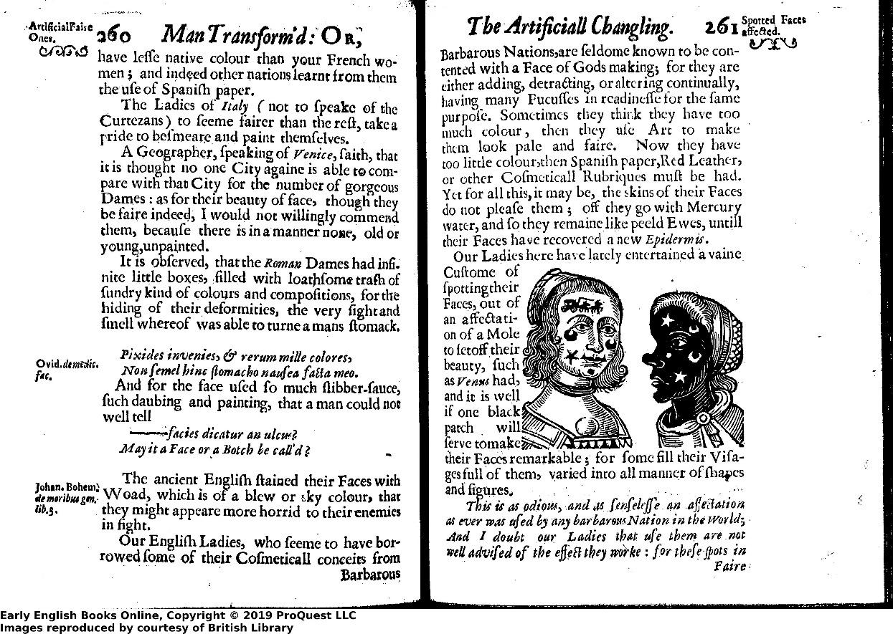

# Puffball Mushrooms and Early Modern Race-Making: A Skin-Whitening Recipe in BnF Ms. Fr. 640

> Sumant Rao 
> Spring 2023 
> HIST GU4962: Making and Knowing in Early Modern Europe: Hands-On History

## Introduction

In Thomas Heywood’s and Richard Brome’s play *The Late Lancashire Witches* (1634), a wedding party is awaiting an extravagant banquet; suddenly, after the host reads out the menu, a woman runs on stage and exclaims that their feast has undergone a horrible transformation:

>‘O husband, O guests, O sonne, O Gentlemen, such a chance in a Kitchin was never 
> heard of, all the meat is flowne out o’ the chimney top I thinke, and
> nothing instead of it, but Snakes, Bats, Frogs, Beetles, Hornets, and
> Humble-bees; all the Sallets are turn’d to Iewes-eares, Mushromes, and
> *Puck fists*; and all the Custards into Cow sheards!’[^1]

As Laura Seymour argues, the rapidity of this metamorphosis and the degree of sensory change—the stark mutation of taste, texture, smell, visual appearance, etc.—represents to the characters (and the audience) clear evidence that the gathering has been attacked by witches.[^2] For instance, the association of “Mushromes” and the supernatural was quite common; in *The Tempest* (1611), Prospero calls out to his invisible fairies, “ye elves of hills, brooks, standing lakes and groves,” that inhabit the island, “whose pastime / Is to make midnight-mushrooms, that rejoice / To hear the solemn curfew.”[^3] Indeed, from the perspective of early modern sensory and material culture, what interests me are the specific items that Heywood and Brome list that conjure this realization of mischief, disgust, and magic—namely, “Puck fists,” an early modern name for a group of mushrooms we more commonly call puffballs **(Fig. 1)**. The puffball makes an appearance a single time in BnF Fr. 640 in a recipe entitled “For whitening the face:” “Pestle puffball in cistern water, & no other, & wash with this whitened water. This is considered quite singular. And I believe that making it from wheat starch & to use it would be even better.”[^4] In this essay, I will be discussing this material in detail—its early modern usage and cultural associations, its appearance as the principal ingredient in a cosmetic recipe for skin-whitening in BnF Fr. 640, and, additionally, the social context of emergent ideas about skin color and racialized difference in this period.

Figure 1: “Plate 331: Lycoperdon. Vesse de Loup.” In *Elemens de botanique, ou Methode pour connoître les plantes. III.*, by Joseph Pitton de Tournefort, Vol. 3. 3 vols. Paris: A Paris, de l’Imprimerie royale, 1694. [<u>https://gallica.bnf.fr/ark:/12148/btv1b8453979v</u>](https://gallica.bnf.fr/ark:/12148/btv1b8453979v).

## Puffballs in Early Modern Herbals, Medical Tracts, and Recipe Books

Puffballs, also called puckfists, appear widely across different sixteenth- and seventeenth-century herbals, medical tracts, and recipe books, contextualizing the author-practitioner’s inclusion of it in BnF Fr. 640. At first glance, the term “puffball” seems to refer to the appearance and behavior of these mushrooms since a typical puffball mushroom is a “globose fruiting body (ball) which on the rupturing of the outer wall at maturity discharges a cloud of powdery spores (puff).”[^5] However, etymologically, the word “puckfist” has older usage than “puffball,” deriving from the Old English *puca/pucel*
(“goblin”) and *feist/fist* (“a breaking wind, foul smell, fart”).[^6] Likely and perhaps humorously referring to the cloud of dust-like spores emitted when someone mistakenly kicks or breaks a ripe puffball, this etymological conjunction of “non-human creature + fart” occurs across the Indo-European language group to refer to the mushroom—for example, *wolfsveest* in Dutch (“wolf’s fart”), *vescia di lupo* in Italian (“wolf’s fart”), *pet de bou* in Catalan (“ox’s fart”), *lupi crepitus* in botanical Latin (“wolf’s rustling/prattling”), *vesse de loup* (“wolf’s fart”) in French, etc.[^7] Biologically, the scholarly consensus among mycologists is that the categorical group “puffballs” is polyphyletic, consisting of many different (though the exact number is contested) evolutionary genera of fungi, such as *Calvatia*, *Calbovista*, *Calostoma*, and *Lycoperdon*, that have adapted the same method of dispersing spores on the wind via convergent evolution.[^8] This biological diversity of species might explain why this class of mushrooms had so many variational names in the early modern period, even just in English, French, and Latin.[^9] In BnF Fr. 640, the author-practitioner refers to a specific species of puffball, the pestle puffball (*Handkea excipuliformis*) as “pille de la vesse.”

References to puffballs can even be found in classical texts, though they appear infrequently and briefly. Nevertheless, medieval and early modern authors, particularly those writing herbals, carefully cite these few classical references, likely to justify the inclusion of puffballs in their botanical texts and to establish their authority by displaying knowledge of the classics. Theophrastus in his *Historia Plantarum* (c. 350-287 BCE) mentions the puffball (*πέζις*) briefly when proving to the reader that not all plants that grow close to or under the ground can be called roots.[^10] Pliny the Elder also mentions the  puffball in his *Naturalis Historia* (c. 77 CE), writing, “Belonging to the mushroom genus, also, there is a species, known to the Greeks by the name of ‘pezica,’ which grows without either root or stalk.”[^11] As the translators note, the origin of the term “pezica” is obscure, so there is debate among classicists about whether Pliny is actually referring to puffball mushrooms; regardless, from my survey of the sources, the early modern texts that reference “pezica” associate it exclusively with puffballs. Neither Theophrastus nor Pliny gestures to the uses of puffballs or offers specific details about their appearance. John Parkinson in his herbal *Theatrum Botanicum* (1640) skeptically floats the possibility that Virgil is alluding to puffballs in his *Georgics* (c. 29 BCE) in Book 1, l. 390-2 because the line uses language invoking one of the puffball’s purported uses—setting one on fire and using it as a portable lamp (hence, the name *Lucernarum fungus*).[^12]

Herbals are especially useful for uncovering what early modern European observers thought about puffballs since herbals often not only comment on the utility of vegetal materials for humans but also detail where they can be found and what they look like. For example, John Gerard in his *The herball or, Generall historie of plantes*, first published in 1597 and reprinted several times thereafter, includes a lengthy description about puffballs in his chapter on mushrooms:

> *Fungus orbicularis,* or *Lupi crepitus*…in English, Fusse balls, Pucke Fusse, and Bulfists,
> with which in some places of England they vse to kill or smolder their
> Bees, when they would driue the Hiues, and bereaue the poore Bees of
> their meat, houses, and liues: these are also vsed in some places
> where neighbours dwell far asunder, to carry and reserue fire from
> place to place, whereof it tooke the name, *Lucernarum Fungus:* in
> forme they are very round, sticking and cleauing vnto the ground,
> without any stalks or stems; at the first white, but afterward of a
> duskish colour, hauing no hole or breach in them, whereby a man may
> see into them, which being troden vpon do breath forth a most thin and
> fine pouder, like vnto smoke, very noisome and hurtfull vnto the eies,
> causing a kinde of blindnesse, which is called Poor-blinde, or
> Sand-blinde.[^13]

The stories about people using a puffball mushroom as a makeshift torch and as an item to smoke out beehives are recurring tropes for entries about puffballs. Mentioning Gerard’s text explicitly, John Parkinson in his also widely popular herbal *Theatrum botanicum* expresses these observations as well.[^14] Parkinson initially doubts that Virgil alludes to puffballs in *Georgics* but cites Gerard’s text to keep the possibility open: “As his verses in his first of Georgickes doe expresse and not these Fusse balls although *Gerard* would so inferre it, because in divers Countries of this Land they use to carry fire in them from their houses, distant a good way in sunder.”[^15] The popular recipe book *Maison rustique, or the Covntrey farme* (1616), first published in French, by Jean Liébault and Charles Estienne recommends the use of puffballs to clear hives of bees to harvest honey safely: “If the Hiue be halfe full of Honey, then there is but the halfe of that to be taken away: and if it be vnder halfe full, then there must be taken from it with discretion proportionably. Furthermore, you must make them come forth with the smoake of Neats dung, or of a Wolfes bladder[^16], or Galbanum or wild Mallowes.”[^17] However, Gerard himself speaks almost skeptically about these uses, using phrases like “in some places of England” and “in some places where neighbours dwell far asunder” to localize or regionalize the use of puffballs to rural areas, a rhetorical move we see in other herbals as well. This diction is more clear when Gerard moves to discuss “the temperature and vertues” of mushrooms, repeating again that “countrey people use \[them\] to kill and smother bees.”[^18]

Likewise, Gerard records twice another common trope about puffballs, which is that unsuspecting people often kick puffballs growing on the ground, unleashing powder that is “hurtfull vnto the eies, causing a kinde of blindnesse.” Francis Bacon writes in *Sylva sylvarum* (1626), “That at first is hard like a Tennis-Ball, and white; and after groweth of a Mushrome Colour, and full of light Dust upon the Breaking: And is thought to be dangerous for the Eyes, if the Povvder get into them.”[^19] Likewise, a French edition of Pliny’s *Naturalis Historia* (1685) includes a footnote on the “Pezica” section to make up for Pliny’s sparseness: “You may say that they are sessile (stalkless) mushrooms: they are spherical in shape and cling to the earth like a round globe, supported by no foot or stalk: which, when dried, when broken, emit a very fine powder like smoke: they are commonly called Wolves' rattles: and these fungi are not edible.”[^20] Gaspard Bauhin’s botanical encyclopedia (1623) more systematically attempts to categorize twenty-six different kinds of puffballs under the heading “Fungus rotundus orbicularis,” yet the text still partakes in a now familiar trope by mentioning several times the puffball’s emission of “dusty smoke” (“*pulverulentum fumum*”).[^21] Two Dutch sources likewise make the same observation; for example, Steven Blankaart ends his section entitled “Hoofd-stuk. Crepitus Lupi, Fungus Orbicularis, Bovist, Wolfs-veest” in his *Den Neder-landschen herbarius ofte kruid-boek der voornaamste kruiden* (1698) by saying, “The dust flying into the eyes begets great difficulty.”[^22] Thus, in addition to the stories about puffballs being used as lamps and as smoke bombs for beehives, an even stronger cultural association around puffballs accentuates the cloud of spores that mature specimens release when disturbed; the evidence from the texts thus matches what we know about the etymology of the names for this group of mushrooms.

Figure 2: “No. 28: wolfs-vest.” In *Theatrum Fungorum Oft Het Tooneel Der Campernoelien*, by Franciscus van Sterbeeck, 268-69. Antwerp: By I. Iacobs, 1675.

Blankaart, Gerard, Parkinson, and van Sterbeeck provide the most detailed descriptions of the puffball; particularly noteworthy is van Sterbeeck’s treatment of the fungus, in which he devotes five full pages to the “wolfs-vest” and provides two plates of illustrations of different varieties **(Fig. 2)**. Parkinson goes further than his predecessor Gerard in his physical  description of the fungus, perhaps connoting what we today know is the evolutionary diversity of puffballs as a group by accentuating their variety in size:

> They are of severall sizes, some of the bignesse of a ball or balloone
> or a childes head more or lesse, round smooth and whitish at their first 
> rising, but growing in time to be of a duskie colour, cracking in sundry 
> places of the outside, and growing on the ground most usually in the dryer
> fields, and seldome in the moyster (which while they are young and
> white, as Clusius saith, he and others of his schoole fellowes, being
> children, wold in sport throw one at another).[^23]

Here, Parkinson not only records the multiple different sizes but also tells readers where they can be found (“on the ground most usually in the dryer fields”). Invoking Gerard’s use of the phrase “countrey people,” Parkinson’s anecdote about schoolmates throwing puffballs at each other regionalizes the material by connoting rural images of gallivanting children playing in the fields. With van Steerbeck using similar language, Blankaart, much like Parkinson, describes finding a puffball as a distinctly rural phenomenon: “These species I have found in sandy Meadows, which were barren, and scarcely produced Grass, clinging to the earth, without any root,” alluding to Theophrastus with the last detail about roots.[^24] Thus, differing from the treatment of puffballs in classical texts, several of the early modern texts discussing puffballs provide details about their appearance, diversity, and habitat, though ruralism and regionalism tinge these descriptions.

Next, authors ascribe several medicinal uses to puffballs in herbals, medicinal texts, and recipe books. Gerard and Parkinson note that “countrey people” use the dusty spores of puffballs on “merigalls (sores caused by chafing), kibed heeles (inflammatory swellings of the hands and feet produced by exposure to cold), and such like;[^25] Bacon concurs writing that the “powder” from puffballs is “to be good for Kibes.”[^26] Parkinson again goes further than Gerard by recommending (or at least recording) other medicinal uses practiced by “country” doctors: “Country Chirurgions using often to string up the skinnes of them, to serve them to staunch bleeding in wounds or otherwise.”[^27] Parkinson’s observation lies somewhere between the genre of herbal and medical treatise, as Parkinson clearly ascribes the practice to “chirurgions,” not just “people.” Blankaart makes a similar observation about the ability of puffballs to abate bleeding, describing how puffballs can be placed on an open wound and tied in place to prevent blood loss.[^28] Indeed, William Salmon in his *Ars chirurgica* (1698) uses puffballs in several of his entries on a variety of surgical practices. For example, the following is a recommendation for widening a hole or wound in the body for the purposes of operating: “If the hole is not wide enough, it may be very easily enlarged, by putting into it a piece of prepared Spunge, or Puff-ball, an Elder-pith, or dry Gentian-root, or dry Rape-root; for that these things being filled full with humidity, will be then dilated, and so thereby enlarge and make wider the hole.”[^29] Elsewhere in the text, he recommends the puffball to open a closed nostril and, as Parkinson observes, to make an “astringent” ointment to staunch bleeding from a wound.[^30]

French sources also ascribe similar abilities to the puffball, heightening the probability that the author-practitioner of BnF Fr. 640—despite his insistence that his recommendation is “quite singular”—was drawing from broader cultural understandings of puffballs among recipe writers, herbalists, and medical practitioners, particularly “Country Chirurgions.” Paralleling Salmon’s text, Lazare Rivière’s *Les observations de médecine* (1680), published posthumously, recommends puffballs for dilation of a wound.[^31] Kenelm Digby’s suggestion for an astringent in his *Nouveaux secrets expérimentéz, pour conserver la beauté des dames* (1700), published originally in English in 1675, echoes that of Parkinson and Blankaart:

> Another Remedy to stop the blood from the nose or cheek, wherever an
> artery is cut: You will take powder from certain balls called
> puffballs, and put it very thick on the cheek, and if you have the
> ball you can put on top of the powder a little of the pensive part of
> the ball on the side of the tail or of the rod and tie it above the
> cheek: if it does not stop first, you will put more of the said powder
> there (translation mine).[^32]

Digby first specifies the recipe for “the nose or cheek” but immediately expands the scope to “wherever an artery is cut.” Much like the author-practitioner’s recipe in BnF Fr. 640, Digby frames his recipe as particularly good for the face and focuses on the restorative effects of the powder-like spores. On the one hand, one descriptive trope about puffballs emphasizes that the spores can irritate the eyes if one unexpectedly kicks them; on the other hand, when applied in particular ways to the face, another textual tradition highlights their use as medicine or cosmetic.

From the texts of Gerard, Parkinson, Blankaart, Digby, Rivière, and Salmon, we can tentatively arrive at a general sense for the types of ailments to which puffball remedies are applied. Namely, these authors prescribe the use of puffballs for conditions related to skin and blood—for instance, for treatment of sores and swellings on the skin or for the purpose of stopping blood loss or dilating a wound for an operation. For instance, one text, seemingly discussing ways of preventing dandruff (“brannie scales in the heade”), suggests that the consumption of mushrooms, specifically “puffes,” and other foods throws off one’s humors and causes this skin-based ailment of the head.[^33] In BnF Fr. 640, the author-practitioner’s recipe involving puffballs fits this general hypothesis since it is a treatment for skin and even partakes in the focus on the face that we see in Digby’s text. However, none of the texts analyzed above specifically connect puffballs to skin-whitening, though, as we shall see with other skin-whitening recipes in early modern Europe, the whiteness of skin was intimately tied to issues of excessive blushing or reddish spots on the face, drawing in the association with blood.[^34] Just as we contextualized the skin-whitening recipe of BnF Fr. 640 by identifying and analyzing other authors’ inclusions of puffballs into their texts and descriptions of their uses, we will now turn to situating the recipe within the broader early modern culture around skin-whitening.

## Early Modern Skin-Whitening Recipes and their Relationship to BnF Fr. 640

Recipes for skin-whitening, especially of the face, were extremely plentiful in early modern European recipe books and books of secrets, as the following survey of English recipe books seeks to illustrate. Indeed, many such books devote multiple recipes to whitening the face, removing redness from the face, and getting rid of spots, freckles, discolorations, and sunburns, which, as we shall see, were related phenomena in early modern medical thought concerning skin. For example, seven such recipes can be found in *Maison Rustique*,[^35] twenty-seven in the English translation of Girolamo Ruscelli’s *The secretes of the reuerende Maister Alexis of Piemount* (1558),[^36] five in John French’s *The art of distillation* (1653),[^37] ten in George Hartman’s *The true preserver and restorer of health* (1682),[^38] twelve in Alethea Howard’s *Natura Exenterata* (1655),[^39] and a staggering nearly sixty in the second edition English translation of Wecker’s *Cosmeticks or, the beautifying part of physick* (1660).[^40] Nicholas Culpeper’s *The English physician, or, An astrologo-physical discourse of the vulgar herbs of this nation* (1652) contains an index of ailments at the end with page numbers corresponding to herbs and treatments that combat each issue. In the entry for “Wild Tansie, or Silverweed,” he writes, “The distilled water clenseth the skin of all discolourings therein, as Morphew, Sun∣burning &c. as also Pimples, Freckles, and the like.”[^41] Flipping to the index, we find that silverweed is just one of many herbal curatives for addressing the facial “discolourings:” “Freckles, 5 20 31 39 41 44 53 75 76 88 191 226 238….Red Faces, 67 70….Sunburning 14 38 47 73 191 226.”[^42] Thus, many authors of recipes books and books of secrets invest considerable textual space as well as considerable time collecting and testing recipes for entries that deal with beautifying the visage, suggesting that these supposed problems of the facial skin were widespread or engendered a high demand for recipes. Furthermore, the diversity of methods and materials to make these recipes also potentially signals high demand or suggests that these supposed problems were hard to address and perhaps required multiple attempts at different recipes until one stuck.

The sheer variety of recommendations, even in a single text and let alone across multiple texts, makes cataloging the range of materials used for skin-whitening very difficult. Giambattista della Porta’s volume (1558, trans. Engl. 1658) has two paragraphs devoted to “mak\[ing\] the Face white,” but within each paragraph, della Porta suggests numerous possible avenues: “white cleer Silver-coloured Herbs, Shel-Fish, and Stones,” “Onyons boyled in water, or the distilled water of them,” “The distilled water from the \[white\] flowers,” “the decoction of Ivory,” “the juice of Lem∣mons, and let the Meal of Githlie wet in it,” “Litharge of Silver, half an ounce, boyl in a Glazed Earthen Pot, with strong Vinegar,” “then add one ounce of white Lilly and Mallow-Roots, and let them stay as many days: then add Rosin of Turpentine, four ounces; white Mercury sublimate, two ounces; Boxan, half an ounce; ten whites of Eggs made hard at the fire: and mingle all these together: let them stay one night,” and many more.[^43] However, as the nearly sixty recipes in Wecker’s *Cosmeticks* also indicate, della Porta’s list is not exhaustive; seemingly, there is always yet another different recipe for skin-whitening in the period. For example, one of Thomas Jeamson’s recommendation in *Artificiall embellishments* (1665) is nowhere to be found in della Porta’s text: “Take pepper wort, roots of basill, serpentary the less of each three ounces, boile them in a quart of water, make a liniment to apply to the face for an houre; then take it off and wash with warme water, it is exceeding good to cleare the face from Sunburn. Briony roots boiled in oile; or cuttle bones burnt and mixt with hony, if they are applyed have the same effects.”[^44] Moreover, as Edith Snook observes, skin-whitening recipes frequently appear in women’s personal commonplace books and familial recipe books,  suggesting that these women were acting as curators and experimenters, testing the multitude of options available to narrow down a select few recipes.[^45] Thus, the options for materials and methods for skin-whitening were wide-ranging and required selectivity from both the consumer and creator of recipe books and books of secrets.[^46]

Thus, the author-practitioner of BnF Fr. 640’s skin-whitening recipe fits into a larger culture of producing, testing, using, and publishing these recipes in herbals, recipe books, and books of secrets. In this way, the appearance of the recipe is not unusual on the level of genre. Though we have already noted the sheer diversity of methods of skin-whitening, the author-practitioner’s statement that his recipe is “quite singular” merits attention. The phrase could be the author-practitioner’s way of making the reader feel like they have been clued in on a “secret,” something only he knows due to his experience and experimentation. It could also mean that the recipe is special because it is “singularly” effective. Still, the question remains of how the author-practitioner formulated the recipe. The closest clue I have found is in Hieronymus Brunschwig’s *The vertuose boke of distyllacyon of the waters* (first published in German in 1500, translated into English shortly after). Speaking of a mushroom he calls “Fungus boictus,” Brunschwig writes, “The same water brēned or dystylled in the May / is the best water agaynst the rede blaynes and byles in the face the face / with the same enoynted / and let drye agayn by thē selfe.”[^47] Here, Brunschwig uses a mushroom, though likely not a puffball, to distill a water that reduces redness in the face and keeps it clear of “byles.” Brunschwig’s text would become extremely popular and widely translated; in fact, John French’s book of distillation is mostly lifted directly from Brunschwig’s text. This is only speculation, but it provides some evidence that the idea of producing a water from mushrooms to whiten the face’s skin was not unique to the author-practitioner, but rather was known to Brunschwig even as early as 1500.

The next pressing questions thus are how early modern practitioners and users thought about these recipes in relation to their own health and bodies and why skin-whitening recipes proliferated so widely in this genre of books in the early modern period. The former question is the subject of the remainder of this section; the latter the next section. In other words, why exactly was it important for early modern Europeans to present a face that was white and lacking in freckles, discolorations, and sunburns? Borrowing a phrase from the title of Wecker’s *Cosmeticks: Or, the Beautifying Part of Physick*, Snook defines a concept she calls “beautifying physic,” and she supplies the following quote from John Bulwer’s *Anthropometamorphosis* (1650) as a definition: “the exornatorie part of Physick, whose Office is, that whatsoever is according to Nature, that it is to preserve in the Body, and so consequently to cherish and maintaine the native Beautie thereof.”[^48] In other words, Snook’s intervention is to frame cosmetics as an integral part of what health meant in the early modern period and to articulate a relation between the visual appearance of the skin and the overall function of the body and its health. In fact, Bulwer’s central concern is the manipulation of bodily presentation by the upper class of England, particularly women, and much of his theory in the book centers on the idea that iterative manipulation of the body, such as putting stickers on one’s skin or painting one’s face, will cause permanent changes to the body; this hypothesis becomes Bulwer’s way of classifying various ethnic groups based on practices that he thinks shape their bodily presentation **(Fig. 3)**. Thus, as modern observers of the period, we need to be careful about projecting our idea of what constitutes cosmetics onto early modern culture, as Bulwer’s quote about “beautifying physic” and the overall conceit of his most famous work *Anthropometamorphosis* both hint at the relation between cosmetics, medicine, body, and health in early modern European cultures.

  
  
Figure 3: “Pages 260-61.” In *Anthropometamorphosis: man transform'd: or, The artificiall changling*, by John Bulwer, 2nd ed. London: Printed by William Hunt, 1653.

The relationship between cosmetics and bodily totality is inextricably tied to Galenic medicine and the theory of humors. As Agnolo Firenzuola puts it in his *On the Beauty of Women* (first published in 1548), in a body “whose humors are well balanced and whose parts well-arranged one finds health, and health produces a bright and lively complexion that outwardly reveals its presence within the body, so too the perfection of each specific part united in the creation of the whole will spread the color necessary for the perfect union and harmonious beauty of the entire body.”[^49] Analyzing Firenzuola’s texts, including one in which he outlines eight colors of beauty, e.g. “biondo” (blonde) and “lionato” (tawny) for the hair, Romana Sammern writes, “Thus, in Firenzuola’s palette of beauty, nature, art and medicine merge and represent more than literary topoi.”[^50] The visual presentation of the body is thus a statement about the overall health of the body in this comprehensive humoral model; conversely, improvements to physical appearance “had a physiological effect on the whole body.”[^51] Moreover, as Erin Griffey argues in her analysis of Queen Henrietta Maria’s manipulation of beauty standards, in particular the expectation of the “fair face,” complexion and skin color socially signaled more than just good health, especially for women at this time:

> This makes the treatment of the complexion, in practical recipes, in
> painted representations and in literary descriptions, all the more 
> potent in articulating quality of health, status and character. Amongst 
> the nobility in early modern Europe, the skin—above all white and
> radiant—was a powerful signifier of their social rank and good health.
> For women whose social currency typically rested on marriage and
> children, facial complexion was a powerful mirror of quality and a
> canvas for enhancing the natural, healthy beauty within.[^52]

In other words, wealth, social rank, and good health are inextricably linked, as complexion can transmit information about each of these categories. In this way, the Galenic medical tradition, specifically comprehensive humoral theory and the Galenic understanding of the relation between part and whole, heavily incentivizes investment in skin-whitening. Even freckles, minor discolorations, and sunburns risk jeopardizing the precarious relationship between bodily presentation, health, and social value.[^53]

Though the Galenic context is important, it would be unwise, as many scholars have done in analyses of cosmetics, to assume that Galenic theory was hegemonic and faced no resistance in the early modern period. In other words, overreliance on the Galenic valences of skin-whitening risks subsuming the diversity of thought and practice we have already observed in skin-whitening recipes under a narrow ideology. For example, Hannah Murphy, focusing on Jan Jessen's *De cute, et cutaneis affectibus* (1601), has recently argued for a reevaluation of how scholars conceptualize skin and skin disease in the early modern period. As Murphy notes, classical authors, like Aristotle and Galen, implicitly hold that the skin has no “primary purpose”—merely expelling waste and bad humors and protecting the inside of the body—and turn away from defining skin formally; for them, skin “could display disease, but it could not itself be diseased.”[^54] Murphy argues that it was medical practitioners’ encounter with ailments, such as pox and various skin deformities, that led to “the recognition of skin disease as a category,” as “learned medicine encountered and changed in the face of commonplace practice.” Though still using Galenic terms, practitioners like Jessen concluded that “the perception of skin disease was ubiquitous and thus \[learned, Galenic\] medical theory should expand to encompass it.”[^55] In this way, the explosion of skin-whitening or skin-beautifying recipes that we see in the early modern period could also be indicative of a growing understanding through practical encounters with ailments that the skin is an organ with its own set of diseases, needs, and care requirements. In this way, skin-whitening recipes fit neatly both in Galenic theoretical medicine and “commonplace” practical medicine, blurring the supposed line between theory and practice.

In the previous passages, the relationship between gender, cosmetics, and skin-whitening particularly has also come to the fore. As both Snook and Patricia Berrahou Phillippy note, early modern print culture has two seemingly competing textual traditions for gendered cosmetics: anti-cosmetic polemics and treatises, such as Bulwer’s volume or Thomas Tuke’s infamous *A discourse against painting and tincturing of women* (1616), and recipe books and books of secrets, especially those directed to women like Hugh Platt’s, Kenelm Digby’s, and Hannah Wooley’s texts, mentioned above.[^56] As Dosia Reichardt notes, anti-cosmetic texts “written against ornamentation share a common anxiety about the loss of boundaries: between male and female, ladies and prostitutes, nakedness and clothing”—the result of which is a reification of these binaries.[^57] Though Snook notes that beginning with recipes as opposed to polemics (especially as recipe books far outsold the anti-cosmetic treatises) allows us access to women’s “material praxis” with cosmetics and even their own opinions of and relations to “beautifying physic,” Philippy notes that the “regulatory outcome” of the coexistence of these two textual traditions is a socially imposed anxiety for women about physical appearances, which further entrenches patriarchy on an essentialized construction of femininity and feminine appearance.[^58] Another area scholars have explored to uncover the dynamics of gender and cosmetics is the stage which includes many influential works in this field.[^59] Thus, cosmetics were integral to early modern conceptualizations of “good” health, social rank, wealth, and gender, explicating how early modern European people may have thought about and experienced the culture of skin-whitening, but this exploration has not yet accounted for what is unique about the early modern period that would cause such an uptick in the publication of texts containing these recipes.

## Early Modern Race Making and Cosmetic Deception

A hallmark intervention of premodern critical race studies is a reevaluation of the ways in which the early modern period contributed to the modern-day social construction of race-as-physical-difference, a bio-essentialist project centered around assigning immutable physical characteristics to different groups of people. An older view of the historical development of the concept of race is that race only comes about with the advent of modern science, which provided race with a pseudo-scientific framework; however, as Kim F. Hall points out, colonial discourse and aesthetic language valorizing the appearance of whiteness generate divisions that prefigure later conceptualizations of race: “The easy association of race with modern science ignores the fact that language itself creates differences within social organization and that race was then (as it is now) a social construct that is fundamentally more about power and culture than about biological difference.”[^60] In other words, as colonial conquest and exploitation continues in the sixteenth- and seventeenth-century, existing cultural and discursive forms become mobilized in service of these ends or are transformed to do so. Skin-whitening, which we have already established has a longer prehistory than just the early modern period, resonating even with classical Galenic medicine and even mentioned by Pliny in *Historia Naturalis*, is one of those cultural forms.[^61]

Building on Karim-Cooper’s work, Poitevin more explicitly connects early modern gendered cosmetics to race-making, arguing “that women who used cosmetics blurred boundaries, disrupting categories of race and nation as well as rank. In response, anti-cosmetic rhetoric attempted to preserve the illusion of a pure, unadulterated whiteness and to foreclose the possibility of racial and class impersonation.”[^62] Paralleling our previous discussion of the competing textual traditions around gender and cosmetics use, Poitevin frames the anti-cosmetic discourse as a reaction against the affront that cosmetics staged against “pure, unadulterated whiteness”—the possibility of deception, an accusation we have already seen levied against European women for their cosmetics use which is now also a racialized anxiety. Cosmetics obscure the immediate comprehensibility projected onto women under early modern patriarchy and onto the inhabitants of lands increasingly colonized by European powers:

> Shame reinforces sexual difference; in the absence of shame, sexual
> difference breaks down. If a sudden, helpless rush of blood is
> quintessentially feminine,…then women who paint are not merely
> tinkering with God's handiwork but also going against their essential,
> feminine, bodily nature in creating deliberate rather than involuntary
> blushes when they apply rouge.[^63]

Put a different way, for Hall, tropes of blackness “were discovered by white English writers…to be infinitely malleable ways of establishing a sense of the proper organization of Western European male and female in the Renaissance: notions of proper gender relations shape the terms for describing proper colonial organization.”[^64] In this way, the already gendered discourse around cosmetics use becomes a racialized one as well, spurring the publication of anti-cosmetic polemics in response to increasingly popular and destabilizing cosmetics usage.

However, there is also a material component—namely, that colonialism allowed for new materials and new methods from colonized people for skin-whitening. Many of the recipes I have cited in the footnotes contain materials only available to Europeans through colonialism: pineapple, plantains, and tobacco, for instance. The Royal College of London’s official recipe book gushes about the benefits of “ointment of tobacco,” beginning the entry, “It would ask a whol Summers day to write the particular vertues of this Oyntment, and my poor Genius is too weak to give it the hundreth part of its due praise, It cures Tumours, Aposthumes, wounds, ulcers, Gun-shot, botches, scibs, itch, stinging with nettles, bees, wasps, hornets, vene∣mous beasts, wounds made with poisoned arrows &c. Tush! this is nothing!”[^65] Thus, the explosion of cosmetics texts and recipes was enabled in large part by the colonial project—the extraction of resources from the Americas and the appropriation of Indigenous knowledge:

> While foreign knowledge sources were suppressed by the
> seventeenth-century, in the majority of beauty manuals published
> traces of these networks of relationships can be found in textual
> fragments from the period. By patching together discordant fragments
> in the records, we see that making up the English was in fact
> dependent upon the enculturation and transmission of cosmetics among
> women from different cultures.[^66]

Another material component to this story is the increasing discourse about the nature of color itself. Many early modern experimenters across Europe, such as Kepler, were slowly uncovering that color was not a property intrinsic to a substance but rather the appearance of an object, dependent on the properties of light—a debate which has classical roots.[^67] Thus, the idea that skin color is an immutable characteristic, a racialized notion that becomes further entrenched in the eighteenth-century, was also under pressure by the experimental discourse of the time, as color theory itself relied on a material base, dependent on knowledge of and experiments with “rainbows, metals, plants, gems, paints and so on: epistemic objects around which color worlds form and that bring together various ways of knowing, from the operative and descriptive.”[^68]

The point of this discussion is to add further context to the inclusion of the recipe for skin-whitening in BnF Fr. 640. The moment the recipe is written down on the page, it becomes part of a larger social phenomenon, which was the publication and production of many different skin-whitening methods, requiring many different materials, depending on the text and the experiences of the author-practitioners of these texts and users of remedies. In some ways, the author-practitioner’s recipe is modest, using an ingredient that seems to have been associated with “country people” and rural places, as opposed to expensive imported materials from the Americas. Just as the recipe enters a cultural space in which people are thinking about what skin and skin color signify in the face of an inherited Galenic medical tradition and remedial practice that increasingly posited the skin as an integral part of the body, it also becomes part of a larger, increasingly racialized debate at the time about the use of cosmetics, specifically by women. The development of race-as-physical-different as a socio-cultural idea and structure thus mobilized existing anxieties about cosmetic use and the hierarchies of health, gender, wealth, and social rank that cosmetics both worked to support and destabilize in different ways. Thus, the wider early modern culture around cosmetics, including its dynamic interaction with emergent concepts of racialized difference, preconditions and includes the author-practitioner’s puffball-based skin-whitening recipe.

## Conclusion

I began this project with two literary allusions from English plays that displayed the transformative, almost supernatural properties of puffballs. This time, I’ll end with a less literary text, William Langham’s *The Garden of Health* (1579), in which Langham is describing to the reader his experiments with causing soil and rotting debris to generate plants and fungi seemingly out of nowhere: “What should I here rehearse, how many kinds of toad-stools and *puffs* we have produced? yea, of every several mixture of putrified things, so many several kinds have been generated.”[^69] The puffball again makes an unexpected appearance, just as it somewhat surprisingly finds its way into a skin-whitening recipe in BnF Fr. 640. Recent research has uncovered that puffball spores may actually have benefits for skin health and wound treatment.[^70] This project not only sought to illuminate the meaning and uses of this material to investigate the skin-whitening recipe of Fr. 640 but also attempted to use this material as a point of departure to analyze early modern cosmetics culture at large, particularly skin-whitening and its various articulations with gender, social rank, health, wealth, and eventually race. The broader topic of skin-whitening also should not be relegated to the early modern past. Early modern Europeans often used ceruse (white lead) and mercury sublimate to make white paints for the face, though there was debate about the danger of these materials even at the time.[^71] Even today, however, people, especially in the Global South, face social pressures that promote skin-whitening, leading to harmful results and reproducing colonial systems of power: “The number of cosmetic recipes containing lead white gradually decreased between 1541 and 1770, until it was unequivocally condemned before finally disappearing from cosmetic use at the end of the eighteenth-century. Mercury, on the other hand, continues to be used in skin-lightening preparations up to the present day.”[^72] Thus, the debate over cosmetics use and the materials used for cosmetics continues to this day, as class, gender, and race actively shape the social meaning of cosmetics and situate cosmetics within larger systems of inequality.

## Bibliography

Bacon, Francis. *Sylva Sylvarum, or, A Naturall Historie / Written by the Right Honourable Francis Lo. Verulam Viscount St. Albans; Published after the Author’s Death by William Rawley*. Edited by William Rawley. 1st ed. London: Printed by J.H. for William Lee, 1626.

Bauhin, Gaspard. *Pinax Theatri Botanici Caspari Bauhini,... Sive Index Theophrasti Dioscoridis*

*Plinii et Botanicorum Qui a Seculo Scripserunt Opera...* Basel: Sumptibus & typis Ludovici Regis, 1623. [<u>https://gallica.bnf.fr/ark:/12148/bpt6k97448m</u>](https://gallica.bnf.fr/ark:/12148/bpt6k97448m).

Blanco-Dávila, Feliciano. “Beauty and the Body: The Origins of Cosmetics.” *Plastic and Reconstructive Surgery* 105, no. 3 (2000): 1196–1204. [<u>https://doi.org/10.1097/00006534-200003000-00058</u>](https://doi.org/10.1097/00006534-200003000-00058).

Blankaart, Steven. *Den Neder-landschen herbarius ofte kruid-boek der voornaamste kruiden*. Amsterdam: By Jan ten Hoorn, Boekverkooper over’t Oude Heere Logement, in de Historie-schryver, 1698.

Brunschwig, Hieronymus. *The Vertuose Boke of Distyllacyon of the Waters of All Maner of Herbes with the Fygures of the Styllatoryes, Fyrst Made and Compyled by the Thyrte Yeres Study and Labour of the Moste Connynge and Famous Mayster of Phisyke, Master Iherom Bruynswyke. And Now Newly Translated out of Duyche into Englysshe Nat Only to the Synguler Helpe and Profyte of the Surgyens, Phisycyens, and Pothecaryes, but Also of All Maner of People, Parfytely and in Dewe Tyme and Ordre to Lerne to Dystyll All Maner of Herbes, to the Profyte, Cure, and Remedy of All Maner Dysseases and Infirmytees Apparant and Nat Apparant. And Ye Shall Vnderstande That the Waters Be Better than the Herbes, as Auicenna Testefyeth in His Fourthe Conon Saynge That All Maner Medicynes Vsed with Theyr Substance, Febleth and Maketh Aged, and Weke. Cum Gratia et Preuilegio Regali*. 1st English ed. London: In the flete strete by me Laurens Andrewe, in the sygne of the golden Crosse, 1528.

Bulwer, John. *Anthropometamorphosis: Man Transform’d: Or, The Artificiall Changling,*

*Historically Presented, in the Mad and Cruel Gallantry, Foolish Bravery, Ridiculous Beauty, Filthy Finenesse, and Loathsome Loveliness of Most Nations, Fashioning and Altering Their Bodies from the Mould Intended by Nature; with Figures of Those Transformations. To Which Artificial and Affected Deformations Are Added, All the Native and National Monstrosities That Have Appeared to Disfigure the Humane Fabrick. With a Vindication of the Regular Beauty and Honesty of Nature*. 2nd ed. London: Printed by William Hunt, 1653.

Caplan, Jane, ed. *Written on the Body: The Tattoo in European and American History*. Critical Views. London: Reaktion, 2000.

Catchmay, Frances. *A booke of medicens*, c. 1625. Manuscript on vellum, 32 x 21 cm. From Wellcome Collection, London, MS.184a.

Cotgrave, Randle, Robert Sherwood, and James Howell. *A French and English Dictionary*. Electronic resource. 3rd ed. London: Printed by William Hunt, 1660. [<u>http://www.columbia.edu/cgi-bin/cul/resolve?clio5714015</u>](http://www.columbia.edu/cgi-bin/cul/resolve?clio5714015).

Culpeper, Nicholas. *The English Physician, or, An Astrologo-Physical Discourse of the Vulgar Herbs of This Nation Being a Compleat Method of Physick, Whereby a Man May Preserve His Body in Health, or Cure Himself, Being Sick, for Three Pence Charge, with Such Things Onely as Grow in England, They Being Most Fit for English Bodies*. 1st ed. London: Printed for the benefit of the Commonwealth of England, 1652.

Digby, Kenelm. *A Choice Collection of Rare Secrets and Experiments in Philosophy as Also Rare and Unheard-of Medicines, Menstruums and Alkahests : With the True Secret of Volatilizing the Fixt Salt of Tartar / Collected and Experimented by the Honourable and Truly Learned Sir Kenelm Digby, Kt., Chancellour to Her Majesty the Queen-Mother ; Hitherto Kept Secret since His Decease, but Now Published for the Good and Benefit of the Publick by George Hartman*. Edited by George Hartman. London: Printed for the author, and are to be sold by William Cooper..., and Henry Faithorns and John Kersey..., 1682.

———. *Nouveaux Secrets Expérimentéz, Pour Conserver La Beauté Des Dames, et Pour Guérir Plusieurs Sortes de Maladies. Tome 1 / . Tirez Des Mémoires de M. Le Chevalier Digby,... Avec Son Discours Touchant La Guérison Des Plaies Par La Poudre Sympathique... 6e Édition, Revûe, Corrigée & Augmentée d’un Volume*. Vol. 1. 2 vols. La Haye, Manche, France: A La Haye, Chez Etienne Foulque, Marchand Libraire, dans le Potte, 1700. [<u>https://gallica.bnf.fr/ark:/12148/bpt6k97822765/103.image.r=Autre%20Remede%20pour%20arreter%20le%20sang%20du%20nez%20ou%20playe%20%20quoi%20qu</u>](https://gallica.bnf.fr/ark:/12148/bpt6k97822765/103.image.r=Autre%20Remede%20pour%20arreter%20le%20sang%20du%20nez%20ou%20playe%20%20quoi%20qu).

Dijksterhuis, Fokko Jan. “Understandings of Colors: Varieties of Theories in the Color Worlds of the Early Seventeenth Century.” In *Early Modern Color Worlds*, edited by Sven Dupré, Tawrin Baker, Sachiko Kusukawa, and Karin Leonhard, 227–47. Leiden: Brill, 2015.

Doggett, Mary. *Her Book of Receipts*, 1682. Manuscript on paper. From British Library, London, Sloane MS 27,466.

Drew-Bear, Annette. *Painted Faces on the Renaissance Stage : The Moral Significance of Face-Painting Conventions*. Lewisburg, PA: Bucknell University Press, 1994.

Firenzuola, Agnolo. *On the Beauty of Women*, trans. Konrad Eisenbichler and Jacqueline Murray. Philadelphia: University of Pennsylvania Press, 1992.

French, John. *The Art of Distillation, or, A Treatise of the Choicest Spagiricall Preparations Performed by Way of Distillation Together with the Description of the Chiefest Furnaces & Vessels Used by Ancient and Moderne Chymists : Also, A Discourse of Divers Spagiricall Experiments and Curiosities, and the Anatomy of Gold and Silver with the Chiefest Preparations and Curiosities Thereof, Together with Their Vertues : All Which Are Contained in VI Bookes / Composed by John French...* 2nd ed. London: Printed by E. Cotes, for Thomas Williams..., 1653. [<u>http://name.umdl.umich.edu/A40448.0001.001</u>](http://name.umdl.umich.edu/A40448.0001.001).

Gerard, John. “Chap. 167. Of Mushrumes, or Toadstooles.” In *The Herball or Generall Historie of Plantes. Gathered by Iohn Gerarde of London Master in Chirurgerie Very Much Enlarged and Amended by Thomas Iohnson Citizen and Apothecarye of London*, edited by Thomas Johnson, 2nd ed., 1384–88. London: Printed by Adam Islip Ioice Norton and Richard Whitakers, 1633.

Griffey, Erin. “‘The Rose and Lily Queen’: Henrietta Maria’s Fair Face and the Power of Beauty at the Stuart Court.” *Renaissance Studies* 35, no. 5 (2021): 811–36. [<u>https://doi.org/10.1111/rest.12724</u>](https://doi.org/10.1111/rest.12724).

Hall, Kim F. *Things of Darkness: Economies of Race and Gender in Early Modern England*. Ithaca, NY: Cornell University Press, 1995.

Harper, Douglas. “Etymology of feist.” Online Etymology Dictionary, accessed May 1, 2023, [<u>https://www.etymonline.com/word/feist</u>](https://www.etymonline.com/word/feist).

———. “Etymology of Puck.” Online Etymology Dictionary, accessed May 12, 2023, [<u>https://www.etymonline.com/word/Puck</u>](https://www.etymonline.com/word/Puck).

Hartman, George. *The True Preserver and Restorer of Health Being a Choice Collection of Select and Experienced Remedies for All Distempers Incident to Men, Women, and Children: Selected from and Experienced by the Most Famous Physicians and Chyrurgeons in Europe : Together with Excellent Directions for Cookery: With the Description of an Ingenious and Useful Engin for Dressing of Meat and for Distilling Th\[e\] Choicest Cordial Waters with-out Wood Coals, Candle or Oyl: Published for the Publick Good*. London: Printed by T.B. for the author, 1682. [<u>http://name.umdl.umich.edu/A42984.0001.001</u>](http://name.umdl.umich.edu/A42984.0001.001).

Heywood, Thomas, and Richard Brome. *The Late Lancashire Witches: A Well Received Comedy*. 1st ed. London: Printed by Thomas Harper for Benjamin Fisher, 1634.

Howard née Talbot, Alethea. *Natura Exenterata: Or Nature Unbowelled by the Most Exquisite Anatomizers of Her. Wherein Are Contained, Her Choicest Secrets Digested into Receipts, Fitted for the Cure of All Sorts of Infirmities, Whether Internal or External, Acute or Chronical, That Are Incident to the Body of Man. / Collected and Preserved by Several Persons of Quality and Great Experience in the Art of Medicine, Whose Names Are Prefixed to the Book. Containing in the Whole, One Thousand Seven Hundred and Twenty. Very Necessary for Such as Regard Their Owne Health, or That of Their Friends. VVhereunto Are Annexed, Many Rare, Hitherto Un-Imparted Inventions, for Gentlemen, Ladies and Others, in the Recreations of Their Different Imployments. With an Exact Alphabetical Table Referring to the Several Diseases, and Their Proper Cures*. 1st ed. London: Printed for, and are to be sold by H. Twiford at his shop in Vine Court Middle Temple, G. Bedell at the Middel Temple gate Fleetstreet, and N. Ekins at the Gun neer the west-end of S. Pauls Church, 1655.

Hughey, Brandi D., Gerard C. Adams, Tom D. Bruns, and David S. Hibbett. “Phylogeny of Calostoma, the Gelatinous-Stalked Puffball, Based on Nuclear and Mitochondrial Ribosomal DNA Sequences.” *Mycologia* 92, no. 1 (2000): 94–104. [<u>https://doi.org/10.2307/3761453</u>](https://doi.org/10.2307/3761453).

Iyengar, Sujata. *Shades of Difference: Mythologies of Skin Color in Early Modern England*. Philadelphia: University of Pennsylvania Press, 2005.

Iyengar, Sujata, and Christina Malcolmson. “Spots, Stripes, Stipples, Freckles, Marks, and Stains: Variations in Skin Pigmentation and the Emergence of Race in the Early Modern Period.” *Journal for Early Modern Cultural Studies* 18, no. 1 (2018): 134–39.

Jackson, Jane. *A very shorte and compendious Methode of Phisicke and Chirurgery Containeinge the Cures inwardly and also the Cureinge of all manner of woundes on the bodie together with remedies for the stone and the causes and signes thereof, etc. As also the making of Sirrups and all manner of oyles and waters whatsoever*, 1642. Manuscript on vellum, 34 x 221/2 cm. From Wellcome Collection, London, MS.373.

Jeamson, Thomas. *Artificiall Embellishments, or Arts Best Directions How to Preserve Beauty or Procure It*. 1st ed. Oxford: Printed by William Hall, 1665.

Karim-Cooper, Farah. *Cosmetics in Shakespearean and Renaissance Drama*. Electronic resource. Edinburgh: Edinburgh University Press, 2006. [<u>http://www.columbia.edu/cgi-bin/cul/resolve?clio9580362.001</u>](http://www.columbia.edu/cgi-bin/cul/resolve?clio9580362.001).

———. “Early Modern Cosmetic Culture.” In *Cosmetics in Shakespearean and Renaissance Drama*, edited by Farah Karim-Cooper, 34–66. Edinburgh: Edinburgh University Press, 2006. [<u>https://doi.org/10.3366/edinburgh/9780748619931.003.0002</u>](https://doi.org/10.3366/edinburgh/9780748619931.003.0002).

Langham, William. *The Garden of Health Conteyning the Sundry Rare and Hidden Vertues and Properties of All Kindes of Simples and Plants, Together with the Maner How They Are to Be Vsed and Applyed in Medicine for the Health of Mans Body, against Diuers Diseases and Infirmities Most Common amongst Men. Gathered by the Long Experience and Industrie of William Langham, Practitioner in Phisicke*. 1st ed. London: By the deputies of Christopher Barker, 1579.

Liébault, Jean, and Charles Estienne. *Maison Rustique, or the Covntrey Farme. Compyled in the French Tongue by Charles Stevens, and Iohn Liebavlt...And Translated into English, by Richard Surflet...Now Newly Reuiewed, Corrected, and Augmented, with Diuers Large Additions...By Gervase Markham*. Translated by Gervase Markham and Richard Surflet. 2nd ed. London: Printed by Adam Islip for John Bill, 1616.

Lin, Danli, and Anusha Sundar. “Regimens, Recipes, and Remedies: Understanding the ‘Cosmetic’ in Early Modern Europe.” In *The Making and Knowing Project Sandbox*, edited by Making and Knowing Project, et al. [<u>https://cu-mkp.github.io/sandbox/docs/fa21_lin+sundar_danli+anusha_final-project_regimens-remedies.html</u>] (https://cu-mkp.github.io/sandbox/docs/fa21_lin+sundar_danli+anusha_final-project_regimens-remedies.html).

Marshall, Nina L. “Chapter XI: Puffballs.” In *Mushroom Book. A Popular Guide to the Identification and Study of Our Commoner Fungi, with Special Emphasis on the Edible Varieties*, 2nd ed. The New Nature Library 2. Garden City: Doubleday, 1923. [<u>https://doi.org/10.5962/bhl.title.18041</u>](https://doi.org/10.5962/bhl.title.18041).

Murphy, Hannah. “Skin and Disease in Early Modern Medicine: Jan Jessen’s De Cute, et Cutaneis Affectibus (1601).” *Bulletin of the History of Medicine* 94, no. 2 (2020): 179–214. [<u>https://doi.org/10.1353/bhm.2020.0034</u>](https://doi.org/10.1353/bhm.2020.0034).

Niermeier-Dohoney, Justin. “‘Rusticall Chymistry’: Alchemy, Saltpeter Projects, and Experimental Fertilizers in Seventeenth-Century English Agriculture.” *History of Science* 60, no. 4 (December 1, 2022): 546–74. [<u>https://doi.org/10.1177/00732753211033159</u>](https://doi.org/10.1177/00732753211033159).

Nisse, Cleo. “Shadows Beneath the Skin: How to Paint Faces in Distemper.” In *Secrets of Craft and Nature in Renaissance France. A Digital Critical Edition and English Translation of BnF Ms. Fr. 640*, edited by Making and Knowing Project, Pamela H. Smith, Naomi Rosenkranz, Tianna Helena Uchacz, Tillmann Taape, Clément Godbarge, Sophie Pitman, Jenny Boulboullé, Joel Klein, Donna Bilak, Marc Smith, and Terry Catapano. New York: Making and Knowing Project, 2020. [<u>https://edition640.makingandknowing.org/#/essays/ann_042_sp_16</u>](https://edition640.makingandknowing.org/#/essays/ann_042_sp_16). DOI: [<u>https://www.doi.org/10.7916/a6bs-0765</u>](https://www.doi.org/10.7916/a6bs-0765).

Palmer, Abram Smythe. *Folk-Etymology; a Dictionary of Verbal Corruptions or Words Perverted in Form or Meaning, by False Derivation or Mistaken Analogy*. London: G. Bell and Sons, 1882.

Parkinson, John. *Theatrum Botanicum: The Theater of Plants: Or, An Herball of Large Extent: Containing Therein a More Ample and Exact History and Declaration of the Physicall Herbs and Plants ... Distributed into Sundry Classes or Tribes, for the More Easie Knowledge of the Many Herbes of One Nature and Property*. 1st ed. London: Printed by Tho. Cotes, 1640.

Partridge, John. *The Treasurie of Commodious Conceits, and Hidden Secretes Commonlie Called The Good Huswiues Closet of Prouision, for the Health of Her Houshold. Meete and Necessarie for the Profitable vse of All Estates. Gathered out of Sundry Experiments, Lately Practised by Men of Great Knowledge: And Now Newly Corrected, and Inlarged, with Diuers Necessary Phisicke Helpes, Not Impertinent to Euery Good Huswife to vse in Her House amongst Her Own Famelie*. 2nd ed. London: Printed by Richard Jones, at the Rose and Crowne neere Holborne bridge, 1591. 

Petit, A. “Skin Lightening and Its Motives: A Historical Overview.” *Annales de Dermatologie et de Vénéréologie* 146, no. 5 (2019): 399–409. [<u>https://doi.org/10.1016/j.annder.2019.04.017</u>](https://doi.org/10.1016/j.annder.2019.04.017).

Phillippy, Patricia Berrahou. *Painting Women: Cosmetics, Canvases, and Early Modern Culture*. Baltimore: Johns Hopkins University Press, 2006.

Platt, Hugh. *Delightes for Ladies to Adorne Their Persons, Tables, Closets, and Distillatories with Beauties, Banquets, Perfumes and Waters*. 1st ed. London: Printed by Peter Short, 1602.

Pliny the Elder. *Caii Plinii Secundi Naturalis Historiae Libri XXXVII. III. \[Libri XII-XIX.\] /. Interpretatione et Notis Illustravit Joannes Harduinus,... in Usum Serenissimi Delphini*. Edited by Jean Hardouin. Vol. 3. 5 vols. Paris: apud F. Muguet, 1685.

———. *The Natural History of Pliny*. Translated by John Bostock and H. T. Riley. Vol. 4. 6 vols. London: H. G. Bohn, 1856.

Poitevin, Kimberly. “Inventing Whiteness: Cosmetics, Race, and Women in Early Modern England.” *Journal for Early Modern Cultural Studies* 11, no. 1 (2011): 59–89.

Porta, Giambattista della. *Natural Magick by John Baptista Porta, a Neapolitane ; in Twenty Books ... Wherein Are Set Forth All the Riches and Delights of the Natural Sciences, or Magiæ Natvralis Libri Viginti*. 1st English ed. London: Printed for Thomas Young and Samuel Speed..., 1658.

Predrag, Petrović, Ivanović Katarina, Jovanović Aleksandra, Simović Milica, Milutinović Violeta, Kozarski Maja, Petković Miloš, Cvetković Anka, Klaus Anita, and Bugarski Branko. “The Impact of Puffball Autolysis on Selected Chemical and Biological Properties: Puffball Extracts as Potential Ingredients of Skin-Care Products.” *Archives of Biological Sciences* 71, no. 4 (January 1, 2019): 721–33. [<u>https://doi.org/10.2298/ABS190725055P</u>](https://doi.org/10.2298/ABS190725055P).

“puffball, n.” OED Online. March 2023. Oxford University Press. [<u>https://www-oed-</u>](about:blank) [<u>com.ezproxy.cul.columbia.edu/view/Entry/154185?redirectedFrom=puffball</u>](about:blank) (accessed May 12, 2023).

Read, Sophie. “Ambergris and Early Modern Languages of Scent.” *The Seventeenth Century* 28, no. 2 (2013): 221–37.

Reichardt, Dosia. “‘Their Faces Are Not Their Own:’ Powders, Patches and Paint in Seventeenth-Century Poetry.” *Dalhousie Review* 84, no. 2 (2004): 195–214.

Rivière, Lazare. *Les Observations de Médecine, de Lazare Rivière ,... Qui Contiennent Quatre Centuries de Guérisons Très Remarquables, Auxquelles on a Joint Des Observations Qui Luy Avaient Été Communiquées, Le Tout Mis En François Par M. F. Deboze,...* A Lyon, Chez Jean Certe, Marchand Libraire ruë Merciere, á la Trinité, 1680. [<u>https://gallica.bnf.fr/ark:/12148/bpt6k64731879/f222.image.r=vesse%20de%20loup?rk=150215;2#</u>](https://gallica.bnf.fr/ark:/12148/bpt6k64731879/f222.image.r=vesse%20de%20loup?rk=150215;2).

Ross, J. B. “The Origins of Western Dermatology.” *Journal of Cutaneous Medicine and Surgery* 14, no. 6 (2010): 255–66. [<u>https://doi.org/10.2310/7750.2010.09090</u>](https://doi.org/10.2310/7750.2010.09090).

Royal College of Physicians of London. *A Physicall Directory, or, A Translation of the London Dispensatory / Made by the Colledge of Physicians in London. Being That Book by Which All Apothicaries Are Strictly Commanded to Make All Their Physick with Many Hundred Additions Which the Reader May Find in Every Page Marked with This Letter A. Also There Is Added the Use of All the Simples Beginning at the First Page and Ending at the 78 Page. By Nich. Culpeper Gent.* Translated by Nicholas Culpeper. London: Printed for Peter Cole and are to be sold at his shop at the sign of the Printing-presse near to the Royall Exchange, 1649.

Ruscelli, Girolamo. *The Secretes of the Reuerende Maister Alexis of Piemount Containyng Excellent Remedies against Diuers Diseases, Woundes, and Other Accidents, with the Manner to Make Distillations, Parfumes, Confitures, Diynges, Colours, Fusions and Meltynges. Translated out of Frenche into Englishe, by Wyllyam Warde*. Translated by William Warde. 1st English ed. London: By Iohn Kingstone for Nicolas Inglande, dwellinge in Poules churchyarde, 1558.

Salmon, William. *Ars Chirurgica, a Compendium of the Theory and Practice of Chirurgery in Seven Books...Shewing the Names, Causes, Signs, Differences, Prognosticks, and Various Intentions of Curing All Kinds of Chirurgick Diseases...:To Which Is Added Pharmacopoeia Chirurgica, or, The Medical Store, Latin and English...* 1st ed. London: Printed for J. Dawks...and sold by S. Sprint \[and 6 others\]..., 1698.

Sammern, Romana. “Red, White and Black: Colors of Beauty, Tints of Health and Cosmetic Materials in Early Modern English Art Writing.” In *Early Modern Color Worlds*, edited by Sven Dupré, Tawrin Baker, Sachiko Kusukawa, and Karin Leonhard, 109–39. Leiden: Brill, 2015.

Schoel, Josie. “Cosmetics, Whiteness, and Fashioning Early Modern Englishness.” *Studies in English Literature, 1500 - 1900* 60, no. 1 (2020): 1–23. [<u>https://doi.org/10.1353/sel.2020.0000</u>](https://doi.org/10.1353/sel.2020.0000).

Seymour, Laura. “The Feasting Table as the Gateway to Hell on the Early Modern Stage and Page.” *Renaissance Studies* 34, no. 3 (2020): 392–411. [<u>https://doi.org/10.1111/rest.12618</u>](https://doi.org/10.1111/rest.12618).

Shakespeare, William. “The Tempest.” In *Comedies, Histories, & Tragedies (First Folio)*, 1st ed., 1–19. London: Edward  Blount & Isaac Jaggard, 1623.

Snook, Edith. *Women, Beauty and Power in Early Modern England: A Feminist Literary History*. Basingstoke, UK: Palgrave Macmillan, 2011.

Stamets, Paul, and Heather Zwickey. “Medicinal Mushrooms: Ancient Remedies Meet Modern Science.” *Integrative Medicine: A Clinician’s Journal* 13, no. 1 (February 2014): 46–47.

Sterbeeck, Franciscus van. *Theatrum Fungorum Oft Het Tooneel Der Campernoelien*. Antwerp: By I. Iacobs, 1675. [<u>https://catalog.hathitrust.org/Record/001497556</u>](https://catalog.hathitrust.org/Record/001497556).

Stevens, Andrea Ria. *Inventions of the Skin: The Painted Body in Early English Drama, 1400-1642*. Edinburgh Critical Studies in Renaissance Culture. Edinburgh: Edinburgh University Press, 2013.

Summers, David. “Pandora’s Crown: On Wonder, Imitation, and Mechanism in Western Art.” In *Wonders, Marvels, and Monsters in Early Modern Culture*, edited by Peter G. Platt, 45–75. Newark, NJ: University of Delaware Press, 1999.

*The Grete Herball Whiche Geueth Parfyt Knowlege and Vnderstandyng of All Maner of Herbes \[and\] There Gracyous Vertues Whiche God Hath Ordeyned for Our Prosperous Welfare and Helth, for They Hele \[and\] Cure All Maner of Dyseases and Sekenesses That Fall or Mysfortune to All Maner of Creatoures of God Created, Practysed by Many Expert and Wyse Maysters, as Auicenna \[and\] Other. \[et\]c. Also It Geueth Full Parfyte Vnderstandynge of the Booke Lately Prentyd by Me (Peter Treueris) Named the Noble Experiens of the Vertuous Handwarke of Surgery*. 2nd ed. London: By me Peter Treueris, dwellynge in the sygne of the wodows, 1526.

Theophrastus. *Theophrastus’ Enquiry into Plants and Minor Works on Odours and Weather Signs*. Translated by Arthur Hort. Vol. 1. 2 vols. London: William Heinemann, 1916.

Tournefort, Joseph Pitton de. *Elemens de Botanique, Ou Methode Pour Connoître Les Plantes. III.* Vol. 3. 3 vols. Paris: A Paris, de l’Imprimerie royale, 1694. [<u>https://gallica.bnf.fr/ark:/12148/btv1b8453979v</u>](https://gallica.bnf.fr/ark:/12148/btv1b8453979v).

Tuke, Thomas. *A Discourse against Painting and Tincturing of Women Wherein the Abominable Sinnes of Murther and Poysoning, Pride and Ambition, Adultery and Witchcraft Are Set Foorth & Discouered. Whereunto Is Added The Picture of a Picture, or, the Character of a Painted Woman*. 1st ed. London: Imprinted \[by Thomas Creede and Bernard Alsop\] for Edward Marchant, 1616.

Vega, Martín. “Colors of Conquest: Perceptions of Gold, Whiteness, and Skin in Mexico’s Early Colonial Histories.” *Journal for Early Modern Cultural Studies* 21, no. 1 (2021): 1–25. [<u>https://doi.org/10.1353/jem.2021.0000</u>](https://doi.org/10.1353/jem.2021.0000).

Vicary, Thomas, and William Turner. *The English Mans Treasure: With the True Anatomie of Mans Bodie: Compiled by That Excellent Chirurgion M. Thomas Vicary Esquier, Sergeant Chirirgion to King Henry the 8. to King Edward the 6. to Queene Marie, and to Our Late Soueraigne Ladie Queene Elizabeth. Whereunto Are Annexed Many Secrets Appertaining to Chirurgerie, with Diuers Excellent Approued Remedies for All Captaines and Souldiers, That Trauell Either by Water or by Land: And for All Diseases, the Which Are in Man or Woman; with Emplaisters of Speciall Cure: With Other Potions and Drinks Approued in Physicke. Also the Rare Treasure of the English Bathes: Written by William Turner, Doctor in Phisicke. Gathered and Set Foorth for the Benefite and Cure of the Poorer Sort of People Who Are Not Able to Goe to the Physitions, by William Bremer, Practitioner in Physicke and Chyurgerie*. 5th ed. London: By Thomas Creede, 1613.

Wasson, Valentina Pavlovna, and R. Gordon Wasson. *Mushrooms, Russia, and History*. Vol. 1. 2 vols. New York: Pantheon Books, 1957.

Wecker, Johann Jacob. *A Compendious Chyrurgerie: Gathered, & Translated (Especially) out of Wecker, at the Request of Certaine, but Encreased and Enlightened with Certaine Annotations, Resolutions & Supplyes, Not Impertinent to This Treatise, nor Vnprofitable to the Reader: Published for the Benefite of All His Countreymen, by Ihon Banester Maister in Chyrurgerie*. Translated by John Banester. 2nd ed. London: Imprinted by Iohn Windet, for Iohn Harrison the elder, 1585.

———. *Cosmeticks: Or, the Beautifying Part of Physick. By Which All Deformities of Nature in Men and Women Are Corrected, Age Renewed, Youth Prolonged, and the Least Impediment, from a Hair to a Tooth, Fairly Amended. With the Most Absolute Physical Rarities for All Ages. Being Familiar Remedies, for Which Every One May Be His Own Apothecary. / All Extracted out of That Eminent Physician John Jeams Wecker, Never yet Extant in the English Tongue before, but Was Promised to the World by Mr. Nic. Culpeper*. Translated by Nicholas Culpeper. London: Printed by Tho. Johnson, at the White Cock in Rood-lane, 1660.

———. *Eighteen Books of the Secrets of Art & Nature: Being the Summe and Substance of Naturall Philosophy, Methodically Digested / First Designed by John Wecker Dr in Physick, and Now Much Augmented and Inlarged by Dr R. Read, a like Work Never before in the English Tongue*. Electronic resource. Edited by R. Read. Translated by Nicholas Culpeper (?). London: Printed for Simon Miller, 1660. [<u>http://www.columbia.edu/cgi-bin/cul/resolve?clio5729916</u>](http://www.columbia.edu/cgi-bin/cul/resolve?clio5729916).

Williams, Neville. *Powder and Paint: A History of the Englishwoman’s Toilet, Elizabeth I-Elizabeth II*. London: Longmans, 1957.

Woolley, Hannah. *The Gentlewomans Companion; or, A Guide to the Female Sex Containing Directions of Behaviour, in All Places, Companies, Relations, and Conditions, from Their Childhood down to Old Age: Viz. As, Children to Parents. Scholars to Governours. Single to Servants. Virgins to Suitors. Married to Husbands. Huswifes to the House Mistresses to Servants. Mothers to Children. Widows to the World Prudent to All. With Letters and Discourses upon All Occasions. Whereunto Is Added, a Guide for Cook-Maids, Dairy-Maids, Chamber-Maids, and All Others That Go to Service. The Whole Being an Exact Rule for the Female Sex in General. By Hannah Woolley*. 1st ed. London: Printed by A. Maxwell for Dorman Newman at the Kings-Arms in the Poultry, 1673.

[^1]: Richard Brome and Thomas Heywood, *The Late Lancashire Witches: A Well Received Comedy* (London: Printed by Thomas Harper for Benjamin Fisher, 1634), E4v.

[^2]: Laura Seymour, “The Feasting Table as the Gateway to Hell on the Early Modern Stage and Page,” *Renaissance Studies* 34, no. 3 (2020): 400, [<u>https://doi.org/10.1111/rest.12618</u>](https://doi.org/10.1111/rest.12618).

[^3]: Shakespeare William, *The Tempest*, in *Comedies, Histories, & Tragedies (First Folio)*, 1st ed. (London: Edward  Blount & Isaac Jaggard, 1623), 16, 5.1.33, 38-40.

[^4]: Making and Knowing Project, Pamela H. Smith, Naomi Rosenkranz, Tianna Helena Uchacz, Tillmann Taape, Clément Godbarge, Sophie Pitman, Jenny Boulboullé, Joel Klein, Donna Bilak, Marc Smith, and Terry Catapano, eds., *Secrets of Craft and Nature in Renaissance France. A Digital Critical Edition and English Translation of BnF Ms. Fr. 640* (New York: Making and Knowing Project, 2020), [<u>https://edition640.makingandknowing.org/#/folios/20v</u>](https://edition640.makingandknowing.org/#/folios/20v). The untranslated French recipe is the following: “Blanchir la face: Pille de la vesse en eau de cisterne & non aultre & de ceste eau blanchie lave Cella est estime fort singulier Et croy quen fayre de lamydon & en user seroict encores mieulx” (f. 20v).

[^5]: "puffball, n.,” OED Online, March 2023, Oxford University Press, [<u>https://www.oed.com/view/Entry/154185?redirectedFrom=puffball</u>](https://www.oed.com/view/Entry/154185?redirectedFrom=puffball) (accessed April 16, 2023).

[^6]: Harper Douglas, “Etymology of feist,” Online Etymology Dictionary, accessed May 1, 2023, [<u>https://www.etymonline.com/word/feist</u>](https://www.etymonline.com/word/feist); Harper Douglas, “Etymology of feist,” Online Etymology Dictionary,     accessed May 1, 2023, [<u>https://www.etymonline.com/word/feist</u>](https://www.etymonline.com/word/feist).

[^7]: For the most detailed explanation of the etymology of “puffball” and its cognates in Indo-European languages, see Valentina Pavlovna Wasson and R. Gordon Wasson, *Mushrooms, Russia, and History*, vol. 1, 2 vols. (New York: Pantheon Books, 1957), 93–100. For further etymological information, see “bovist zn. ‘zwam (onder meer van het geslacht Bovista).’” *Dutch Etymological Dictionary*, edited by Marlies Philippa et al., online ed. Amsterdam: Amsterdam University Press, 2003-9; Randle Cotgrave, “Pissauliet,” in *A French and English Dictionary*, 3rd ed. (London: Printed by William Hunt, 1660), under the column PIS; Abram Smythe Palmer, *Folk-Etymology; a Dictionary of Verbal Corruptions or Words Perverted in Form or Meaning, by False Derivation or Mistaken Analogy* (London: G. Bell and Sons, 1882), 134.

[^8]: See especially Brandi D. Hughey, Gerard C. Adams, Tom D. Bruns, and David S. Hibbett, “Phylogeny of Calostoma, the   Gelatinous-Stalked Puffball, Based on Nuclear and Mitochondrial Ribosomal DNA Sequences,” *Mycologia* 92, no. 1 (2000): 94–104, [<u>https://doi.org/10.2307/3761453</u>](https://doi.org/10.2307/3761453).

[^9]: Other English, French, and Latin examples of early modern terms denoting puffballs in herbals, medical texts, and recipe books are puckfists, poukisthes, pugfiests, woolfes fystes, earthpuffs, bull-fistes, fusballs, smoakie Toad-stooles, vesse, vesse de loup, Pissauliet, Lupi crepitus, Lucernarum fungus, fungus orbicularis, fungus holetus, Vescie de Lupo, and Pezicae (and a myriad of variant spellings of these words).

[^10]: Theophrastus, *Theophrastus’ Enquiry into Plants and Minor Works on Odours and Weather Signs*, trans. Arthur Hort, vol. 1, 2 vols. (London: William Heinemann, 1916), 1.6.v.9-11, 49.

[^11]: Pliny the Elder, *The Natural History of Pliny*, trans. John Bostock and H. T. Riley, vol. 4, 6 vols. (London: H. G. Bohn, 1856), *Perseus Digital Library*, Tufts University, 19.14.

[^12]: John Parkinson, *Theatrum Botanicum: The Theater of Plants: Or, An Herball of Large Extent: Containing Therein a More Ample and Exact History and Declaration of the Physicall Herbs and Plants ... Distributed into Sundry Classes or Tribes, for the More Easie Knowledge of the Many Herbes of One Nature and Property*, 1st ed. (London: Printed by Tho. Cotes, 1640), 1323-4.

[^13]: John Gerard, “Chap. 167. Of Mushrumes, or Toadstooles.” in *The Herball or Generall Historie of Plantes. Gathered by Iohn Gerarde of London Master in Chirurgerie Very Much Enlarged and Amended by Thomas Iohnson Citizen and Apothecarye of London*, edited by Thomas Johnson, 2nd ed. (London: Printed by Adam Islip Ioice Norton and Richard Whitakers, 1633), 1385.

[^14]: Parkinson, *Theatrum Botanicum*, 1323-4.

[^15]: Ibid.

[^16]: What was likely the phrase “vesse de loup” in the 1st French edition is translated into English as “Wolfes bladder.” This is likely an understandable translation error since “vesse” (“fart”) is extremely similar to “vessie” (“bladder”).

[^17]: Jean Liébault and Charles Estienne, *Maison Rustique, or the Covntrey Farme. Compyled in the French Tongue by Charles Stevens, and Iohn Liebavlt...And Translated into English, by Richard Surflet...Now Newly Reuiewed, Corrected, and Augmented, with Diuers Large Additions...By Gervase Markham*, trans. Gervase Markham and Richard Surflet, 2nd ed. (London: Printed by Adam Islip for John Bill, 1616), 327.

[^18]: Gerard, “Chap. 167,” 1583-4.

[^19]: Francis Bacon, *Sylva Sylvarum, or, A Naturall Historie / Written by the Right Honourable Francis Lo. Verulam Viscount St. Albans; Published after the Author’s Death by William Rawley*, ed. William Rawley, 1st ed. (London: Printed by J.H. for William Lee, 1626), VI.553, 141.

[^20]: Pliny the Elder, *Caii Plinii Secundi Naturalis Historiae Libri XXXVII. III. \[Libri XII-XIX.\] / . Interpretatione et Notis Illustravit Joannes Harduinus,... in Usum Serenissimi Delphini*, ed. Jean Hardouin, vol. 3, 5 vols. (Paris: apud F. Muguet, 1685), 570. The untranslated Latin reads, “quasi fungos sessiles dixeris: sunt ii globosae formae et instar rotundi orbis terrae adhaerent, nullo pede aut cauliculo fulti: qui dum resiccati rumpuntur, tenuissimum pulverem instar fumi evomunt: vulgo Lupi crepitus vocant: nec sunt ii fungi edules.”

[^21]: Gaspard Bauhin, *Pinax Theatri Botanici Caspari Bauhini,... Sive Index Theophrasti Dioscoridis Plinii et Botanicorum Qui a Seculo Scripserunt Opera...* (Basel: Sumptibus & typis Ludovici Regis, 1623), 374-5, [<u>https://gallica.bnf.fr/ark:/12148/bpt6k97448m</u>](https://gallica.bnf.fr/ark:/12148/bpt6k97448m).

[^22]: Steven Blankaart, *Den Neder-landschen herbarius ofte kruid-boek der voornaamste kruiden* (Amsterdam: By Jan ten Hoorn, Boekverkooper over’t Oude Heere Logement, in de Historie-schryver, 1698), 213. The original Dutch version reads, “Het stof in d'oogen vliegende, baard groote moeijelykheid.” See also Franciscus van Sterbeeck, *Theatrum Fungorum Oft Het Tooneel Der Campernoelien* (Antwerp: By I. Iacobs, 1675), 269-74.

[^23]: Parkinson, *Theatrum Botanicum*, 1323-4.

[^24]: Blankaart, *Den Neder-landschen herbarius*, 213.

[^25]: Gerard, “Chap. 167. Of Mushrumes,” 1387. See also Parkinson, *Theatrum Botanicum*, 1323-4.

[^26]: Bacon, *Sylva Sylvarum*, VI.553, 141.

[^27]: Parkinson, *Theatrum Botanicum*, 1323-4.

[^28]: Blankaart, *Den Neder-landschen herbarius*, 213. The original Dutch reads, “Sy werden gebruikt om het bloed te stempen, wanneer eenig lid werd afgeset; want dan werd het op het opene gelegt, en daar een blaas omgewonden.”

[^29]: William Salmon, *Ars Chirurgica, a Compendium of the Theory and Practice of Chirurgery in Seven Books...Shewing the Names, Causes, Signs, Differences, Prognosticks, and Various Intentions of Curing All Kinds of Chirurgick Diseases...:To Which Is Added Pharmacopoeia Chirurgica, or, The Medical Store, Latin and English...*, 1st ed. (London: Printed for J. Dawks...and sold by S. Sprint \[and 6 others\]..., 1698), “Chapter 5.CLXXXVI,” 517.

[^30]: Ibid., 52, 971.

[^31]: Lazare Rivière, *Les Observations de Médecine, de Lazare Rivière,...Qui Contiennent Quatre Centuries de Guérisons Très Remarquables, Auxquelles on a Joint Des Observations Qui Luy Avaient Été Communiquées, Le Tout Mis En François Par M. F. Deboze,...* (Lyon: Chez Jean Certe, Marchand Libraire ruë Merciere, á la Trinité, 1680), 198, [<u>https://gallica.bnf.fr/ark:/12148/bpt6k64731879/f222.image.r=vesse%20de%20loup?rk=150215;2#</u>](https://gallica.bnf.fr/ark:/12148/bpt6k64731879/f222.image.r=vesse%20de%20loup?rk=150215;2#). The text was first published in Latin as *Observationes medicæ et curationes insignes Quibus Accesserunt Observationes ab aliis comunicatæ* (1646) and was translated into the French vernacular and published in 1680 after Rivière’s death.

[^32]: Kenelm Digby, *Nouveaux Secrets Expérimentéz, Pour Conserver La Beauté Des Dames, et Pour Guérir Plusieurs Sortes de Maladies. Tome 1 / . Tirez Des Mémoires de M. Le Chevalier Digby,…Avec Son Discours Touchant La Guérison Des Plaies Par La Poudre Sympathique...6e Édition, Revûe, Corrigée & Augmentée d’un Volume*, vol. 1, 2 vols. La Haye, Manche, France: A La Haye, Chez Etienne Foulque, Marchand  Libraire, dans le Potte, 1700), 75, [<u>https://gallica.bnf.fr/ark:/12148/bpt6k97822765/f103.image.r=Autre%20Remede%20pour%20arreter%20le%20sang%20du%20nez%20ou%20playe%20%20quoi%20qu</u>](https://gallica.bnf.fr/ark:/12148/bpt6k97822765/f103.image.r=Autre%20Remede%20pour%20arreter%20le%20sang%20du%20nez%20ou%20playe%20%20quoi%20qu). The recipe in Digby’s original French is the following: “Autre Remede pour arreter le sang du nez ou playe, quoi qu'une artere soit    coupee: Vous prendrez de la poudre de certaines balles nommees vessies de loups, et la mettez fort epaisse sur la playe, et si vous avez la balle vous pouvez mettre par dessus la poudre un peu de la partie songeuse de la balle de cote de la queue ou de la tigem et l'attacher dessus la playe: si cela n'arrete d'abord, vous y mettrez encore de ladite poudre.”

[^33]: Johann Jacob Wecker, *A Compendious Chyrurgerie: Gathered, & Translated (Especially) out of Wecker, at the Request of Certaine, but Encreased and Enlightened with Certaine Annotations, Resolutions & Supplyes, Not Impertinent to This Treatise, nor Vnprofitable to the Reader: Published for the Benefite of All His Countreymen, by Ihon Banester Maister in Chyrurgerie*, translated by John Banester, 2nd ed (London: Imprinted by Iohn Windet, for Iohn Harrison the elder, 1585), 458-9.

[^34]: It is possible that van Sterbeeck’s text does mention it since the section on puffballs is quite long but not available in text form, only as a non-searchable PDF, and I unfortunately don’t know Dutch.

[^35]: Liébault and Estienne, *Maison Rustique*, 42, 75, 178, 184, 327-8.

[^36]: Girolamo Ruscelli, *The Secretes of the Reuerende Maister Alexis of Piemount Containyng Excellent Remedies against Diuers Diseases, Woundes, and Other Accidents, with the Manner to Make Distillations, Parfumes, Confitures, Diynges, Colours, Fusions and Meltynges. Translated out of Frenche into Englishe, by Wyllyam Warde*, trans. William Warde, 1st English ed. (London: By Iohn Kingstone for Nicolas Inglande, dwellinge in Poules churchyarde, 1558), 67-75. The text was first published in Italian in 1557.

[^37]: John French, *The Art of Distillation, or, A Treatise of the Choicest Spagiricall Preparations Performed by Way of Distillation Together with the Description of the Chiefest Furnaces & Vessels Used by Ancient and Moderne Chymists : Also, A Discourse of Divers Spagiricall Experiments and Curiosities, and the Anatomy of Gold and Silver with the Chiefest Preparations and Curiosities Thereof, Together with Their Vertues : All Which Are Contained in VI Bookes / Composed by John French...*, 2nd ed. (London: Printed by E. Cotes, for Thomas Williams..., 1653), 44, 47-8, 137, [<u>http://name.umdl.umich.edu/A40448.0001.001</u>](http://name.umdl.umich.edu/A40448.0001.001).

[^38]: George Hartman, *The True Preserver and Restorer of Health Being a Choice Collection of Select and Experienced Remedies for All Distempers Incident to Men, Women, and Children: Selected from and Experienced by the Most Famous Physicians and Chyrurgeons in Europe : Together with Excellent Directions for Cookery: With the Description of an Ingenious and Useful Engin for Dressing of Meat and for Distilling Th\[e\] Choicest Cordial Waters with-out Wood Coals, Candle or Oyl: Published for the Publick Good* (London: Printed by T.B. for the author, 1682), 337-48, [<u>http://name.umdl.umich.edu/A42984.0001.001</u>](http://name.umdl.umich.edu/A42984.0001.001).

[^39]: Alethea Howard née Talbot, *Natura Exenterata: Or Nature Unbowelled by the Most Exquisite Anatomizers of Her. Wherein Are Contained, Her Choicest Secrets Digested into Receipts, Fitted for the Cure of All Sorts of Infirmities, Whether Internal or External, Acute or Chronical, That Are Incident to the Body of Man. / Collected and Preserved by Several Persons of Quality and Great Experience in the Art of Medicine, Whose Names Are Prefixed to the Book. Containing in the Whole, One Thousand Seven Hundred and Twenty. Very Necessary for Such as Regard Their Owne Health, or That of Their Friends. VVhereunto Are Annexed, Many Rare, Hitherto Un-Imparted Inventions, for Gentlemen, Ladies and Others, in the Recreations of Their Different Imployments. With an Exact Alphabetical Table Referring to the Several Diseases, and Their Proper Cures*, 1st ed. (London: Printed for, and are to be sold by H. Twiford at his shop in Vine Court Middle Temple, G. Bedell at the Middel Temple gate Fleetstreet, and N. Ekins at the Gun neer the west-end of S. Pauls Church, 1655), 10, 18, 22, 49, 71, 148, 160, 203, 232, 289, 457.

[^40]: Johann Jacob Wecker, *Cosmeticks: Or, the Beautifying Part of Physick. By Which All Deformities of Nature in Men and Women Are Corrected, Age Renewed, Youth Prolonged, and the Least Impediment, from a Hair to a Tooth, Fairly Amended. With the Most Absolute Physical Rarities for All Ages. Being Familiar Remedies, for Which Every One May Be His Own Apothecary. / All Extracted out of That Eminent Physician John Jeams Wecker, Never yet Extant in the English Tongue before, but Was Promised to the World by Mr. Nic. Culpeper*, trans. Nicholas Culpeper (London: Printed by Tho. Johnson, at the White Cock in Rood-lane, 1660), 15-36. The text is likely a compilation of recipes from across Wecker’s work, specifically his 18-volume book of secrets first published in 1582, which is cited in my bibliography. The 1st English edition of *Cosmeticks or, the beautifying part of physick* appeared in 1633 and went through multiple reprintings in the following decades.

[^41]: Nicholas Culpeper, *The English Physician, or, An Astrologo-Physical Discourse of the Vulgar Herbs of This Nation     Being a Compleat Method of Physick, Whereby a Man May Preserve His Body in Health, or Cure Himself, Being Sick, for Three Pence Charge, with Such Things Onely as Grow in England, They Being Most Fit for English Bodies*, 1st ed. (London: Printed for the benefit of the Commonwealth of England, 1652), 226.

[^42]: Ibid., 267-77.

[^43]: Giambattista della Porta, *Natural Magick by John Baptista Porta, a Neapolitane ; in Twenty Books ... Wherein Are Set Forth All the Riches and Delights of the Natural Sciences, or Magiæ Natvralis Libri Viginti*, 1st English ed. (London: Printed for Thomas Young and Samuel Speed..., 1658), 239.

[^44]: Thomas Jeamson, *Artificiall Embellishments, or Arts Best Directions How to Preserve Beauty or Procure It*, 1st ed. (Oxford: Printed by William Hall, 1665), II.3, 239.

[^45]: Edith Snook, *Women, Beauty and Power in Early Modern England: A Feminist Literary History* (Basingstoke, UK: Palgrave Macmillan, 2011), 22. For examples, see the manuscripts of Mary Doggett (6v, 7v, 14r, 24v, 38r), Jane Jackson (18v, 57r, 57v, 123r, 132v), and Frances Catchmay (f. 22r, 24r, 24v, 25v) cited in my references.

[^46]: For additional texts containing skin-whitening recipes, see John Partridge, *The Treasurie of Commodious Conceits, and Hidden Secretes Commonlie Called The Good Huswiues Closet of Prouision, for the Health of Her Houshold. Meete and Necessarie for the Profitable vse of All Estates. Gathered out of Sundry Experiments, Lately Practised by Men of Great Knowledge: And Now Newly Corrected, and Inlarged, with Diuers Necessary Phisicke Helpes, Not Impertinent to Euery Good Huswife to vse in Her House amongst Her Own Famelie*, 2nd ed. (London: Printed by Richard Jones, at the Rose and Crowne neere Holborne bridge, 1591), D5; Hugh Platt, *Delightes for Ladies to Adorne Their Persons, Tables, Closets, and Distillatories with Beauties, Banquets, Perfumes and Waters*, 1st ed. (London: Printed by Peter Short, 1602), 83-4; Royal College of Physicians of London, *A Physicall Directory, or, A Translation of the London Dispensatory / Made by the Colledge of Physicians in London. Being That Book by     Which All Apothicaries Are Strictly Commanded to Make All Their Physick with Many Hundred Additions Which the Reader May Find in Every Page Marked with This Letter A. Also There Is Added the Use of All the Simples Beginning at the First Page and Ending at the 78 Page. By Nich. Culpeper Gent.*, trans. Nicholas Culpeper (London: Printed for Peter Cole and are to be sold at his shop at the sign of the Printing-presse near to the Royall Exchange, 1649), 276-7 (“ointment of tobacco”), 326; Thomas Vicary and William Turner, *The English Mans Treasure: With the True Anatomie of Mans Bodie: Compiled by That Excellent Chirurgion M. Thomas Vicary Esquier, Sergeant Chirirgion to King Henry the 8. to King Edward the 6. to Queene Marie, and to Our Late Soueraigne Ladie Queene Elizabeth. Whereunto Are Annexed Many Secrets Appertaining to Chirurgerie, with Diuers Excellent Approued Remedies for All Captaines and Souldiers, That Trauell Either by Water or by Land: And for All Diseases, the Which Are in Man or Woman; with Emplaisters of Speciall Cure: With Other Potions and Drinks Approued in Physicke. Also the Rare Treasure of the English Bathes: Written by William Turner, Doctor in Phisicke. Gathered and Set Foorth for the Benefite and Cure of the Poorer Sort of People Who Are Not Able to Goe to the Physitions, by William Bremer, Practitioner in Physicke and Chyurgerie*, 5th ed. (London: By Thomas Creede, 1613), 74, 76, 168, 192; Hannah Woolley, *The Gentlewomans Companion; or, A Guide to the Female Sex Containing Directions of Behaviour, in All Places, Companies, Relations, and Conditions, from Their Childhood down to Old Age: Viz. As, Children to Parents. Scholars to Governours. Single to Servants. Virgins to Suitors. Married to Husbands. Huswifes to the House Mistresses to Servants. Mothers to Children. Widows to the World Prudent to All. With Letters and Discourses upon All Occasions. Whereunto Is Added, a Guide for Cook-Maids, Dairy-Maids, Chamber-Maids, and All Others That Go to Service. The Whole Being an Exact Rule for the Female Sex in General. By Hannah Woolley*, 1st ed. (London: Printed by A. Maxwell for Dorman Newman at the Kings-Arms in the Poultry, 1673), 174.

[^47]: Hieronymus Brunschwig, *The Vertuose Boke of Distyllacyon of the Waters of All Maner of Herbes with the Fygures of the Styllatoryes, Fyrst Made and Compyled by the Thyrte Yeres Study and Labour of the Moste Connynge and Famous Mayster of Phisyke, Master Iherom Bruynswyke. And Now Newly Translated out of Duyche into Englysshe Nat Only to the Synguler Helpe and Profyte of the Surgyens, Phisycyens, and Pothecaryes, but Also of All Maner of People, Parfytely and in Dewe Tyme and Ordre to Lerne to Dystyll All Maner of Herbes, to the Profyte, Cure, and Remedy of All Maner Dysseases and Infirmytees Apparant and Nat Apparant. And Ye Shall Vnderstande That the Waters Be Better than the Herbes, as Auicenna Testefyeth in His Fourthe Conon Saynge That All Maner Medicynes Vsed with Theyr Substance, Febleth and Maketh Aged, and Weke. Cum Gratia et Preuilegio Regali*, 2nd ed. (London: In the flete strete by me Laurens Andrewe, in the sygne of the golden Crosse, 1528), ca. cc viii, 103-4.

[^48]: Snook, Women, Beauty, and Power, 23; John Bulwer, *Anthropometamorphosis: Man Transform’d: Or, The Artificiall Changling, Historically Presented, in the Mad and Cruel Gallantry, Foolish Bravery, Ridiculous Beauty, Filthy Finenesse, and Loathsome Loveliness of Most Nations, Fashioning and Altering Their Bodies from the Mould Intended by Nature; with Figures of Those Transformations. To Which Artificial and Affected Deformations Are Added, All the Native and National Monstrosities That Have Appeared to Disfigure the Humane Fabrick. With a Vindication of the Regular Beauty and Honesty of Nature*, 2nd ed. (London: Printed by William Hunt, 1653), 25.

[^49]: Agnolo Firenzuola, *On the Beauty of Women*, trans. Konrad Eisenbichler and Jacqueline Murray (Philadelphia: University of Pennsylvania Press, 1992), 15

[^50]: Romana Sammern, “Red, White and Black: Colors of Beauty, Tints of Health and Cosmetic Materials in Early Modern English Art Writing,” in *Early Modern Color Worlds*, ed. Sven Dupré et al. (Leiden: Brill, 2015), 114.

[^51]: Ibid., 126; *Snook, Women, Beauty, and Power*, 28; Farah Karim-Cooper, *Cosmetics in Shakespearean and Renaissance Drama*, electronic resource (Edinburgh: Edinburgh University Press, 2006), 7-10, [<u>http://www.columbia.edu/cgi-bin/cul/resolve?clio9580362.001</u>](http://www.columbia.edu/cgi-bin/cul/resolve?clio9580362.001).

[^52]: Erin Griffey, “‘The Rose and Lily Queen’: Henrietta Maria’s Fair Face and the Power of Beauty at the Stuart Court,” *Renaissance Studies* 35, no. 5 (2021): 812, [<u>https://doi.org/10.1111/rest.12724</u>](https://doi.org/10.1111/rest.12724).

[^53]: Ibid., 813; Sujata Iyengar and Christina Malcolmson, “Spots, Stripes, Stipples, Freckles, Marks, and Stains: Variations in Skin Pigmentation and the Emergence of Race in the Early Modern Period,” *Journal for Early Modern Cultural Studies* 18, no. 1 (2018): 134–39.

[^54]: Hannah Murphy, “Skin and Disease in Early Modern Medicine: Jan Jessen’s De Cute, et Cutaneis Affectibus (1601),” *Bulletin of the History of Medicine* 94, no. 2 (2020): 180-2, [<u>https://doi.org/10.1353/bhm.2020.0034</u>](https://doi.org/10.1353/bhm.2020.0034).

[^55]: Ibid., 183.

[^56]: Snook, *Women, Beauty, and Power*, 21; Patricia Berrahou Phillippy, *Painting Women: Cosmetics, Canvases, and Early Modern Culture* (Baltimore: Johns Hopkins University Press, 2006), 5-12; Thomas Tuke, *A Discourse against Painting and Tincturing of Women Wherein the Abominable Sinnes of Murther and Poysoning, Pride and Ambition, Adultery and Witchcraft Are Set Foorth & Discouered. Whereunto Is Added The Picture of a Picture, or, the Character of a Painted Woman*, 1st ed. (London: Imprinted \[by Thomas Creede and Bernard Alsop\] for Edward Marchant, 1616).

[^57]: Dosia Reichardt, “‘Their Faces Are Not Their Own:’ Powders, Patches and Paint in Seventeenth-Century Poetry,” *Dalhousie Review* 84, no. 2 (2004): 213.

[^58]: Snook, *Women, Beauty, and Power*, 21-2; Phillippy, *Painting Women*, 13.

[^59]: Texts I haven’t mentioned in this are include the following: Annette Drew-Bear, *Painted Faces on the Renaissance Stage : The Moral Significance of Face-Painting Conventions* (Lewisburg, PA: Bucknell University Press, 1994); Farah Karim-Cooper, “Early Modern Cosmetic Culture,” in *Cosmetics in Shakespearean and Renaissance Drama*, ed. Farah Karim-Cooper (Edinburgh: Edinburgh Universit Press, 2006), 34–66, [<u>https://doi.org/10.3366/edinburgh/9780748619931.003.0002</u>](https://doi.org/10.3366/edinburgh/9780748619931.003.0002); Andrea Ria Stevens, *Inventions of the Skin : The Painted Body in Early English Drama, 1400-1642*, Edinburgh Critical Studies in Renaissance Culture (Edinburgh: Edinburgh University Press, 2013).

[^60]: Kim F. Hall, *Things of Darkness: Economies of Race and Gender in Early Modern England* (Ithaca, NY: Cornell University Press, 1995), 6.

[^61]: For the Pliny reference, see A. Petit, “Skin Lightening and Its Motives: A Historical Overview,” *Annales de Dermatologie et de Vénéréologie* 146, no. 5 (2019): 400, [<u>https://doi.org/10.1016/j.annder.2019.04.017</u>](https://doi.org/10.1016/j.annder.2019.04.017).

[^62]: Kimberly Poitevin, “Inventing Whiteness: Cosmetics, Race, and Women in Early Modern England,” *Journal for Early Modern Cultural Studies* 11, no. 1 (2011): 82.

[^63]: Sujata Iyengar, *Shades of Difference: Mythologies of Skin Color in Early Modern England* (Philadelphia: University of Pennsylvania Press, 2005), 133.

[^64]: Kim F. Hall, *Things of Darkness*, 4.

[^65]: Royal College of London, *A physicall directory, or, A translation of the London dispensatory*, 276-7.

[^66]: Josie Schoel, “Cosmetics, Whiteness, and Fashioning Early Modern Englishness,” *Studies in English Literature, 1500 - 1900* 60, no. 1 (2020): 18-19, [<u>https://doi.org/10.1353/sel.2020.0000</u>](https://doi.org/10.1353/sel.2020.0000).

[^67]: Fokko Jan Dijksterhuis, “Understandings of Colors: Varieties of Theories in the Color Worlds of the Early Seventeenth Century,” in *Early Modern Color Worlds*, ed. Sven Dupré et al. (Leiden: Brill, 2015), 227–47.

[^68]: Ibid., 246

[^69]: William Langham, *The Garden of Health Conteyning the Sundry Rare and Hidden Vertues and Properties of All Kindes of Simples and Plants, Together with the Maner How They Are to Be Vsed and Applyed in Medicine for the Health of Mans Body, against Diuers Diseases and Infirmities Most Common amongst Men. Gathered by the Long Experience and Industrie of William Langham, Practitioner in Phisicke*, 1st ed. (London: By the deputies of Christopher Barker, 1579), 59-60.

[^70]: Petrović Predrag et al., “The Impact of Puffball Autolysis on Selected Chemical and Biological Properties: Puffball Extracts as Potential Ingredients of Skin-Care Products,” *Archives of Biological Sciences* 71, no. 4 (January 1, 2019): 721–33, [<u>https://doi.org/10.2298/ABS190725055P</u>](https://doi.org/10.2298/ABS190725055P).

[^71]: For ceruse and mercury sublimate use, see Iyengar, *Shades of Difference*, 131; Sammern, “Red, White, and Black,” 135-7; Neville Williams, *Powder and Paint: A History of the Englishwoman’s Toilet, Elizabeth I-Elizabeth II* (London: Longmans, 1957), 15-16.

[^72]: Petit, “Skin lightening,” 401.
