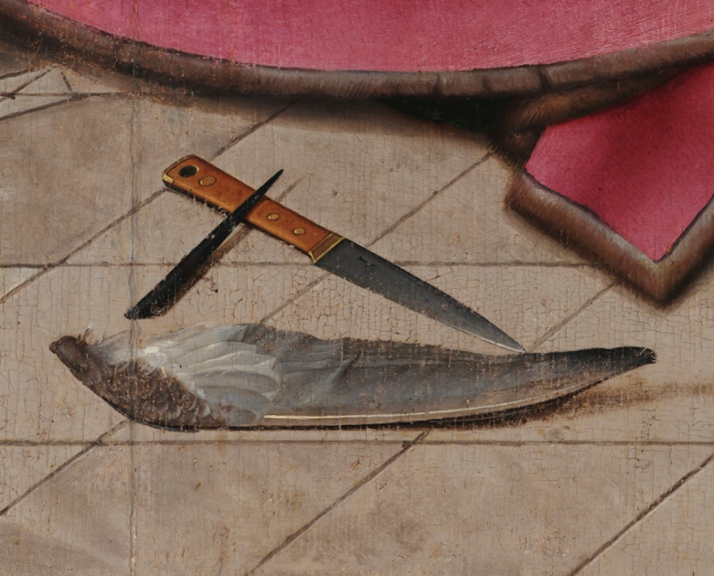

# European Paintbrushes and Chinese Ink Brushes in the Early Modern World

> Jingxian Shi 
> Spring 2023 
> HIST GU4962: Making and Knowing in Early Modern Europe: Hands-On History

## Introduction

Chinese ink brushes have become inextricably intertwined with writing culture, evolving into a symbol of literacy and the mastery of Chinese characters. Some scholars assert that the Chinese ink brush is unique as the only soft-tip brush in existence in the early modern period. This claim is challenged by the presence of similarly structured soft-tip paintbrushes in European societies, characteristically having a slender brush tube with an animal hair tuft. Records of making soft-tip brushes can be found in the fifteenth-century Italian manuscript *Il Libro dell’Arte* by Cennino Cennini (known as *The Craftsman’s Handbook* in English) and the sixteenth-century French manuscript BnF Ms. Fr. 640.[^1] While the structure and materials of the two implements share similarities, the ink brushes from China and paintbrushes from Europe exhibit variations under the hands of their users, catering to diverse writing and painting needs and further reinforcing differences in Chinese and European writing and painting habits.

This essay delves into the shared and distinctive embodied experiences of European and Chinese brush-makers and their “artisanal epistemology”[^2] accumulated from raw materials and hands-on practices in the realm of brush-making between the fifteenth and eighteenth century. It emphasizes both the regional differences and the “universal” commonalities of the brush-makers’ artisanal knowledge. The regional aspect of brush-making techniques comes to light through the adaptability of brush makers in response to the availability and properties of raw materials, and the positions in which brush users held their brushes. While artisans from both cultures used region-specific production methods, their means and intentions in applying practical knowledge in accord with the local writing and painting culture converged. The ways of knowing and making were universal in the craft of brush making. “Natural history” equipped the brush-making artisans with knowledge about “the range of materials available and the often subtle distinctions between them.”[^3] “Analysis”[^4] delved deeper into understanding the functions and properties of local material for brush making. “Experimentalism”[^5] unveiled brush makers’ numerous attempts at producing novelty. Making and knowing generated a relation of symbiosis in both cultures and demonstrated brush makers’ efforts in acquiring embodied knowledge by responding to the properties of materials as well as to brush users’ writing and painting practices.

Different writing and painting traditions shaped the development of brushes in each culture. Jean Francois Billeter brings up a distinctive feature of the Chinese ink brush: its dual functionality as both a writing and a painting tool. This instrument enables Chinese calligraphy to encapsulate a variety of expressions and movements, attempting similar effects and brushstrokes in paintings.[^6] The tuft of the Chinese ink brush has to be sufficiently versatile to satisfy both writing and painting purposes. Meticulous steps are taken to select and process furs used in binding the brush tuft. In contrast, European painting instruments were distinct from the rigid, sharp quills of writing tools; moreover, they were used to achieve two aims: invisible brushstrokes[^7] and verisimilitude.[^8] Consequently, paintbrushes in early modern Europe came in a range of sizes for painters to choose from. Each size possessed a specific function, and all collectively aimed to mimic nature and achieve naturalistic representation in paintings. There were two primary types of paintbrushes: bristle brushes (*brosses*) and minever brushes (*pinceaux*). Despite the numerous designations given to these two types of paintbrushes,[^9] they all were made from either hog bristles or squirrel tails, fox tails, minever tails, and occasionally rat whiskers. Materials were essential to the brush-making process in defining the shapes and sizes of the brush. In addition to this, the process of utilizing and transforming these materials through hands and tools revealed the writing and painting traditions adopted by European and Chinese brush users.

## Self-Made and Ready Made Brushes

There were many ways of making brushes in both Europe and China. In “Paintbrushes in Ms. Fr. 640,” Danielle Carr and Sayantani Mukherjee explore two methods of brush making: the crafting of brushes by artists themselves and the procurement of ready made brushes. While a vast selection of ready made brushes were accessible in the market, Carr acknowledges that, despite the developed profession of brush-making, many sixteenth-century artists likely crafted their own brushes.[^10] Ready made and self-made brushes were both prevalent in Europe. Prominent cities such as Bruges and Antwerp during the early modern era had evolved into hubs for trading high quality painting and drawing materials.[^11] There were multiple ways to obtain ready made brushes. For example, in the late sixteenth century, Wolf Pronner, the administrator of painting at the Munich court, got his brushes from local professional brush-making artisans (*Penselmacher*), local apothecaries, spice traders, and grocers.[^12] Identities of the producers of these paintbrushes were diverse, but the two main types of producers were the professional brush-makers and artists.

A similar situation could be found in China. By the fifteenth century, artists and calligraphers were purchasing ready made brushes from esteemed brush-making artisans, such as Feng Yingke and Lu Wenbao from Huzhou, a city in Zhejiang province.[^13] Brands of ready made brushes emerged and were designated based on the locations where the brushes were made, such as “Hubi” (brushes made in Huzhou) and “Xuanbi” (brushes made in Xuanzhou from Anhui province). Besides directly purchasing ready made brushes, Chinese brush-users also made their own brushes. Calligrapher Wang Xizhi provided detailed descriptions about collecting and processing rabbit hairs in his work *Brush Classic*, showcasing his knowledge in brush-making materials. Toward the end of *Brush Classic*, he emphasized, “I once tried to make brushes on my own, and those are functional.”[^14] In addition to this quote which directly stated a case of self-made brushes, given the relative easy access to brush-making materials such as bamboos,[^15] rabbit and goat furs,[^16] it was feasible for individuals to craft their own brushes.[^17] Another instance of individually made brushes can be inferred from the “Ode to the brush” by Cai Yong, an official of the Eastern Han dynasty.[^18] This tradition of self-making could have originated as early as the second century in China.

 

*Figure 1. “St. Luke drawing the Virgin,” attributed to Hugo van der Goes, fifteenth century. MNAA National Museum of Ancient Art, Lisbon, Portugal.*

The individuals in these examples were the actual users of the brush as well as the makers of the brush. Self-making practice could be found in early modern Europe paintings. The fifteenth-century painting “St. Luke drawing the Virgin,” attributed to Hugo van der Goes, not only portrays a drawing scene by St. Luke, but also exhibits an ongoing process of St. Luke making hard-tip *pinceaux* from bird’s quills using a knife on the ground (see Figure 1). St. Luke was not making a soft-tip paintbrush, but the display of the making process of this quill points to the making of tools, including paintbrushes, in the workshop. Making one’s own paintbrushes was not a lowly practice or purely a craftsman’s activity. Rather, as Susie Nash highlights, the crafting of one’s own paintbrush was an essential skill acquired during apprenticeship as a painter.[^19] The modern dichotomy between art and craft dissolves in light of this evidence. Another piece of evidence for self-made brushes in Europe is the rising number of written recipes on brush-making, such as the French manuscript Ms. Fr. 640.

## Instructions for Brush-making

The author-practitioner in the French manuscript Ms. Fr. 640 described the process of crafting the minever brush (*pinceaux*), on fols. 66v-67r. This entry outlined the steps of collecting the hairs (“cut the hair from the tail of a squirrel’s fur”) matching the lengths of the hairs (“tap it & shake it such that the hair comes together & is rendered the same length”), aligning the hairs (“put one or two bristles of a rat’s whiskers in the middle, then, grabbing it with the fist & pinching it well with the thumb & index finger”), selecting the hairs (“pull out the hairs which make the tip too long with the ends of your fingernails, and this until the tip seems good to you”), binding the hairs (“bind and tighten it very well with a thread in two places”), assembling furs into the quill (“fit it in a quill of a convenient thickness for it, of a duck or a crow for the small ones”), and finally inspecting the finishing product: “Good paintbrushes are those that, once dipped in water, do not bulge when you trace on your hand.”

This process bears resemblance to a fifteenth-century Chinese account by a Yuan dynasty scholar Kong Qi, who wrote succinctly, “the ink brush is made of hare fur hair only. Then one uses the cord to bind the tuft. Finally the root of the tuft is applied with bamboo glue and inserted into the bamboo tube. However, the bamboo glue is substituted with lacquer because this type of glue is not sticky enough to hold the tuft in place.”[^20] Despite the geographical distance between these two places, artisans developed similar brush-making techniques through analyzing and utilizing animal furs and hairs.

The inspection step in Ms. Fr. 640 warrants attention. A good paintbrush was one that “once dipped in water, \[does\] not bulge” (fol. 67r). This parallels a saying in Chinese brush-making, however this standard could only be applied to brushes crafted with “coated-core” techniques, which involved wrapping the hairs in the center of the brush with paper or silk. It was challenging to wet the bundle of fur without it becoming bulbous. Could the step of wrapping the hairs have been omitted in the Ms. Fr. 640 entry? This omission of certain steps is common in written recipes. “The knowledge of artisans was transmitted by imitation of practice and manual work, rather than by the study of books.”[^21] Embodied knowledge cannot be comprehensively translated into words.

Making a brush is not merely a matter of assembling parts by meticulously following written guides. It involved a complex interplay of knowledge and practice, understanding the fundamental structure of the brush, the properties of brush materials, and the selection of fur and hairs. Brush-making skills cannot be adequately conveyed by words. It was a skillful practice in Europe and China which was mostly performed by calligraphers, painting apprentices, and professional brush-making artisans. There is a natural barrier for scholars or any textually-trained person attempting to make brushes solely based on archival recipes. Crafting a soft-tip brush can require more corporeal gestures and engagement than can be explicated by language. The making of brushes was more than the words codified in texts. Self-made brushes were the products of trials and failures and know-how. The following section aims to decode the knowledge encapsulated within the recipes, especially that of the selection of materials in brush making.

## Materials 

Tim Ingold proposes that properties of materials are “processual and relational.”[^22] The same materials will perform differently under varying circumstances. The efforts of artisans in harnessing local resources and developing their regional brush-making skills became evident through examining the properties of these raw materials. This section will focus on the properties of raw materials before discussing the relational and processual techniques artisans acquired and adapted. Ways of making are inseparable from the ways of knowing.[^23] Brush-making could not be undertaken without prior knowledge about the properties of brush materials. Smith points out a “reciprocal engagement” between humans and materials. She elaborates that “humans come to know the properties of materials, which in turn engenders techniques and skills that grow up around these properties.”[^24] The recipe books all mention the selections of specific materials in different steps.

The entry “How to Make Minever Brushes” in Cennini’s *The Craftsman’s Handbook* underscores the importance of selecting good bristle furs: “first get bristles of a white hog, for they are better than black ones; but see that they come from a domestic hog.”[^25] Cennini’s description expressed concern about the source of the bristles. There indeed existed variations between bristles from different hogs. In *Report on Brush Material and the Manufacture of Brushes*, Captain Varney wrote, “the quality of hogs’ bristles, in the natural state, varies with the age, sex, and habitat of the animal, and with the season of the year when slaughtered…The best bristles come from swine habituated to the severe climates of the higher latitudes, where nature seems to have provided them with extra covering.”[^26] Bristles were good brush-making material. They were stiff, elastic, and endured high temperatures.[^27] The consensus on using bristles was shaped by the available local resources, their physical traits and properties. Such knowledge about materials could only be learned by experience.

As discussed in the foregoing section, some primary types of brush-making hairs came from minever tails, fox tails, and rat whiskers. These materials are softer than bristles.[^28] Although rabbit fur was not mentioned, they shared similar elasticity, tenacity, and firmness with other furs. Artisans in China also possessed a profound understanding of the properties of furs. Recorded in *Sui shi guang ji,* a Southern Song dynasty reference book of seasonal customs instructs that hare furs should be collected during the eighth and ninth month of the lunar calendar. Furs from this particular season were suitable for writing all types of scripts.[^29] These furs embodied all the energies of a hare, as their momentum was communicated to the brush tuft and revealed in the practice of painting and writing calligraphy.[^30] Calligrapher Wang Xizhi noted that autumn rabbit furs were the best among all brush materials, and hairs from the spine of the hare were the most desirable.[^31] These rabbits inhabited Huzhou and Xuanzhou. Their fur turned out to become the most accessible brush-making material; as a result, every household in these regions and everyone from the household participated in the brush-making industry.[^32] Different geographical regions and different writing and painting cultures incubated the most appropriate selections of furs for their brushes. This knowledge about raw materials among European and Chinese brush-makers involved experimental trials and bodily experience.

## Embodied knowledge

Appropriate raw materials, selected for their qualities, laid the foundation for brush-making in both cultures. Well-trained and skillful bodies, including hands, arms and torso, completed the process, collectively producing functional brushes. Each step in the brush-making process carried significance and required the skilled participation of artisans’ bodies. Bodies function as tools. All the body parts need be present during the process of the brush-making. Hands can feel the texture, take the temperature, and manipulate the materials; eyes can see the colors and forms; ears can hear the interactions between materials and tools; the nose can detect the scents. Some of these corporeal experiences could be translated into words in recipes, however, the entire sensorium involved in the brush-making process could not be contained by texts alone.

Knowing must be accompanied with making. Details such as texture, temperature, tenderness were captured within artisans’ corporeal experiences. Hands, and the sense of touch conveyed through them, are the most sensitive body parts and are linked to memory-making.[^33] The Chinese name for craft is “shou yi手藝.” “Shou” in English means “hands.” Brush-making is a form of craft, and hands are the basis of brush-making techniques. Tim Ingold analyzes the biological features of hands: “the hand is a marvelously intricate arrangement of skin, bone, muscle tissue and nerves, fed with blood that pulses through the arteries of the wrist.”[^34] Because hands are covered with nerves and are the body parts that most frequently interacting with the physical environment, they help artisans become the dexterous makers and active knowers of the natural environment. The nerves on the hand also enable the sense of touch. As such, artisans can feel the temperature, elasticity, softness, smoothness, and many more feelings that language cannot describe. Signals received through the sense of touch are instantly sent to the brain to process, generating certain reactions back to the hand or opening memory pools for those corporeal experiences. Ingold argues that, “the hand is an extension of the brain.”[^35] Authors like Wang Xizhi and Kong Qi who wrote the brush-making recipes were well-educated scholars and, at the same time, experienced craftsmen of brush-making. No embodied knowledge will form if there is a separation between hands and minds.

Transmission of such techniques could not be sustained through hands or minds alone. In other words, brush-making techniques required the presence of both hands and minds, both textual and embodied knowledge. Knowledge traveled in both words and bodies. There is an anecdote about a Huzhou brush-making artisan: though he moved to another city, he still retained the skills he had acquired from the site of Huzhou brush-making.[^36] His hands and his body acted as storage devices for these bodily experiences. This embodied knowledge in brush-making was preserved and transmitted through corporeal experiences. Shanlian, one of the towns in Huzhou, was known for crafting brushes. Almost all residents of Shanlian could make brushes.[^37] Such intimate and bodily transmissions of knowledge yield the regional production modes in China. In Europe, evidence for the embodied knowledge is also seen codified in manuscripts. Another example from England displays that the transmission of embodied knowledge was also alive in brush-making there: in England, where brush-making had become a specialized profession, a master brush-maker Mr. Smyth is recorded as having trained an apprentice in 1630.[^38] This technique was an acquired knowledge that demanded bodily engagements and meticulous hands-on practices.

## Use of the Brush

Previous sections of this essay have illustrated similar practices between Chinese and European brush-making artisans from the fifteenth to the eighteenth century in terms of gathering raw materials, adapting, and transmitting brush-making techniques. Both cultures shared similar brush structures. This may also have resulted from the properties of the raw materials, which defined a tight range for the brush’s forms. However, minor differences arose when the brushes were placed in the context of writing and painting. Writing and painting were two distinct practices which used different instruments in European countries, while Chinese writing and painting traditions harmonized[^39] and used the same soft-tip ink brushes. These differences were not evident in the form and structure of the paintbrush and ink brush, but they were manifested in the quantities and sizes of the brushes used in one painting, as well as users’ brush-holding positions from two cultures.

A significant number of brushes were required in European artists' studios. Danielle Carr writes that a typical artist’s workshop in fifteenth-century Europe could have hundreds of brushes.[^40] Such a variety was used to pursue different artistic effects in a painting. Artist Albrecht Dürer recorded his purchase of “13 bristle brushes for 6 stivers, and 6 bristle brushes for 3 stivers, then another 3 stivers for another 3 bristle brushes” in Antwerp in 1521.[^41] Susie Nash gives striking material evidence on the use of different sized brushes in one painting. In the X-rays of a painting by Lucas Cranach, scientific analysis has shown that the width of the brushstrokes range from 5 millimeters to 30 millimeters.[^42] Finer details necessitated the use of small and pointed brushes.

In contrast, Chinese artists and calligraphers had significantly fewer brushes in their studios. Instead of using different sizes of paintbrushes, they devoted great care to controlling the brush and modulating the width and length of the brushstrokes through adjusting their arms, shoulders, and bodies. The ways of holding the brush and the practice of lifted-elbow position in Chinese paintings and calligraphy helped to create dynamic lines and dots in the pictorial representation. George Stout identified two ways of holding the brush: “parallel grip” – the brush handle is held in about the same line as the fingers; and “angle grip” – the brush is at an angle to the fingers and at an angle to the forearm.[^43] Users’ positions of holding the brushes influenced the range of movements of the brush and corresponded to the size of the brush. Parallel grip confines the range of movement of the arm, resulting in smaller painting areas and shorter brushstrokes. There was a trend towards the parallel grip during fifteenth-century Europe.[^44] This coincided with the increasing number and sizes of brushes in artists’ studios.

Chinese artists and calligraphers, on the other hand, adopted the angle grip position. When holding the brush in an angle grip position, fingers had little to do with the maneuverings of the brush. One’s wrist, elbow, shoulder were instead utilized.[^45] This matched Chinese ideology in calligraphical practice. Calligrapher Cheng Yaotian suggests the brush, the finger, the wrist, the arm, the body, and the heart should be connected during writing.[^46] Holding the brush in an angle grip position while lifting the elbow in air, the writer actually used the whole body to manipulate the brush. The angle grip adopted by Chinese scholars allowed for larger-scale movements on the painted surface, while the parallel grip used by European artists was preferred for creating finer details and smoother touches.

The variation in brush positions helps to explain the differentiation in the development of Chinese ink brushes and European paintbrushes. Chinese scholars adjusted their bodies instead of making adjustment to their brushes,[^47] while European artists modified the brushes to achieve their particular artistic expressions in painting. Such modifications of the paintbrush can be found in Cennini’s handbook. Cennini instructed, “reinforce your whole drawing, with a small pointed minever brush, … with a rather blunt minever brush, shade in some of the folds.”[^48] Variable sizes of paintbrushes accompanied artists’ hands to achieve verisimilitude in early modern Europe. In comparison, Chinese scholars utilized movements of their bodies to facilitate writing and painting practices that expressed vitality and spirit resonating in their brushstrokes.

## Conclusion

The soft-tip brush embodied an important node of culture between the fifteenth and eighteenth century, connecting raw materials, artisans, brush-users, and recipe writers. Its form and specific use revealed their interplay. Similarity in the appearance of European paintbrushes and Chinese ink brushes was the result of brush-makers’ endeavors in understanding and engaging with nature and culture. Both artisans from China and Europe were active knowers as well as experienced makers. The ways of knowing and making showed a convergence in brush making. These artisans’ embodied knowledge accumulated and were transmitted through corporeal experience. As a result, authors of recipes of brush-making were likely capable of making the brush and translating bodily languages into texts. They could be scholars, artists, or calligraphers who possessed both the scholarly and artisanal knowledge. It explains the existence of self-made brushes and professional-made brushes in both cultures. The binary between making and knowing, and scholar and artisan is thereby reconciled. Besides these similarities, there were regional variations in the use of brush. On the one hand, paintbrushes and ink brushes were tailored to satisfy each culture’s users. Different writing and painting cultures fostered differences in the instruments used, and, on the other hand, these brushes shaped writing gestures and positions and created variant writing and painting cultures.

## Bibliography

Billeter, Jean Francois. *Chinese Art of Writing.* New York: Rizzoli Interanational Publications, 1990.

“Brush.” In *Huzhou Prefecture gazetteer*. Edition: Qing Tongzhi shi san nian kan ben 清同治十三年刊本.

Cai, Yong. “Ode to the brush.” In *Chu xue ji*初學記. Edition: Qing Guangxu Kong shi san shi san wan juan tang ben清光緒孔氏三十三萬卷堂本.

Carr, Danielle. “Paintbrushes in Ms. Fr. 640.” In *Secrets of Craft and Nature in Renaissance France. A Digital Critical Edition and English Translation of BnF Ms. Fr. 640*, edited by Making and Knowing Project, Pamela H. Smith, Naomi Rosenkranz, Tianna Helena Uchacz, Tillmann Taape, Clément Godbarge, Sophie Pitman, Jenny Boulboullé, Joel Klein, Donna Bilak, Marc Smith, and Terry Catapano. New York: Making and Knowing Project, 2020. <https://edition640.makingandknowing.org/#/essays/ann_026_fa_15>. DOI: <https://www.doi.org/10.7916/m26t-hn31>.

Cennini, Cennino. *The Craftsman’s Handbook,‘Il Libro dell’Arte’*, translated by Daniel Thompson. New York: Dover, 1960.

Chen, Yaotian. *Shu shi*書勢. Edition: Mei shu cong shu edition美術叢書.

Chen, Yuanliang, *Sui shi guang ji*歲時廣記. Edition: Qing shi wan juan lou cong shu ben清十萬卷樓叢書本.

Christensen, Anne H. “The Trade in Painters’ Supplies in 17th-Century Denmark,” in *Trading Paintings and Painters’ Materials 1550-1800*. Copenhagen: CATS, 2019.

Harley, R. D. "Brush." Grove Art Online. 2003; Accessed 3 Apr. 2023. [<u>https://www.oxfordartonline.com/groveart/view/10.1093/gao/9781884446054.001.0001/oao-9781884446054-e-7000011835</u>](https://www.oxfordartonline.com/groveart/view/10.1093/gao/9781884446054.001.0001/oao-9781884446054-e-7000011835)

Hay, Jonathan. “Culture, Ethnicity and Empire in the Work of Two Eighteenth Century ‘Eccentric Artists.’” *RES: Anthropology and Aesthetics* 35 (Spring 1999): 201–223.

He, Shijin. *Gong bu chang ku xu zhi工部廠庫須知*. Edition: Ming Wanli Lin Ruch uke ben 明萬曆林如楚刻本.

Ingold, Tim. “Telling by Hand.” In *Making: Anthropology, Archaeology, Art and Architecture.* London and New York: Routledge, 2013.

Kong, Qi. “Categories of the Brush.” In *Jing zhai zhi zheng zhi ji* 靜齋至正直記 (Edition: Qing Mao shi chao ben 清毛氏鈔本.

Le Pouésard, Emma. “Bread as Mediating Material: Tactile Memory and Touch in Ms. Fr. 640,” In *Secrets of Craft and Nature in France. A Digital Critical Edition and English Translation of BnF Ms. Fr. 640*, edited by Making and Knowing Project, Pamela H. Smith, Naomi Rosenkranz, Tianna Helena Uchacz, Tillmann Taape, Clément Godbarge, Sophie Pitman, Jenny Boulboullé, Joel Klein, Donna Bilak, Marc Smith, and Terry Catapano. New York: Making and Knowing Project, 2020. <https://edition640.makingandknowing.org/#/essays/ann_050_fa_16>. DOI: <https://www.doi.org/10.7916/51fz-0r94>.

“Local Products (wu chan物產).” In *Guian xian zhi*歸安縣志. Edition: Qing Guangxu ba nian kan ben 清光緒八年刊本.

Nash, Susie. “Workspace and Equipment.” In *Northern Renaissance Art*. Oxford: Oxford University Press, 2009.

Nash, Susie. “Materials, Methods, and Technical Virtuosity.” In *Northern Renaissance Art*. Oxford: Oxford University Press, 2009.

Pickstone, John. *Ways of Knowing: A New History of Science, Technology and Medicine*. Chicago: University of Chicago Press, 2001.

Qi, Gong. “The Relationships between Poetry, Calligraphy, and Painting.” In Alfreda Murck and Wen C. Fong ed., *Words and Images: Chinese Poetry, Calligraphy, and Painting*. The Metropolitan Museum of Art and Princeton University Press, 1991.

*Secrets of Craft and Nature in Renaissance France. A Digital Critical Edition and English Translation of BnF Ms. Fr. 640*, edited by Making and Knowing Project, Pamela H. Smith, Naomi Rosenkranz, Tianna Helena Uchacz, Tillmann Taape, Clément Godbarge, Sophie Pitman, Jenny Boulboullé, Joel Klein, Donna Bilak, Marc Smith, and Terry Catapano. New York: Making and Knowing Project, 2020. [https://edition640.makingandknowing.org/#/](https://edition640.makingandknowing.org/#/).

Smith, Pamela H. “Nodes of Convergence, Material Complexes, and Entangled Itineraries.” In *Materials, Practices, and Knowledge across Eurasia*, edited by Pamela H. Smith. Pittsburgh: University of Pittsburgh Press, 2019.

Smith, Pamela. *The Body of the Artisan: Art and Experience in the Scientific Revolution.* Chicago: University of Chicago Press, 2004

Stout, George L. “The Grip of the Artist’s Brush.” In *Technical Studies in the Field of the Fine Arts*, Vol 10, Issue 1, 1941

Sun, Zuo. “Zeng bi sheng Zhang Meng xu贈筆生張蒙序.” In *Jiangying county gazetteer*. Edition: Ming Jiajing ke ben明嘉靖刻本.

Varney, Captain. *Report on Brush Material and the Manufacture of Brushes*. Washington: Government Printing Office, 1883.

Xu, Yiyi. “The Knowledge System of the Traditional Chinese Craftsman.” Trans. by Dorothy Ko. *West 86th.* 20:2. Fall-Winter 2013.

[^1]: Cennini, Cennino, *The Craftsman’s Handbook, ‘Il Libro dell’Arte,* trans. by Daniel Thompson (New York: Dover, 1960.) See the entry “Paintbrushes” on fol. 66v in *Secrets of Craft and Nature in Renaissance France. A Digital Critical Edition and English Translation of BnF Ms. Fr. 640*, ed. Making and Knowing Project et al. (New York: Making and Knowing Project, 2020), [https://edition640.makingandknowing.org](https://edition640.makingandknowing.org/).

[^2]: Pamela Smith, *The Body of the Artisan: Art and Experience in the Scientific Revolution.* Chicago: University of Chicago Press, 2004), 8.

[^3]: John Pickstone, *Ways of Knowing: A New History of Science, Technology and Medicine* (Chicago: University of Chicago Press, 2001), 11.

[^4]: Pickstone, *Ways of Knowing*, 11.

[^5]: Pickstone, *Ways of Knowing*, 11.

[^6]: Jean Francois Billeter, *Chinese Art of Writing* (New York: Rizzoli International Publications, 1990), 11.

[^7]: Susie Nash, “Materials, Methods, and Technical Virtuosity,” in *Northern Renaissance Art* (Oxford: Oxford University Press, 2008), 206.

[^8]: Smith, *The Body of the Artisan,* 8.

[^9]: The variant designations are “Jean Lemaire de Belges’s poem describes *pinceaux* (fine or small brushes) and *brosses à tas* (bristle brushes); Lucas Cranach’s accounts refer to *porspensel* (bristle brushes) and *harbensel* (hair brushes); Jan van der Stockt’s inventory lists *pinselen* (fine brushes) and *borstelen*(bristle brushes), and the Tournai painters’ regulations of 1480 distinguish between *pinceaux* and *brosses*.” Susie Nash, “Workspace and Equipment,” in *Northern Renaissance Art* (Oxford: Oxford University Press, 2008), 166.

[^10]: Danielle Carr, “Paintbrushes in Ms. Fr. 640,” in *Secrets of Craft and Nature in Renaissance France*, ed. Making and Knowing Project et al. (New York: Making and Knowing Project, 2020) [<u>https://edition640.makingandknowing.org/#/essays/ann_026_fa_15</u>](https://edition640.makingandknowing.org/#/essays/ann_026_fa_15).

[^11]: Susie Nash, “Materials, Methods, and Technical Virtuosity,” 199.

[^12]: Anne Haack Christensen, “The Trade in Painters’ Supplies in 17th-Century Denmark,” in *Trading Paintings and Painters’ Materials 1550-1800* (Copenhagen: CATS, 2019), 42.

[^13]: “Brush,” in *Huzhou Prefecture gazetteer* (Edition: Qing Tongzhi shi san nian kan ben 清同治十三年刊本).

[^14]: Wang Xizhi, “*Brush Classic*,” in *Wen fang si pu*, ed. Su, Yijian蘇易簡 (Edition: Qing shi wan juan lou cong shu 清十萬卷樓叢書本).

[^15]: “Local Produces (wu chan物產),” in *Guian xian zhi* 歸安縣志, juan 13 (Edition: Qing Guangxu ba nian kan ben 清光緒八年刊本).

[^16]: He Shijin recorded that “each year, Zhejiang Chief Secretary needs to pay for twenty thousand bamboo tubes, three-hundred sheets of rabbit furs, two-hundred sheets of weasel furs, sixty *jin* (around 1.3 pounds) of wool, and fifty *jin* of bristles,” in *Gong bu chang ku xu zhi 工部廠庫須知*, juan 9 (Edition: Ming Wanli Lin Ruch uke ben 明萬曆林如楚刻本).

[^17]: Jingxian Shi, “Travelling Path of the Chinese Ink Brush,” M.A. Thesis (Columbia University, 2023).

[^18]: Cai Yong, “Ode to the brush,” in *Chu xue ji*初學記, juan 21 (Edition: Qing Guangxu Kong shi san shi san wan juan tang ben清光緒孔氏三十三萬卷堂本).

[^19]: Nash, “Workspace and Equipment,” 166.

[^20]: Kong Qi, “Categories of the Brush,” in *Jing zhai zhi zheng zhi ji* 靜齋至正直記 (Edition: Qing Mao shi chao ben 清毛氏鈔本).

[^21]: Smith, *The Body of the Artisan*, 7.

[^22]: Tim Ingold, “Materials and Materiality,” *Archaeological Dialogues* (Vol 14, issue 1, 2007), 1.

[^23]: Pickstone, *Ways of Knowing*, 19.

[^24]: Pamela H. Smith, “Nodes of Convergence, Material Complexes, and Entangled Itineraries,” in *Materials, Practices, and Knowledges across Eurasia*, edited by Pamela H. Smith (Pittsburgh: University of Pittsburgh Press, 2019), 8.

[^25]: Cennini, *The Craftsman’s Handbook*, 41.

[^26]: Captain Varney, *Report on Brush Material and the Manufacture of Brushes* (Washington: Government Printing Office, 1883), 3.

[^27]: Varney, *Report on Brush Material*, 2.

[^28]: R. D. Harley, "Brush," from *Grove Art Online* (2003), Accessed 3 Apr. 2023, [<u>https://www.oxfordartonline.com/groveart/view/10.1093/gao/9781884446054.001.0001/oao-9781884446054-e-7000011835</u>](https://www.oxfordartonline.com/groveart/view/10.1093/gao/9781884446054.001.0001/oao-9781884446054-e-7000011835).

[^29]: Chen Yuanliang, *Sui shi guang ji*歲時廣記, juan 3 (Edition: Qing shi wan juan lou cong shu ben清十萬卷樓叢書本).

[^30]: Sun Zuo, “Zeng bi sheng Zhang Meng xu贈筆生張蒙序,” in *Gazetteer of Jiangying county* (Edition: Ming Jiajing ke ben明嘉靖刻本).

[^31]: Xizhi, “*Brush Classic*,” 109.

[^32]: Sun Zuo, "Zeng bi sheng Zhang Meng xu贈筆生張蒙序."

[^33]: Emma Le Pouésard, “Bread as Mediating Material: Tactile Memory and Touch in Ms. Fr. 640,” in *Secrets of Craft and Nature in Renaissance France*, ed. Making and Knowing et al., [<u>https://edition640.makingandknowing.org/#/essays/ann_050_fa_16</u>](https://edition640.makingandknowing.org/#/essays/ann_050_fa_16).

[^34]: Tim Ingold, “Telling by Hand,” in *Making: Anthropology, Archaeology, Art and Architecture* (London and New York: Routledge), 112.

[^35]: Ingold, “Telling by Hand,” 112.

[^36]: Shi, “Travelling Path of the Chinese Ink Brush,” 23.

[^37]: “Brush,” in *Huzhou Prefecture gazetteer.*

[^38]: Carr, “Paintbrushes in Ms. Fr. 640,” [<u>https://edition640.makingandknowing.org/#/essays/ann_026_fa_15</u>](https://edition640.makingandknowing.org/#/essays/ann_026_fa_15).

[^39]: Qi Gong, “The Relationships between Poetry, Calligraphy, and Painting,” in *Words and Images: Chinese Poetry, Calligraphy, and Painting*, edited by Alfreda Murck and Wen C. Fong (The Metropolitan Museum of Art and Princeton University Press, 1991), 13.

[^40]: Carr, “Paintbrushes in Ms. Fr. 640,” [<u>https://edition640.makingandknowing.org/#/essays/ann_026_fa_15</u>](https://edition640.makingandknowing.org/#/essays/ann_026_fa_15).

[^41]: Nash, “Workspace and Equipment,” 165.

[^42]: Nash, “Workspace and Equipment,” 166.

[^43]: George L. Stout, “The Grip of the Artist’s Brush,” in *Technical Studies in the Field of the Fine Arts* (Vol 10, Issue 1, 1941), 5-7.

[^44]: Stout, “The Grip of the Artist’s Brush,” 9.

[^45]: Stout, “The Grip of the Artist’s Brush,” 12.

[^46]: Chen Yaotian, *Shu shi*書勢, juan 4 (Edition: Mei shu cong shu edition 美術叢書).

[^47]: There were few exceptions in the seventeenth and eighteenth centuries. For example, Johnathan Hay points out that the    idiosyncratic artist Jin Nong cut the tip of the brush to create a sharp-edge brushstroke. Jonathan Hay, “Culture, Ethnicity and Empire in the Work of Two Eighteenth Century ‘Eccentric Artists.’” *RES: Anthropology and Aesthetics* 35 (Spring 1999): 201–223.

[^48]: Cennini, *The Craftsman’s Handbook*, 75.
