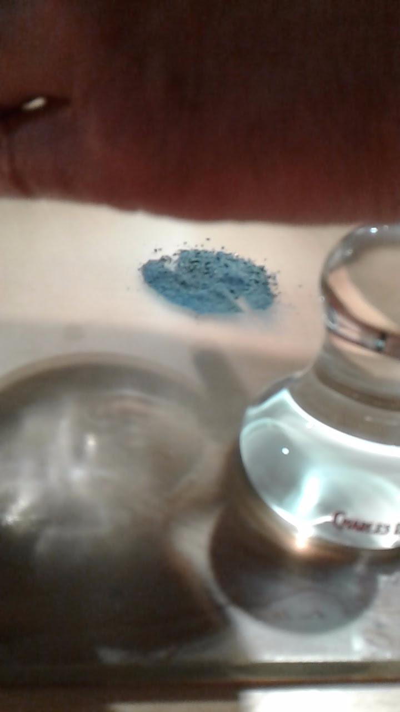
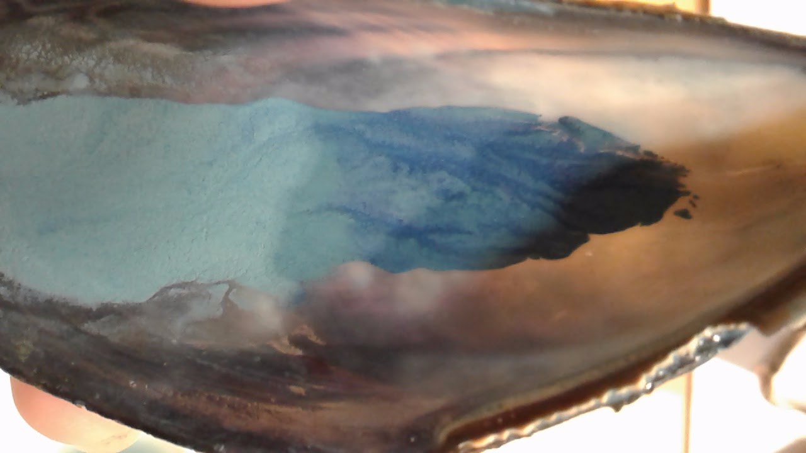

June 5, 2017

**Azurite crushing and washing session**

Led by Spike Bucklow

Fitzwilliam studio room

*Notes by NJR (Naomi Rosenkranz)*

-   [<u>Flickr album of> Azurite_NJR</u>](https://www.flickr.com/gp/128418753@N06/6b2z8M)

-   [<u>V&A/RCA blog post on Azurite May 2017 part> 1</u>](http://www.vam.ac.uk/blog/network/experiments-with-azurite-on-the-history-of-design-ma-course)

-   [<u>V&A/RCA blog post on Azurite May 2017 part> 2</u>](http://www.vam.ac.uk/blog/research-department/thinking-and-experiencing-techne-making-azurite-part-2)

Cambridge University

“Genius Before Romanticism”

Workshop organized by the Ingenuity Project (Alex Marr) with the Making Visible Project (S. Kusukawa) and the curatorial team of the Fitzwilliam Museum’s “[<u>Madonnas and Miracles</u>](http://www.fitzmuseum.cam.ac.uk/madonnasandmiracles)” exhibit (March - June 2017)

People:

-   ERC group “Ingenuity” (Alex Marr, Richard, Raf, Jose)

-   “Making Visible Project” (Sachiko Kusukawa, Katie, Seitske)

-   “Madonnas and Miracles” exhibition team at the Fitzwilliam Museum (Maya, Irena)

-   “Making and Knowing Project (Pamela, Tianna, Naomi)

Handouts:

-   [<u>CAMEO Characteristics of Common Blue> Pigments</u>](http://cameo.mfa.org/images/e/ea/Download_file_506.pdf)

-   Cennini on Azurite prep

Spike Bucklow presentation:

-   Experimental knowledge is transmitted through 1) demonstration, 2) observation, and 3) participation

-   Azurite sourcing:

    -   Spike has purchased a chunk of azurite ore about the size of 1-2golf balls

    -   Found it on the internet somewhere

    -   Not from Kremer

    -   Probably mined somewhere in Africa

    -   Can tell it is legitimate from appearance, inclusion of malachite and other impurities, as well as handling properties

-   Azurite properties

    -   No color in particles smaller than 1/1000 mm (= 1 micron = 1 x 10^-6)

    -   “Good” pigment is glittery midnight blue. The more, the better

    -   By levigation of azurite in water, we separate by particle size. We wash away smaller particles, leaving the larger most vivid in color particles

Process:

-   Crush azurite ore with mortar and pestle

-   When small-ish, transfer to glass plate + muller

-   Add some water and do rough mulling before moving to concentric mulling

    -   Observation: as it dried out, got tacky + difficult to mull smoothly/homogeneously

-   Transfer small amount (about as much as could fit on one finger) to mussel shell

-   Add water and swish with finger, then swirl

-   Pour off into another shell the water at the top with smaller dispersed particles

-   What is left in the first mussel shell is larger particles

-   Repeat adding water and pouring off until the azurite remaining is midnight blue

-   Because we are short on time:

    -   To paint out, add a small amount of gum arabic directly to azurite in shell that is still quite wet

-   Can add more water as needed

-   NJR: added gum arabic, painted out once, then poured off again and painted out → better color and consistency

Wash water that was poured off successively:

Color of the azurite and the wash water after each wash:

Painted out with gum arabic:

