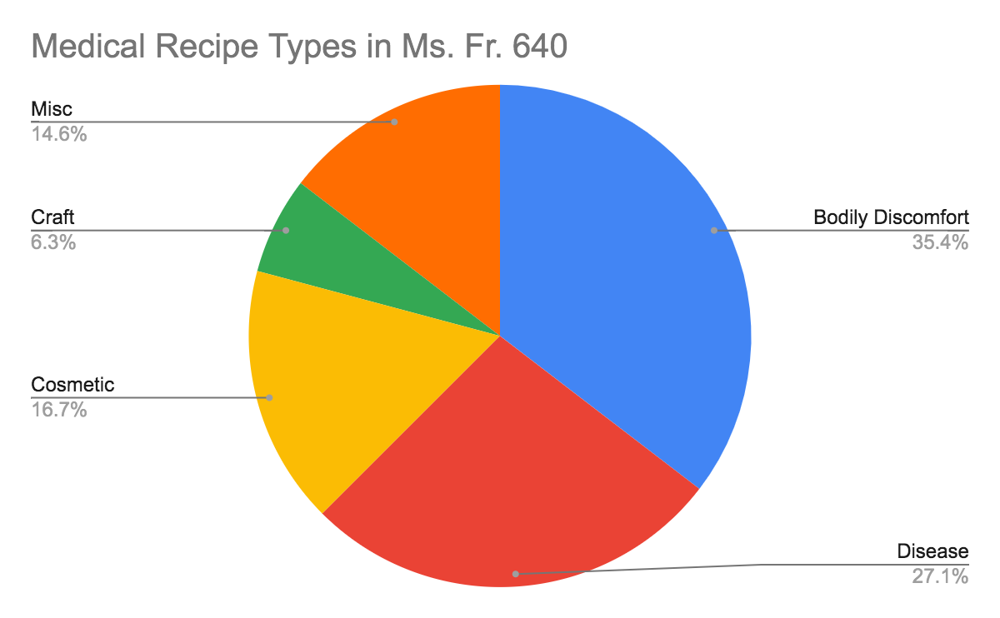
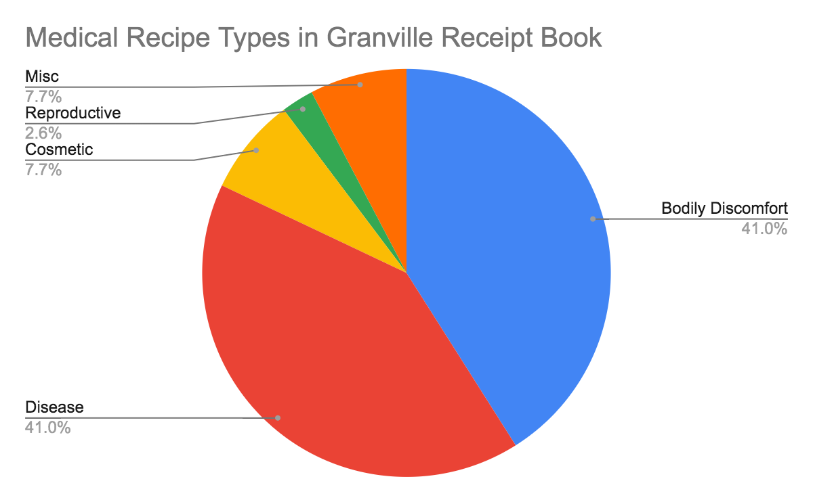
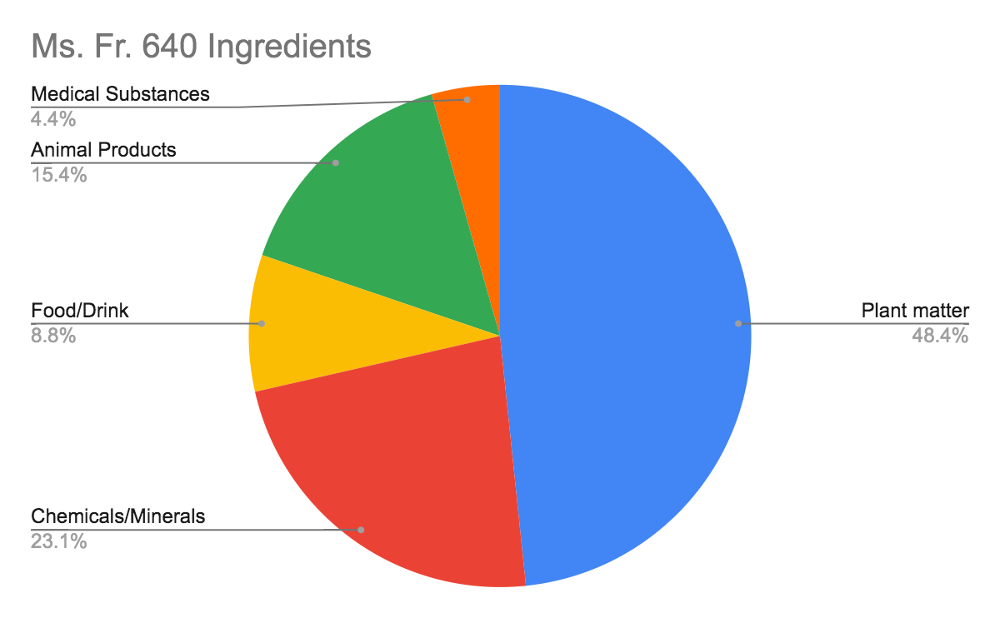
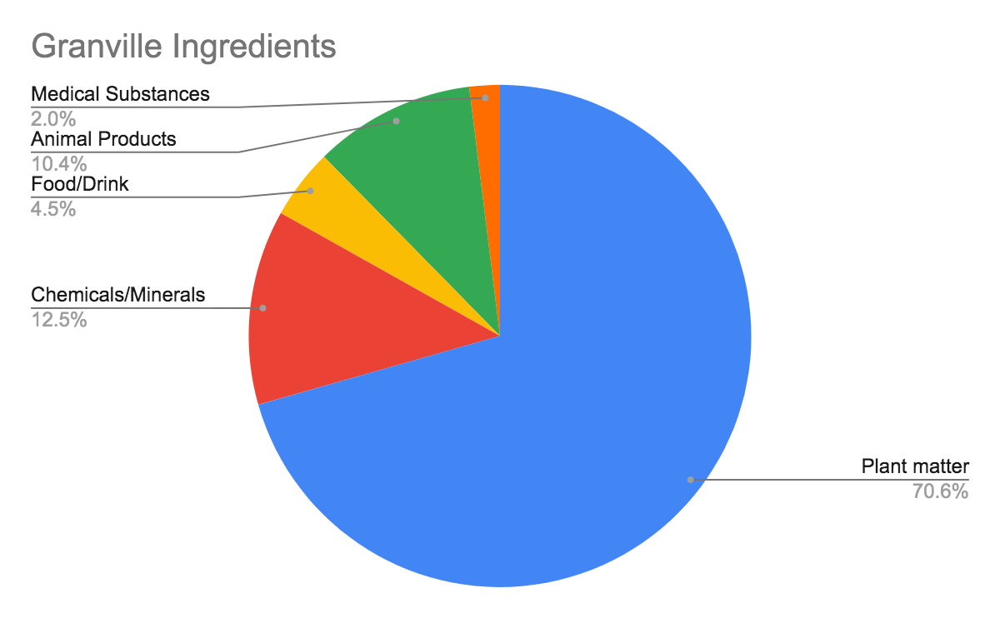

# Medicine in Ms. Fr. 640 and Household Recipe Books
_Elizabeth Branscum_  _Summer 2021_

su21_macomber_sophie_final-project-figures.md
## Introduction
As you know by now, the origin and purpose of [BnF Ms. Fr. 640](https://edition640.makingandknowing.org/#/) is still uncertain. Who is the mysterious author-practitioner who compiled these recipes, and what did he intend to do with them? Part of what makes this question so intriguing is the inclusion of recipes on such a wide variety of topics – craft, sleight of hand, and even medicine. The medical recipes in the manuscript are particularly curious. Out of over 900 entries, there are only 48 that explicitly detail medical recipes, and they are scattered throughout the manuscript with little apparent rhyme or reason. In this essay, I will look more closely at the medical entries in Ms. Fr. 640, and compare them briefly to medical recipes included in a household recipe book compiled in mid-seventeenth century England.[^1] This comparison, which places Ms. Fr. 640 alongside a text from a similar period whose purpose and genre is well-established, may shed light on the strategies and intent of the author-practitioner in compiling the medical recipes in Fr. 640, and raise fruitful questions for further study.[^2]

First, let’s turn our focus to Ms. Fr. 640. There are 48 entries in the manuscript with an explicitly medical focus that are scattered throughout the text and have a wide variety of intended purposes and ingredients.[^3]

Seventeen of these recipes address bodily pain and discomfort with no specific cause – nosebleeds, swollen breasts, constipation, etc.[^4] Thirteen detail remedies or preventative measures for specific diseases such as the plague, gonorrhea, and even mange in dogs. There are eight recipes that deal with cosmetic concerns (whitening teeth and the face), seven that claim to produce a range of miscellaneous effects (induce sleep, poison, induce temporary paralysis), and four that seem specifically geared toward artisans. These last four (an antidote against metal fumes, a caution to glassworkers, a remedy for healing a burn from toad urine incurred while trying to cast such an animal, and a remedy against burns specifically said to have been tested by a gunpowder maker) constitute a small percentage of the total recipes, indicating that, overall, the medical recipes included in Ms. Fr. 640 are not specific to the artisan’s workshop. But just how common were the medical recipes included in Ms. Fr. 640? Were they similar to those detailed in other contexts? Would their construction have required special skills or ingredients?

To begin thinking about answers to these questions, let’s turn to a recipe book compiled in a different context: the household. There is a large body of literature on early modern household recipe books, their compilation, preservation, and uses, both practical and otherwise. For our purposes, it will suffice to say that in both early modern England and France, recipe books were a common tool wherein men and women collected recipes (culinary, medical, etc.) that would have been of use to the household. The most wide-ranging surveys of documents such as these suggest that, while they did serve a number of different purposes, they were primarily practical texts, and their recipes were intended to be replicable in a domestic context. Given this well-defined purpose, a comparison between medical recipes in household recipe books and those in Ms. Fr. 640 may be instructive.

## Recipe Book Attributed to Mary Granville and Anne Granville D’Ewes

The text we will use for our comparison was compiled by Englishwoman Mary Granville around 1640 – at least twenty years after the author-practitioner finished compiling Ms. Fr. 640, and likely closer to fifty.[^5] The Granville manuscript features a total of 212 recipes, 76 of which are medical in focus. Right away, we see that medical recipes
constitute a much larger portion of this household recipe book than they do in Ms. Fr. 640.

The graph above sorts the recipes in the Granville manuscript into five very broad categories, allowing us to make a superficial comparison between this document and Ms. Fr. 640. Here we can see a relatively similar array and proportion of recipes included in this recipe book and Ms. Fr. 640 (see Appendix for more detailed breakdown of recipes in each manuscript). The Granville contributors compiled many more remedies for ailments that would have been quite common but make no appearance in Ms. Fr. 640: consumption, cough, sore throat, and agues (a general term for any illness involving a fever and chills). Both feature multiple remedies for the plague. Ms. Fr. 640 seems to tend more toward the unusual or idiosyncratic, as the author-practitioner includes two remedies for “falling sickness” (vertigo), three for curing mange in dogs, two mysterious entries with text written backward that seem to be instructions for making poison, and one entry, titled “Toadstone,” which relates a claim that a certain powder diffused in the air will make a person “neither able to move, nor speak, nor thwart thieves.”

There are further points of difference between the two recipe collections. Interestingly, the Granville book contains a smaller percentage of recipes aimed at cosmetic concerns. The author of Fr. 640 seems particularly interested in whitening teeth and diminishing under-eye circles, while the Granville book includes four different recipes for removing marks from smallpox. One might wonder: did the author-practitioner of Ms. Fr. 640 struggle with stained teeth? Did the Granvilles, or a member of their household, suffer from smallpox? The Granville recipe collection also includes two recipes for women in labor, perhaps unsurprising given that the book was passed from a mother to her daughter, and does not contain any recipes specific to craft knowledge and practice.

## Taking a Closer Look: Instructions and Ingredients

To understand more about what distinguishes each of these recipe collections, we’ll need to examine them more closely. Where do the recipes come from? How do the respective authors present and verify the instructions they give? What kinds of ingredients, tools, and techniques do they call for?

Both manuscripts include recipes attributed to other people - in an entry “Against Burns” in Ms. Fr. 640, the author-practitioner notes that the recipe came from a gunpowder maker (who, importantly, had tried the remedy himself and swore by its efficacy, even apparently showing the author-practitioner a burn he had successfully healed by this method). The Granville book includes recipes from clear authorities, probably copied from printed books, such as “Doctor Chambers his water,” but also remedies from friends and neighbors, like “Mrs. Badge’s Plaister.” Likewise, the Granvilles are interested in proving the efficacy of the recipes they record. At the end of a recipe for “a water for Squinancy,” the author notes, “this is the best medicine for a sore Throat that ever I met with.”[^6]

Ms. Fr. 640 and the Granville recipe book also feature recipes intended for the same or similar purposes - for example, both include a set of instructions for crafting sleep aids. The Ms. Fr. 640 recipe reads as follows:

> **White soporific oil**[^7]
>
> Take x or 12 mandrake apples, put them in quarters in olive oil, the whole in a glass bottle which you will place in a bain marie for two days and your oil will turn white. If you rub the soles of your feet with the same, you will soon feel like sleeping.

The Granville recipe, the first in the entire book, is below:[^8]

> **To make one sleep**
>
> Take house Ivy Leaves stamped in a mortar till a spoonful or less quantity be strained thereout, put thereto a like quantity of white wine vinegar, make the same Luke warme, in a porringer, or Sawcer, and therewith anoint, both the temple and forehead, and wet two linen cloths therein, and bind them over the forehead and temples, and then let the party apply himself to sleep.

Here, the structure and ingredients of the recipes are quite similar. Both call for plant matter cut up (or stamped, in the Granville case), added to a liquid, and warmed. Both direct where and how the resulting mixture should be applied to produce the desired effect. The recipe in Ms. Fr. 640 uses a more technical term for the final product (soporific) and calls for a significant time investment (someone would presumably need to be checking on the oil in the bain marie at least periodically over two days). In a household where a servant could be assigned to the task, this could be feasible, but if a family had no servants, or those they did have were occupied with more pressing responsibilities, following the author-practitioner’s instructions might have been practically difficult.

On the other hand, at times, the Granville manuscript offers much more painstaking instructions than Ms. Fr. 640. Both documents contain multiple recipes against general aches and pains. One particularly brief entry in Ms. Fr. 640 reads:

> **Against pains**
>
> Turpentine oil, oil of Jacob, and salt extracted from cabbage ash.

A recipe in the Granville book “for the curing of most pains and aches” is significantly longer and more detailed:[^9]

> Take a pint of white french wine in a pint pot, ten leaves or blades of mace, 30 sprigs of sweet marjoram tied with a thread put both these into the said wine and boil them until ¼ part be consumed Then strain it through a clean lining cloth into another vessel and being strained return it into the same pint pot and refill it with good salad oil with two spoonfuls of white sugar, now thus brew them together until comes to be no warmer than can be suffered to drink, and then drink the same fasting in a morning in your bed then off shirt and cover yourself very warm head and all for an hour lying flat on your back, then one hour more with hot clothes from the fire continually wiping the body over then begin by little and little to take off the clothes from the bed to cool yourself by degrees but still wiping that no sweat return into the body for the space of an hour and so repeat the medicine as you find it needful for a total cure.

Much of the detail in the Granville recipe involves how to employ the remedy once it has been made, but there is a close level of attention to the making process as well - exactly how to tell when the wine, mace, and marjoram mixture has been sufficiently boiled, for example, or the direction to return them to the same pot after straining into a different one. The tools involved are no more than what one could expect to find in a reasonably well-equipped kitchen, but the technique and quantities of ingredients are quite detailed, in sharp contrast to the recipe of similar purpose included in Fr. 640.

These two recipes for aches and pains demonstrate another important difference between the two recipe texts. Overall, Ms. Fr. 640 calls for more ingredients that could be classified as minerals or chemicals, a category more likely to include ingredients that would not have been common household items.[^10] These make up 23% of the 91 different ingredients in the medical recipes, as opposed to only 12% in the Granville manuscript. On the other hand, of the nearly five hundred ingredients called for across the 75 medical recipes in the Granville collection, 70% are plant-based, 10% are animal products that would have been relatively easy to acquire (such as eggs, milk, honey, and even horse dung), and 4.5% are food or drink items.

And yet, the Granville collection does not shy away from ingredients that might seem more fitting in an artisan’s workshop than a domestic kitchen. Only 12.5% of the ingredients called for can be categorized as chemical or mineral compounds, but this is the second largest category after plant matter, larger than animal products or food and drink. Some of these items are concentrated in specific recipes. One recipe for “A medicine for a burne or Scald” calls for lithridge of gold (a type of lead), gold oil, and oil of vitriol (sulfuric acid!) combined together. But different kinds of lead are common among different recipes, as are sulfur, turpentine, and alum, and often these ingredients are mixed with more homely ones - the recipe for burns mentioned above also calls for hog fat.

## Conclusion

In some ways, the medical recipes included in these two manuscripts are remarkably similar: both feature recipes addressing a wide array of possible medical complaints, including those of nonhuman animals and cosmetic concerns; both include ingredients likely available around the home alongside those that would have had to be purchased elsewhere and might have been tricky to use. The common ground highlighted here indicates that the majority of the medical recipes included in Ms. Fr. 640 are not specific to an artisan’s interests, and would have been relevant and accessible to laypeople of the period. There is no reason to think that many of the medical recipes included in Ms. Fr. 640 could not have been recreated in a domestic setting, given the overlap of many of the ingredients included in the two works, both those that would have been readily at hand almost anywhere (plant matter, food, animal products) and perhaps more difficult to access (some of the chemical and mineral ingredients).

However, examining these manuscripts side by side also highlights important differences in their purposes. Ms. Fr. 640 does contain recipes and cautions intended specifically for the context of a workshop, as well as the occasional tool and technique that might not have been feasible within the average household. The Granville manuscript includes instructions for women in labor, indicating its primary purpose as a medical book for the whole household, where women usually gave birth in their own beds. More broadly, comparing Ms. Fr. 640 and the Granville recipe book suggests that practicality was not the central guiding tenet for whoever compiled the few medical recipes included in Ms. Fr. 640, at least not for any kind of general use, or even an audience of artisans.[^11] While the recipes in Ms. Fr. 640 certainly demonstrate the author-practitioner’s interest in practical medical knowledge, the specific remedies included stray far from those medical concerns most likely to be experienced on a daily basis, and toward those that are more fantastic, or perhaps merely piqued the author-practitioner’s interest for personal reasons. It is not impossible that the author-practitioner did suffer from gonorrhea, gout, and vertigo all at once. He may very well have had a dog that suffered from mange. In that case, part of the body of medical recipes could represent a handful of ailments that troubled the author-practitioner and others in his life, which indicates an intended practical purpose for the cures compiled in Ms. Fr. 640 (though why he would include recipes for personal medical use in this manuscript raises perhaps even more questions). But the inclusion of certain other recipes with a medical bent that do not seem to address any personal medical concerns (those for creating poison or inducing temporary paralysis) indicate an interest in the unusual, or even implausible, suggesting that the medical recipes of Ms. Fr. 640 are not solely, or perhaps even primarily, a set of tools for practical self-medication.

## Appendix

See data and its workup in the [SU21_Branscum_Making-and-Knowing-Recipe-Data spreadsheet](SU21_Branscum_Making-and-Knowing-Recipe-Data.xlsx)

### Medical Recipe Types in the Granville recipe Book

<table>
<colgroup>
<col style="width: 49%" />
<col style="width: 50%" />
</colgroup>
<thead>
<tr class="header">
<th>General Type</th>
<th>Specific Recipe (Page Number)</th>
</tr>
<tr class="odd">
<th>Bodily Pain and Discomfort</th>
<th><ul>
<li><blockquote>

For purging rheum and phlegm from the head and stomach (1)

</blockquote></li>
<li><blockquote>

A medicine for a burn or scald (2)

</blockquote></li>
<li><blockquote>

A medicine for a searcloth (2)

</blockquote></li>
<li><blockquote>

The white ointment for any itch (2)

</blockquote></li>
<li><blockquote>

A medicine for a sore breast (3)

</blockquote></li>
<li><blockquote>

To make the green ointment (3-4)

</blockquote></li>
<li><blockquote>

A medicine for sore nipples (4)

</blockquote></li>
<li><blockquote>

Goodwife Lawrencer her salve (5)

</blockquote></li>
<li><blockquote>

To make Balsamum (5)

</blockquote></li>
<li><blockquote>

A recipe of water for a sore throat or mouth (6)

</blockquote></li>
<li><blockquote>

To make oil of St. John’s wort (6)

</blockquote></li>
<li><blockquote>

To make an ointment for a bruise (7)

</blockquote></li>
<li><blockquote>

The Wound Water (9)

</blockquote></li>
<li><blockquote>

To make a water for a sore throat or mouth (15)

</blockquote></li>
<li><blockquote>

To make a syrup of succory with rhubarb (16)

</blockquote></li>
<li><blockquote>

To make a pretious drink good for the wind in the stomach (37)

</blockquote></li>
<li><blockquote>

The manner of distilling a water of honey (38)

</blockquote></li>
<li><blockquote>

A very good ointment for a tetter or any itching (48)

</blockquote></li>
<li><blockquote>

To make a Paracelsus plaister (59)

</blockquote></li>
<li><blockquote>

An excellent recipe for a sore breast (89)

</blockquote></li>
<li><blockquote>

To cure a canker in the mouth or the mouth any way sore (90)

</blockquote></li>
<li><blockquote>

For aches Thomas Blother’s searcloth (91)

</blockquote></li>
<li><blockquote>

A recipe for any bruise an excellent thing (97)

</blockquote></li>
<li><blockquote>

Mrs. Rebekah Ash her powder for the eyes (96)

</blockquote></li>
<li><blockquote>

A recipe to cure any inflammation or swelling in the mouth (166b-168)

</blockquote></li>
<li><blockquote>

To make the powder (169)

</blockquote></li>
<li><blockquote>

To make the plaister (170)

</blockquote></li>
<li><blockquote>

To make the ointment (171)

</blockquote></li>
<li><blockquote>

Mrs. Badge’s Plaister (180)

</blockquote></li>
<li><blockquote>

The Head Pills, Mrs. Capel’s recipe (211)

</blockquote></li>
<li><blockquote>

Captain William Webber’s recipe for the curing of most pains and aches (99-100)

</blockquote></li>
<li><blockquote>

A most excellent plaister for all kind of wounds or old sores

</blockquote></li>
</ul></th>
</tr>
<tr class="header">
<th>Disease</th>
<th><ul>
<li><blockquote>

To cure an ague (1)

</blockquote></li>
<li><blockquote>

An excellent medicine for a sore breast with the ague<a href="#fn1" class="footnote-ref" id="fnref1" role="doc-noteref">1</a> (3)

</blockquote></li>
<li><blockquote>

A medicine for the greensickness (8)

</blockquote></li>
<li><blockquote>

For the cough (10)

</blockquote></li>
<li><blockquote>

To make poppy water (14)

</blockquote></li>
<li><blockquote>

An excellent water for consumption (14-15)

</blockquote></li>
<li><blockquote>

For a consumption (15)

</blockquote></li>
<li><blockquote>

For a consumption (16)

</blockquote></li>
<li><blockquote>

To make spleen ale (17)

</blockquote></li>
<li><blockquote>

To make a hipocras for consumption (40)

</blockquote></li>
<li><blockquote>

To make plague water (41)

</blockquote></li>
<li><blockquote>

Doctor Burges his direction against the plague (41)

</blockquote></li>
<li><blockquote>

A drink for the rickets (43)

</blockquote></li>
<li><blockquote>

An ointment for the rickets (44)

</blockquote></li>
<li><blockquote>

An excellent approved plaister for the spleen (46)

</blockquote></li>
<li><blockquote>

A recipe for consumption (48)

</blockquote></li>
<li><blockquote>

Doctor Butler’s recipe against a consumption (49)

</blockquote></li>
<li><blockquote>

A medicine for one that is in a desperate fit of the stone (60)

</blockquote></li>
<li><blockquote>

To cure a quartan or double ague (92)

</blockquote></li>
<li><blockquote>

A recipe for a cough (163)

</blockquote></li>
<li><blockquote>

To cure a flux invariably (164)

</blockquote></li>
<li><blockquote>

To cure deafness (164)

</blockquote></li>
<li><blockquote>

The plague water (184)

</blockquote></li>
<li><blockquote>

Palsy water (193)

</blockquote></li>
<li><blockquote>

To make a snail water for a consumption (194)

</blockquote></li>
<li><blockquote>

For worms in man, woman, or child (203)

</blockquote></li>
<li><blockquote>

A drink for the rickets (205)

</blockquote></li>
<li><blockquote>

Ointment for the rickets (205)

</blockquote></li>
<li><blockquote>

A recipe for the dropsie (238)

</blockquote></li>
<li><blockquote>

Lady Katharine Windham’s recipe Powder for the convulsion fits (239)

</blockquote></li>
<li><blockquote>

Captain Felpes...his recipe…for stone experienced upon himself (122)

</blockquote></li>
<li><blockquote>

To make a water for a Squinancy (11)

</blockquote></li>
</ul></th>
</tr>
<tr class="odd">
<th>Cosmetic</th>
<th><ul>
<li><blockquote>

To take out the holes of the smallpox (15)

</blockquote></li>
<li><blockquote>

A recipe to take away the red spots out of the face after the smallpox are gone (47)

</blockquote></li>
<li><blockquote>

Another recipe (for removing marks from smallpox) (47)

</blockquote></li>
<li><blockquote>

An ointment to take the spots out of the face after the smallpox (48)

</blockquote></li>
<li><blockquote>

To cleanse teeth well (88)

</blockquote></li>
<li><blockquote>

A water to cure pimples in the face (17)

</blockquote></li>
</ul></th>
</tr>
<tr class="header">
<th>Misc</th>
<th><ul>
<li><blockquote>

To make one sleep (1)

</blockquote></li>
<li><blockquote>

To make Doctor Chambers his water (10-11)

</blockquote></li>
<li><blockquote>

To make an admirable good water against melancholy (12)

</blockquote></li>
<li><blockquote>

An approved medicine for the hiccups (59)

</blockquote></li>
<li><blockquote>

To cause sleep in fevers or any other distempers (90)

</blockquote></li>
<li><blockquote>

Walnut water or the water of life

</blockquote></li>
</ul></th>
</tr>
<tr class="odd">
<th>Reproduction</th>
<th><ul>
<li><blockquote>

A powder to be given to a woman in labor (158)

</blockquote></li>
<li><blockquote>

For a woman as soon as brought to bed (305)

</blockquote></li>
</ul></th>
</tr>
</thead>
<tbody>
</tbody>
</table>
<section class="footnotes" role="doc-endnotes">

<ol>
<li id="fn1" role="doc-endnote">
I’ve included this recipe in the “disease” category because it seems to refer to soreness within the chest, while the other recipes that mention a sore breast appear to refer to external pain.<a href="#fnref1" class="footnote-back" role="doc-backlink">↩︎</a>
</li>
</ol>
</section>

### Medical Recipe Types in Ms. Fr. 640

<table>
<colgroup>
<col style="width: 50%" />
<col style="width: 49%" />
</colgroup>
<thead>
<tr class="header">
<th>General Category</th>
<th>Specific Recipe and Location</th>
</tr>
<tr class="odd">
<th>Bodily Pain and Discomfort</th>
<th><ul>
<li><blockquote>

For loosening the belly (1v)

</blockquote></li>
<li><blockquote>

Against pains (2r)

</blockquote></li>
<li><blockquote>

Against windy colic (7v)

</blockquote></li>
<li><blockquote>

Ears (15v)

</blockquote></li>
<li><blockquote>

Toothache (15v)

</blockquote></li>
<li><blockquote>

Clysters (19v)

</blockquote></li>
<li><blockquote>

Against winds (20v)

</blockquote></li>
<li><blockquote>

Against burn (20v)

</blockquote></li>
<li><blockquote>

A form of regimen (20v)

</blockquote></li>
<li><blockquote>

Medicine for the stomach which heats it and unstops the liver (37r)

</blockquote></li>
<li><blockquote>

Against nosebleed and for dyeing (38v)

</blockquote></li>
<li><blockquote>

Against wounds (55r)

</blockquote></li>
<li><blockquote>

For preventing teats from swelling (66v)

</blockquote></li>
<li><blockquote>

For making water for disease of the eyes (79r)

</blockquote></li>
<li><blockquote>

Against burns, excellent (103r)<a href="#fn1" class="footnote-ref" id="fnref1" role="doc-noteref">1</a>

</blockquote></li>
<li><blockquote>

Enema (103v)

</blockquote></li>
<li><blockquote>

Crocum ferri (120v)

</blockquote></li>
</ul></th>
</tr>
<tr class="header">
<th>Disease</th>
<th><ul>
<li><blockquote>

For relieving the pain of G. (7v)

</blockquote></li>
<li><blockquote>

Against gonorrhea (7v)

</blockquote></li>
<li><blockquote>

Against Go. (16v)

</blockquote></li>
<li><blockquote>

Excellent water against the plague of Monsieur de Montorsin (44v)

</blockquote></li>
<li><blockquote>

Against the falling sickness (46r)

</blockquote></li>
<li><blockquote>

Against cold gouts (46r)

</blockquote></li>
<li><blockquote>

Against falling sickness or vertigo (47r)

</blockquote></li>
<li><blockquote>

Against diarrhea and dysentery (47r)

</blockquote></li>
<li><blockquote>

Curing dogs of mange (48r)

</blockquote></li>
<li><blockquote>

Against dogs’ mange (103r)

</blockquote></li>
<li><blockquote>

Against dogs’ mange (104v)

</blockquote></li>
<li><blockquote>

Against plague (170v)

</blockquote></li>
<li><blockquote>

For preserving (170v)

</blockquote></li>
</ul></th>
</tr>
<tr class="odd">
<th>Cosmetic</th>
<th><ul>
<li><blockquote>

For getting rid of the redness of eyes or bruising (11v)

</blockquote></li>
<li><blockquote>

For removing fine hair from the forehead (16v)

</blockquote></li>
<li><blockquote>

For whitening the face (20v)

</blockquote></li>
<li><blockquote>

For the teeth, oil of sulfur (46r)

</blockquote></li>
<li><blockquote>

Wheat oil (46r)

</blockquote></li>
<li><blockquote>

For teeth (47r)

</blockquote></li>
<li><blockquote>

Against bruising of the eyes (66v)

</blockquote></li>
<li><blockquote>

Against redness of the face (77r)

</blockquote></li>
</ul></th>
</tr>
<tr class="header">
<th>Misc</th>
<th><ul>
<li><blockquote>

Toadstone (13v)

</blockquote></li>
<li><blockquote>

White soporific oil (44v)

</blockquote></li>
<li><blockquote>

Onenev elbirro hcihw sllik fi eno spets no a draob ro a ueirse purrits (55r)

</blockquote></li>
<li><blockquote>

Another for waters (55v)

</blockquote></li>
<li><blockquote>

Medicine of the orientals against all maladies (77r)

</blockquote></li>
<li><blockquote>

Infusion of anthos or rosemary (102v)

</blockquote></li>
<li><blockquote>

Earwax (103v)

</blockquote></li>
</ul></th>
</tr>
<tr class="odd">
<th>Craftmaking</th>
<th><ul>
<li><blockquote>

Antidote against the fumes of metals (79v)

</blockquote></li>
<li><blockquote>

Working on glass (97v)

</blockquote></li>
<li><blockquote>

Toad (109v)

</blockquote></li>
</ul></th>
</tr>
</thead>
<tbody>
</tbody>
</table>
<section class="footnotes" role="doc-endnotes">

<ol>
<li id="fn1" role="doc-endnote">
This recipe for burns is attributed to a gunpowder maker, so I include it in my discussion of craft-focused remedies.<a href="#fnref1" class="footnote-back" role="doc-backlink">↩︎</a>
</li>
</ol>
</section>

## Bibliography

Kowalchuk, Kristine, ed., *Preserving on Paper: Seventeenth-Century Englishwomen’s recipe Books.* Toronto: University of Toronto Press, 2017.

Leong, Elaine. *Recipes and Everyday Knowledge: Medicine, Science, and the Household in Early Modern England.* Chicago: University of Chicago Press, 2018.

Liu, Xiaomeng. “Collecting Cures in an Artisanal Manuscript: Practical
Therapeutics and Disease in Ms. Fr. 640.” In *Secrets of Craft and
Nature in Renaissance France. A Digital Critical Edition and English
Translation of BnF Ms. Fr. 640*, edited by Making and Knowing Project,
Pamela H. Smith, Naomi Rosenkranz, Tianna Helena Uchacz, Tillmann Taape,
Clément Godbarge, Sophie Pitman, Jenny Boulboullé, Joel Klein, Donna
Bilak, Marc Smith, and Terry Catapano. New York: Making and Knowing
Project, 2020.
<https://edition640.makingandknowing.org/#/essays/ann_057_sp_17>. DOI:
<https://www.doi.org/10.7916/wq5p-p848>

Making and Knowing Project, Pamela H. Smith, Naomi Rosenkranz, Tianna
Helena Uchacz, Tillmann Taape, Clément Godbarge, Sophie Pitman, Jenny
Boulboullé, Joel Klein, Donna Bilak, Marc Smith, and Terry Catapano,
eds., *Secrets of Craft and Nature in Renaissance France. A Digital
Critical Edition and English Translation of BnF Ms. Fr. 640*. New York:
Making and Knowing Project, 2020**,**
[<u>https://edition640.makingandknowing.org</u>](https://edition640.makingandknowing.org/)**.**

Rankin, Alisha. *Panaceia’s Daughters: Noblewomen as Healers in Early
Modern Germany.* Chicago: Chicago University Press, 2013.

Smith, Lisa. “Women’s Health Care in England and France (1660-1775)”.
Unpublished doctoral dissertation for the Department of History at the
University of Essex. October 2001.

[^1]: I have determined which recipes to focus on for this essay by using
the entries in the “Medicine” category, rather than those which include
terms tagged with “Medical” tag, to narrow my focus to those recipes
that deal explicitly with some medical substance, therapy, or advice.
See the List of Entries,
[<u>https://edition640.makingandknowing.org/#/entries</u>](https://edition640.makingandknowing.org/#/entries).

[^2]: I have chosen to compare Ms. Fr. 640 with a seventeenth-century
English household recipe book. Although this source was compiled later
and in England, there is good reason to believe that it offers a
fruitful point for comparison. Historians of medicine generally consider
the mid-sixteenth to early-eighteenth century as a period when medical
knowledge and practice remained relatively stable. Characterizing this
period in both England and France was the importance of domestic
medicine and the household as a crucial site for medical practice
(though medical practice was more centralized and hierarchical in France
during this time, and a wealthy person would have been perhaps more
likely to seek out a doctor’s advice for certain ailments in France than
in England). Men and women both had a hand in overseeing this kind of
domestic medical practice. For a comparison of domestic medicine in
England and France, see Lisa Smith, “Women’s Health Care in England and
France (1660-1775),” unpublished doctoral dissertation for the
Department of History at the University of Essex (October 2001). For
more on early modern household recipe books, see Elaine Leong, *Recipes
and Everyday Knowledge: Medicine, Science, and the Household in Early
Modern England* (Chicago: University of Chicago Press, 2018), Kristine
Kowalchuk, ed., *Preserving on Paper: Seventeenth-Century Englishwomen’s
recipe Books,* “Historical Introduction,” (Toronto: University of
Toronto Press, 2017), and Alisha Rankin, *Panaceia’s Daughters:
Noblewomen as Healers in Early Modern Germany*, “Introduction: Pharmacy
for Princesses,” (Chicago: University of Chicago Press, 2013).

[^3]: This analysis is based on the 2020 English translation of the
edition. Making and Knowing Project, Pamela H. Smith, Naomi Rosenkranz,
Tianna Helena Uchacz, Tillmann Taape, Clément Godbarge, Sophie Pitman,
Jenny Boulboullé, Joel Klein, Donna Bilak, Marc Smith, and Terry
Catapano, eds., *Secrets of Craft and Nature in Renaissance France. A
Digital Critical Edition and English Translation of BnF Ms. Fr. 640*
(New York: Making and Knowing Project, 2020),
[<u>https://edition640.makingandknowing.org</u>](https://edition640.makingandknowing.org/).

[^4]: These categories are not entirely satisfying - it’s not always easy
to draw the line between bodily discomfort and full-blown disease, as
symptoms in the early modern period were often considered ailments all
their own. Nevertheless, I’ve tried to make the distinction based on
categories familiar to modern readers. See the appendix for the full
breakdown of recipes and how I categorized them.

[^5]: This analysis is based on the transcription and annotation of the
Granville book in Kowalchuk, *Preserving on Paper*. When quoting from
the manuscript, I have chosen to regularize the spelling to align with
the English translation of Ms. Fr. 640.

[^6]: Kowalchuk, *Preserving on Paper,* 75.

[^7]: https://edition640.makingandknowing.org/#/folios/44v

[^8]: Ibid., 67.

[^9]: Ibid., 103.

[^10]: This categorization does not, of course, necessarily imply
materials not common in the household - salt and vinegar are both
included in the chemical/mineral category. But so are alum, lead,
sulfur, quicklime, and gemstones, all of which appear in the medical
recipes in Ms. Fr. 640.

[^11]: This somewhat contradicts the conclusion Xiaomeng Liu seems to make
in his companion essay, “Collecting Cures in an Artisanal Manuscript:
Practical Therapeutics and Disease in Ms. Fr. 640,” where he ends with a
reflection on the prevailing interest in self-medication in early modern
France, where “everyone is a physician.” Liu based his analysis on forty
recipes that he identified as medical in their purpose, excluding the
Toadstone recipe (13v), “For removing fine hair from the forehead”
(16v), “Against nosebleed and for dyeing” (38v), the recipe “Against
wounds” on 55r, both of the mysterious recipes for poison, and all of
the recipes against mange. This more narrow understanding of what
constitutes a medical recipe may account for the difference in focus of
our conclusions, but I see no reason why any of these recipes ought to
be excluded from this analysis. See Xiaomeng Liu, “Collecting Cures in
an Artisanal Manuscript: Practical Therapeutics and Disease in Ms. Fr.
640.” In *Secrets of Craft and Nature in Renaissance France. A Digital
Critical Edition and English Translation of BnF Ms. Fr. 640*, ed. Making
and Knowing Project, Pamela H. Smith, Naomi Rosenkranz, Tianna Helena
Uchacz, Tillmann Taape, Clément Godbarge, Sophie Pitman, Jenny
Boulboullé, Joel Klein, Donna Bilak, Marc Smith, and Terry Catapano. New
York: Making and Knowing Project, 2020,
<https://edition640.makingandknowing.org/#/essays/ann_057_sp_17>. DOI:
<https://www.doi.org/10.7916/wq5p-p848>.
