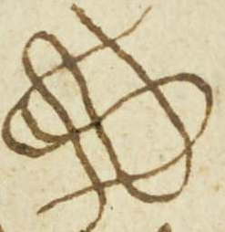
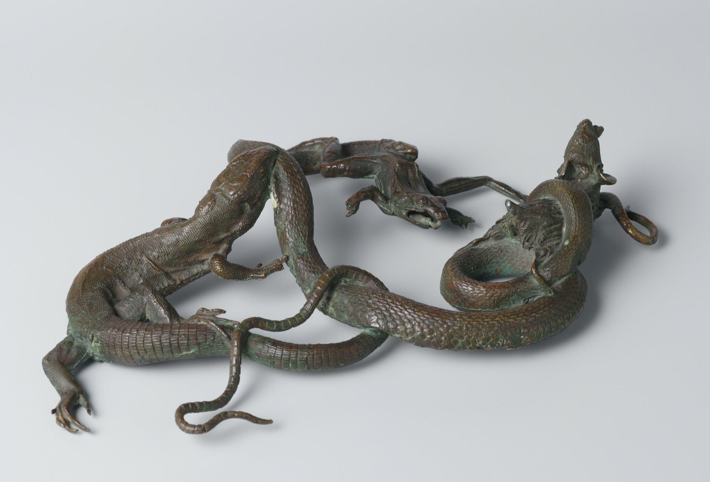
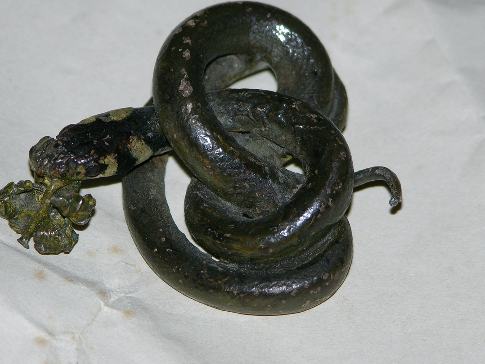
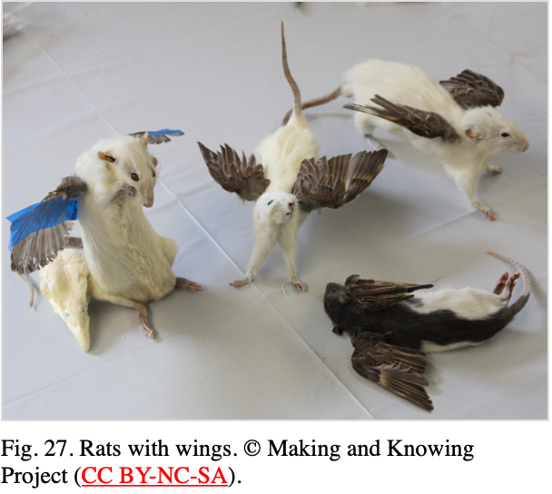

# Understanding Natural Things in the World and the Workshop

_Anna Christensen_  _Summer 2021_

The lifecasting and preservation practices that appear in [BnF Ms. Fr.
640](https://edition640.makingandknowing.org/) are a window into the understanding of the natural world through
craft practice during the sixteenth century. Animals that appear as
casts or natural historical specimens in the manuscript include frogs
and toads, snakes, lizards, turtles, flies, spiders, beetles, crabs,
crayfish, bats, rats, cats, and birds of various kinds. The attention
paid to these commonplace animals and their representation through craft
practices can shed light on the way nature was imagined and came to be
known during this period. Through certain choices the
author-practitioner makes around the posing, juxtaposition, and display
of his dried animal specimens and life casts, we can begin to get at his
attitude towards representing the natural. More than just seeking to
imitate the natural world, the author-practitioner’s craft reflects both
artistic considerations and attempts to understand how animals interact
with one another and with the world around them.

It becomes clear through reading the manuscript that the
author-practitioner is working with a different set of conceptions about
nature as a category than we typically use today. The question of
whether he has a larger view about what nature is, or whether he is
simply seeking to understand and recreate living things which possess
the quality of being “natural” is not always evident. Isabella
Lores-Chavez, in her paper “[Imitating Raw Nature](https://edition640.makingandknowing.org/#/essays/ann_045_fa_16),” describes the author’s orientation towards the natural world as
primarily focused on uncovering a set of processes of creation which
could then be imitated. Her analysis of the author-practitioner’s use of
terminology concludes that he discusses living things as possessing a
quality of “the natural” (perhaps in reference to the forces that shaped
them) rather than simply belonging to the category of “nature.” She
notes that often the author’s use of terminology seems to locate nature
in the raw material of a thing and to highly value the physical object
as representation or accretion of natural properties.

The natural history and lifecasting projects that the author of the
manuscript lays out are reminiscent of the work of other artists of the
Renaissance such as Bernard Palissy (c.1510-c.1589) and Wenzel Jamnitzer
(c.1507-1585), who created elaborate scenes of ceramic and metal animals
from lifecasts, often to decorate various forms of tableware. These
forms of artistic practice were both decorative and natural historical,
often seeking to blur the boundaries between the work of the human hand
and that of nature. While the lifecasting instructions laid out by the
author of our manuscript tend not to be explicitly situated as part of a
grander decorative project, they do seem to combine aesthetic
sensibilities with attempts to express knowledge about nature. As Pamela
Smith points out, the practices described in this manuscript contain
uniquely “extensive observations of animal behavior,” often connected to
its instructions on lifecasting.[^1]

<table>
<colgroup>
<col style="width: 100%" />
</colgroup>
<thead>
<tr class="header">
<th>

Attributed to Bernard Palissy (French, about 1510 - 1590), <em>Oval Basin</em>, about 1550, Lead-glazed earthenware, 47.9 × 36.8 cm (18 7/8 × 14 1/2 in.), 88.DE.63, The J. Paul Getty Museum, Los Angeles
</th>
</tr>
</thead>
<tbody>
</tbody>
</table>

In some instances, the author of the manuscript explicitly bases his
choices about display of animals on practical aesthetic concerns. The
author in his entry “Various animals entwined” (folio 133v) notes, “You
can entwine a snake with a lizard, one biting the other, or a snake that
eats a frog or a wall lizard & suchlike. . . These entwinings are also
made to cover a wound or fault in the animals, which one usually wounds
when one catches them.” The author at other points suggests one might
want to cast “female lizards entwined while biting each other” or
“snakes bound together in embraces of love” when they are small (folio
122r).

<table>
<colgroup>
<col style="width: 100%" />
</colgroup>
<thead>
<tr class="header">
<th>

Illustration from Ms. Fr. 640, folio 122r, showing the arrangement of snakes for molding
</th>
</tr>
</thead>
<tbody>
</tbody>
</table>

While the author explicitly points out how the choice to pose multiple
lifecast specimens together can be practical in nature, he does often
mention the difficulty of uncovering (removing from the mold) certain
entanglements like the entwined female lizards. (On practical concerns
around casting a lizard, see Andrew Lacey and Siân Lewis,
"[In Pursuit of Magic](https://edition640.makingandknowing.org/#/essays/ann_501_ad_20)."
The fact that such arrangements of multiple animals would typically make
the casting and mold-removal process more difficult than casting a
single animal, indicates that it has a value other than the practical
one of covering what the author-practitioner refers to as
“imperfections,” such as wounds in the animals that result from how they
have been captured or killed.

<table>
<colgroup>
<col style="width: 100%" />
</colgroup>
<thead>
<tr class="header">
<th>

Snake, lizard, frog and mouse, anonymous, c. 1550 - c. 1599 via Rijksmuseum database, http://hdl.handle.net/10934/RM0001.COLLECT.474284
</th>
</tr>
</thead>
<tbody>
</tbody>
</table>

The vision of the natural world that this variety of poses presents is
one that runs along a spectrum from violent antipathy at one end to
affectionate sympathy at the other. In fact, this view is further laid
out in the next entry in the manuscript. In the entry “Flower in the
mouth of the snake,” (folio 122r) the author suggests, “If you want to
put in the mouth of the snake some flower or some branch of a plant
which contains the antidote against its bite, take a little branch, as
best arranged as you can find, & pose its stem into its mouth.” The
juxtaposition of a snake with a harmless flower, or with the botanical
antidote to its own venom, suggests a natural world that exists as a
source of danger as well as of aesthetic pleasure, and where naturally
occurring poisons have naturally occurring antidotes. (See also: Fabien
Noirot’s essay on lifecast snakes, "[Molding, Modeling, and Repairing: Lifecast Snakes Modeled in Black Wax](https://edition640.makingandknowing.org/#/essays/ann_504_ad_20).")

The association of snakes and their venom with antidotes to poison
during this period is reflected in other objects of human artifice such
as the coral tree described by Martin Kemp which had “serpents’ tongues”
(really fossil sharks’ teeth) hanging from its branches, which could be
dipped in food or drink to act against poison. Kemp points to objects
such as these as “a conscious blurring of the demarcation between the
products of nature and man.”[^2]

<table>
<colgroup>
<col style="width: 100%" />
</colgroup>
<thead>
<tr class="header">
<th>

Lifecast snake with plant in its mouth, Peter Kuster, Ewer and Basin, ca. 1550. Gilded silver, cast, chased, and partially painted. Cathedral Treasury, Dubrovnik, Croatia. Photo: Pamela H. Smith.
</th>
</tr>
</thead>
<tbody>
</tbody>
</table>

In addition to understanding and representing nature, the
author-practitioner seeks to influence, and even modify, nature. The
author provides a particularly compelling picture of the ability of
human artifice to both imitate and influence nature in his entry on
“Catching birds” (folio 160v). After instructing the reader to skin
birds after they have molted in winter and to dry them out and stuff
them, he says “Then arrange them on the trees, & have someone who sings,
& you will gather them & catch many.” The image of dozens of stuffed
birds tied to a tree, with a singer hiding below while trying to entice
live birds to land is a distinctly comical one. But the
author-practitioner seems to take it in all seriousness as a way to use
natural historical specimens to beget a meal, or perhaps more natural
historical specimens.

The entry “Animals dried in an oven” (folio 130r), begins to hint at
practices that go beyond the imitation of nature and move into the realm
of imagination. After describing how to dry and display a small cat, the
author notes, “One gives it a painted tongue, horns, wings & similar
fancies. Thus for rats & all animals.” (For more on this entry, see
Divya Anantharaman’s essay, "[Animals Dried in an Oven](https://edition640.makingandknowing.org/#/essays/ann_502_ad_20).")

<table>
<colgroup>
<col style="width: 100%" />
</colgroup>
<thead>
<tr class="header">
<th>

Taxidermied rats with wings, © Making and Knowing Project (<a href="https://creativecommons.org/licenses/by-nc-sa/4.0/"><u>CC BY-NC-SA</u></a>).
</th>
</tr>
</thead>
<tbody>
</tbody>
</table>

Though moving away from representative nature, this practice is still, I
would argue, a natural historical one. Here the author-practitioner is
exploring the power of the human hand to enhance natural objects and
hybridize species, an artistic project not uncommon during the sixteenth
century as new and strange animals were encountered and imagined in the
conquest of the Americas[^3] and as books such as Ovid’s *Metamorphosis*
were widely read. This project, along with the lifecasts that the
author-practitioner makes, can together be characterized as part of an
effort to “demonstrat\[e\] the human ability to imitate the
transformative powers of nature.” [^4] In seeking to push the boundaries
of what nature can be, the author-practitioner is still investigating
what nature is, and how it functions in tandem with and in relation to
humanity. What the author of Ms. Fr. 640 brings to these questions is a
work that uniquely combines observation and care of live animals with
detailed instructions in lifecasting and occasionally taxidermy, and
subsequent suggestions for how to pose the animals of interest that
point to observations about their role in nature. It is through these
ideas about how crafted animals should be posed that the
author-practitioner’s observations of life become melded with the art of
the human hand, by which evidence of both nature and craft are
displayed.

## Bibliography

[^1] Pamela H. Smith, “In the Workshop of History: Making, Writing, and
Meaning,” *West 86th 19*, no. 1 (2012): 4-31.

[^2] Martin Kemp, “‘Wrought by No Artist’s Hand’: The Natural, the
Artificial, the Exotic, and the Scientific in Some Artifacts from the
Renaissance,” in *Reframing the Renaissance: Visual Culture in Europe
and Latin America, 1450-1650*, ed. Claire Farago (New Haven: Yale
University Press, 1995).

[^3] Dániel Margócsy, “The Camel's Head: Representing Unseen Animals in
Sixteenth-century Europe,” in Nederlands *Kunsthistorisch Jaarboek (NKJ)
/ Netherlands Yearbook for History of Art 61* (2011): 61-85.

[^4] Pamela H. Smith and Tonny Beentjes, “Nature and Art, Making and
Knowing: Reconstructing Sixteenth-Century Life-Casting Techniques,”
*Renaissance Quarterly 63*, no. 1 (2010): 128-79.
