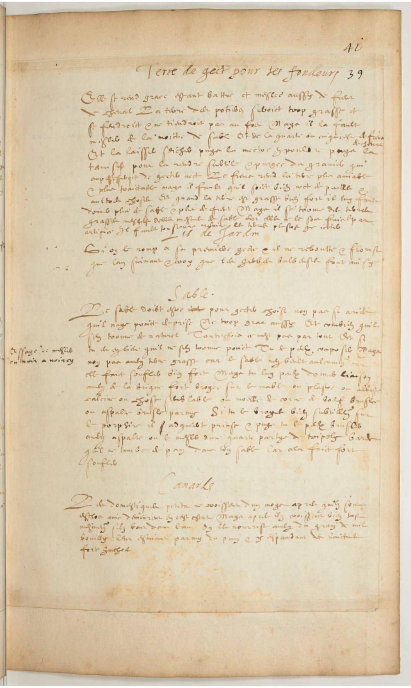
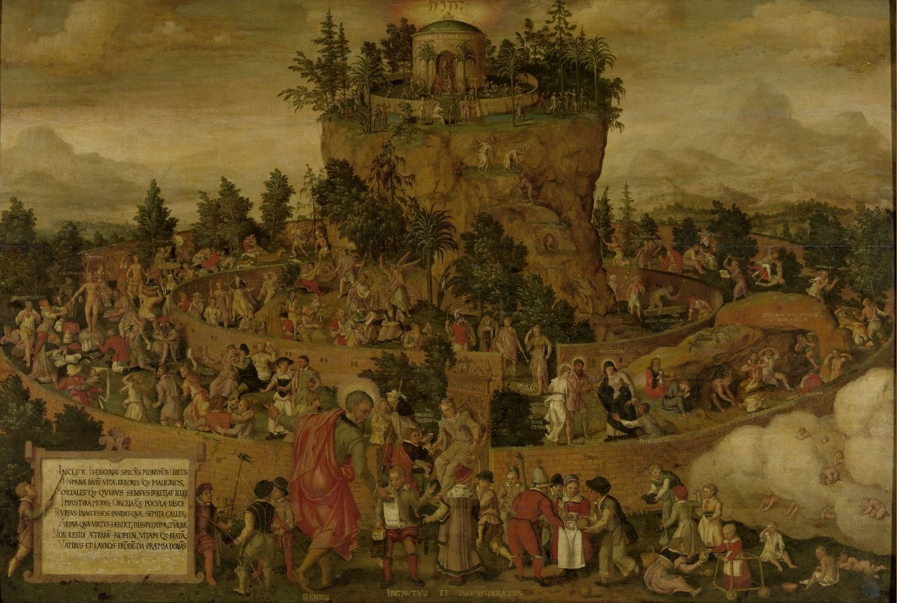
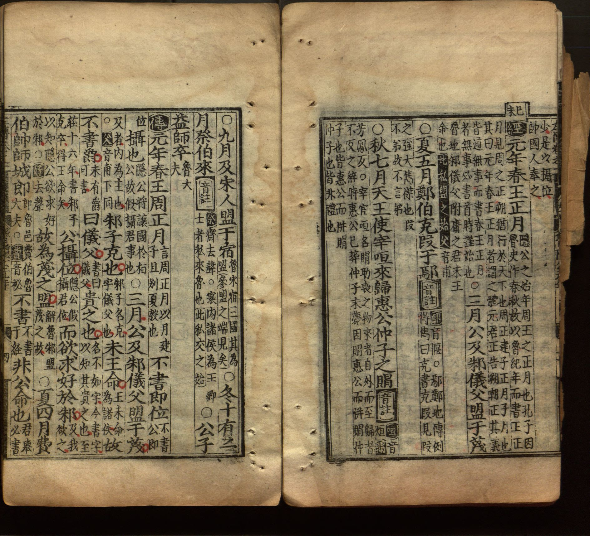
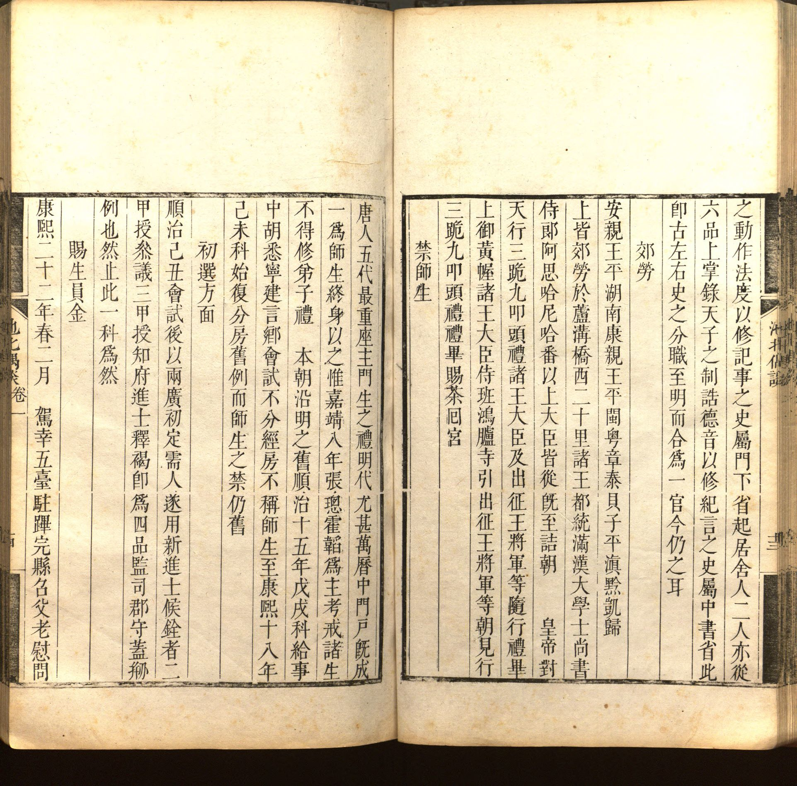

# Was Ms. Fr. 640 Intentionally Disorganized?
_Mackenzie Fox_  _Summer 2021_

When browsing through the wide range of how-to instructions in Ms. Fr.
640, it is often frustratingly unclear why the author-practitioner chose
to address such disparate topics in a single text, or why he chose to
arrange them in such an apparently random way. Why, for instance, does
he, in the space of a single page, give advice on how to prepare earth
for making molds to cast metal, record an observation about the ways in
which garden lilies grow and flower, offer yet further advice on the
appropriate type of earth for use in casting, and, finally, discuss the
rate at which ducklings grow and how one should feed them?[^1] (See image
below for the page in question, fol. [41r](https://edition640.makingandknowing.org/#/folios/41r/f/41r/tl)) Does he perceive a relationship
between the topics covered in these entries? Was he simply jotting down
information as it occurred to him as he went about his life? Was Ms. Fr.
640 a work in progress that the author intended to rearrange at a later
date before publication or wider
circulation?

As these questions suggest, it is not clear how much importance — let
alone what sort of importance — should be ascribed to the coverage and
organization of the text in its received state given how little we know
about the author-practitioner and his motivations in writing the text.
In the blog post that follows, I explore one intriguing possibility,
i.e., that the text was intentionally miscellaneous or disorganized. I
first briefly introduce the genre of the “miscellany,” that is, of
miscellaneous texts with little obvious structure or organization, and
highlight the remarkably similar ways in which miscellanies in
Renaissance Europe and Song Dynasty China (970-1279 CE) seem to have
emerged historically and to have troubled scholars in the present
looking to understand their significance for intellectual history.
Having established a baseline, I ask whether it is useful to think of
Ms. Fr. 640 as a miscellany, and whether the author-practitioner’s
choice of form might, indirectly, at least, suggest something about his
motivations in compiling it.

\_\_\_\_\_\_\_

As their name implies, “miscellanies” are, broadly defined, texts that
contain a wide range of information and yet lack clear thematic
structure or categorization of that information. In the context of the
European Renaissance, the historian Neil Kenny has suggested that
miscellanies were, as a category, defined in contrast to a more
prestigious and prevalent genre: the encyclopedia. [^2] Renaissance
encyclopedias were not the alphabetical reference texts that we are
familiar with today (let alone the searchable, digital counterparts of
such texts like Wikipedia); instead, they were intended, as their name
reflects, to contain an entire “circle of learning,” or a complete
assemblage of all the knowledge an educated man ought to know. It was,
then, their lack of concern with (and even enthusiasm for not)
presenting information as part of a coherent, curated program that made
miscellanies so utterly unlike encyclopedias.

For Kenny, this difference in how encyclopedias and miscellanies arrange
information reflects an intellectual rather than merely generic
division: between the encyclopedic approach to knowledge (or
encyclopedism) and the miscellaneous approach. Encyclopedism, as Kenny
presents it, valued system. In arranging knowledge to form a complete
circle of learning, those of the encyclopedic bent sought not merely to
provide an educational program (though they did seek this), but also to
arrange knowledge in a way that, as they saw it, reflected “the inner
structure both of the world and the human mind.”[^3] By contrast, the
miscellaneous approach forswore such efforts at systematic,
metaphysically significant organization. Rather than attempt to collect
universal and essential truths, miscellanies often focus on the
particular and impermanent. For these reasons, Kenny often presents
miscellanies as offering a direct challenge to the encyclopedic model;
they seem to invert or reject the model’s most essential values of
system and philosophical coherence. Indeed, many miscellanies explicitly
challenge the encyclopedic approach, though, as Olivia Branscum notes in
her essay for the edition of Ms. Fr. 640, *Secrets of Craft and Nature*,
“others simply offer alternatives to that way of seeing the world.”[^4]

In light of this context, it seems reasonable to ask: should we think of
Ms. Fr. 640 as a miscellany? By arranging his material as haphazardly as
he does, was the author-practitioner offering an alternative to the
encyclopedic approach to knowledge, or even taking a stance on the side
of the miscellaneous against it? As Vera Keller suggests in her essay
for the edition, there are reasons to believe both that the
author-practitioner was self-consciously participating in a pan-European
discourse,[^5] and that he viewed his text and its approach to knowledge
as distinct from and likely to be dismissed by the mainstream.[^6] Keller
also notes that the author-practitioner refers to a well-known
educational text, the *Tablet of Cebes*, that, though it had been lost,
had become a symbol of hierarchical division between different sorts of
knowledge, apparently dismissively; he writes: “Tablet of Cebes, idle,
but the workshop represents all things active,”[^7] suggesting that he
rejected its placement of philosophy atop all other forms of knowledge,
including the practical sort with which he was chiefly concerned.

<table>
<colgroup>
<col style="width: 100%" />
</colgroup>
<thead>
<tr class="header">
<th>

Fig. 2. <em>Tabula Cebetis (The Tabula of Cebes or The Journey of Human Life)</em>, Netherlandish, 1573. Oil on panel, 119.5 x 177 cm. Rijksmuseum, Amsterdam, SK-A-2372. Vera Keller describes the image as follows: “This Christianized version of the <em>Tablet of Cebes</em> shows the temple of divine wisdom towering over the landscape. In this version, the mechanical arts (<em>artes mechanicae</em>), symbolized by figures spinning, chopping wood, and working at a forge, are located surprisingly deep within the structure of learning, within the second wall to the right. They have not yet begun the ascent to more abstract knowledge, however.”[^8]

Permalink: <a href="http://hdl.handle.net/10934/RM0001.COLLECT.4688"><u>http://hdl.handle.net/10934/RM0001.COLLECT.4688</u></a> (<a href="https://creativecommons.org/publicdomain/zero/1.0/"><u>CC0 1.0</u></a>).
</th>
</tr>
</thead>
<tbody>
</tbody>
</table>

To reject the hierarchy of knowledge represented by the *Tablet of
Cebes* is not the same, however, as objecting to the systematization of
knowledge characteristic of encyclopedism. It does not seem to be the
case that the author-practitioner harbors the same sort of resentment
towards the encyclopedists or to organization; if he does, at least, he
does not express it explicitly. Moreover, despite the often haphazard
arrangement of the entries in the text, there are sections where a
surprising degree of thematic unity can be spotted. From fol. [21r](https://edition640.makingandknowing.org/#/folios/21r/f/21r/tl)
through [28r](https://edition640.makingandknowing.org/#/folios/28r/f/28r/tl), there is an unbroken succession of entries to do with
cannons and gunpowder weapons. From fol. [33r](https://edition640.makingandknowing.org/#/folios/33r/f/33r/tl) through [36r](https://edition640.makingandknowing.org/#/folios/36r/f/36r/tl), there is a similarly consistent stretch of entries that have to do with tricks.[^9]
Even in the example cited at the beginning of this post, two entries on
the same subject — the best sort of earth to use for casting — appear
quite near each other, though quite different sorts of information are
interspersed between them. We see, then, evidence that the
author-practitioner does not seem to have been self-consciously avoiding
thematic arrangement, even if he was not consistent in pursuing it
either. In short, there is nothing about this sort of organization that
suggests a belief that all of the varieties of knowledge covered should
be understood through the lens of a particular overarching theory or
that they are intended to form part of a circle of learning. On the
other hand, there is also nothing to suggest deliberate opposition to
attempts to do so. As Olivia Branscum notes, the text thus seems to be
irreducible to either an encyclopedic or miscellaneous text, as it
contains elements characteristic of both genres without obviously
committing itself to one or the other.[^10] How should we make sense of
Ms. Fr. 640 in light of this? As a means of working towards an answer,
it may be useful to briefly turn to a remarkably similar puzzle faced by
historians of Song Dynasty (960-1279 CE) China working to make sense of
miscellany-like texts that emerged quite outside of the European
Renaissance context.

\_\_\_\_\_\_\_

In some ways not unlike European Renaissance miscellanies, the
miscellany-like genre usually referred to as *biji* 筆記 (brush notes)
rose to new prominence during an era (the 11th and 12th centuries)
dominated by intellectual systems.[^11] During the 11th century in
particular, a number of scholars, lamenting the sorry state of learning
and of the world in the present, proposed new, systematic philosophies
through which they proposed to reform this state of affairs. In Song
China, however, intellectuals inclined towards systems and
systematization generally did not compile comprehensive,
encyclopedia-like texts. Instead, they most often expounded their ideas
through commentaries on the five classics, which were said to contain
the wisdom passed down by the sages of antiquity, since lost, that had
provided the basis for life and government during the idealized distant
past they had governed; they are: The Book of Changes 易經, The Book of
Odes 詩經, The Book of Documents 書經, The Book of Rites 禮記, and The
Spring and Autumn Annals 春秋.

<table>
<colgroup>
<col style="width: 100%" />
</colgroup>
<thead>
<tr class="header">
<th>

Fig. 3. Above are two pages from a 16th century printed edition of the semi-canonical <em>Zuo Commentary</em> 左傳 on <em>The Spring and Autumn Annals</em>. The <em>Annals</em> recorded the history of the state of <em>Lu</em> 魯 from 722 to 481 BCE in extremely sparse detail, but, as it was traditionally thought to have been compiled by Confucius, was believed to contain his judgments on politics and morality, if in very oblique ways. The ambiguity left by the extremely sparse text spawned an enormous commentarial tradition that sought to explain its significance, within which the <em>Zuo</em> commentary, first written around the 4th century BCE, came to be revered nearly as much as the <em>Annals</em> itself, as it described the events recorded in the <em>Annals</em> in far more detail than the original text.[^12]

(Reminder: Traditional Chinese texts are read from top to bottom and then from right to left) On the right page and in the first three lines of the left page, all of the large-format characters are taken from the original text of the <em>Annals</em>. (This beginning of this section is marked with the character 經 [classic] against a black background) The large-format characters seen on remainder of the left page (i.e., everything after the character 傳 [tradition; here short for <em>zuozhuan</em> 左傳 or the <em>Zuo Commentary</em>] against a black background) are from the <em>Zuo</em> commentary. The small, half-width characters on each page are commentary written by a later writer, Lin Yaosou 林堯叟 (ND). The format of the text is quite typical; the original text of the classic (including the <em>Zuo Commentary</em> in this case, given its semi-canonical status) appears in larger, darker characters, while the commentary appears in half-sized characters after it. This is an extreme example given that there are essentially two layers of commentary present, but it gives a sense of how much more verbose commentaries could be than the classical texts they were interpreting. Du, Yu, 222-284, Yaosou Lin, Quan Yang, and Chinese Rare Book Collection. <em>Chun qiu Zuo zhuan: san shi juan.</em> Chengdu fu zhi fu: yang quan, ming jiajing, between 1523 and 1566, 1523. Image. https://www.loc.gov/item/00510379/.
</th>
</tr>
</thead>
<tbody>
</tbody>
</table>

*Biji*, in contrast to the prestigious classical commentary, were rarely
the sites where authors chose to discuss their views on such lofty
matters as learning and government; instead, they were an informal
context in which intellectuals could record and circulate their thoughts
on nearly any topic that might strike their fancy. To give a sense of
the diverse material that *biji* might contain, some of the most common
sorts of entries include anecdotes about historical figures,
observations about regional customs, philological investigations and,
perhaps most interestingly for our purposes, observations about the
material world and various technologies and craft methods. As an example
of the style and tone typical of entry belonging to this category,
consider the following excerpt taken from an 11th-century *biji* called
*Mingdao Zazhi* 明道雜誌 (Miscellaneous Notes Illuminating the Way). In
it the author, Zhang Lei 張耒 (1054-1114), a prominent official and
literatus, offers a lengthy consideration of whether the pufferfish or
*hetun* 河豚 (commonly known today by its Japanese reading *fugu*) is,
in fact, lethally poisonous, drawing on hearsay from a range of sources
including his friends, courtesans, and “local people,”:

> The pufferfish is an extraordinary delicacy among seafoods, yet
> tradition has it they are poisonous and capable of killing a man and
> that, if one ingests the poison and subsequently feels swelling in
> one’s stomach, it can be resolved so long as one quickly eats some
> filth; otherwise, one will certainly die. Now I have served as prefect
> of Danyang as well as Xuancheng and have seen the people of those
> places eating it. They boil it without any particular method, and
> using only three items \[when doing so\] — artemisia (*louhao)*, reed
> sprouts (*disun)* and cabbage (*songcai*) — is said to be most
> appropriate. They use cabbage to remove its fat and nothing more than
> that, yet none have died. Some say that the locals are accustomed to
> it and thus it does not harm them, but this is absolutely not the
> case…..
>
> 河豚魚，水族之奇味也。而世傳以為有毒，能殺人，中毒則覺脹，亟取不潔食乃可解，不爾必死。餘時守丹陽及宣城，見土人戶食之。其烹煑亦無法，但用簍蒿、荻筍、菘菜三物，云最相宜。用菘以滲其膏耳，而未嘗見死者。或云土人習之，故不傷，是大不然。[^13]

Zhang continues his discussion for several hundred more characters,
concluding without reaching a verdict on the central issue, though
seeming to suspect that the *hetun* is not poisonous after all in light
of the evidence considered; this tentative tone, leaving open the
possibility that further information could alter a preliminary judgment
is also quite common. *Biji* often stop short of definitive judgments.

<table>
<colgroup>
<col style="width: 100%" />
</colgroup>
<thead>
<tr class="header">
<th>

Fig. 4. A pufferfish in a tank at a restaurant in Nagoya, Japan. Wikimedia Commons contributors, "File:Fugu in Tank.jpg," <em>Wikimedia Commons, the free media repository,</em> <a href="https://commons.wikimedia.org/w/index.php?title=File:Fugu_in_Tank.jpg&amp;oldid=485810013"><u>https://commons.wikimedia.org/w/index.php?title=File:Fugu_in_Tank.jpg&amp;oldid=485810013</u></a> (accessed June 21, 2021).
</th>
</tr>
</thead>
<tbody>
</tbody>
</table>

Zhang’s dependence on what he had personally seen or heard (*wenjian*
聞見) in evaluating the claim that *hetun* are poisonous is typical of
Song *biji*, which generally place a high value on knowledge derived
from personal or indirect experience; unlike Ms. Fr. 640, however,
*biji* writers like Zhang rarely seem to have personally conducted
hands-on experiments or trials in verifying claims, perhaps because it
would have been thought uncouth for a scholar to do so. Zhang’s choice
of subject is also typical of the *biji* genre in that, despite its lack
of clear relevance to broader philosophical or intellectual discourse,
it is obviously intriguing to Zhang; *biji*, insofar as their contents
are steered by any clear principle, most often seem to simply follow the
whims and interests of their authors. That Zhang’s whims and interests
are extremely diverse, then, also seems to be typical of *biji* authors.
The *Mingdao Zazhi* includes entries that are simply jokes and puns,
that address philological problems, discussions of physiognomy, tales of
the supernatural, musings on where the best wine in the country is to be
found, etc.

<table>
<colgroup>
<col style="width: 100%" />
</colgroup>
<thead>
<tr class="header">
<th>

Fig. 5. Two pages from a 17th-century <em>biji</em>; the entry-based structure typical of the genre is clearly visible here. Wang, Shizhen, Tinglun Zhi, and Chinese Rare Book Collection. Chi Bei Ou Tan: Er Shi Liu Juan. [Fujian Tingzhou fu: Zhi Tinglun, Qing Kangxi 30 nian, i.e, 1691] Image. https://www.loc.gov/item/2012402038/.
</th>
</tr>
</thead>
<tbody>
</tbody>
</table>

In their free-ranging, unsystematic attention to a wide range of
subjects — and especially their interest in the particular rather than
the universal — *biji* seem quite similar to Renaissance European
miscellanies. Like their European counterparts, they too have often been
interpreted not merely as a genre, but also as emblematic of an
intellectual current that offered a challenge to the systematizing
mainstream of their day. In an article on Zhang Lei’s *Mingdao Zazhi*,
the intellectual historian Peter Bol takes precisely this position, if
tentatively:

> “I shall suggest that the *pi-chi* is as representative of the new
> literati culture of the Sung dynasty as Neo-Confucianism and Wang
> An-shih’s great plans for political reform \[i.e., the grand,
> systematic approaches that characterized the mainstream of 11th
> century thought\] but that it represents a very different stream. It
> stands against philosophical systems and authority from above.” [^14]
>
> “The *pi-chi* is a work as much from the bottom up as the top down,
> but it is not really a work of persuasion at all. Instead, it draws
> attention back to the diversity and particularity of actual phenomena
> and experience and it contradicts the politicians and the philosophers
> who believed they could understand history, the Classics, and man’s
> relation to the cosmos in a systematic way and redirect human affairs
> accordingly.”[^15]

Despite the breadth of his claims, however, Bol offers such speculation
on the basis of almost no clear evidence that Zhang or the other *biji*
writers he discusses actually harbored any resentment toward or desire
to reject systematization. It is, rather, their inversion of the
systematic approach through their un-systematic attention to the
particular that is taken as a sign of *implicit* opposition. Earlier in
his article, however, Bol takes a gentler stance, and makes a suggestion
that might be helpful in making sense of texts like Zhang’s *biji* or
Ms. Fr. 640: “One sometimes suspects that the heterogeneous character of
the *pi-chi* format is a tactic meant to free the author from having to
mean something in a larger sense.”[^16] Perhaps both in Renaissance
Europe and in Song China it was the freedom such genres as the
miscellany and the *biji* permitted to pursue knowledge in provisional,
fragmentary ways in eras when systematicity was highly prized that led
them to become so ubiquitous.[^17]

\_\_\_\_\_\_\_

In sum, then, both in the case of Ms. Fr. 640 and of Song *biji* like
Zhang Lei’s, perhaps the best way forward is, as Olivia Branscum
suggests in her essay on Ms. Fr. 640, to to reject “the choice between
the encyclopedic and miscellaneous paradigms.”[^18] Might it be that in
trying to fit Ms. Fr. 640 into the encyclopedic vs. miscellaneous
discourse — or to frame *biji* as inherently opposed to systematic
approaches to knowledge — we are failing to realize that their authors’
interests lay elsewhere? Although not as satisfying as assigning these
texts and their authors clear positions in intellectual debates, it
might be that the relationship between practical, material knowledge and
overarching, coherent understandings of the cosmos was not much on their
minds. It need not have been that they felt this relationship
unimportant or not worth articulating; they may simply have been content
to leave this articulation for another time or another person, while
pursuing their individual interests with little direct consideration of
their significance to any overarching scheme. Even if this were so,
however, the larger contexts in which texts like Ms. Fr. 640 and Zhang
Lei’s *Mingdao Zazhi* emerged suggest that, if in ways that are still
unclear, these texts were not merely the byproducts of the isolated
whims and interests of their authors. The interest in both Renaissance
Europe and Song China in particulars instead of universals and
description in place of synthesis can be seen as a significant
intellectual shift in the treatment of natural phenomena. What might
have triggered such a shift in such remarkably similar directions in
times and places as far removed as these is a question worthy of further
comparative research.

[^1]: Folio [41r](https://edition640.makingandknowing.org/#/folios/41r/f/41r/tl).

[^2]: Neil Kenny, *The Palace of Secrets: Béroalde de Verville and
Renaissance Conceptions of Knowledge* (Oxford: Clarendon Press, 1991),
43.

[^3]: Ibid., 1.

[^4]: Olivia Branscum, “Necessary Particulars: Philosophical Reflections
on Making and Knowing with Ms. Fr. 640,” In *Secrets of Craft and Nature
in Renaissance France. A Digital Critical Edition and English
Translation of BnF Ms. Fr. 640*, ed. Making and Knowing Project, Pamela
H. Smith, Naomi Rosenkranz, Tianna Helena Uchacz, Tillmann Taape,
Clément Godbarge, Sophie Pitman, Jenny Boulboullé, Joel Klein, Donna
Bilak, Marc Smith, and Terry Catapano (New York: Making and Knowing
Project, 2020),
[<u>https://edition640.makingandknowing.org/#/essays/ann_069_fa_18</u>](https://edition640.makingandknowing.org/#/essays/ann_069_fa_18).
DOI:
[<u>https://www.doi.org/10.7916/2ap7-d967</u>](https://www.doi.org/10.7916/2ap7-d967)

[^5]: “As small peddlers lay open small wares in order to buy richer ones
& to profit more and more, so I, from a desire to learn, am exposing
what little is in my workshop to have it receive, through a common
commerce of letters, much rarer secrets from my benevolent readers” -
BnF Ms. Fr. 640, fol. [162r](https://edition640.makingandknowing.org/#/folios/162r/f/162r/tl), “For the workshop.”

[^6]: Vera Keller, “An Active Form of Education: The Boutique and the
Tablet of Cebes,” In *Secrets of Craft and Nature in Renaissance France.
A Digital Critical Edition and English Translation of BnF Ms. Fr. 640*,
edited by Making and Knowing Project, Pamela H. Smith, Naomi Rosenkranz,
Tianna Helena Uchacz, Tillmann Taape, Clément Godbarge, Sophie Pitman,
Jenny Boulboullé, Joel Klein, Donna Bilak, Marc Smith, and Terry
Catapano (New York: Making and Knowing Project, 2020)
[<u>https://edition640.makingandknowing.org/#/essays/ann_330_ie_19</u>](https://edition640.makingandknowing.org/#/essays/ann_330_ie_19).
DOI:
[<u>https://www.doi.org/10.7916/dy3g-xm85</u>](https://www.doi.org/10.7916/dy3g-xm85)

[^7]: Fol. [166r](https://edition640.makingandknowing.org/#/folios/166r/f/166r/tl).

[^8]: Image, citation, and caption are from Keller, “An Active Form of Education.”

[^9]: It is, however, possible that this concentration of content on a
single set of closely-related topics was the result of the
author-practitioner having consulted another text dealing with or a
practitioner of the craft in question.

[^10]: Branscum, “Necessary Particulars.”

[^11]: *Biji* were already being written more than half a millennium
before the Song, though they became much more common over time and also
changed significantly in character. The miscellany-like character of
many Song *biji* is not as apparent in pre-Song examples of the genre;
an interest in the material world, in particular, seems to have been
new.

[^12]: For more information on the textual history and significance of the <em>Zuo</em> commentary, see the introduction to the text by Durrant, Li, and Schaberg in their recent translation. Stephen W. Durrant, Wai-yee Li, and David Schaberg, trans., <em>Zuo Tradition / Zuozhuan : Commentary on the “Spring and Autumn Annals.”</em> 3 vols., Classics of Chinese Thought (Seattle: University of Washington Press, 2016).

[^13]: “明道雜誌,” Chinese Text Project, accessed June 20, 2021,
https://ctext.org/wiki.pl?if=gb&chapter=865185.

[^14]: Peter Bol, “A Literati Miscellany and Sung Intellectual History:
The Case of Chang Lei’s *Ming-tao tsa-chih*,” *Journal of Sung-Yuan
Studies* 25 (1995), 148.

[^15]: Ibid., 150-1.

[^16]: Ibid., 125.

[^17]: Far more, of course, could be said about the authors of *biji* and
their reasons for writing them, but fuller consideration of the
similarities and differences between European miscellanies and Chinese
*biji* must, for the time being, be left for future work.

[^18]: Branscum, “Necessary Particulars.”
